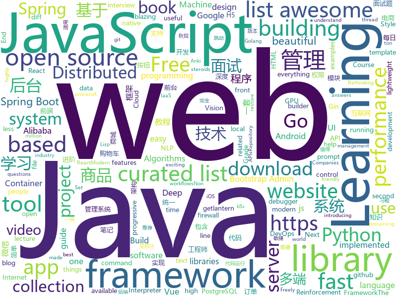

# 2019-03-03
See what the GitHub community is most excited about today.

## python
* [zero](https://github.com/remoteinterview/zero)(**262 stars today**): Zero is a web server to simplify web development.
* [lazynlp](https://github.com/chiphuyen/lazynlp)(**222 stars today**): Library to scrape and clean web pages to create massive datasets.
* [Algorithm_Interview_Notes-Chinese](https://github.com/imhuay/Algorithm_Interview_Notes-Chinese)(**208 stars today**): 2018/2019/校招/春招/秋招/算法/机器学习(Machine Learning)/深度学习(Deep Learning)/自然语言处理(NLP)/C/C++/Python/面试笔记
* [pghoard](https://github.com/aiven/pghoard)(**172 stars today**): PostgreSQL backup and restore service
* [d6tflow](https://github.com/d6t/d6tflow)(**164 stars today**): Python library for building highly effective data science workflows
* [faceswap](https://github.com/deepfakes/faceswap)(**116 stars today**): Non official project based on original /r/Deepfakes thread. Many thanks to him!
* [public-apis](https://github.com/toddmotto/public-apis)(**105 stars today**): A collective list of free APIs for use in software and web development.
* [subsync](https://github.com/smacke/subsync)(**107 stars today**): Automagically synchronize subtitles with video.
* [system-design-primer](https://github.com/donnemartin/system-design-primer)(**97 stars today**): Learn how to design large-scale systems. Prep for the system design interview. Includes Anki flashcards.
* [zulip](https://github.com/zulip/zulip)(**94 stars today**): Zulip server - powerful open source team chat
* [pydis](https://github.com/boramalper/pydis)(**93 stars today**): A redis clone in Python 3 to disprove some falsehoods about performance.
* [bullet](https://github.com/Mckinsey666/bullet)(**88 stars today**): 🚅Beautiful Python prompts made simple. Build a prompt like stacking blocks.
* [migra](https://github.com/djrobstep/migra)(**54 stars today**): Like diff but for PostgreSQL schemas
* [models](https://github.com/tensorflow/models)(**37 stars today**): Models and examples built with TensorFlow
* [AdaBound](https://github.com/Luolc/AdaBound)(**48 stars today**): An optimizer that trains as fast as Adam and as good as SGD.
* [Humpback-Whale-Identification-1st-](https://github.com/earhian/Humpback-Whale-Identification-1st-)(**45 stars today**): https://www.kaggle.com/c/humpback-whale-identification
* [Tensorflow-Cookbook](https://github.com/taki0112/Tensorflow-Cookbook)(**45 stars today**): Simple Tensorflow Cookbook for easy-to-use
* [awesome-python](https://github.com/vinta/awesome-python)(**42 stars today**): A curated list of awesome Python frameworks, libraries, software and resources
* [Python](https://github.com/TheAlgorithms/Python)(**39 stars today**): All Algorithms implemented in Python
* [youtube-dl](https://github.com/rg3/youtube-dl)(**44 stars today**): Command-line program to download videos from YouTube.com and other video sites
* [surreal](https://github.com/SurrealAI/surreal)(**44 stars today**): Open-Source Distributed Reinforcement Learning Framework by Stanford Vision and Learning Lab
* [python-cheatsheet](https://github.com/gto76/python-cheatsheet)(**38 stars today**): Comprehensive Python Cheatsheet
* [gpt-2](https://github.com/openai/gpt-2)(**33 stars today**): Code for the paper "Language Models are Unsupervised Multitask Learners"
* [PySyft](https://github.com/OpenMined/PySyft)(**34 stars today**): A library for encrypted, privacy preserving deep learning
* [keras](https://github.com/keras-team/keras)(**29 stars today**): Deep Learning for humans

## java
* [JavaGuide](https://github.com/Snailclimb/JavaGuide)(**140 stars today**): 【Java学习+面试指南】 一份涵盖大部分Java程序员所需要掌握的核心知识。
* [spring-boot-examples](https://github.com/ityouknow/spring-boot-examples)(**135 stars today**): about learning Spring Boot via examples. Spring Boot 教程、技术栈示例代码，快速简单上手教程。
* [advanced-java](https://github.com/doocs/advanced-java)(**49 stars today**): 😮互联网 Java 工程师进阶知识完全扫盲
* [bubble-navigation](https://github.com/gauravk95/bubble-navigation)(**51 stars today**): 🎉[Android Library] A light-weight library to easily make beautiful Navigation Bar with ton of🎨customization option.
* [fescar](https://github.com/alibaba/fescar)(**46 stars today**): 🔥Fescar is an easy-to-use, high-performance, java based, open source distributed transaction solution.
* [spring-boot](https://github.com/spring-projects/spring-boot)(**34 stars today**): Spring Boot
* [fisher](https://github.com/fanxinglong/fisher)(**33 stars today**): 基于Spring cloud Alibaba,Oauth2,基于VUE的后台权限管理框架,集成了基于MQ的可靠消息的分布式事务解决方案。
* [mall](https://github.com/macrozheng/mall)(**29 stars today**): mall项目是一套电商系统，包括前台商城系统及后台管理系统，基于SpringBoot+MyBatis实现。 前台商城系统包含首页门户、商品推荐、商品搜索、商品展示、购物车、订单流程、会员中心、客户服务、帮助中心等模块。 后台管理系统包含商品管理、订单管理、会员管理、促销管理、运营管理、内容管理、统计报表、财务管理、权限管理、设置等模块。
* [JGrowing](https://github.com/javagrowing/JGrowing)(**31 stars today**): Java is Growing up but not only Java。Java成长路线，但学到不仅仅是Java。
* [spring-framework](https://github.com/spring-projects/spring-framework)(**23 stars today**): Spring Framework
* [tutorials](https://github.com/eugenp/tutorials)(**17 stars today**): The "REST With Spring" Course:
* [DoraemonKit](https://github.com/didi/DoraemonKit)(**25 stars today**): 简称 "DoKit" 。一款功能齐全的客户端（ iOS 、Android ）研发助手，你值得拥有。
* [elasticsearch](https://github.com/elastic/elasticsearch)(**19 stars today**): Open Source, Distributed, RESTful Search Engine
* [Magisk](https://github.com/topjohnwu/Magisk)(**21 stars today**): A Magic Mask to Alter Android System Systemless-ly
* [Java](https://github.com/TheAlgorithms/Java)(**19 stars today**): All Algorithms implemented in Java
* [incubator-dubbo](https://github.com/apache/incubator-dubbo)(**19 stars today**): Apache Dubbo (incubating) is a high-performance, java based, open source RPC framework.
* [SpringCloudLearning](https://github.com/forezp/SpringCloudLearning)(**14 stars today**): 《史上最简单的Spring Cloud教程源码》
* [Android_Universal_Widgets](https://github.com/lqfGaara/Android_Universal_Widgets)(**20 stars today**): 用于购物车添加或者减少按钮、点击弹窗选择按钮
* [miaosha](https://github.com/qiurunze123/miaosha)(**18 stars today**): ⭐⭐⭐⭐秒杀系统设计与实现.互联网工程师进阶与分析🙋🐓
* [arthas](https://github.com/alibaba/arthas)(**17 stars today**): Alibaba Java Diagnostic Tool Arthas/Alibaba Java诊断利器Arthas
* [kboot](https://github.com/kauuze/kboot)(**15 stars today**): 
* [assertj-core](https://github.com/joel-costigliola/assertj-core)(**19 stars today**): AssertJ is a library providing easy to use rich typed assertions
* [tech-weekly](https://github.com/mercyblitz/tech-weekly)(**18 stars today**): 「小马哥技术周报」
* [guava](https://github.com/google/guava)(**16 stars today**): Google core libraries for Java
* [redi-dev](https://github.com/irany666/redi-dev)(**16 stars today**): 从0到1敏捷迭代开发架构,适用于办公OA,电商APP后台,APP网关,是目前公司正在用的一套架构

## unknown
* [distsys-class](https://github.com/aphyr/distsys-class)(**234 stars today**): Class materials for a distributed systems lecture series
* [Awesome-Design-Tools](https://github.com/LisaDziuba/Awesome-Design-Tools)(**217 stars today**): The best design tools for everything.
* [Micro8](https://github.com/Micropoor/Micro8)(**147 stars today**): Gitbook
* [CS-Notes](https://github.com/CyC2018/CS-Notes)(**100 stars today**): 😋技术面试必备基础知识
* [awesome-mental-health](https://github.com/dreamingechoes/awesome-mental-health)(**106 stars today**): A curated list of awesome articles, websites and resources about mental health in the software industry.
* [the-book-of-secret-knowledge](https://github.com/trimstray/the-book-of-secret-knowledge)(**62 stars today**): ⭐️A collection of inspiring lists, manuals, cheatsheets, blogs, hacks, one-liners, cli/web tools and more.
* [100-Days-Of-ML-Code](https://github.com/Avik-Jain/100-Days-Of-ML-Code)(**61 stars today**): 100 Days of ML Coding
* [How-To-Secure-A-Linux-Server](https://github.com/imthenachoman/How-To-Secure-A-Linux-Server)(**59 stars today**): An evolving how-to guide for securing a Linux server.
* [awesome](https://github.com/sindresorhus/awesome)(**47 stars today**): 😎Awesome lists about all kinds of interesting topics
* [Awesome-WAF](https://github.com/0xInfection/Awesome-WAF)(**50 stars today**): 🔥A curated list of awesome web application firewall (WAF) stuff.
* [gitignore](https://github.com/github/gitignore)(**33 stars today**): A collection of useful .gitignore templates
* [You-Dont-Know-JS](https://github.com/getify/You-Dont-Know-JS)(**44 stars today**): A book series on JavaScript. @YDKJS on twitter.
* [architect-awesome](https://github.com/xingshaocheng/architect-awesome)(**38 stars today**): 后端架构师技术图谱
* [nginx-quick-reference](https://github.com/trimstray/nginx-quick-reference)(**37 stars today**): ⚡️These notes describes how to improve Nginx performance, security and other important things; @ssllabs A+ 100%.
* [free-programming-books](https://github.com/EbookFoundation/free-programming-books)(**32 stars today**): 📚Freely available programming books
* [hosts](https://github.com/googlehosts/hosts)(**30 stars today**): 镜像：https://coding.net/u/scaffrey/p/hosts/git
* [deep-learning-drizzle](https://github.com/kmario23/deep-learning-drizzle)(**30 stars today**): Drench yourself in Deep Learning, Reinforcement Learning, Machine Learning, Computer Vision, and NLP by learning from these exciting lectures!!
* [Pentest_Interview](https://github.com/Leezj9671/Pentest_Interview)(**29 stars today**): 个人准备渗透测试和安全面试的经验，和部分厂商的面试题
* [awesome-vue](https://github.com/vuejs/awesome-vue)(**27 stars today**): 🎉A curated list of awesome things related to Vue.js
* [trackerslist](https://github.com/ngosang/trackerslist)(**26 stars today**): An updated list of public BitTorrent trackers
* [Daily-Interview-Question](https://github.com/Advanced-Frontend/Daily-Interview-Question)(**26 stars today**): 工作日每天一道前端大厂面试题，祝大家天天进步，一年后会看到不一样的自己。
* [project-based-learning](https://github.com/tuvtran/project-based-learning)(**26 stars today**): Curated list of project-based tutorials
* [statrethinking_winter2019](https://github.com/rmcelreath/statrethinking_winter2019)(**23 stars today**): Statistical Rethinking course at MPI-EVA from Dec 2018 through Feb 2019
* [awesome-for-beginners](https://github.com/MunGell/awesome-for-beginners)(**20 stars today**): A list of awesome beginners-friendly projects.

## javascript
* [hiring-without-whiteboards](https://github.com/poteto/hiring-without-whiteboards)(**275 stars today**): ⭐️Companies that don't have a broken hiring process
* [Motrix](https://github.com/agalwood/Motrix)(**140 stars today**): A full-featured download manager.
* [gpu.js](https://github.com/gpujs/gpu.js)(**135 stars today**): GPU Accelerated JavaScript
* [ColorUI](https://github.com/weilanwl/ColorUI)(**123 stars today**): 鲜亮的高饱和色彩，专注视觉的小程序组件库
* [cleave.js](https://github.com/nosir/cleave.js)(**97 stars today**): Format input text content when you are typing...
* [vue](https://github.com/vuejs/vue)(**84 stars today**): 🖖Vue.js is a progressive, incrementally-adoptable JavaScript framework for building UI on the web.
* [grapesjs](https://github.com/artf/grapesjs)(**88 stars today**): Free and Open source Web Builder Framework. Next generation tool for building templates without coding
* [30-seconds-of-code](https://github.com/30-seconds/30-seconds-of-code)(**62 stars today**): Curated collection of useful JavaScript snippets that you can understand in 30 seconds or less.
* [react](https://github.com/facebook/react)(**53 stars today**): A declarative, efficient, and flexible JavaScript library for building user interfaces.
* [create-react-app](https://github.com/facebook/create-react-app)(**53 stars today**): Set up a modern web app by running one command.
* [box-ui-elements](https://github.com/box/box-ui-elements)(**57 stars today**): Box UI Elements
* [taro](https://github.com/NervJS/taro)(**51 stars today**): 多端统一开发框架，支持用 React 的开发方式编写一次代码，生成能运行在微信/百度/支付宝/字节跳动小程序、H5、React Native 等的应用。 https://taro.js.org/
* [frenchkiss.js](https://github.com/koala-interactive/frenchkiss.js)(**52 stars today**): The blazing fast lightweight i18n module for javascript
* [omi](https://github.com/Tencent/omi)(**46 stars today**): 下一代前端统一框架 - 支持桌面Web、移动H5和小程序 - Next Front End Framework
* [bootstrap](https://github.com/twbs/bootstrap)(**31 stars today**): The most popular HTML, CSS, and JavaScript framework for developing responsive, mobile first projects on the web.
* [axios](https://github.com/axios/axios)(**39 stars today**): Promise based HTTP client for the browser and node.js
* [javascript](https://github.com/airbnb/javascript)(**36 stars today**): JavaScript Style Guide
* [javascript-algorithms](https://github.com/trekhleb/javascript-algorithms)(**33 stars today**): 📝Algorithms and data structures implemented in JavaScript with explanations and links to further readings
* [node](https://github.com/nodejs/node)(**31 stars today**): Node.js JavaScript runtime✨🐢🚀✨
* [chameleon](https://github.com/didi/chameleon)(**36 stars today**): 🦎一套代码运行多端，一端所见即多端所见
* [wechatBot](https://github.com/gengchen528/wechatBot)(**34 stars today**): 微信每日说，每日自动发送微信消息
* [pack](https://github.com/pikapkg/pack)(**35 stars today**): 📦⚡️npm package building, reimagined. https://www.pikapkg.com/blog/introducing-pika-pack/
* [git-history](https://github.com/pomber/git-history)(**32 stars today**): Quickly browse the history of a file from any git repository
* [leon](https://github.com/leon-ai/leon)(**31 stars today**): 🧠 Leon is your open-source personal assistant.
* [gatsby](https://github.com/gatsbyjs/gatsby)(**27 stars today**): Build blazing fast, modern apps and websites with React

## html
* [javascript-tutorial-en](https://github.com/iliakan/javascript-tutorial-en)(**162 stars today**): Modern JavaScript Tutorial
* [javascript-tutorial-zh](https://github.com/xitu/javascript-tutorial-zh)(**34 stars today**): Modern JavaScript Tutorial
* [stisla](https://github.com/stisla/stisla)(**22 stars today**): Free Bootstrap Admin Template
* [flutter-in-action](https://github.com/flutterchina/flutter-in-action)(**18 stars today**): 《Flutter实战》电子书
* [free-for-dev](https://github.com/ripienaar/free-for-dev)(**15 stars today**): A list of SaaS, PaaS and IaaS offerings that have free tiers of interest to devops and infradev
* [AdminLTE](https://github.com/almasaeed2010/AdminLTE)(**9 stars today**): AdminLTE - Free Premium Admin control Panel Theme Based On Bootstrap 3.x
* [deeplearning_ai_books](https://github.com/fengdu78/deeplearning_ai_books)(**11 stars today**): deeplearning.ai（吴恩达老师的深度学习课程笔记及资源）
* [Front-end-Developer-Interview-Questions](https://github.com/h5bp/Front-end-Developer-Interview-Questions)(**11 stars today**): A list of helpful front-end related questions you can use to interview potential candidates, test yourself or completely ignore.
* [styleguide](https://github.com/google/styleguide)(**8 stars today**): Style guides for Google-originated open-source projects
* [ionic](https://github.com/ionic-team/ionic)(**9 stars today**): Build amazing native and progressive web apps with open web technologies. One app running on everything🎉
* [coreui-free-bootstrap-admin-template](https://github.com/coreui/coreui-free-bootstrap-admin-template)(**8 stars today**): CoreUI is free bootstrap admin template
* [why-openbsd.rocks](https://github.com/noqqe/why-openbsd.rocks)(**8 stars today**): A website that helps me showing people why OpenBSD rocks
* [nginxconfig.io](https://github.com/valentinxxx/nginxconfig.io)(**7 stars today**): ⚙️NGiИX config generator on steroids💉
* [awesome-IT-films](https://github.com/greybax/awesome-IT-films)(**7 stars today**): 📺A curated list of awesome films about IT & geek people.
* [hugo-academic](https://github.com/gcushen/hugo-academic)(**6 stars today**): The website builder for Hugo. Build and deploy a beautiful website in minutes🚀
* [gentelella](https://github.com/ColorlibHQ/gentelella)(**5 stars today**): Free Bootstrap 3 Admin Template
* [try_git](https://github.com/windyzj/try_git)(****): 
* [Spoon-Knife](https://github.com/octocat/Spoon-Knife)(****): This repo is for demonstration purposes only.
* [electron-api-demos](https://github.com/electron/electron-api-demos)(**5 stars today**): Explore the Electron APIs
* [craftinginterpreters](https://github.com/munificent/craftinginterpreters)(**6 stars today**): Repository for the book "Crafting Interpreters"
* [wysiwyg-editor](https://github.com/froala/wysiwyg-editor)(**5 stars today**): A beautifully designed WYSIWYG HTML Editor based on HTML5.
* [fonts](https://github.com/google/fonts)(**5 stars today**): Font files available from Google Fonts
* [portainer](https://github.com/portainer/portainer)(**5 stars today**): Simple management UI for Docker
* [dragon-book-exercise-answers](https://github.com/fool2fish/dragon-book-exercise-answers)(**5 stars today**): Compilers Principles, Techniques, & Tools (purple dragon book) second edition exercise answers. 编译原理（紫龙书）第2版习题答案。
* [fastText](https://github.com/facebookresearch/fastText)(**5 stars today**): Library for fast text representation and classification.

## go
* [k3s](https://github.com/rancher/k3s)(**179 stars today**): Lightweight Kubernetes. 5 less than k8s.
* [1m-go-tcp-server](https://github.com/smallnest/1m-go-tcp-server)(**60 stars today**): benchmarks for implementation of servers which support 1 million connections
* [1m-go-websockets](https://github.com/eranyanay/1m-go-websockets)(**56 stars today**): handling 1M websockets connections in Go
* [v2ray-core](https://github.com/v2ray/v2ray-core)(**45 stars today**): A platform for building proxies to bypass network restrictions.
* [noverify](https://github.com/VKCOM/noverify)(**46 stars today**): Pretty fast linter (code static analysis utility) for PHP
* [immutable](https://github.com/benbjohnson/immutable)(**42 stars today**): Immutable collections for Go
* [kubernetes](https://github.com/kubernetes/kubernetes)(**35 stars today**): Production-Grade Container Scheduling and Management
* [go](https://github.com/golang/go)(**35 stars today**): The Go programming language
* [lantern](https://github.com/getlantern/lantern)(**35 stars today**): 🔴蓝灯最新版本下载 https://github.com/getlantern/download🔴Lantern Latest Download https://github.com/getlantern/download🔴
* [CovenantSQL](https://github.com/CovenantSQL/CovenantSQL)(**34 stars today**): a SQL database with Blockchain features.
* [hugo](https://github.com/gohugoio/hugo)(**31 stars today**): The world’s fastest framework for building websites.
* [csvdiff](https://github.com/aswinkarthik/csvdiff)(**29 stars today**): A fast diff tool for comparing csv files
* [awesome-go](https://github.com/avelino/awesome-go)(**24 stars today**): A curated list of awesome Go frameworks, libraries and software
* [dive](https://github.com/wagoodman/dive)(**27 stars today**): A tool for exploring each layer in a docker image
* [frp](https://github.com/fatedier/frp)(**22 stars today**): A fast reverse proxy to help you expose a local server behind a NAT or firewall to the internet.
* [gomacro](https://github.com/cosmos72/gomacro)(**23 stars today**): Interactive Go interpreter and debugger with REPL, Eval, generics and Lisp-like macros
* [istio](https://github.com/istio/istio)(**23 stars today**): Connect, secure, control, and observe services.
* [gin](https://github.com/gin-gonic/gin)(**22 stars today**): Gin is a HTTP web framework written in Go (Golang). It features a Martini-like API with much better performance -- up to 40 times faster. If you need smashing performance, get yourself some Gin.
* [containerd](https://github.com/containerd/containerd)(**22 stars today**): An open and reliable container runtime
* [footloose](https://github.com/weaveworks/footloose)(**21 stars today**): Container Machines - Containers that look like Virtual Machines
* [delve](https://github.com/go-delve/delve)(**18 stars today**): Delve is a debugger for the Go programming language.
* [cds](https://github.com/ovh/cds)(**18 stars today**): Enterprise-Grade Continuous Delivery & DevOps Automation Open Source Platform
* [aresdb](https://github.com/uber/aresdb)(**18 stars today**): A GPU-powered real-time analytics storage and query engine.
* [fzf](https://github.com/junegunn/fzf)(**17 stars today**): 🌸A command-line fuzzy finder
* [inlets](https://github.com/alexellis/inlets)(**17 stars today**): Expose your local endpoints to the Internet

## WordCloud

