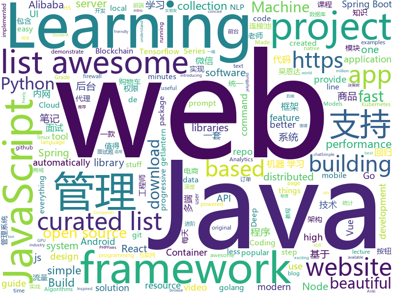

# 2019-03-04
See what the GitHub community is most excited about today.

## python
* [zero](https://github.com/remoteinterview/zero)(**229 stars today**): Zero is a web server to simplify web development.
* [Algorithm_Interview_Notes-Chinese](https://github.com/imhuay/Algorithm_Interview_Notes-Chinese)(**169 stars today**): 2018/2019/校招/春招/秋招/算法/机器学习(Machine Learning)/深度学习(Deep Learning)/自然语言处理(NLP)/C/C++/Python/面试笔记
* [system-design-primer](https://github.com/donnemartin/system-design-primer)(**145 stars today**): Learn how to design large-scale systems. Prep for the system design interview. Includes Anki flashcards.
* [d6tflow](https://github.com/d6t/d6tflow)(**128 stars today**): Python library for building highly effective data science workflows
* [lazynlp](https://github.com/chiphuyen/lazynlp)(**122 stars today**): Library to scrape and clean web pages to create massive datasets.
* [faceswap](https://github.com/deepfakes/faceswap)(**99 stars today**): Non official project based on original /r/Deepfakes thread. Many thanks to him!
* [public-apis](https://github.com/toddmotto/public-apis)(**99 stars today**): A collective list of free APIs for use in software and web development.
* [subsync](https://github.com/smacke/subsync)(**94 stars today**): Automagically synchronize subtitles with video.
* [bullet](https://github.com/Mckinsey666/bullet)(**65 stars today**): 🚅Beautiful Python prompts made simple. Build a prompt like stacking blocks.
* [pghoard](https://github.com/aiven/pghoard)(**64 stars today**): PostgreSQL backup and restore service
* [awesome-python](https://github.com/vinta/awesome-python)(**50 stars today**): A curated list of awesome Python frameworks, libraries, software and resources
* [models](https://github.com/tensorflow/models)(**41 stars today**): Models and examples built with TensorFlow
* [Lihang](https://github.com/SmirkCao/Lihang)(**48 stars today**): Statistical learning methods, 统计学习方法 [李航] 值得反复读. [笔记, 代码, notebook, 参考文献, Errata]
* [youtube-dl](https://github.com/rg3/youtube-dl)(**44 stars today**): Command-line program to download videos from YouTube.com and other video sites
* [zulip](https://github.com/zulip/zulip)(**39 stars today**): Zulip server - powerful open source team chat
* [Tensorflow-Cookbook](https://github.com/taki0112/Tensorflow-Cookbook)(**38 stars today**): Simple Tensorflow Cookbook for easy-to-use
* [CheatSheetSeries](https://github.com/OWASP/CheatSheetSeries)(**38 stars today**): The OWASP Cheat Sheet Series was created to provide a concise collection of high value information on specific application security topics.
* [AdaBound](https://github.com/Luolc/AdaBound)(**38 stars today**): An optimizer that trains as fast as Adam and as good as SGD.
* [Python](https://github.com/TheAlgorithms/Python)(**34 stars today**): All Algorithms implemented in Python
* [keras](https://github.com/keras-team/keras)(**31 stars today**): Deep Learning for humans
* [gpt-2](https://github.com/openai/gpt-2)(**32 stars today**): Code for the paper "Language Models are Unsupervised Multitask Learners"
* [bert](https://github.com/google-research/bert)(**30 stars today**): TensorFlow code and pre-trained models for BERT
* [pydis](https://github.com/boramalper/pydis)(**31 stars today**): A redis clone in Python 3 to disprove some falsehoods about performance.
* [django](https://github.com/django/django)(**25 stars today**): The Web framework for perfectionists with deadlines.
* [magenta](https://github.com/tensorflow/magenta)(**30 stars today**): Magenta: Music and Art Generation with Machine Intelligence

## java
* [JavaGuide](https://github.com/Snailclimb/JavaGuide)(**131 stars today**): 【Java学习+面试指南】 一份涵盖大部分Java程序员所需要掌握的核心知识。
* [spring-boot-examples](https://github.com/ityouknow/spring-boot-examples)(**81 stars today**): about learning Spring Boot via examples. Spring Boot 教程、技术栈示例代码，快速简单上手教程。
* [DoraemonKit](https://github.com/didi/DoraemonKit)(**64 stars today**): 简称 "DoKit" 。一款功能齐全的客户端（ iOS 、Android ）研发助手，你值得拥有。
* [mall](https://github.com/macrozheng/mall)(**48 stars today**): mall项目是一套电商系统，包括前台商城系统及后台管理系统，基于SpringBoot+MyBatis实现。 前台商城系统包含首页门户、商品推荐、商品搜索、商品展示、购物车、订单流程、会员中心、客户服务、帮助中心等模块。 后台管理系统包含商品管理、订单管理、会员管理、促销管理、运营管理、内容管理、统计报表、财务管理、权限管理、设置等模块。
* [advanced-java](https://github.com/doocs/advanced-java)(**47 stars today**): 😮互联网 Java 工程师进阶知识完全扫盲
* [bubble-navigation](https://github.com/gauravk95/bubble-navigation)(**46 stars today**): 🎉[Android Library] A light-weight library to easily make beautiful Navigation Bar with ton of🎨customization option.
* [rocketmq](https://github.com/apache/rocketmq)(**23 stars today**): Mirror of Apache RocketMQ
* [tutorials](https://github.com/eugenp/tutorials)(**30 stars today**): The "REST With Spring" Course:
* [spring-boot](https://github.com/spring-projects/spring-boot)(**32 stars today**): Spring Boot
* [fescar](https://github.com/alibaba/fescar)(**36 stars today**): 🔥Fescar is an easy-to-use, high-performance, java based, open source distributed transaction solution.
* [JGrowing](https://github.com/javagrowing/JGrowing)(**27 stars today**): Java is Growing up but not only Java。Java成长路线，但学到不仅仅是Java。
* [miaosha](https://github.com/qiurunze123/miaosha)(**26 stars today**): ⭐⭐⭐⭐秒杀系统设计与实现.互联网工程师进阶与分析🙋🐓
* [Java](https://github.com/TheAlgorithms/Java)(**23 stars today**): All Algorithms implemented in Java
* [incubator-dubbo](https://github.com/apache/incubator-dubbo)(**23 stars today**): Apache Dubbo (incubating) is a high-performance, java based, open source RPC framework.
* [Android_Universal_Widgets](https://github.com/lqfGaara/Android_Universal_Widgets)(**22 stars today**): 用于购物车添加或者减少按钮、点击弹窗选择按钮
* [spring-cloud-alibaba](https://github.com/spring-cloud-incubator/spring-cloud-alibaba)(**20 stars today**): Spring Cloud Alibaba provides a one-stop solution for application development for the distributed solutions of Alibaba middleware.
* [druid](https://github.com/alibaba/druid)(**18 stars today**): 阿里巴巴数据库事业部出品，为监控而生的数据库连接池。阿里云Data Lake Analytics(https://www.aliyun.com/product/datalakeanalytics )、DRDS、TDDL 连接池powered by Druid
* [Magisk](https://github.com/topjohnwu/Magisk)(**20 stars today**): A Magic Mask to Alter Android System Systemless-ly
* [fisher](https://github.com/fanxinglong/fisher)(**17 stars today**): 基于Spring cloud Alibaba,Oauth2,基于VUE的后台权限管理框架,集成了基于MQ的可靠消息的分布式事务解决方案。
* [kboot](https://github.com/kauuze/kboot)(**18 stars today**): 
* [redi-dev](https://github.com/irany666/redi-dev)(**18 stars today**): 从0到1敏捷迭代开发架构,适用于办公OA,电商APP后台,APP网关,是目前公司正在用的一套架构
* [spring-framework](https://github.com/spring-projects/spring-framework)(**12 stars today**): Spring Framework
* [arthas](https://github.com/alibaba/arthas)(**17 stars today**): Alibaba Java Diagnostic Tool Arthas/Alibaba Java诊断利器Arthas
* [guava](https://github.com/google/guava)(**14 stars today**): Google core libraries for Java
* [elasticsearch](https://github.com/elastic/elasticsearch)(**13 stars today**): Open Source, Distributed, RESTful Search Engine

## unknown
* [distsys-class](https://github.com/aphyr/distsys-class)(**467 stars today**): Class materials for a distributed systems lecture series
* [Awesome-Design-Tools](https://github.com/LisaDziuba/Awesome-Design-Tools)(**127 stars today**): The best design tools for everything.
* [Micro8](https://github.com/Micropoor/Micro8)(**105 stars today**): Gitbook
* [python_interview_question](https://github.com/kenwoodjw/python_interview_question)(**94 stars today**): 关于python的面试题
* [CS-Notes](https://github.com/CyC2018/CS-Notes)(**82 stars today**): 😋技术面试必备基础知识
* [awesome](https://github.com/sindresorhus/awesome)(**71 stars today**): 😎Awesome lists about all kinds of interesting topics
* [gitignore](https://github.com/github/gitignore)(**43 stars today**): A collection of useful .gitignore templates
* [You-Dont-Know-JS](https://github.com/getify/You-Dont-Know-JS)(**53 stars today**): A book series on JavaScript. @YDKJS on twitter.
* [the-book-of-secret-knowledge](https://github.com/trimstray/the-book-of-secret-knowledge)(**55 stars today**): A collection of inspiring lists, manuals, cheatsheets, blogs, hacks, one-liners, cli/web tools and more.
* [free-programming-books](https://github.com/EbookFoundation/free-programming-books)(**40 stars today**): 📚Freely available programming books
* [How-To-Secure-A-Linux-Server](https://github.com/imthenachoman/How-To-Secure-A-Linux-Server)(**43 stars today**): An evolving how-to guide for securing a Linux server.
* [awesome-mental-health](https://github.com/dreamingechoes/awesome-mental-health)(**43 stars today**): A curated list of awesome articles, websites and resources about mental health in the software industry.
* [Awesome-WAF](https://github.com/0xInfection/Awesome-WAF)(**40 stars today**): 🔥A curated list of awesome web application firewall (WAF) stuff.
* [project-based-learning](https://github.com/tuvtran/project-based-learning)(**36 stars today**): Curated list of project-based tutorials
* [100-Days-Of-ML-Code](https://github.com/Avik-Jain/100-Days-Of-ML-Code)(**34 stars today**): 100 Days of ML Coding
* [Daily-Interview-Question](https://github.com/Advanced-Frontend/Daily-Interview-Question)(**37 stars today**): 工作日每天一道前端大厂面试题，祝大家天天进步，一年后会看到不一样的自己。
* [deep-learning-drizzle](https://github.com/kmario23/deep-learning-drizzle)(**34 stars today**): Drench yourself in Deep Learning, Reinforcement Learning, Machine Learning, Computer Vision, and NLP by learning from these exciting lectures!!
* [awesome-for-beginners](https://github.com/MunGell/awesome-for-beginners)(**30 stars today**): A list of awesome beginners-friendly projects.
* [hosts](https://github.com/googlehosts/hosts)(**24 stars today**): 镜像：https://coding.net/u/scaffrey/p/hosts/git
* [architect-awesome](https://github.com/xingshaocheng/architect-awesome)(**27 stars today**): 后端架构师技术图谱
* [awesome-vue](https://github.com/vuejs/awesome-vue)(**21 stars today**): 🎉A curated list of awesome things related to Vue.js
* [trackerslist](https://github.com/ngosang/trackerslist)(**23 stars today**): An updated list of public BitTorrent trackers
* [awesome-nodejs](https://github.com/sindresorhus/awesome-nodejs)(**23 stars today**): ⚡️Delightful Node.js packages and resources
* [awesome-cpp](https://github.com/fffaraz/awesome-cpp)(**22 stars today**): A curated list of awesome C++ (or C) frameworks, libraries, resources, and shiny things. Inspired by awesome-... stuff.

## javascript
* [hiring-without-whiteboards](https://github.com/poteto/hiring-without-whiteboards)(**367 stars today**): ⭐️Companies that don't have a broken hiring process
* [gpu.js](https://github.com/gpujs/gpu.js)(**145 stars today**): GPU Accelerated JavaScript
* [Motrix](https://github.com/agalwood/Motrix)(**124 stars today**): A full-featured download manager.
* [hooks-perf-issues](https://github.com/ryardley/hooks-perf-issues)(**116 stars today**): This repo demonstrates a situation where it is slower to use React hooks than classes
* [vue](https://github.com/vuejs/vue)(**100 stars today**): 🖖Vue.js is a progressive, incrementally-adoptable JavaScript framework for building UI on the web.
* [grpchat](https://github.com/enfipy/grpchat)(**73 stars today**): Chat based on gRPC
* [30-seconds-of-code](https://github.com/30-seconds/30-seconds-of-code)(**63 stars today**): Curated collection of useful JavaScript snippets that you can understand in 30 seconds or less.
* [cleave.js](https://github.com/nosir/cleave.js)(**62 stars today**): Format input text content when you are typing...
* [react](https://github.com/facebook/react)(**55 stars today**): A declarative, efficient, and flexible JavaScript library for building user interfaces.
* [NodeMail](https://github.com/Vincedream/NodeMail)(**53 stars today**): 💗用Node写一个爬虫脚本每天定时给女朋友发一封暖心邮件
* [taro](https://github.com/NervJS/taro)(**54 stars today**): 多端统一开发框架，支持用 React 的开发方式编写一次代码，生成能运行在微信/百度/支付宝/字节跳动小程序、H5、React Native 等的应用。 https://taro.js.org/
* [omi](https://github.com/Tencent/omi)(**52 stars today**): 下一代前端统一框架 - 支持桌面Web、移动H5和小程序 - Next Front End Framework
* [box-ui-elements](https://github.com/box/box-ui-elements)(**50 stars today**): Box UI Elements
* [ColorUI](https://github.com/weilanwl/ColorUI)(**50 stars today**): 鲜亮的高饱和色彩，专注视觉的小程序组件库
* [awesome-mac](https://github.com/jaywcjlove/awesome-mac)(**49 stars today**):  Now we have become very big, Different from the original idea. Collect premium software in various categories.
* [gatsby](https://github.com/gatsbyjs/gatsby)(**44 stars today**): Build blazing fast, modern apps and websites with React
* [pack](https://github.com/pikapkg/pack)(**50 stars today**): 📦⚡️npm package building, reimagined. https://www.pikapkg.com/blog/introducing-pika-pack/
* [bootstrap](https://github.com/twbs/bootstrap)(**38 stars today**): The most popular HTML, CSS, and JavaScript framework for developing responsive, mobile first projects on the web.
* [create-react-app](https://github.com/facebook/create-react-app)(**41 stars today**): Set up a modern web app by running one command.
* [node](https://github.com/nodejs/node)(**39 stars today**): Node.js JavaScript runtime✨🐢🚀✨
* [chameleon](https://github.com/didi/chameleon)(**41 stars today**): 🦎一套代码运行多端，一端所见即多端所见
* [axios](https://github.com/axios/axios)(**38 stars today**): Promise based HTTP client for the browser and node.js
* [git-history](https://github.com/pomber/git-history)(**37 stars today**): Quickly browse the history of a file from any git repository
* [javascript](https://github.com/airbnb/javascript)(**34 stars today**): JavaScript Style Guide
* [leon](https://github.com/leon-ai/leon)(**34 stars today**): 🧠 Leon is your open-source personal assistant.

## html
* [automatic-app-landing-page](https://github.com/emilbaehr/automatic-app-landing-page)(**232 stars today**): A Jekyll theme for automatically generating and deploying landing page sites for mobile apps.
* [javascript-tutorial-en](https://github.com/iliakan/javascript-tutorial-en)(**67 stars today**): Modern JavaScript Tutorial
* [Coursera-ML-AndrewNg-Notes](https://github.com/fengdu78/Coursera-ML-AndrewNg-Notes)(**20 stars today**): 吴恩达老师的机器学习课程个人笔记
* [deeplearning_ai_books](https://github.com/fengdu78/deeplearning_ai_books)(**18 stars today**): deeplearning.ai（吴恩达老师的深度学习课程笔记及资源）
* [evtjs](https://github.com/everitoken/evtjs)(**17 stars today**): API Binding (SDK) for the everiToken blockchain.
* [climanifeste](https://github.com/climanifeste/climanifeste)(**18 stars today**): Manifeste écologique des professionnels de l'informatique
* [javascript-tutorial-zh](https://github.com/xitu/javascript-tutorial-zh)(**19 stars today**): Modern JavaScript Tutorial
* [stisla](https://github.com/stisla/stisla)(**13 stars today**): Free Bootstrap Admin Template
* [learning-area](https://github.com/mdn/learning-area)(**6 stars today**): Github repo for the MDN Learning Area.
* [Spoon-Knife](https://github.com/octocat/Spoon-Knife)(****): This repo is for demonstration purposes only.
* [flutter-in-action](https://github.com/flutterchina/flutter-in-action)(**10 stars today**): 《Flutter实战》电子书
* [beautiful-jekyll](https://github.com/daattali/beautiful-jekyll)(**5 stars today**): ✨Build a beautiful and simple website in literally minutes. Demo at http://deanattali.com/beautiful-jekyll
* [ionic](https://github.com/ionic-team/ionic)(**8 stars today**): Build amazing native and progressive web apps with open web technologies. One app running on everything🎉
* [try_git](https://github.com/windyzj/try_git)(****): 
* [ecma262](https://github.com/tc39/ecma262)(**8 stars today**): Status, process, and documents for ECMA262
* [wechat_web_devtools](https://github.com/cytle/wechat_web_devtools)(**7 stars today**): 微信开发者工具(微信小程序)linux完美支持
* [simple-icons](https://github.com/simple-icons/simple-icons)(**7 stars today**): SVG icons for popular brands
* [fastText](https://github.com/facebookresearch/fastText)(**6 stars today**): Library for fast text representation and classification.
* [portainer](https://github.com/portainer/portainer)(**6 stars today**): Simple management UI for Docker
* [intro.js](https://github.com/usablica/intro.js)(**6 stars today**): A better way for new feature introduction and step-by-step users guide for your website and project.
* [hugo-academic](https://github.com/gcushen/hugo-academic)(**5 stars today**): The website builder for Hugo. Build and deploy a beautiful website in minutes🚀
* [Machine-Learning](https://github.com/Jack-Cherish/Machine-Learning)(**5 stars today**): ⚡️机器学习实战（Python3）：kNN、决策树、贝叶斯、逻辑回归、SVM、线性回归、树回归
* [now-github-starter](https://github.com/zeit/now-github-starter)(****): Starter project to demonstrate a project whose pull requests get automatically deployed
* [jsr](https://github.com/mercyblitz/jsr)(**5 stars today**): Java Specification Requests
* [electron-api-demos](https://github.com/electron/electron-api-demos)(**5 stars today**): Explore the Electron APIs

## go
* [k3s](https://github.com/rancher/k3s)(**158 stars today**): Lightweight Kubernetes. 5 less than k8s.
* [kube-eagle](https://github.com/google-cloud-tools/kube-eagle)(**55 stars today**): A prometheus exporter created to provide a better overview of your resource allocation and utilization in a Kubernetes cluster.
* [1m-go-tcp-server](https://github.com/smallnest/1m-go-tcp-server)(**52 stars today**): benchmarks for implementation of servers which support 1 million connections
* [1m-go-websockets](https://github.com/eranyanay/1m-go-websockets)(**45 stars today**): handling 1M websockets connections in Go
* [kubernetes](https://github.com/kubernetes/kubernetes)(**37 stars today**): Production-Grade Container Scheduling and Management
* [awesome-go](https://github.com/avelino/awesome-go)(**39 stars today**): A curated list of awesome Go frameworks, libraries and software
* [v2ray-core](https://github.com/v2ray/v2ray-core)(**31 stars today**): A platform for building proxies to bypass network restrictions.
* [immutable](https://github.com/benbjohnson/immutable)(**34 stars today**): Immutable collections for Go
* [CovenantSQL](https://github.com/CovenantSQL/CovenantSQL)(**31 stars today**): a SQL database with Blockchain features.
* [go](https://github.com/golang/go)(**27 stars today**): The Go programming language
* [fzf](https://github.com/junegunn/fzf)(**30 stars today**): 🌸A command-line fuzzy finder
* [hugo](https://github.com/gohugoio/hugo)(**24 stars today**): The world’s fastest framework for building websites.
* [frp](https://github.com/fatedier/frp)(**20 stars today**): A fast reverse proxy to help you expose a local server behind a NAT or firewall to the internet.
* [build-web-application-with-golang](https://github.com/astaxie/build-web-application-with-golang)(**21 stars today**): A golang ebook intro how to build a web with golang
* [gin](https://github.com/gin-gonic/gin)(**20 stars today**): Gin is a HTTP web framework written in Go (Golang). It features a Martini-like API with much better performance -- up to 40 times faster. If you need smashing performance, get yourself some Gin.
* [footloose](https://github.com/weaveworks/footloose)(**21 stars today**): Container Machines - Containers that look like Virtual Machines
* [nps](https://github.com/cnlh/nps)(**20 stars today**): 一款轻量级、功能强大的内网穿透代理服务器。支持tcp、udp流量转发，支持内网http代理、内网socks5代理，同时支持snappy压缩（节省带宽和流量）、站点保护、加密传输、多路复用、header修改等。支持web图形化管理。
* [noverify](https://github.com/VKCOM/noverify)(**20 stars today**): Pretty fast linter (code static analysis utility) for PHP
* [go-parsefix](https://github.com/quasilyte/go-parsefix)(**19 stars today**): Fixes simple parse errors automatically. Works great in combination with goimports.
* [lantern](https://github.com/getlantern/lantern)(**17 stars today**): 🔴蓝灯最新版本下载 https://github.com/getlantern/download🔴Lantern Latest Download https://github.com/getlantern/download🔴
* [cds](https://github.com/ovh/cds)(**17 stars today**): Enterprise-Grade Continuous Delivery & DevOps Automation Open Source Platform
* [inlets](https://github.com/alexellis/inlets)(**17 stars today**): Expose your local endpoints to the Internet
* [aresdb](https://github.com/uber/aresdb)(**17 stars today**): A GPU-powered real-time analytics storage and query engine.
* [subzy](https://github.com/LukaSikic/subzy)(**15 stars today**): Subdomain takeover checker
* [faas](https://github.com/openfaas/faas)(**16 stars today**): OpenFaaS - Serverless Functions Made Simple

## WordCloud

