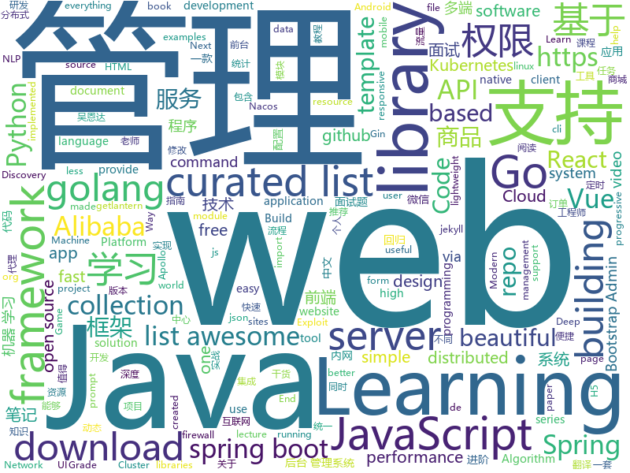

# 2019-03-05
See what the GitHub community is most excited about today.

## python
* [wesng](https://github.com/bitsadmin/wesng)(**366 stars today**): Windows Exploit Suggester - Next Generation
* [Algorithm_Interview_Notes-Chinese](https://github.com/imhuay/Algorithm_Interview_Notes-Chinese)(**296 stars today**): 2018/2019/校招/春招/秋招/算法/机器学习(Machine Learning)/深度学习(Deep Learning)/自然语言处理(NLP)/C/C++/Python/面试笔记
* [zero](https://github.com/remoteinterview/zero)(**283 stars today**): Zero is a web server to simplify web development.
* [system-design-primer](https://github.com/donnemartin/system-design-primer)(**266 stars today**): Learn how to design large-scale systems. Prep for the system design interview. Includes Anki flashcards.
* [lazynlp](https://github.com/chiphuyen/lazynlp)(**162 stars today**): Library to scrape and clean web pages to create massive datasets.
* [faceswap](https://github.com/deepfakes/faceswap)(**128 stars today**): Non official project based on original /r/Deepfakes thread. Many thanks to him!
* [public-apis](https://github.com/toddmotto/public-apis)(**121 stars today**): A collective list of free APIs for use in software and web development.
* [maskscoring_rcnn](https://github.com/zjhuang22/maskscoring_rcnn)(**102 stars today**): Codes for paper "Mask Scoring R-CNN".
* [subsync](https://github.com/smacke/subsync)(**100 stars today**): Automagically synchronize subtitles with video.
* [neural-mmo](https://github.com/openai/neural-mmo)(**85 stars today**): Neural MMO - A Massively Multiagent Game Environment
* [models](https://github.com/tensorflow/models)(**59 stars today**): Models and examples built with TensorFlow
* [poetry](https://github.com/sdispater/poetry)(**66 stars today**): Python dependency management and packaging made easy.
* [SC-FEGAN](https://github.com/JoYoungjoo/SC-FEGAN)(**62 stars today**): SC-FEGAN : Face Editing Generative Adversarial Network with User's Sketch and Color
* [AdaBound](https://github.com/Luolc/AdaBound)(**65 stars today**): An optimizer that trains as fast as Adam and as good as SGD.
* [bullet](https://github.com/Mckinsey666/bullet)(**66 stars today**): 🚅Beautiful Python prompts made simple. Build a prompt like stacking blocks.
* [Lihang](https://github.com/SmirkCao/Lihang)(**60 stars today**): Statistical learning methods, 统计学习方法 [李航] 值得反复读. [笔记, 代码, notebook, 参考文献, Errata]
* [OneList](https://github.com/0oVicero0/OneList)(**56 stars today**): 
* [WebPocket](https://github.com/TuuuNya/WebPocket)(**58 stars today**): Exploit management framework
* [gpt-2](https://github.com/openai/gpt-2)(**53 stars today**): Code for the paper "Language Models are Unsupervised Multitask Learners"
* [awesome-python](https://github.com/vinta/awesome-python)(**50 stars today**): A curated list of awesome Python frameworks, libraries, software and resources
* [Python](https://github.com/TheAlgorithms/Python)(**46 stars today**): All Algorithms implemented in Python
* [d6tflow](https://github.com/d6t/d6tflow)(**52 stars today**): Python library for building highly effective data science workflows
* [face_recognition](https://github.com/ageitgey/face_recognition)(**40 stars today**): The world's simplest facial recognition api for Python and the command line
* [CheatSheetSeries](https://github.com/OWASP/CheatSheetSeries)(**43 stars today**): The OWASP Cheat Sheet Series was created to provide a concise collection of high value information on specific application security topics.
* [youtube-dl](https://github.com/rg3/youtube-dl)(**42 stars today**): Command-line program to download videos from YouTube.com and other video sites

## java
* [DoraemonKit](https://github.com/didi/DoraemonKit)(**226 stars today**): 简称 "DoKit" 。一款功能齐全的客户端（ iOS 、Android ）研发助手，你值得拥有。
* [JavaGuide](https://github.com/Snailclimb/JavaGuide)(**192 stars today**): 【Java学习+面试指南】 一份涵盖大部分Java程序员所需要掌握的核心知识。
* [spring-boot-examples](https://github.com/ityouknow/spring-boot-examples)(**113 stars today**): about learning Spring Boot via examples. Spring Boot 教程、技术栈示例代码，快速简单上手教程。
* [bubble-navigation](https://github.com/gauravk95/bubble-navigation)(**110 stars today**): 🎉[Android Library] A light-weight library to easily make beautiful Navigation Bar with ton of🎨customization option.
* [advanced-java](https://github.com/doocs/advanced-java)(**102 stars today**): 😮互联网 Java 工程师进阶知识完全扫盲
* [AndroidProject](https://github.com/getActivity/AndroidProject)(**81 stars today**): An advanced template project
* [mall](https://github.com/macrozheng/mall)(**64 stars today**): mall项目是一套电商系统，包括前台商城系统及后台管理系统，基于SpringBoot+MyBatis实现。 前台商城系统包含首页门户、商品推荐、商品搜索、商品展示、购物车、订单流程、会员中心、客户服务、帮助中心等模块。 后台管理系统包含商品管理、订单管理、会员管理、促销管理、运营管理、内容管理、统计报表、财务管理、权限管理、设置等模块。
* [fescar](https://github.com/alibaba/fescar)(**62 stars today**): 🔥Fescar is an easy-to-use, high-performance, java based, open source distributed transaction solution.
* [spring-boot](https://github.com/spring-projects/spring-boot)(**48 stars today**): Spring Boot
* [JGrowing](https://github.com/javagrowing/JGrowing)(**49 stars today**): Java is Growing up but not only Java。Java成长路线，但学到不仅仅是Java。
* [tutorials](https://github.com/eugenp/tutorials)(**29 stars today**): The "REST With Spring" Course:
* [APIJSON](https://github.com/TommyLemon/APIJSON)(**45 stars today**): 🚀A JSON Transmission Protocol and an ORM Library for auto providing APIs and Documents.
* [spring-framework](https://github.com/spring-projects/spring-framework)(**34 stars today**): Spring Framework
* [spring-cloud-alibaba](https://github.com/spring-cloud-incubator/spring-cloud-alibaba)(**40 stars today**): Spring Cloud Alibaba provides a one-stop solution for application development for the distributed solutions of Alibaba middleware.
* [arthas](https://github.com/alibaba/arthas)(**41 stars today**): Alibaba Java Diagnostic Tool Arthas/Alibaba Java诊断利器Arthas
* [elasticsearch](https://github.com/elastic/elasticsearch)(**36 stars today**): Open Source, Distributed, RESTful Search Engine
* [hsweb-framework](https://github.com/hs-web/hsweb-framework)(**42 stars today**): hsweb (haʊs wɛb) 是一个用于快速搭建企业后台管理系统的基础项目,集成一揽子便捷功能如:便捷的通用增删改查,强大的权限管理,动态多数据源,动态表单,在线数据库维护等. 基于 spring-boot,mybaits.
* [apollo](https://github.com/ctripcorp/apollo)(**34 stars today**): Apollo（阿波罗）是携程框架部门研发的分布式配置中心，能够集中化管理应用不同环境、不同集群的配置，配置修改后能够实时推送到应用端，并且具备规范的权限、流程治理等特性，适用于微服务配置管理场景。
* [miaosha](https://github.com/qiurunze123/miaosha)(**37 stars today**): ⭐⭐⭐⭐秒杀系统设计与实现.互联网工程师进阶与分析🙋🐓
* [JCSprout](https://github.com/crossoverJie/JCSprout)(**36 stars today**): 👨‍🎓Java Core Sprout : basic, concurrent, algorithm
* [incubator-dubbo](https://github.com/apache/incubator-dubbo)(**26 stars today**): Apache Dubbo (incubating) is a high-performance, java based, open source RPC framework.
* [Java](https://github.com/TheAlgorithms/Java)(**31 stars today**): All Algorithms implemented in Java
* [Discovery](https://github.com/Nepxion/Discovery)(**30 stars today**): Nepxion Discovery is an enhancement for Spring Cloud Discovery on Eureka + Consul + Zookeeper + Nacos with Nacos + Apollo config for gray release, router and isolation 灰度发布、服务隔离、服务路由、服务权重、黑/白名单过滤
* [springboot-learning-example](https://github.com/JeffLi1993/springboot-learning-example)(**27 stars today**): spring boot 实践学习案例，是 spring boot 初学者及核心技术巩固的最佳实践。
* [fisher](https://github.com/fanxinglong/fisher)(**31 stars today**): 基于Spring cloud Alibaba,Oauth2,基于VUE的后台权限管理框架,集成了基于MQ的可靠消息的分布式事务解决方案。

## unknown
* [Micro8](https://github.com/Micropoor/Micro8)(**702 stars today**): Gitbook
* [queueing_theory](https://github.com/joelparkerhenderson/queueing_theory)(**257 stars today**): Queueing theory: an introduction for software development
* [Awesome-Design-Tools](https://github.com/LisaDziuba/Awesome-Design-Tools)(**238 stars today**): The best design tools for everything.
* [distsys-class](https://github.com/aphyr/distsys-class)(**220 stars today**): Class materials for a distributed systems lecture series
* [CS-Notes](https://github.com/CyC2018/CS-Notes)(**163 stars today**): 😋技术面试必备基础知识
* [Daily-Interview-Question](https://github.com/Advanced-Frontend/Daily-Interview-Question)(**144 stars today**): 工作日每天一道前端大厂面试题，祝大家天天进步，一年后会看到不一样的自己。
* [golang-anything-recommend](https://github.com/chunlintang/golang-anything-recommend)(**136 stars today**): 🔥让阅读变成一件有意义的事。Golang好文推荐；收录平时阅读到的一些Go相关写的比较好、质量较高的干货文章.
* [python_interview_question](https://github.com/kenwoodjw/python_interview_question)(**122 stars today**): 关于python的面试题
* [bootstrapping-calculator](https://github.com/dvassallo/bootstrapping-calculator)(**109 stars today**): Do you have enough savings to fund your business?
* [architect-awesome](https://github.com/xingshaocheng/architect-awesome)(**70 stars today**): 后端架构师技术图谱
* [gitignore](https://github.com/github/gitignore)(**59 stars today**): A collection of useful .gitignore templates
* [awesome](https://github.com/sindresorhus/awesome)(**76 stars today**): 😎Awesome lists about all kinds of interesting topics
* [You-Dont-Know-JS](https://github.com/getify/You-Dont-Know-JS)(**63 stars today**): A book series on JavaScript. @YDKJS on twitter.
* [awesome-vue](https://github.com/vuejs/awesome-vue)(**68 stars today**): 🎉A curated list of awesome things related to Vue.js
* [the-book-of-secret-knowledge](https://github.com/trimstray/the-book-of-secret-knowledge)(**70 stars today**): A collection of inspiring lists, manuals, cheatsheets, blogs, hacks, one-liners, cli/web tools and more.
* [free-programming-books](https://github.com/EbookFoundation/free-programming-books)(**53 stars today**): 📚Freely available programming books
* [hosts](https://github.com/googlehosts/hosts)(**46 stars today**): 镜像：https://coding.net/u/scaffrey/p/hosts/git
* [How-To-Secure-A-Linux-Server](https://github.com/imthenachoman/How-To-Secure-A-Linux-Server)(**56 stars today**): An evolving how-to guide for securing a Linux server.
* [Awesome-WAF](https://github.com/0xInfection/Awesome-WAF)(**48 stars today**): 🔥A curated list of awesome web application firewall (WAF) stuff.
* [100-Days-Of-ML-Code](https://github.com/Avik-Jain/100-Days-Of-ML-Code)(**35 stars today**): 100 Days of ML Coding
* [awesome-gcp-certifications](https://github.com/ddneves/awesome-gcp-certifications)(**37 stars today**): A curated list of resources for learning about Google Cloud Platform certifications and how to prepare for it.
* [deep-learning-drizzle](https://github.com/kmario23/deep-learning-drizzle)(**34 stars today**): Drench yourself in Deep Learning, Reinforcement Learning, Machine Learning, Computer Vision, and NLP by learning from these exciting lectures!!
* [Pentest_Interview](https://github.com/Leezj9671/Pentest_Interview)(**32 stars today**): 个人准备渗透测试和安全面试的经验之谈，和去部分厂商的面试题，干货真的满满~
* [gold-miner](https://github.com/xitu/gold-miner)(**32 stars today**): 🥇掘金翻译计划，可能是世界最大最好的英译中技术社区，最懂读者和译者的翻译平台：

## javascript
* [hiring-without-whiteboards](https://github.com/poteto/hiring-without-whiteboards)(**395 stars today**): ⭐️Companies that don't have a broken hiring process
* [gpu.js](https://github.com/gpujs/gpu.js)(**226 stars today**): GPU Accelerated JavaScript
* [vue-dev-server](https://github.com/vuejs/vue-dev-server)(**174 stars today**): A POC dev server that allows you to import `*.vue` files via native ES modules imports.
* [react-three-fiber](https://github.com/drcmda/react-three-fiber)(**150 stars today**): 👌React renderer for THREE.js
* [simple-streaming-datasource](https://github.com/seanlaff/simple-streaming-datasource)(**146 stars today**): End-to-end Grafana streaming datasource example
* [Motrix](https://github.com/agalwood/Motrix)(**132 stars today**): A full-featured download manager.
* [vue](https://github.com/vuejs/vue)(**124 stars today**): 🖖Vue.js is a progressive, incrementally-adoptable JavaScript framework for building UI on the web.
* [chameleon](https://github.com/didi/chameleon)(**122 stars today**): 🦎一套代码运行多端，一端所见即多端所见
* [taro](https://github.com/NervJS/taro)(**103 stars today**): 多端统一开发框架，支持用 React 的开发方式编写一次代码，生成能运行在微信/百度/支付宝/字节跳动小程序、H5、React Native 等的应用。 https://taro.js.org/
* [create-react-app](https://github.com/facebook/create-react-app)(**93 stars today**): Set up a modern web app by running one command.
* [hooks-perf-issues](https://github.com/ryardley/hooks-perf-issues)(**99 stars today**): This repo demonstrates a situation where it is slower to use React hooks than classes
* [react](https://github.com/facebook/react)(**78 stars today**): A declarative, efficient, and flexible JavaScript library for building user interfaces.
* [cleave.js](https://github.com/nosir/cleave.js)(**83 stars today**): Format input text content when you are typing...
* [omi](https://github.com/Tencent/omi)(**78 stars today**): 下一代前端统一框架 - 支持桌面Web、移动H5和小程序 - Next Front End Framework
* [box-ui-elements](https://github.com/box/box-ui-elements)(**74 stars today**): Box UI Elements
* [ncform](https://github.com/ncform/ncform)(**70 stars today**): ncform, a very nice configuration generation way to develop form ( vue, json-schema, form, generator )
* [30-seconds-of-code](https://github.com/30-seconds/30-seconds-of-code)(**63 stars today**): Curated collection of useful JavaScript snippets that you can understand in 30 seconds or less.
* [codecrumbs](https://github.com/Bogdan-Lyashenko/codecrumbs)(**66 stars today**): Learn, design or document codebase by putting breadcrumbs in source code. Live updates, multi-language support, and easy sharing.
* [git-history](https://github.com/pomber/git-history)(**63 stars today**): Quickly browse the history of a file from any git repository
* [frenchkiss.js](https://github.com/koala-interactive/frenchkiss.js)(**64 stars today**): The blazing fast lightweight i18n module for javascript
* [axios](https://github.com/axios/axios)(**62 stars today**): Promise based HTTP client for the browser and node.js
* [nsfwjs](https://github.com/infinitered/nsfwjs)(**59 stars today**): NSFW detection on the client-side via Tensorflow JS
* [video-maker](https://github.com/filipedeschamps/video-maker)(**54 stars today**): Projeto open source para fazer vídeos automatizados
* [blog](https://github.com/mtonhuang/blog)(**61 stars today**): 我是mtonhuang，这里是我关于前端架构，版本工具，源码剖析，h5c3等的日常总结，让我们在前端进阶的路上，共勉^_^
* [bootstrap](https://github.com/twbs/bootstrap)(**47 stars today**): The most popular HTML, CSS, and JavaScript framework for developing responsive, mobile first projects on the web.

## html
* [automatic-app-landing-page](https://github.com/emilbaehr/automatic-app-landing-page)(**314 stars today**): A Jekyll theme for automatically generating and deploying landing page sites for mobile apps.
* [personal-website](https://github.com/github/personal-website)(**57 stars today**): Code that'll help you kickstart a personal website that showcases your work as a software developer.
* [javascript-tutorial-en](https://github.com/iliakan/javascript-tutorial-en)(**66 stars today**): Modern JavaScript Tutorial
* [stisla](https://github.com/stisla/stisla)(**40 stars today**): Free Bootstrap Admin Template
* [javascript-tutorial-zh](https://github.com/xitu/javascript-tutorial-zh)(**24 stars today**): Modern JavaScript Tutorial
* [Coursera-ML-AndrewNg-Notes](https://github.com/fengdu78/Coursera-ML-AndrewNg-Notes)(**18 stars today**): 吴恩达老师的机器学习课程个人笔记
* [deeplearning_ai_books](https://github.com/fengdu78/deeplearning_ai_books)(**19 stars today**): deeplearning.ai（吴恩达老师的深度学习课程笔记及资源）
* [flutter-in-action](https://github.com/flutterchina/flutter-in-action)(**18 stars today**): 《Flutter实战》电子书
* [climanifeste](https://github.com/climanifeste/climanifeste)(**14 stars today**): Manifeste écologique des professionnels de l'informatique
* [Spoon-Knife](https://github.com/octocat/Spoon-Knife)(****): This repo is for demonstration purposes only.
* [webauthn](https://github.com/w3c/webauthn)(**15 stars today**): Web Authentication WG: https://www.w3.org/Webauthn Editors' Draft:
* [learning-area](https://github.com/mdn/learning-area)(**8 stars today**): Github repo for the MDN Learning Area.
* [gentelella](https://github.com/ColorlibHQ/gentelella)(**11 stars today**): Free Bootstrap 3 Admin Template
* [ionic](https://github.com/ionic-team/ionic)(**11 stars today**): Build amazing native and progressive web apps with open web technologies. One app running on everything🎉
* [coreui-free-bootstrap-admin-template](https://github.com/coreui/coreui-free-bootstrap-admin-template)(**10 stars today**): CoreUI is free bootstrap admin template
* [pytorch-doc-zh](https://github.com/apachecn/pytorch-doc-zh)(**11 stars today**): PyTorch 中文文档
* [TranslatorX](https://github.com/pingfangx/TranslatorX)(**10 stars today**): JetBrains 系列软件汉化包
* [beautiful-jekyll](https://github.com/daattali/beautiful-jekyll)(**5 stars today**): ✨Build a beautiful and simple website in literally minutes. Demo at http://deanattali.com/beautiful-jekyll
* [wechat_web_devtools](https://github.com/cytle/wechat_web_devtools)(**9 stars today**): 微信开发者工具(微信小程序)linux完美支持
* [ecma262](https://github.com/tc39/ecma262)(**9 stars today**): Status, process, and documents for ECMA262
* [Machine-Learning](https://github.com/Jack-Cherish/Machine-Learning)(**7 stars today**): ⚡️机器学习实战（Python3）：kNN、决策树、贝叶斯、逻辑回归、SVM、线性回归、树回归
* [magicCubeToken](https://github.com/magic-cube-project/magicCubeToken)(**9 stars today**): 
* [responsive-html-email-template](https://github.com/leemunroe/responsive-html-email-template)(**8 stars today**): A free simple responsive HTML email template
* [awesome-competitive-programming](https://github.com/lnishan/awesome-competitive-programming)(**7 stars today**): 💎A curated list of awesome Competitive Programming, Algorithm and Data Structure resources
* [swagger-codegen](https://github.com/swagger-api/swagger-codegen)(**7 stars today**): swagger-codegen contains a template-driven engine to generate documentation, API clients and server stubs in different languages by parsing your OpenAPI / Swagger definition.

## go
* [k3s](https://github.com/rancher/k3s)(**328 stars today**): Lightweight Kubernetes. 5 less than k8s.
* [tile38](https://github.com/tidwall/tile38)(**149 stars today**): Tile38 is a geospatial database, spatial index, and realtime geofence.🌐
* [the-way-to-go_ZH_CN](https://github.com/Unknwon/the-way-to-go_ZH_CN)(**139 stars today**): 《The Way to Go》中文译本，中文正式名《Go 入门指南》
* [kube-eagle](https://github.com/google-cloud-tools/kube-eagle)(**88 stars today**): A prometheus exporter created to provide a better overview of your resource allocation and utilization in a Kubernetes cluster.
* [PPGo_Job](https://github.com/george518/PPGo_Job)(**82 stars today**): PPGo_Job是一款可视化的、多人多权限的定时任务管理系统，采用golang开发，安装方便，资源消耗少，支持大并发，可同时管理多台服务器上的定时任务。
* [kubernetes](https://github.com/kubernetes/kubernetes)(**63 stars today**): Production-Grade Container Scheduling and Management
* [awesome-go](https://github.com/avelino/awesome-go)(**64 stars today**): A curated list of awesome Go frameworks, libraries and software
* [go](https://github.com/golang/go)(**61 stars today**): The Go programming language
* [ebiten](https://github.com/hajimehoshi/ebiten)(**60 stars today**): A dead simple 2D game library in Go
* [1m-go-tcp-server](https://github.com/smallnest/1m-go-tcp-server)(**53 stars today**): benchmarks for implementation of servers which support 1 million connections
* [v2ray-core](https://github.com/v2ray/v2ray-core)(**52 stars today**): A platform for building proxies to bypass network restrictions.
* [frp](https://github.com/fatedier/frp)(**40 stars today**): A fast reverse proxy to help you expose a local server behind a NAT or firewall to the internet.
* [1m-go-websockets](https://github.com/eranyanay/1m-go-websockets)(**41 stars today**): handling 1M websockets connections in Go
* [hugo](https://github.com/gohugoio/hugo)(**38 stars today**): The world’s fastest framework for building websites.
* [derek](https://github.com/alexellis/derek)(**41 stars today**): Derek is a GitHub🤖to delegate & automate repo maintenance/compliance
* [istio](https://github.com/istio/istio)(**37 stars today**): Connect, secure, control, and observe services.
* [gin](https://github.com/gin-gonic/gin)(**33 stars today**): Gin is a HTTP web framework written in Go (Golang). It features a Martini-like API with much better performance -- up to 40 times faster. If you need smashing performance, get yourself some Gin.
* [nps](https://github.com/cnlh/nps)(**34 stars today**): 一款轻量级、功能强大的内网穿透代理服务器。支持tcp、udp流量转发，支持内网http代理、内网socks5代理，同时支持snappy压缩（节省带宽和流量）、站点保护、加密传输、多路复用、header修改等。支持web图形化管理。
* [build-web-application-with-golang](https://github.com/astaxie/build-web-application-with-golang)(**31 stars today**): A golang ebook intro how to build a web with golang
* [lantern](https://github.com/getlantern/lantern)(**31 stars today**): 🔴蓝灯最新版本下载 https://github.com/getlantern/download🔴Lantern Latest Download https://github.com/getlantern/download🔴
* [helm](https://github.com/helm/helm)(**31 stars today**): The Kubernetes Package Manager
* [cds](https://github.com/ovh/cds)(**34 stars today**): Enterprise-Grade Continuous Delivery & DevOps Automation Open Source Platform
* [k9s](https://github.com/derailed/k9s)(**31 stars today**): 🐶Kubernetes CLI To Manage Your Clusters In Style!
* [noverify](https://github.com/VKCOM/noverify)(**28 stars today**): Pretty fast linter (code static analysis utility) for PHP
* [immutable](https://github.com/benbjohnson/immutable)(**27 stars today**): Immutable collections for Go

## WordCloud

