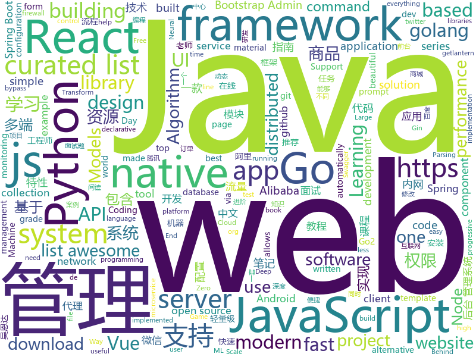

# 2019-03-06
See what the GitHub community is most excited about today.

## python
* [m2cgen](https://github.com/BayesWitnesses/m2cgen)(**618 stars today**): Transform ML models into a native code (Java, C, Python, etc.) with zero dependencies
* [maskscoring_rcnn](https://github.com/zjhuang22/maskscoring_rcnn)(**328 stars today**): Codes for paper "Mask Scoring R-CNN".
* [Algorithm_Interview_Notes-Chinese](https://github.com/imhuay/Algorithm_Interview_Notes-Chinese)(**300 stars today**): 2018/2019/校招/春招/秋招/算法/机器学习(Machine Learning)/深度学习(Deep Learning)/自然语言处理(NLP)/C/C++/Python/面试笔记
* [neural-mmo](https://github.com/openai/neural-mmo)(**300 stars today**): Neural MMO - A Massively Multiagent Game Environment
* [wesng](https://github.com/bitsadmin/wesng)(**185 stars today**): Windows Exploit Suggester - Next Generation
* [ludwig](https://github.com/uber/ludwig)(**159 stars today**): Ludwig is a toolbox built on top of TensorFlow that allows to train and test deep learning models without the need to write code.
* [zero](https://github.com/remoteinterview/zero)(**165 stars today**): Zero is a web server to simplify web development.
* [SiamMask](https://github.com/foolwood/SiamMask)(**149 stars today**): [CVPR2019] Fast Online Object Tracking and Segmentation: A Unifying Approach
* [lingvo](https://github.com/tensorflow/lingvo)(**140 stars today**): Lingvo
* [system-design-primer](https://github.com/donnemartin/system-design-primer)(**121 stars today**): Learn how to design large-scale systems. Prep for the system design interview. Includes Anki flashcards.
* [bullet](https://github.com/Mckinsey666/bullet)(**110 stars today**): 🚅Beautiful Python prompts made simple. Build a prompt like stacking blocks.
* [faceswap](https://github.com/deepfakes/faceswap)(**90 stars today**): Non official project based on original /r/Deepfakes thread. Many thanks to him!
* [public-apis](https://github.com/toddmotto/public-apis)(**92 stars today**): A collective list of free APIs for use in software and web development.
* [models](https://github.com/tensorflow/models)(**63 stars today**): Models and examples built with TensorFlow
* [SC-FEGAN](https://github.com/JoYoungjoo/SC-FEGAN)(**78 stars today**): SC-FEGAN : Face Editing Generative Adversarial Network with User's Sketch and Color
* [lazynlp](https://github.com/chiphuyen/lazynlp)(**76 stars today**): Library to scrape and clean web pages to create massive datasets.
* [summarizer](https://github.com/PhantomInsights/summarizer)(**72 stars today**): A Reddit bot that summarizes news articles written in Spanish or English. It uses a custom built algorithm to rank words and sentences.
* [USTC-Course](https://github.com/USTC-Resource/USTC-Course)(**63 stars today**): ❤️中国科学技术大学课程资源
* [loguru](https://github.com/Delgan/loguru)(**72 stars today**): Python logging made (stupidly) simple
* [awesome-python](https://github.com/vinta/awesome-python)(**61 stars today**): A curated list of awesome Python frameworks, libraries, software and resources
* [gpt-2](https://github.com/openai/gpt-2)(**58 stars today**): Code for the paper "Language Models are Unsupervised Multitask Learners"
* [subsync](https://github.com/smacke/subsync)(**62 stars today**): Automagically synchronize subtitles with video.
* [python-cheatsheet](https://github.com/gto76/python-cheatsheet)(**58 stars today**): Comprehensive Python Cheatsheet
* [Python](https://github.com/TheAlgorithms/Python)(**53 stars today**): All Algorithms implemented in Python
* [face_recognition](https://github.com/ageitgey/face_recognition)(**54 stars today**): The world's simplest facial recognition api for Python and the command line

## java
* [JavaGuide](https://github.com/Snailclimb/JavaGuide)(**240 stars today**): 【Java学习+面试指南】 一份涵盖大部分Java程序员所需要掌握的核心知识。
* [sofa-jraft](https://github.com/alipay/sofa-jraft)(**150 stars today**): An industrial-grade java implementation of RAFT consensus algorithm.
* [advanced-java](https://github.com/doocs/advanced-java)(**139 stars today**): 😮互联网 Java 工程师进阶知识完全扫盲
* [mall](https://github.com/macrozheng/mall)(**117 stars today**): mall项目是一套电商系统，包括前台商城系统及后台管理系统，基于SpringBoot+MyBatis实现。 前台商城系统包含首页门户、商品推荐、商品搜索、商品展示、购物车、订单流程、会员中心、客户服务、帮助中心等模块。 后台管理系统包含商品管理、订单管理、会员管理、促销管理、运营管理、内容管理、统计报表、财务管理、权限管理、设置等模块。
* [DoraemonKit](https://github.com/didi/DoraemonKit)(**131 stars today**): 简称 "DoKit" 。一款功能齐全的客户端（ iOS 、Android ）研发助手，你值得拥有。
* [spring-boot-examples](https://github.com/ityouknow/spring-boot-examples)(**108 stars today**): about learning Spring Boot via examples. Spring Boot 教程、技术栈示例代码，快速简单上手教程。
* [tutorials](https://github.com/eugenp/tutorials)(**71 stars today**): The "REST With Spring" Course:
* [fescar](https://github.com/alibaba/fescar)(**79 stars today**): 🔥Fescar is an easy-to-use, high-performance, java based, open source distributed transaction solution.
* [bubble-navigation](https://github.com/gauravk95/bubble-navigation)(**79 stars today**): 🎉[Android Library] A light-weight library to easily make beautiful Navigation Bar with ton of🎨customization option.
* [JGrowing](https://github.com/javagrowing/JGrowing)(**64 stars today**): Java is Growing up but not only Java。Java成长路线，但学到不仅仅是Java。
* [spring-boot](https://github.com/spring-projects/spring-boot)(**59 stars today**): Spring Boot
* [arthas](https://github.com/alibaba/arthas)(**58 stars today**): Alibaba Java Diagnostic Tool Arthas/Alibaba Java诊断利器Arthas
* [hsweb-framework](https://github.com/hs-web/hsweb-framework)(**52 stars today**): hsweb (haʊs wɛb) 是一个用于快速搭建企业后台管理系统的基础项目,集成一揽子便捷功能如:便捷的通用增删改查,强大的权限管理,动态多数据源,动态表单,在线数据库维护等. 基于 spring-boot,mybaits.
* [spring-framework](https://github.com/spring-projects/spring-framework)(**40 stars today**): Spring Framework
* [incubator-dubbo](https://github.com/apache/incubator-dubbo)(**37 stars today**): Apache Dubbo (incubating) is a high-performance, java based, open source RPC framework.
* [Java](https://github.com/TheAlgorithms/Java)(**37 stars today**): All Algorithms implemented in Java
* [apollo](https://github.com/ctripcorp/apollo)(**38 stars today**): Apollo（阿波罗）是携程框架部门研发的分布式配置中心，能够集中化管理应用不同环境、不同集群的配置，配置修改后能够实时推送到应用端，并且具备规范的权限、流程治理等特性，适用于微服务配置管理场景。
* [elasticsearch](https://github.com/elastic/elasticsearch)(**36 stars today**): Open Source, Distributed, RESTful Search Engine
* [spring-cloud-alibaba](https://github.com/spring-cloud-incubator/spring-cloud-alibaba)(**34 stars today**): Spring Cloud Alibaba provides a one-stop solution for application development for the distributed solutions of Alibaba middleware.
* [miaosha](https://github.com/qiurunze123/miaosha)(**35 stars today**): ⭐⭐⭐⭐秒杀系统设计与实现.互联网工程师进阶与分析🙋🐓
* [JCSprout](https://github.com/crossoverJie/JCSprout)(**31 stars today**): 👨‍🎓Java Core Sprout : basic, concurrent, algorithm
* [nacos](https://github.com/alibaba/nacos)(**32 stars today**): an easy-to-use dynamic service discovery, configuration and service management platform for building cloud native applications.
* [flink](https://github.com/apache/flink)(**26 stars today**): Apache Flink
* [LifeHelper](https://github.com/yangchong211/LifeHelper)(**26 stars today**): 组件化综合案例，包含微信新闻，头条视频，美女图片，百度音乐，干活集中营，玩Android，豆瓣读书电影，知乎日报等等模块。架构模式：组件化+MVP+Rx+Retrofit+Desgin+Dagger2+阿里VLayout+腾讯X5+腾讯bugly。安装阿里编码规约插件，不断修正不合理代码和最大程度去除黄色警告！！！融合开发中需要的各种小案例！
* [Sentinel](https://github.com/alibaba/Sentinel)(**25 stars today**): A lightweight powerful flow control component enabling reliability and monitoring for microservices. (轻量级的流量控制、熔断降级 Java 库)

## unknown
* [python_interview_question](https://github.com/kenwoodjw/python_interview_question)(**561 stars today**): 关于python的面试题
* [Micro8](https://github.com/Micropoor/Micro8)(**340 stars today**): Gitbook
* [Awesome-Design-Tools](https://github.com/LisaDziuba/Awesome-Design-Tools)(**310 stars today**): The best design tools for everything.
* [ghidra](https://github.com/NationalSecurityAgency/ghidra)(**218 stars today**): 
* [CS-Notes](https://github.com/CyC2018/CS-Notes)(**151 stars today**): 😋技术面试必备基础知识
* [awesome-scalability](https://github.com/binhnguyennus/awesome-scalability)(**128 stars today**): The Patterns Behind Scalable, Reliable, and Performant Large-Scale Systems👋https://twitter.com/top_sde
* [Daily-Interview-Question](https://github.com/Advanced-Frontend/Daily-Interview-Question)(**106 stars today**): 工作日每天一道前端大厂面试题，祝大家天天进步，一年后会看到不一样的自己。
* [You-Dont-Know-JS](https://github.com/getify/You-Dont-Know-JS)(**75 stars today**): A book series on JavaScript. @YDKJS on twitter.
* [queueing_theory](https://github.com/joelparkerhenderson/queueing_theory)(**84 stars today**): Queueing theory: an introduction for software development
* [gitignore](https://github.com/github/gitignore)(**51 stars today**): A collection of useful .gitignore templates
* [awesome](https://github.com/sindresorhus/awesome)(**73 stars today**): 😎Awesome lists about all kinds of interesting topics
* [distsys-class](https://github.com/aphyr/distsys-class)(**76 stars today**): Class materials for a distributed systems lecture series
* [golang-anything-recommend](https://github.com/chunlintang/golang-anything-recommend)(**73 stars today**): 🔥让阅读变成一件有意义的事。Golang好文推荐；收录平时阅读到的一些Go相关写的比较好、质量较高的干货文章.
* [architect-awesome](https://github.com/xingshaocheng/architect-awesome)(**63 stars today**): 后端架构师技术图谱
* [the-book-of-secret-knowledge](https://github.com/trimstray/the-book-of-secret-knowledge)(**59 stars today**): A collection of inspiring lists, manuals, cheatsheets, blogs, hacks, one-liners, cli/web tools and more.
* [Awesome-WAF](https://github.com/0xInfection/Awesome-WAF)(**57 stars today**): 🔥A curated list of awesome web application firewall (WAF) stuff.
* [awesome-vue](https://github.com/vuejs/awesome-vue)(**50 stars today**): 🎉A curated list of awesome things related to Vue.js
* [hosts](https://github.com/googlehosts/hosts)(**42 stars today**): 镜像：https://coding.net/u/scaffrey/p/hosts/git
* [free-programming-books-zh_CN](https://github.com/justjavac/free-programming-books-zh_CN)(**47 stars today**): 📚免费的计算机编程类中文书籍，欢迎投稿
* [project-based-learning](https://github.com/tuvtran/project-based-learning)(**42 stars today**): Curated list of project-based tutorials
* [How-To-Secure-A-Linux-Server](https://github.com/imthenachoman/How-To-Secure-A-Linux-Server)(**46 stars today**): An evolving how-to guide for securing a Linux server.
* [awesome-wechat-weapp](https://github.com/justjavac/awesome-wechat-weapp)(**43 stars today**): 微信小程序开发资源汇总💯
* [100-Days-Of-ML-Code](https://github.com/Avik-Jain/100-Days-Of-ML-Code)(**39 stars today**): 100 Days of ML Coding
* [free-programming-books](https://github.com/EbookFoundation/free-programming-books)(**36 stars today**): 📚Freely available programming books

## javascript
* [hiring-without-whiteboards](https://github.com/poteto/hiring-without-whiteboards)(**185 stars today**): ⭐️Companies that don't have a broken hiring process
* [vue](https://github.com/vuejs/vue)(**163 stars today**): 🖖Vue.js is a progressive, incrementally-adoptable JavaScript framework for building UI on the web.
* [react-three-fiber](https://github.com/drcmda/react-three-fiber)(**140 stars today**): 👌React renderer for THREE.js
* [jsproxy](https://github.com/EtherDream/jsproxy)(**116 stars today**): 一个基于浏览器端 JS 实现的在线代理
* [react](https://github.com/facebook/react)(**105 stars today**): A declarative, efficient, and flexible JavaScript library for building user interfaces.
* [Motrix](https://github.com/agalwood/Motrix)(**107 stars today**): A full-featured download manager.
* [storybook](https://github.com/storybooks/storybook)(**99 stars today**): UI component dev & test: React, React Native, Vue, Angular, Ember & more!
* [gpu.js](https://github.com/gpujs/gpu.js)(**104 stars today**): GPU Accelerated JavaScript
* [taro](https://github.com/NervJS/taro)(**98 stars today**): 多端统一开发框架，支持用 React 的开发方式编写一次代码，生成能运行在微信/百度/支付宝/字节跳动小程序、H5、React Native 等的应用。 https://taro.js.org/
* [create-react-app](https://github.com/facebook/create-react-app)(**82 stars today**): Set up a modern web app by running one command.
* [30-seconds-of-code](https://github.com/30-seconds/30-seconds-of-code)(**77 stars today**): Curated collection of useful JavaScript snippets that you can understand in 30 seconds or less.
* [simple-streaming-datasource](https://github.com/seanlaff/simple-streaming-datasource)(**72 stars today**): End-to-end Grafana streaming datasource example
* [chameleon](https://github.com/didi/chameleon)(**69 stars today**): 🦎一套代码运行多端，一端所见即多端所见
* [vue-dev-server](https://github.com/vuejs/vue-dev-server)(**68 stars today**): A POC dev server that allows you to import `*.vue` files via native ES modules imports.
* [node](https://github.com/nodejs/node)(**57 stars today**): Node.js JavaScript runtime✨🐢🚀✨
* [git-history](https://github.com/pomber/git-history)(**62 stars today**): Quickly browse the history of a file from any git repository
* [preact](https://github.com/developit/preact)(**62 stars today**): ⚛️Fast 3kB React alternative with the same modern API. Components & Virtual DOM.
* [axios](https://github.com/axios/axios)(**57 stars today**): Promise based HTTP client for the browser and node.js
* [puppeteer](https://github.com/GoogleChrome/puppeteer)(**54 stars today**): Headless Chrome Node API
* [react-native](https://github.com/facebook/react-native)(**49 stars today**): A framework for building native apps with React.
* [dayjs](https://github.com/iamkun/dayjs)(**53 stars today**): ⏰Day.js 2KB immutable date library alternative to Moment.js with the same modern API
* [ncform](https://github.com/ncform/ncform)(**54 stars today**): ncform, a very nice configuration generation way to develop form ( vue, json-schema, form, generator )
* [box-ui-elements](https://github.com/box/box-ui-elements)(**52 stars today**): Box UI Elements
* [next.js](https://github.com/zeit/next.js)(**48 stars today**): The React Framework
* [gatsby](https://github.com/gatsbyjs/gatsby)(**45 stars today**): Build blazing fast, modern apps and websites with React

## html
* [automatic-app-landing-page](https://github.com/emilbaehr/automatic-app-landing-page)(**189 stars today**): A Jekyll theme for automatically generating and deploying landing page sites for mobile apps.
* [personal-website](https://github.com/github/personal-website)(**67 stars today**): Code that'll help you kickstart a personal website that showcases your work as a software developer.
* [bestofml](https://github.com/RemoteML/bestofml)(**76 stars today**): The best resources around Machine Learning
* [flutter-in-action](https://github.com/flutterchina/flutter-in-action)(**61 stars today**): 《Flutter实战》电子书
* [GTFOBins.github.io](https://github.com/GTFOBins/GTFOBins.github.io)(**50 stars today**): Curated list of Unix binaries that can be exploited to bypass system security restrictions
* [crash-course-django](https://github.com/codexplore-io/crash-course-django)(**40 stars today**): 
* [javascript-tutorial-en](https://github.com/iliakan/javascript-tutorial-en)(**35 stars today**): Modern JavaScript Tutorial
* [Screenshot-to-code](https://github.com/emilwallner/Screenshot-to-code)(**26 stars today**): A neural network that transforms a design mock-up into a static website
* [Coursera-ML-AndrewNg-Notes](https://github.com/fengdu78/Coursera-ML-AndrewNg-Notes)(**17 stars today**): 吴恩达老师的机器学习课程个人笔记
* [deeplearning_ai_books](https://github.com/fengdu78/deeplearning_ai_books)(**20 stars today**): deeplearning.ai（吴恩达老师的深度学习课程笔记及资源）
* [webauthn](https://github.com/w3c/webauthn)(**22 stars today**): Web Authentication WG: https://www.w3.org/Webauthn Editors' Draft:
* [spur-template](https://github.com/HackerThemes/spur-template)(**21 stars today**): A Bootstrap Admin Template
* [ionic](https://github.com/ionic-team/ionic)(**18 stars today**): Build amazing native and progressive web apps with open web technologies. One app running on everything🎉
* [javascript-tutorial-zh](https://github.com/xitu/javascript-tutorial-zh)(**15 stars today**): Modern JavaScript Tutorial
* [fastText](https://github.com/facebookresearch/fastText)(**14 stars today**): Library for fast text representation and classification.
* [stisla](https://github.com/stisla/stisla)(**15 stars today**): Free Bootstrap Admin Template
* [Spoon-Knife](https://github.com/octocat/Spoon-Knife)(****): This repo is for demonstration purposes only.
* [portainer](https://github.com/portainer/portainer)(**14 stars today**): Simple management UI for Docker
* [bootstrap-table](https://github.com/wenzhixin/bootstrap-table)(**11 stars today**): An extended table to integration with some of the most widely used CSS frameworks. (Supports Bootstrap, Semantic UI, Bulma, Material Design, Foundation)
* [requests-html](https://github.com/kennethreitz/requests-html)(**13 stars today**): Pythonic HTML Parsing for Humans™
* [swagger-codegen](https://github.com/swagger-api/swagger-codegen)(**9 stars today**): swagger-codegen contains a template-driven engine to generate documentation, API clients and server stubs in different languages by parsing your OpenAPI / Swagger definition.
* [climanifeste](https://github.com/climanifeste/climanifeste)(**8 stars today**): Manifeste écologique des professionnels de l'informatique
* [gentelella](https://github.com/ColorlibHQ/gentelella)(**11 stars today**): Free Bootstrap 3 Admin Template
* [now-github-starter](https://github.com/zeit/now-github-starter)(****): Starter project to demonstrate a project whose pull requests get automatically deployed
* [mxgraph](https://github.com/jgraph/mxgraph)(**10 stars today**): mxGraph is a fully client side JavaScript diagramming library

## go
* [tile38](https://github.com/tidwall/tile38)(**334 stars today**): Tile38 is a geospatial database, spatial index, and realtime geofence.🌐
* [kraken](https://github.com/uber/kraken)(**317 stars today**): P2P docker registry capable of distributing TBs of data in seconds
* [k3s](https://github.com/rancher/k3s)(**228 stars today**): Lightweight Kubernetes. 5 less than k8s.
* [the-way-to-go_ZH_CN](https://github.com/Unknwon/the-way-to-go_ZH_CN)(**84 stars today**): 《The Way to Go》中文译本，中文正式名《Go 入门指南》
* [vulcanizer](https://github.com/github/vulcanizer)(**83 stars today**): GitHub's ops focused Elasticsearch library
* [kubernetes](https://github.com/kubernetes/kubernetes)(**70 stars today**): Production-Grade Container Scheduling and Management
* [awesome-go](https://github.com/avelino/awesome-go)(**60 stars today**): A curated list of awesome Go frameworks, libraries and software
* [go](https://github.com/golang/go)(**58 stars today**): The Go programming language
* [PPGo_Job](https://github.com/george518/PPGo_Job)(**53 stars today**): PPGo_Job是一款可视化的、多人多权限的定时任务管理系统，采用golang开发，安装方便，资源消耗少，支持大并发，可同时管理多台服务器上的定时任务。
* [v2ray-core](https://github.com/v2ray/v2ray-core)(**50 stars today**): A platform for building proxies to bypass network restrictions.
* [decker](https://github.com/stevenaldinger/decker)(**54 stars today**): Declarative penetration testing orchestration framework
* [frp](https://github.com/fatedier/frp)(**45 stars today**): A fast reverse proxy to help you expose a local server behind a NAT or firewall to the internet.
* [ebiten](https://github.com/hajimehoshi/ebiten)(**47 stars today**): A dead simple 2D game library in Go
* [build-web-application-with-golang](https://github.com/astaxie/build-web-application-with-golang)(**42 stars today**): A golang ebook intro how to build a web with golang
* [go2-book](https://github.com/chai2010/go2-book)(**41 stars today**): 📚《Go2编程指南》开源图书，重点讲解Go2新特性，以及Go1教程中较少涉及的特性
* [lantern](https://github.com/getlantern/lantern)(**37 stars today**): 🔴蓝灯最新版本下载 https://github.com/getlantern/download🔴Lantern Latest Download https://github.com/getlantern/download🔴
* [gin](https://github.com/gin-gonic/gin)(**36 stars today**): Gin is a HTTP web framework written in Go (Golang). It features a Martini-like API with much better performance -- up to 40 times faster. If you need smashing performance, get yourself some Gin.
* [go-micro](https://github.com/micro/go-micro)(**38 stars today**): A microservice framework
* [istio](https://github.com/istio/istio)(**31 stars today**): Connect, secure, control, and observe services.
* [hugo](https://github.com/gohugoio/hugo)(**33 stars today**): The world’s fastest framework for building websites.
* [prometheus](https://github.com/prometheus/prometheus)(**32 stars today**): The Prometheus monitoring system and time series database.
* [nps](https://github.com/cnlh/nps)(**30 stars today**): 一款轻量级、功能强大的内网穿透代理服务器。支持tcp、udp流量转发，支持内网http代理、内网socks5代理，同时支持snappy压缩（节省带宽和流量）、站点保护、加密传输、多路复用、header修改等。支持web图形化管理。
* [1m-go-tcp-server](https://github.com/smallnest/1m-go-tcp-server)(**30 stars today**): benchmarks for implementation of servers which support 1 million connections
* [1m-go-websockets](https://github.com/eranyanay/1m-go-websockets)(**28 stars today**): handling 1M websockets connections in Go
* [fzf](https://github.com/junegunn/fzf)(**30 stars today**): 🌸A command-line fuzzy finder

## WordCloud

