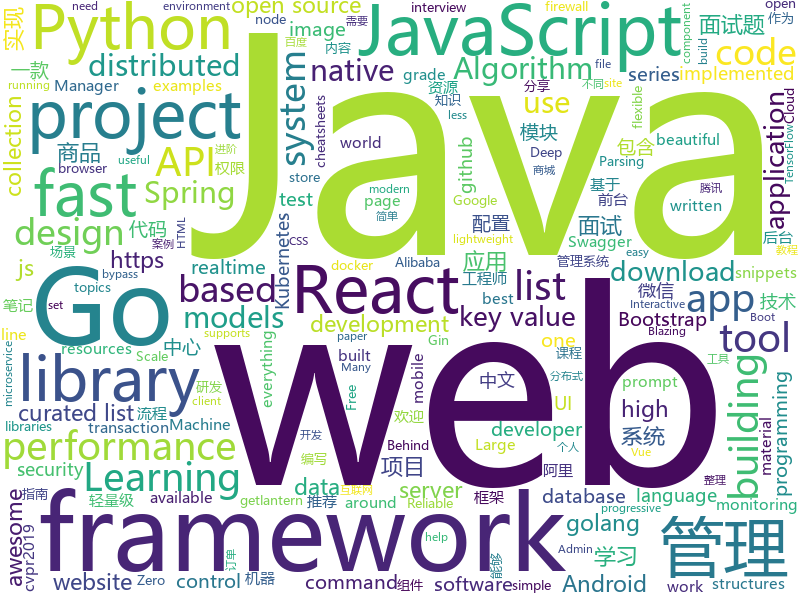

# 2019-03-07
See what the GitHub community is most excited about today.

## python
* [Algorithm_Interview_Notes-Chinese](https://github.com/imhuay/Algorithm_Interview_Notes-Chinese)(**247 stars today**): 2018/2019/校招/春招/秋招/算法/机器学习(Machine Learning)/深度学习(Deep Learning)/自然语言处理(NLP)/C/C++/Python/面试笔记
* [m2cgen](https://github.com/BayesWitnesses/m2cgen)(**254 stars today**): Transform ML models into a native code (Java, C, Python, etc.) with zero dependencies
* [USTC-Course](https://github.com/USTC-Resource/USTC-Course)(**181 stars today**): ❤️中国科学技术大学课程资源
* [neural-mmo](https://github.com/openai/neural-mmo)(**182 stars today**): Neural MMO - A Massively Multiagent Game Environment
* [maskscoring_rcnn](https://github.com/zjhuang22/maskscoring_rcnn)(**138 stars today**): Codes for paper "Mask Scoring R-CNN".
* [ludwig](https://github.com/uber/ludwig)(**133 stars today**): Ludwig is a toolbox built on top of TensorFlow that allows to train and test deep learning models without the need to write code.
* [bullet](https://github.com/Mckinsey666/bullet)(**125 stars today**): 🚅Interactive prompts made simple. Build a prompt like stacking blocks.
* [faceswap](https://github.com/deepfakes/faceswap)(**103 stars today**): Non official project based on original /r/Deepfakes thread. Many thanks to him!
* [public-apis](https://github.com/toddmotto/public-apis)(**111 stars today**): A collective list of free APIs for use in software and web development.
* [system-design-primer](https://github.com/donnemartin/system-design-primer)(**97 stars today**): Learn how to design large-scale systems. Prep for the system design interview. Includes Anki flashcards.
* [zero](https://github.com/remoteinterview/zero)(**102 stars today**): Zero is a web server to simplify web development.
* [models](https://github.com/tensorflow/models)(**71 stars today**): Models and examples built with TensorFlow
* [gpt-2](https://github.com/openai/gpt-2)(**87 stars today**): Code for the paper "Language Models are Unsupervised Multitask Learners"
* [awesome-python](https://github.com/vinta/awesome-python)(**83 stars today**): A curated list of awesome Python frameworks, libraries, software and resources
* [SiamMask](https://github.com/foolwood/SiamMask)(**83 stars today**): [CVPR2019] Fast Online Object Tracking and Segmentation: A Unifying Approach
* [Humpback-Whale-Identification-1st-](https://github.com/earhian/Humpback-Whale-Identification-1st-)(**66 stars today**): https://www.kaggle.com/c/humpback-whale-identification
* [lingvo](https://github.com/tensorflow/lingvo)(**72 stars today**): Lingvo
* [albumentations](https://github.com/albu/albumentations)(**65 stars today**): fast image augmentation library and easy to use wrapper around other libraries
* [wesng](https://github.com/bitsadmin/wesng)(**61 stars today**): Windows Exploit Suggester - Next Generation
* [CheatSheetSeries](https://github.com/OWASP/CheatSheetSeries)(**57 stars today**): The OWASP Cheat Sheet Series was created to provide a concise collection of high value information on specific application security topics.
* [pydis](https://github.com/boramalper/pydis)(**59 stars today**): A redis clone in Python 3 to disprove some falsehoods about performance.
* [bert](https://github.com/google-research/bert)(**50 stars today**): TensorFlow code and pre-trained models for BERT
* [keras](https://github.com/keras-team/keras)(**44 stars today**): Deep Learning for humans
* [Python](https://github.com/TheAlgorithms/Python)(**45 stars today**): All Algorithms implemented in Python
* [face_recognition](https://github.com/ageitgey/face_recognition)(**44 stars today**): The world's simplest facial recognition api for Python and the command line

## java
* [JavaGuide](https://github.com/Snailclimb/JavaGuide)(**265 stars today**): 【Java学习+面试指南】 一份涵盖大部分Java程序员所需要掌握的核心知识。
* [advanced-java](https://github.com/doocs/advanced-java)(**177 stars today**): 😮互联网 Java 工程师进阶知识完全扫盲
* [mall](https://github.com/macrozheng/mall)(**120 stars today**): mall项目是一套电商系统，包括前台商城系统及后台管理系统，基于SpringBoot+MyBatis实现。 前台商城系统包含首页门户、商品推荐、商品搜索、商品展示、购物车、订单流程、会员中心、客户服务、帮助中心等模块。 后台管理系统包含商品管理、订单管理、会员管理、促销管理、运营管理、内容管理、统计报表、财务管理、权限管理、设置等模块。
* [DoraemonKit](https://github.com/didi/DoraemonKit)(**94 stars today**): 简称 "DoKit" 。一款功能齐全的客户端（ iOS 、Android ）研发助手，你值得拥有。
* [tutorials](https://github.com/eugenp/tutorials)(**54 stars today**): The "REST With Spring" Course:
* [sofa-jraft](https://github.com/alipay/sofa-jraft)(**78 stars today**): An industrial-grade java implementation of RAFT consensus algorithm.
* [fescar](https://github.com/alibaba/fescar)(**72 stars today**): 🔥Fescar is an easy-to-use, high-performance, java based, open source distributed transaction solution.
* [spring-boot](https://github.com/spring-projects/spring-boot)(**52 stars today**): Spring Boot
* [SimFix](https://github.com/xgdsmileboy/SimFix)(**66 stars today**): Automatically fix programs by leveraging existing patches from other projects and similar code snippets from the faulty project.
* [arthas](https://github.com/alibaba/arthas)(**56 stars today**): Alibaba Java Diagnostic Tool Arthas/Alibaba Java诊断利器Arthas
* [spring-boot-examples](https://github.com/ityouknow/spring-boot-examples)(**54 stars today**): about learning Spring Boot via examples. Spring Boot 教程、技术栈示例代码，快速简单上手教程。
* [Android-Interview](https://github.com/android-exchange/Android-Interview)(**56 stars today**): 整理 Android 相关的面试题及常见套路，持续更新...
* [bubble-navigation](https://github.com/gauravk95/bubble-navigation)(**56 stars today**): 🎉[Android Library] A light-weight library to easily make beautiful Navigation Bar with ton of🎨customization option.
* [miaosha](https://github.com/qiurunze123/miaosha)(**54 stars today**): ⭐⭐⭐⭐秒杀系统设计与实现.互联网工程师进阶与分析🙋🐓
* [apollo](https://github.com/ctripcorp/apollo)(**48 stars today**): Apollo（阿波罗）是携程框架部门研发的分布式配置中心，能够集中化管理应用不同环境、不同集群的配置，配置修改后能够实时推送到应用端，并且具备规范的权限、流程治理等特性，适用于微服务配置管理场景。
* [spring-framework](https://github.com/spring-projects/spring-framework)(**36 stars today**): Spring Framework
* [incubator-dubbo](https://github.com/apache/incubator-dubbo)(**37 stars today**): Apache Dubbo (incubating) is a high-performance, java based, open source RPC framework.
* [JGrowing](https://github.com/javagrowing/JGrowing)(**41 stars today**): Java is Growing up but not only Java。Java成长路线，但学到不仅仅是Java。
* [flink](https://github.com/apache/flink)(**38 stars today**): Apache Flink
* [elasticsearch](https://github.com/elastic/elasticsearch)(**35 stars today**): Open Source, Distributed, RESTful Search Engine
* [Java](https://github.com/TheAlgorithms/Java)(**35 stars today**): All Algorithms implemented in Java
* [JCSprout](https://github.com/crossoverJie/JCSprout)(**35 stars today**): 👨‍🎓Java Core Sprout : basic, concurrent, algorithm
* [symphony](https://github.com/b3log/symphony)(**28 stars today**): 🎶一款用 Java 实现的现代化社区（论坛/BBS/社交网络/博客）平台。https://hacpai.com
* [LifeHelper](https://github.com/yangchong211/LifeHelper)(**31 stars today**): 组件化综合案例，包含微信新闻，头条视频，美女图片，百度音乐，干活集中营，玩Android，豆瓣读书电影，知乎日报等等模块。架构模式：组件化+MVP+Rx+Retrofit+Desgin+Dagger2+阿里VLayout+腾讯X5+腾讯bugly。安装阿里编码规约插件，不断修正不合理代码和最大程度去除黄色警告！！！融合开发中需要的各种小案例！
* [Sentinel](https://github.com/alibaba/Sentinel)(**28 stars today**): A lightweight powerful flow control component enabling reliability and monitoring for microservices. (轻量级的流量控制、熔断降级 Java 库)

## unknown
* [ghidra](https://github.com/NationalSecurityAgency/ghidra)(**4,809 stars today**): 
* [Micro8](https://github.com/Micropoor/Micro8)(**484 stars today**): Gitbook
* [python_interview_question](https://github.com/kenwoodjw/python_interview_question)(**379 stars today**): 关于python的面试题
* [Awesome-Design-Tools](https://github.com/LisaDziuba/Awesome-Design-Tools)(**370 stars today**): The best design tools for everything.
* [CS-Notes](https://github.com/CyC2018/CS-Notes)(**171 stars today**): 😋技术面试必备基础知识
* [Daily-Interview-Question](https://github.com/Advanced-Frontend/Daily-Interview-Question)(**98 stars today**): 工作日每天一道前端大厂面试题，祝大家天天进步，一年后会看到不一样的自己。
* [awesome](https://github.com/sindresorhus/awesome)(**95 stars today**): 😎Awesome lists about all kinds of interesting topics
* [free-programming-books-zh_CN](https://github.com/justjavac/free-programming-books-zh_CN)(**87 stars today**): 📚免费的计算机编程类中文书籍，欢迎投稿
* [gitignore](https://github.com/github/gitignore)(**73 stars today**): A collection of useful .gitignore templates
* [You-Dont-Know-JS](https://github.com/getify/You-Dont-Know-JS)(**82 stars today**): A book series on JavaScript. @YDKJS on twitter.
* [awesome-scalability](https://github.com/binhnguyennus/awesome-scalability)(**79 stars today**): The Patterns Behind Scalable, Reliable, and Performant Large-Scale Systems
* [the-book-of-secret-knowledge](https://github.com/trimstray/the-book-of-secret-knowledge)(**71 stars today**): A collection of inspiring lists, manuals, cheatsheets, blogs, hacks, one-liners, cli/web tools and more.
* [How-To-Secure-A-Linux-Server](https://github.com/imthenachoman/How-To-Secure-A-Linux-Server)(**70 stars today**): An evolving how-to guide for securing a Linux server.
* [free-programming-books](https://github.com/EbookFoundation/free-programming-books)(**58 stars today**): 📚Freely available programming books
* [GitHubDaily](https://github.com/GitHubDaily/GitHubDaily)(**54 stars today**): GitHubDaily 分享内容定期整理与分类。欢迎推荐、自荐项目，让更多人知道你的项目。
* [architect-awesome](https://github.com/xingshaocheng/architect-awesome)(**46 stars today**): 后端架构师技术图谱
* [Pentest_Interview](https://github.com/Leezj9671/Pentest_Interview)(**45 stars today**): 个人准备渗透测试和安全面试的经验之谈，和去部分厂商的面试题，干货真的满满~
* [awesome-wechat-weapp](https://github.com/justjavac/awesome-wechat-weapp)(**47 stars today**): 微信小程序开发资源汇总💯
* [react-typescript-cheatsheet](https://github.com/sw-yx/react-typescript-cheatsheet)(**49 stars today**): Cheatsheets for experienced React developers getting started with TypeScript
* [Awesome-WAF](https://github.com/0xInfection/Awesome-WAF)(**44 stars today**): 🔥A curated list of awesome web application firewall (WAF) stuff.
* [distsys-class](https://github.com/aphyr/distsys-class)(**42 stars today**): Class materials for a distributed systems lecture series
* [Shared-learning-materials](https://github.com/EECS-PKU-XSB/Shared-learning-materials)(**41 stars today**): 正在搭架子 作为公共分享资料
* [cvpr2019](https://github.com/extreme-assistant/cvpr2019)(**38 stars today**): cvpr2019 papers
* [project-based-learning](https://github.com/tuvtran/project-based-learning)(**33 stars today**): Curated list of project-based tutorials

## javascript
* [vue](https://github.com/vuejs/vue)(**145 stars today**): 🖖Vue.js is a progressive, incrementally-adoptable JavaScript framework for building UI on the web.
* [storybook](https://github.com/storybooks/storybook)(**123 stars today**): UI component dev & test: React, React Native, Vue, Angular, Ember & more!
* [jsproxy](https://github.com/EtherDream/jsproxy)(**123 stars today**): 一个基于浏览器端 JS 实现的在线代理
* [taro](https://github.com/NervJS/taro)(**116 stars today**): 多端统一开发框架，支持用 React 的开发方式编写一次代码，生成能运行在微信/百度/支付宝/字节跳动小程序、H5、React Native 等的应用。 https://taro.js.org/
* [react](https://github.com/facebook/react)(**96 stars today**): A declarative, efficient, and flexible JavaScript library for building user interfaces.
* [Motrix](https://github.com/agalwood/Motrix)(**98 stars today**): A full-featured download manager.
* [hiring-without-whiteboards](https://github.com/poteto/hiring-without-whiteboards)(**88 stars today**): ⭐️Companies that don't have a broken hiring process
* [ink](https://github.com/vadimdemedes/ink)(**88 stars today**): 🌈React for interactive command-line apps
* [create-react-app](https://github.com/facebook/create-react-app)(**76 stars today**): Set up a modern web app by running one command.
* [gpu.js](https://github.com/gpujs/gpu.js)(**75 stars today**): GPU Accelerated JavaScript
* [30-seconds-of-code](https://github.com/30-seconds/30-seconds-of-code)(**67 stars today**): Curated collection of useful JavaScript snippets that you can understand in 30 seconds or less.
* [new-project-checklist](https://github.com/phodal/new-project-checklist)(**70 stars today**): 🥳🥳🥳🥳 a checklist & tool for new project setup for developer. 新项目检查清单及其工具。
* [bootstrap](https://github.com/twbs/bootstrap)(**46 stars today**): The most popular HTML, CSS, and JavaScript framework for developing responsive, mobile first projects on the web.
* [react-three-fiber](https://github.com/drcmda/react-three-fiber)(**64 stars today**): 👌React renderer for THREE.js
* [ice](https://github.com/alibaba/ice)(**58 stars today**): 🚀飞冰 - 让前端开发简单而友好
* [axios](https://github.com/axios/axios)(**55 stars today**): Promise based HTTP client for the browser and node.js
* [react-native](https://github.com/facebook/react-native)(**46 stars today**): A framework for building native apps with React.
* [javascript](https://github.com/airbnb/javascript)(**52 stars today**): JavaScript Style Guide
* [puppeteer](https://github.com/GoogleChrome/puppeteer)(**53 stars today**): Headless Chrome Node API
* [javascript-algorithms](https://github.com/trekhleb/javascript-algorithms)(**52 stars today**): 📝Algorithms and data structures implemented in JavaScript with explanations and links to further readings
* [gatsby](https://github.com/gatsbyjs/gatsby)(**48 stars today**): Build blazing fast, modern apps and websites with React
* [git-history](https://github.com/pomber/git-history)(**52 stars today**): Quickly browse the history of a file from any git repository
* [handtrack.js](https://github.com/victordibia/handtrack.js)(**49 stars today**): A library for prototyping realtime hand detection (bounding box), directly in the browser.
* [graphql-engine](https://github.com/hasura/graphql-engine)(**50 stars today**): Blazing fast, instant realtime GraphQL APIs on Postgres with fine grained access control, also trigger webhooks on database events.
* [ant-design-pro](https://github.com/ant-design/ant-design-pro)(**44 stars today**): 👨🏻‍💻👩🏻‍💻 Use Ant Design like a Pro!

## html
* [lets-get-arrested](https://github.com/hamukazu/lets-get-arrested)(**438 stars today**): This project is intended to protest against the police in Japan
* [A-Whirlwind-Tour-of-Python-zh-tw](https://github.com/doggy8088/A-Whirlwind-Tour-of-Python-zh-tw)(**99 stars today**): A Whirlwind Tour of Python (正體中文版)
* [automatic-app-landing-page](https://github.com/emilbaehr/automatic-app-landing-page)(**72 stars today**): A Jekyll theme for automatically generating and deploying landing page sites for mobile apps.
* [personal-website](https://github.com/github/personal-website)(**53 stars today**): Code that'll help you kickstart a personal website that showcases your work as a software developer.
* [flutter-in-action](https://github.com/flutterchina/flutter-in-action)(**62 stars today**): 《Flutter实战》电子书
* [quickchart](https://github.com/typpo/quickchart)(**58 stars today**): Google Image Charts alternative
* [javascript-tutorial-en](https://github.com/iliakan/javascript-tutorial-en)(**35 stars today**): Modern JavaScript Tutorial
* [bestofml](https://github.com/RemoteML/bestofml)(**34 stars today**): The best resources around Machine Learning
* [gckit](https://github.com/SeongBrave/gckit)(**31 stars today**): 代码生成工具
* [Coursera-ML-AndrewNg-Notes](https://github.com/fengdu78/Coursera-ML-AndrewNg-Notes)(**17 stars today**): 吴恩达老师的机器学习课程个人笔记
* [ASVS](https://github.com/OWASP/ASVS)(**18 stars today**): Application Security Verification Standard
* [Spoon-Knife](https://github.com/octocat/Spoon-Knife)(****): This repo is for demonstration purposes only.
* [GTFOBins.github.io](https://github.com/GTFOBins/GTFOBins.github.io)(**17 stars today**): Curated list of Unix binaries that can be exploited to bypass system security restrictions
* [bootstrap-table](https://github.com/wenzhixin/bootstrap-table)(**16 stars today**): An extended table to integration with some of the most widely used CSS frameworks. (Supports Bootstrap, Semantic UI, Bulma, Material Design, Foundation)
* [requests-html](https://github.com/kennethreitz/requests-html)(**14 stars today**): Pythonic HTML Parsing for Humans™
* [fastText](https://github.com/facebookresearch/fastText)(**13 stars today**): Library for fast text representation and classification.
* [swagger-codegen](https://github.com/swagger-api/swagger-codegen)(**13 stars today**): swagger-codegen contains a template-driven engine to generate documentation, API clients and server stubs in different languages by parsing your OpenAPI / Swagger definition.
* [nationalsecurityagency.github.io](https://github.com/NationalSecurityAgency/nationalsecurityagency.github.io)(**12 stars today**): Site for NSA's Open Source project listing
* [statping](https://github.com/hunterlong/statping)(**13 stars today**): Status Page for monitoring your websites and applications with beautiful graphs, analytics, and plugins. Run on any type of environment.
* [spur-template](https://github.com/HackerThemes/spur-template)(**13 stars today**): A Bootstrap Admin Template
* [fonts](https://github.com/google/fonts)(**11 stars today**): Font files available from Google Fonts
* [javascript-tutorial-zh](https://github.com/xitu/javascript-tutorial-zh)(**10 stars today**): Modern JavaScript Tutorial
* [ionic](https://github.com/ionic-team/ionic)(**9 stars today**): Build amazing native and progressive web apps with open web technologies. One app running on everything🎉
* [stisla](https://github.com/stisla/stisla)(**9 stars today**): Free Bootstrap Admin Template
* [Front-end-Developer-Interview-Questions](https://github.com/h5bp/Front-end-Developer-Interview-Questions)(****): A list of helpful front-end related questions you can use to interview potential candidates, test yourself or completely ignore.

## go
* [kraken](https://github.com/uber/kraken)(**688 stars today**): P2P docker registry capable of distributing TBs of data in seconds
* [tile38](https://github.com/tidwall/tile38)(**151 stars today**): Tile38 is a geospatial database, spatial index, and realtime geofence.🌐
* [nutsdb](https://github.com/xujiajun/nutsdb)(**146 stars today**): A simple, fast, embeddable, persistent key/value store written in pure Go. It supports fully serializable transactions and many data structures such as list, set, sorted set.
* [k3s](https://github.com/rancher/k3s)(**144 stars today**): Lightweight Kubernetes. 5 less than k8s.
* [makisu](https://github.com/uber/makisu)(**112 stars today**): Fast and flexible Docker image building tool, works in unprivileged containerized environments like Mesos and Kubernetes.
* [vulcanizer](https://github.com/github/vulcanizer)(**104 stars today**): GitHub's ops focused Elasticsearch library
* [go-micro](https://github.com/micro/go-micro)(**76 stars today**): A microservice framework
* [go](https://github.com/golang/go)(**67 stars today**): The Go programming language
* [pebble](https://github.com/petermattis/pebble)(**72 stars today**): RocksDB/LevelDB inspired key-value database in Go
* [v2ray-core](https://github.com/v2ray/v2ray-core)(**62 stars today**): A platform for building proxies to bypass network restrictions.
* [awesome-go](https://github.com/avelino/awesome-go)(**61 stars today**): A curated list of awesome Go frameworks, libraries and software
* [kubernetes](https://github.com/kubernetes/kubernetes)(**56 stars today**): Production-Grade Container Scheduling and Management
* [decker](https://github.com/stevenaldinger/decker)(**56 stars today**): Declarative penetration testing orchestration framework
* [frp](https://github.com/fatedier/frp)(**47 stars today**): A fast reverse proxy to help you expose a local server behind a NAT or firewall to the internet.
* [lantern](https://github.com/getlantern/lantern)(**45 stars today**): 🔴蓝灯最新版本下载 https://github.com/getlantern/download🔴Lantern Latest Download https://github.com/getlantern/download🔴
* [the-way-to-go_ZH_CN](https://github.com/Unknwon/the-way-to-go_ZH_CN)(**45 stars today**): 《The Way to Go》中文译本，中文正式名《Go 入门指南》
* [gin](https://github.com/gin-gonic/gin)(**39 stars today**): Gin is a HTTP web framework written in Go (Golang). It features a Martini-like API with much better performance -- up to 40 times faster. If you need smashing performance, get yourself some Gin.
* [etcd](https://github.com/etcd-io/etcd)(**33 stars today**): Distributed reliable key-value store for the most critical data of a distributed system
* [owlcache](https://github.com/xssed/owlcache)(**34 stars today**): 🦉Owlcache 是一款由Golang编写的轻量级、高性能、无中心分布式的Key/Value内存缓存应用(一定场景下可以作为轻量型数据库来使用)。 keyword : golang cache
* [build-web-application-with-golang](https://github.com/astaxie/build-web-application-with-golang)(**31 stars today**): A golang ebook intro how to build a web with golang
* [beego](https://github.com/astaxie/beego)(**32 stars today**): beego is an open-source, high-performance web framework for the Go programming language.
* [hugo](https://github.com/gohugoio/hugo)(**31 stars today**): The world’s fastest framework for building websites.
* [istio](https://github.com/istio/istio)(**29 stars today**): Connect, secure, control, and observe services.
* [go-cloud](https://github.com/google/go-cloud)(**31 stars today**): The Go Cloud Development Kit (Go CDK): A library and tools for open cloud development in Go.
* [helm](https://github.com/helm/helm)(**26 stars today**): The Kubernetes Package Manager

## WordCloud

