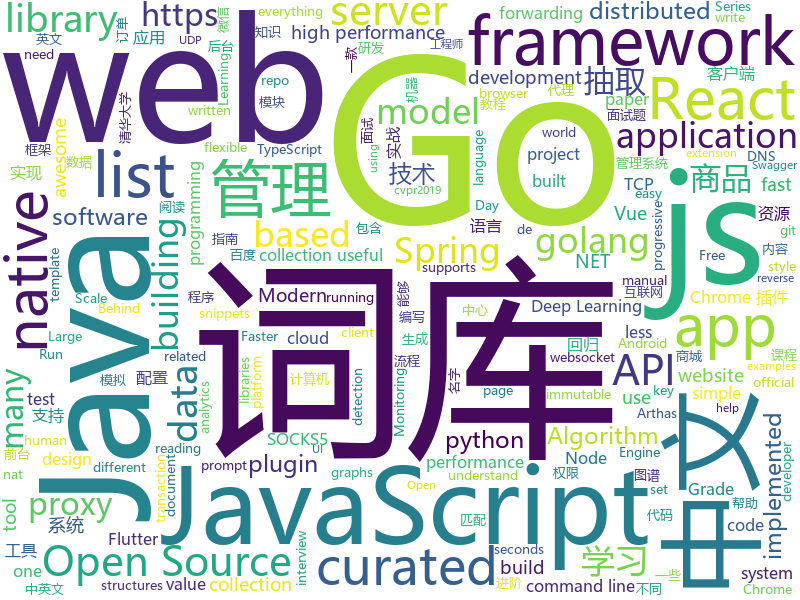

# 2019-03-09
See what the GitHub community is most excited about today.

## python
* [awesome-python-login-model](https://github.com/CriseLYJ/awesome-python-login-model)(**590 stars today**): 😮python模拟登陆一些大型网站，还有一些简单的爬虫，希望对你们有所帮助❤️，如果喜欢记得给个star哦🌟
* [celeb-detection-oss](https://github.com/Giphy/celeb-detection-oss)(**208 stars today**): GIPHY's Open-Source Celebrity Detection Deep Learning Model
* [USTC-Course](https://github.com/USTC-Resource/USTC-Course)(**165 stars today**): ❤️中国科学技术大学课程资源
* [system-design-primer](https://github.com/donnemartin/system-design-primer)(**105 stars today**): Learn how to design large-scale systems. Prep for the system design interview. Includes Anki flashcards.
* [CheatSheetSeries](https://github.com/OWASP/CheatSheetSeries)(**104 stars today**): The OWASP Cheat Sheet Series was created to provide a concise collection of high value information on specific application security topics.
* [pytorch_geometric](https://github.com/rusty1s/pytorch_geometric)(**91 stars today**): Geometric Deep Learning Extension Library for PyTorch
* [compare_gan](https://github.com/google/compare_gan)(**87 stars today**): Compare GAN code.
* [SiamMask](https://github.com/foolwood/SiamMask)(**79 stars today**): [CVPR2019] Fast Online Object Tracking and Segmentation: A Unifying Approach
* [gitbook2pdf](https://github.com/fuergaosi233/gitbook2pdf)(**80 stars today**): Grab the contents of the gitbook document and convert it to pdf
* [faceswap](https://github.com/deepfakes/faceswap)(**61 stars today**): Non official project based on original /r/Deepfakes thread. Many thanks to him!
* [models](https://github.com/tensorflow/models)(**53 stars today**): Models and examples built with TensorFlow
* [public-apis](https://github.com/toddmotto/public-apis)(**67 stars today**): A collective list of free APIs for use in software and web development.
* [zero](https://github.com/remoteinterview/zero)(**71 stars today**): Zero is a web server to simplify web development.
* [ChromeAppHeroes](https://github.com/zhaoolee/ChromeAppHeroes)(**64 stars today**): 🌈Chrome插件英雄榜, 为优秀的Chrome插件写一本中文说明书, 让Chrome插件英雄们造福人类~ ChromePluginHeroes, Write a Chinese manual for the excellent Chrome plugin, let the Chrome plugin heroes benefit the human~
* [Python](https://github.com/TheAlgorithms/Python)(**57 stars today**): All Algorithms implemented in Python
* [awesome-python](https://github.com/vinta/awesome-python)(**52 stars today**): A curated list of awesome Python frameworks, libraries, software and resources
* [keras](https://github.com/keras-team/keras)(**43 stars today**): Deep Learning for humans
* [subsync](https://github.com/smacke/subsync)(**49 stars today**): Automagically synchronize subtitles with video.
* [bullet](https://github.com/Mckinsey666/bullet)(**46 stars today**): 🚅Interactive prompts made simple. Build a prompt like stacking blocks.
* [ludwig](https://github.com/uber/ludwig)(**40 stars today**): Ludwig is a toolbox built on top of TensorFlow that allows to train and test deep learning models without the need to write code.
* [neural-mmo](https://github.com/openai/neural-mmo)(**39 stars today**): Neural MMO - A Massively Multiagent Game Environment
* [django](https://github.com/django/django)(**30 stars today**): The Web framework for perfectionists with deadlines.
* [maskscoring_rcnn](https://github.com/zjhuang22/maskscoring_rcnn)(**34 stars today**): Codes for paper "Mask Scoring R-CNN".
* [funNLP](https://github.com/fighting41love/funNLP)(**33 stars today**): 中英文敏感词、语言检测、中外手机/电话归属地/运营商查询、名字推断性别、手机号抽取、身份证抽取、邮箱抽取、中日文人名库、中文缩写库、拆字词典、词汇情感值、停用词、反动词表、暴恐词表、繁简体转换、英文模拟中文发音、汪峰歌词生成器、职业名称词库、同义词库、反义词库、否定词库、汽车品牌词库、汽车零件词库、连续英文切割、各种中文词向量、公司名字大全、古诗词库、IT词库、财经词库、成语词库、地名词库、历史名人词库、诗词词库、医学词库、饮食词库、法律词库、汽车词库、动物词库、中文聊天语料、中文谣言数据、百度中文问答数据集、句子相似度匹配算法集合、bert资源、文本生成&摘要相关工具、cocoNLP信息抽取工具、国内电话号码正则匹配、清华大学XLORE:中英文跨语言百科知识图谱、清华大学人工智能技术…
* [face_recognition](https://github.com/ageitgey/face_recognition)(**29 stars today**): The world's simplest facial recognition api for Python and the command line

## java
* [JavaGuide](https://github.com/Snailclimb/JavaGuide)(**196 stars today**): 【Java学习+面试指南】 一份涵盖大部分Java程序员所需要掌握的核心知识。
* [quarkus](https://github.com/quarkusio/quarkus)(**193 stars today**): Quarkus: Supersonic Subatomic Java.
* [MyBookshelf](https://github.com/gedoor/MyBookshelf)(**155 stars today**): 阅读是一款可以自定义来源阅读网络内容的工具，为广大网络文学爱好者提供一种方便、快捷舒适的试读体验。
* [advanced-java](https://github.com/doocs/advanced-java)(**72 stars today**): 😮互联网 Java 工程师进阶知识完全扫盲
* [mall](https://github.com/macrozheng/mall)(**76 stars today**): mall项目是一套电商系统，包括前台商城系统及后台管理系统，基于SpringBoot+MyBatis实现。 前台商城系统包含首页门户、商品推荐、商品搜索、商品展示、购物车、订单流程、会员中心、客户服务、帮助中心等模块。 后台管理系统包含商品管理、订单管理、会员管理、促销管理、运营管理、内容管理、统计报表、财务管理、权限管理、设置等模块。
* [flutter_boost](https://github.com/alibaba/flutter_boost)(**79 stars today**): FlutterBoost is a Flutter plugin which enables hybrid integration of Flutter for your existing native apps with minimum efforts
* [spring-boot-examples](https://github.com/ityouknow/spring-boot-examples)(**49 stars today**): about learning Spring Boot via examples. Spring Boot 教程、技术栈示例代码，快速简单上手教程。
* [x7](https://github.com/x-ream/x7)(**33 stars today**): 
* [tutorials](https://github.com/eugenp/tutorials)(**28 stars today**): The "REST With Spring" Course:
* [elasticsearch](https://github.com/elastic/elasticsearch)(**44 stars today**): Open Source, Distributed, RESTful Search Engine
* [fescar](https://github.com/alibaba/fescar)(**40 stars today**): 🔥Fescar is an easy-to-use, high-performance, java based, open source distributed transaction solution.
* [spring-boot](https://github.com/spring-projects/spring-boot)(**37 stars today**): Spring Boot
* [arthas](https://github.com/alibaba/arthas)(**40 stars today**): Alibaba Java Diagnostic Tool Arthas/Alibaba Java诊断利器Arthas
* [miaosha](https://github.com/qiurunze123/miaosha)(**33 stars today**): ⭐⭐⭐⭐秒杀系统设计与实现.互联网工程师进阶与分析🙋🐓
* [spring-framework](https://github.com/spring-projects/spring-framework)(**28 stars today**): Spring Framework
* [apollo](https://github.com/ctripcorp/apollo)(**33 stars today**): Apollo（阿波罗）是携程框架部门研发的分布式配置中心，能够集中化管理应用不同环境、不同集群的配置，配置修改后能够实时推送到应用端，并且具备规范的权限、流程治理等特性，适用于微服务配置管理场景。
* [DoraemonKit](https://github.com/didi/DoraemonKit)(**35 stars today**): 简称 "DoKit" 。一款功能齐全的客户端（ iOS 、Android ）研发助手，你值得拥有。
* [sofa-jraft](https://github.com/alipay/sofa-jraft)(**34 stars today**): An industrial-grade java implementation of RAFT consensus algorithm.
* [JCSprout](https://github.com/crossoverJie/JCSprout)(**30 stars today**): 👨‍🎓Java Core Sprout : basic, concurrent, algorithm
* [nacos](https://github.com/alibaba/nacos)(**29 stars today**): an easy-to-use dynamic service discovery, configuration and service management platform for building cloud native applications.
* [incubator-skywalking](https://github.com/apache/incubator-skywalking)(**27 stars today**): A distributed tracing system, and APM ( Application Performance Monitoring )
* [Java](https://github.com/TheAlgorithms/Java)(**25 stars today**): All Algorithms implemented in Java
* [JReadHub](https://github.com/guanpj/JReadHub)(**25 stars today**): Readhub Android 客户端——官网 : https://readhub.cn
* [graal](https://github.com/oracle/graal)(**25 stars today**): GraalVM: Run Programs Faster Anywhere🚀
* [incubator-dubbo](https://github.com/apache/incubator-dubbo)(**18 stars today**): Apache Dubbo (incubating) is a high-performance, java based, open source RPC framework.

## unknown
* [ghidra](https://github.com/NationalSecurityAgency/ghidra)(**958 stars today**): Ghidra is a software reverse engineering (SRE) framework
* [ycy](https://github.com/ccyyycy/ycy)(**484 stars today**): "Hello YCY" Programming Competition
* [Micro8](https://github.com/Micropoor/Micro8)(**366 stars today**): Gitbook
* [CS-Notes](https://github.com/CyC2018/CS-Notes)(**170 stars today**): 😋技术面试必备基础知识
* [Awesome-Design-Tools](https://github.com/LisaDziuba/Awesome-Design-Tools)(**154 stars today**): The best design tools for everything.
* [python_interview_question](https://github.com/kenwoodjw/python_interview_question)(**120 stars today**): 关于python的面试题
* [awesome](https://github.com/sindresorhus/awesome)(**90 stars today**): 😎Awesome lists about all kinds of interesting topics
* [How-To-Secure-A-Linux-Server](https://github.com/imthenachoman/How-To-Secure-A-Linux-Server)(**83 stars today**): An evolving how-to guide for securing a Linux server.
* [gitignore](https://github.com/github/gitignore)(**53 stars today**): A collection of useful .gitignore templates
* [Daily-Interview-Question](https://github.com/Advanced-Frontend/Daily-Interview-Question)(**67 stars today**): 工作日每天一道前端大厂面试题，祝大家天天进步，一年后会看到不一样的自己。
* [nlp-library](https://github.com/mihail911/nlp-library)(**64 stars today**): a curated collection of papers for the nlp practitioner
* [You-Dont-Know-JS](https://github.com/getify/You-Dont-Know-JS)(**54 stars today**): A book series on JavaScript. @YDKJS on twitter.
* [awesome-scalability](https://github.com/binhnguyennus/awesome-scalability)(**57 stars today**): The Patterns Behind Scalable, Reliable, and Performant Large-Scale Systems
* [the-book-of-secret-knowledge](https://github.com/trimstray/the-book-of-secret-knowledge)(**48 stars today**): A collection of inspiring lists, manuals, cheatsheets, blogs, hacks, one-liners, cli/web tools and more.
* [free-programming-books-zh_CN](https://github.com/justjavac/free-programming-books-zh_CN)(**46 stars today**): 📚免费的计算机编程类中文书籍，欢迎投稿
* [EasyWordPressBook](https://github.com/bestony/EasyWordPressBook)(**48 stars today**): 人人都能学会的 WordPress 实战课
* [free-programming-books](https://github.com/EbookFoundation/free-programming-books)(**40 stars today**): 📚Freely available programming books
* [vue-typescript-cookbook](https://github.com/ffxsam/vue-typescript-cookbook)(**43 stars today**): Recipes to demystify Vue + TypeScript
* [awesome-vue](https://github.com/vuejs/awesome-vue)(**39 stars today**): 🎉A curated list of awesome things related to Vue.js
* [hosts](https://github.com/googlehosts/hosts)(**32 stars today**): 镜像：https://coding.net/u/scaffrey/p/hosts/git
* [architect-awesome](https://github.com/xingshaocheng/architect-awesome)(**35 stars today**): 后端架构师技术图谱
* [awesome-wechat-weapp](https://github.com/justjavac/awesome-wechat-weapp)(**36 stars today**): 微信小程序开发资源汇总💯
* [cvpr2019](https://github.com/extreme-assistant/cvpr2019)(**30 stars today**): cvpr2019 papers
* [react-typescript-cheatsheet](https://github.com/sw-yx/react-typescript-cheatsheet)(**34 stars today**): Cheatsheets for experienced React developers getting started with TypeScript

## javascript
* [ink](https://github.com/vadimdemedes/ink)(**181 stars today**): 🌈React for interactive command-line apps
* [vue](https://github.com/vuejs/vue)(**129 stars today**): 🖖Vue.js is a progressive, incrementally-adoptable JavaScript framework for building UI on the web.
* [x-spreadsheet](https://github.com/myliang/x-spreadsheet)(**127 stars today**): A web-based JavaScript（canvas） spreadsheet
* [strapi](https://github.com/strapi/strapi)(**126 stars today**): 🚀Open source Node.js Headless CMS to easily build customisable APIs
* [git-history](https://github.com/pomber/git-history)(**103 stars today**): Quickly browse the history of a file from any git repository
* [arangodb](https://github.com/arangodb/arangodb)(**102 stars today**): 🥑ArangoDB is a native multi-model database with flexible data models for documents, graphs, and key-values. Build high performance applications using a convenient SQL-like query language or JavaScript extensions.
* [hiring-without-whiteboards](https://github.com/poteto/hiring-without-whiteboards)(**95 stars today**): ⭐️Companies that don't have a broken hiring process
* [30-seconds-of-code](https://github.com/30-seconds/30-seconds-of-code)(**90 stars today**): A curated collection of useful JavaScript snippets that you can understand in 30 seconds or less.
* [react](https://github.com/facebook/react)(**86 stars today**): A declarative, efficient, and flexible JavaScript library for building user interfaces.
* [dequal](https://github.com/lukeed/dequal)(**86 stars today**): A tiny (247B) utility for check for deep equality
* [Motrix](https://github.com/agalwood/Motrix)(**77 stars today**): A full-featured download manager.
* [storybook](https://github.com/storybooks/storybook)(**76 stars today**): UI component dev & test: React, React Native, Vue, Angular, Ember & more!
* [taro](https://github.com/NervJS/taro)(**66 stars today**): 多端统一开发框架，支持用 React 的开发方式编写一次代码，生成能运行在微信/百度/支付宝/字节跳动小程序、H5、React Native 等的应用。 https://taro.js.org/
* [handtrack.js](https://github.com/victordibia/handtrack.js)(**68 stars today**): A library for prototyping realtime hand detection (bounding box), directly in the browser.
* [dayjs](https://github.com/iamkun/dayjs)(**65 stars today**): ⏰Day.js 2KB immutable date library alternative to Moment.js with the same modern API
* [javascript-algorithms](https://github.com/trekhleb/javascript-algorithms)(**60 stars today**): 📝Algorithms and data structures implemented in JavaScript with explanations and links to further readings
* [react-snakke](https://github.com/diogomoretti/react-snakke)(**62 stars today**): 🐍Reading position indicator for React
* [delegate-it](https://github.com/bfred-it/delegate-it)(**61 stars today**): Lightweight event delegation
* [javascript](https://github.com/airbnb/javascript)(**54 stars today**): JavaScript Style Guide
* [axios](https://github.com/axios/axios)(**54 stars today**): Promise based HTTP client for the browser and node.js
* [create-react-app](https://github.com/facebook/create-react-app)(**42 stars today**): Set up a modern web app by running one command.
* [grant](https://github.com/simov/grant)(**51 stars today**): OAuth Middleware for Express, Koa and Hapi
* [ColorUI](https://github.com/weilanwl/ColorUI)(**47 stars today**): 鲜亮的高饱和色彩，专注视觉的小程序组件库
* [node](https://github.com/nodejs/node)(**42 stars today**): Node.js JavaScript runtime✨🐢🚀✨
* [react-native](https://github.com/facebook/react-native)(**43 stars today**): A framework for building native apps with React.

## html
* [lets-get-arrested](https://github.com/hamukazu/lets-get-arrested)(**372 stars today**): This project is intended to protest against the police in Japan
* [personal-website](https://github.com/github/personal-website)(**211 stars today**): Code that'll help you kickstart a personal website that showcases your work as a software developer.
* [javascript-tutorial-en](https://github.com/iliakan/javascript-tutorial-en)(**72 stars today**): Modern JavaScript Tutorial
* [quickchart](https://github.com/typpo/quickchart)(**74 stars today**): Google Image Charts alternative
* [not-so-random](https://github.com/ex-punctis/not-so-random)(**69 stars today**): A script [js + plotly.js] that guesses your next input no matter how random you try to be
* [automatic-app-landing-page](https://github.com/emilbaehr/automatic-app-landing-page)(**64 stars today**): A Jekyll theme for automatically generating and deploying landing page sites for mobile apps.
* [flutter-in-action](https://github.com/flutterchina/flutter-in-action)(**58 stars today**): 《Flutter实战》电子书
* [javascript-tutorial-zh](https://github.com/xitu/javascript-tutorial-zh)(**23 stars today**): Modern JavaScript Tutorial
* [Coursera-ML-AndrewNg-Notes](https://github.com/fengdu78/Coursera-ML-AndrewNg-Notes)(**18 stars today**): 吴恩达老师的机器学习课程个人笔记
* [Spoon-Knife](https://github.com/octocat/Spoon-Knife)(****): This repo is for demonstration purposes only.
* [dotnet](https://github.com/Microsoft/dotnet)(**18 stars today**): This repo is the official home of .NET on GitHub. It's a great starting point to find many .NET OSS projects from Microsoft and the community, including many that are part of the .NET Foundation.
* [stisla](https://github.com/stisla/stisla)(**16 stars today**): Free Bootstrap Admin Template
* [30-seconds-of-css](https://github.com/30-seconds/30-seconds-of-css)(**15 stars today**): A curated collection of useful CSS snippets you can understand in 30 seconds or less.
* [JavaScript30](https://github.com/wesbos/JavaScript30)(**6 stars today**): 30 Day Vanilla JS Challenge
* [ionic](https://github.com/ionic-team/ionic)(**12 stars today**): Build amazing native and progressive web apps with open web technologies. One app running on everything🎉
* [swagger-codegen](https://github.com/swagger-api/swagger-codegen)(**12 stars today**): swagger-codegen contains a template-driven engine to generate documentation, API clients and server stubs in different languages by parsing your OpenAPI / Swagger definition.
* [climanifeste](https://github.com/climanifeste/climanifeste)(**5 stars today**): Manifeste écologique des professionnel.le.s de l'informatique
* [fastText](https://github.com/facebookresearch/fastText)(**11 stars today**): Library for fast text representation and classification.
* [devops-essentials-sample-app](https://github.com/linuxacademy/devops-essentials-sample-app)(****): 
* [statping](https://github.com/hunterlong/statping)(**11 stars today**): Status Page for monitoring your websites and applications with beautiful graphs, analytics, and plugins. Run on any type of environment.
* [DeepLearning-Notes](https://github.com/strivebo/DeepLearning-Notes)(**7 stars today**): 📘记录深度学习的学习过程和资料整理，包括计算机视觉CV、Paper解读等...
* [blog_os](https://github.com/phil-opp/blog_os)(**7 stars today**): Writing an OS in Rust
* [csswg-drafts](https://github.com/w3c/csswg-drafts)(**8 stars today**): CSS Working Group Editor Drafts
* [Machine-Learning](https://github.com/Jack-Cherish/Machine-Learning)(**6 stars today**): ⚡️机器学习实战（Python3）：kNN、决策树、贝叶斯、逻辑回归、SVM、线性回归、树回归
* [Front-end-Developer-Interview-Questions](https://github.com/h5bp/Front-end-Developer-Interview-Questions)(****): A list of helpful front-end related questions you can use to interview potential candidates, test yourself or completely ignore.

## go
* [kraken](https://github.com/uber/kraken)(**190 stars today**): P2P Docker registry capable of distributing TBs of data in seconds
* [k3s](https://github.com/rancher/k3s)(**110 stars today**): Lightweight Kubernetes. 5 less than k8s.
* [nutsdb](https://github.com/xujiajun/nutsdb)(**104 stars today**): A simple, fast, embeddable, persistent key/value store written in pure Go. It supports fully serializable transactions and many data structures such as list, set, sorted set.
* [go-micro](https://github.com/micro/go-micro)(**96 stars today**): A microservice framework
* [cds](https://github.com/ovh/cds)(**80 stars today**): Enterprise-Grade Continuous Delivery & DevOps Automation Open Source Platform
* [pipe-to-me](https://github.com/jpschroeder/pipe-to-me)(**79 stars today**): Stream data over http using curl.
* [kubernetes](https://github.com/kubernetes/kubernetes)(**63 stars today**): Production-Grade Container Scheduling and Management
* [go](https://github.com/golang/go)(**68 stars today**): The Go programming language
* [caddy](https://github.com/mholt/caddy)(**62 stars today**): Fast, cross-platform HTTP/2 web server with automatic HTTPS
* [mercure](https://github.com/dunglas/mercure)(**55 stars today**): Server-sent live updates: protocol and reference implementation
* [awesome-go](https://github.com/avelino/awesome-go)(**51 stars today**): A curated list of awesome Go frameworks, libraries and software
* [fathom](https://github.com/usefathom/fathom)(**53 stars today**): Fathom. Simple, trustworthy website analytics. Built with Golang & Preact.
* [logrus](https://github.com/sirupsen/logrus)(**50 stars today**): Structured, pluggable logging for Go.
* [konfig](https://github.com/lalamove/konfig)(**43 stars today**): Composable, observable and performant config handling for Go for the distributed processing era
* [gin](https://github.com/gin-gonic/gin)(**40 stars today**): Gin is a HTTP web framework written in Go (Golang). It features a Martini-like API with much better performance -- up to 40 times faster. If you need smashing performance, get yourself some Gin.
* [frp](https://github.com/fatedier/frp)(**36 stars today**): A fast reverse proxy to help you expose a local server behind a NAT or firewall to the internet.
* [goproxy](https://github.com/snail007/goproxy)(**38 stars today**): Proxy is a high performance HTTP(S), websocket, TCP, UDP,Secure DNS, Socks5 proxy server implemented by golang. Now, it supports chain-style proxies,nat forwarding in different lan,TCP/UDP port forwarding, SSH forwarding.Proxy是golang实现的高性能http,https,websocket,tcp,防污染DNS,socks5代理服务器,支持内网穿透,链式代理,通讯加密,智能HTTP,SOCKS5代理,域名黑白名单,跨平台,KCP协议支持,集成外部API。
* [immutable](https://github.com/benbjohnson/immutable)(**39 stars today**): Immutable collections for Go
* [fzf](https://github.com/junegunn/fzf)(**38 stars today**): 🌸A command-line fuzzy finder
* [BaiduPCS-Go](https://github.com/iikira/BaiduPCS-Go)(**33 stars today**): 百度网盘客户端 - Go语言编写
* [human_duration](https://github.com/davidbanham/human_duration)(**33 stars today**): A little Go util to print duration strings in a human-friendly format
* [hugo](https://github.com/gohugoio/hugo)(**32 stars today**): The world’s fastest framework for building websites.
* [the-way-to-go_ZH_CN](https://github.com/Unknwon/the-way-to-go_ZH_CN)(**28 stars today**): 《The Way to Go》中文译本，中文正式名《Go 入门指南》
* [build-web-application-with-golang](https://github.com/astaxie/build-web-application-with-golang)(**28 stars today**): A golang ebook intro how to build a web with golang
* [go-cloud](https://github.com/google/go-cloud)(**28 stars today**): The Go Cloud Development Kit (Go CDK): A library and tools for open cloud development in Go.

## WordCloud

