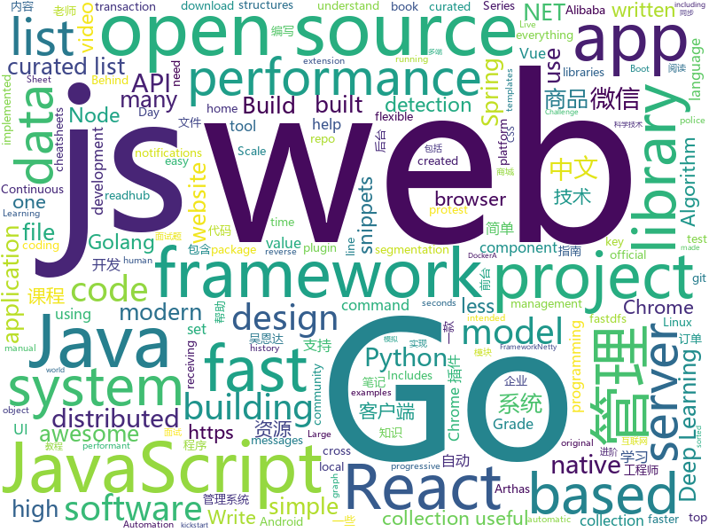

# 2019-03-10
See what the GitHub community is most excited about today.

## python
* [ArchiveBox](https://github.com/pirate/ArchiveBox)(**351 stars today**): 🗃The open source self-hosted web archive. Takes browser history/bookmarks/Pocket/Pinboard/etc., saves HTML, JS, PDFs, media, and more...
* [pytorch_geometric](https://github.com/rusty1s/pytorch_geometric)(**280 stars today**): Geometric Deep Learning Extension Library for PyTorch
* [awesome-python-login-model](https://github.com/CriseLYJ/awesome-python-login-model)(**170 stars today**): 😮python模拟登陆一些大型网站，还有一些简单的爬虫，希望对你们有所帮助❤️，如果喜欢记得给个star哦🌟
* [system-design-primer](https://github.com/donnemartin/system-design-primer)(**116 stars today**): Learn how to design large-scale systems. Prep for the system design interview. Includes Anki flashcards.
* [USTC-Course](https://github.com/USTC-Resource/USTC-Course)(**78 stars today**): ❤️中国科学技术大学课程资源
* [Python](https://github.com/TheAlgorithms/Python)(**67 stars today**): All Algorithms implemented in Python
* [Python](https://github.com/geekcomputers/Python)(**57 stars today**): My Python Examples
* [awesome-python](https://github.com/vinta/awesome-python)(**52 stars today**): A curated list of awesome Python frameworks, libraries, software and resources
* [public-apis](https://github.com/toddmotto/public-apis)(**50 stars today**): A collective list of free APIs for use in software and web development.
* [CheatSheetSeries](https://github.com/OWASP/CheatSheetSeries)(**50 stars today**): The OWASP Cheat Sheet Series was created to provide a concise collection of high value information on specific application security topics.
* [faceswap](https://github.com/deepfakes/faceswap)(**43 stars today**): Non official project based on original /r/Deepfakes thread. Many thanks to him!
* [models](https://github.com/tensorflow/models)(**38 stars today**): Models and examples built with TensorFlow
* [celeb-detection-oss](https://github.com/Giphy/celeb-detection-oss)(**43 stars today**): GIPHY's Open-Source Celebrity Detection Deep Learning Model
* [dgl](https://github.com/dmlc/dgl)(**39 stars today**): Python package built to ease deep learning on graph, on top of existing DL frameworks.
* [ChromeAppHeroes](https://github.com/zhaoolee/ChromeAppHeroes)(**40 stars today**): 🌈Chrome插件英雄榜, 为优秀的Chrome插件写一本中文说明书, 让Chrome插件英雄们造福人类~ ChromePluginHeroes, Write a Chinese manual for the excellent Chrome plugin, let the Chrome plugin heroes benefit the human~
* [stone](https://github.com/dropbox/stone)(**39 stars today**): Write your APIs in stone.
* [SiamMask](https://github.com/foolwood/SiamMask)(**36 stars today**): [CVPR2019] Fast Online Object Tracking and Segmentation: A Unifying Approach
* [keras](https://github.com/keras-team/keras)(**34 stars today**): Deep Learning for humans
* [zero](https://github.com/remoteinterview/zero)(**35 stars today**): Zero is a web server to simplify web development.
* [youtube-dl](https://github.com/rg3/youtube-dl)(**33 stars today**): Command-line program to download videos from YouTube.com and other video sites
* [gpt-2](https://github.com/openai/gpt-2)(**26 stars today**): Code for the paper "Language Models are Unsupervised Multitask Learners"
* [Mask_RCNN](https://github.com/matterport/Mask_RCNN)(**27 stars today**): Mask R-CNN for object detection and instance segmentation on Keras and TensorFlow
* [ludwig](https://github.com/uber/ludwig)(**25 stars today**): Ludwig is a toolbox built on top of TensorFlow that allows to train and test deep learning models without the need to write code.
* [subsync](https://github.com/smacke/subsync)(**27 stars today**): Automagically synchronize subtitles with video.
* [home-assistant](https://github.com/home-assistant/home-assistant)(**23 stars today**): 🏡Open source home automation that puts local control and privacy first

## java
* [UserLAnd](https://github.com/CypherpunkArmory/UserLAnd)(**263 stars today**): Main UserLAnd Repository
* [JavaGuide](https://github.com/Snailclimb/JavaGuide)(**134 stars today**): 【Java学习+面试指南】 一份涵盖大部分Java程序员所需要掌握的核心知识。
* [quarkus](https://github.com/quarkusio/quarkus)(**99 stars today**): Quarkus: Supersonic Subatomic Java.
* [MyBookshelf](https://github.com/gedoor/MyBookshelf)(**66 stars today**): 阅读是一款可以自定义来源阅读网络内容的工具，为广大网络文学爱好者提供一种方便、快捷舒适的试读体验。
* [advanced-java](https://github.com/doocs/advanced-java)(**60 stars today**): 😮互联网 Java 工程师进阶知识完全扫盲
* [mall](https://github.com/macrozheng/mall)(**54 stars today**): mall项目是一套电商系统，包括前台商城系统及后台管理系统，基于SpringBoot+MyBatis实现。 前台商城系统包含首页门户、商品推荐、商品搜索、商品展示、购物车、订单流程、会员中心、客户服务、帮助中心等模块。 后台管理系统包含商品管理、订单管理、会员管理、促销管理、运营管理、内容管理、统计报表、财务管理、权限管理、设置等模块。
* [tutorials](https://github.com/eugenp/tutorials)(**22 stars today**): The "REST With Spring" Course:
* [fescar](https://github.com/alibaba/fescar)(**31 stars today**): 🔥Fescar is an easy-to-use, high-performance, java based, open source distributed transaction solution.
* [elasticsearch](https://github.com/elastic/elasticsearch)(**28 stars today**): Open Source, Distributed, RESTful Search Engine
* [Leaf](https://github.com/Meituan-Dianping/Leaf)(**29 stars today**): Distributed ID Generate Service
* [miaosha](https://github.com/qiurunze123/miaosha)(**29 stars today**): ⭐⭐⭐⭐秒杀系统设计与实现.互联网工程师进阶与分析🙋🐓
* [spring-boot-examples](https://github.com/ityouknow/spring-boot-examples)(**29 stars today**): about learning Spring Boot via examples. Spring Boot 教程、技术栈示例代码，快速简单上手教程。
* [spring-boot](https://github.com/spring-projects/spring-boot)(**24 stars today**): Spring Boot
* [incubator-dubbo](https://github.com/apache/incubator-dubbo)(**21 stars today**): Apache Dubbo (incubating) is a high-performance, java based, open source RPC framework.
* [arthas](https://github.com/alibaba/arthas)(**23 stars today**): Alibaba Java Diagnostic Tool Arthas/Alibaba Java诊断利器Arthas
* [DoraemonKit](https://github.com/didi/DoraemonKit)(**24 stars today**): 简称 "DoKit" 。一款功能齐全的客户端（ iOS 、Android ）研发助手，你值得拥有。
* [sofa-jraft](https://github.com/alipay/sofa-jraft)(**23 stars today**): An industrial-grade java implementation of RAFT consensus algorithm.
* [incubator-skywalking](https://github.com/apache/incubator-skywalking)(**22 stars today**): A distributed tracing system, and APM ( Application Performance Monitoring )
* [JReadHub](https://github.com/guanpj/JReadHub)(**24 stars today**): Readhub Android 客户端——官网 : https://readhub.cn
* [spring-framework](https://github.com/spring-projects/spring-framework)(**15 stars today**): Spring Framework
* [netty](https://github.com/netty/netty)(**18 stars today**): Netty project - an event-driven asynchronous network application framework
* [android](https://github.com/gotify/android)(**18 stars today**): An app for receiving push notifications on new messages posted to gotify/server.
* [flink](https://github.com/apache/flink)(**14 stars today**): Apache Flink
* [HanLP](https://github.com/hankcs/HanLP)(**17 stars today**): 自然语言处理 中文分词 词性标注 命名实体识别 依存句法分析 新词发现 关键词短语提取 自动摘要 文本分类聚类 拼音简繁
* [WxJava](https://github.com/Wechat-Group/WxJava)(**14 stars today**): WxJava （微信开发 Java SDK），支持包括微信支付、开放平台、小程序、企业微信/企业号和公众号等的后端开发

## unknown
* [ghidra](https://github.com/NationalSecurityAgency/ghidra)(**430 stars today**): Ghidra is a software reverse engineering (SRE) framework
* [Micro8](https://github.com/Micropoor/Micro8)(**160 stars today**): Gitbook
* [CS-Notes](https://github.com/CyC2018/CS-Notes)(**97 stars today**): 😋技术面试必备基础知识
* [ycy](https://github.com/ccyyycy/ycy)(**104 stars today**): "Hello YCY" Programming Competition
* [python_interview_question](https://github.com/kenwoodjw/python_interview_question)(**77 stars today**): 关于python的面试题
* [Awesome-Design-Tools](https://github.com/LisaDziuba/Awesome-Design-Tools)(**80 stars today**): The best design tools for everything.
* [awesome](https://github.com/sindresorhus/awesome)(**69 stars today**): 😎Awesome lists about all kinds of interesting topics
* [gitignore](https://github.com/github/gitignore)(**47 stars today**): A collection of useful .gitignore templates
* [free-programming-books-zh_CN](https://github.com/justjavac/free-programming-books-zh_CN)(**56 stars today**): 📚免费的计算机编程类中文书籍，欢迎投稿
* [How-To-Secure-A-Linux-Server](https://github.com/imthenachoman/How-To-Secure-A-Linux-Server)(**51 stars today**): An evolving how-to guide for securing a Linux server.
* [free-programming-books](https://github.com/EbookFoundation/free-programming-books)(**39 stars today**): 📚Freely available programming books
* [You-Dont-Know-JS](https://github.com/getify/You-Dont-Know-JS)(**40 stars today**): A book series on JavaScript. @YDKJS on twitter.
* [the-book-of-secret-knowledge](https://github.com/trimstray/the-book-of-secret-knowledge)(**41 stars today**): A collection of inspiring lists, manuals, cheatsheets, blogs, hacks, one-liners, cli/web tools and more.
* [python-cheatsheet](https://github.com/BisratYalew/python-cheatsheet)(**38 stars today**): Collection of Python code snippets and cheatsheets (made for humans)
* [architect-awesome](https://github.com/xingshaocheng/architect-awesome)(**30 stars today**): 后端架构师技术图谱
* [first-contributions](https://github.com/firstcontributions/first-contributions)(**19 stars today**): 🚀✨Help beginners to contribute to open source projects
* [project-based-learning](https://github.com/tuvtran/project-based-learning)(**29 stars today**): Curated list of project-based tutorials
* [awesome-wechat-weapp](https://github.com/justjavac/awesome-wechat-weapp)(**24 stars today**): 微信小程序开发资源汇总💯
* [trackerslist](https://github.com/ngosang/trackerslist)(**27 stars today**): An updated list of public BitTorrent trackers
* [hosts](https://github.com/googlehosts/hosts)(**22 stars today**): 镜像：https://coding.net/u/scaffrey/p/hosts/git
* [Daily-Interview-Question](https://github.com/Advanced-Frontend/Daily-Interview-Question)(**27 stars today**): 工作日每天一道前端大厂面试题，祝大家天天进步，一年后会看到不一样的自己。
* [lets-not-be-arrested](https://github.com/yoshi1125hisa/lets-not-be-arrested)(**24 stars today**): This project is intended to protest against the police in Japan
* [awesome-vue](https://github.com/vuejs/awesome-vue)(**26 stars today**): 🎉A curated list of awesome things related to Vue.js
* [awesome-scalability](https://github.com/binhnguyennus/awesome-scalability)(**24 stars today**): The Patterns Behind Scalable, Reliable, and Performant Large-Scale Systems

## javascript
* [Motrix](https://github.com/agalwood/Motrix)(**139 stars today**): A full-featured download manager.
* [awesome-vscode](https://github.com/viatsko/awesome-vscode)(**122 stars today**): 🎨A curated list of delightful VS Code packages and resources.
* [ink](https://github.com/vadimdemedes/ink)(**121 stars today**): 🌈React for interactive command-line apps
* [vue](https://github.com/vuejs/vue)(**96 stars today**): 🖖Vue.js is a progressive, incrementally-adoptable JavaScript framework for building UI on the web.
* [react](https://github.com/facebook/react)(**84 stars today**): A declarative, efficient, and flexible JavaScript library for building user interfaces.
* [arangodb](https://github.com/arangodb/arangodb)(**70 stars today**): 🥑ArangoDB is a native multi-model database with flexible data models for documents, graphs, and key-values. Build high performance applications using a convenient SQL-like query language or JavaScript extensions.
* [git-history](https://github.com/pomber/git-history)(**63 stars today**): Quickly browse the history of a file from any git repository
* [x-spreadsheet](https://github.com/myliang/x-spreadsheet)(**57 stars today**): A web-based JavaScript（canvas） spreadsheet
* [nlp.js](https://github.com/axa-group/nlp.js)(**54 stars today**): An NLP library for building bots, with entity extraction, sentiment analysis, automatic language identify, and so more
* [30-seconds-of-code](https://github.com/30-seconds/30-seconds-of-code)(**48 stars today**): A curated collection of useful JavaScript snippets that you can understand in 30 seconds or less.
* [dequal](https://github.com/lukeed/dequal)(**50 stars today**): A tiny (247B) utility for check for deep equality
* [handtrack.js](https://github.com/victordibia/handtrack.js)(**46 stars today**): A library for prototyping realtime hand detection (bounding box), directly in the browser.
* [hiring-without-whiteboards](https://github.com/poteto/hiring-without-whiteboards)(**46 stars today**): ⭐️Companies that don't have a broken hiring process
* [axios](https://github.com/axios/axios)(**45 stars today**): Promise based HTTP client for the browser and node.js
* [strapi](https://github.com/strapi/strapi)(**42 stars today**): 🚀Open source Node.js Headless CMS to easily build customisable APIs
* [javascript-algorithms](https://github.com/trekhleb/javascript-algorithms)(**41 stars today**): 📝Algorithms and data structures implemented in JavaScript with explanations and links to further readings
* [puppeteer](https://github.com/GoogleChrome/puppeteer)(**43 stars today**): Headless Chrome Node API
* [taro](https://github.com/NervJS/taro)(**40 stars today**): 多端统一开发框架，支持用 React 的开发方式编写一次代码，生成能运行在微信/百度/支付宝/字节跳动小程序、H5、React Native 等的应用。 https://taro.js.org/
* [create-react-app](https://github.com/facebook/create-react-app)(**35 stars today**): Set up a modern web app by running one command.
* [material-ui](https://github.com/mui-org/material-ui)(**34 stars today**): React components for faster and easier web development. Build your own design system, or start with Material Design.
* [dayjs](https://github.com/iamkun/dayjs)(**35 stars today**): ⏰Day.js 2KB immutable date library alternative to Moment.js with the same modern API
* [node](https://github.com/nodejs/node)(**31 stars today**): Node.js JavaScript runtime✨🐢🚀✨
* [gatsby](https://github.com/gatsbyjs/gatsby)(**30 stars today**): Build blazing fast, modern apps and websites with React
* [storybook](https://github.com/storybooks/storybook)(**30 stars today**): UI component dev & test: React, React Native, Vue, Angular, Ember & more!
* [react-native](https://github.com/facebook/react-native)(**27 stars today**): A framework for building native apps with React.

## html
* [lets-get-arrested](https://github.com/hamukazu/lets-get-arrested)(**384 stars today**): This project is intended to protest against the police in Japan
* [personal-website](https://github.com/github/personal-website)(**141 stars today**): Code that'll help you kickstart a personal website that showcases your work as a software developer.
* [automatic-app-landing-page](https://github.com/emilbaehr/automatic-app-landing-page)(**63 stars today**): A Jekyll theme for automatically generating and deploying landing page sites for mobile apps.
* [PS4-6.20-WebKit-Code-Execution-Exploit](https://github.com/Cryptogenic/PS4-6.20-WebKit-Code-Execution-Exploit)(**35 stars today**): A WebKit exploit using CVE-2018-4441 to obtain RCE on PS4 6.20.
* [javascript-tutorial-en](https://github.com/iliakan/javascript-tutorial-en)(**31 stars today**): Modern JavaScript Tutorial
* [not-so-random](https://github.com/ex-punctis/not-so-random)(**19 stars today**): A script [js + plotly.js] that guesses your next input no matter how random you try to be
* [ionic](https://github.com/ionic-team/ionic)(**15 stars today**): Build amazing native and progressive web apps with open web technologies. One app running on everything🎉
* [Coursera-ML-AndrewNg-Notes](https://github.com/fengdu78/Coursera-ML-AndrewNg-Notes)(**17 stars today**): 吴恩达老师的机器学习课程个人笔记
* [deeplearning_ai_books](https://github.com/fengdu78/deeplearning_ai_books)(**11 stars today**): deeplearning.ai（吴恩达老师的深度学习课程笔记及资源）
* [quickchart](https://github.com/typpo/quickchart)(**13 stars today**): Google Image Charts alternative
* [JavaScript30](https://github.com/wesbos/JavaScript30)(**5 stars today**): 30 Day Vanilla JS Challenge
* [flutter-in-action](https://github.com/flutterchina/flutter-in-action)(**11 stars today**): 《Flutter实战》电子书
* [30-seconds-of-css](https://github.com/30-seconds/30-seconds-of-css)(**9 stars today**): A curated collection of useful CSS snippets you can understand in 30 seconds or less.
* [Spoon-Knife](https://github.com/octocat/Spoon-Knife)(****): This repo is for demonstration purposes only.
* [polymer](https://github.com/Polymer/polymer)(**9 stars today**): Our original Web Component library.
* [csswg-drafts](https://github.com/w3c/csswg-drafts)(**8 stars today**): CSS Working Group Editor Drafts
* [stisla](https://github.com/stisla/stisla)(**7 stars today**): Free Bootstrap Admin Template
* [portainer](https://github.com/portainer/portainer)(**8 stars today**): Simple management UI for Docker
* [dataviz](https://github.com/clauswilke/dataviz)(**7 stars today**): A book covering the fundamentals of data visualization.
* [dotnet](https://github.com/Microsoft/dotnet)(**6 stars today**): This repo is the official home of .NET on GitHub. It's a great starting point to find many .NET OSS projects from Microsoft and the community, including many that are part of the .NET Foundation.
* [Iosevka](https://github.com/be5invis/Iosevka)(**7 stars today**): Slender typeface for code, from code.
* [tools](https://github.com/googlecodelabs/tools)(**6 stars today**): Codelabs management & hosting tools
* [roll20-character-sheets](https://github.com/Roll20/roll20-character-sheets)(**6 stars today**): Character sheet templates created by the community for use in Roll20.
* [boost](https://github.com/boostorg/boost)(**5 stars today**): Super-project for modularized Boost
* [fastText](https://github.com/facebookresearch/fastText)(**6 stars today**): Library for fast text representation and classification.

## go
* [server](https://github.com/gotify/server)(**259 stars today**): A simple server for sending and receiving messages in real-time per web socket. (Includes a sleek web-ui)
* [kraken](https://github.com/uber/kraken)(**79 stars today**): P2P Docker registry capable of distributing TBs of data in seconds
* [k3s](https://github.com/rancher/k3s)(**77 stars today**): Lightweight Kubernetes. 5 less than k8s.
* [go2ll-talk](https://github.com/pwaller/go2ll-talk)(**69 stars today**): Live coding a basic Go compiler with LLVM in 20 minutes
* [cds](https://github.com/ovh/cds)(**56 stars today**): Enterprise-Grade Continuous Delivery & DevOps Automation Open Source Platform
* [frp](https://github.com/fatedier/frp)(**44 stars today**): A fast reverse proxy to help you expose a local server behind a NAT or firewall to the internet.
* [fsnotify](https://github.com/fsnotify/fsnotify)(**41 stars today**): Cross-platform file system notifications for Go.
* [go-micro](https://github.com/micro/go-micro)(**42 stars today**): A microservice framework
* [pipe-to-me](https://github.com/jpschroeder/pipe-to-me)(**39 stars today**): Stream data over http using curl.
* [awesome-go](https://github.com/avelino/awesome-go)(**36 stars today**): A curated list of awesome Go frameworks, libraries and software
* [BaiduPCS-Go](https://github.com/iikira/BaiduPCS-Go)(**35 stars today**): 百度网盘客户端 - Go语言编写
* [nutsdb](https://github.com/xujiajun/nutsdb)(**37 stars today**): A simple, fast, embeddable, persistent key/value store written in pure Go. It supports fully serializable transactions and many data structures such as list, set, sorted set.
* [kubernetes](https://github.com/kubernetes/kubernetes)(**30 stars today**): Production-Grade Container Scheduling and Management
* [mercure](https://github.com/dunglas/mercure)(**31 stars today**): Server-sent live updates: protocol and reference implementation
* [gin](https://github.com/gin-gonic/gin)(**31 stars today**): Gin is a HTTP web framework written in Go (Golang). It features a Martini-like API with much better performance -- up to 40 times faster. If you need smashing performance, get yourself some Gin.
* [goca](https://github.com/gocaio/goca)(**25 stars today**): Goca Scanner
* [go](https://github.com/golang/go)(**23 stars today**): The Go programming language
* [fathom](https://github.com/usefathom/fathom)(**24 stars today**): Fathom. Simple, trustworthy website analytics. Built with Golang & Preact.
* [syncthing](https://github.com/syncthing/syncthing)(**23 stars today**): Open Source Continuous File Synchronization
* [the-way-to-go_ZH_CN](https://github.com/Unknwon/the-way-to-go_ZH_CN)(**20 stars today**): 《The Way to Go》中文译本，中文正式名《Go 入门指南》
* [goprocinfo](https://github.com/c9s/goprocinfo)(**21 stars today**): Linux /proc info parser for Go
* [hugo](https://github.com/gohugoio/hugo)(**20 stars today**): The world’s fastest framework for building websites.
* [go-fastdfs](https://github.com/sjqzhang/go-fastdfs)(**20 stars today**): A simple fast, easy use distributed file system written by golang(similar fastdfs).go-fastdfs 是一个简单的分布式文件存储，具有高性能，高可靠，免维护等优点，支持断点续传，分块上传，小文件合并，自动同步，自动修复。
* [caddy](https://github.com/mholt/caddy)(**19 stars today**): Fast, cross-platform HTTP/2 web server with automatic HTTPS
* [konfig](https://github.com/lalamove/konfig)(**20 stars today**): Composable, observable and performant config handling for Go for the distributed processing era

## WordCloud

