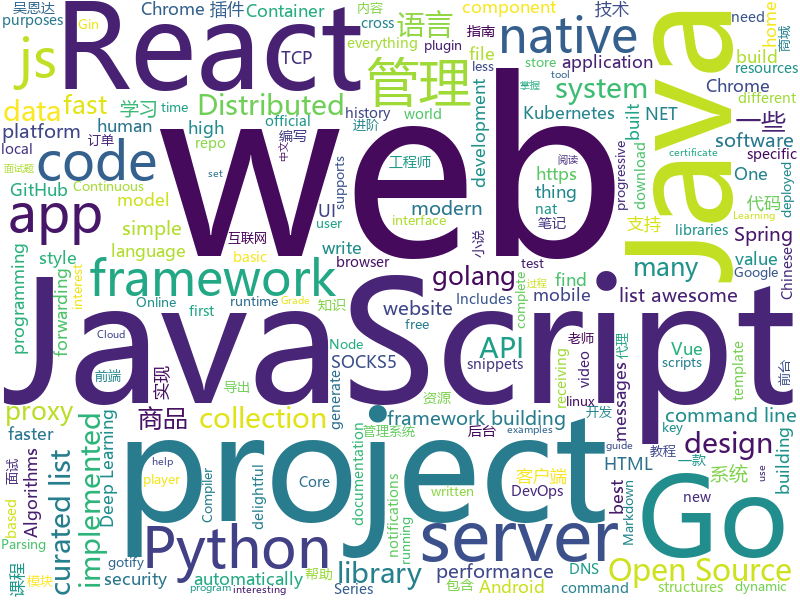

# 2019-03-11
See what the GitHub community is most excited about today.

## python
* [ArchiveBox](https://github.com/pirate/ArchiveBox)(**584 stars today**): 🗃The open source self-hosted web archive. Takes browser history/bookmarks/Pocket/Pinboard/etc., saves HTML, JS, PDFs, media, and more...
* [awesome-python-login-model](https://github.com/CriseLYJ/awesome-python-login-model)(**291 stars today**): 😮python模拟登陆一些大型网站，还有一些简单的爬虫，希望对你们有所帮助❤️，如果喜欢记得给个star哦🌟
* [pytorch_geometric](https://github.com/rusty1s/pytorch_geometric)(**174 stars today**): Geometric Deep Learning Extension Library for PyTorch
* [Python](https://github.com/TheAlgorithms/Python)(**119 stars today**): All Algorithms implemented in Python
* [ChromeAppHeroes](https://github.com/zhaoolee/ChromeAppHeroes)(**115 stars today**): 🌈Chrome插件英雄榜, 为优秀的Chrome插件写一本中文说明书, 让Chrome插件英雄们造福人类~ ChromePluginHeroes, Write a Chinese manual for the excellent Chrome plugin, let the Chrome plugin heroes benefit the human~
* [system-design-primer](https://github.com/donnemartin/system-design-primer)(**109 stars today**): Learn how to design large-scale systems. Prep for the system design interview. Includes Anki flashcards.
* [Python](https://github.com/geekcomputers/Python)(**95 stars today**): My Python Examples
* [faceswap](https://github.com/deepfakes/faceswap)(**58 stars today**): Non official project based on original /r/Deepfakes thread. Many thanks to him!
* [models](https://github.com/tensorflow/models)(**55 stars today**): Models and examples built with TensorFlow
* [USTC-Course](https://github.com/USTC-Resource/USTC-Course)(**47 stars today**): ❤️中国科学技术大学课程资源
* [CheatSheetSeries](https://github.com/OWASP/CheatSheetSeries)(**50 stars today**): The OWASP Cheat Sheet Series was created to provide a concise collection of high value information on specific application security topics.
* [youtube-dl](https://github.com/ytdl-org/youtube-dl)(**40 stars today**): Command-line program to download videos from YouTube.com and other video sites
* [zero](https://github.com/remoteinterview/zero)(**43 stars today**): Zero is a web server to simplify web development.
* [SiamMask](https://github.com/foolwood/SiamMask)(**40 stars today**): [CVPR2019] Fast Online Object Tracking and Segmentation: A Unifying Approach
* [chaos](https://github.com/aydwi/chaos)(**41 stars today**): Turn copied code into a chaotic mess
* [public-apis](https://github.com/toddmotto/public-apis)(**38 stars today**): A collective list of free APIs for use in software and web development.
* [linux-insides](https://github.com/0xAX/linux-insides)(**38 stars today**): A little bit about a linux kernel
* [ludwig](https://github.com/uber/ludwig)(**36 stars today**): Ludwig is a toolbox built on top of TensorFlow that allows to train and test deep learning models without the need to write code.
* [awesome-python](https://github.com/vinta/awesome-python)(**36 stars today**): A curated list of awesome Python frameworks, libraries, software and resources
* [face_recognition](https://github.com/ageitgey/face_recognition)(**30 stars today**): The world's simplest facial recognition api for Python and the command line
* [keras](https://github.com/keras-team/keras)(**29 stars today**): Deep Learning for humans
* [grab-site](https://github.com/ArchiveTeam/grab-site)(**32 stars today**): The archivist's web crawler: WARC output, dashboard for all crawls, dynamic ignore patterns
* [flask](https://github.com/pallets/flask)(**30 stars today**): The Python micro framework for building web applications.
* [sublert](https://github.com/yassineaboukir/sublert)(**27 stars today**): Sublert is a security and reconnaissance tool which leverages certificate transparency to automatically monitor new subdomains deployed by specific organizations and issued TLS/SSL certificate.
* [home-assistant](https://github.com/home-assistant/home-assistant)(**24 stars today**): 🏡Open source home automation that puts local control and privacy first

## java
* [JavaGuide](https://github.com/Snailclimb/JavaGuide)(**145 stars today**): 【Java学习+面试指南】 一份涵盖大部分Java程序员所需要掌握的核心知识。
* [UserLAnd](https://github.com/CypherpunkArmory/UserLAnd)(**120 stars today**): Main UserLAnd Repository
* [quarkus](https://github.com/quarkusio/quarkus)(**54 stars today**): Quarkus: Supersonic Subatomic Java.
* [advanced-java](https://github.com/doocs/advanced-java)(**44 stars today**): 😮互联网 Java 工程师进阶知识完全扫盲
* [j2cl](https://github.com/google/j2cl)(**48 stars today**): Java to Closure JavaScript transpiler
* [mall](https://github.com/macrozheng/mall)(**43 stars today**): mall项目是一套电商系统，包括前台商城系统及后台管理系统，基于SpringBoot+MyBatis实现。 前台商城系统包含首页门户、商品推荐、商品搜索、商品展示、购物车、订单流程、会员中心、客户服务、帮助中心等模块。 后台管理系统包含商品管理、订单管理、会员管理、促销管理、运营管理、内容管理、统计报表、财务管理、权限管理、设置等模块。
* [Leaf](https://github.com/Meituan-Dianping/Leaf)(**40 stars today**): Distributed ID Generate Service
* [spring-boot](https://github.com/spring-projects/spring-boot)(**33 stars today**): Spring Boot
* [android](https://github.com/gotify/android)(**38 stars today**): An app for receiving push notifications on new messages posted to gotify/server.
* [Java](https://github.com/TheAlgorithms/Java)(**30 stars today**): All Algorithms implemented in Java
* [MyBookshelf](https://github.com/gedoor/MyBookshelf)(**31 stars today**): 阅读是一款可以自定义来源阅读网络内容的工具，为广大网络文学爱好者提供一种方便、快捷舒适的试读体验。
* [tutorials](https://github.com/eugenp/tutorials)(**16 stars today**): The "REST With Spring" Course:
* [spring-framework](https://github.com/spring-projects/spring-framework)(**22 stars today**): Spring Framework
* [spring-boot-examples](https://github.com/ityouknow/spring-boot-examples)(**26 stars today**): about learning Spring Boot via examples. Spring Boot 教程、技术栈示例代码，快速简单上手教程。
* [elasticsearch](https://github.com/elastic/elasticsearch)(**23 stars today**): Open Source, Distributed, RESTful Search Engine
* [incubator-dubbo](https://github.com/apache/incubator-dubbo)(**19 stars today**): Apache Dubbo (incubating) is a high-performance, java based, open source RPC framework.
* [react-native-navigation](https://github.com/wix/react-native-navigation)(**22 stars today**): A complete native navigation solution for React Native
* [JReadHub](https://github.com/guanpj/JReadHub)(**23 stars today**): Readhub Android 客户端——官网 : https://readhub.cn
* [guava](https://github.com/google/guava)(**21 stars today**): Google core libraries for Java
* [miaosha](https://github.com/qiurunze123/miaosha)(**19 stars today**): ⭐⭐⭐⭐秒杀系统设计与实现.互联网工程师进阶与分析🙋🐓
* [DoraemonKit](https://github.com/didi/DoraemonKit)(**19 stars today**): 简称 "DoKit" 。一款功能齐全的客户端（ iOS 、Android ）研发助手，你值得拥有。
* [Magisk](https://github.com/topjohnwu/Magisk)(**18 stars today**): A Magic Mask to Alter Android System Systemless-ly
* [JCSprout](https://github.com/crossoverJie/JCSprout)(**17 stars today**): 👨‍🎓Java Core Sprout : basic, concurrent, algorithm
* [nacos](https://github.com/alibaba/nacos)(**15 stars today**): an easy-to-use dynamic service discovery, configuration and service management platform for building cloud native applications.
* [graal](https://github.com/oracle/graal)(**16 stars today**): GraalVM: Run Programs Faster Anywhere🚀

## unknown
* [ghidra](https://github.com/NationalSecurityAgency/ghidra)(**404 stars today**): Ghidra is a software reverse engineering (SRE) framework
* [awesome-compilers](https://github.com/aalhour/awesome-compilers)(**214 stars today**): 😎Curated list of awesome resources on Compilers, Interpreters and Runtimes
* [Micro8](https://github.com/Micropoor/Micro8)(**154 stars today**): Gitbook
* [kubernetes-the-hard-way](https://github.com/kelseyhightower/kubernetes-the-hard-way)(**163 stars today**): Bootstrap Kubernetes the hard way on Google Cloud Platform. No scripts.
* [CS-Notes](https://github.com/CyC2018/CS-Notes)(**121 stars today**): 😋技术面试必备基础知识
* [portable-node-guide](https://github.com/ehmicky/portable-node-guide)(**123 stars today**): Practical guide on how to write portable/cross-platform Node.js code
* [Go42](https://github.com/ffhelicopter/Go42)(**96 stars today**): 写《Go语言四十二章经》，纯粹是因为开发过程中碰到过的一些问题，踩到过的一些坑，感觉在Go语言学习使用过程中，有必要深刻理解这门语言的核心思维、清晰掌握语言的细节规范以及反复琢磨标准包代码设计模式，于是才有了这本书。
* [cmake-examples](https://github.com/pr0g/cmake-examples)(**95 stars today**): A collection of as simple as possible, modern CMake projects
* [awesome](https://github.com/sindresorhus/awesome)(**76 stars today**): 😎Awesome lists about all kinds of interesting topics
* [gitignore](https://github.com/github/gitignore)(**52 stars today**): A collection of useful .gitignore templates
* [free-programming-books](https://github.com/EbookFoundation/free-programming-books)(**54 stars today**): 📚Freely available programming books
* [You-Dont-Know-JS](https://github.com/getify/You-Dont-Know-JS)(**50 stars today**): A book series on JavaScript. @YDKJS on twitter.
* [python-cheatsheet](https://github.com/BisratYalew/python-cheatsheet)(**55 stars today**): Collection of Python code snippets and cheatsheets (made for humans)
* [Awesome-Design-Tools](https://github.com/LisaDziuba/Awesome-Design-Tools)(**50 stars today**): The best design tools for everything.
* [Daily-Interview-Question](https://github.com/Advanced-Frontend/Daily-Interview-Question)(**51 stars today**): 工作日每天一道前端大厂面试题，祝大家天天进步，一年后会看到不一样的自己。
* [python_interview_question](https://github.com/kenwoodjw/python_interview_question)(**42 stars today**): 关于python的面试题
* [awesome-deep-learning](https://github.com/ChristosChristofidis/awesome-deep-learning)(**40 stars today**): A curated list of awesome Deep Learning tutorials, projects and communities.
* [ycy](https://github.com/ccyyycy/ycy)(**46 stars today**): "Hello YCY" Programming Competition
* [free-programming-books-zh_CN](https://github.com/justjavac/free-programming-books-zh_CN)(**40 stars today**): 📚免费的计算机编程类中文书籍，欢迎投稿
* [How-To-Secure-A-Linux-Server](https://github.com/imthenachoman/How-To-Secure-A-Linux-Server)(**40 stars today**): An evolving how-to guide for securing a Linux server.
* [architect-awesome](https://github.com/xingshaocheng/architect-awesome)(**36 stars today**): 后端架构师技术图谱
* [elements-of-rust](https://github.com/spacejam/elements-of-rust)(**38 stars today**): rust style and philosophy
* [Xiaomi_Kernel_OpenSource](https://github.com/MiCode/Xiaomi_Kernel_OpenSource)(**33 stars today**): Xiaomi Mobile Phone Kernel OpenSource
* [awesome-vue](https://github.com/vuejs/awesome-vue)(**34 stars today**): 🎉A curated list of awesome things related to Vue.js

## javascript
* [ink](https://github.com/vadimdemedes/ink)(**136 stars today**): 🌈React for interactive command-line apps
* [Motrix](https://github.com/agalwood/Motrix)(**120 stars today**): A full-featured download manager.
* [awesome-vscode](https://github.com/viatsko/awesome-vscode)(**115 stars today**): 🎨A curated list of delightful VS Code packages and resources.
* [react-window](https://github.com/bvaughn/react-window)(**105 stars today**): React components for efficiently rendering large lists and tabular data
* [vue](https://github.com/vuejs/vue)(**81 stars today**): 🖖Vue.js is a progressive, incrementally-adoptable JavaScript framework for building UI on the web.
* [react](https://github.com/facebook/react)(**67 stars today**): A declarative, efficient, and flexible JavaScript library for building user interfaces.
* [handtrack.js](https://github.com/victordibia/handtrack.js)(**68 stars today**): A library for prototyping realtime hand detection (bounding box), directly in the browser.
* [react-native](https://github.com/facebook/react-native)(**48 stars today**): A framework for building native apps with React.
* [puppeteer](https://github.com/GoogleChrome/puppeteer)(**46 stars today**): Headless Chrome Node API
* [create-react-app](https://github.com/facebook/create-react-app)(**46 stars today**): Set up a modern web app by running one command.
* [git-history](https://github.com/pomber/git-history)(**45 stars today**): Quickly browse the history of a file from any git repository
* [node](https://github.com/nodejs/node)(**40 stars today**): Node.js JavaScript runtime✨🐢🚀✨
* [blog](https://github.com/frankmcsherry/blog)(**42 stars today**): Some notes on things I find interesting and important.
* [30-seconds-of-code](https://github.com/30-seconds/30-seconds-of-code)(**41 stars today**): A curated collection of useful JavaScript snippets that you can understand in 30 seconds or less.
* [bootstrap](https://github.com/twbs/bootstrap)(**35 stars today**): The most popular HTML, CSS, and JavaScript framework for developing responsive, mobile first projects on the web.
* [material-ui](https://github.com/mui-org/material-ui)(**34 stars today**): React components for faster and easier web development. Build your own design system, or start with Material Design.
* [storybook](https://github.com/storybooks/storybook)(**38 stars today**): UI component dev & test: React, React Native, Vue, Angular, Ember & more!
* [taro](https://github.com/NervJS/taro)(**40 stars today**): 多端统一开发框架，支持用 React 的开发方式编写一次代码，生成能运行在微信/百度/支付宝/字节跳动小程序、H5、React Native 等的应用。 https://taro.js.org/
* [javascript-algorithms](https://github.com/trekhleb/javascript-algorithms)(**35 stars today**): 📝Algorithms and data structures implemented in JavaScript with explanations and links to further readings
* [nlp.js](https://github.com/axa-group/nlp.js)(**38 stars today**): An NLP library for building bots, with entity extraction, sentiment analysis, automatic language identify, and so more
* [dequal](https://github.com/lukeed/dequal)(**36 stars today**): A tiny (247B) utility for check for deep equality
* [freeciv-web](https://github.com/freeciv/freeciv-web)(**34 stars today**): Freeciv-web is an Open Source strategy game implemented in HTML5 and WebGL, which can be played online against other players, or in single player mode against AI opponents.
* [jest](https://github.com/facebook/jest)(**33 stars today**): Delightful JavaScript Testing.
* [javascript](https://github.com/airbnb/javascript)(**31 stars today**): JavaScript Style Guide
* [gatsby](https://github.com/gatsbyjs/gatsby)(**27 stars today**): Build blazing fast, modern apps and websites with React

## html
* [lets-get-arrested](https://github.com/hamukazu/lets-get-arrested)(**422 stars today**): This project is intended to protest against the police in Japan
* [personal-website](https://github.com/github/personal-website)(**136 stars today**): Code that'll help you kickstart a personal website that showcases your work as a software developer.
* [Coursera-ML-AndrewNg-Notes](https://github.com/fengdu78/Coursera-ML-AndrewNg-Notes)(**69 stars today**): 吴恩达老师的机器学习课程个人笔记
* [deeplearning_ai_books](https://github.com/fengdu78/deeplearning_ai_books)(**54 stars today**): deeplearning.ai（吴恩达老师的深度学习课程笔记及资源）
* [automatic-app-landing-page](https://github.com/emilbaehr/automatic-app-landing-page)(**47 stars today**): A Jekyll theme for automatically generating and deploying landing page sites for mobile apps.
* [webKnowledge](https://github.com/huyaocode/webKnowledge)(**42 stars today**): 前端知识点总结
* [javascript-tutorial-en](https://github.com/iliakan/javascript-tutorial-en)(**25 stars today**): Modern JavaScript Tutorial
* [ionic](https://github.com/ionic-team/ionic)(**19 stars today**): Build amazing native and progressive web apps with open web technologies. One app running on everything🎉
* [PS4-6.20-WebKit-Code-Execution-Exploit](https://github.com/Cryptogenic/PS4-6.20-WebKit-Code-Execution-Exploit)(**13 stars today**): A WebKit exploit using CVE-2018-4441 to obtain RCE on PS4 6.20.
* [gtsummary](https://github.com/vincentarelbundock/gtsummary)(**12 stars today**): Beautiful, customizable, publication-ready model summaries in R.
* [Spoon-Knife](https://github.com/octocat/Spoon-Knife)(****): This repo is for demonstration purposes only.
* [github](https://github.com/phodal/github)(**10 stars today**): GitHub 漫游指南- a Chinese ebook on how to build a good project on Github. Explore the users' behavior. Find some thing interest.
* [now-github-starter](https://github.com/zeit/now-github-starter)(****): Starter project to demonstrate a project whose pull requests get automatically deployed
* [flutter-in-action](https://github.com/flutterchina/flutter-in-action)(**9 stars today**): 《Flutter实战》电子书
* [requests-html](https://github.com/kennethreitz/requests-html)(**8 stars today**): Pythonic HTML Parsing for Humans™
* [quickchart](https://github.com/typpo/quickchart)(**8 stars today**): Google Image Charts alternative
* [dotnet](https://github.com/Microsoft/dotnet)(**7 stars today**): This repo is the official home of .NET on GitHub. It's a great starting point to find many .NET OSS projects from Microsoft and the community, including many that are part of the .NET Foundation.
* [circleci-docs](https://github.com/circleci/circleci-docs)(**6 stars today**): Documentation for CircleCI.
* [free-for-dev](https://github.com/ripienaar/free-for-dev)(**7 stars today**): A list of SaaS, PaaS and IaaS offerings that have free tiers of interest to devops and infradev
* [swagger-codegen](https://github.com/swagger-api/swagger-codegen)(**7 stars today**): swagger-codegen contains a template-driven engine to generate documentation, API clients and server stubs in different languages by parsing your OpenAPI / Swagger definition.
* [markdown-preview-enhanced](https://github.com/shd101wyy/markdown-preview-enhanced)(**6 stars today**): One of the 'BEST' markdown preview extensions for Atom editor!
* [JavaScript30](https://github.com/wesbos/JavaScript30)(**5 stars today**): 30 Day Vanilla JS Challenge
* [DetectionLab](https://github.com/clong/DetectionLab)(**6 stars today**): Vagrant & Packer scripts to build a lab environment complete with security tooling and logging best practices
* [EIPs](https://github.com/ethereum/EIPs)(**5 stars today**): The Ethereum Improvement Proposal repository
* [Iosevka](https://github.com/be5invis/Iosevka)(**6 stars today**): Slender typeface for code, from code.

## go
* [server](https://github.com/gotify/server)(**848 stars today**): A simple server for sending and receiving messages in real-time per web socket. (Includes a sleek web-ui)
* [k3s](https://github.com/rancher/k3s)(**56 stars today**): Lightweight Kubernetes. 5 less than k8s.
* [kraken](https://github.com/uber/kraken)(**57 stars today**): P2P Docker registry capable of distributing TBs of data in seconds
* [go2ll-talk](https://github.com/pwaller/go2ll-talk)(**54 stars today**): Live coding a basic Go compiler with LLVM in 20 minutes
* [go](https://github.com/golang/go)(**52 stars today**): The Go programming language
* [FictionDown](https://github.com/ma6254/FictionDown)(**44 stars today**): 小说下载|小说爬取|起点|笔趣阁|导出Markdown|导出txt|转换epub|广告过滤|自动校对
* [kubernetes](https://github.com/kubernetes/kubernetes)(**29 stars today**): Production-Grade Container Scheduling and Management
* [cli](https://github.com/gotify/cli)(**34 stars today**): A command line interface for pushing messages to gotify/server.
* [homemade-external-load-balancer](https://github.com/joesonw/homemade-external-load-balancer)(**34 stars today**): External Load Balancer for kubernetes cluster, for homemade projects purposes.
* [fsnotify](https://github.com/fsnotify/fsnotify)(**32 stars today**): Cross-platform file system notifications for Go.
* [hugo](https://github.com/gohugoio/hugo)(**28 stars today**): The world’s fastest framework for building websites.
* [frp](https://github.com/fatedier/frp)(**22 stars today**): A fast reverse proxy to help you expose a local server behind a NAT or firewall to the internet.
* [gvisor](https://github.com/google/gvisor)(**25 stars today**): Container Runtime Sandbox
* [dgraph](https://github.com/dgraph-io/dgraph)(**25 stars today**): Fast, Distributed Graph DB
* [nutsdb](https://github.com/xujiajun/nutsdb)(**24 stars today**): A simple, fast, embeddable, persistent key/value store written in pure Go. It supports fully serializable transactions and many data structures such as list, set, sorted set.
* [BaiduPCS-Go](https://github.com/iikira/BaiduPCS-Go)(**23 stars today**): 百度网盘客户端 - Go语言编写
* [fzf](https://github.com/junegunn/fzf)(**22 stars today**): 🌸A command-line fuzzy finder
* [syncthing](https://github.com/syncthing/syncthing)(**19 stars today**): Open Source Continuous File Synchronization
* [libpod](https://github.com/containers/libpod)(**19 stars today**): libpod is a library used to create container pods. Home of Podman.
* [etcd](https://github.com/etcd-io/etcd)(**19 stars today**): Distributed reliable key-value store for the most critical data of a distributed system
* [fathom](https://github.com/usefathom/fathom)(**19 stars today**): Fathom. Simple, trustworthy website analytics. Built with Golang & Preact.
* [gin](https://github.com/gin-gonic/gin)(**18 stars today**): Gin is a HTTP web framework written in Go (Golang). It features a Martini-like API with much better performance -- up to 40 times faster. If you need smashing performance, get yourself some Gin.
* [goproxy](https://github.com/snail007/goproxy)(**19 stars today**): Proxy is a high performance HTTP(S), websocket, TCP, UDP,Secure DNS, Socks5 proxy server implemented by golang. Now, it supports chain-style proxies,nat forwarding in different lan,TCP/UDP port forwarding, SSH forwarding.Proxy是golang实现的高性能http,https,websocket,tcp,防污染DNS,socks5代理服务器,支持内网穿透,链式代理,通讯加密,智能HTTP,SOCKS5代理,域名黑白名单,跨平台,KCP协议支持,集成外部API。
* [cds](https://github.com/ovh/cds)(**19 stars today**): Enterprise-Grade Continuous Delivery & DevOps Automation Open Source Platform
* [go-micro](https://github.com/micro/go-micro)(**18 stars today**): A microservice framework

## WordCloud

