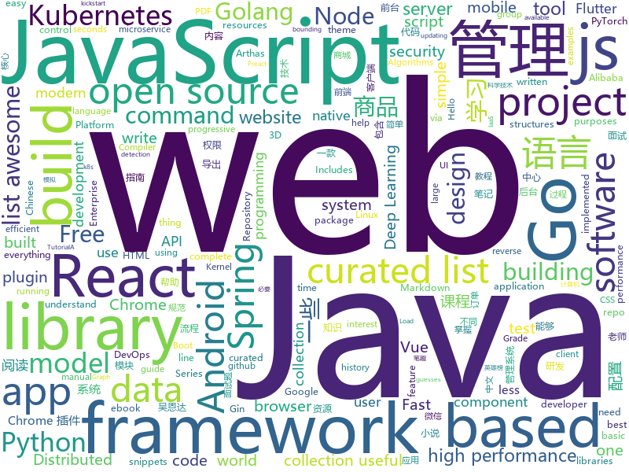

# 2019-03-12
See what the GitHub community is most excited about today.

## python
* [ArchiveBox](https://github.com/pirate/ArchiveBox)(**437 stars today**): 🗃The open source self-hosted web archive. Takes browser history/bookmarks/Pocket/Pinboard/etc., saves HTML, JS, PDFs, media, and more...
* [awesome-python-login-model](https://github.com/CriseLYJ/awesome-python-login-model)(**378 stars today**): 😮python模拟登陆一些大型网站，还有一些简单的爬虫，希望对你们有所帮助❤️，如果喜欢记得给个star哦🌟
* [ChromeAppHeroes](https://github.com/zhaoolee/ChromeAppHeroes)(**290 stars today**): 🌈Chrome插件英雄榜, 为优秀的Chrome插件写一本中文说明书, 让Chrome插件英雄们造福人类~ ChromePluginHeroes, Write a Chinese manual for the excellent Chrome plugin, let the Chrome plugin heroes benefit the human~
* [pytorch_geometric](https://github.com/rusty1s/pytorch_geometric)(**273 stars today**): Geometric Deep Learning Extension Library for PyTorch
* [USTC-Course](https://github.com/USTC-Resource/USTC-Course)(**229 stars today**): ❤️中国科学技术大学课程资源
* [system-design-primer](https://github.com/donnemartin/system-design-primer)(**147 stars today**): Learn how to design large-scale systems. Prep for the system design interview. Includes Anki flashcards.
* [CheatSheetSeries](https://github.com/OWASP/CheatSheetSeries)(**109 stars today**): The OWASP Cheat Sheet Series was created to provide a concise collection of high value information on specific application security topics.
* [Python](https://github.com/TheAlgorithms/Python)(**100 stars today**): All Algorithms implemented in Python
* [faceswap](https://github.com/deepfakes/faceswap)(**92 stars today**): Non official project based on original /r/Deepfakes thread. Many thanks to him!
* [models](https://github.com/tensorflow/models)(**77 stars today**): Models and examples built with TensorFlow
* [pytorch-OpCounter](https://github.com/Lyken17/pytorch-OpCounter)(**76 stars today**): Count the FLOPs of your PyTorch model.
* [SiamMask](https://github.com/foolwood/SiamMask)(**69 stars today**): [CVPR2019] Fast Online Object Tracking and Segmentation: A Unifying Approach
* [awesome-python](https://github.com/vinta/awesome-python)(**65 stars today**): A curated list of awesome Python frameworks, libraries, software and resources
* [CVE-2019-0192](https://github.com/mpgn/CVE-2019-0192)(**66 stars today**): RCE on Apache Solr using deserialization of untrusted data via jmx.serviceUrl
* [public-apis](https://github.com/toddmotto/public-apis)(**64 stars today**): A collective list of free APIs for use in software and web development.
* [Python](https://github.com/geekcomputers/Python)(**53 stars today**): My Python Examples
* [zero](https://github.com/remoteinterview/zero)(**58 stars today**): Zero is a web server to simplify web development.
* [face_recognition](https://github.com/ageitgey/face_recognition)(**48 stars today**): The world's simplest facial recognition api for Python and the command line
* [helloworld](https://github.com/flatbean/helloworld)(**53 stars today**): This is a test hello world repository of flatbean. Since Jan,11.2019
* [SharPyShell](https://github.com/antonioCoco/SharPyShell)(**49 stars today**): SharPyShell - tiny and obfuscated ASP.NET webshell for C# web applications
* [nyaa](https://github.com/nyaadevs/nyaa)(**48 stars today**): Bittorrent software for cats
* [gpt-2](https://github.com/openai/gpt-2)(**44 stars today**): Code for the paper "Language Models are Unsupervised Multitask Learners"
* [ludwig](https://github.com/uber/ludwig)(**44 stars today**): Ludwig is a toolbox built on top of TensorFlow that allows to train and test deep learning models without the need to write code.
* [clusterfuzz](https://github.com/google/clusterfuzz)(**39 stars today**): Scalable fuzzing infrastructure.
* [keras](https://github.com/keras-team/keras)(**31 stars today**): Deep Learning for humans

## java
* [spring-boot-examples](https://github.com/ityouknow/spring-boot-examples)(**970 stars today**): about learning Spring Boot via examples. Spring Boot 教程、技术栈示例代码，快速简单上手教程。
* [JavaGuide](https://github.com/Snailclimb/JavaGuide)(**225 stars today**): 【Java学习+面试指南】 一份涵盖大部分Java程序员所需要掌握的核心知识。
* [mall](https://github.com/macrozheng/mall)(**118 stars today**): mall项目是一套电商系统，包括前台商城系统及后台管理系统，基于SpringBoot+MyBatis实现。 前台商城系统包含首页门户、商品推荐、商品搜索、商品展示、购物车、订单流程、会员中心、客户服务、帮助中心等模块。 后台管理系统包含商品管理、订单管理、会员管理、促销管理、运营管理、内容管理、统计报表、财务管理、权限管理、设置等模块。
* [advanced-java](https://github.com/doocs/advanced-java)(**115 stars today**): 😮互联网 Java 工程师进阶知识完全扫盲
* [Leaf](https://github.com/Meituan-Dianping/Leaf)(**78 stars today**): Distributed ID Generate Service
* [MyBookshelf](https://github.com/gedoor/MyBookshelf)(**66 stars today**): 阅读是一款可以自定义来源阅读网络内容的工具，为广大网络文学爱好者提供一种方便、快捷舒适的试读体验。
* [quarkus](https://github.com/quarkusio/quarkus)(**67 stars today**): Quarkus: Supersonic Subatomic Java.
* [spring-boot](https://github.com/spring-projects/spring-boot)(**48 stars today**): Spring Boot
* [flutter_boost](https://github.com/alibaba/flutter_boost)(**65 stars today**): FlutterBoost is a Flutter plugin which enables hybrid integration of Flutter for your existing native apps with minimum efforts
* [tutorials](https://github.com/eugenp/tutorials)(**41 stars today**): The "REST With Spring" Course:
* [UserLAnd](https://github.com/CypherpunkArmory/UserLAnd)(**58 stars today**): Main UserLAnd Repository
* [fescar](https://github.com/alibaba/fescar)(**50 stars today**): 🔥Fescar is an easy-to-use, high-performance, java based, open source distributed transaction solution.
* [apollo](https://github.com/ctripcorp/apollo)(**49 stars today**): Apollo（阿波罗）是携程框架部门研发的分布式配置中心，能够集中化管理应用不同环境、不同集群的配置，配置修改后能够实时推送到应用端，并且具备规范的权限、流程治理等特性，适用于微服务配置管理场景。
* [caffeine](https://github.com/ben-manes/caffeine)(**52 stars today**): A high performance caching library for Java 8
* [DoraemonKit](https://github.com/didi/DoraemonKit)(**45 stars today**): 简称 "DoKit" 。一款功能齐全的客户端（ iOS 、Android ）研发助手，你值得拥有。
* [audio-visualizer-android](https://github.com/gauravk95/audio-visualizer-android)(**47 stars today**): 🎵[Android Library] A light-weight and easy-to-use Audio Visualizer for Android.
* [x7](https://github.com/x-ream/x7)(**26 stars today**): 
* [arthas](https://github.com/alibaba/arthas)(**39 stars today**): Alibaba Java Diagnostic Tool Arthas/Alibaba Java诊断利器Arthas
* [JCSprout](https://github.com/crossoverJie/JCSprout)(**33 stars today**): 👨‍🎓Java Core Sprout : basic, concurrent, algorithm
* [incubator-dubbo](https://github.com/apache/incubator-dubbo)(**28 stars today**): Apache Dubbo (incubating) is a high-performance, java based, open source RPC framework.
* [spring-framework](https://github.com/spring-projects/spring-framework)(**22 stars today**): Spring Framework
* [TrustMeAlready](https://github.com/ViRb3/TrustMeAlready)(**39 stars today**): Disable SSL verification and pinning on Android, system-wide
* [Sentinel](https://github.com/alibaba/Sentinel)(**31 stars today**): A lightweight powerful flow control component enabling reliability and monitoring for microservices. (轻量级的流量控制、熔断降级 Java 库)
* [dbeaver](https://github.com/dbeaver/dbeaver)(**35 stars today**): Free universal database tool and SQL client
* [AndroidUtilCode](https://github.com/Blankj/AndroidUtilCode)(**27 stars today**): 🔥Android developers should collect the following utils(updating).

## unknown
* [ghidra](https://github.com/NationalSecurityAgency/ghidra)(**473 stars today**): Ghidra is a software reverse engineering (SRE) framework
* [Go42](https://github.com/ffhelicopter/Go42)(**405 stars today**): 写《Go语言四十二章经》，纯粹是因为开发过程中碰到过的一些问题，踩到过的一些坑，感觉在Go语言学习使用过程中，有必要深刻理解这门语言的核心思维、清晰掌握语言的细节规范以及反复琢磨标准包代码设计模式，于是才有了这本书。
* [Micro8](https://github.com/Micropoor/Micro8)(**235 stars today**): Gitbook
* [CS-Notes](https://github.com/CyC2018/CS-Notes)(**211 stars today**): 😋技术面试必备基础知识
* [cmake-examples](https://github.com/pr0g/cmake-examples)(**226 stars today**): A collection of as simple as possible, modern CMake projects
* [awesome-compilers](https://github.com/aalhour/awesome-compilers)(**185 stars today**): 😎Curated list of awesome resources on Compilers, Interpreters and Runtimes
* [portable-node-guide](https://github.com/ehmicky/portable-node-guide)(**174 stars today**): 📗Practical guide on how to write portable/cross-platform Node.js code
* [kubernetes-the-hard-way](https://github.com/kelseyhightower/kubernetes-the-hard-way)(**154 stars today**): Bootstrap Kubernetes the hard way on Google Cloud Platform. No scripts.
* [gitignore](https://github.com/github/gitignore)(**73 stars today**): A collection of useful .gitignore templates
* [awesome](https://github.com/sindresorhus/awesome)(**85 stars today**): 😎Awesome lists about all kinds of interesting topics
* [You-Dont-Know-JS](https://github.com/getify/You-Dont-Know-JS)(**77 stars today**): A book series on JavaScript. @YDKJS on twitter.
* [Awesome-Design-Tools](https://github.com/LisaDziuba/Awesome-Design-Tools)(**82 stars today**): The best design tools for everything.
* [free-programming-books-zh_CN](https://github.com/justjavac/free-programming-books-zh_CN)(**74 stars today**): 📚免费的计算机编程类中文书籍，欢迎投稿
* [Daily-Interview-Question](https://github.com/Advanced-Frontend/Daily-Interview-Question)(**78 stars today**): 工作日每天一道前端大厂面试题，祝大家天天进步，一年后会看到不一样的自己。
* [CS-Notes-PDF](https://github.com/sjsdfg/CS-Notes-PDF)(**66 stars today**): https://github.com/CyC2018/CS-Notes PDF版本离线阅读
* [How-To-Secure-A-Linux-Server](https://github.com/imthenachoman/How-To-Secure-A-Linux-Server)(**65 stars today**): An evolving how-to guide for securing a Linux server.
* [ycy](https://github.com/ccyyycy/ycy)(**63 stars today**): "Hello YCY" Programming Competition
* [free-programming-books](https://github.com/EbookFoundation/free-programming-books)(**59 stars today**): 📚Freely available programming books
* [MyPapers](https://github.com/s0md3v/MyPapers)(**60 stars today**): Repository for hosting my research papers
* [awesome-windows-kernel-security-development](https://github.com/ExpLife0011/awesome-windows-kernel-security-development)(**55 stars today**): windows kernel security development
* [python_interview_question](https://github.com/kenwoodjw/python_interview_question)(**54 stars today**): 关于python的面试题
* [Xiaomi_Kernel_OpenSource](https://github.com/MiCode/Xiaomi_Kernel_OpenSource)(**52 stars today**): Xiaomi Mobile Phone Kernel OpenSource
* [awesome-vue](https://github.com/vuejs/awesome-vue)(**49 stars today**): 🎉A curated list of awesome things related to Vue.js
* [the-book-of-secret-knowledge](https://github.com/trimstray/the-book-of-secret-knowledge)(**51 stars today**): A collection of inspiring lists, manuals, cheatsheets, blogs, hacks, one-liners, cli/web tools and more.

## javascript
* [react-window](https://github.com/bvaughn/react-window)(**249 stars today**): React components for efficiently rendering large lists and tabular data
* [vue](https://github.com/vuejs/vue)(**145 stars today**): 🖖Vue.js is a progressive, incrementally-adoptable JavaScript framework for building UI on the web.
* [ink](https://github.com/vadimdemedes/ink)(**150 stars today**): 🌈React for interactive command-line apps
* [react-three-fiber](https://github.com/drcmda/react-three-fiber)(**125 stars today**): 👌A React-renderer for Three.js
* [javascript-algorithms](https://github.com/trekhleb/javascript-algorithms)(**115 stars today**): 📝Algorithms and data structures implemented in JavaScript with explanations and links to further readings
* [react](https://github.com/facebook/react)(**92 stars today**): A declarative, efficient, and flexible JavaScript library for building user interfaces.
* [handtrack.js](https://github.com/victordibia/handtrack.js)(**86 stars today**): A library for prototyping realtime hand detection (bounding box), directly in the browser.
* [awesome-vscode](https://github.com/viatsko/awesome-vscode)(**82 stars today**): 🎨A curated list of delightful VS Code packages and resources.
* [iro.js](https://github.com/jaames/iro.js)(**81 stars today**): 🎨HSV color picker widget for JavaScript with a modern, SVG-based user interface
* [Motrix](https://github.com/agalwood/Motrix)(**75 stars today**): A full-featured download manager.
* [strapi](https://github.com/strapi/strapi)(**70 stars today**): 🚀Open source Node.js Headless CMS to easily build customisable APIs
* [30-seconds-of-code](https://github.com/30-seconds/30-seconds-of-code)(**71 stars today**): A curated collection of useful JavaScript snippets that you can understand in 30 seconds or less.
* [x-spreadsheet](https://github.com/myliang/x-spreadsheet)(**71 stars today**): A web-based JavaScript（canvas） spreadsheet
* [nlp.js](https://github.com/axa-group/nlp.js)(**71 stars today**): An NLP library for building bots, with entity extraction, sentiment analysis, automatic language identify, and so more
* [wechat-format](https://github.com/lyricat/wechat-format)(**63 stars today**): 微信公众号排版编辑器，转化 Markdown 微信特制的 HTML
* [coco](https://github.com/mrmiguu/coco)(**65 stars today**): Golang WebAssembly Framework
* [axios](https://github.com/axios/axios)(**63 stars today**): Promise based HTTP client for the browser and node.js
* [puppeteer](https://github.com/GoogleChrome/puppeteer)(**58 stars today**): Headless Chrome Node API
* [storybook](https://github.com/storybooks/storybook)(**56 stars today**): UI component dev & test: React, React Native, Vue, Angular, Ember & more!
* [umi](https://github.com/umijs/umi)(**58 stars today**): 🌋Pluggable enterprise-level react application framework.
* [three.js](https://github.com/mrdoob/three.js)(**48 stars today**): JavaScript 3D library.
* [next.js](https://github.com/zeit/next.js)(**53 stars today**): The React Framework
* [create-react-app](https://github.com/facebook/create-react-app)(**48 stars today**): Set up a modern web app by running one command.
* [bootstrap](https://github.com/twbs/bootstrap)(**44 stars today**): The most popular HTML, CSS, and JavaScript framework for developing responsive, mobile first projects on the web.
* [git-history](https://github.com/pomber/git-history)(**52 stars today**): Quickly browse the history of a file from any git repository

## html
* [lets-get-arrested](https://github.com/hamukazu/lets-get-arrested)(**462 stars today**): This project is intended to protest against the police in Japan
* [personal-website](https://github.com/github/personal-website)(**157 stars today**): Code that'll help you kickstart a personal website that showcases your work as a software developer.
* [automatic-app-landing-page](https://github.com/emilbaehr/automatic-app-landing-page)(**119 stars today**): A Jekyll theme for automatically generating and deploying landing page sites for mobile apps.
* [webKnowledge](https://github.com/huyaocode/webKnowledge)(**91 stars today**): 前端知识点总结
* [Coursera-ML-AndrewNg-Notes](https://github.com/fengdu78/Coursera-ML-AndrewNg-Notes)(**40 stars today**): 吴恩达老师的机器学习课程个人笔记
* [quickchart](https://github.com/typpo/quickchart)(**41 stars today**): Google Image Charts alternative
* [javascript-tutorial-en](https://github.com/iliakan/javascript-tutorial-en)(**40 stars today**): Modern JavaScript Tutorial
* [manuals](https://github.com/skr-shop/manuals)(**36 stars today**): Do design No code📖
* [deeplearning_ai_books](https://github.com/fengdu78/deeplearning_ai_books)(**31 stars today**): deeplearning.ai（吴恩达老师的深度学习课程笔记及资源）
* [AdminLTE](https://github.com/almasaeed2010/AdminLTE)(**22 stars today**): AdminLTE - Free Premium Admin control Panel Theme Based On Bootstrap 3.x
* [flutter-in-action](https://github.com/flutterchina/flutter-in-action)(**26 stars today**): 《Flutter实战》电子书
* [PS4-6.20-WebKit-Code-Execution-Exploit](https://github.com/Cryptogenic/PS4-6.20-WebKit-Code-Execution-Exploit)(**24 stars today**): A WebKit exploit using CVE-2018-4441 to obtain RCE on PS4 6.20.
* [Spoon-Knife](https://github.com/octocat/Spoon-Knife)(****): This repo is for demonstration purposes only.
* [website](https://github.com/kubernetes/website)(**13 stars today**): Kubernetes website and documentation repo:
* [ggplot_flipbook](https://github.com/EvaMaeRey/ggplot_flipbook)(**17 stars today**): This is a flipbook that builds up plots with ggplot2.
* [JavaScript30](https://github.com/wesbos/JavaScript30)(**10 stars today**): 30 Day Vanilla JS Challenge
* [github](https://github.com/phodal/github)(**15 stars today**): GitHub 漫游指南- a Chinese ebook on how to build a good project on Github. Explore the users' behavior. Find some thing interest.
* [ionic](https://github.com/ionic-team/ionic)(**13 stars today**): Build amazing native and progressive web apps with open web technologies. One app running on everything🎉
* [free-for-dev](https://github.com/ripienaar/free-for-dev)(**14 stars today**): A list of SaaS, PaaS and IaaS offerings that have free tiers of interest to devops and infradev
* [not-so-random](https://github.com/ex-punctis/not-so-random)(**13 stars today**): A script [js + plotly.js] that guesses your next input no matter how random you try to be
* [csswg-drafts](https://github.com/w3c/csswg-drafts)(**12 stars today**): CSS Working Group Editor Drafts
* [DetectionLab](https://github.com/clong/DetectionLab)(**12 stars today**): Vagrant & Packer scripts to build a lab environment complete with security tooling and logging best practices
* [javascript-tutorial-zh](https://github.com/xitu/javascript-tutorial-zh)(**11 stars today**): Modern JavaScript Tutorial
* [30-seconds-of-css](https://github.com/30-seconds/30-seconds-of-css)(**12 stars today**): A curated collection of useful CSS snippets you can understand in 30 seconds or less.
* [gtsummary](https://github.com/vincentarelbundock/gtsummary)(**12 stars today**): Beautiful, customizable, publication-ready model summaries in R.

## go
* [server](https://github.com/gotify/server)(**822 stars today**): A simple server for sending and receiving messages in real-time per web socket. (Includes a sleek web-ui)
* [flyover-reverse-engineering](https://github.com/retroplasma/flyover-reverse-engineering)(**294 stars today**): Reversing Apple's 3D satellite mode
* [kraken](https://github.com/uber/kraken)(**160 stars today**): P2P Docker registry capable of distributing TBs of data in seconds
* [k3s](https://github.com/rancher/k3s)(**97 stars today**): Lightweight Kubernetes. 5 less than k8s.
* [slim](https://github.com/openacid/slim)(**85 stars today**): Unbelievably space efficient data structures in Golang.
* [dgraph](https://github.com/dgraph-io/dgraph)(**76 stars today**): Fast, Distributed Graph DB
* [go](https://github.com/golang/go)(**60 stars today**): The Go programming language
* [kubernetes](https://github.com/kubernetes/kubernetes)(**56 stars today**): Production-Grade Container Scheduling and Management
* [awesome-go](https://github.com/avelino/awesome-go)(**55 stars today**): A curated list of awesome Go frameworks, libraries and software
* [dragonboat](https://github.com/lni/dragonboat)(**55 stars today**): A feature complete and high performance multi-group Raft library in Go.
* [build-web-application-with-golang](https://github.com/astaxie/build-web-application-with-golang)(**45 stars today**): A golang ebook intro how to build a web with golang
* [frp](https://github.com/fatedier/frp)(**40 stars today**): A fast reverse proxy to help you expose a local server behind a NAT or firewall to the internet.
* [go-micro](https://github.com/micro/go-micro)(**45 stars today**): A microservice framework
* [FictionDown](https://github.com/ma6254/FictionDown)(**38 stars today**): 小说下载|小说爬取|起点|笔趣阁|导出Markdown|导出txt|转换epub|广告过滤|自动校对
* [gin](https://github.com/gin-gonic/gin)(**38 stars today**): Gin is a HTTP web framework written in Go (Golang). It features a Martini-like API with much better performance -- up to 40 times faster. If you need smashing performance, get yourself some Gin.
* [fathom](https://github.com/usefathom/fathom)(**38 stars today**): Fathom. Simple, trustworthy website analytics. Built with Golang & Preact.
* [helm](https://github.com/helm/helm)(**30 stars today**): The Kubernetes Package Manager
* [homemade-external-load-balancer](https://github.com/joesonw/homemade-external-load-balancer)(**37 stars today**): External Load Balancer for kubernetes cluster, for homemade projects purposes.
* [BaiduPCS-Go](https://github.com/iikira/BaiduPCS-Go)(**35 stars today**): 百度网盘客户端 - Go语言编写
* [cds](https://github.com/ovh/cds)(**36 stars today**): Enterprise-Grade Continuous Delivery & DevOps Automation Open Source Platform
* [go2ll-talk](https://github.com/pwaller/go2ll-talk)(**34 stars today**): Live coding a basic Go compiler with LLVM in 20 minutes
* [hugo](https://github.com/gohugoio/hugo)(**32 stars today**): The world’s fastest framework for building websites.
* [fzf](https://github.com/junegunn/fzf)(**31 stars today**): 🌸A command-line fuzzy finder
* [mercure](https://github.com/dunglas/mercure)(**30 stars today**): Server-sent live updates: protocol and reference implementation
* [vuls](https://github.com/future-architect/vuls)(**29 stars today**): Vulnerability scanner for Linux/FreeBSD, agentless, written in Go

## WordCloud

