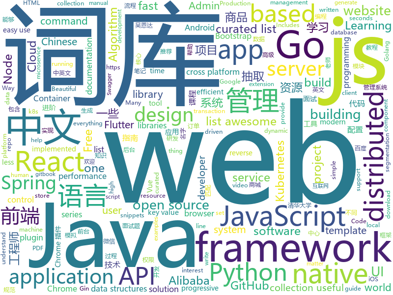

# 2019-03-13
See what the GitHub community is most excited about today.

## python
* [awesome-python-login-model](https://github.com/CriseLYJ/awesome-python-login-model)(**308 stars today**): 😮python模拟登陆一些大型网站，还有一些简单的爬虫，希望对你们有所帮助❤️，如果喜欢记得给个star哦🌟
* [ArchiveBox](https://github.com/pirate/ArchiveBox)(**227 stars today**): 🗃The open source self-hosted web archive. Takes browser history/bookmarks/Pocket/Pinboard/etc., saves HTML, JS, PDFs, media, and more...
* [ChromeAppHeroes](https://github.com/zhaoolee/ChromeAppHeroes)(**210 stars today**): 🌈Chrome插件英雄榜, 为优秀的Chrome插件写一本中文说明书, 让Chrome插件英雄们造福人类~ ChromePluginHeroes, Write a Chinese manual for the excellent Chrome plugin, let the Chrome plugin heroes benefit the human~
* [pytorch_geometric](https://github.com/rusty1s/pytorch_geometric)(**169 stars today**): Geometric Deep Learning Extension Library for PyTorch
* [USTC-Course](https://github.com/USTC-Resource/USTC-Course)(**154 stars today**): ❤️中国科学技术大学课程资源
* [faceswap](https://github.com/deepfakes/faceswap)(**113 stars today**): Non official project based on original /r/Deepfakes thread. Many thanks to him!
* [models](https://github.com/tensorflow/models)(**85 stars today**): Models and examples built with TensorFlow
* [CheatSheetSeries](https://github.com/OWASP/CheatSheetSeries)(**91 stars today**): The OWASP Cheat Sheet Series was created to provide a concise collection of high value information on specific application security topics.
* [system-design-primer](https://github.com/donnemartin/system-design-primer)(**83 stars today**): Learn how to design large-scale systems. Prep for the system design interview. Includes Anki flashcards.
* [csgo-menu-maker](https://github.com/citrusCS/csgo-menu-maker)(**84 stars today**): Interactive UIs in vanilla Counter-Strike: Global Offensive™.
* [Python](https://github.com/TheAlgorithms/Python)(**63 stars today**): All Algorithms implemented in Python
* [public-apis](https://github.com/toddmotto/public-apis)(**63 stars today**): A collective list of free APIs for use in software and web development.
* [awesome-python](https://github.com/vinta/awesome-python)(**58 stars today**): A curated list of awesome Python frameworks, libraries, software and resources
* [Python](https://github.com/geekcomputers/Python)(**56 stars today**): My Python Examples
* [face_recognition](https://github.com/ageitgey/face_recognition)(**51 stars today**): The world's simplest facial recognition api for Python and the command line
* [youtube-dl](https://github.com/ytdl-org/youtube-dl)(**42 stars today**): Command-line program to download videos from YouTube.com and other video sites
* [SharPyShell](https://github.com/antonioCoco/SharPyShell)(**43 stars today**): SharPyShell - tiny and obfuscated ASP.NET webshell for C# web applications
* [HelloGitHub](https://github.com/521xueweihan/HelloGitHub)(**45 stars today**): 分享 GitHub 上有趣、入门级的开源项目，帮你找到编程的乐趣。欢迎推荐、自荐项目，让更多人知道你的项目⭐️
* [flask](https://github.com/pallets/flask)(**42 stars today**): The Python micro framework for building web applications.
* [SiamMask](https://github.com/foolwood/SiamMask)(**39 stars today**): [CVPR2019] Fast Online Object Tracking and Segmentation: A Unifying Approach
* [keras](https://github.com/keras-team/keras)(**37 stars today**): Deep Learning for humans
* [funNLP](https://github.com/fighting41love/funNLP)(**38 stars today**): 中英文敏感词、语言检测、中外手机/电话归属地/运营商查询、名字推断性别、手机号抽取、身份证抽取、邮箱抽取、中日文人名库、中文缩写库、拆字词典、词汇情感值、停用词、反动词表、暴恐词表、繁简体转换、英文模拟中文发音、汪峰歌词生成器、职业名称词库、同义词库、反义词库、否定词库、汽车品牌词库、汽车零件词库、连续英文切割、各种中文词向量、公司名字大全、古诗词库、IT词库、财经词库、成语词库、地名词库、历史名人词库、诗词词库、医学词库、饮食词库、法律词库、汽车词库、动物词库、中文聊天语料、中文谣言数据、百度中文问答数据集、句子相似度匹配算法集合、bert资源、文本生成&摘要相关工具、cocoNLP信息抽取工具、国内电话号码正则匹配、清华大学XLORE:中英文跨语言百科知识图谱、清华大学人工智能技术…
* [home-assistant](https://github.com/home-assistant/home-assistant)(**40 stars today**): 🏡Open source home automation that puts local control and privacy first
* [django](https://github.com/django/django)(**37 stars today**): The Web framework for perfectionists with deadlines.
* [tldr](https://github.com/tldr-pages/tldr)(**40 stars today**): 📚Simplified and community-driven man pages

## java
* [spring-boot-examples](https://github.com/ityouknow/spring-boot-examples)(**287 stars today**): about learning Spring Boot via examples. Spring Boot 教程、技术栈示例代码，快速简单上手教程。
* [JavaGuide](https://github.com/Snailclimb/JavaGuide)(**214 stars today**): 【Java学习+面试指南】 一份涵盖大部分Java程序员所需要掌握的核心知识。
* [advanced-java](https://github.com/doocs/advanced-java)(**137 stars today**): 😮互联网 Java 工程师进阶知识完全扫盲
* [mall](https://github.com/macrozheng/mall)(**88 stars today**): mall项目是一套电商系统，包括前台商城系统及后台管理系统，基于SpringBoot+MyBatis实现。 前台商城系统包含首页门户、商品推荐、商品搜索、商品展示、购物车、订单流程、会员中心、客户服务、帮助中心等模块。 后台管理系统包含商品管理、订单管理、会员管理、促销管理、运营管理、内容管理、统计报表、财务管理、权限管理、设置等模块。
* [quarkus](https://github.com/quarkusio/quarkus)(**92 stars today**): Quarkus: Supersonic Subatomic Java.
* [spring-boot](https://github.com/spring-projects/spring-boot)(**66 stars today**): Spring Boot
* [tutorials](https://github.com/eugenp/tutorials)(**43 stars today**): The "REST With Spring" Course:
* [Leaf](https://github.com/Meituan-Dianping/Leaf)(**60 stars today**): Distributed ID Generate Service
* [spring-framework](https://github.com/spring-projects/spring-framework)(**43 stars today**): Spring Framework
* [miaosha](https://github.com/qiurunze123/miaosha)(**56 stars today**): ⭐⭐⭐⭐秒杀系统设计与实现.互联网工程师进阶与分析🙋🐓
* [arthas](https://github.com/alibaba/arthas)(**48 stars today**): Alibaba Java Diagnostic Tool Arthas/Alibaba Java诊断利器Arthas
* [security](https://github.com/opendistro-for-elasticsearch/security)(**50 stars today**): 
* [nacos](https://github.com/alibaba/nacos)(**43 stars today**): an easy-to-use dynamic service discovery, configuration and service management platform for building cloud native applications.
* [fescar](https://github.com/alibaba/fescar)(**42 stars today**): 🔥Fescar is an easy-to-use, high-performance, java based, open source distributed transaction solution.
* [elasticsearch](https://github.com/elastic/elasticsearch)(**40 stars today**): Open Source, Distributed, RESTful Search Engine
* [spring-cloud-alibaba](https://github.com/spring-cloud-incubator/spring-cloud-alibaba)(**40 stars today**): Spring Cloud Alibaba provides a one-stop solution for application development for the distributed solutions of Alibaba middleware.
* [flutter_boost](https://github.com/alibaba/flutter_boost)(**44 stars today**): FlutterBoost is a Flutter plugin which enables hybrid integration of Flutter for your existing native apps with minimum efforts
* [helidon](https://github.com/oracle/helidon)(**41 stars today**): Java libraries for writing microservices
* [DoraemonKit](https://github.com/didi/DoraemonKit)(**41 stars today**): 简称 "DoKit" 。一款功能齐全的客户端（ iOS 、Android ）研发助手，你值得拥有。
* [Java](https://github.com/TheAlgorithms/Java)(**36 stars today**): All Algorithms implemented in Java
* [sofa-jraft](https://github.com/alipay/sofa-jraft)(**33 stars today**): An production-grade java implementation of RAFT consensus algorithm.
* [apollo](https://github.com/ctripcorp/apollo)(**33 stars today**): Apollo（阿波罗）是携程框架部门研发的分布式配置中心，能够集中化管理应用不同环境、不同集群的配置，配置修改后能够实时推送到应用端，并且具备规范的权限、流程治理等特性，适用于微服务配置管理场景。
* [JCSprout](https://github.com/crossoverJie/JCSprout)(**32 stars today**): 👨‍🎓Java Core Sprout : basic, concurrent, algorithm
* [Pandora](https://github.com/AlanCheen/Pandora)(**35 stars today**): Android 最常用最基础的工具类，用过的都会变帅变美哟！
* [AndroidUtilCode](https://github.com/Blankj/AndroidUtilCode)(**29 stars today**): 🔥Android developers should collect the following utils(updating).

## unknown
* [ghidra](https://github.com/NationalSecurityAgency/ghidra)(**510 stars today**): Ghidra is a software reverse engineering (SRE) framework
* [Go42](https://github.com/ffhelicopter/Go42)(**251 stars today**): 写《Go语言四十二章经》，纯粹是因为开发过程中碰到过的一些问题，踩到过的一些坑，感觉在Go语言学习使用过程中，有必要深刻理解这门语言的核心思维、清晰掌握语言的细节规范以及反复琢磨标准包代码设计模式，于是才有了这本书。
* [CS-Notes](https://github.com/CyC2018/CS-Notes)(**224 stars today**): 😋技术面试必备基础知识
* [Micro8](https://github.com/Micropoor/Micro8)(**170 stars today**): Gitbook
* [ycy](https://github.com/ccyyycy/ycy)(**152 stars today**): "Hello YCY" Programming Competition
* [CS-Notes-PDF](https://github.com/sjsdfg/CS-Notes-PDF)(**134 stars today**): https://github.com/CyC2018/CS-Notes PDF版本离线阅读
* [Awesome-Design-Tools](https://github.com/LisaDziuba/Awesome-Design-Tools)(**127 stars today**): The best design tools for everything.
* [gitignore](https://github.com/github/gitignore)(**87 stars today**): A collection of useful .gitignore templates
* [awesome](https://github.com/sindresorhus/awesome)(**106 stars today**): 😎Awesome lists about all kinds of interesting topics
* [developer-roadmap](https://github.com/kamranahmedse/developer-roadmap)(**92 stars today**): Roadmap to becoming a web developer in 2019
* [free-programming-books-zh_CN](https://github.com/justjavac/free-programming-books-zh_CN)(**81 stars today**): 📚免费的计算机编程类中文书籍，欢迎投稿
* [free-programming-books](https://github.com/EbookFoundation/free-programming-books)(**69 stars today**): 📚Freely available programming books
* [You-Dont-Know-JS](https://github.com/getify/You-Dont-Know-JS)(**69 stars today**): A book series on JavaScript. @YDKJS on twitter.
* [Daily-Interview-Question](https://github.com/Advanced-Frontend/Daily-Interview-Question)(**70 stars today**): 工作日每天一道前端大厂面试题，祝大家天天进步，一年后会看到不一样的自己。
* [awesome-wechat-weapp](https://github.com/justjavac/awesome-wechat-weapp)(**63 stars today**): 微信小程序开发资源汇总💯
* [the-book-of-secret-knowledge](https://github.com/trimstray/the-book-of-secret-knowledge)(**59 stars today**): A collection of inspiring lists, manuals, cheatsheets, blogs, hacks, one-liners, cli/web tools and more.
* [toBeTopJavaer](https://github.com/hollischuang/toBeTopJavaer)(**56 stars today**): To Be Top Javaer - Java工程师成神之路
* [awesome-vue](https://github.com/vuejs/awesome-vue)(**55 stars today**): 🎉A curated list of awesome things related to Vue.js
* [python_interview_question](https://github.com/kenwoodjw/python_interview_question)(**50 stars today**): 关于python的面试题
* [How-To-Secure-A-Linux-Server](https://github.com/imthenachoman/How-To-Secure-A-Linux-Server)(**56 stars today**): An evolving how-to guide for securing a Linux server.
* [awesome-machine-learning-interpretability](https://github.com/jphall663/awesome-machine-learning-interpretability)(**47 stars today**): A curated list of awesome machine learning interpretability resources.
* [build-your-own-x](https://github.com/danistefanovic/build-your-own-x)(**46 stars today**): 🤓Build your own (insert technology here)
* [blog](https://github.com/yygmind/blog)(**43 stars today**): 我是木易杨，网易高级前端工程师，跟着我每周重点攻克一个前端面试重难点。接下来让我带你走进高级前端的世界，在进阶的路上，共勉！
* [kubernetes-the-hard-way](https://github.com/kelseyhightower/kubernetes-the-hard-way)(**36 stars today**): Bootstrap Kubernetes the hard way on Google Cloud Platform. No scripts.

## javascript
* [send](https://github.com/mozilla/send)(**437 stars today**): File Sharing Experiment
* [react-three-fiber](https://github.com/drcmda/react-three-fiber)(**369 stars today**): 👌A React-renderer for Three.js
* [vue](https://github.com/vuejs/vue)(**147 stars today**): 🖖Vue.js is a progressive, incrementally-adoptable JavaScript framework for building UI on the web.
* [react-beautiful-dnd](https://github.com/atlassian/react-beautiful-dnd)(**142 stars today**): Beautiful and accessible drag and drop for lists with React
* [react-window](https://github.com/bvaughn/react-window)(**132 stars today**): React components for efficiently rendering large lists and tabular data
* [react](https://github.com/facebook/react)(**102 stars today**): A declarative, efficient, and flexible JavaScript library for building user interfaces.
* [javascript-algorithms](https://github.com/trekhleb/javascript-algorithms)(**105 stars today**): 📝Algorithms and data structures implemented in JavaScript with explanations and links to further readings
* [iro.js](https://github.com/jaames/iro.js)(**93 stars today**): 🎨HSV color picker widget for JavaScript with a modern, SVG-based user interface
* [complete-intro-to-react-v5](https://github.com/btholt/complete-intro-to-react-v5)(**82 stars today**): The Complete Intro to React, the fifth version
* [handtrack.js](https://github.com/victordibia/handtrack.js)(**85 stars today**): A library for prototyping realtime hand detection (bounding box), directly in the browser.
* [vsc-netease-music](https://github.com/nondanee/vsc-netease-music)(**84 stars today**): UNOFFICIAL Netease Music extension for Visual Studio Code
* [react-spring](https://github.com/react-spring/react-spring)(**84 stars today**): ✌️A spring physics based React animation library
* [30-seconds-of-code](https://github.com/30-seconds/30-seconds-of-code)(**79 stars today**): A curated collection of useful JavaScript snippets that you can understand in 30 seconds or less.
* [taro](https://github.com/NervJS/taro)(**78 stars today**): 多端统一开发框架，支持用 React 的开发方式编写一次代码，生成能运行在微信/百度/支付宝/字节跳动小程序、H5、React Native 等的应用。 https://taro.js.org/
* [strapi](https://github.com/strapi/strapi)(**77 stars today**): 🚀Open source Node.js Headless CMS to easily build customisable APIs
* [puppeteer](https://github.com/GoogleChrome/puppeteer)(**63 stars today**): Headless Chrome Node API
* [bootstrap](https://github.com/twbs/bootstrap)(**53 stars today**): The most popular HTML, CSS, and JavaScript framework for developing responsive, mobile first projects on the web.
* [storybook](https://github.com/storybooks/storybook)(**65 stars today**): UI component dev & test: React, React Native, Vue, Angular, Ember & more!
* [ink](https://github.com/vadimdemedes/ink)(**67 stars today**): 🌈React for interactive command-line apps
* [Motrix](https://github.com/agalwood/Motrix)(**63 stars today**): A full-featured download manager.
* [slate](https://github.com/lord/slate)(**54 stars today**): Beautiful static documentation for your API
* [portable-node-guide](https://github.com/ehmicky/portable-node-guide)(**61 stars today**): 📗Practical guide on how to write portable/cross-platform Node.js code
* [axios](https://github.com/axios/axios)(**57 stars today**): Promise based HTTP client for the browser and node.js
* [create-react-app](https://github.com/facebook/create-react-app)(**47 stars today**): Set up a modern web app by running one command.
* [gatsby](https://github.com/gatsbyjs/gatsby)(**43 stars today**): Build blazing fast, modern apps and websites with React

## html
* [lets-get-arrested](https://github.com/hamukazu/lets-get-arrested)(**246 stars today**): This project is intended to protest against the police in Japan
* [personal-website](https://github.com/github/personal-website)(**123 stars today**): Code that'll help you kickstart a personal website that showcases your work as a software developer.
* [kv-storage](https://github.com/WICG/kv-storage)(**54 stars today**): A proposal for an async key/value storage API for the web
* [javascript-tutorial-en](https://github.com/iliakan/javascript-tutorial-en)(**36 stars today**): Modern JavaScript Tutorial
* [manuals](https://github.com/skr-shop/manuals)(**37 stars today**): Do design No code📖
* [flutter-in-action](https://github.com/flutterchina/flutter-in-action)(**25 stars today**): 《Flutter实战》电子书
* [Coursera-ML-AndrewNg-Notes](https://github.com/fengdu78/Coursera-ML-AndrewNg-Notes)(**20 stars today**): 吴恩达老师的机器学习课程个人笔记
* [AdminLTE](https://github.com/almasaeed2010/AdminLTE)(**21 stars today**): AdminLTE - Free Premium Admin control Panel Theme Based On Bootstrap 3.x
* [ionic](https://github.com/ionic-team/ionic)(**20 stars today**): Build amazing native and progressive web apps with open web technologies. One app running on everything🎉
* [deeplearning_ai_books](https://github.com/fengdu78/deeplearning_ai_books)(**20 stars today**): deeplearning.ai（吴恩达老师的深度学习课程笔记及资源）
* [quickchart](https://github.com/typpo/quickchart)(**21 stars today**): Google Image Charts alternative
* [webKnowledge](https://github.com/huyaocode/webKnowledge)(**20 stars today**): 前端知识点总结
* [website](https://github.com/kubernetes/website)(**15 stars today**): Kubernetes website and documentation repo:
* [android_interview](https://github.com/LRH1993/android_interview)(**18 stars today**): gitbook地址
* [free-for-dev](https://github.com/ripienaar/free-for-dev)(**19 stars today**): A list of SaaS, PaaS and IaaS offerings that have free tiers of interest to devops and infradev
* [Spoon-Knife](https://github.com/octocat/Spoon-Knife)(****): This repo is for demonstration purposes only.
* [JavaScript30](https://github.com/wesbos/JavaScript30)(**10 stars today**): 30 Day Vanilla JS Challenge
* [portainer](https://github.com/portainer/portainer)(**14 stars today**): Simple management UI for Docker
* [30-seconds-of-css](https://github.com/30-seconds/30-seconds-of-css)(**13 stars today**): A curated collection of useful CSS snippets you can understand in 30 seconds or less.
* [github](https://github.com/phodal/github)(**10 stars today**): GitHub 漫游指南- a Chinese ebook on how to build a good project on Github. Explore the users' behavior. Find some thing interest.
* [swagger-codegen](https://github.com/swagger-api/swagger-codegen)(**8 stars today**): swagger-codegen contains a template-driven engine to generate documentation, API clients and server stubs in different languages by parsing your OpenAPI / Swagger definition.
* [not-so-random](https://github.com/ex-punctis/not-so-random)(**11 stars today**): A script [js + plotly.js] that guesses your next input no matter how random you try to be
* [Adminator-admin-dashboard](https://github.com/puikinsh/Adminator-admin-dashboard)(**5 stars today**): Adminator is a easy to use and well design admin dashboard template for web apps, websites, services and more
* [capacitor](https://github.com/ionic-team/capacitor)(**10 stars today**): Build cross-platform Native Progressive Web Apps for iOS, Android, and the web⚡️
* [stisla](https://github.com/stisla/stisla)(**10 stars today**): Free Bootstrap Admin Template

## go
* [server](https://github.com/gotify/server)(**291 stars today**): A simple server for sending and receiving messages in real-time per web socket. (Includes a sleek web-ui)
* [slim](https://github.com/openacid/slim)(**147 stars today**): Unbelievably space efficient data structures in Golang.
* [submariner](https://github.com/rancher/submariner)(**116 stars today**): Connect all your Kubernetes clusters, no matter where they are in the world.
* [k3s](https://github.com/rancher/k3s)(**99 stars today**): Lightweight Kubernetes. 5 less than k8s.
* [kubernetes](https://github.com/kubernetes/kubernetes)(**68 stars today**): Production-Grade Container Scheduling and Management
* [go](https://github.com/golang/go)(**72 stars today**): The Go programming language
* [nutsdb](https://github.com/xujiajun/nutsdb)(**75 stars today**): A simple, fast, embeddable, persistent key/value store written in pure Go. It supports fully serializable transactions and many data structures such as list, set, sorted set.
* [kraken](https://github.com/uber/kraken)(**71 stars today**): P2P Docker registry capable of distributing TBs of data in seconds
* [awesome-go](https://github.com/avelino/awesome-go)(**62 stars today**): A curated list of awesome Go frameworks, libraries and software
* [frp](https://github.com/fatedier/frp)(**46 stars today**): A fast reverse proxy to help you expose a local server behind a NAT or firewall to the internet.
* [gin](https://github.com/gin-gonic/gin)(**49 stars today**): Gin is a HTTP web framework written in Go (Golang). It features a Martini-like API with much better performance -- up to 40 times faster. If you need smashing performance, get yourself some Gin.
* [pipeline](https://github.com/tektoncd/pipeline)(**48 stars today**): A K8s-native Pipeline resource.
* [flyover-reverse-engineering](https://github.com/retroplasma/flyover-reverse-engineering)(**42 stars today**): Reversing Apple's 3D satellite mode
* [istio](https://github.com/istio/istio)(**38 stars today**): Connect, secure, control, and observe services.
* [hugo](https://github.com/gohugoio/hugo)(**36 stars today**): The world’s fastest framework for building websites.
* [footloose](https://github.com/weaveworks/footloose)(**37 stars today**): Container Machines - Containers that look like Virtual Machines
* [traefik](https://github.com/containous/traefik)(**35 stars today**): The Cloud Native Edge Router
* [gse](https://github.com/go-ego/gse)(**36 stars today**): Go efficient text segmentation; support english, chinese, japanese and other. Go 语言高性能分词
* [weaver](https://github.com/gojektech/weaver)(**35 stars today**): An Advanced HTTP Reverse Proxy with Dynamic Sharding Strategies
* [go-micro](https://github.com/micro/go-micro)(**34 stars today**): A microservice framework
* [caddy](https://github.com/mholt/caddy)(**32 stars today**): Fast, cross-platform HTTP/2 web server with automatic HTTPS
* [the-way-to-go_ZH_CN](https://github.com/Unknwon/the-way-to-go_ZH_CN)(**30 stars today**): 《The Way to Go》中文译本，中文正式名《Go 入门指南》
* [etcd](https://github.com/etcd-io/etcd)(**28 stars today**): Distributed reliable key-value store for the most critical data of a distributed system
* [prometheus](https://github.com/prometheus/prometheus)(**28 stars today**): The Prometheus monitoring system and time series database.
* [tidb](https://github.com/pingcap/tidb)(**27 stars today**): TiDB is a distributed HTAP database compatible with the MySQL protocol

## WordCloud

