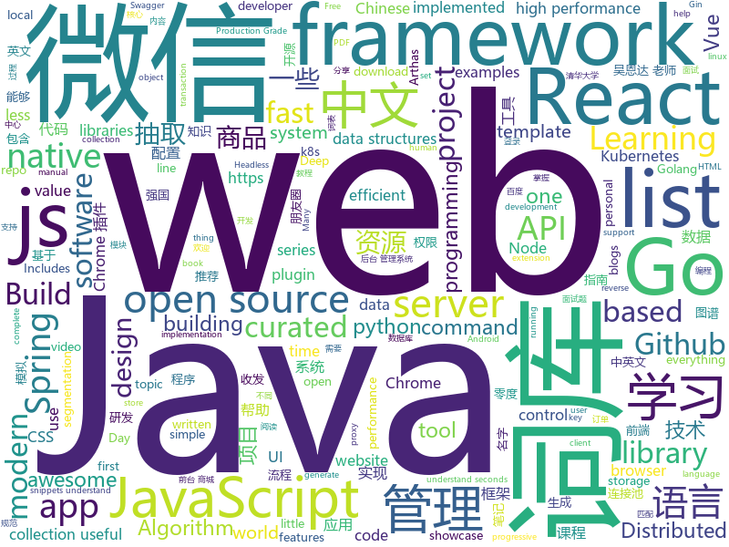

# 2019-03-14
See what the GitHub community is most excited about today.

## python
* [awesome-python-login-model](https://github.com/CriseLYJ/awesome-python-login-model)(**265 stars today**): 😮python模拟登陆一些大型网站，还有一些简单的爬虫，希望对你们有所帮助❤️，如果喜欢记得给个star哦🌟
* [ChromeAppHeroes](https://github.com/zhaoolee/ChromeAppHeroes)(**179 stars today**): 🌈Chrome插件英雄榜, 为优秀的Chrome插件写一本中文说明书, 让Chrome插件英雄们造福人类~ ChromePluginHeroes, Write a Chinese manual for the excellent Chrome plugin, let the Chrome plugin heroes benefit the human~
* [ArchiveBox](https://github.com/pirate/ArchiveBox)(**154 stars today**): 🗃The open source self-hosted web archive. Takes browser history/bookmarks/Pocket/Pinboard/etc., saves HTML, JS, PDFs, media, and more...
* [indico](https://github.com/indico/indico)(**147 stars today**): Indico - A complete event management system
* [pytorch_geometric](https://github.com/rusty1s/pytorch_geometric)(**120 stars today**): Geometric Deep Learning Extension Library for PyTorch
* [pwned-search](https://github.com/mikepound/pwned-search)(**108 stars today**): Pwned Password API lookup
* [models](https://github.com/tensorflow/models)(**86 stars today**): Models and examples built with TensorFlow
* [faceswap](https://github.com/deepfakes/faceswap)(**97 stars today**): Non official project based on original /r/Deepfakes thread. Many thanks to him!
* [USTC-Course](https://github.com/USTC-Resource/USTC-Course)(**85 stars today**): ❤️中国科学技术大学课程资源
* [system-design-primer](https://github.com/donnemartin/system-design-primer)(**88 stars today**): Learn how to design large-scale systems. Prep for the system design interview. Includes Anki flashcards.
* [awesome-python](https://github.com/vinta/awesome-python)(**73 stars today**): A curated list of awesome Python frameworks, libraries, software and resources
* [Python](https://github.com/TheAlgorithms/Python)(**58 stars today**): All Algorithms implemented in Python
* [CheatSheetSeries](https://github.com/OWASP/CheatSheetSeries)(**55 stars today**): The OWASP Cheat Sheet Series was created to provide a concise collection of high value information on specific application security topics.
* [public-apis](https://github.com/toddmotto/public-apis)(**54 stars today**): A collective list of free APIs for use in software and web development.
* [face_recognition](https://github.com/ageitgey/face_recognition)(**45 stars today**): The world's simplest facial recognition api for Python and the command line
* [linux-insides](https://github.com/0xAX/linux-insides)(**49 stars today**): A little bit about a linux kernel
* [keras](https://github.com/keras-team/keras)(**40 stars today**): Deep Learning for humans
* [funNLP](https://github.com/fighting41love/funNLP)(**43 stars today**): 中英文敏感词、语言检测、中外手机/电话归属地/运营商查询、名字推断性别、手机号抽取、身份证抽取、邮箱抽取、中日文人名库、中文缩写库、拆字词典、词汇情感值、停用词、反动词表、暴恐词表、繁简体转换、英文模拟中文发音、汪峰歌词生成器、职业名称词库、同义词库、反义词库、否定词库、汽车品牌词库、汽车零件词库、连续英文切割、各种中文词向量、公司名字大全、古诗词库、IT词库、财经词库、成语词库、地名词库、历史名人词库、诗词词库、医学词库、饮食词库、法律词库、汽车词库、动物词库、中文聊天语料、中文谣言数据、百度中文问答数据集、句子相似度匹配算法集合、bert资源、文本生成&摘要相关工具、cocoNLP信息抽取工具、国内电话号码正则匹配、清华大学XLORE:中英文跨语言百科知识图谱、清华大学人工智能技术…
* [zero](https://github.com/remoteinterview/zero)(**44 stars today**): Zero is a web server to simplify web development.
* [d2l-en](https://github.com/d2l-ai/d2l-en)(**37 stars today**): Dive into Deep Learning, Berkeley STAT 157 (Spring 2019) textbook. With code, math, and discussions.
* [youtube-dl](https://github.com/ytdl-org/youtube-dl)(**39 stars today**): Command-line program to download videos from YouTube.com and other video sites
* [home-assistant](https://github.com/home-assistant/home-assistant)(**35 stars today**): 🏡Open source home automation that puts local control and privacy first
* [SiamMask](https://github.com/foolwood/SiamMask)(**38 stars today**): [CVPR2019] Fast Online Object Tracking and Segmentation: A Unifying Approach
* [HelloGitHub](https://github.com/521xueweihan/HelloGitHub)(**35 stars today**): 分享 GitHub 上有趣、入门级的开源项目，帮你找到编程的乐趣。欢迎推荐、自荐项目，让更多人知道你的项目⭐️
* [django](https://github.com/django/django)(**26 stars today**): The Web framework for perfectionists with deadlines.

## java
* [JavaGuide](https://github.com/Snailclimb/JavaGuide)(**223 stars today**): 【Java学习+面试指南】 一份涵盖大部分Java程序员所需要掌握的核心知识。
* [android-ConstraintLayoutExamples](https://github.com/googlesamples/android-ConstraintLayoutExamples)(**169 stars today**): Repository of examples that showcase the various features of ConstraintLayout
* [spring-boot-examples](https://github.com/ityouknow/spring-boot-examples)(**148 stars today**): about learning Spring Boot via examples. Spring Boot 教程、技术栈示例代码，快速简单上手教程。
* [advanced-java](https://github.com/doocs/advanced-java)(**101 stars today**): 😮互联网 Java 工程师进阶知识完全扫盲
* [mall](https://github.com/macrozheng/mall)(**83 stars today**): mall项目是一套电商系统，包括前台商城系统及后台管理系统，基于SpringBoot+MyBatis实现。 前台商城系统包含首页门户、商品推荐、商品搜索、商品展示、购物车、订单流程、会员中心、客户服务、帮助中心等模块。 后台管理系统包含商品管理、订单管理、会员管理、促销管理、运营管理、内容管理、统计报表、财务管理、权限管理、设置等模块。
* [spring-boot](https://github.com/spring-projects/spring-boot)(**58 stars today**): Spring Boot
* [x7](https://github.com/x-ream/x7)(**35 stars today**): 
* [helidon](https://github.com/oracle/helidon)(**59 stars today**): Java libraries for writing microservices
* [Pandora](https://github.com/AlanCheen/Pandora)(**59 stars today**): 精心选择的 Android 最常用最有用的工具类，用过的都会变帅变美哟！
* [sofa-jraft](https://github.com/alipay/sofa-jraft)(**51 stars today**): A production-grade java implementation of RAFT consensus algorithm.
* [tutorials](https://github.com/eugenp/tutorials)(**26 stars today**): The "REST With Spring" Course:
* [spring-framework](https://github.com/spring-projects/spring-framework)(**42 stars today**): Spring Framework
* [Leaf](https://github.com/Meituan-Dianping/Leaf)(**48 stars today**): Distributed ID Generate Service
* [quarkus](https://github.com/quarkusio/quarkus)(**49 stars today**): Quarkus: Supersonic Subatomic Java.
* [elasticsearch](https://github.com/elastic/elasticsearch)(**43 stars today**): Open Source, Distributed, RESTful Search Engine
* [arthas](https://github.com/alibaba/arthas)(**43 stars today**): Alibaba Java Diagnostic Tool Arthas/Alibaba Java诊断利器Arthas
* [fescar](https://github.com/alibaba/fescar)(**41 stars today**): 🔥Fescar is an easy-to-use, high-performance, java based, open source distributed transaction solution.
* [pravega](https://github.com/pravega/pravega)(**42 stars today**): Pravega - Streaming as a new software defined storage primitive
* [apollo](https://github.com/ctripcorp/apollo)(**41 stars today**): Apollo（阿波罗）是携程框架部门研发的分布式配置中心，能够集中化管理应用不同环境、不同集群的配置，配置修改后能够实时推送到应用端，并且具备规范的权限、流程治理等特性，适用于微服务配置管理场景。
* [incubator-dubbo](https://github.com/apache/incubator-dubbo)(**33 stars today**): Apache Dubbo (incubating) is a high-performance, java based, open source RPC framework.
* [JGrowing](https://github.com/javagrowing/JGrowing)(**33 stars today**): Java is Growing up but not only Java。Java成长路线，但学到不仅仅是Java。
* [druid](https://github.com/alibaba/druid)(**34 stars today**): 阿里巴巴数据库事业部出品，为监控而生的数据库连接池。阿里云Data Lake Analytics(https://www.aliyun.com/product/datalakeanalytics )、DRDS、TDDL 连接池powered by Druid
* [Java](https://github.com/TheAlgorithms/Java)(**32 stars today**): All Algorithms implemented in Java
* [DoraemonKit](https://github.com/didi/DoraemonKit)(**33 stars today**): 简称 "DoKit" 。一款功能齐全的客户端（ iOS 、Android ）研发助手，你值得拥有。
* [JCSprout](https://github.com/crossoverJie/JCSprout)(**33 stars today**): 👨‍🎓Java Core Sprout : basic, concurrent, algorithm

## unknown
* [awesome-personal-blogs](https://github.com/jkup/awesome-personal-blogs)(**383 stars today**): A delightful list of personal tech blogs
* [Go42](https://github.com/ffhelicopter/Go42)(**346 stars today**): 写《Go语言四十二章经》，纯粹是因为开发过程中碰到过的一些问题，踩到过的一些坑，感觉在Go语言学习使用过程中，有必要深刻理解这门语言的核心思维、清晰掌握语言的细节规范以及反复琢磨标准包代码设计模式，于是才有了这本书。
* [ghidra](https://github.com/NationalSecurityAgency/ghidra)(**331 stars today**): Ghidra is a software reverse engineering (SRE) framework
* [CS-Notes](https://github.com/CyC2018/CS-Notes)(**201 stars today**): 😋技术面试必备基础知识
* [Micro8](https://github.com/Micropoor/Micro8)(**123 stars today**): Gitbook
* [Awesome-Design-Tools](https://github.com/LisaDziuba/Awesome-Design-Tools)(**116 stars today**): The best design tools for everything.
* [developer-roadmap](https://github.com/kamranahmedse/developer-roadmap)(**106 stars today**): Roadmap to becoming a web developer in 2019
* [awesome](https://github.com/sindresorhus/awesome)(**90 stars today**): 😎Awesome lists about all kinds of interesting topics
* [gitignore](https://github.com/github/gitignore)(**68 stars today**): A collection of useful .gitignore templates
* [free-programming-books-zh_CN](https://github.com/justjavac/free-programming-books-zh_CN)(**73 stars today**): 📚免费的计算机编程类中文书籍，欢迎投稿
* [ycy](https://github.com/ccyyycy/ycy)(**77 stars today**): "Hello YCY" Programming Competition
* [CS-Notes-PDF](https://github.com/sjsdfg/CS-Notes-PDF)(**61 stars today**): https://github.com/CyC2018/CS-Notes PDF版本离线阅读
* [the-book-of-secret-knowledge](https://github.com/trimstray/the-book-of-secret-knowledge)(**59 stars today**): A collection of inspiring lists, manuals, cheatsheets, blogs, hacks, one-liners, cli/web tools and more.
* [python_interview_question](https://github.com/kenwoodjw/python_interview_question)(**58 stars today**): 关于python的面试题
* [free-programming-books](https://github.com/EbookFoundation/free-programming-books)(**56 stars today**): 📚Freely available programming books
* [Daily-Interview-Question](https://github.com/Advanced-Frontend/Daily-Interview-Question)(**54 stars today**): 工作日每天一道前端大厂面试题，祝大家天天进步，一年后会看到不一样的自己。
* [You-Dont-Know-JS](https://github.com/getify/You-Dont-Know-JS)(**49 stars today**): A book series on JavaScript. @YDKJS on twitter.
* [awesome-vue](https://github.com/vuejs/awesome-vue)(**48 stars today**): 🎉A curated list of awesome things related to Vue.js
* [How-To-Secure-A-Linux-Server](https://github.com/imthenachoman/How-To-Secure-A-Linux-Server)(**51 stars today**): An evolving how-to guide for securing a Linux server.
* [awesome-wechat-weapp](https://github.com/justjavac/awesome-wechat-weapp)(**45 stars today**): 微信小程序开发资源汇总💯
* [architect-awesome](https://github.com/xingshaocheng/architect-awesome)(**41 stars today**): 后端架构师技术图谱
* [build-your-own-x](https://github.com/danistefanovic/build-your-own-x)(**44 stars today**): 🤓Build your own (insert technology here)
* [awesome-public-datasets](https://github.com/awesomedata/awesome-public-datasets)(**39 stars today**): A topic-centric list of HQ open datasets. PR ☛☛☛
* [hosts](https://github.com/googlehosts/hosts)(**32 stars today**): 镜像：https://coding.net/u/scaffrey/p/hosts/git

## javascript
* [send](https://github.com/mozilla/send)(**947 stars today**): Simple, private file sharing from the makers of Firefox
* [react-three-fiber](https://github.com/drcmda/react-three-fiber)(**196 stars today**): 👌A React-renderer for Three.js
* [vue](https://github.com/vuejs/vue)(**148 stars today**): 🖖Vue.js is a progressive, incrementally-adoptable JavaScript framework for building UI on the web.
* [react](https://github.com/facebook/react)(**104 stars today**): A declarative, efficient, and flexible JavaScript library for building user interfaces.
* [react-beautiful-dnd](https://github.com/atlassian/react-beautiful-dnd)(**100 stars today**): Beautiful and accessible drag and drop for lists with React
* [javascript-algorithms](https://github.com/trekhleb/javascript-algorithms)(**89 stars today**): 📝Algorithms and data structures implemented in JavaScript with explanations and links to further readings
* [ui-box](https://github.com/segmentio/ui-box)(**88 stars today**): Blazing Fast React UI Primitive
* [Motrix](https://github.com/agalwood/Motrix)(**83 stars today**): A full-featured download manager.
* [webp-in-css](https://github.com/ai/webp-in-css)(**77 stars today**): PostCSS plugin and tiny JS script (128 bytes) to use WebP in CSS background
* [eslint-config-wesbos](https://github.com/wesbos/eslint-config-wesbos)(**70 stars today**): No-Sweat™ Eslint and Prettier Setup - with or without VS Code
* [storybook](https://github.com/storybooks/storybook)(**67 stars today**): UI component dev & test: React, React Native, Vue, Angular, Ember & more!
* [30-seconds-of-code](https://github.com/30-seconds/30-seconds-of-code)(**68 stars today**): A curated collection of useful JavaScript snippets that you can understand in 30 seconds or less.
* [axios](https://github.com/axios/axios)(**63 stars today**): Promise based HTTP client for the browser and node.js
* [strapi](https://github.com/strapi/strapi)(**64 stars today**): 🚀Open source Node.js Headless CMS to easily build customisable APIs
* [handtrack.js](https://github.com/victordibia/handtrack.js)(**65 stars today**): A library for prototyping realtime hand detection (bounding box), directly in the browser.
* [gatsby](https://github.com/gatsbyjs/gatsby)(**55 stars today**): Build blazing fast, modern apps and websites with React
* [dayjs](https://github.com/iamkun/dayjs)(**63 stars today**): ⏰Day.js 2KB immutable date library alternative to Moment.js with the same modern API
* [ink](https://github.com/vadimdemedes/ink)(**60 stars today**): 🌈React for interactive command-line apps
* [taro](https://github.com/NervJS/taro)(**58 stars today**): 多端统一开发框架，支持用 React 的开发方式编写一次代码，生成能运行在微信/百度/支付宝/字节跳动小程序、H5、React Native 等的应用。 https://taro.js.org/
* [puppeteer](https://github.com/GoogleChrome/puppeteer)(**55 stars today**): Headless Chrome Node API
* [vsc-netease-music](https://github.com/nondanee/vsc-netease-music)(**57 stars today**): UNOFFICIAL Netease Music extension for Visual Studio Code
* [create-react-app](https://github.com/facebook/create-react-app)(**50 stars today**): Set up a modern web app by running one command.
* [bootstrap](https://github.com/twbs/bootstrap)(**40 stars today**): The most popular HTML, CSS, and JavaScript framework for developing responsive, mobile first projects on the web.
* [three.js](https://github.com/mrdoob/three.js)(**44 stars today**): JavaScript 3D library.
* [react-native](https://github.com/facebook/react-native)(**46 stars today**): A framework for building native apps with React.

## html
* [lets-get-arrested](https://github.com/hamukazu/lets-get-arrested)(**158 stars today**): This project is intended to protest against the police in Japan
* [personal-website](https://github.com/github/personal-website)(**74 stars today**): Code that'll help you kickstart a personal website that showcases your work as a software developer.
* [flutter-in-action](https://github.com/flutterchina/flutter-in-action)(**37 stars today**): 《Flutter实战》电子书
* [javascript-tutorial-en](https://github.com/iliakan/javascript-tutorial-en)(**28 stars today**): Modern JavaScript Tutorial
* [AdminLTE](https://github.com/almasaeed2010/AdminLTE)(**23 stars today**): AdminLTE - Free Premium Admin control Panel Theme Based On Bootstrap 3.x
* [Panda-Learning](https://github.com/Alivon/Panda-Learning)(**25 stars today**): 熊猫学习Panda-Learning是一个辅助学习强国的软体,帮助挤不出时间，却仍然需要学习的积极分子，盼达学习强国(xuexiqiangguo)
* [heyui-admin](https://github.com/heyui/heyui-admin)(**25 stars today**): 基于 vue 和 heyui 组件库的中后端系统
* [WeFramework](https://github.com/dreamdocker/WeFramework)(**23 stars today**): 零度微框架开源，更多内容请访问零度官网。
* [ionic](https://github.com/ionic-team/ionic)(**21 stars today**): Build amazing native and progressive web apps with open web technologies. One app running on everything🎉
* [JavaScript30](https://github.com/wesbos/JavaScript30)(**12 stars today**): 30 Day Vanilla JS Challenge
* [gauss-distribution](https://github.com/anvaka/gauss-distribution)(**19 stars today**): A fun little project to show distribution of pixels in Gauss's portrait
* [Coursera-ML-AndrewNg-Notes](https://github.com/fengdu78/Coursera-ML-AndrewNg-Notes)(**15 stars today**): 吴恩达老师的机器学习课程个人笔记
* [blackeye](https://github.com/thelinuxchoice/blackeye)(**17 stars today**): The most complete Phishing Tool, with 32 templates +1 customizable
* [webKnowledge](https://github.com/huyaocode/webKnowledge)(**17 stars today**): 前端知识点总结
* [deeplearning_ai_books](https://github.com/fengdu78/deeplearning_ai_books)(**16 stars today**): deeplearning.ai（吴恩达老师的深度学习课程笔记及资源）
* [swagger-codegen](https://github.com/swagger-api/swagger-codegen)(**16 stars today**): swagger-codegen contains a template-driven engine to generate documentation, API clients and server stubs in different languages by parsing your OpenAPI / Swagger definition.
* [Spoon-Knife](https://github.com/octocat/Spoon-Knife)(****): This repo is for demonstration purposes only.
* [android_interview](https://github.com/LRH1993/android_interview)(**13 stars today**): gitbook地址
* [Mac.WeChat.WebApi.Simple](https://github.com/changtuiqie/Mac.WeChat.WebApi.Simple)(**11 stars today**): mac微信,ipad微信 webapi封装好的实现方案，免IIS一键部署。 可实现微信80%功能；支持62数据登录、扫码登录、收发朋友圈、查看朋友圈、微信建群、微信拉人进群、微信公众号阅读、微信消息收发、微信附近的人定位、微信添加好友、微信红包接收、微信防撤回、分享小程序、微信加粉、微信收藏、微信标签等
* [30-seconds-of-css](https://github.com/30-seconds/30-seconds-of-css)(**12 stars today**): A curated collection of useful CSS snippets you can understand in 30 seconds or less.
* [manuals](https://github.com/skr-shop/manuals)(**12 stars today**): Do design No code📖
* [github](https://github.com/phodal/github)(**12 stars today**): GitHub 漫游指南- a Chinese ebook on how to build a good project on Github. Explore the users' behavior. Find some thing interest.
* [learning-area](https://github.com/mdn/learning-area)(**7 stars today**): Github repo for the MDN Learning Area.
* [all-contributors](https://github.com/all-contributors/all-contributors)(**11 stars today**): ✨Recognize all contributors, not just the ones who push code✨
* [javascript-tutorial-zh](https://github.com/xitu/javascript-tutorial-zh)(**11 stars today**): Modern JavaScript Tutorial

## go
* [submariner](https://github.com/rancher/submariner)(**289 stars today**): Connect all your Kubernetes clusters, no matter where they are in the world.
* [server](https://github.com/gotify/server)(**184 stars today**): A simple server for sending and receiving messages in real-time per web socket. (Includes a sleek web-ui)
* [pipeline](https://github.com/tektoncd/pipeline)(**94 stars today**): A K8s-native Pipeline resource.
* [go](https://github.com/golang/go)(**74 stars today**): The Go programming language
* [k3s](https://github.com/rancher/k3s)(**73 stars today**): Lightweight Kubernetes. 5 less than k8s.
* [slim](https://github.com/openacid/slim)(**59 stars today**): Unbelievably space efficient data structures in Golang.
* [kubernetes](https://github.com/kubernetes/kubernetes)(**50 stars today**): Production-Grade Container Scheduling and Management
* [webrtc](https://github.com/pions/webrtc)(**56 stars today**): A Go implementation of the WebRTC API
* [traefik](https://github.com/containous/traefik)(**47 stars today**): The Cloud Native Edge Router
* [kraken](https://github.com/uber/kraken)(**47 stars today**): P2P Docker registry capable of distributing TBs of data in seconds
* [hugo](https://github.com/gohugoio/hugo)(**46 stars today**): The world’s fastest framework for building websites.
* [frp](https://github.com/fatedier/frp)(**41 stars today**): A fast reverse proxy to help you expose a local server behind a NAT or firewall to the internet.
* [gse](https://github.com/go-ego/gse)(**41 stars today**): Go efficient text segmentation; support english, chinese, japanese and other. Go 语言高性能分词
* [nutsdb](https://github.com/xujiajun/nutsdb)(**42 stars today**): A simple, fast, embeddable, persistent key/value store written in pure Go. It supports fully serializable transactions and many data structures such as list, set, sorted set.
* [istio](https://github.com/istio/istio)(**37 stars today**): Connect, secure, control, and observe services.
* [prometheus](https://github.com/prometheus/prometheus)(**40 stars today**): The Prometheus monitoring system and time series database.
* [gin](https://github.com/gin-gonic/gin)(**38 stars today**): Gin is a HTTP web framework written in Go (Golang). It features a Martini-like API with much better performance -- up to 40 times faster. If you need smashing performance, get yourself some Gin.
* [etcd](https://github.com/etcd-io/etcd)(**36 stars today**): Distributed reliable key-value store for the most critical data of a distributed system
* [helm](https://github.com/helm/helm)(**34 stars today**): The Kubernetes Package Manager
* [go-asciibot](https://github.com/mattes/go-asciibot)(**36 stars today**): Golang ASCII Robot Generator
* [awesome-go](https://github.com/avelino/awesome-go)(**32 stars today**): A curated list of awesome Go frameworks, libraries and software
* [caddy](https://github.com/mholt/caddy)(**34 stars today**): Fast, cross-platform HTTP/2 web server with automatic HTTPS
* [exchange_proxy](https://github.com/MiSecurity/exchange_proxy)(**30 stars today**): Security proxy server for Exchange server
* [minio](https://github.com/minio/minio)(**28 stars today**): Minio is an open source object storage server compatible with Amazon S3 APIs
* [beego](https://github.com/astaxie/beego)(**26 stars today**): beego is an open-source, high-performance web framework for the Go programming language.

## WordCloud

