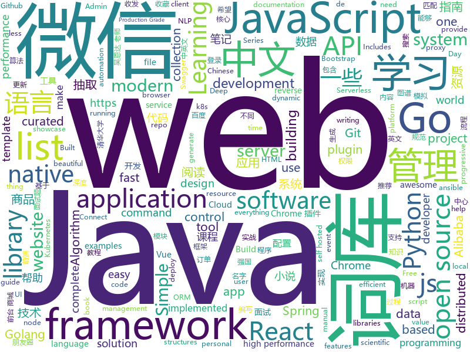

# 2019-03-15
See what the GitHub community is most excited about today.

## python
* [awesome-python-login-model](https://github.com/CriseLYJ/awesome-python-login-model)(**244 stars today**): 😮python模拟登陆一些大型网站，还有一些简单的爬虫，希望对你们有所帮助❤️，如果喜欢记得给个star哦🌟
* [ChromeAppHeroes](https://github.com/zhaoolee/ChromeAppHeroes)(**178 stars today**): 🌈Chrome插件英雄榜, 为优秀的Chrome插件写一本中文说明书, 让Chrome插件英雄们造福人类~ ChromePluginHeroes, Write a Chinese manual for the excellent Chrome plugin, let the Chrome plugin heroes benefit the human~
* [Algorithm_Interview_Notes-Chinese](https://github.com/imhuay/Algorithm_Interview_Notes-Chinese)(**106 stars today**): 2018/2019/校招/春招/秋招/算法/机器学习(Machine Learning)/深度学习(Deep Learning)/自然语言处理(NLP)/C/C++/Python/面试笔记
* [indico](https://github.com/indico/indico)(**117 stars today**): Indico - A complete event management system
* [ArchiveBox](https://github.com/pirate/ArchiveBox)(**111 stars today**): 🗃The open source self-hosted web archive. Takes browser history/bookmarks/Pocket/Pinboard/etc., saves HTML, JS, PDFs, media, and more...
* [fastapi](https://github.com/tiangolo/fastapi)(**103 stars today**): FastAPI framework, high performance, easy to learn, fast to code, ready for production
* [faceswap](https://github.com/deepfakes/faceswap)(**89 stars today**): Non official project based on original /r/Deepfakes thread. Many thanks to him!
* [models](https://github.com/tensorflow/models)(**69 stars today**): Models and examples built with TensorFlow
* [USTC-Course](https://github.com/USTC-Resource/USTC-Course)(**81 stars today**): ❤️中国科学技术大学课程资源
* [pytorch_geometric](https://github.com/rusty1s/pytorch_geometric)(**87 stars today**): Geometric Deep Learning Extension Library for PyTorch
* [torrentReleases](https://github.com/Kyrie1965/torrentReleases)(**82 stars today**): 
* [awesome-python](https://github.com/vinta/awesome-python)(**73 stars today**): A curated list of awesome Python frameworks, libraries, software and resources
* [write-yourself-a-git](https://github.com/thblt/write-yourself-a-git)(**72 stars today**): Learn Git by reimplementing it from scratch
* [system-design-primer](https://github.com/donnemartin/system-design-primer)(**69 stars today**): Learn how to design large-scale systems. Prep for the system design interview. Includes Anki flashcards.
* [public-apis](https://github.com/toddmotto/public-apis)(**63 stars today**): A collective list of free APIs for use in software and web development.
* [Python](https://github.com/TheAlgorithms/Python)(**59 stars today**): All Algorithms implemented in Python
* [owllook](https://github.com/howie6879/owllook)(**45 stars today**): owllook-在线网络小说阅读网站&小说搜索引擎&小说推荐系统[搜索、追书、收藏、追更、小说API]
* [zero](https://github.com/remoteinterview/zero)(**54 stars today**): Zero is a web server to simplify web development.
* [home-assistant](https://github.com/home-assistant/home-assistant)(**49 stars today**): 🏡Open source home automation that puts local control and privacy first
* [CheatSheetSeries](https://github.com/OWASP/CheatSheetSeries)(**46 stars today**): The OWASP Cheat Sheet Series was created to provide a concise collection of high value information on specific application security topics.
* [funNLP](https://github.com/fighting41love/funNLP)(**45 stars today**): 中英文敏感词、语言检测、中外手机/电话归属地/运营商查询、名字推断性别、手机号抽取、身份证抽取、邮箱抽取、中日文人名库、中文缩写库、拆字词典、词汇情感值、停用词、反动词表、暴恐词表、繁简体转换、英文模拟中文发音、汪峰歌词生成器、职业名称词库、同义词库、反义词库、否定词库、汽车品牌词库、汽车零件词库、连续英文切割、各种中文词向量、公司名字大全、古诗词库、IT词库、财经词库、成语词库、地名词库、历史名人词库、诗词词库、医学词库、饮食词库、法律词库、汽车词库、动物词库、中文聊天语料、中文谣言数据、百度中文问答数据集、句子相似度匹配算法集合、bert资源、文本生成&摘要相关工具、cocoNLP信息抽取工具、国内电话号码正则匹配、清华大学XLORE:中英文跨语言百科知识图谱、清华大学人工智能技术…
* [pyodide](https://github.com/iodide-project/pyodide)(**47 stars today**): The Python scientific stack, compiled to WebAssembly
* [keras](https://github.com/keras-team/keras)(**39 stars today**): Deep Learning for humans
* [face_recognition](https://github.com/ageitgey/face_recognition)(**39 stars today**): The world's simplest facial recognition api for Python and the command line
* [ansible](https://github.com/ansible/ansible)(**31 stars today**): Ansible is a radically simple IT automation platform that makes your applications and systems easier to deploy. Avoid writing scripts or custom code to deploy and update your applications — automate in a language that approaches plain English, using SSH, with no agents to install on remote systems. https://docs.ansible.com/ansible/

## java
* [JavaGuide](https://github.com/Snailclimb/JavaGuide)(**240 stars today**): 【Java学习+面试指南】 一份涵盖大部分Java程序员所需要掌握的核心知识。
* [spring-boot-examples](https://github.com/ityouknow/spring-boot-examples)(**136 stars today**): about learning Spring Boot via examples. Spring Boot 教程、技术栈示例代码，快速简单上手教程。
* [advanced-java](https://github.com/doocs/advanced-java)(**105 stars today**): 😮互联网 Java 工程师进阶知识完全扫盲
* [APIJSON](https://github.com/TommyLemon/APIJSON)(**104 stars today**): 🚀A JSON Transmission Protocol and an ORM Library for auto providing APIs and Documents.
* [mall](https://github.com/macrozheng/mall)(**92 stars today**): mall项目是一套电商系统，包括前台商城系统及后台管理系统，基于SpringBoot+MyBatis实现。 前台商城系统包含首页门户、商品推荐、商品搜索、商品展示、购物车、订单流程、会员中心、客户服务、帮助中心等模块。 后台管理系统包含商品管理、订单管理、会员管理、促销管理、运营管理、内容管理、统计报表、财务管理、权限管理、设置等模块。
* [android-ConstraintLayoutExamples](https://github.com/googlesamples/android-ConstraintLayoutExamples)(**82 stars today**): Repository of examples that showcase the various features of ConstraintLayout
* [spring-boot](https://github.com/spring-projects/spring-boot)(**54 stars today**): Spring Boot
* [tutorials](https://github.com/eugenp/tutorials)(**39 stars today**): The "REST With Spring" Course:
* [JGrowing](https://github.com/javagrowing/JGrowing)(**59 stars today**): Java is Growing up but not only Java。Java成长路线，但学到不仅仅是Java。
* [pravega](https://github.com/pravega/pravega)(**60 stars today**): Pravega - Streaming as a new software defined storage primitive
* [sofa-jraft](https://github.com/alipay/sofa-jraft)(**51 stars today**): A production-grade java implementation of RAFT consensus algorithm.
* [spring-framework](https://github.com/spring-projects/spring-framework)(**43 stars today**): Spring Framework
* [interviews](https://github.com/kdn251/interviews)(**51 stars today**): Everything you need to know to get the job.
* [arthas](https://github.com/alibaba/arthas)(**47 stars today**): Alibaba Java Diagnostic Tool Arthas/Alibaba Java诊断利器Arthas
* [Java](https://github.com/TheAlgorithms/Java)(**44 stars today**): All Algorithms implemented in Java
* [JCSprout](https://github.com/crossoverJie/JCSprout)(**45 stars today**): 👨‍🎓Java Core Sprout : basic, concurrent, algorithm
* [quarkus](https://github.com/quarkusio/quarkus)(**48 stars today**): Quarkus: Supersonic Subatomic Java.
* [nacos](https://github.com/alibaba/nacos)(**43 stars today**): an easy-to-use dynamic service discovery, configuration and service management platform for building cloud native applications.
* [fescar](https://github.com/alibaba/fescar)(**39 stars today**): 🔥Fescar is an easy-to-use, high-performance, java based, open source distributed transaction solution.
* [elasticsearch](https://github.com/elastic/elasticsearch)(**40 stars today**): Open Source, Distributed, RESTful Search Engine
* [Leaf](https://github.com/Meituan-Dianping/Leaf)(**37 stars today**): Distributed ID Generate Service
* [spring-cloud-alibaba](https://github.com/spring-cloud-incubator/spring-cloud-alibaba)(**32 stars today**): Spring Cloud Alibaba provides a one-stop solution for application development for the distributed solutions of Alibaba middleware.
* [apollo](https://github.com/ctripcorp/apollo)(**33 stars today**): Apollo（阿波罗）是携程框架部门研发的分布式配置中心，能够集中化管理应用不同环境、不同集群的配置，配置修改后能够实时推送到应用端，并且具备规范的权限、流程治理等特性，适用于微服务配置管理场景。
* [incubator-dubbo](https://github.com/apache/incubator-dubbo)(**26 stars today**): Apache Dubbo (incubating) is a high-performance, java based, open source RPC framework.
* [MyBookshelf](https://github.com/gedoor/MyBookshelf)(**33 stars today**): 阅读是一款可以自定义来源阅读网络内容的工具，为广大网络文学爱好者提供一种方便、快捷舒适的试读体验。

## unknown
* [awesome-personal-blogs](https://github.com/jkup/awesome-personal-blogs)(**446 stars today**): A delightful list of personal tech blogs
* [ghidra](https://github.com/NationalSecurityAgency/ghidra)(**250 stars today**): Ghidra is a software reverse engineering (SRE) framework
* [Go42](https://github.com/ffhelicopter/Go42)(**240 stars today**): 写《Go语言四十二章经》，纯粹是因为开发过程中碰到过的一些问题，踩到过的一些坑，感觉在Go语言学习使用过程中，有必要深刻理解这门语言的核心思维、清晰掌握语言的细节规范以及反复琢磨标准包代码设计模式，于是才有了这本书。
* [CS-Notes](https://github.com/CyC2018/CS-Notes)(**185 stars today**): 😋技术面试必备基础知识
* [Micro8](https://github.com/Micropoor/Micro8)(**152 stars today**): Gitbook
* [Awesome-Design-Tools](https://github.com/LisaDziuba/Awesome-Design-Tools)(**134 stars today**): The best design tools for everything.
* [go-perfbook](https://github.com/dgryski/go-perfbook)(**109 stars today**): Thoughts on Go performance optimization
* [awesome](https://github.com/sindresorhus/awesome)(**97 stars today**): 😎Awesome lists about all kinds of interesting topics
* [gitignore](https://github.com/github/gitignore)(**72 stars today**): A collection of useful .gitignore templates
* [python_interview_question](https://github.com/kenwoodjw/python_interview_question)(**87 stars today**): 关于python的面试题
* [developer-roadmap](https://github.com/kamranahmedse/developer-roadmap)(**83 stars today**): Roadmap to becoming a web developer in 2019
* [build-your-own-x](https://github.com/danistefanovic/build-your-own-x)(**82 stars today**): 🤓Build your own (insert technology here)
* [Machine-Learning-Study-Path](https://github.com/clone95/Machine-Learning-Study-Path)(**77 stars today**): A complete ML study path, focused on TensorFlow and Scikit-Learn
* [You-Dont-Know-JS](https://github.com/getify/You-Dont-Know-JS)(**66 stars today**): A book series on JavaScript. @YDKJS on twitter.
* [EasyWordPressBook](https://github.com/bestony/EasyWordPressBook)(**69 stars today**): 人人都能学会的 WordPress 实战课
* [architect-awesome](https://github.com/xingshaocheng/architect-awesome)(**59 stars today**): 后端架构师技术图谱
* [free-programming-books](https://github.com/EbookFoundation/free-programming-books)(**54 stars today**): 📚Freely available programming books
* [Daily-Interview-Question](https://github.com/Advanced-Frontend/Daily-Interview-Question)(**58 stars today**): 工作日每天一道前端大厂面试题，祝大家天天进步，一年后会看到不一样的自己。
* [Intranet_Penetration_Tips](https://github.com/Ridter/Intranet_Penetration_Tips)(**57 stars today**): 2018年初整理的一些内网渗透TIPS，后面更新的慢，所以公开出来希望跟小伙伴们一起更新维护~
* [the-book-of-secret-knowledge](https://github.com/trimstray/the-book-of-secret-knowledge)(**50 stars today**): A collection of inspiring lists, manuals, cheatsheets, blogs, hacks, one-liners, cli/web tools and more.
* [ycy](https://github.com/ccyyycy/ycy)(**51 stars today**): "Hello YCY" Programming Competition
* [hosts](https://github.com/googlehosts/hosts)(**44 stars today**): 镜像：https://coding.net/u/scaffrey/p/hosts/git
* [awesome-wechat-weapp](https://github.com/justjavac/awesome-wechat-weapp)(**40 stars today**): 微信小程序开发资源汇总💯
* [How-To-Secure-A-Linux-Server](https://github.com/imthenachoman/How-To-Secure-A-Linux-Server)(**38 stars today**): An evolving how-to guide for securing a Linux server.

## javascript
* [send](https://github.com/mozilla/send)(**677 stars today**): Simple, private file sharing from the makers of Firefox
* [graphql-engine](https://github.com/hasura/graphql-engine)(**186 stars today**): Blazing fast, instant realtime GraphQL APIs on Postgres with fine grained access control, also trigger webhooks on database events.
* [laxxx](https://github.com/alexfoxy/laxxx)(**167 stars today**): Simple & light weight vanilla javascript plugin to create beautiful animations things when you scrolllll!! Harness the power of the most intuitive interaction and make your websites come alive!
* [iodide](https://github.com/iodide-project/iodide)(**163 stars today**): Literate scientific computing and communication for the web
* [vue](https://github.com/vuejs/vue)(**147 stars today**): 🖖Vue.js is a progressive, incrementally-adoptable JavaScript framework for building UI on the web.
* [ink](https://github.com/vadimdemedes/ink)(**109 stars today**): 🌈React for interactive command-line apps
* [dayjs](https://github.com/iamkun/dayjs)(**97 stars today**): ⏰Day.js 2KB immutable date library alternative to Moment.js with the same modern API
* [uppy](https://github.com/transloadit/uppy)(**94 stars today**): The next open source file uploader for web browsers🐶
* [react](https://github.com/facebook/react)(**84 stars today**): A declarative, efficient, and flexible JavaScript library for building user interfaces.
* [react-three-fiber](https://github.com/drcmda/react-three-fiber)(**85 stars today**): 👌A React-renderer for Three.js
* [nlp.js](https://github.com/axa-group/nlp.js)(**82 stars today**): An NLP library for building bots, with entity extraction, sentiment analysis, automatic language identify, and so more
* [Motrix](https://github.com/agalwood/Motrix)(**80 stars today**): A full-featured download manager.
* [comlink](https://github.com/GoogleChromeLabs/comlink)(**76 stars today**): Comlink makes WebWorkers enjoyable.
* [javascript-algorithms](https://github.com/trekhleb/javascript-algorithms)(**68 stars today**): 📝Algorithms and data structures implemented in JavaScript with explanations and links to further readings
* [storybook](https://github.com/storybooks/storybook)(**63 stars today**): UI component dev & test: React, React Native, Vue, Angular, Ember & more!
* [taro](https://github.com/NervJS/taro)(**62 stars today**): 多端统一开发框架，支持用 React 的开发方式编写一次代码，生成能运行在微信/百度/支付宝/字节跳动小程序、H5、React Native 等的应用。 https://taro.js.org/
* [30-seconds-of-code](https://github.com/30-seconds/30-seconds-of-code)(**64 stars today**): A curated collection of useful JavaScript snippets that you can understand in 30 seconds or less.
* [puppeteer](https://github.com/GoogleChrome/puppeteer)(**65 stars today**): Headless Chrome Node API
* [webp-in-css](https://github.com/ai/webp-in-css)(**64 stars today**): PostCSS plugin and tiny JS script (128 bytes) to use WebP in CSS background
* [useDimensions](https://github.com/Swizec/useDimensions)(**64 stars today**): A React Hook to measure DOM nodes
* [awesome-blockchain](https://github.com/yjjnls/awesome-blockchain)(**59 stars today**): ⚡️Curated list of resources for the development and applications of block chain.
* [javascript](https://github.com/airbnb/javascript)(**57 stars today**): JavaScript Style Guide
* [bootstrap](https://github.com/twbs/bootstrap)(**42 stars today**): The most popular HTML, CSS, and JavaScript framework for developing responsive, mobile first projects on the web.
* [create-react-app](https://github.com/facebook/create-react-app)(**52 stars today**): Set up a modern web app by running one command.
* [react-beautiful-dnd](https://github.com/atlassian/react-beautiful-dnd)(**58 stars today**): Beautiful and accessible drag and drop for lists with React

## html
* [lets-get-arrested](https://github.com/hamukazu/lets-get-arrested)(**106 stars today**): This project is intended to protest against the police in Japan
* [personal-website](https://github.com/github/personal-website)(**54 stars today**): Code that'll help you kickstart a personal website that showcases your work as a software developer.
* [heyui-admin](https://github.com/heyui/heyui-admin)(**35 stars today**): 基于 vue 和 heyui 组件库的中后端系统
* [javascript-tutorial-en](https://github.com/iliakan/javascript-tutorial-en)(**30 stars today**): Modern JavaScript Tutorial
* [Coursera-ML-AndrewNg-Notes](https://github.com/fengdu78/Coursera-ML-AndrewNg-Notes)(**27 stars today**): 吴恩达老师的机器学习课程个人笔记
* [blog_os](https://github.com/phil-opp/blog_os)(**29 stars today**): Writing an OS in Rust
* [serverless](https://github.com/phodal/serverless)(**28 stars today**): Serverless 架构应用开发指南 - Serverless Architecture Application Development Guide with Serverless Framework.
* [flutter-in-action](https://github.com/flutterchina/flutter-in-action)(**28 stars today**): 《Flutter实战》电子书
* [blackeye](https://github.com/thelinuxchoice/blackeye)(**28 stars today**): The most complete Phishing Tool, with 32 templates +1 customizable
* [AdminLTE](https://github.com/almasaeed2010/AdminLTE)(**22 stars today**): AdminLTE - Free Premium Admin control Panel Theme Based On Bootstrap 3.x
* [Spoon-Knife](https://github.com/octocat/Spoon-Knife)(****): This repo is for demonstration purposes only.
* [deeplearning_ai_books](https://github.com/fengdu78/deeplearning_ai_books)(**21 stars today**): deeplearning.ai（吴恩达老师的深度学习课程笔记及资源）
* [Panda-Learning](https://github.com/Alivon/Panda-Learning)(**19 stars today**): 熊猫学习Panda-Learning是一个辅助学习强国的软体,帮助挤不出时间，却仍然需要学习的积极分子，盼达学习强国(xuexiqiangguo)
* [ionic](https://github.com/ionic-team/ionic)(**19 stars today**): Build amazing native and progressive web apps with open web technologies. One app running on everything🎉
* [Mac.WeChat.WebApi.Simple](https://github.com/changtuiqie/Mac.WeChat.WebApi.Simple)(**20 stars today**): mac微信,ipad微信 webapi封装好的实现方案，免IIS一键部署。 可实现微信80%功能；支持62数据登录、扫码登录、收发朋友圈、查看朋友圈、微信建群、微信拉人进群、微信公众号阅读、微信消息收发、微信附近的人定位、微信添加好友、微信红包接收、微信防撤回、分享小程序、微信加粉、微信收藏、微信标签等
* [webKnowledge](https://github.com/huyaocode/webKnowledge)(**16 stars today**): 前端知识点总结
* [github](https://github.com/phodal/github)(**17 stars today**): GitHub 漫游指南- a Chinese ebook on how to build a good project on Github. Explore the users' behavior. Find some thing interest.
* [swagger-codegen](https://github.com/swagger-api/swagger-codegen)(**17 stars today**): swagger-codegen contains a template-driven engine to generate documentation, API clients and server stubs in different languages by parsing your OpenAPI / Swagger definition.
* [javascript-tutorial-zh](https://github.com/xitu/javascript-tutorial-zh)(**16 stars today**): Modern JavaScript Tutorial
* [climanifeste](https://github.com/climanifeste/climanifeste)(**6 stars today**): Manifeste écologique des professionnel.le.s de l'informatique
* [JavaScript30](https://github.com/wesbos/JavaScript30)(**7 stars today**): 30 Day Vanilla JS Challenge
* [WebFundamentals](https://github.com/google/WebFundamentals)(**13 stars today**): Best practices for modern web development
* [website](https://github.com/kubernetes/website)(**10 stars today**): Kubernetes website and documentation repo:
* [mxgraph](https://github.com/jgraph/mxgraph)(**12 stars today**): mxGraph is a fully client side JavaScript diagramming library
* [stisla](https://github.com/stisla/stisla)(**11 stars today**): Free Bootstrap Admin Template

## go
* [slim](https://github.com/openacid/slim)(**218 stars today**): Unbelievably space efficient data structures in Golang.
* [submariner](https://github.com/rancher/submariner)(**172 stars today**): Connect all your Kubernetes clusters, no matter where they are in the world.
* [server](https://github.com/gotify/server)(**164 stars today**): A simple server for sending and receiving messages in real-time per WebSocket. (Includes a sleek web-ui)
* [bigqueue](https://github.com/grandecola/bigqueue)(**92 stars today**): Embedded, Fast and Persistent bigqueue implementation
* [go-asciibot](https://github.com/mattes/go-asciibot)(**84 stars today**): Golang ASCII Robot Generator
* [go](https://github.com/golang/go)(**67 stars today**): The Go programming language
* [k3s](https://github.com/rancher/k3s)(**69 stars today**): Lightweight Kubernetes. 5 less than k8s.
* [kubernetes](https://github.com/kubernetes/kubernetes)(**59 stars today**): Production-Grade Container Scheduling and Management
* [frp](https://github.com/fatedier/frp)(**61 stars today**): A fast reverse proxy to help you expose a local server behind a NAT or firewall to the internet.
* [kraken](https://github.com/uber/kraken)(**57 stars today**): P2P Docker registry capable of distributing TBs of data in seconds
* [pipeline](https://github.com/tektoncd/pipeline)(**57 stars today**): A K8s-native Pipeline resource.
* [hugo](https://github.com/gohugoio/hugo)(**43 stars today**): The world’s fastest framework for building websites.
* [awesome-go](https://github.com/avelino/awesome-go)(**40 stars today**): A curated list of awesome Go frameworks, libraries and software
* [the-way-to-go_ZH_CN](https://github.com/Unknwon/the-way-to-go_ZH_CN)(**39 stars today**): 《The Way to Go》中文译本，中文正式名《Go 入门指南》
* [istio](https://github.com/istio/istio)(**39 stars today**): Connect, secure, control, and observe services.
* [syncthing](https://github.com/syncthing/syncthing)(**41 stars today**): Open Source Continuous File Synchronization
* [fathom](https://github.com/usefathom/fathom)(**42 stars today**): Fathom. Simple, trustworthy website analytics. Built with Golang & Preact.
* [traefik](https://github.com/containous/traefik)(**36 stars today**): The Cloud Native Edge Router
* [etcd](https://github.com/etcd-io/etcd)(**34 stars today**): Distributed reliable key-value store for the most critical data of a distributed system
* [gin](https://github.com/gin-gonic/gin)(**34 stars today**): Gin is a HTTP web framework written in Go (Golang). It features a Martini-like API with much better performance -- up to 40 times faster. If you need smashing performance, get yourself some Gin.
* [weaver](https://github.com/gojektech/weaver)(**35 stars today**): An Advanced HTTP Reverse Proxy with Dynamic Sharding Strategies
* [gorm](https://github.com/jinzhu/gorm)(**33 stars today**): The fantastic ORM library for Golang, aims to be developer friendly
* [BaiduPCS-Go](https://github.com/iikira/BaiduPCS-Go)(**30 stars today**): 百度网盘客户端 - Go语言编写
* [gitea](https://github.com/go-gitea/gitea)(**29 stars today**): Git with a cup of tea, painless self-hosted git service
* [mongo-go-driver](https://github.com/mongodb/mongo-go-driver)(**30 stars today**): The Go driver for MongoDB

## WordCloud

