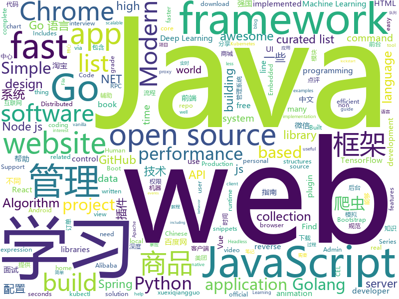

# 2019-03-17
See what the GitHub community is most excited about today.

## python
* [LARK](https://github.com/PaddlePaddle/LARK)(**252 stars today**): LAnguage Representations Kit
* [ChromeAppHeroes](https://github.com/zhaoolee/ChromeAppHeroes)(**97 stars today**): 🌈Chrome插件英雄榜, 为优秀的Chrome插件写一本中文说明书, 让Chrome插件英雄们造福人类~ ChromePluginHeroes, Write a Chinese manual for the excellent Chrome plugin, let the Chrome plugin heroes benefit the human~
* [awesome-python](https://github.com/vinta/awesome-python)(**70 stars today**): A curated list of awesome Python frameworks, libraries, software and resources
* [Algorithm_Interview_Notes-Chinese](https://github.com/imhuay/Algorithm_Interview_Notes-Chinese)(**61 stars today**): 2018/2019/校招/春招/秋招/算法/机器学习(Machine Learning)/深度学习(Deep Learning)/自然语言处理(NLP)/C/C++/Python/面试笔记
* [models](https://github.com/tensorflow/models)(**50 stars today**): Models and examples built with TensorFlow
* [awesome-python-login-model](https://github.com/CriseLYJ/awesome-python-login-model)(**55 stars today**): 😮python模拟登陆一些大型网站，还有一些简单的爬虫，希望对你们有所帮助❤️，如果喜欢记得给个star哦🌟
* [Python](https://github.com/TheAlgorithms/Python)(**49 stars today**): All Algorithms implemented in Python
* [examples-of-web-crawlers](https://github.com/shengqiangzhang/examples-of-web-crawlers)(**48 stars today**): python爬虫例子,对新手比较友好。淘宝模拟登录,淘宝商品爬虫,淘宝我已购买的宝贝爬虫,天猫商品爬虫,每天不同时间段通过微信发消息提醒女友,爬取5K分辨率超清唯美壁纸
* [pocsuite3](https://github.com/knownsec/pocsuite3)(**43 stars today**): pocsuite3 is an open-sourced remote vulnerability testing framework developed by the Knownsec 404 Team.
* [faceswap](https://github.com/deepfakes/faceswap)(**38 stars today**): Non official project based on original /r/Deepfakes thread. Many thanks to him!
* [stellargraph](https://github.com/stellargraph/stellargraph)(**45 stars today**): StellarGraph - Machine Learning on Graphs
* [email-enum](https://github.com/Frint0/email-enum)(**44 stars today**): Email-Enum searches mainstream websites and tells you if an email is registered!
* [ArchiveBox](https://github.com/pirate/ArchiveBox)(**45 stars today**): 🗃The open source self-hosted web archive. Takes browser history/bookmarks/Pocket/Pinboard/etc., saves HTML, JS, PDFs, media, and more...
* [youtube-dl](https://github.com/ytdl-org/youtube-dl)(**39 stars today**): Command-line program to download videos from YouTube.com and other video sites
* [sherlock](https://github.com/sherlock-project/sherlock)(**40 stars today**): 🔎Find usernames across social networks
* [system-design-primer](https://github.com/donnemartin/system-design-primer)(**33 stars today**): Learn how to design large-scale systems. Prep for the system design interview. Includes Anki flashcards.
* [public-apis](https://github.com/toddmotto/public-apis)(**34 stars today**): A collective list of free APIs for use in software and web development.
* [pytorch_geometric](https://github.com/rusty1s/pytorch_geometric)(**33 stars today**): Geometric Deep Learning Extension Library for PyTorch
* [PowerHub](https://github.com/AdrianVollmer/PowerHub)(**34 stars today**): A web application to transfer PowerShell modules, executables, snippets and files
* [CheatSheetSeries](https://github.com/OWASP/CheatSheetSeries)(**32 stars today**): The OWASP Cheat Sheet Series was created to provide a concise collection of high value information on specific application security topics.
* [keras](https://github.com/keras-team/keras)(**23 stars today**): Deep Learning for humans
* [face_recognition](https://github.com/ageitgey/face_recognition)(**26 stars today**): The world's simplest facial recognition api for Python and the command line
* [home-assistant](https://github.com/home-assistant/home-assistant)(**24 stars today**): 🏡Open source home automation that puts local control and privacy first
* [fastapi](https://github.com/tiangolo/fastapi)(**29 stars today**): FastAPI framework, high performance, easy to learn, fast to code, ready for production
* [cpython](https://github.com/python/cpython)(**21 stars today**): The Python programming language

## java
* [JavaGuide](https://github.com/Snailclimb/JavaGuide)(**126 stars today**): 【Java学习+面试指南】 一份涵盖大部分Java程序员所需要掌握的核心知识。
* [advanced-java](https://github.com/doocs/advanced-java)(**64 stars today**): 😮互联网 Java 工程师进阶知识完全扫盲
* [mall](https://github.com/macrozheng/mall)(**62 stars today**): mall项目是一套电商系统，包括前台商城系统及后台管理系统，基于SpringBoot+MyBatis实现。 前台商城系统包含首页门户、商品推荐、商品搜索、商品展示、购物车、订单流程、会员中心、客户服务、帮助中心等模块。 后台管理系统包含商品管理、订单管理、会员管理、促销管理、运营管理、内容管理、统计报表、财务管理、权限管理、设置等模块。
* [spring-boot-examples](https://github.com/ityouknow/spring-boot-examples)(**49 stars today**): about learning Spring Boot via examples. Spring Boot 教程、技术栈示例代码，快速简单上手教程。
* [chunked-coding-converter](https://github.com/c0ny1/chunked-coding-converter)(**44 stars today**): Burp suite 分块传输辅助插件
* [tutorials](https://github.com/eugenp/tutorials)(**26 stars today**): The "REST With Spring" Course:
* [sofa-jraft](https://github.com/alipay/sofa-jraft)(**31 stars today**): A production-grade java implementation of RAFT consensus algorithm.
* [spring-boot](https://github.com/spring-projects/spring-boot)(**28 stars today**): Spring Boot
* [Java](https://github.com/TheAlgorithms/Java)(**24 stars today**): All Algorithms implemented in Java
* [elasticsearch](https://github.com/elastic/elasticsearch)(**29 stars today**): Open Source, Distributed, RESTful Search Engine
* [spring-framework](https://github.com/spring-projects/spring-framework)(**24 stars today**): Spring Framework
* [fescar](https://github.com/alibaba/fescar)(**28 stars today**): 🔥Fescar is an easy-to-use, high-performance, java based, open source distributed transaction solution.
* [arthas](https://github.com/alibaba/arthas)(**27 stars today**): Alibaba Java Diagnostic Tool Arthas/Alibaba Java诊断利器Arthas
* [x7](https://github.com/x-ream/x7)(**20 stars today**): 
* [AndroidProjectCreator](https://github.com/ThisIsLibra/AndroidProjectCreator)(**27 stars today**): Convert an APK to an Android Studio Project using multiple open-source decompilers
* [interviews](https://github.com/kdn251/interviews)(**25 stars today**): Everything you need to know to get the job.
* [JCSprout](https://github.com/crossoverJie/JCSprout)(**20 stars today**): 👨‍🎓Java Core Sprout : basic, concurrent, algorithm
* [JGrowing](https://github.com/javagrowing/JGrowing)(**22 stars today**): Java is Growing up but not only Java。Java成长路线，但学到不仅仅是Java。
* [incubator-dubbo](https://github.com/apache/incubator-dubbo)(**16 stars today**): Apache Dubbo (incubating) is a high-performance, java based, open source RPC framework.
* [guava](https://github.com/google/guava)(**17 stars today**): Google core libraries for Java
* [apollo](https://github.com/ctripcorp/apollo)(**15 stars today**): Apollo（阿波罗）是携程框架部门研发的分布式配置中心，能够集中化管理应用不同环境、不同集群的配置，配置修改后能够实时推送到应用端，并且具备规范的权限、流程治理等特性，适用于微服务配置管理场景。
* [quarkus](https://github.com/quarkusio/quarkus)(**19 stars today**): Quarkus: Supersonic Subatomic Java.
* [cat](https://github.com/dianping/cat)(**17 stars today**): CAT 作为服务端项目基础组件，提供了 Java, C/C++, Node.js, Python, Go 等多语言客户端，已经在美团点评的基础架构中间件框架（MVC框架，RPC框架，数据库框架，缓存框架等，消息队列，配置系统等）深度集成，为美团点评各业务线提供系统丰富的性能指标、健康状况、实时告警等。
* [EdXposed](https://github.com/ElderDrivers/EdXposed)(**17 stars today**): Elder driver Xposed Framework.
* [MPAndroidChart](https://github.com/PhilJay/MPAndroidChart)(**16 stars today**): A powerful🚀Android chart view / graph view library, supporting line- bar- pie- radar- bubble- and candlestick charts as well as scaling, dragging and animations.

## unknown
* [js-dev-reads](https://github.com/twhite96/js-dev-reads)(**313 stars today**): A list of books📚and articles📝for the discerning web developer to read.
* [Machine-Learning-Study-Path-March-2019](https://github.com/clone95/Machine-Learning-Study-Path-March-2019)(**206 stars today**): A complete ML study path, focused on TensorFlow and Scikit-Learn
* [V](https://github.com/vlang-io/V)(**167 stars today**): Simple, fast, safe, compiled language for creating maintainable software. Supports translation from C/C++.
* [ghidra](https://github.com/NationalSecurityAgency/ghidra)(**124 stars today**): Ghidra is a software reverse engineering (SRE) framework
* [awesome-personal-blogs](https://github.com/jkup/awesome-personal-blogs)(**96 stars today**): A delightful list of personal tech blogs
* [CS-Notes](https://github.com/CyC2018/CS-Notes)(**78 stars today**): 😋技术面试必备基础知识
* [gitignore](https://github.com/github/gitignore)(**49 stars today**): A collection of useful .gitignore templates
* [developer-roadmap](https://github.com/kamranahmedse/developer-roadmap)(**63 stars today**): Roadmap to becoming a web developer in 2019
* [awesome](https://github.com/sindresorhus/awesome)(**63 stars today**): 😎Awesome lists about all kinds of interesting topics
* [go-perfbook](https://github.com/dgryski/go-perfbook)(**61 stars today**): Thoughts on Go performance optimization
* [You-Dont-Know-JS](https://github.com/getify/You-Dont-Know-JS)(**51 stars today**): A book series on JavaScript. @YDKJS on twitter.
* [app-ideas](https://github.com/florinpop17/app-ideas)(**54 stars today**): A Collection of application ideas which can be used to improve your coding skills.
* [Go42](https://github.com/ffhelicopter/Go42)(**48 stars today**): 写《Go语言四十二章经》，纯粹是因为开发过程中碰到过的一些问题，踩到过的一些坑，感觉在Go语言学习使用过程中，有必要深刻理解这门语言的核心思维、清晰掌握语言的细节规范以及反复琢磨标准包代码设计模式，于是才有了这本书。
* [free-programming-books](https://github.com/EbookFoundation/free-programming-books)(**37 stars today**): 📚Freely available programming books
* [Micro8](https://github.com/Micropoor/Micro8)(**35 stars today**): Gitbook
* [build-your-own-x](https://github.com/danistefanovic/build-your-own-x)(**39 stars today**): 🤓Build your own (insert technology here)
* [Awesome-Design-Tools](https://github.com/LisaDziuba/Awesome-Design-Tools)(**38 stars today**): The best design tools for everything.
* [awesome-podcasts](https://github.com/rShetty/awesome-podcasts)(**37 stars today**): Collection of awesome podcasts
* [hosts](https://github.com/googlehosts/hosts)(**32 stars today**): 镜像：https://coding.net/u/scaffrey/p/hosts/git
* [algorithm](https://github.com/hollischuang/algorithm)(**33 stars today**): 
* [mml-book.github.io](https://github.com/mml-book/mml-book.github.io)(**29 stars today**): Companion webpage to the book "Mathematics For Machine Learning"
* [awesome-vue](https://github.com/vuejs/awesome-vue)(**28 stars today**): 🎉A curated list of awesome things related to Vue.js
* [How-To-Secure-A-Linux-Server](https://github.com/imthenachoman/How-To-Secure-A-Linux-Server)(**29 stars today**): An evolving how-to guide for securing a Linux server.
* [time-as-a-friend](https://github.com/xiaolai/time-as-a-friend)(**19 stars today**): 《把时间当作朋友》

## javascript
* [laxxx](https://github.com/alexfoxy/laxxx)(**257 stars today**): Simple & light weight (2kb minified & zipped) vanilla javascript plugin to create smooth & beautiful animations when you scrolllll! Harness the power of the most intuitive interaction and make your websites come alive!
* [send](https://github.com/mozilla/send)(**162 stars today**): Simple, private file sharing from the makers of Firefox
* [wechat-format](https://github.com/lyricat/wechat-format)(**121 stars today**): 微信公众号排版编辑器，转化 Markdown 微信特制的 HTML
* [vue](https://github.com/vuejs/vue)(**93 stars today**): 🖖Vue.js is a progressive, incrementally-adoptable JavaScript framework for building UI on the web.
* [nsfwjs](https://github.com/infinitered/nsfwjs)(**74 stars today**): NSFW detection on the client-side via Tensorflow JS
* [react](https://github.com/facebook/react)(**63 stars today**): A declarative, efficient, and flexible JavaScript library for building user interfaces.
* [awesome-blockchain](https://github.com/yjjnls/awesome-blockchain)(**43 stars today**): ⚡️Curated list of resources for the development and applications of block chain.
* [Motrix](https://github.com/agalwood/Motrix)(**47 stars today**): A full-featured download manager.
* [javascript-algorithms](https://github.com/trekhleb/javascript-algorithms)(**44 stars today**): 📝Algorithms and data structures implemented in JavaScript with explanations and links to further readings
* [30-seconds-of-code](https://github.com/30-seconds/30-seconds-of-code)(**43 stars today**): A curated collection of useful JavaScript snippets that you can understand in 30 seconds or less.
* [three.js](https://github.com/mrdoob/three.js)(**39 stars today**): JavaScript 3D library.
* [gatsby](https://github.com/gatsbyjs/gatsby)(**40 stars today**): Build blazing fast, modern apps and websites with React
* [create-react-app](https://github.com/facebook/create-react-app)(**38 stars today**): Set up a modern web app by running one command.
* [axios](https://github.com/axios/axios)(**40 stars today**): Promise based HTTP client for the browser and node.js
* [strapi](https://github.com/strapi/strapi)(**37 stars today**): 🚀Open source Node.js Headless CMS to easily build customisable APIs
* [javascript](https://github.com/airbnb/javascript)(**38 stars today**): JavaScript Style Guide
* [baiduyun](https://github.com/syhyz1990/baiduyun)(**38 stars today**): 油猴脚本 直接下载百度网盘和百度网盘分享的文件,直链下载超级加速
* [puppeteer](https://github.com/GoogleChrome/puppeteer)(**38 stars today**): Headless Chrome Node API
* [nuxt.js](https://github.com/nuxt/nuxt.js)(**37 stars today**): The Vue.js Framework
* [anime](https://github.com/juliangarnier/anime)(**34 stars today**): JavaScript animation engine
* [next.js](https://github.com/zeit/next.js)(**30 stars today**): The React Framework
* [graphql-engine](https://github.com/hasura/graphql-engine)(**30 stars today**): Blazing fast, instant realtime GraphQL APIs on Postgres with fine grained access control, also trigger webhooks on database events.
* [react-native](https://github.com/facebook/react-native)(**28 stars today**): A framework for building native apps with React.
* [node](https://github.com/nodejs/node)(**26 stars today**): Node.js JavaScript runtime✨🐢🚀✨
* [material-ui](https://github.com/mui-org/material-ui)(**24 stars today**): React components for faster and easier web development. Build your own design system, or start with Material Design.

## html
* [personal-website](https://github.com/github/personal-website)(**32 stars today**): Code that'll help you kickstart a personal website that showcases your work as a software developer.
* [frontendDaily](https://github.com/kujian/frontendDaily)(**38 stars today**): 前端开发技术日报，每日分享互联网最精彩的前端技术、前端资讯、后端编程、设计和资源等，欢迎关注Watch
* [lets-get-arrested](https://github.com/hamukazu/lets-get-arrested)(**27 stars today**): This project is intended to protest against the police in Japan
* [Panda-Learning](https://github.com/Alivon/Panda-Learning)(**27 stars today**): 学习强国xuexiqiangguo--熊猫学习Panda-Learning是一个辅助学习 学习强国的程序,帮助挤不出时间，却仍然需要学习的积极分子，学习强国(xuexiqiangguo)
* [Coursera-ML-AndrewNg-Notes](https://github.com/fengdu78/Coursera-ML-AndrewNg-Notes)(**19 stars today**): 吴恩达老师的机器学习课程个人笔记
* [JavaScript30](https://github.com/wesbos/JavaScript30)(**11 stars today**): 30 Day Vanilla JS Challenge
* [TranslatorX](https://github.com/pingfangx/TranslatorX)(**13 stars today**): JetBrains 系列软件汉化包
* [github](https://github.com/phodal/github)(**13 stars today**): GitHub 漫游指南- a Chinese ebook on how to build a good project on Github. Explore the users' behavior. Find some thing interest.
* [javascript-tutorial-en](https://github.com/iliakan/javascript-tutorial-en)(**11 stars today**): Modern JavaScript Tutorial
* [Minicurso-de-git-e-Github](https://github.com/allythy/Minicurso-de-git-e-Github)(**6 stars today**): Site para os participantes do minicurso de Git e GitHub contribuirem
* [Front-end-Developer-Interview-Questions](https://github.com/h5bp/Front-end-Developer-Interview-Questions)(**9 stars today**): A list of helpful front-end related questions you can use to interview potential candidates, test yourself or completely ignore.
* [AdminLTE](https://github.com/almasaeed2010/AdminLTE)(**8 stars today**): AdminLTE - Free Premium Admin control Panel Theme Based On Bootstrap 3.x
* [qiubaiying.github.io](https://github.com/qiubaiying/qiubaiying.github.io)(**5 stars today**): BY Blog ->
* [free-for-dev](https://github.com/ripienaar/free-for-dev)(**9 stars today**): A list of SaaS, PaaS and IaaS offerings that have free tiers of interest to devops and infradev
* [SuperTinyIcons](https://github.com/edent/SuperTinyIcons)(**8 stars today**): Under 1KB each! Super Tiny Icons are miniscule SVG versions of your favourite website and app logos
* [Spoon-Knife](https://github.com/octocat/Spoon-Knife)(****): This repo is for demonstration purposes only.
* [portainer](https://github.com/portainer/portainer)(**8 stars today**): Simple management UI for Docker
* [WebFundamentals](https://github.com/google/WebFundamentals)(**8 stars today**): Best practices for modern web development
* [dotnet](https://github.com/Microsoft/dotnet)(**7 stars today**): This repo is the official home of .NET on GitHub. It's a great starting point to find many .NET OSS projects from Microsoft and the community, including many that are part of the .NET Foundation.
* [javascript-tutorial-zh](https://github.com/xitu/javascript-tutorial-zh)(**6 stars today**): Modern JavaScript Tutorial
* [stisla](https://github.com/stisla/stisla)(**7 stars today**): Free Bootstrap Admin Template
* [webKnowledge](https://github.com/huyaocode/webKnowledge)(**6 stars today**): 前端知识点总结
* [requests-html](https://github.com/kennethreitz/requests-html)(**7 stars today**): Pythonic HTML Parsing for Humans™
* [flutter-in-action](https://github.com/flutterchina/flutter-in-action)(**7 stars today**): 《Flutter实战》电子书
* [devops-essentials-sample-app](https://github.com/linuxacademy/devops-essentials-sample-app)(****): 

## go
* [server](https://github.com/gotify/server)(**70 stars today**): A simple server for sending and receiving messages in real-time per WebSocket. (Includes a sleek web-ui)
* [slim](https://github.com/openacid/slim)(**66 stars today**): Unbelievably space efficient data structures in Golang.
* [bigqueue](https://github.com/grandecola/bigqueue)(**45 stars today**): Embedded, Fast and Persistent bigqueue implementation
* [go](https://github.com/golang/go)(**40 stars today**): The Go programming language
* [awesome-go](https://github.com/avelino/awesome-go)(**40 stars today**): A curated list of awesome Go frameworks, libraries and software
* [awesome-golang-leetcode](https://github.com/kylesliu/awesome-golang-leetcode)(**35 stars today**): 📝LeetCode of algorithms with golang solution(updating).
* [kubernetes](https://github.com/kubernetes/kubernetes)(**32 stars today**): Production-Grade Container Scheduling and Management
* [k3s](https://github.com/rancher/k3s)(**30 stars today**): Lightweight Kubernetes. 5 less than k8s.
* [submariner](https://github.com/rancher/submariner)(**28 stars today**): Connect all your Kubernetes clusters, no matter where they are in the world.
* [weaver](https://github.com/gojektech/weaver)(**28 stars today**): An Advanced HTTP Reverse Proxy with Dynamic Sharding Strategies
* [frp](https://github.com/fatedier/frp)(**25 stars today**): A fast reverse proxy to help you expose a local server behind a NAT or firewall to the internet.
* [yggdrasil-go](https://github.com/yggdrasil-network/yggdrasil-go)(**28 stars today**): An experiment in scalable routing as an encrypted IPv6 overlay network
* [tubekit](https://github.com/reconquest/tubekit)(**27 stars today**): 🧪 kubectl alternative with quick context switching, kubectl on steroids
* [gin](https://github.com/gin-gonic/gin)(**25 stars today**): Gin is a HTTP web framework written in Go (Golang). It features a Martini-like API with much better performance -- up to 40 times faster. If you need smashing performance, get yourself some Gin.
* [traefik](https://github.com/containous/traefik)(**26 stars today**): The Cloud Native Edge Router
* [hugo](https://github.com/gohugoio/hugo)(**25 stars today**): The world’s fastest framework for building websites.
* [tracerr](https://github.com/ztrue/tracerr)(**26 stars today**): Golang errors with stack trace and source fragments.
* [BaiduPCS-Go](https://github.com/iikira/BaiduPCS-Go)(**24 stars today**): 百度网盘客户端 - Go语言编写
* [the-way-to-go_ZH_CN](https://github.com/Unknwon/the-way-to-go_ZH_CN)(**24 stars today**): 《The Way to Go》中文译本，中文正式名《Go 入门指南》
* [kaf](https://github.com/infinimesh/kaf)(**22 stars today**): Modern CLI for Apache Kafka, written in Go.
* [kraken](https://github.com/uber/kraken)(**21 stars today**): P2P Docker registry capable of distributing TBs of data in seconds
* [Beaver](https://github.com/Clivern/Beaver)(**21 stars today**): 💨A real time messaging server to build a scalable in-app notifications, multiplayer games, chat apps in web and mobile apps.
* [cel-go](https://github.com/google/cel-go)(**21 stars today**): The Go implementation of the Common Expression Language (CEL). CEL is a non-Turing complete language designed to be portable and fast. It is well suited to embedded applications expression evaluation with familiar syntax and features, protocol buffer support, and not needing the sandboxing needed for a runtime like JavaScript or Lua.
* [fathom](https://github.com/usefathom/fathom)(**20 stars today**): Fathom. Simple, trustworthy website analytics. Built with Golang & Preact.
* [syncthing](https://github.com/syncthing/syncthing)(**18 stars today**): Open Source Continuous File Synchronization

## WordCloud

