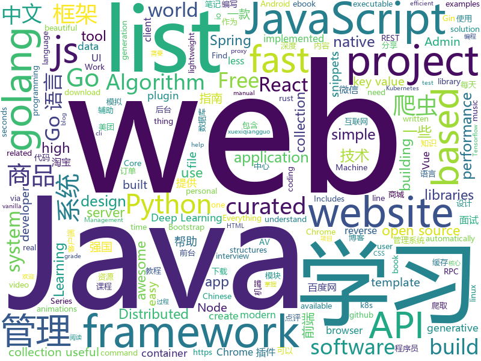

# 2019-03-18
See what the GitHub community is most excited about today.

## python
* [LARK](https://github.com/PaddlePaddle/LARK)(**133 stars today**): LAnguage Representations Kit
* [ChromeAppHeroes](https://github.com/zhaoolee/ChromeAppHeroes)(**107 stars today**): 🌈Chrome插件英雄榜, 为优秀的Chrome插件写一本中文说明书, 让Chrome插件英雄们造福人类~ ChromePluginHeroes, Write a Chinese manual for the excellent Chrome plugin, let the Chrome plugin heroes benefit the human~
* [Algorithm_Interview_Notes-Chinese](https://github.com/imhuay/Algorithm_Interview_Notes-Chinese)(**74 stars today**): 2018/2019/校招/春招/秋招/算法/机器学习(Machine Learning)/深度学习(Deep Learning)/自然语言处理(NLP)/C/C++/Python/面试笔记
* [models](https://github.com/tensorflow/models)(**59 stars today**): Models and examples built with TensorFlow
* [awesome-python](https://github.com/vinta/awesome-python)(**57 stars today**): A curated list of awesome Python frameworks, libraries, software and resources
* [faceswap](https://github.com/deepfakes/faceswap)(**46 stars today**): Non official project based on original /r/Deepfakes thread. Many thanks to him!
* [Python](https://github.com/TheAlgorithms/Python)(**41 stars today**): All Algorithms implemented in Python
* [USTC-Course](https://github.com/USTC-Resource/USTC-Course)(**41 stars today**): ❤️中国科学技术大学课程资源
* [system-design-primer](https://github.com/donnemartin/system-design-primer)(**43 stars today**): Learn how to design large-scale systems. Prep for the system design interview. Includes Anki flashcards.
* [PowerHub](https://github.com/AdrianVollmer/PowerHub)(**47 stars today**): A web application to transfer PowerShell modules, executables, snippets and files while bypassing AV and application whitelisting
* [examples-of-web-crawlers](https://github.com/shengqiangzhang/examples-of-web-crawlers)(**42 stars today**): python爬虫例子,对新手比较友好。淘宝模拟登录,淘宝商品爬虫,淘宝我已购买的宝贝爬虫,天猫商品爬虫,每天不同时间段通过微信发消息提醒女友,爬取5K分辨率超清唯美壁纸,爬取豆瓣排行榜电影数据(含GUI界面版)
* [public-apis](https://github.com/toddmotto/public-apis)(**45 stars today**): A collective list of free APIs for use in software and web development.
* [awesome-python-login-model](https://github.com/CriseLYJ/awesome-python-login-model)(**44 stars today**): 😮python模拟登陆一些大型网站，还有一些简单的爬虫，希望对你们有所帮助❤️，如果喜欢记得给个star哦🌟
* [linux-insides](https://github.com/0xAX/linux-insides)(**44 stars today**): A little bit about a linux kernel
* [CarbonCopy](https://github.com/paranoidninja/CarbonCopy)(**39 stars today**): A tool which creates a spoofed certificate of any online website and signs an Executable for AV Evasion. Works for both Windows and Linux
* [DeOldify](https://github.com/jantic/DeOldify)(**40 stars today**): A Deep Learning based project for colorizing and restoring old images
* [youtube-dl](https://github.com/ytdl-org/youtube-dl)(**38 stars today**): Command-line program to download videos from YouTube.com and other video sites
* [ArchiveBox](https://github.com/pirate/ArchiveBox)(**40 stars today**): 🗃The open source self-hosted web archive. Takes browser history/bookmarks/Pocket/Pinboard/etc., saves HTML, JS, PDFs, media, and more...
* [keras](https://github.com/keras-team/keras)(**31 stars today**): Deep Learning for humans
* [stellargraph](https://github.com/stellargraph/stellargraph)(**33 stars today**): StellarGraph - Machine Learning on Graphs
* [scrapy](https://github.com/scrapy/scrapy)(**32 stars today**): Scrapy, a fast high-level web crawling & scraping framework for Python.
* [CheatSheetSeries](https://github.com/OWASP/CheatSheetSeries)(**31 stars today**): The OWASP Cheat Sheet Series was created to provide a concise collection of high value information on specific application security topics.
* [face_recognition](https://github.com/ageitgey/face_recognition)(**26 stars today**): The world's simplest facial recognition api for Python and the command line
* [sherlock](https://github.com/sherlock-project/sherlock)(**29 stars today**): 🔎Find usernames across social networks
* [django](https://github.com/django/django)(**24 stars today**): The Web framework for perfectionists with deadlines.

## java
* [JavaGuide](https://github.com/Snailclimb/JavaGuide)(**140 stars today**): 【Java学习+面试指南】 一份涵盖大部分Java程序员所需要掌握的核心知识。
* [mall](https://github.com/macrozheng/mall)(**77 stars today**): mall项目是一套电商系统，包括前台商城系统及后台管理系统，基于SpringBoot+MyBatis实现。 前台商城系统包含首页门户、商品推荐、商品搜索、商品展示、购物车、订单流程、会员中心、客户服务、帮助中心等模块。 后台管理系统包含商品管理、订单管理、会员管理、促销管理、运营管理、内容管理、统计报表、财务管理、权限管理、设置等模块。
* [advanced-java](https://github.com/doocs/advanced-java)(**62 stars today**): 😮互联网 Java 工程师进阶知识完全扫盲
* [spring-boot-examples](https://github.com/ityouknow/spring-boot-examples)(**56 stars today**): about learning Spring Boot via examples. Spring Boot 教程、技术栈示例代码，快速简单上手教程。
* [tutorials](https://github.com/eugenp/tutorials)(**33 stars today**): The "REST With Spring" Course:
* [light-4j](https://github.com/networknt/light-4j)(**44 stars today**): A fast, lightweight and more productive microservices framework
* [spring-boot](https://github.com/spring-projects/spring-boot)(**37 stars today**): Spring Boot
* [elasticsearch](https://github.com/elastic/elasticsearch)(**26 stars today**): Open Source, Distributed, RESTful Search Engine
* [fescar](https://github.com/alibaba/fescar)(**29 stars today**): 🔥Fescar is an easy-to-use, high-performance, java based, open source distributed transaction solution.
* [interviews](https://github.com/kdn251/interviews)(**27 stars today**): Everything you need to know to get the job.
* [spring-framework](https://github.com/spring-projects/spring-framework)(**21 stars today**): Spring Framework
* [guava](https://github.com/google/guava)(**23 stars today**): Google core libraries for Java
* [chunked-coding-converter](https://github.com/c0ny1/chunked-coding-converter)(**25 stars today**): Burp suite 分块传输辅助插件
* [cat](https://github.com/dianping/cat)(**22 stars today**): CAT 作为服务端项目基础组件，提供了 Java, C/C++, Node.js, Python, Go 等多语言客户端，已经在美团点评的基础架构中间件框架（MVC框架，RPC框架，数据库框架，缓存框架等，消息队列，配置系统等）深度集成，为美团点评各业务线提供系统丰富的性能指标、健康状况、实时告警等。
* [sofa-jraft](https://github.com/alipay/sofa-jraft)(**22 stars today**): A production-grade java implementation of RAFT consensus algorithm.
* [Magisk](https://github.com/topjohnwu/Magisk)(**21 stars today**): A Magic Mask to Alter Android System Systemless-ly
* [incubator-dubbo](https://github.com/apache/incubator-dubbo)(**15 stars today**): Apache Dubbo (incubating) is a high-performance, java based, open source RPC framework.
* [solo](https://github.com/b3log/solo)(**20 stars today**): 🎸一款小而美的博客系统，专为程序员设计。https://hacpai.com/tag/solo
* [lottie-android](https://github.com/airbnb/lottie-android)(**19 stars today**): Render After Effects animations natively on Android and iOS, Web, and React Native
* [openapi-generator](https://github.com/OpenAPITools/openapi-generator)(**18 stars today**): OpenAPI Generator allows generation of API client libraries (SDK generation), server stubs, documentation and configuration automatically given an OpenAPI Spec (v2, v3)
* [JCSprout](https://github.com/crossoverJie/JCSprout)(**16 stars today**): 👨‍🎓Java Core Sprout : basic, concurrent, algorithm
* [arthas](https://github.com/alibaba/arthas)(**16 stars today**): Alibaba Java Diagnostic Tool Arthas/Alibaba Java诊断利器Arthas
* [Java](https://github.com/TheAlgorithms/Java)(**14 stars today**): All Algorithms implemented in Java
* [MyBookshelf](https://github.com/gedoor/MyBookshelf)(**16 stars today**): 阅读是一款可以自定义来源阅读网络内容的工具，为广大网络文学爱好者提供一种方便、快捷舒适的试读体验。
* [quarkus](https://github.com/quarkusio/quarkus)(**13 stars today**): Quarkus: Supersonic Subatomic Java.

## unknown
* [js-dev-reads](https://github.com/twhite96/js-dev-reads)(**331 stars today**): A list of books📚and articles📝for the discerning web developer to read.
* [Machine-Learning-Study-Path-March-2019](https://github.com/clone95/Machine-Learning-Study-Path-March-2019)(**271 stars today**): A complete ML study path, focused on TensorFlow and Scikit-Learn
* [V](https://github.com/vlang-io/V)(**138 stars today**): Simple, fast, safe, compiled language for creating maintainable software. Supports translation from C/C++.
* [CS-Notes](https://github.com/CyC2018/CS-Notes)(**98 stars today**): 😋技术面试必备基础知识
* [ghidra](https://github.com/NationalSecurityAgency/ghidra)(**104 stars today**): Ghidra is a software reverse engineering (SRE) framework
* [developer-roadmap](https://github.com/kamranahmedse/developer-roadmap)(**72 stars today**): Roadmap to becoming a web developer in 2019
* [awesome-personal-blogs](https://github.com/jkup/awesome-personal-blogs)(**76 stars today**): A delightful list of personal tech blogs
* [gitignore](https://github.com/github/gitignore)(**45 stars today**): A collection of useful .gitignore templates
* [awesome](https://github.com/sindresorhus/awesome)(**51 stars today**): 😎Awesome lists about all kinds of interesting topics
* [You-Dont-Know-JS](https://github.com/getify/You-Dont-Know-JS)(**45 stars today**): A book series on JavaScript. @YDKJS on twitter.
* [free-programming-books-zh_CN](https://github.com/justjavac/free-programming-books-zh_CN)(**42 stars today**): 📚免费的计算机编程类中文书籍，欢迎投稿
* [Micro8](https://github.com/Micropoor/Micro8)(**37 stars today**): Gitbook
* [build-your-own-x](https://github.com/danistefanovic/build-your-own-x)(**42 stars today**): 🤓Build your own (insert technology here)
* [Awesome-Design-Tools](https://github.com/LisaDziuba/Awesome-Design-Tools)(**40 stars today**): The best design tools for everything.
* [hosts](https://github.com/googlehosts/hosts)(**34 stars today**): 镜像：https://coding.net/u/scaffrey/p/hosts/git
* [free-programming-books](https://github.com/EbookFoundation/free-programming-books)(**36 stars today**): 📚Freely available programming books
* [app-ideas](https://github.com/florinpop17/app-ideas)(**37 stars today**): A Collection of application ideas which can be used to improve your coding skills.
* [Go42](https://github.com/ffhelicopter/Go42)(**36 stars today**): 写《Go语言四十二章经》，纯粹是因为开发过程中碰到过的一些问题，踩到过的一些坑，感觉在Go语言学习使用过程中，有必要深刻理解这门语言的核心思维、清晰掌握语言的细节规范以及反复琢磨标准包代码设计模式，于是才有了这本书。
* [the-book-of-secret-knowledge](https://github.com/trimstray/the-book-of-secret-knowledge)(**32 stars today**): A collection of inspiring lists, manuals, cheatsheets, blogs, hacks, one-liners, cli/web tools and more.
* [Daily-Interview-Question](https://github.com/Advanced-Frontend/Daily-Interview-Question)(**32 stars today**): 工作日每天一道前端大厂面试题，祝大家天天进步，一年后会看到不一样的自己。
* [trackerslist](https://github.com/ngosang/trackerslist)(**30 stars today**): An updated list of public BitTorrent trackers
* [best-chinese-front-end-blogs](https://github.com/FrankFang/best-chinese-front-end-blogs)(**30 stars today**): 收集优质的中文前端博客
* [awesome-vue](https://github.com/vuejs/awesome-vue)(**29 stars today**): 🎉A curated list of awesome things related to Vue.js
* [How-To-Secure-A-Linux-Server](https://github.com/imthenachoman/How-To-Secure-A-Linux-Server)(**29 stars today**): An evolving how-to guide for securing a Linux server.

## javascript
* [generative.fm](https://github.com/generative-music/generative.fm)(**340 stars today**): A platform for playing generative music in the browser.
* [laxxx](https://github.com/alexfoxy/laxxx)(**289 stars today**): Simple & light weight (2kb minified & zipped) vanilla javascript plugin to create smooth & beautiful animations when you scrolllll! Harness the power of the most intuitive interaction and make your websites come alive!
* [wechat-format](https://github.com/lyricat/wechat-format)(**161 stars today**): 微信公众号排版编辑器，转化 Markdown 微信特制的 HTML
* [send](https://github.com/mozilla/send)(**148 stars today**): Simple, private file sharing from the makers of Firefox
* [vue](https://github.com/vuejs/vue)(**95 stars today**): 🖖Vue.js is a progressive, incrementally-adoptable JavaScript framework for building UI on the web.
* [react](https://github.com/facebook/react)(**59 stars today**): A declarative, efficient, and flexible JavaScript library for building user interfaces.
* [nsfwjs](https://github.com/infinitered/nsfwjs)(**55 stars today**): NSFW detection on the client-side via Tensorflow JS
* [baiduyun](https://github.com/syhyz1990/baiduyun)(**53 stars today**): 油猴脚本 直接下载百度网盘和百度网盘分享的文件,直链下载超级加速
* [p-lazy](https://github.com/sindresorhus/p-lazy)(**48 stars today**): Create a lazy promise that defers execution until it's awaited or when .then() or .catch() is called
* [gatsby](https://github.com/gatsbyjs/gatsby)(**39 stars today**): Build blazing fast, modern apps and websites with React
* [node](https://github.com/nodejs/node)(**39 stars today**): Node.js JavaScript runtime✨🐢🚀✨
* [pieces-alex-bainter](https://github.com/generative-music/pieces-alex-bainter)(**41 stars today**): A collection of generative music pieces for generative.fm
* [javascript-algorithms](https://github.com/trekhleb/javascript-algorithms)(**39 stars today**): 📝Algorithms and data structures implemented in JavaScript with explanations and links to further readings
* [javascript](https://github.com/airbnb/javascript)(**39 stars today**): JavaScript Style Guide
* [create-react-app](https://github.com/facebook/create-react-app)(**36 stars today**): Set up a modern web app by running one command.
* [bootstrap](https://github.com/twbs/bootstrap)(**28 stars today**): The most popular HTML, CSS, and JavaScript framework for developing responsive, mobile first projects on the web.
* [Motrix](https://github.com/agalwood/Motrix)(**37 stars today**): A full-featured download manager.
* [async-retry](https://github.com/zeit/async-retry)(**37 stars today**): Retrying made simple, easy and async
* [axios](https://github.com/axios/axios)(**33 stars today**): Promise based HTTP client for the browser and node.js
* [30-seconds-of-code](https://github.com/30-seconds/30-seconds-of-code)(**31 stars today**): A curated collection of useful JavaScript snippets that you can understand in 30 seconds or less.
* [storybook](https://github.com/storybooks/storybook)(**34 stars today**): UI component dev & test: React, Vue, Angular, React Native, Ember & more!
* [react-native](https://github.com/facebook/react-native)(**32 stars today**): A framework for building native apps with React.
* [kanye.rest](https://github.com/ajzbc/kanye.rest)(**31 stars today**): 🌊A free REST API for random Kanye West quotes
* [strapi](https://github.com/strapi/strapi)(**31 stars today**): 🚀Open source Node.js Headless CMS to easily build customisable APIs
* [three.js](https://github.com/mrdoob/three.js)(**24 stars today**): JavaScript 3D library.

## html
* [Unifiedtransform](https://github.com/changeweb/Unifiedtransform)(**73 stars today**): A school management Software
* [personal-website](https://github.com/github/personal-website)(**26 stars today**): Code that'll help you kickstart a personal website that showcases your work as a software developer.
* [lets-get-arrested](https://github.com/hamukazu/lets-get-arrested)(**31 stars today**): This project is intended to protest against the police in Japan
* [frontendDaily](https://github.com/kujian/frontendDaily)(**32 stars today**): 前端开发技术日报，每日分享互联网最精彩的前端技术、前端资讯、后端编程、设计和资源等，欢迎关注Watch
* [rust-cookbook](https://github.com/rust-lang-nursery/rust-cookbook)(**27 stars today**): https://rust-lang-nursery.github.io/rust-cookbook
* [Panda-Learning](https://github.com/Alivon/Panda-Learning)(**19 stars today**): 学习强国xuexiqiangguo--熊猫学习Panda-Learning是一个辅助学习 学习强国的程序,帮助挤不出时间，却仍然需要学习的积极分子，学习强国(xuexiqiangguo)
* [javascript-tutorial-en](https://github.com/iliakan/javascript-tutorial-en)(**18 stars today**): Modern JavaScript Tutorial
* [qiubaiying.github.io](https://github.com/qiubaiying/qiubaiying.github.io)(**6 stars today**): BY Blog ->
* [awesome-bulma-templates](https://github.com/aldi/awesome-bulma-templates)(**10 stars today**): 🚀Free real-world templates built with Bulma
* [github](https://github.com/phodal/github)(**13 stars today**): GitHub 漫游指南- a Chinese ebook on how to build a good project on Github. Explore the users' behavior. Find some thing interest.
* [Spoon-Knife](https://github.com/octocat/Spoon-Knife)(****): This repo is for demonstration purposes only.
* [JavaScript30](https://github.com/wesbos/JavaScript30)(**7 stars today**): 30 Day Vanilla JS Challenge
* [Coursera-ML-AndrewNg-Notes](https://github.com/fengdu78/Coursera-ML-AndrewNg-Notes)(**10 stars today**): 吴恩达老师的机器学习课程个人笔记
* [devops-essentials-sample-app](https://github.com/linuxacademy/devops-essentials-sample-app)(****): 
* [stisla](https://github.com/stisla/stisla)(**11 stars today**): Free Bootstrap Admin Template
* [Front-end-Developer-Interview-Questions](https://github.com/h5bp/Front-end-Developer-Interview-Questions)(**10 stars today**): A list of helpful front-end related questions you can use to interview potential candidates, test yourself or completely ignore.
* [AdminLTE](https://github.com/almasaeed2010/AdminLTE)(**7 stars today**): AdminLTE - Free Premium Admin control Panel Theme Based On Bootstrap 3.x
* [30-seconds-of-css](https://github.com/30-seconds/30-seconds-of-css)(**10 stars today**): A curated collection of useful CSS snippets you can understand in 30 seconds or less.
* [flutter-in-action](https://github.com/flutterchina/flutter-in-action)(**9 stars today**): 《Flutter实战》电子书
* [Adminator-admin-dashboard](https://github.com/puikinsh/Adminator-admin-dashboard)(**7 stars today**): Adminator is a easy to use and well design admin dashboard template for web apps, websites, services and more
* [javascript-tutorial-zh](https://github.com/xitu/javascript-tutorial-zh)(**7 stars today**): Modern JavaScript Tutorial
* [hugo-academic](https://github.com/gcushen/hugo-academic)(**6 stars today**): The website builder for Hugo. Build and deploy a beautiful website in minutes🚀
* [now-github-starter](https://github.com/zeit/now-github-starter)(****): Starter project to demonstrate a project whose pull requests get automatically deployed
* [fonts](https://github.com/google/fonts)(**8 stars today**): Font files available from Google Fonts
* [kv-storage](https://github.com/WICG/kv-storage)(**8 stars today**): A proposal for an async key/value storage API for the web

## go
* [kaf](https://github.com/infinimesh/kaf)(**105 stars today**): Modern CLI for Apache Kafka, written in Go.
* [server](https://github.com/gotify/server)(**72 stars today**): A simple server for sending and receiving messages in real-time per WebSocket. (Includes a sleek web-ui)
* [awesome-go](https://github.com/avelino/awesome-go)(**43 stars today**): A curated list of awesome Go frameworks, libraries and software
* [go](https://github.com/golang/go)(**41 stars today**): The Go programming language
* [frp](https://github.com/fatedier/frp)(**36 stars today**): A fast reverse proxy to help you expose a local server behind a NAT or firewall to the internet.
* [AUXPI](https://github.com/aimerforreimu/AUXPI)(**34 stars today**): 🍭集合多家 API 的新一代图床
* [k3s](https://github.com/rancher/k3s)(**34 stars today**): Lightweight Kubernetes. 5 less than k8s.
* [owlcache](https://github.com/xssed/owlcache)(**29 stars today**): 🦉Owlcache 是一款由Golang编写的轻量级、高性能、无中心分布式的Key/Value内存缓存型的数据共享应用(一定场景下可以作为轻量型数据库来使用)。 keyword : golang cache
* [kubernetes](https://github.com/kubernetes/kubernetes)(**30 stars today**): Production-Grade Container Scheduling and Management
* [awesome-golang-leetcode](https://github.com/kylesliu/awesome-golang-leetcode)(**33 stars today**): 📝LeetCode of algorithms with golang solution(updating).
* [gin](https://github.com/gin-gonic/gin)(**32 stars today**): Gin is a HTTP web framework written in Go (Golang). It features a Martini-like API with much better performance -- up to 40 times faster. If you need smashing performance, get yourself some Gin.
* [slim](https://github.com/openacid/slim)(**29 stars today**): Unbelievably space efficient data structures in Golang.
* [BaiduPCS-Go](https://github.com/iikira/BaiduPCS-Go)(**25 stars today**): 百度网盘客户端 - Go语言编写
* [hugo](https://github.com/gohugoio/hugo)(**26 stars today**): The world’s fastest framework for building websites.
* [go-xxh3](https://github.com/dgryski/go-xxh3)(**27 stars today**): xxh3 fast hash function
* [bigqueue](https://github.com/grandecola/bigqueue)(**23 stars today**): Embedded, Fast and Persistent bigqueue implementation
* [build-web-application-with-golang](https://github.com/astaxie/build-web-application-with-golang)(**22 stars today**): A golang ebook intro how to build a web with golang
* [the-way-to-go_ZH_CN](https://github.com/Unknwon/the-way-to-go_ZH_CN)(**21 stars today**): 《The Way to Go》中文译本，中文正式名《Go 入门指南》
* [fathom](https://github.com/usefathom/fathom)(**23 stars today**): Fathom. Simple, trustworthy website analytics. Built with Golang & Preact.
* [weaver](https://github.com/gojektech/weaver)(**23 stars today**): An Advanced HTTP Reverse Proxy with Dynamic Sharding Strategies
* [submariner](https://github.com/rancher/submariner)(**22 stars today**): Connect all your Kubernetes clusters, no matter where they are in the world.
* [pipeline](https://github.com/tektoncd/pipeline)(**22 stars today**): A K8s-native Pipeline resource.
* [etcd](https://github.com/etcd-io/etcd)(**20 stars today**): Distributed reliable key-value store for the most critical data of a distributed system
* [traefik](https://github.com/containous/traefik)(**19 stars today**): The Cloud Native Edge Router
* [moby](https://github.com/moby/moby)(**16 stars today**): Moby Project - a collaborative project for the container ecosystem to assemble container-based systems

## WordCloud

