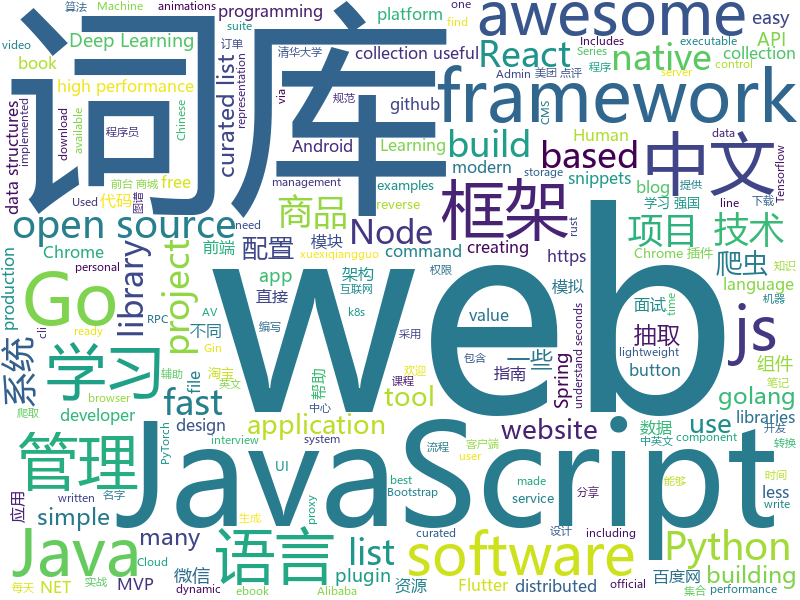

# 2019-03-19
See what the GitHub community is most excited about today.

## python
* [ChromeAppHeroes](https://github.com/zhaoolee/ChromeAppHeroes)(**183 stars today**): 🌈Chrome插件英雄榜, 为优秀的Chrome插件写一本中文说明书, 让Chrome插件英雄们造福人类~ ChromePluginHeroes, Write a Chinese manual for the excellent Chrome plugin, let the Chrome plugin heroes benefit the human~
* [LARK](https://github.com/PaddlePaddle/LARK)(**163 stars today**): LAnguage Representations Kit
* [awesome-python-login-model](https://github.com/CriseLYJ/awesome-python-login-model)(**147 stars today**): 😮python模拟登陆一些大型网站，还有一些简单的爬虫，希望对你们有所帮助❤️，如果喜欢记得给个star哦🌟
* [paper-tips-and-tricks](https://github.com/Wookai/paper-tips-and-tricks)(**143 stars today**): Best practice and tips & tricks to write scientific papers in LaTeX, with figures generated in Python or Matlab.
* [Algorithm_Interview_Notes-Chinese](https://github.com/imhuay/Algorithm_Interview_Notes-Chinese)(**118 stars today**): 2018/2019/校招/春招/秋招/算法/机器学习(Machine Learning)/深度学习(Deep Learning)/自然语言处理(NLP)/C/C++/Python/面试笔记
* [March-Madness-ML](https://github.com/adeshpande3/March-Madness-ML)(**100 stars today**): Machine learned bracketology
* [models](https://github.com/tensorflow/models)(**69 stars today**): Models and examples built with TensorFlow
* [faceswap](https://github.com/deepfakes/faceswap)(**74 stars today**): Non official project based on original /r/Deepfakes thread. Many thanks to him!
* [bit](https://github.com/ofek/bit)(**79 stars today**): Bitcoin made easy.
* [awesome-python](https://github.com/vinta/awesome-python)(**69 stars today**): A curated list of awesome Python frameworks, libraries, software and resources
* [examples-of-web-crawlers](https://github.com/shengqiangzhang/examples-of-web-crawlers)(**68 stars today**): python爬虫例子,对新手比较友好。淘宝模拟登录,淘宝商品爬虫,淘宝我已购买的宝贝爬虫,天猫商品爬虫,每天不同时间段通过微信发消息提醒女友,爬取5K分辨率超清唯美壁纸,爬取豆瓣排行榜电影数据(含GUI界面版)
* [CheatSheetSeries](https://github.com/OWASP/CheatSheetSeries)(**70 stars today**): The OWASP Cheat Sheet Series was created to provide a concise collection of high value information on specific application security topics.
* [Python](https://github.com/TheAlgorithms/Python)(**58 stars today**): All Algorithms implemented in Python
* [system-design-primer](https://github.com/donnemartin/system-design-primer)(**60 stars today**): Learn how to design large-scale systems. Prep for the system design interview. Includes Anki flashcards.
* [PowerHub](https://github.com/AdrianVollmer/PowerHub)(**57 stars today**): A web application to transfer PowerShell modules, executables, snippets and files while bypassing AV and application whitelisting
* [django](https://github.com/django/django)(**52 stars today**): The Web framework for perfectionists with deadlines.
* [public-apis](https://github.com/toddmotto/public-apis)(**48 stars today**): A collective list of free APIs for use in software and web development.
* [Python](https://github.com/geekcomputers/Python)(**43 stars today**): My Python Examples
* [USTC-Course](https://github.com/USTC-Resource/USTC-Course)(**41 stars today**): ❤️中国科学技术大学课程资源
* [openpifpaf](https://github.com/vita-epfl/openpifpaf)(**49 stars today**): Implementation of "PifPaf: Composite Fields for Human Pose Estimation" in PyTorch.
* [keras](https://github.com/keras-team/keras)(**41 stars today**): Deep Learning for humans
* [dragonfly](https://github.com/dragonfly/dragonfly)(**47 stars today**): An open source python library for scalable Bayesian optimisation.
* [CarbonCopy](https://github.com/paranoidninja/CarbonCopy)(**45 stars today**): A tool which creates a spoofed certificate of any online website and signs an Executable for AV Evasion. Works for both Windows and Linux
* [funNLP](https://github.com/fighting41love/funNLP)(**38 stars today**): 中英文敏感词、语言检测、中外手机/电话归属地/运营商查询、名字推断性别、手机号抽取、身份证抽取、邮箱抽取、中日文人名库、中文缩写库、拆字词典、词汇情感值、停用词、反动词表、暴恐词表、繁简体转换、英文模拟中文发音、汪峰歌词生成器、职业名称词库、同义词库、反义词库、否定词库、汽车品牌词库、汽车零件词库、连续英文切割、各种中文词向量、公司名字大全、古诗词库、IT词库、财经词库、成语词库、地名词库、历史名人词库、诗词词库、医学词库、饮食词库、法律词库、汽车词库、动物词库、中文聊天语料、中文谣言数据、百度中文问答数据集、句子相似度匹配算法集合、bert资源、文本生成&摘要相关工具、cocoNLP信息抽取工具、国内电话号码正则匹配、清华大学XLORE:中英文跨语言百科知识图谱、清华大学人工智能技术…
* [youtube-dl](https://github.com/ytdl-org/youtube-dl)(**41 stars today**): Command-line program to download videos from YouTube.com and other video sites

## java
* [JavaGuide](https://github.com/Snailclimb/JavaGuide)(**227 stars today**): 【Java学习+面试指南】 一份涵盖大部分Java程序员所需要掌握的核心知识。
* [spring-boot-examples](https://github.com/ityouknow/spring-boot-examples)(**179 stars today**): about learning Spring Boot via examples. Spring Boot 教程、技术栈示例代码，快速简单上手教程。
* [mall](https://github.com/macrozheng/mall)(**103 stars today**): mall项目是一套电商系统，包括前台商城系统及后台管理系统，基于SpringBoot+MyBatis实现。 前台商城系统包含首页门户、商品推荐、商品搜索、商品展示、购物车、订单流程、会员中心、客户服务、帮助中心等模块。 后台管理系统包含商品管理、订单管理、会员管理、促销管理、运营管理、内容管理、统计报表、财务管理、权限管理、设置等模块。
* [advanced-java](https://github.com/doocs/advanced-java)(**100 stars today**): 😮互联网 Java 工程师进阶知识完全扫盲
* [tutorials](https://github.com/eugenp/tutorials)(**35 stars today**): The "REST With Spring" Course:
* [x7](https://github.com/x-ream/x7)(**36 stars today**): 
* [spring-boot](https://github.com/spring-projects/spring-boot)(**42 stars today**): Spring Boot
* [chunked-coding-converter](https://github.com/c0ny1/chunked-coding-converter)(**49 stars today**): Burp suite 分块传输辅助插件
* [solo](https://github.com/b3log/solo)(**49 stars today**): 🎸一款小而美的博客系统，专为程序员设计。https://hacpai.com/tag/solo
* [flutter_boost](https://github.com/alibaba/flutter_boost)(**46 stars today**): FlutterBoost is a Flutter plugin which enables hybrid integration of Flutter for your existing native apps with minimum efforts
* [spring-framework](https://github.com/spring-projects/spring-framework)(**39 stars today**): Spring Framework
* [fescar](https://github.com/alibaba/fescar)(**46 stars today**): 🔥Fescar is an easy-to-use, high-performance, java based, open source distributed transaction solution.
* [arthas](https://github.com/alibaba/arthas)(**46 stars today**): Alibaba Java Diagnostic Tool Arthas/Alibaba Java诊断利器Arthas
* [interviews](https://github.com/kdn251/interviews)(**39 stars today**): Everything you need to know to get the job.
* [elasticsearch](https://github.com/elastic/elasticsearch)(**39 stars today**): Open Source, Distributed, RESTful Search Engine
* [lottie-android](https://github.com/airbnb/lottie-android)(**33 stars today**): Render After Effects animations natively on Android and iOS, Web, and React Native
* [guava](https://github.com/google/guava)(**30 stars today**): Google core libraries for Java
* [light-4j](https://github.com/networknt/light-4j)(**30 stars today**): A fast, lightweight and more productive microservices framework
* [nacos](https://github.com/alibaba/nacos)(**26 stars today**): an easy-to-use dynamic service discovery, configuration and service management platform for building cloud native applications.
* [quarkus](https://github.com/quarkusio/quarkus)(**31 stars today**): Quarkus: Supersonic Subatomic Java.
* [apollo](https://github.com/ctripcorp/apollo)(**28 stars today**): Apollo（阿波罗）是携程框架部门研发的分布式配置中心，能够集中化管理应用不同环境、不同集群的配置，配置修改后能够实时推送到应用端，并且具备规范的权限、流程治理等特性，适用于微服务配置管理场景。
* [cat](https://github.com/dianping/cat)(**27 stars today**): CAT 作为服务端项目基础组件，提供了 Java, C/C++, Node.js, Python, Go 等多语言客户端，已经在美团点评的基础架构中间件框架（MVC框架，RPC框架，数据库框架，缓存框架等，消息队列，配置系统等）深度集成，为美团点评各业务线提供系统丰富的性能指标、健康状况、实时告警等。
* [pravega](https://github.com/pravega/pravega)(**29 stars today**): Pravega - Streaming as a new software defined storage primitive
* [incubator-dubbo](https://github.com/apache/incubator-dubbo)(**23 stars today**): Apache Dubbo (incubating) is a high-performance, java based, open source RPC framework.
* [FlyTour](https://github.com/geduo83/FlyTour)(**24 stars today**): Android MVP+组件化实战项目框架，工程架构采用gradle配置实现组件化，模块的架构采用典型的MVP架构，在Android项目框架搭建中中有很大的参考价值，MVP的架子直接复制粘贴到你的项目直接就能用，另外在长期的工作实践中总结整理大量的实用工具类在项目lib_common组件的util包当中

## unknown
* [js-dev-reads](https://github.com/twhite96/js-dev-reads)(**566 stars today**): A list of books📚and articles📝for the discerning web developer to read.
* [V](https://github.com/vlang-io/V)(**446 stars today**): Simple, fast, safe, compiled language for creating maintainable software. Supports translation from C/C++.
* [Machine-Learning-Study-Path-March-2019](https://github.com/clone95/Machine-Learning-Study-Path-March-2019)(**346 stars today**): A complete ML study path, focused on TensorFlow and Scikit-Learn
* [The-Hacker-Playbook-3-Translation](https://github.com/Snowming04/The-Hacker-Playbook-3-Translation)(**205 stars today**): 对 The Hacker Playbook 3 的翻译。
* [awesome-uses](https://github.com/wesbos/awesome-uses)(**209 stars today**): Awesome Uses Page
* [CS-Notes](https://github.com/CyC2018/CS-Notes)(**161 stars today**): 😋技术面试必备基础知识
* [ghidra](https://github.com/NationalSecurityAgency/ghidra)(**156 stars today**): Ghidra is a software reverse engineering (SRE) framework
* [developer-roadmap](https://github.com/kamranahmedse/developer-roadmap)(**112 stars today**): Roadmap to becoming a web developer in 2019
* [You-Dont-Know-JS](https://github.com/getify/You-Dont-Know-JS)(**89 stars today**): A book series on JavaScript. @YDKJS on twitter.
* [architect-awesome](https://github.com/xingshaocheng/architect-awesome)(**88 stars today**): 后端架构师技术图谱
* [awesome-personal-blogs](https://github.com/jkup/awesome-personal-blogs)(**80 stars today**): A delightful list of personal tech blogs
* [awesome](https://github.com/sindresorhus/awesome)(**77 stars today**): 😎Awesome lists about all kinds of interesting topics
* [gitignore](https://github.com/github/gitignore)(**56 stars today**): A collection of useful .gitignore templates
* [Daily-Interview-Question](https://github.com/Advanced-Frontend/Daily-Interview-Question)(**73 stars today**): 工作日每天一道前端大厂面试题，祝大家天天进步，一年后会看到不一样的自己。
* [Go42](https://github.com/ffhelicopter/Go42)(**59 stars today**): 写《Go语言四十二章经》，纯粹是因为开发过程中碰到过的一些问题，踩到过的一些坑，感觉在Go语言学习使用过程中，有必要深刻理解这门语言的核心思维、清晰掌握语言的细节规范以及反复琢磨标准包代码设计模式，于是才有了这本书。
* [free-programming-books-zh_CN](https://github.com/justjavac/free-programming-books-zh_CN)(**51 stars today**): 📚免费的计算机编程类中文书籍，欢迎投稿
* [free-programming-books](https://github.com/EbookFoundation/free-programming-books)(**52 stars today**): 📚Freely available programming books
* [build-your-own-x](https://github.com/danistefanovic/build-your-own-x)(**53 stars today**): 🤓Build your own (insert technology here)
* [Awesome-Design-Tools](https://github.com/LisaDziuba/Awesome-Design-Tools)(**49 stars today**): The best design tools for everything.
* [the-book-of-secret-knowledge](https://github.com/trimstray/the-book-of-secret-knowledge)(**44 stars today**): A collection of inspiring lists, manuals, cheatsheets, blogs, hacks, one-liners, cli/web tools and more.
* [app-ideas](https://github.com/florinpop17/app-ideas)(**42 stars today**): A Collection of application ideas which can be used to improve your coding skills.
* [project-based-learning](https://github.com/tuvtran/project-based-learning)(**39 stars today**): Curated list of project-based tutorials
* [awesome-shell](https://github.com/alebcay/awesome-shell)(**38 stars today**): A curated list of awesome command-line frameworks, toolkits, guides and gizmos. Inspired by awesome-php.
* [time-as-a-friend](https://github.com/xiaolai/time-as-a-friend)(**33 stars today**): 《把时间当作朋友》

## javascript
* [laxxx](https://github.com/alexfoxy/laxxx)(**665 stars today**): Simple & light weight (2kb minified & zipped) vanilla javascript plugin to create smooth & beautiful animations when you scrolllll! Harness the power of the most intuitive interaction and make your websites come alive!
* [construct-js](https://github.com/francisrstokes/construct-js)(**423 stars today**): 🛠️A library for creating byte level data structures.
* [generative.fm](https://github.com/generative-music/generative.fm)(**276 stars today**): A platform for playing generative music in the browser.
* [nsfwjs](https://github.com/infinitered/nsfwjs)(**221 stars today**): NSFW detection on the client-side via Tensorflow JS
* [wechat-format](https://github.com/lyricat/wechat-format)(**221 stars today**): 微信公众号排版编辑器，转换 Markdown 到微信特制的 HTML
* [send](https://github.com/mozilla/send)(**212 stars today**): Simple, private file sharing from the makers of Firefox
* [vue](https://github.com/vuejs/vue)(**175 stars today**): 🖖Vue.js is a progressive, incrementally-adoptable JavaScript framework for building UI on the web.
* [baiduyun](https://github.com/syhyz1990/baiduyun)(**177 stars today**): 油猴脚本 直接下载百度网盘和百度网盘分享的文件,直链下载超级加速
* [react](https://github.com/facebook/react)(**101 stars today**): A declarative, efficient, and flexible JavaScript library for building user interfaces.
* [async-retry](https://github.com/zeit/async-retry)(**111 stars today**): Retrying made simple, easy and async
* [webiny-js](https://github.com/Webiny/webiny-js)(**90 stars today**): Serverless CMS (GraphQL + React)
* [javascript-algorithms](https://github.com/trekhleb/javascript-algorithms)(**74 stars today**): 📝Algorithms and data structures implemented in JavaScript with explanations and links to further readings
* [30-seconds-of-code](https://github.com/30-seconds/30-seconds-of-code)(**77 stars today**): A curated collection of useful JavaScript snippets that you can understand in 30 seconds or less.
* [react-native-really-awesome-button](https://github.com/rcaferati/react-native-really-awesome-button)(**79 stars today**): 📱React Native button component. Awesome Button is a 3D at 60fps, progress enabled, social ready, extendable, production ready component that renders an awesome animated set of UI buttons.
* [gatsby](https://github.com/gatsbyjs/gatsby)(**72 stars today**): Build blazing fast, modern apps and websites with React
* [create-react-app](https://github.com/facebook/create-react-app)(**58 stars today**): Set up a modern web app by running one command.
* [taro](https://github.com/NervJS/taro)(**65 stars today**): 多端统一开发框架，支持用 React 的开发方式编写一次代码，生成能运行在微信/百度/支付宝/字节跳动小程序、H5、React Native 等的应用。 https://taro.js.org/
* [Motrix](https://github.com/agalwood/Motrix)(**64 stars today**): A full-featured download manager.
* [puppeteer](https://github.com/GoogleChrome/puppeteer)(**62 stars today**): Headless Chrome Node API
* [javascript](https://github.com/airbnb/javascript)(**58 stars today**): JavaScript Style Guide
* [axios](https://github.com/axios/axios)(**58 stars today**): Promise based HTTP client for the browser and node.js
* [realworld](https://github.com/gothinkster/realworld)(**58 stars today**): "The mother of all demo apps" — Exemplary fullstack Medium.com clone powered by React, Angular, Node, Django, and many more🏅
* [bootstrap](https://github.com/twbs/bootstrap)(**41 stars today**): The most popular HTML, CSS, and JavaScript framework for developing responsive, mobile first projects on the web.
* [strapi](https://github.com/strapi/strapi)(**53 stars today**): 🚀Open source Node.js Headless CMS to easily build customisable APIs
* [node](https://github.com/nodejs/node)(**43 stars today**): Node.js JavaScript runtime✨🐢🚀✨

## html
* [frontendDaily](https://github.com/kujian/frontendDaily)(**68 stars today**): 前端开发技术日报，每日分享互联网最精彩的前端技术、前端资讯、后端编程、设计和资源等，欢迎关注Watch
* [lets-get-arrested](https://github.com/hamukazu/lets-get-arrested)(**49 stars today**): This project is intended to protest against the police in Japan
* [personal-website](https://github.com/github/personal-website)(**35 stars today**): Code that'll help you kickstart a personal website that showcases your work as a software developer.
* [micromodal](https://github.com/ghosh/micromodal)(**48 stars today**): ⭕ Tiny javascript library for creating accessible modal dialogs
* [Panda-Learning](https://github.com/Alivon/Panda-Learning)(**43 stars today**): 学习强国xuexiqiangguo--熊猫学习Panda-Learning是一个辅助学习 学习强国的程序,帮助挤不出时间，却仍然需要学习的积极分子，学习强国(xuexiqiangguo)
* [rust-cookbook](https://github.com/rust-lang-nursery/rust-cookbook)(**44 stars today**): https://rust-lang-nursery.github.io/rust-cookbook
* [javascript-tutorial-en](https://github.com/iliakan/javascript-tutorial-en)(**27 stars today**): Modern JavaScript Tutorial
* [Unifiedtransform](https://github.com/changeweb/Unifiedtransform)(**22 stars today**): A school management Software
* [Coursera-ML-AndrewNg-Notes](https://github.com/fengdu78/Coursera-ML-AndrewNg-Notes)(**24 stars today**): 吴恩达老师的机器学习课程个人笔记
* [AdminLTE](https://github.com/almasaeed2010/AdminLTE)(**18 stars today**): AdminLTE - Free Premium Admin control Panel Theme Based On Bootstrap 3.x
* [wpt](https://github.com/web-platform-tests/wpt)(**19 stars today**): Test suites for Web platform specs — including WHATWG, W3C, and others
* [Front-end-Developer-Interview-Questions](https://github.com/h5bp/Front-end-Developer-Interview-Questions)(**19 stars today**): A list of helpful front-end related questions you can use to interview potential candidates, test yourself or completely ignore.
* [fastText](https://github.com/facebookresearch/fastText)(**18 stars today**): Library for fast text representation and classification.
* [deep-learning-wizard](https://github.com/ritchieng/deep-learning-wizard)(**17 stars today**): Open source guides for mastering deep learning to deploying deep learning in production in PyTorch.
* [JavaScript30](https://github.com/wesbos/JavaScript30)(**8 stars today**): 30 Day Vanilla JS Challenge
* [30-seconds-of-css](https://github.com/30-seconds/30-seconds-of-css)(**14 stars today**): A curated collection of useful CSS snippets you can understand in 30 seconds or less.
* [requests-html](https://github.com/kennethreitz/requests-html)(**13 stars today**): Pythonic HTML Parsing for Humans™
* [kv-storage](https://github.com/WICG/kv-storage)(**14 stars today**): A proposal for an async key/value storage API for the web
* [javascript-tutorial-zh](https://github.com/xitu/javascript-tutorial-zh)(**13 stars today**): Modern JavaScript Tutorial
* [github](https://github.com/phodal/github)(**11 stars today**): GitHub 漫游指南- a Chinese ebook on how to build a good project on Github. Explore the users' behavior. Find some thing interest.
* [flutter-in-action](https://github.com/flutterchina/flutter-in-action)(**10 stars today**): 《Flutter实战》电子书
* [coreui-free-bootstrap-admin-template](https://github.com/coreui/coreui-free-bootstrap-admin-template)(**11 stars today**): CoreUI is free bootstrap admin template
* [fonts](https://github.com/google/fonts)(**10 stars today**): Font files available from Google Fonts
* [dotnet](https://github.com/Microsoft/dotnet)(**9 stars today**): This repo is the official home of .NET on GitHub. It's a great starting point to find many .NET OSS projects from Microsoft and the community, including many that are part of the .NET Foundation.
* [qiubaiying.github.io](https://github.com/qiubaiying/qiubaiying.github.io)(**5 stars today**): BY Blog ->

## go
* [kaf](https://github.com/infinimesh/kaf)(**207 stars today**): Modern CLI for Apache Kafka, written in Go.
* [kubernetes](https://github.com/kubernetes/kubernetes)(**59 stars today**): Production-Grade Container Scheduling and Management
* [go](https://github.com/golang/go)(**55 stars today**): The Go programming language
* [server](https://github.com/gotify/server)(**58 stars today**): A simple server for sending and receiving messages in real-time per WebSocket. (Includes a sleek web-ui)
* [slim](https://github.com/openacid/slim)(**54 stars today**): Unbelievably space efficient data structures in Golang.
* [mitmengine](https://github.com/cloudflare/mitmengine)(**49 stars today**): A MITM (monster-in-the-middle) detection tool. Used to build MALCOLM:
* [the-way-to-go_ZH_CN](https://github.com/Unknwon/the-way-to-go_ZH_CN)(**39 stars today**): 《The Way to Go》中文译本，中文正式名《Go 入门指南》
* [frp](https://github.com/fatedier/frp)(**38 stars today**): A fast reverse proxy to help you expose a local server behind a NAT or firewall to the internet.
* [k3s](https://github.com/rancher/k3s)(**41 stars today**): Lightweight Kubernetes. 5 less than k8s.
* [weaver](https://github.com/gojektech/weaver)(**42 stars today**): An Advanced HTTP Reverse Proxy with Dynamic Sharding Strategies
* [awesome-go](https://github.com/avelino/awesome-go)(**39 stars today**): A curated list of awesome Go frameworks, libraries and software
* [istio](https://github.com/istio/istio)(**38 stars today**): Connect, secure, control, and observe services.
* [kraken](https://github.com/uber/kraken)(**40 stars today**): P2P Docker registry capable of distributing TBs of data in seconds
* [hugo](https://github.com/gohugoio/hugo)(**38 stars today**): The world’s fastest framework for building websites.
* [AUXPI](https://github.com/aimerforreimu/AUXPI)(**36 stars today**): 🍭集合多家 API 的新一代图床
* [traefik](https://github.com/containous/traefik)(**36 stars today**): The Cloud Native Edge Router
* [build-web-application-with-golang](https://github.com/astaxie/build-web-application-with-golang)(**33 stars today**): A golang ebook intro how to build a web with golang
* [BaiduPCS-Go](https://github.com/iikira/BaiduPCS-Go)(**32 stars today**): 百度网盘客户端 - Go语言编写
* [gin](https://github.com/gin-gonic/gin)(**32 stars today**): Gin is a HTTP web framework written in Go (Golang). It features a Martini-like API with much better performance -- up to 40 times faster. If you need smashing performance, get yourself some Gin.
* [helm](https://github.com/helm/helm)(**29 stars today**): The Kubernetes Package Manager
* [bigqueue](https://github.com/grandecola/bigqueue)(**31 stars today**): Embedded, Fast and Persistent bigqueue implementation
* [etcd](https://github.com/etcd-io/etcd)(**29 stars today**): Distributed reliable key-value store for the most critical data of a distributed system
* [beego](https://github.com/astaxie/beego)(**29 stars today**): beego is an open-source, high-performance web framework for the Go programming language.
* [pipeline](https://github.com/tektoncd/pipeline)(**28 stars today**): A K8s-native Pipeline resource.
* [installer](https://github.com/openshift/installer)(**25 stars today**): Install an OpenShift cluster

## WordCloud

