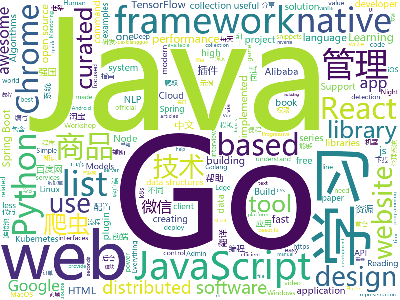

# 2019-03-21
See what the GitHub community is most excited about today.

## python
* [paper-tips-and-tricks](https://github.com/Wookai/paper-tips-and-tricks)(**473 stars today**): Best practice and tips & tricks to write scientific papers in LaTeX, with figures generated in Python or Matlab.
* [awesome-python-login-model](https://github.com/CriseLYJ/awesome-python-login-model)(**214 stars today**): 😮python模拟登陆一些大型网站，还有一些简单的爬虫，希望对你们有所帮助❤️，如果喜欢记得给个star哦🌟
* [ChromeAppHeroes](https://github.com/zhaoolee/ChromeAppHeroes)(**167 stars today**): 🌈Chrome插件英雄榜, 为优秀的Chrome插件写一本中文说明书, 让Chrome插件英雄们造福人类~ ChromePluginHeroes, Write a Chinese manual for the excellent Chrome plugin, let the Chrome plugin heroes benefit the human~
* [Algorithm_Interview_Notes-Chinese](https://github.com/imhuay/Algorithm_Interview_Notes-Chinese)(**101 stars today**): 2018/2019/校招/春招/秋招/算法/机器学习(Machine Learning)/深度学习(Deep Learning)/自然语言处理(NLP)/C/C++/Python/面试笔记
* [models](https://github.com/tensorflow/models)(**76 stars today**): Models and examples built with TensorFlow
* [faceswap](https://github.com/deepfakes/faceswap)(**80 stars today**): Non official project based on original /r/Deepfakes thread. Many thanks to him!
* [system-design-primer](https://github.com/donnemartin/system-design-primer)(**82 stars today**): Learn how to design large-scale systems. Prep for the system design interview. Includes Anki flashcards.
* [CheatSheetSeries](https://github.com/OWASP/CheatSheetSeries)(**78 stars today**): The OWASP Cheat Sheet Series was created to provide a concise collection of high value information on specific application security topics.
* [awesome-python](https://github.com/vinta/awesome-python)(**73 stars today**): A curated list of awesome Python frameworks, libraries, software and resources
* [dragonfly](https://github.com/dragonfly/dragonfly)(**73 stars today**): An open source python library for scalable Bayesian optimisation.
* [Python](https://github.com/TheAlgorithms/Python)(**59 stars today**): All Algorithms implemented in Python
* [public-apis](https://github.com/toddmotto/public-apis)(**63 stars today**): A collective list of free APIs for use in software and web development.
* [bert](https://github.com/google-research/bert)(**58 stars today**): TensorFlow code and pre-trained models for BERT
* [examples-of-web-crawlers](https://github.com/shengqiangzhang/examples-of-web-crawlers)(**53 stars today**): python爬虫例子,对新手比较友好。淘宝模拟登录,淘宝商品爬虫,淘宝我已购买的宝贝爬虫,天猫商品爬虫,每天不同时间段通过微信发消息提醒女友,爬取5K分辨率超清唯美壁纸,爬取豆瓣排行榜电影数据(含GUI界面版)
* [keras](https://github.com/keras-team/keras)(**46 stars today**): Deep Learning for humans
* [gpt-2](https://github.com/openai/gpt-2)(**49 stars today**): Code for the paper "Language Models are Unsupervised Multitask Learners"
* [orm](https://github.com/encode/orm)(**50 stars today**): An async ORM
* [youtube-dl](https://github.com/ytdl-org/youtube-dl)(**44 stars today**): Command-line program to download videos from YouTube.com and other video sites
* [USTC-Course](https://github.com/USTC-Resource/USTC-Course)(**43 stars today**): ❤️中国科学技术大学课程资源
* [face_recognition](https://github.com/ageitgey/face_recognition)(**38 stars today**): The world's simplest facial recognition api for Python and the command line
* [LARK](https://github.com/PaddlePaddle/LARK)(**43 stars today**): LAnguage Representations Kit
* [NLP-progress](https://github.com/sebastianruder/NLP-progress)(**41 stars today**): Repository to track the progress in Natural Language Processing (NLP), including the datasets and the current state-of-the-art for the most common NLP tasks.
* [stylegan](https://github.com/NVlabs/stylegan)(**41 stars today**): StyleGAN - Official TensorFlow Implementation
* [source](https://github.com/daenerys-sre/source)(**43 stars today**): Daenerys: A framework for interoperability between IDA and Ghidra
* [Python](https://github.com/geekcomputers/Python)(**36 stars today**): My Python Examples

## java
* [JavaGuide](https://github.com/Snailclimb/JavaGuide)(**184 stars today**): 【Java学习+面试指南】 一份涵盖大部分Java程序员所需要掌握的核心知识。
* [thinking-in-spring-boot-samples](https://github.com/mercyblitz/thinking-in-spring-boot-samples)(**117 stars today**): 小马哥书籍《Spring Boot 编程思想》示例工程
* [advanced-java](https://github.com/doocs/advanced-java)(**101 stars today**): 😮互联网 Java 工程师进阶知识完全扫盲
* [mall](https://github.com/macrozheng/mall)(**87 stars today**): mall项目是一套电商系统，包括前台商城系统及后台管理系统，基于SpringBoot+MyBatis实现。 前台商城系统包含首页门户、商品推荐、商品搜索、商品展示、购物车、订单流程、会员中心、客户服务、帮助中心等模块。 后台管理系统包含商品管理、订单管理、会员管理、促销管理、运营管理、内容管理、统计报表、财务管理、权限管理、设置等模块。
* [spring-boot-examples](https://github.com/ityouknow/spring-boot-examples)(**84 stars today**): about learning Spring Boot via examples. Spring Boot 教程、技术栈示例代码，快速简单上手教程。
* [SpringBoot-Learning](https://github.com/dyc87112/SpringBoot-Learning)(**80 stars today**): Spring Boot基础教程
* [java-design-patterns](https://github.com/iluwatar/java-design-patterns)(**69 stars today**): Design patterns implemented in Java
* [fescar](https://github.com/alibaba/fescar)(**55 stars today**): 🔥Fescar is an easy-to-use, high-performance, java based, open source distributed transaction solution.
* [spring-boot](https://github.com/spring-projects/spring-boot)(**47 stars today**): Spring Boot
* [tutorials](https://github.com/eugenp/tutorials)(**33 stars today**): The "REST With Spring" Course:
* [spring-framework](https://github.com/spring-projects/spring-framework)(**34 stars today**): Spring Framework
* [arthas](https://github.com/alibaba/arthas)(**42 stars today**): Alibaba Java Diagnostic Tool Arthas/Alibaba Java诊断利器Arthas
* [spring-cloud-alibaba](https://github.com/spring-cloud-incubator/spring-cloud-alibaba)(**38 stars today**): Spring Cloud Alibaba provides a one-stop solution for application development for the distributed solutions of Alibaba middleware.
* [apollo](https://github.com/ctripcorp/apollo)(**36 stars today**): Apollo（阿波罗）是携程框架部门研发的分布式配置中心，能够集中化管理应用不同环境、不同集群的配置，配置修改后能够实时推送到应用端，并且具备规范的权限、流程治理等特性，适用于微服务配置管理场景。
* [incubator-dubbo](https://github.com/apache/incubator-dubbo)(**32 stars today**): Apache Dubbo (incubating) is a high-performance, java based, open source RPC framework.
* [x7](https://github.com/x-ream/x7)(**15 stars today**): 
* [Java](https://github.com/TheAlgorithms/Java)(**31 stars today**): All Algorithms implemented in Java
* [incubator-skywalking](https://github.com/apache/incubator-skywalking)(**37 stars today**): APM, Application Performance Monitoring System
* [elasticsearch](https://github.com/elastic/elasticsearch)(**34 stars today**): Open Source, Distributed, RESTful Search Engine
* [DoraemonKit](https://github.com/didi/DoraemonKit)(**35 stars today**): 简称 "DoKit" 。一款功能齐全的客户端（ iOS 、Android ）研发助手，你值得拥有。
* [interviews](https://github.com/kdn251/interviews)(**31 stars today**): Everything you need to know to get the job.
* [druid](https://github.com/alibaba/druid)(**29 stars today**): 阿里巴巴数据库事业部出品，为监控而生的数据库连接池。阿里云Data Lake Analytics(https://www.aliyun.com/product/datalakeanalytics )、DRDS、TDDL 连接池powered by Druid
* [JGrowing](https://github.com/javagrowing/JGrowing)(**30 stars today**): Java is Growing up but not only Java。Java成长路线，但学到不仅仅是Java。
* [guava](https://github.com/google/guava)(**28 stars today**): Google core libraries for Java
* [chunked-coding-converter](https://github.com/c0ny1/chunked-coding-converter)(**30 stars today**): Burp suite 分块传输辅助插件

## unknown
* [SPADE](https://github.com/NVlabs/SPADE)(**709 stars today**): 
* [Machine-Learning-Study-Path-March-2019](https://github.com/clone95/Machine-Learning-Study-Path-March-2019)(**348 stars today**): A complete ML study path, focused on TensorFlow and Scikit-Learn
* [js-dev-reads](https://github.com/twhite96/js-dev-reads)(**372 stars today**): A list of books📚and articles📝for the discerning web developer to read.
* [awesome-uses](https://github.com/wesbos/awesome-uses)(**190 stars today**): Awesome Uses Page
* [The-Hacker-Playbook-3-Translation](https://github.com/Snowming04/The-Hacker-Playbook-3-Translation)(**173 stars today**): 对 The Hacker Playbook 3 的翻译。
* [awesome](https://github.com/sindresorhus/awesome)(**141 stars today**): 😎Awesome lists about all kinds of interesting topics
* [CS-Notes](https://github.com/CyC2018/CS-Notes)(**115 stars today**): 😋技术面试必备基础知识
* [ghidra](https://github.com/NationalSecurityAgency/ghidra)(**119 stars today**): Ghidra is a software reverse engineering (SRE) framework
* [Data-Science--Cheat-Sheet](https://github.com/abhat222/Data-Science--Cheat-Sheet)(**94 stars today**): Cheat Sheets
* [developer-roadmap](https://github.com/kamranahmedse/developer-roadmap)(**95 stars today**): Roadmap to becoming a web developer in 2019
* [gitignore](https://github.com/github/gitignore)(**73 stars today**): A collection of useful .gitignore templates
* [You-Dont-Know-JS](https://github.com/getify/You-Dont-Know-JS)(**84 stars today**): A book series on JavaScript. @YDKJS on twitter.
* [V](https://github.com/vlang-io/V)(**90 stars today**): Simple, fast, safe, compiled language for creating maintainable software. Supports translation from C/C++.
* [myblog](https://github.com/farmerjohngit/myblog)(**79 stars today**): 有深度的Java技术博客
* [free-programming-books-zh_CN](https://github.com/justjavac/free-programming-books-zh_CN)(**64 stars today**): 📚免费的计算机编程类中文书籍，欢迎投稿
* [cvpr2019](https://github.com/extreme-assistant/cvpr2019)(**64 stars today**): cvpr2019 papers
* [free-programming-books](https://github.com/EbookFoundation/free-programming-books)(**59 stars today**): 📚Freely available programming books
* [build-your-own-x](https://github.com/danistefanovic/build-your-own-x)(**48 stars today**): 🤓Build your own (insert technology here)
* [Daily-Interview-Question](https://github.com/Advanced-Frontend/Daily-Interview-Question)(**44 stars today**): 工作日每天一道前端大厂面试题，祝大家天天进步，一年后会看到不一样的自己。
* [ds4stats](https://github.com/rafalab/ds4stats)(**41 stars today**): Data science for statisticians workshop
* [gold-miner](https://github.com/xitu/gold-miner)(**39 stars today**): 🥇掘金翻译计划，可能是世界最大最好的英译中技术社区，最懂读者和译者的翻译平台：
* [the-book-of-secret-knowledge](https://github.com/trimstray/the-book-of-secret-knowledge)(**38 stars today**): A collection of inspiring lists, manuals, cheatsheets, blogs, hacks, one-liners, cli/web tools and more.
* [How-To-Secure-A-Linux-Server](https://github.com/imthenachoman/How-To-Secure-A-Linux-Server)(**42 stars today**): An evolving how-to guide for securing a Linux server.
* [awesome-wechat-weapp](https://github.com/justjavac/awesome-wechat-weapp)(**37 stars today**): 微信小程序开发资源汇总💯
* [awesome-vue](https://github.com/vuejs/awesome-vue)(**37 stars today**): 🎉A curated list of awesome things related to Vue.js

## javascript
* [laxxx](https://github.com/alexfoxy/laxxx)(**423 stars today**): Simple & light weight (2kb minified & zipped) vanilla javascript plugin to create smooth & beautiful animations when you scrolllll! Harness the power of the most intuitive interaction and make your websites come alive!
* [baiduyun](https://github.com/syhyz1990/baiduyun)(**256 stars today**): 油猴脚本 直接下载百度网盘和百度网盘分享的文件,直链下载超级加速
* [webiny-js](https://github.com/Webiny/webiny-js)(**177 stars today**): Serverless CMS (GraphQL + React)
* [vue](https://github.com/vuejs/vue)(**160 stars today**): 🖖Vue.js is a progressive, incrementally-adoptable JavaScript framework for building UI on the web.
* [send](https://github.com/mozilla/send)(**144 stars today**): Simple, private file sharing from the makers of Firefox
* [cleave.js](https://github.com/nosir/cleave.js)(**109 stars today**): Format input text content when you are typing...
* [react](https://github.com/facebook/react)(**90 stars today**): A declarative, efficient, and flexible JavaScript library for building user interfaces.
* [taro](https://github.com/NervJS/taro)(**89 stars today**): 多端统一开发框架，支持用 React 的开发方式编写一次代码，生成能运行在微信/百度/支付宝/字节跳动小程序、H5、React Native 等的应用。 https://taro.js.org/
* [mk.js](https://github.com/mgechev/mk.js)(**83 stars today**): Canvas implementation of basic fighting game which allows multiplayer game over the network.
* [30-seconds-of-code](https://github.com/30-seconds/30-seconds-of-code)(**77 stars today**): A curated collection of useful JavaScript snippets that you can understand in 30 seconds or less.
* [react-native-reanimated-bottom-sheet](https://github.com/osdnk/react-native-reanimated-bottom-sheet)(**78 stars today**): Highly configurable bottom sheet component made with react-native-reanimated and react-native-gesture-handler
* [create-react-app](https://github.com/facebook/create-react-app)(**62 stars today**): Set up a modern web app by running one command.
* [puppeteer](https://github.com/GoogleChrome/puppeteer)(**68 stars today**): Headless Chrome Node API
* [spicetify-cli](https://github.com/khanhas/spicetify-cli)(**68 stars today**): Commandline tool to customize Spotify client. Supports Windows, MacOS and Linux.
* [axios](https://github.com/axios/axios)(**67 stars today**): Promise based HTTP client for the browser and node.js
* [wechat-format](https://github.com/lyricat/wechat-format)(**62 stars today**): 微信公众号排版编辑器，转换 Markdown 到微信特制的 HTML
* [construct-js](https://github.com/francisrstokes/construct-js)(**64 stars today**): 🛠️A library for creating byte level data structures.
* [bootstrap](https://github.com/twbs/bootstrap)(**45 stars today**): The most popular HTML, CSS, and JavaScript framework for developing responsive, mobile first projects on the web.
* [javascript](https://github.com/airbnb/javascript)(**54 stars today**): JavaScript Style Guide
* [react-native](https://github.com/facebook/react-native)(**48 stars today**): A framework for building native apps with React.
* [nsfwjs](https://github.com/infinitered/nsfwjs)(**57 stars today**): NSFW detection on the client-side via Tensorflow JS
* [Awesome-Design-Tools](https://github.com/LisaDziuba/Awesome-Design-Tools)(**55 stars today**): The best design tools for everything.
* [ant-design-pro](https://github.com/ant-design/ant-design-pro)(**49 stars today**): 👨🏻‍💻👩🏻‍💻 Use Ant Design like a Pro!
* [javascript-algorithms](https://github.com/trekhleb/javascript-algorithms)(**47 stars today**): 📝Algorithms and data structures implemented in JavaScript with explanations and links to further readings
* [iz3node](https://github.com/Izzzio/iz3node)(**54 stars today**): iZ³ - IZZZIO - fully customizable blockchain platform Node

## html
* [Panda-Learning](https://github.com/Alivon/Panda-Learning)(**56 stars today**): 学习强国xuexiqiangguo--熊猫学习Panda-Learning是一个辅助学习 学习强国的程序,帮助挤不出时间，却仍然需要学习的积极分子，学习强国(xuexiqiangguo)
* [lets-get-arrested](https://github.com/hamukazu/lets-get-arrested)(**36 stars today**): This project is intended to protest against the police in Japan
* [personal-website](https://github.com/github/personal-website)(**33 stars today**): Code that'll help you kickstart a personal website that showcases your work as a software developer.
* [AdminLTE](https://github.com/ColorlibHQ/AdminLTE)(**29 stars today**): AdminLTE - Free Premium Admin control Panel Theme Based On Bootstrap 3.x
* [styleguide](https://github.com/google/styleguide)(**25 stars today**): Style guides for Google-originated open-source projects
* [Front-end-Developer-Interview-Questions](https://github.com/h5bp/Front-end-Developer-Interview-Questions)(**26 stars today**): A list of helpful front-end related questions you can use to interview potential candidates, test yourself or completely ignore.
* [micromodal](https://github.com/ghosh/micromodal)(**25 stars today**): ⭕ Tiny javascript library for creating accessible modal dialogs
* [frontendDaily](https://github.com/kujian/frontendDaily)(**21 stars today**): 前端开发技术日报，每日分享互联网最精彩的前端技术、前端资讯、后端编程、设计和资源等，欢迎关注Watch
* [Coursera-ML-AndrewNg-Notes](https://github.com/fengdu78/Coursera-ML-AndrewNg-Notes)(**17 stars today**): 吴恩达老师的机器学习课程个人笔记
* [javascript-tutorial-en](https://github.com/iliakan/javascript-tutorial-en)(**16 stars today**): Modern JavaScript Tutorial
* [JavaScript30](https://github.com/wesbos/JavaScript30)(**11 stars today**): 30 Day Vanilla JS Challenge
* [Spoon-Knife](https://github.com/octocat/Spoon-Knife)(****): This repo is for demonstration purposes only.
* [quickchart](https://github.com/typpo/quickchart)(**15 stars today**): Google Image Charts alternative
* [portainer](https://github.com/portainer/portainer)(**14 stars today**): Simple management UI for Docker
* [all-contributors](https://github.com/all-contributors/all-contributors)(**13 stars today**): ✨Recognize all contributors, not just the ones who push code✨
* [30-seconds-of-css](https://github.com/30-seconds/30-seconds-of-css)(**12 stars today**): A curated collection of useful CSS snippets you can understand in 30 seconds or less.
* [requests-html](https://github.com/kennethreitz/requests-html)(**11 stars today**): Pythonic HTML Parsing for Humans™
* [fastText](https://github.com/facebookresearch/fastText)(**10 stars today**): Library for fast text representation and classification.
* [flutter-in-action](https://github.com/flutterchina/flutter-in-action)(**10 stars today**): 《Flutter实战》电子书
* [wysiwyg-editor](https://github.com/froala/wysiwyg-editor)(**10 stars today**): A beautifully designed WYSIWYG HTML Editor based on HTML5.
* [hugo-academic](https://github.com/gcushen/hugo-academic)(**9 stars today**): The website builder for Hugo. Build and deploy a beautiful website in minutes🚀
* [fonts](https://github.com/google/fonts)(**9 stars today**): Font files available from Google Fonts
* [capacitor](https://github.com/ionic-team/capacitor)(**9 stars today**): Build cross-platform Native Progressive Web Apps for iOS, Android, and the web⚡️
* [Adminator-admin-dashboard](https://github.com/puikinsh/Adminator-admin-dashboard)(**9 stars today**): Adminator is a easy to use and well design admin dashboard template for web apps, websites, services and more
* [patchwork](https://github.com/jlord/patchwork)(****): All the Git-it Workshop completers!

## go
* [docli](https://github.com/celicoo/docli)(**127 stars today**): Docli - Command-line interfaces made easy
* [pipeline](https://github.com/tektoncd/pipeline)(**85 stars today**): A K8s-native Pipeline resource.
* [go](https://github.com/golang/go)(**81 stars today**): The Go programming language
* [kubernetes](https://github.com/kubernetes/kubernetes)(**71 stars today**): Production-Grade Container Scheduling and Management
* [istio](https://github.com/istio/istio)(**70 stars today**): Connect, secure, control, and observe services.
* [kubeedge](https://github.com/kubeedge/kubeedge)(**60 stars today**): Kubernetes Native Edge Computing Framework
* [reading-go](https://github.com/developer-learning/reading-go)(**58 stars today**): Go 每日阅读和 Go 夜读 > Daily Reading Go and Night Reading Go - Go source reading and offline technical or another articles or discussion on every night.
* [commento](https://github.com/adtac/commento)(**57 stars today**): A fast, bloat-free, privacy-focused commenting platform
* [awesome-go](https://github.com/avelino/awesome-go)(**50 stars today**): A curated list of awesome Go frameworks, libraries and software
* [protobuf](https://github.com/golang/protobuf)(**49 stars today**): Go support for Google's protocol buffers
* [mitmengine](https://github.com/cloudflare/mitmengine)(**50 stars today**): A MITM (monster-in-the-middle) detection tool. Used to build MALCOLM:
* [go-flutter](https://github.com/go-flutter-desktop/go-flutter)(**51 stars today**): Bringing Flutter to Windows, MacOS and Linux - through the power of Go and GLFW.
* [k3s](https://github.com/rancher/k3s)(**43 stars today**): Lightweight Kubernetes. 5 less than k8s.
* [frp](https://github.com/fatedier/frp)(**42 stars today**): A fast reverse proxy to help you expose a local server behind a NAT or firewall to the internet.
* [traefik](https://github.com/containous/traefik)(**41 stars today**): The Cloud Native Edge Router
* [gin](https://github.com/gin-gonic/gin)(**34 stars today**): Gin is a HTTP web framework written in Go (Golang). It features a Martini-like API with much better performance -- up to 40 times faster. If you need smashing performance, get yourself some Gin.
* [etcd](https://github.com/etcd-io/etcd)(**30 stars today**): Distributed reliable key-value store for the most critical data of a distributed system
* [pulumi](https://github.com/pulumi/pulumi)(**32 stars today**): Define cloud apps and infrastructure in your favorite language and deploy to any cloud
* [prometheus](https://github.com/prometheus/prometheus)(**32 stars today**): The Prometheus monitoring system and time series database.
* [BaiduPCS-Go](https://github.com/iikira/BaiduPCS-Go)(**31 stars today**): 百度网盘客户端 - Go语言编写
* [cobra](https://github.com/spf13/cobra)(**31 stars today**): A Commander for modern Go CLI interactions
* [helm](https://github.com/helm/helm)(**27 stars today**): The Kubernetes Package Manager
* [the-way-to-go_ZH_CN](https://github.com/Unknwon/the-way-to-go_ZH_CN)(**29 stars today**): 《The Way to Go》中文译本，中文正式名《Go 入门指南》
* [hugo](https://github.com/gohugoio/hugo)(**29 stars today**): The world’s fastest framework for building websites.
* [slim](https://github.com/openacid/slim)(**29 stars today**): Unbelievably space efficient data structures in Golang.

## WordCloud

