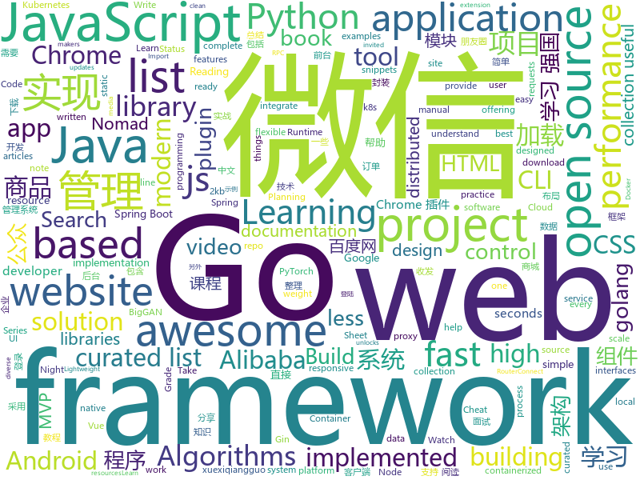

# 2019-03-24
See what the GitHub community is most excited about today.

## python
* [BigGAN-PyTorch](https://github.com/ajbrock/BigGAN-PyTorch)(**362 stars today**): The author's officially unofficial PyTorch BigGAN implementation.
* [fastapi](https://github.com/tiangolo/fastapi)(**181 stars today**): FastAPI framework, high performance, easy to learn, fast to code, ready for production
* [requests-async](https://github.com/encode/requests-async)(**101 stars today**): async-await support for `requests`.🍰
* [pyright](https://github.com/Microsoft/pyright)(**90 stars today**): Static type checker for Python
* [awesome-python-login-model](https://github.com/CriseLYJ/awesome-python-login-model)(**62 stars today**): 😮python模拟登陆一些大型网站，还有一些简单的爬虫，希望对你们有所帮助❤️，如果喜欢记得给个star哦🌟
* [pytorch-pretrained-BigGAN](https://github.com/huggingface/pytorch-pretrained-BigGAN)(**57 stars today**): 🦋A PyTorch implementation of BigGAN with pretrained weights and conversion scripts.
* [awesome-python](https://github.com/vinta/awesome-python)(**55 stars today**): A curated list of awesome Python frameworks, libraries, software and resources
* [system-design-primer](https://github.com/donnemartin/system-design-primer)(**52 stars today**): Learn how to design large-scale systems. Prep for the system design interview. Includes Anki flashcards.
* [Python](https://github.com/TheAlgorithms/Python)(**47 stars today**): All Algorithms implemented in Python
* [huawei2019-with-visualization](https://github.com/AkatsukiCC/huawei2019-with-visualization)(**37 stars today**): 华为2019评判器开源(提供可视化接口，方便大家调试自己的判题器)
* [baselines](https://github.com/openai/baselines)(**41 stars today**): OpenAI Baselines: high-quality implementations of reinforcement learning algorithms
* [paper-tips-and-tricks](https://github.com/Wookai/paper-tips-and-tricks)(**41 stars today**): Best practice and tips & tricks to write scientific papers in LaTeX, with figures generated in Python or Matlab.
* [models](https://github.com/tensorflow/models)(**31 stars today**): Models and examples built with TensorFlow
* [youtube-dl](https://github.com/ytdl-org/youtube-dl)(**38 stars today**): Command-line program to download videos from YouTube.com and other video sites
* [keras](https://github.com/keras-team/keras)(**32 stars today**): Deep Learning for humans
* [faceswap](https://github.com/deepfakes/faceswap)(**33 stars today**): Non official project based on original /r/Deepfakes thread. Many thanks to him!
* [epr](https://github.com/wustho/epr)(**37 stars today**): CLI Epub Reader
* [django](https://github.com/django/django)(**29 stars today**): The Web framework for perfectionists with deadlines.
* [instantbox](https://github.com/instantbox/instantbox)(**33 stars today**): Get a clean, ready-to-go Linux box in seconds.
* [CheatSheetSeries](https://github.com/OWASP/CheatSheetSeries)(**30 stars today**): The OWASP Cheat Sheet Series was created to provide a concise collection of high value information on specific application security topics.
* [USTC-Course](https://github.com/USTC-Resource/USTC-Course)(**25 stars today**): ❤️中国科学技术大学课程资源
* [ChromeAppHeroes](https://github.com/zhaoolee/ChromeAppHeroes)(**29 stars today**): 🌈Chrome插件英雄榜, 为优秀的Chrome插件写一本中文说明书, 让Chrome插件英雄们造福人类~ ChromePluginHeroes, Write a Chinese manual for the excellent Chrome plugin, let the Chrome plugin heroes benefit the human~
* [home-assistant](https://github.com/home-assistant/home-assistant)(**25 stars today**): 🏡Open source home automation that puts local control and privacy first
* [planet](https://github.com/google-research/planet)(**27 stars today**): Deep Planning Network: Control from pixels by latent planning with learned dynamics
* [ArchiveBox](https://github.com/pirate/ArchiveBox)(**26 stars today**): 🗃The open source self-hosted web archive. Takes browser history/bookmarks/Pocket/Pinboard/etc., saves HTML, JS, PDFs, media, and more...

## java
* [JavaGuide](https://github.com/Snailclimb/JavaGuide)(**104 stars today**): 【Java学习+面试指南】 一份涵盖大部分Java程序员所需要掌握的核心知识。
* [mall](https://github.com/macrozheng/mall)(**41 stars today**): mall项目是一套电商系统，包括前台商城系统及后台管理系统，基于SpringBoot+MyBatis实现。 前台商城系统包含首页门户、商品推荐、商品搜索、商品展示、购物车、订单流程、会员中心、客户服务、帮助中心等模块。 后台管理系统包含商品管理、订单管理、会员管理、促销管理、运营管理、内容管理、统计报表、财务管理、权限管理、设置等模块。
* [spring-boot-examples](https://github.com/ityouknow/spring-boot-examples)(**40 stars today**): about learning Spring Boot via examples. Spring Boot 教程、技术栈示例代码，快速简单上手教程。
* [advanced-java](https://github.com/doocs/advanced-java)(**42 stars today**): 😮互联网 Java 工程师进阶知识完全扫盲
* [halo](https://github.com/halo-dev/halo)(**28 stars today**): ✍ Halo 可能是最好的 Java 博客系统
* [spring-framework](https://github.com/spring-projects/spring-framework)(**22 stars today**): Spring Framework
* [java-design-patterns](https://github.com/iluwatar/java-design-patterns)(**27 stars today**): Design patterns implemented in Java
* [tutorials](https://github.com/eugenp/tutorials)(**18 stars today**): The "REST With Spring" Course:
* [SpringBoot-Learning](https://github.com/dyc87112/SpringBoot-Learning)(**25 stars today**): Spring Boot基础教程
* [Gloading](https://github.com/luckybilly/Gloading)(**28 stars today**): Show global loading status view in a low coupling way for Android App(深度解耦Android App中全局加载中、加载失败及空数据视图)
* [incubator-skywalking](https://github.com/apache/incubator-skywalking)(**25 stars today**): APM, Application Performance Monitoring System
* [Java](https://github.com/TheAlgorithms/Java)(**23 stars today**): All Algorithms implemented in Java
* [spring-boot](https://github.com/spring-projects/spring-boot)(**17 stars today**): Spring Boot
* [FlyTour](https://github.com/geduo83/FlyTour)(**21 stars today**): Android MVP+组件化实战项目框架，工程架构采用gradle配置实现组件化，模块的架构采用典型的MVP架构，在Android项目框架搭建中中有很大的参考价值，MVP的架子直接复制粘贴到你的项目直接就能用，另外在长期的工作实践中总结整理大量的实用工具类在项目lib_common组件的util包当中
* [WxJava](https://github.com/Wechat-Group/WxJava)(**20 stars today**): WxJava （微信开发 Java SDK），支持包括微信支付、开放平台、小程序、企业微信/企业号和公众号等的后端开发
* [ReverseImpl-master](https://github.com/UserChenille/ReverseImpl-master)(**22 stars today**): 
* [rars](https://github.com/TheThirdOne/rars)(**21 stars today**): RARS -- RISC-V Assembler and Runtime Simulator
* [elasticsearch](https://github.com/elastic/elasticsearch)(**17 stars today**): Open Source, Distributed, RESTful Search Engine
* [incubator-dubbo](https://github.com/apache/incubator-dubbo)(**17 stars today**): Apache Dubbo (incubating) is a high-performance, java based, open source RPC framework.
* [algorithms-sedgewick-wayne](https://github.com/reneargento/algorithms-sedgewick-wayne)(**16 stars today**): Solutions to the exercises of the Algorithms book by Robert Sedgewick and Kevin Wayne
* [spring-cloud-alibaba](https://github.com/spring-cloud-incubator/spring-cloud-alibaba)(**15 stars today**): Spring Cloud Alibaba provides a one-stop solution for application development for the distributed solutions of Alibaba middleware.
* [apkgrabber](https://github.com/hemker/apkgrabber)(**17 stars today**): APKGrabber is a tool that simplifies the process of finding updates for your installed apps.
* [okhttp](https://github.com/square/okhttp)(**15 stars today**): An HTTP+HTTP/2 client for Android and Java applications.
* [hodgepodge](https://github.com/dingshuangdian/hodgepodge)(**16 stars today**): mvvm模式+rxjava2+retrofit2+constraintlayout布局高仿腾讯新闻客户端，#视频列表滑动自动播放+recycleview复杂混合布局实现+优雅的上拉加载下拉刷新#fragment懒加载完美实现及封装
* [arthas](https://github.com/alibaba/arthas)(**13 stars today**): Alibaba Java Diagnostic Tool Arthas/Alibaba Java诊断利器Arthas

## unknown
* [Machine-Learning-Study-Path-March-2019](https://github.com/clone95/Machine-Learning-Study-Path-March-2019)(**250 stars today**): A complete ML study path, focused on TensorFlow and Scikit-Learn
* [open-source-jobs](https://github.com/t9tio/open-source-jobs)(**128 stars today**): A list of Open Source projects offering jobs. For who want to work on open source and get paid.
* [Data-Science--Cheat-Sheet](https://github.com/abhat222/Data-Science--Cheat-Sheet)(**106 stars today**): Cheat Sheets
* [SPADE](https://github.com/NVlabs/SPADE)(**106 stars today**): 
* [free-programming-books](https://github.com/EbookFoundation/free-programming-books)(**75 stars today**): 📚Freely available programming books
* [developer-roadmap](https://github.com/kamranahmedse/developer-roadmap)(**72 stars today**): Roadmap to becoming a web developer in 2019
* [CS-Notes](https://github.com/CyC2018/CS-Notes)(**69 stars today**): 😋技术面试必备基础知识
* [awesome](https://github.com/sindresorhus/awesome)(**69 stars today**): 😎Awesome lists about all kinds of interesting topics
* [js-dev-reads](https://github.com/twhite96/js-dev-reads)(**70 stars today**): A list of books📚and articles📝for the discerning web developer to read.
* [gitignore](https://github.com/github/gitignore)(**43 stars today**): A collection of useful .gitignore templates
* [knowledge](https://github.com/nikitavoloboev/knowledge)(**54 stars today**): Everything I know
* [You-Dont-Know-JS](https://github.com/getify/You-Dont-Know-JS)(**50 stars today**): A book series on JavaScript. @YDKJS on twitter.
* [trackerslist](https://github.com/ngosang/trackerslist)(**43 stars today**): An updated list of public BitTorrent trackers
* [free-programming-books-zh_CN](https://github.com/justjavac/free-programming-books-zh_CN)(**36 stars today**): 📚免费的计算机编程类中文书籍，欢迎投稿
* [PiracyArchive](https://github.com/nid666/PiracyArchive)(**41 stars today**): A complete backup of the Reddit r/Piracy sub
* [The-Hacker-Playbook-3-Translation](https://github.com/Snowming04/The-Hacker-Playbook-3-Translation)(**39 stars today**): 对 The Hacker Playbook 3 的翻译。
* [build-your-own-x](https://github.com/danistefanovic/build-your-own-x)(**39 stars today**): 🤓Build your own (insert technology here)
* [awesome-uses](https://github.com/wesbos/awesome-uses)(**37 stars today**): Awesome Uses Page
* [Micro8](https://github.com/Micropoor/Micro8)(**26 stars today**): Gitbook
* [Reddit-Privacy-Megathread](https://github.com/aaronthecodpro/Reddit-Privacy-Megathread)(**33 stars today**): 
* [the-book-of-secret-knowledge](https://github.com/trimstray/the-book-of-secret-knowledge)(**32 stars today**): A collection of inspiring lists, manuals, cheatsheets, blogs, hacks, one-liners, cli/web tools and more.
* [awesome-cpp](https://github.com/fffaraz/awesome-cpp)(**31 stars today**): A curated list of awesome C++ (or C) frameworks, libraries, resources, and shiny things. Inspired by awesome-... stuff.
* [awesome-vue](https://github.com/vuejs/awesome-vue)(**29 stars today**): 🎉A curated list of awesome things related to Vue.js
* [project-based-learning](https://github.com/tuvtran/project-based-learning)(**26 stars today**): Curated list of project-based tutorials

## javascript
* [dropcss](https://github.com/leeoniya/dropcss)(**253 stars today**): A simple, thorough and fast unused-CSS cleaner
* [vue](https://github.com/vuejs/vue)(**172 stars today**): 🖖Vue.js is a progressive, incrementally-adoptable JavaScript framework for building UI on the web.
* [baiduyun](https://github.com/syhyz1990/baiduyun)(**149 stars today**): 油猴脚本 直接下载百度网盘和百度网盘分享的文件,直链下载超级加速
* [laxxx](https://github.com/alexfoxy/laxxx)(**130 stars today**): Simple & light weight (2kb minified & zipped) vanilla javascript plugin to create smooth & beautiful animations when you scrolllll! Harness the power of the most intuitive interaction and make your websites come alive!
* [taskbook](https://github.com/klaussinani/taskbook)(**128 stars today**): 📓Tasks, boards & notes for the command-line habitat
* [wechat-format](https://github.com/lyricat/wechat-format)(**96 stars today**): 微信公众号排版编辑器，转换 Markdown 到微信特制的 HTML
* [react](https://github.com/facebook/react)(**81 stars today**): A declarative, efficient, and flexible JavaScript library for building user interfaces.
* [libpku](https://github.com/lib-pku/libpku)(**81 stars today**): 北京大学课程资料整理
* [library](https://github.com/nytimes/library)(**63 stars today**): A collaborative documentation site, powered by Google Docs.
* [npk](https://github.com/Coalfire-Research/npk)(**59 stars today**): A mostly-serverless distributed hash cracking platform
* [griffith](https://github.com/zhihu/griffith)(**58 stars today**): A React-based web video player
* [Mosaic](https://github.com/Authman2/Mosaic)(**55 stars today**): 🎨A front-end JavaScript library for building user interfaces.
* [Awesome-Design-Tools](https://github.com/LisaDziuba/Awesome-Design-Tools)(**53 stars today**): The best design tools for everything.
* [dayjs](https://github.com/iamkun/dayjs)(**45 stars today**): ⏰Day.js 2KB immutable date library alternative to Moment.js with the same modern API
* [javascript](https://github.com/airbnb/javascript)(**38 stars today**): JavaScript Style Guide
* [bootstrap](https://github.com/twbs/bootstrap)(**28 stars today**): The most popular HTML, CSS, and JavaScript framework for developing responsive, mobile first projects on the web.
* [gatsby](https://github.com/gatsbyjs/gatsby)(**37 stars today**): Build blazing fast, modern apps and websites with React
* [send](https://github.com/mozilla/send)(**41 stars today**): Simple, private file sharing from the makers of Firefox
* [charge](https://github.com/brandonweiss/charge)(**41 stars today**): ⚡️An opinionated, zero-config static site generator.
* [Motrix](https://github.com/agalwood/Motrix)(**40 stars today**): A full-featured download manager.
* [puppeteer](https://github.com/GoogleChrome/puppeteer)(**39 stars today**): Headless Chrome Node API
* [30-seconds-of-code](https://github.com/30-seconds/30-seconds-of-code)(**35 stars today**): A curated collection of useful JavaScript snippets that you can understand in 30 seconds or less.
* [node](https://github.com/nodejs/node)(**32 stars today**): Node.js JavaScript runtime✨🐢🚀✨
* [javascript-algorithms](https://github.com/trekhleb/javascript-algorithms)(**31 stars today**): 📝Algorithms and data structures implemented in JavaScript with explanations and links to further readings
* [google-unlocked](https://github.com/Ibit-to/google-unlocked)(**34 stars today**): Google Unlocked Chrome extension unlocks hidden google search results

## html
* [WeChatAgreement.WebApi.Simple](https://github.com/changtuiqie/WeChatAgreement.WebApi.Simple)(**161 stars today**): 微信mac/ipad协议，webapi封装好的实现方案，免IIS一键部署。 可实现微信80%功能；支持62数据登录、扫码登录、收发朋友圈、查看朋友圈、微信建群、微信拉人进群、微信公众号阅读、微信消息收发、微信附近的人定位、微信添加好友、微信红包接收、微信防撤回、分享小程序、微信加粉、微信收藏、微信标签等
* [bestofml](https://github.com/RemoteML/bestofml)(**32 stars today**): The best resources around Machine Learning
* [Panda-Learning](https://github.com/Alivon/Panda-Learning)(**25 stars today**): 学习强国xuexiqiangguo--熊猫学习Panda-Learning是一个辅助学习 学习强国的程序,帮助挤不出时间，却仍然需要学习的积极分子，学习强国(xuexiqiangguo)
* [personal-website](https://github.com/github/personal-website)(**20 stars today**): Code that'll help you kickstart a personal website that showcases your work as a software developer.
* [lets-get-arrested](https://github.com/hamukazu/lets-get-arrested)(**25 stars today**): This project is intended to protest against the police in Japan
* [styleguide](https://github.com/google/styleguide)(**18 stars today**): Style guides for Google-originated open-source projects
* [javascript-tutorial-en](https://github.com/iliakan/javascript-tutorial-en)(**14 stars today**): Modern JavaScript Tutorial
* [website](https://github.com/kubernetes/website)(**14 stars today**): Kubernetes website and documentation repo:
* [Spoon-Knife](https://github.com/octocat/Spoon-Knife)(****): This repo is for demonstration purposes only.
* [fastText](https://github.com/facebookresearch/fastText)(**12 stars today**): Library for fast text representation and classification.
* [zju-icicles](https://github.com/QSCTech/zju-icicles)(**9 stars today**): 浙江大学课程攻略共享计划
* [30-seconds-of-css](https://github.com/30-seconds/30-seconds-of-css)(**9 stars today**): A curated collection of useful CSS snippets you can understand in 30 seconds or less.
* [TranslatorX](https://github.com/pingfangx/TranslatorX)(**9 stars today**): JetBrains 系列软件汉化包
* [docs](https://github.com/kubernetes-csi/docs)(**8 stars today**): Documentation for CSI integration with Kubernetes
* [quarkusio.github.io](https://github.com/quarkusio/quarkusio.github.io)(**7 stars today**): https://quarkus.io website
* [webKnowledge](https://github.com/huyaocode/webKnowledge)(**6 stars today**): 前端知识点总结
* [free-for-dev](https://github.com/ripienaar/free-for-dev)(**7 stars today**): A list of SaaS, PaaS and IaaS offerings that have free tiers of interest to devops and infradev
* [portainer](https://github.com/portainer/portainer)(**7 stars today**): Simple management UI for Docker
* [flutter-in-action](https://github.com/flutterchina/flutter-in-action)(**7 stars today**): 《Flutter实战》电子书
* [pure](https://github.com/pure-css/pure)(**5 stars today**): A set of small, responsive CSS modules that you can use in every web project.
* [quickstart-js](https://github.com/firebase/quickstart-js)(**5 stars today**): Firebase Quickstart Samples for Web
* [WebFundamentals](https://github.com/google/WebFundamentals)(**6 stars today**): Best practices for modern web development
* [now-github-starter](https://github.com/zeit/now-github-starter)(****): Starter project to demonstrate a project whose pull requests get automatically deployed
* [wysiwyg-editor](https://github.com/froala/wysiwyg-editor)(**5 stars today**): A beautifully designed WYSIWYG HTML Editor based on HTML5.
* [ecma262](https://github.com/tc39/ecma262)(**5 stars today**): Status, process, and documents for ECMA262

## go
* [fyne](https://github.com/fyne-io/fyne)(**274 stars today**): Cross platform GUI in Go based on Material Design
* [qri](https://github.com/qri-io/qri)(**242 stars today**): you're invited to a data party!
* [crfs](https://github.com/google/crfs)(**197 stars today**): CRFS: Container Registry Filesystem
* [ko](https://github.com/google/ko)(**95 stars today**): Build and deploy Go applications on Kubernetes
* [awesome-go](https://github.com/avelino/awesome-go)(**46 stars today**): A curated list of awesome Go frameworks, libraries and software
* [kaf](https://github.com/infinimesh/kaf)(**44 stars today**): Modern CLI for Apache Kafka, written in Go.
* [GMDB](https://github.com/Dentrax/GMDB)(**41 stars today**): GMDB is the ultra-simple, open-source, cross-platform Movie Library with Features (Search, Take Note, Watch Later, Like, Import, Learn, Instantly Torrent Magnet Watch)
* [nomad](https://github.com/hashicorp/nomad)(**39 stars today**): Nomad is a flexible, enterprise-grade cluster scheduler designed to easily integrate into existing workflows. Nomad can run a diverse workload of micro-service, batch, containerized and non-containerized applications. Nomad is easy to operate and scale and integrates seamlessly with Consul and Vault.
* [awesome-golang-leetcode](https://github.com/kylesliu/awesome-golang-leetcode)(**34 stars today**): 📝LeetCode of algorithms with golang solution(updating).
* [go](https://github.com/golang/go)(**30 stars today**): The Go programming language
* [kubernetes](https://github.com/kubernetes/kubernetes)(**28 stars today**): Production-Grade Container Scheduling and Management
* [build-web-application-with-golang](https://github.com/astaxie/build-web-application-with-golang)(**27 stars today**): A golang ebook intro how to build a web with golang
* [reading-go](https://github.com/developer-learning/reading-go)(**26 stars today**): Go 每日阅读和 Go 夜读 > Daily Reading Go and Night Reading Go - Go source reading and offline technical or another articles or discussion on every night.
* [frp](https://github.com/fatedier/frp)(**25 stars today**): A fast reverse proxy to help you expose a local server behind a NAT or firewall to the internet.
* [gin](https://github.com/gin-gonic/gin)(**26 stars today**): Gin is a HTTP web framework written in Go (Golang). It features a Martini-like API with much better performance -- up to 40 times faster. If you need smashing performance, get yourself some Gin.
* [BaiduPCS-Go](https://github.com/iikira/BaiduPCS-Go)(**23 stars today**): 百度网盘客户端 - Go语言编写
* [pipeline](https://github.com/tektoncd/pipeline)(**25 stars today**): A K8s-native Pipeline resource.
* [hugo](https://github.com/gohugoio/hugo)(**25 stars today**): The world’s fastest framework for building websites.
* [k3s](https://github.com/rancher/k3s)(**23 stars today**): Lightweight Kubernetes. 5 less than k8s.
* [pipehub](https://github.com/pipehub/pipehub)(**23 stars today**): A programmable proxy server
* [traefik](https://github.com/containous/traefik)(**22 stars today**): The Cloud Native Edge Router
* [istio](https://github.com/istio/istio)(**21 stars today**): Connect, secure, control, and observe services.
* [cobra](https://github.com/spf13/cobra)(**21 stars today**): A Commander for modern Go CLI interactions
* [countdown](https://github.com/antonmedv/countdown)(**19 stars today**): Terminal countdown timer
* [minikube](https://github.com/kubernetes/minikube)(**18 stars today**): Run Kubernetes locally

## WordCloud

