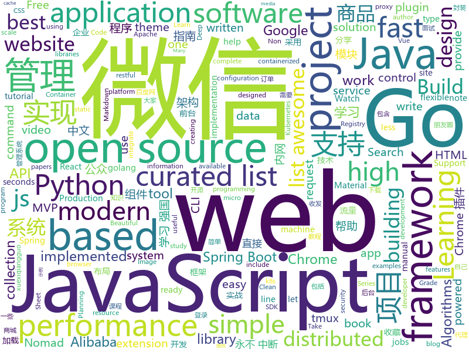

# 2019-03-25
See what the GitHub community is most excited about today.

## python
* [pyright](https://github.com/Microsoft/pyright)(**952 stars today**): Static type checker for Python
* [pytype](https://github.com/google/pytype)(**185 stars today**): A static type analyzer for Python code
* [BigGAN-PyTorch](https://github.com/ajbrock/BigGAN-PyTorch)(**150 stars today**): The author's officially unofficial PyTorch BigGAN implementation.
* [fastapi](https://github.com/tiangolo/fastapi)(**108 stars today**): FastAPI framework, high performance, easy to learn, fast to code, ready for production
* [instantbox](https://github.com/instantbox/instantbox)(**64 stars today**): Get a clean, ready-to-go Linux box in seconds.
* [ArchiveBox](https://github.com/pirate/ArchiveBox)(**62 stars today**): 🗃The open source self-hosted web archive. Takes browser history/bookmarks/Pocket/Pinboard/etc., saves HTML, JS, PDFs, media, and more...
* [awesome-python-login-model](https://github.com/CriseLYJ/awesome-python-login-model)(**56 stars today**): 😮python模拟登陆一些大型网站，还有一些简单的爬虫，希望对你们有所帮助❤️，如果喜欢记得给个star哦🌟
* [paper-tips-and-tricks](https://github.com/Wookai/paper-tips-and-tricks)(**56 stars today**): Best practice and tips & tricks to write scientific papers in LaTeX, with figures generated in Python or Matlab.
* [beagle](https://github.com/yampelo/beagle)(**54 stars today**): Beagle is an incident response and digital forensics tool which transforms security logs and data into graphs.
* [faceswap](https://github.com/deepfakes/faceswap)(**47 stars today**): Non official project based on original /r/Deepfakes thread. Many thanks to him!
* [models](https://github.com/tensorflow/models)(**40 stars today**): Models and examples built with TensorFlow
* [system-design-primer](https://github.com/donnemartin/system-design-primer)(**47 stars today**): Learn how to design large-scale systems. Prep for the system design interview. Includes Anki flashcards.
* [public-apis](https://github.com/toddmotto/public-apis)(**49 stars today**): A collective list of free APIs for use in software and web development.
* [USTC-Course](https://github.com/USTC-Resource/USTC-Course)(**44 stars today**): ❤️中国科学技术大学课程资源
* [Python](https://github.com/TheAlgorithms/Python)(**40 stars today**): All Algorithms implemented in Python
* [requests-async](https://github.com/encode/requests-async)(**44 stars today**): async-await support for `requests`.🍰
* [awesome-python](https://github.com/vinta/awesome-python)(**38 stars today**): A curated list of awesome Python frameworks, libraries, software and resources
* [planet](https://github.com/google-research/planet)(**35 stars today**): Deep Planning Network: Control from pixels by latent planning with learned dynamics
* [ChromeAppHeroes](https://github.com/zhaoolee/ChromeAppHeroes)(**35 stars today**): 🌈Chrome插件英雄榜, 为优秀的Chrome插件写一本中文说明书, 让Chrome插件英雄们造福人类~ ChromePluginHeroes, Write a Chinese manual for the excellent Chrome plugin, let the Chrome plugin heroes benefit the human~
* [flask](https://github.com/pallets/flask)(**29 stars today**): The Python micro framework for building web applications.
* [huawei2019-with-visualization](https://github.com/AkatsukiCC/huawei2019-with-visualization)(**29 stars today**): 华为2019评判器开源(提供可视化接口，方便大家调试自己的判题器)
* [keras](https://github.com/keras-team/keras)(**27 stars today**): Deep Learning for humans
* [CheatSheetSeries](https://github.com/OWASP/CheatSheetSeries)(**29 stars today**): The OWASP Cheat Sheet Series was created to provide a concise collection of high value information on specific application security topics.
* [youtube-dl](https://github.com/ytdl-org/youtube-dl)(**29 stars today**): Command-line program to download videos from YouTube.com and other video sites
* [awesome-python-applications](https://github.com/mahmoud/awesome-python-applications)(**28 stars today**): 💿Free software that works great, and also happens to be open-source Python.

## java
* [JavaGuide](https://github.com/Snailclimb/JavaGuide)(**113 stars today**): 【Java学习+面试指南】 一份涵盖大部分Java程序员所需要掌握的核心知识。
* [advanced-java](https://github.com/doocs/advanced-java)(**51 stars today**): 😮互联网 Java 工程师进阶知识完全扫盲
* [spring-boot-examples](https://github.com/ityouknow/spring-boot-examples)(**39 stars today**): about learning Spring Boot via examples. Spring Boot 教程、技术栈示例代码，快速简单上手教程。
* [tutorials](https://github.com/eugenp/tutorials)(**28 stars today**): The "REST With Spring" Course:
* [mall](https://github.com/macrozheng/mall)(**34 stars today**): mall项目是一套电商系统，包括前台商城系统及后台管理系统，基于SpringBoot+MyBatis实现。 前台商城系统包含首页门户、商品推荐、商品搜索、商品展示、购物车、订单流程、会员中心、客户服务、帮助中心等模块。 后台管理系统包含商品管理、订单管理、会员管理、促销管理、运营管理、内容管理、统计报表、财务管理、权限管理、设置等模块。
* [Java](https://github.com/TheAlgorithms/Java)(**34 stars today**): All Algorithms implemented in Java
* [halo](https://github.com/halo-dev/halo)(**37 stars today**): ✍ Halo 可能是最好的 Java 博客系统
* [spring-framework](https://github.com/spring-projects/spring-framework)(**28 stars today**): Spring Framework
* [algorithms-sedgewick-wayne](https://github.com/reneargento/algorithms-sedgewick-wayne)(**36 stars today**): Solutions to the exercises of the Algorithms book by Robert Sedgewick and Kevin Wayne
* [spring-boot](https://github.com/spring-projects/spring-boot)(**31 stars today**): Spring Boot
* [java-design-patterns](https://github.com/iluwatar/java-design-patterns)(**27 stars today**): Design patterns implemented in Java
* [SpringBoot-Learning](https://github.com/dyc87112/SpringBoot-Learning)(**27 stars today**): Spring Boot基础教程，Spring Boot 2.x版本连载中！！！
* [AIUIChatSDK](https://github.com/wowo3129/AIUIChatSDK)(**28 stars today**): AIUIChatSDK 全双工语音识别、永不中断、永不中断、永不中断
* [arthas](https://github.com/alibaba/arthas)(**26 stars today**): Alibaba Java Diagnostic Tool Arthas/Alibaba Java诊断利器Arthas
* [spring-cloud-alibaba](https://github.com/spring-cloud-incubator/spring-cloud-alibaba)(**20 stars today**): Spring Cloud Alibaba provides a one-stop solution for application development for the distributed solutions of Alibaba middleware.
* [ReverseImpl-master](https://github.com/UserChenille/ReverseImpl-master)(**22 stars today**): 
* [incubator-skywalking](https://github.com/apache/incubator-skywalking)(**22 stars today**): APM, Application Performance Monitoring System
* [FlyTour](https://github.com/geduo83/FlyTour)(**21 stars today**): Android MVP+组件化实战项目框架，工程架构采用gradle配置实现组件化，模块的架构采用典型的MVP架构，在Android项目框架搭建中中有很大的参考价值，MVP的架子直接复制粘贴到你的项目直接就能用，另外在长期的工作实践中总结整理大量的实用工具类在项目lib_common组件的util包当中
* [fescar](https://github.com/alibaba/fescar)(**17 stars today**): 🔥Fescar is an easy-to-use, high-performance, java based, open source distributed transaction solution.
* [WxJava](https://github.com/Wechat-Group/WxJava)(**19 stars today**): WxJava （微信开发 Java SDK），支持包括微信支付、开放平台、小程序、企业微信/企业号和公众号等的后端开发
* [incubator-dubbo](https://github.com/apache/incubator-dubbo)(**14 stars today**): Apache Dubbo (incubating) is a high-performance, java based, open source RPC framework.
* [RxJava](https://github.com/ReactiveX/RxJava)(**17 stars today**): RxJava – Reactive Extensions for the JVM – a library for composing asynchronous and event-based programs using observable sequences for the Java VM.
* [sofa-registry](https://github.com/alipay/sofa-registry)(**15 stars today**): SOFARegistry is a production-level, low-latency, high-availability service registry powered by Ant Financial.
* [elasticsearch](https://github.com/elastic/elasticsearch)(**14 stars today**): Open Source, Distributed, RESTful Search Engine
* [hodgepodge](https://github.com/dingshuangdian/hodgepodge)(**17 stars today**): mvvm模式+rxjava2+retrofit2+constraintlayout布局高仿腾讯新闻客户端，#视频列表滑动自动播放+recycleview复杂混合布局实现+优雅的上拉加载下拉刷新#fragment懒加载完美实现及封装

## unknown
* [Machine-Learning-Study-Path-March-2019](https://github.com/clone95/Machine-Learning-Study-Path-March-2019)(**181 stars today**): A complete ML study path, focused on TensorFlow and Scikit-Learn
* [Data-Science--Cheat-Sheet](https://github.com/abhat222/Data-Science--Cheat-Sheet)(**107 stars today**): Cheat Sheets
* [CS-Notes](https://github.com/CyC2018/CS-Notes)(**106 stars today**): 😋技术面试必备基础知识
* [open-source-jobs](https://github.com/t9tio/open-source-jobs)(**104 stars today**): Open Source Jobs: A list of Open Source projects offering jobs. For who want to work on open source and get paid.
* [SPADE](https://github.com/NVlabs/SPADE)(**79 stars today**): 
* [js-dev-reads](https://github.com/twhite96/js-dev-reads)(**71 stars today**): A list of books📚and articles📝for the discerning web developer to read.
* [You-Dont-Know-JS](https://github.com/getify/You-Dont-Know-JS)(**65 stars today**): A book series on JavaScript. @YDKJS on twitter.
* [free-programming-books](https://github.com/EbookFoundation/free-programming-books)(**54 stars today**): 📚Freely available programming books
* [gitignore](https://github.com/github/gitignore)(**45 stars today**): A collection of useful .gitignore templates
* [trackerslist](https://github.com/ngosang/trackerslist)(**43 stars today**): An updated list of public BitTorrent trackers
* [coding-interview-university](https://github.com/jwasham/coding-interview-university)(**38 stars today**): A complete computer science study plan to become a software engineer.
* [the-book-of-secret-knowledge](https://github.com/trimstray/the-book-of-secret-knowledge)(**40 stars today**): A collection of inspiring lists, manuals, cheatsheets, blogs, hacks, one-liners, cli/web tools and more.
* [go-perfbook](https://github.com/dgryski/go-perfbook)(**36 stars today**): Thoughts on Go performance optimization
* [build-your-own-x](https://github.com/danistefanovic/build-your-own-x)(**35 stars today**): 🤓Build your own (insert technology here)
* [Micro8](https://github.com/Micropoor/Micro8)(**28 stars today**): Gitbook
* [Node.js-Troubleshooting-Guide](https://github.com/aliyun-node/Node.js-Troubleshooting-Guide)(**34 stars today**): Node.js 应用线上/线下故障、压测问题和性能调优指南手册（更新中...）
* [project-based-learning](https://github.com/tuvtran/project-based-learning)(**33 stars today**): Curated list of project-based tutorials
* [awesome-uses](https://github.com/wesbos/awesome-uses)(**31 stars today**): Awesome Uses Page
* [.tmux](https://github.com/gpakosz/.tmux)(**28 stars today**): 🇫🇷Oh My Tmux! My pretty + versatile tmux configuration that just works (imho the best tmux configuration)
* [Awesome-System-for-Machine-Learning](https://github.com/HuaizhengZhang/Awesome-System-for-Machine-Learning)(**28 stars today**): A curated list of research in machine learning system. I also summarize some papers if I think they are really interesting.
* [2019](https://github.com/wwdc/2019)(**26 stars today**): Student submissions for the WWDC 2019 Scholarship
* [Daily-Interview-Question](https://github.com/Advanced-Frontend/Daily-Interview-Question)(**27 stars today**): 工作日每天一道前端大厂面试题，祝大家天天进步，一年后会看到不一样的自己。
* [awesome-deep-learning](https://github.com/ChristosChristofidis/awesome-deep-learning)(**21 stars today**): A curated list of awesome Deep Learning tutorials, projects and communities.
* [awesome-vue](https://github.com/vuejs/awesome-vue)(**25 stars today**): 🎉A curated list of awesome things related to Vue.js

## javascript
* [dropcss](https://github.com/leeoniya/dropcss)(**211 stars today**): A simple, thorough and fast unused-CSS cleaner
* [taskbook](https://github.com/klaussinani/taskbook)(**149 stars today**): 📓Tasks, boards & notes for the command-line habitat
* [KaTeX](https://github.com/KaTeX/KaTeX)(**145 stars today**): Fast math typesetting for the web.
* [griffith](https://github.com/zhihu/griffith)(**139 stars today**): A React-based web video player
* [google-unlocked](https://github.com/Ibit-to/google-unlocked)(**130 stars today**): Google Unlocked Chrome extension unlocks hidden google search results
* [vue](https://github.com/vuejs/vue)(**113 stars today**): 🖖Vue.js is a progressive, incrementally-adoptable JavaScript framework for building UI on the web.
* [laxxx](https://github.com/alexfoxy/laxxx)(**123 stars today**): Simple & light weight (2kb minified & zipped) vanilla javascript plugin to create smooth & beautiful animations when you scrolllll! Harness the power of the most intuitive interaction and make your websites come alive!
* [election-live](https://github.com/codeforthailand/election-live)(**111 stars today**): Live Scoreboard for Thai General Election 2562 (2019)
* [baiduyun](https://github.com/syhyz1990/baiduyun)(**81 stars today**): 油猴脚本 直接下载百度网盘和百度网盘分享的文件,直链下载超级加速
* [react](https://github.com/facebook/react)(**66 stars today**): A declarative, efficient, and flexible JavaScript library for building user interfaces.
* [npk](https://github.com/Coalfire-Research/npk)(**65 stars today**): A mostly-serverless distributed hash cracking platform
* [Awesome-Design-Tools](https://github.com/LisaDziuba/Awesome-Design-Tools)(**57 stars today**): The best design tools for everything.
* [30-seconds-of-code](https://github.com/30-seconds/30-seconds-of-code)(**53 stars today**): A curated collection of useful JavaScript snippets that you can understand in 30 seconds or less.
* [wechat-format](https://github.com/lyricat/wechat-format)(**50 stars today**): 微信公众号排版编辑器，转换 Markdown 到微信特制的 HTML
* [create-react-app](https://github.com/facebook/create-react-app)(**42 stars today**): Set up a modern web app by running one command.
* [javascript-algorithms](https://github.com/trekhleb/javascript-algorithms)(**42 stars today**): 📝Algorithms and data structures implemented in JavaScript with explanations and links to further readings
* [bootstrap](https://github.com/twbs/bootstrap)(**34 stars today**): The most popular HTML, CSS, and JavaScript framework for developing responsive, mobile first projects on the web.
* [library](https://github.com/nytimes/library)(**43 stars today**): A collaborative documentation site, powered by Google Docs.
* [ran-django-template](https://github.com/nature1995/ran-django-template)(**42 stars today**): 🔥An awesome Django project template for web include restful api | Author: Ziran Gong
* [untrusted](https://github.com/AlexNisnevich/untrusted)(**40 stars today**): A meta-JavaScript adventure game by Alex Nisnevich and Greg Shuflin.
* [axios](https://github.com/axios/axios)(**39 stars today**): Promise based HTTP client for the browser and node.js
* [node](https://github.com/nodejs/node)(**34 stars today**): Node.js JavaScript runtime✨🐢🚀✨
* [gatsby](https://github.com/gatsbyjs/gatsby)(**35 stars today**): Build blazing fast, modern apps and websites with React
* [next.js](https://github.com/zeit/next.js)(**35 stars today**): The React Framework
* [markdown-here](https://github.com/adam-p/markdown-here)(**33 stars today**): Google Chrome, Firefox, and Thunderbird extension that lets you write email in Markdown and render it before sending.

## html
* [WeChatAgreement.WebApi.Simple](https://github.com/changtuiqie/WeChatAgreement.WebApi.Simple)(**46 stars today**): 微信mac/ipad协议，webapi封装好的实现方案，免IIS一键部署。 可实现微信80%功能；支持62数据登录、扫码登录、收发朋友圈、查看朋友圈、微信建群、微信拉人进群、微信公众号阅读、微信消息收发、微信附近的人定位、微信添加好友、微信红包接收、微信防撤回、分享小程序、微信加粉、微信收藏、微信标签等
* [personal-website](https://github.com/github/personal-website)(**25 stars today**): Code that'll help you kickstart a personal website that showcases your work as a software developer.
* [Panda-Learning](https://github.com/Alivon/Panda-Learning)(**30 stars today**): 学习强国xuexiqiangguo--熊猫学习Panda-Learning是一个辅助学习 学习强国的程序,帮助挤不出时间，却仍然需要学习的积极分子，学习强国(xuexiqiangguo)
* [evtjs](https://github.com/everitoken/evtjs)(**16 stars today**): API Binding (SDK) for the everiToken blockchain.
* [bestofml](https://github.com/RemoteML/bestofml)(**21 stars today**): The best resources around Machine Learning
* [zju-icicles](https://github.com/QSCTech/zju-icicles)(**16 stars today**): 浙江大学课程攻略共享计划
* [lets-get-arrested](https://github.com/hamukazu/lets-get-arrested)(**12 stars today**): This project is intended to protest against the police in Japan
* [AdminLTE](https://github.com/ColorlibHQ/AdminLTE)(**10 stars today**): AdminLTE - Free Premium Admin control Panel Theme Based On Bootstrap 3.x
* [Spoon-Knife](https://github.com/octocat/Spoon-Knife)(****): This repo is for demonstration purposes only.
* [styleguide](https://github.com/google/styleguide)(**10 stars today**): Style guides for Google-originated open-source projects
* [quickchart](https://github.com/typpo/quickchart)(**11 stars today**): Google Image Charts alternative
* [flutter-in-action](https://github.com/flutterchina/flutter-in-action)(**10 stars today**): 《Flutter实战》电子书
* [wysiwyg-editor](https://github.com/froala/wysiwyg-editor)(**9 stars today**): A beautifully designed WYSIWYG HTML Editor based on HTML5.
* [startbootstrap-clean-blog-jekyll](https://github.com/BlackrockDigital/startbootstrap-clean-blog-jekyll)(**5 stars today**): A Jekyll version of the Clean Blog theme by Start Bootstrap
* [fastText](https://github.com/facebookresearch/fastText)(**6 stars today**): Library for fast text representation and classification.
* [javascript-tutorial-en](https://github.com/iliakan/javascript-tutorial-en)(**6 stars today**): Modern JavaScript Tutorial
* [micromodal](https://github.com/ghosh/micromodal)(**6 stars today**): ⭕ Tiny javascript library for creating accessible modal dialogs
* [now-github-starter](https://github.com/zeit/now-github-starter)(****): Starter project to demonstrate a project whose pull requests get automatically deployed
* [docs](https://github.com/kubernetes-csi/docs)(**5 stars today**): Documentation for CSI integration with Kubernetes
* [fonts](https://github.com/google/fonts)(**5 stars today**): Font files available from Google Fonts
* [Winds](https://github.com/GetStream/Winds)(**5 stars today**): A Beautiful Open Source RSS & Podcast App Powered by Getstream.io
* [favorites-web](https://github.com/cloudfavorites/favorites-web)(**5 stars today**): 云收藏 Spring Boot 2.0 开源项目
* [mkdocs-material](https://github.com/squidfunk/mkdocs-material)(**5 stars today**): A Material Design theme for MkDocs
* [web-profiler-bundle](https://github.com/symfony/web-profiler-bundle)(**5 stars today**): The WebProfilerBundle provides detailed technical information about each request execution and displays it in both the web debug toolbar and the profiler.
* [javascript-tutorial-zh](https://github.com/xitu/javascript-tutorial-zh)(**5 stars today**): Modern JavaScript Tutorial

## go
* [fyne](https://github.com/fyne-io/fyne)(**478 stars today**): Cross platform GUI in Go based on Material Design
* [crfs](https://github.com/google/crfs)(**181 stars today**): CRFS: Container Registry Filesystem
* [qri](https://github.com/qri-io/qri)(**175 stars today**): you're invited to a data party!
* [pipeline](https://github.com/tektoncd/pipeline)(**128 stars today**): A K8s-native Pipeline resource.
* [kubernetes](https://github.com/kubernetes/kubernetes)(**47 stars today**): Production-Grade Container Scheduling and Management
* [frp](https://github.com/fatedier/frp)(**49 stars today**): A fast reverse proxy to help you expose a local server behind a NAT or firewall to the internet.
* [ko](https://github.com/google/ko)(**51 stars today**): Build and deploy Go applications on Kubernetes
* [nps](https://github.com/cnlh/nps)(**50 stars today**): 一款轻量级、功能强大的内网穿透代理服务器。支持tcp、udp流量转发，支持内网http代理、内网socks5代理，同时支持snappy压缩（节省带宽和流量）、站点保护、加密传输、多路复用、header修改等。支持web图形化管理。
* [go](https://github.com/golang/go)(**44 stars today**): The Go programming language
* [corrupter](https://github.com/r00tman/corrupter)(**49 stars today**): Simple image glitcher suitable for producing nice looking lockscreens
* [kaf](https://github.com/infinimesh/kaf)(**41 stars today**): Modern CLI for Apache Kafka, written in Go.
* [awesome-go](https://github.com/avelino/awesome-go)(**38 stars today**): A curated list of awesome Go frameworks, libraries and software
* [kache](https://github.com/kasvith/kache)(**35 stars today**): A simple in memory cache written using go
* [pipehub](https://github.com/pipehub/pipehub)(**35 stars today**): A programmable proxy server
* [gin](https://github.com/gin-gonic/gin)(**34 stars today**): Gin is a HTTP web framework written in Go (Golang). It features a Martini-like API with much better performance -- up to 40 times faster. If you need smashing performance, get yourself some Gin.
* [GMDB](https://github.com/Dentrax/GMDB)(**28 stars today**): GMDB is the ultra-simple, open-source, cross-platform Movie Library with Features (Search, Take Note, Watch Later, Like, Import, Learn, Instantly Torrent Magnet Watch)
* [k3s](https://github.com/rancher/k3s)(**27 stars today**): Lightweight Kubernetes. 5 less than k8s.
* [nomad](https://github.com/hashicorp/nomad)(**25 stars today**): Nomad is a flexible, enterprise-grade cluster scheduler designed to easily integrate into existing workflows. Nomad can run a diverse workload of micro-service, batch, containerized and non-containerized applications. Nomad is easy to operate and scale and integrates seamlessly with Consul and Vault.
* [istio](https://github.com/istio/istio)(**23 stars today**): Connect, secure, control, and observe services.
* [V](https://github.com/vlang-io/V)(**24 stars today**): Simple, fast, safe, compiled language for creating maintainable software. Supports translation from C/C++.
* [the-way-to-go_ZH_CN](https://github.com/Unknwon/the-way-to-go_ZH_CN)(**22 stars today**): 《The Way to Go》中文译本，中文正式名《Go 入门指南》
* [cobra](https://github.com/spf13/cobra)(**22 stars today**): A Commander for modern Go CLI interactions
* [hugo](https://github.com/gohugoio/hugo)(**20 stars today**): The world’s fastest framework for building websites.
* [build-web-application-with-golang](https://github.com/astaxie/build-web-application-with-golang)(**17 stars today**): A golang ebook intro how to build a web with golang
* [go-ethereum](https://github.com/ethereum/go-ethereum)(**17 stars today**): Official Go implementation of the Ethereum protocol

## WordCloud

