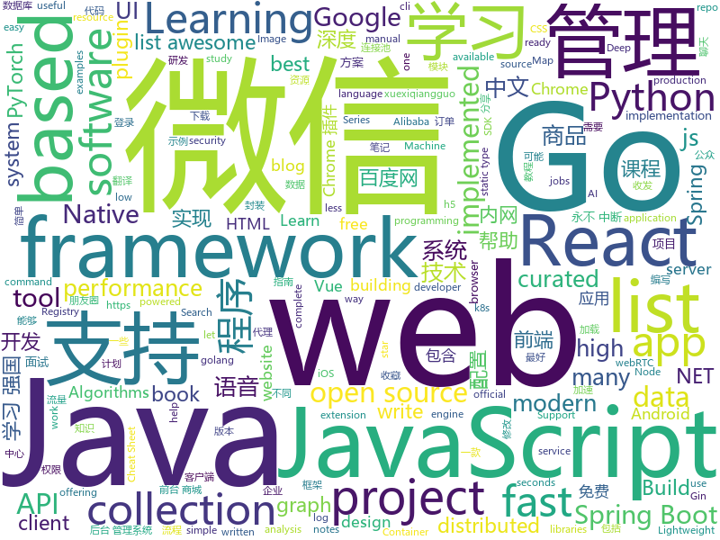

# 2019-03-26
See what the GitHub community is most excited about today.

## python
* [pyright](https://github.com/Microsoft/pyright)(**588 stars today**): Static type checker for Python
* [instantbox](https://github.com/instantbox/instantbox)(**339 stars today**): Get a clean, ready-to-go Linux box in seconds.
* [pytype](https://github.com/google/pytype)(**251 stars today**): A static type analyzer for Python code
* [beagle](https://github.com/yampelo/beagle)(**191 stars today**): Beagle is an incident response and digital forensics tool which transforms security logs and data into graphs.
* [prefect](https://github.com/PrefectHQ/prefect)(**172 stars today**): The Prefect Core automation engine
* [awesome-python-login-model](https://github.com/CriseLYJ/awesome-python-login-model)(**132 stars today**): 😮python模拟登陆一些大型网站，还有一些简单的爬虫，希望对你们有所帮助❤️，如果喜欢记得给个star哦🌟
* [BigGAN-PyTorch](https://github.com/ajbrock/BigGAN-PyTorch)(**138 stars today**): The author's officially unofficial PyTorch BigGAN implementation.
* [faceswap](https://github.com/deepfakes/faceswap)(**102 stars today**): Non official project based on original /r/Deepfakes thread. Many thanks to him!
* [models](https://github.com/tensorflow/models)(**61 stars today**): Models and examples built with TensorFlow
* [voicefilter](https://github.com/mindslab-ai/voicefilter)(**85 stars today**): Unofficial PyTorch implementation of Google AI's VoiceFilter system
* [public-apis](https://github.com/toddmotto/public-apis)(**77 stars today**): A collective list of free APIs for use in software and web development.
* [USTC-Course](https://github.com/USTC-Resource/USTC-Course)(**71 stars today**): ❤️中国科学技术大学课程资源
* [awesome-python](https://github.com/vinta/awesome-python)(**64 stars today**): A curated list of awesome Python frameworks, libraries, software and resources
* [Algorithm_Interview_Notes-Chinese](https://github.com/imhuay/Algorithm_Interview_Notes-Chinese)(**61 stars today**): 2018/2019/校招/春招/秋招/算法/机器学习(Machine Learning)/深度学习(Deep Learning)/自然语言处理(NLP)/C/C++/Python/面试笔记
* [system-design-primer](https://github.com/donnemartin/system-design-primer)(**62 stars today**): Learn how to design large-scale systems. Prep for the system design interview. Includes Anki flashcards.
* [paper-tips-and-tricks](https://github.com/Wookai/paper-tips-and-tricks)(**64 stars today**): Best practice and tips & tricks to write scientific papers in LaTeX, with figures generated in Python or Matlab.
* [Python](https://github.com/TheAlgorithms/Python)(**52 stars today**): All Algorithms implemented in Python
* [fastapi](https://github.com/tiangolo/fastapi)(**57 stars today**): FastAPI framework, high performance, easy to learn, fast to code, ready for production
* [ChromeAppHeroes](https://github.com/zhaoolee/ChromeAppHeroes)(**50 stars today**): 🌈Chrome插件英雄榜, 为优秀的Chrome插件写一本中文说明书, 让Chrome插件英雄们造福人类~ ChromePluginHeroes, Write a Chinese manual for the excellent Chrome plugin, let the Chrome plugin heroes benefit the human~
* [CapsGNN](https://github.com/benedekrozemberczki/CapsGNN)(**49 stars today**): A PyTorch implementation of "Capsule Graph Neural Network" (ICLR 2019).
* [requests-async](https://github.com/encode/requests-async)(**50 stars today**): async-await support for `requests`.🍰
* [keras](https://github.com/keras-team/keras)(**45 stars today**): Deep Learning for humans
* [django-rest-framework](https://github.com/encode/django-rest-framework)(**34 stars today**): Web APIs for Django.⚡️
* [CheatSheetSeries](https://github.com/OWASP/CheatSheetSeries)(**39 stars today**): The OWASP Cheat Sheet Series was created to provide a concise collection of high value information on specific application security topics.
* [ArchiveBox](https://github.com/pirate/ArchiveBox)(**41 stars today**): 🗃The open source self-hosted web archive. Takes browser history/bookmarks/Pocket/Pinboard/etc., saves HTML, JS, PDFs, media, and more...

## java
* [Gloading](https://github.com/luckybilly/Gloading)(**108 stars today**): Show global loading status view in a low coupling way for Android App(深度解耦Android App中全局加载中、加载失败及空数据视图)
* [spring-boot-examples](https://github.com/ityouknow/spring-boot-examples)(**96 stars today**): about learning Spring Boot via examples. Spring Boot 教程、技术栈示例代码，快速简单上手教程。
* [light-4j](https://github.com/networknt/light-4j)(**100 stars today**): A fast, lightweight and more productive microservices framework
* [mall](https://github.com/macrozheng/mall)(**85 stars today**): mall项目是一套电商系统，包括前台商城系统及后台管理系统，基于SpringBoot+MyBatis实现。 前台商城系统包含首页门户、商品推荐、商品搜索、商品展示、购物车、订单流程、会员中心、客户服务、帮助中心等模块。 后台管理系统包含商品管理、订单管理、会员管理、促销管理、运营管理、内容管理、统计报表、财务管理、权限管理、设置等模块。
* [advanced-java](https://github.com/doocs/advanced-java)(**81 stars today**): 😮互联网 Java 工程师进阶知识完全扫盲
* [SpringBoot-Learning](https://github.com/dyc87112/SpringBoot-Learning)(**74 stars today**): Spring Boot基础教程，Spring Boot 2.x版本连载中！！！
* [spring-boot](https://github.com/spring-projects/spring-boot)(**53 stars today**): Spring Boot
* [tutorials](https://github.com/eugenp/tutorials)(**37 stars today**): The "REST With Spring" Course:
* [quarkus](https://github.com/quarkusio/quarkus)(**58 stars today**): Quarkus: Supersonic Subatomic Java.
* [arthas](https://github.com/alibaba/arthas)(**48 stars today**): Alibaba Java Diagnostic Tool Arthas/Alibaba Java诊断利器Arthas
* [java-design-patterns](https://github.com/iluwatar/java-design-patterns)(**45 stars today**): Design patterns implemented in Java
* [Java](https://github.com/TheAlgorithms/Java)(**41 stars today**): All Algorithms implemented in Java
* [elasticsearch](https://github.com/elastic/elasticsearch)(**38 stars today**): Open Source, Distributed, RESTful Search Engine
* [spring-framework](https://github.com/spring-projects/spring-framework)(**26 stars today**): Spring Framework
* [fescar](https://github.com/alibaba/fescar)(**39 stars today**): 🔥Fescar is an easy-to-use, high-performance, java based, open source distributed transaction solution.
* [AIUIChatSDK](https://github.com/wowo3129/AIUIChatSDK)(**43 stars today**): 语音方案选型 ： AIUIChatSDK 全双工语音识别、永不中断、永不中断、永不中断，包含新旧版本的讯飞语音SDK的封装
* [WxJava](https://github.com/Wechat-Group/WxJava)(**31 stars today**): WxJava （微信开发 Java SDK），支持包括微信支付、开放平台、小程序、企业微信/企业号和公众号等的后端开发
* [apollo](https://github.com/ctripcorp/apollo)(**35 stars today**): Apollo（阿波罗）是携程框架部门研发的分布式配置中心，能够集中化管理应用不同环境、不同集群的配置，配置修改后能够实时推送到应用端，并且具备规范的权限、流程治理等特性，适用于微服务配置管理场景。
* [kroki](https://github.com/yuzutech/kroki)(**39 stars today**): Convert plain text diagrams to images !
* [DoraemonKit](https://github.com/didi/DoraemonKit)(**35 stars today**): 简称 "DoKit" 。一款功能齐全的客户端（ iOS 、Android ）研发助手，你值得拥有。
* [myexcel](https://github.com/liaochong/myexcel)(**33 stars today**): MyExcel，Excel操作新方式！
* [sofa-registry](https://github.com/alipay/sofa-registry)(**31 stars today**): SOFARegistry is a production-level, low-latency, high-availability service registry powered by Ant Financial.
* [redisson](https://github.com/redisson/redisson)(**27 stars today**): Redisson - distributed Java objects and services (Set, Multimap, SortedSet, Map, List, Queue, Deque, Semaphore, Lock, AtomicLong, Map Reduce, Publish / Subscribe, Bloom filter, Spring Cache, Tomcat, Scheduler, JCache API, Hibernate) on top of Redis server. State of the Art Redis Java client
* [halo](https://github.com/halo-dev/halo)(**25 stars today**): ✍ Halo 可能是最好的 Java 博客系统
* [druid](https://github.com/alibaba/druid)(**25 stars today**): 阿里巴巴数据库事业部出品，为监控而生的数据库连接池。阿里云Data Lake Analytics(https://www.aliyun.com/product/datalakeanalytics )、DRDS、TDDL 连接池powered by Druid

## unknown
* [Data-Science-Study-Paths-March-2019](https://github.com/clone95/Data-Science-Study-Paths-March-2019)(**732 stars today**): A complete ML study path, focused on TensorFlow and Scikit-Learn
* [JavaGuide](https://github.com/Snailclimb/JavaGuide)(**178 stars today**): 【Java学习+面试指南】 一份涵盖大部分Java程序员所需要掌握的核心知识。
* [CS-Notes](https://github.com/CyC2018/CS-Notes)(**108 stars today**): 😋技术面试必备基础知识
* [TNFE-Weekly](https://github.com/Tnfe/TNFE-Weekly)(**124 stars today**): 每周为你提供高质量的关于小程序、h5等前端领域的文章和项目
* [gitignore](https://github.com/github/gitignore)(**75 stars today**): A collection of useful .gitignore templates
* [SPADE](https://github.com/NVlabs/SPADE)(**91 stars today**): 
* [open-source-jobs](https://github.com/t9tio/open-source-jobs)(**86 stars today**): Open Source Jobs: A list of Open Source projects offering jobs. For who want to work on open source and get paid.
* [You-Dont-Know-JS](https://github.com/getify/You-Dont-Know-JS)(**75 stars today**): A book series on JavaScript. @YDKJS on twitter.
* [free-programming-books](https://github.com/EbookFoundation/free-programming-books)(**68 stars today**): 📚Freely available programming books
* [free-programming-books-zh_CN](https://github.com/justjavac/free-programming-books-zh_CN)(**66 stars today**): 📚免费的计算机编程类中文书籍，欢迎投稿
* [js-dev-reads](https://github.com/twhite96/js-dev-reads)(**69 stars today**): A list of books📚and articles📝for the discerning web developer to read.
* [gold-miner](https://github.com/xitu/gold-miner)(**63 stars today**): 🥇掘金翻译计划，可能是世界最大最好的英译中技术社区，最懂读者和译者的翻译平台：
* [architect-awesome](https://github.com/xingshaocheng/architect-awesome)(**49 stars today**): 后端架构师技术图谱
* [coding-interview-university](https://github.com/jwasham/coding-interview-university)(**53 stars today**): A complete computer science study plan to become a software engineer.
* [Data-Science--Cheat-Sheet](https://github.com/abhat222/Data-Science--Cheat-Sheet)(**52 stars today**): Cheat Sheets
* [weekly](https://github.com/dt-fe/weekly)(**51 stars today**): 前端精读周刊
* [Daily-Interview-Question](https://github.com/Advanced-Frontend/Daily-Interview-Question)(**47 stars today**): 工作日每天一道前端大厂面试题，祝大家天天进步，一年后会看到不一样的自己。
* [awesome-brazilian-devblogs](https://github.com/Wmitrut/awesome-brazilian-devblogs)(**46 stars today**): 🇧🇷-🤘Curadoria de blogs em português brasileiro sobre desenvolvimento
* [awesome-vue](https://github.com/vuejs/awesome-vue)(**44 stars today**): 🎉A curated list of awesome things related to Vue.js
* [the-book-of-secret-knowledge](https://github.com/trimstray/the-book-of-secret-knowledge)(**44 stars today**): A collection of inspiring lists, manuals, cheatsheets, blogs, hacks, one-liners, cli/web tools and more.
* [2019](https://github.com/wwdc/2019)(**35 stars today**): Student submissions for the WWDC 2019 Scholarship
* [trackerslist](https://github.com/ngosang/trackerslist)(**40 stars today**): An updated list of public BitTorrent trackers
* [cvpr2019](https://github.com/extreme-assistant/cvpr2019)(**39 stars today**): cvpr2019 papers
* [awesome-knowledge-graph](https://github.com/shaoxiongji/awesome-knowledge-graph)(**40 stars today**): A collection of knowledge graph papers and reading notes.

## javascript
* [griffith](https://github.com/zhihu/griffith)(**307 stars today**): A React-based web video player
* [laxxx](https://github.com/alexfoxy/laxxx)(**254 stars today**): Simple & light weight (2kb minified & zipped) vanilla javascript plugin to create smooth & beautiful animations when you scrolllll! Harness the power of the most intuitive interaction and make your websites come alive!
* [dropcss](https://github.com/leeoniya/dropcss)(**222 stars today**): A simple, thorough and fast unused-CSS cleaner
* [vue](https://github.com/vuejs/vue)(**200 stars today**): 🖖Vue.js is a progressive, incrementally-adoptable JavaScript framework for building UI on the web.
* [taskbook](https://github.com/klaussinani/taskbook)(**187 stars today**): 📓Tasks, boards & notes for the command-line habitat
* [KaTeX](https://github.com/KaTeX/KaTeX)(**159 stars today**): Fast math typesetting for the web.
* [CyberChef](https://github.com/gchq/CyberChef)(**131 stars today**): The Cyber Swiss Army Knife - a web app for encryption, encoding, compression and data analysis
* [baiduyun](https://github.com/syhyz1990/baiduyun)(**121 stars today**): 油猴脚本 直接下载百度网盘和百度网盘分享的文件,直链下载超级加速
* [storybook](https://github.com/storybooks/storybook)(**115 stars today**): UI component dev & test: React, Vue, Angular, React Native, Ember & more!
* [election-live](https://github.com/codeforthailand/election-live)(**101 stars today**): Live Scoreboard for Thai General Election 2562 (2019)
* [react](https://github.com/facebook/react)(**89 stars today**): A declarative, efficient, and flexible JavaScript library for building user interfaces.
* [30-seconds-of-code](https://github.com/30-seconds/30-seconds-of-code)(**91 stars today**): A curated collection of useful JavaScript snippets that you can understand in 30 seconds or less.
* [google-unlocked](https://github.com/Ibit-to/google-unlocked)(**81 stars today**): Google Unlocked browser extension uncensor google search results
* [Awesome-Design-Tools](https://github.com/LisaDziuba/Awesome-Design-Tools)(**71 stars today**): The best design tools for everything👉
* [taro](https://github.com/NervJS/taro)(**64 stars today**): 多端统一开发框架，支持用 React 的开发方式编写一次代码，生成能运行在微信/百度/支付宝/字节跳动小程序、H5、React Native 等的应用。 https://taro.js.org/
* [javascript-algorithms](https://github.com/trekhleb/javascript-algorithms)(**55 stars today**): 📝Algorithms and data structures implemented in JavaScript with explanations and links to further readings
* [axios](https://github.com/axios/axios)(**58 stars today**): Promise based HTTP client for the browser and node.js
* [create-react-app](https://github.com/facebook/create-react-app)(**53 stars today**): Set up a modern web app by running one command.
* [bootstrap](https://github.com/twbs/bootstrap)(**40 stars today**): The most popular HTML, CSS, and JavaScript framework for developing responsive, mobile first projects on the web.
* [gatsby](https://github.com/gatsbyjs/gatsby)(**50 stars today**): Build blazing fast, modern apps and websites with React
* [markdown-here](https://github.com/adam-p/markdown-here)(**52 stars today**): Google Chrome, Firefox, and Thunderbird extension that lets you write email in Markdown and render it before sending.
* [react-native](https://github.com/facebook/react-native)(**43 stars today**): A framework for building native apps with React.
* [three.js](https://github.com/mrdoob/three.js)(**40 stars today**): JavaScript 3D library.
* [node](https://github.com/nodejs/node)(**38 stars today**): Node.js JavaScript runtime✨🐢🚀✨
* [next.js](https://github.com/zeit/next.js)(**39 stars today**): The React Framework

## html
* [WeChatAgreement.WebApi.Simple](https://github.com/changtuiqie/WeChatAgreement.WebApi.Simple)(**88 stars today**): 微信mac/ipad协议，webapi封装好的实现方案，免IIS一键部署。 可实现微信80%功能；支持62数据登录、扫码登录、收发朋友圈、查看朋友圈、微信建群、微信拉人进群、微信公众号阅读、微信消息收发、微信附近的人定位、微信添加好友、微信红包接收、微信防撤回、分享小程序、微信加粉、微信收藏、微信标签等
* [Panda-Learning](https://github.com/Alivon/Panda-Learning)(**46 stars today**): 学习强国xuexiqiangguo--熊猫学习Panda-Learning是一个辅助学习 学习强国的程序,帮助挤不出时间，却仍然需要学习的积极分子，学习强国(xuexiqiangguo)
* [lets-get-arrested](https://github.com/hamukazu/lets-get-arrested)(**42 stars today**): This project is intended to protest against the police in Japan
* [personal-website](https://github.com/github/personal-website)(**32 stars today**): Code that'll help you kickstart a personal website that showcases your work as a software developer.
* [AdminLTE](https://github.com/ColorlibHQ/AdminLTE)(**29 stars today**): AdminLTE - Free Premium Admin control Panel Theme Based On Bootstrap 3.x
* [styleguide](https://github.com/google/styleguide)(**26 stars today**): Style guides for Google-originated open-source projects
* [bestofml](https://github.com/RemoteML/bestofml)(**25 stars today**): The best resources around Machine Learning
* [deeplearning_ai_books](https://github.com/fengdu78/deeplearning_ai_books)(**13 stars today**): deeplearning.ai（吴恩达老师的深度学习课程笔记及资源）
* [zju-icicles](https://github.com/QSCTech/zju-icicles)(**15 stars today**): 浙江大学课程攻略共享计划
* [Spoon-Knife](https://github.com/octocat/Spoon-Knife)(****): This repo is for demonstration purposes only.
* [flutter-in-action](https://github.com/flutterchina/flutter-in-action)(**17 stars today**): 《Flutter实战》电子书
* [javascript-tutorial-en](https://github.com/iliakan/javascript-tutorial-en)(**15 stars today**): Modern JavaScript Tutorial
* [swagger-codegen](https://github.com/swagger-api/swagger-codegen)(**13 stars today**): swagger-codegen contains a template-driven engine to generate documentation, API clients and server stubs in different languages by parsing your OpenAPI / Swagger definition.
* [starrtc-android-demo](https://github.com/starrtc/starrtc-android-demo)(**13 stars today**): 🚀starRTC，免费IM（含单聊，群聊，聊天室），免费一对一视频聊天（回音消除），语音聊天，直播连麦，白板，小班课，多人会议，局域网无服务器直连，兼容webRTC, 支持webRTC加速，P2P高清传输，安卓、iOS、web互通，支持门禁可视对讲，电视盒子，树莓派，海思，全志，OTT设备，C语言自研方案，✨万水千山总是情，来个star行不行✨，更多示例请访问：
* [qiubaiying.github.io](https://github.com/qiubaiying/qiubaiying.github.io)(**5 stars today**): BY Blog ->
* [free-for-dev](https://github.com/ripienaar/free-for-dev)(**10 stars today**): A list of SaaS, PaaS and IaaS offerings that have free tiers of interest to devops and infradev
* [quickchart](https://github.com/typpo/quickchart)(**10 stars today**): Google Image Charts alternative
* [ecma262](https://github.com/tc39/ecma262)(**10 stars today**): Status, process, and documents for ECMA262
* [devops-essentials-sample-app](https://github.com/linuxacademy/devops-essentials-sample-app)(****): 
* [favorites-web](https://github.com/cloudfavorites/favorites-web)(**9 stars today**): 云收藏 Spring Boot 2.0 开源项目
* [portainer](https://github.com/portainer/portainer)(**9 stars today**): Simple management UI for Docker
* [typedoc](https://github.com/TypeStrong/typedoc)(**8 stars today**): Documentation generator for TypeScript projects.
* [wysiwyg-editor](https://github.com/froala/wysiwyg-editor)(**8 stars today**): A beautifully designed WYSIWYG HTML Editor based on HTML5.
* [fonts](https://github.com/google/fonts)(**8 stars today**): Font files available from Google Fonts
* [dotnet](https://github.com/Microsoft/dotnet)(**7 stars today**): This repo is the official home of .NET on GitHub. It's a great starting point to find many .NET OSS projects from Microsoft and the community, including many that are part of the .NET Foundation.

## go
* [fyne](https://github.com/fyne-io/fyne)(**1,156 stars today**): Cross platform GUI in Go based on Material Design
* [red](https://github.com/antonmedv/red)(**228 stars today**): Terminal log analysis tools
* [pipeline](https://github.com/tektoncd/pipeline)(**194 stars today**): A K8s-native Pipeline resource.
* [crfs](https://github.com/google/crfs)(**163 stars today**): CRFS: Container Registry Filesystem
* [Golang-Project-Structure](https://github.com/Mindinventory/Golang-Project-Structure)(**63 stars today**): Golang Skeleton with fully version managed
* [kubernetes](https://github.com/kubernetes/kubernetes)(**66 stars today**): Production-Grade Container Scheduling and Management
* [Golang-Paytm](https://github.com/Mindinventory/Golang-Paytm)(**54 stars today**): Golang Paytm Intergration Library
* [Golang-PayU](https://github.com/Mindinventory/Golang-PayU)(**51 stars today**): Golang Payu Integration
* [Golang-HTMLTOPDF-Converter](https://github.com/Mindinventory/Golang-HTMLTOPDF-Converter)(**50 stars today**): Golang HTMLTOPDF Converter
* [qri](https://github.com/qri-io/qri)(**65 stars today**): you're invited to a data party!
* [nps](https://github.com/cnlh/nps)(**62 stars today**): 一款轻量级、功能强大的内网穿透代理服务器。支持tcp、udp流量转发，支持内网http代理、内网socks5代理，同时支持snappy压缩（节省带宽和流量）、站点保护、加密传输、多路复用、header修改等。支持web图形化管理。
* [frp](https://github.com/fatedier/frp)(**57 stars today**): A fast reverse proxy to help you expose a local server behind a NAT or firewall to the internet.
* [baxx](https://github.com/jackdoe/baxx)(**52 stars today**): ssh register@ui.baxx.dev
* [go](https://github.com/golang/go)(**48 stars today**): The Go programming language
* [V](https://github.com/vlang-io/V)(**50 stars today**): Simple, fast, safe, compiled language for creating maintainable software. Supports translation from C/C++.
* [kaf](https://github.com/infinimesh/kaf)(**48 stars today**): Modern CLI for Apache Kafka, written in Go.
* [k3s](https://github.com/rancher/k3s)(**46 stars today**): Lightweight Kubernetes. 5 less than k8s.
* [ko](https://github.com/google/ko)(**47 stars today**): Build and deploy Go applications on Kubernetes
* [awesome-go](https://github.com/avelino/awesome-go)(**43 stars today**): A curated list of awesome Go frameworks, libraries and software
* [BaiduPCS-Go](https://github.com/iikira/BaiduPCS-Go)(**39 stars today**): 百度网盘客户端 - Go语言编写
* [traefik](https://github.com/containous/traefik)(**34 stars today**): The Cloud Native Edge Router
* [the-way-to-go_ZH_CN](https://github.com/Unknwon/the-way-to-go_ZH_CN)(**31 stars today**): 《The Way to Go》中文译本，中文正式名《Go 入门指南》
* [build-web-application-with-golang](https://github.com/astaxie/build-web-application-with-golang)(**33 stars today**): A golang ebook intro how to build a web with golang
* [GoUnix](https://github.com/aporcupine/GoUnix)(**34 stars today**): This project is a collection of many of the basic tools used on Unix-like operating systems implemented in Go as a learning exercize.
* [gin](https://github.com/gin-gonic/gin)(**33 stars today**): Gin is a HTTP web framework written in Go (Golang). It features a Martini-like API with much better performance -- up to 40 times faster. If you need smashing performance, get yourself some Gin.

## WordCloud

