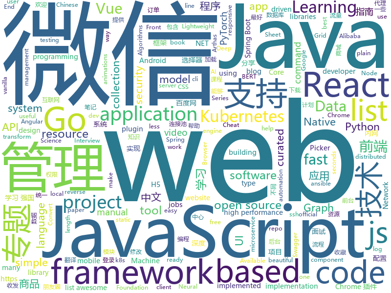

# 2019-03-27
See what the GitHub community is most excited about today.

## python
* [pyright](https://github.com/Microsoft/pyright)(**336 stars today**): Static type checker for Python
* [automl-gs](https://github.com/minimaxir/automl-gs)(**324 stars today**): Provide an input CSV and a target field to predict, generate a model + code to run it.
* [instantbox](https://github.com/instantbox/instantbox)(**205 stars today**): Get a clean, ready-to-go Linux box in seconds.
* [prefect](https://github.com/PrefectHQ/prefect)(**177 stars today**): The Prefect Core automation engine
* [awesome-python-login-model](https://github.com/CriseLYJ/awesome-python-login-model)(**127 stars today**): 😮python模拟登陆一些大型网站，还有一些简单的爬虫，希望对你们有所帮助❤️，如果喜欢记得给个star哦🌟
* [beagle](https://github.com/yampelo/beagle)(**107 stars today**): Beagle is an incident response and digital forensics tool which transforms security logs and data into graphs.
* [models](https://github.com/tensorflow/models)(**79 stars today**): Models and examples built with TensorFlow
* [system-design-primer](https://github.com/donnemartin/system-design-primer)(**100 stars today**): Learn how to design large-scale systems. Prep for the system design interview. Includes Anki flashcards.
* [Algorithm_Interview_Notes-Chinese](https://github.com/imhuay/Algorithm_Interview_Notes-Chinese)(**81 stars today**): 2018/2019/校招/春招/秋招/算法/机器学习(Machine Learning)/深度学习(Deep Learning)/自然语言处理(NLP)/C/C++/Python/面试笔记
* [pytype](https://github.com/google/pytype)(**85 stars today**): A static type analyzer for Python code
* [CapsGNN](https://github.com/benedekrozemberczki/CapsGNN)(**79 stars today**): A PyTorch implementation of "Capsule Graph Neural Network" (ICLR 2019).
* [bert-as-service](https://github.com/hanxiao/bert-as-service)(**66 stars today**): Mapping a variable-length sentence to a fixed-length vector using BERT model
* [awesome-python](https://github.com/vinta/awesome-python)(**65 stars today**): A curated list of awesome Python frameworks, libraries, software and resources
* [public-apis](https://github.com/toddmotto/public-apis)(**62 stars today**): A collective list of free APIs for use in software and web development.
* [faceswap](https://github.com/deepfakes/faceswap)(**57 stars today**): Non official project based on original /r/Deepfakes thread. Many thanks to him!
* [tldr](https://github.com/tldr-pages/tldr)(**58 stars today**): 📚Simplified and community-driven man pages
* [voicefilter](https://github.com/mindslab-ai/voicefilter)(**54 stars today**): Unofficial PyTorch implementation of Google AI's VoiceFilter system
* [bert](https://github.com/google-research/bert)(**48 stars today**): TensorFlow code and pre-trained models for BERT
* [CheatSheetSeries](https://github.com/OWASP/CheatSheetSeries)(**52 stars today**): The OWASP Cheat Sheet Series was created to provide a concise collection of high value information on specific application security topics.
* [ChromeAppHeroes](https://github.com/zhaoolee/ChromeAppHeroes)(**49 stars today**): 🌈Chrome插件英雄榜, 为优秀的Chrome插件写一本中文说明书, 让Chrome插件英雄们造福人类~ ChromePluginHeroes, Write a Chinese manual for the excellent Chrome plugin, let the Chrome plugin heroes benefit the human~
* [BertSum](https://github.com/nlpyang/BertSum)(**47 stars today**): Code for paper Fine-tune BERT for Extractive Summarization
* [fastapi](https://github.com/tiangolo/fastapi)(**45 stars today**): FastAPI framework, high performance, easy to learn, fast to code, ready for production
* [ansible](https://github.com/ansible/ansible)(**31 stars today**): Ansible is a radically simple IT automation platform that makes your applications and systems easier to deploy. Avoid writing scripts or custom code to deploy and update your applications — automate in a language that approaches plain English, using SSH, with no agents to install on remote systems. https://docs.ansible.com/ansible/
* [BigGAN-PyTorch](https://github.com/ajbrock/BigGAN-PyTorch)(**44 stars today**): The author's officially unofficial PyTorch BigGAN implementation.
* [youtube-dl](https://github.com/ytdl-org/youtube-dl)(****): Command-line program to download videos from YouTube.com and other video sites

## java
* [Gloading](https://github.com/luckybilly/Gloading)(**151 stars today**): Show global loading status view in a low coupling way for Android App(深度解耦Android App中全局加载中、加载失败及空数据视图)
* [advanced-java](https://github.com/doocs/advanced-java)(**126 stars today**): 😮互联网 Java 工程师进阶知识完全扫盲
* [kroki](https://github.com/yuzutech/kroki)(**133 stars today**): Convert plain text diagrams to images !
* [light-4j](https://github.com/networknt/light-4j)(**97 stars today**): A fast, lightweight and more productive microservices framework
* [mall](https://github.com/macrozheng/mall)(**75 stars today**): mall项目是一套电商系统，包括前台商城系统及后台管理系统，基于SpringBoot+MyBatis实现。 前台商城系统包含首页门户、商品推荐、商品搜索、商品展示、购物车、订单流程、会员中心、客户服务、帮助中心等模块。 后台管理系统包含商品管理、订单管理、会员管理、促销管理、运营管理、内容管理、统计报表、财务管理、权限管理、设置等模块。
* [SpringBoot-Learning](https://github.com/dyc87112/SpringBoot-Learning)(**72 stars today**): Spring Boot基础教程，Spring Boot 2.x版本连载中！！！
* [quarkus](https://github.com/quarkusio/quarkus)(**64 stars today**): Quarkus: Supersonic Subatomic Java.
* [spring-boot](https://github.com/spring-projects/spring-boot)(**49 stars today**): Spring Boot
* [java-design-patterns](https://github.com/iluwatar/java-design-patterns)(**53 stars today**): Design patterns implemented in Java
* [fescar](https://github.com/alibaba/fescar)(**52 stars today**): 🔥Fescar is an easy-to-use, high-performance, java based, open source distributed transaction solution.
* [Java](https://github.com/TheAlgorithms/Java)(**43 stars today**): All Algorithms implemented in Java
* [spring-framework](https://github.com/spring-projects/spring-framework)(**34 stars today**): Spring Framework
* [tutorials](https://github.com/eugenp/tutorials)(**24 stars today**): The "REST With Spring" Course:
* [arthas](https://github.com/alibaba/arthas)(**42 stars today**): Alibaba Java Diagnostic Tool Arthas/Alibaba Java诊断利器Arthas
* [JCSprout](https://github.com/crossoverJie/JCSprout)(**39 stars today**): 👨‍🎓Java Core Sprout : basic, concurrent, algorithm
* [elasticsearch](https://github.com/elastic/elasticsearch)(**38 stars today**): Open Source, Distributed, RESTful Search Engine
* [apollo](https://github.com/ctripcorp/apollo)(**34 stars today**): Apollo（阿波罗）是携程框架部门研发的分布式配置中心，能够集中化管理应用不同环境、不同集群的配置，配置修改后能够实时推送到应用端，并且具备规范的权限、流程治理等特性，适用于微服务配置管理场景。
* [Spark-Demo](https://github.com/Zh1Cheung/Spark-Demo)(**38 stars today**): Spark Tutorial
* [druid](https://github.com/alibaba/druid)(**35 stars today**): 阿里巴巴数据库事业部出品，为监控而生的数据库连接池。阿里云Data Lake Analytics(https://www.aliyun.com/product/datalakeanalytics )、DRDS、TDDL 连接池powered by Druid
* [incubator-skywalking](https://github.com/apache/incubator-skywalking)(**35 stars today**): APM, Application Performance Monitoring System
* [pickerview](https://github.com/jaaksi/pickerview)(**34 stars today**): One very very user-friendly Picker library（内部提供3种常用类型的Picker：时间选择器，聚合的时间选择器和联动选择器。支持扩展自定义Picker。）
* [guava](https://github.com/google/guava)(**29 stars today**): Google core libraries for Java
* [incubator-dubbo](https://github.com/apache/incubator-dubbo)(**26 stars today**): Apache Dubbo (incubating) is a high-performance, java based, open source RPC framework.
* [netty](https://github.com/netty/netty)(**28 stars today**): Netty project - an event-driven asynchronous network application framework
* [lottie-android](https://github.com/airbnb/lottie-android)(**28 stars today**): Render After Effects animations natively on Android and iOS, Web, and React Native

## unknown
* [Virgilio](https://github.com/clone95/Virgilio)(**846 stars today**): Your new Mentor for Data Science E-Learning.
* [TNFE-Weekly](https://github.com/Tnfe/TNFE-Weekly)(**581 stars today**): 每周为你提供高质量的关于小程序、h5等前端领域的文章和项目
* [JavaGuide](https://github.com/Snailclimb/JavaGuide)(**169 stars today**): 【Java学习+面试指南】 一份涵盖大部分Java程序员所需要掌握的核心知识。
* [CS-Notes](https://github.com/CyC2018/CS-Notes)(**125 stars today**): 😋技术面试必备基础知识
* [gitignore](https://github.com/github/gitignore)(**77 stars today**): A collection of useful .gitignore templates
* [Frontend-Tools](https://github.com/OsamaElzero/Frontend-Tools)(**88 stars today**): All Tools and Technologies Needed for Front-End Developers
* [free-programming-books](https://github.com/EbookFoundation/free-programming-books)(**82 stars today**): 📚Freely available programming books
* [You-Dont-Know-JS](https://github.com/getify/You-Dont-Know-JS)(**75 stars today**): A book series on JavaScript. @YDKJS on twitter.
* [open-source-jobs](https://github.com/t9tio/open-source-jobs)(**83 stars today**): Open Source Jobs: A list of Open Source projects offering jobs. For who want to work on open source and get paid.
* [Data-Science--Cheat-Sheet](https://github.com/abhat222/Data-Science--Cheat-Sheet)(**70 stars today**): Cheat Sheets
* [free-programming-books-zh_CN](https://github.com/justjavac/free-programming-books-zh_CN)(**73 stars today**): 📚免费的计算机编程类中文书籍，欢迎投稿
* [SPADE](https://github.com/NVlabs/SPADE)(**75 stars today**): 
* [the-book-of-secret-knowledge](https://github.com/trimstray/the-book-of-secret-knowledge)(**68 stars today**): A collection of inspiring lists, manuals, cheatsheets, blogs, hacks, one-liners, cli/web tools and more.
* [Node.js-Troubleshooting-Guide](https://github.com/aliyun-node/Node.js-Troubleshooting-Guide)(**67 stars today**): Node.js 应用线上/线下故障、压测问题和性能调优指南手册（更新中...）
* [awesome-brazilian-devblogs](https://github.com/Wmitrut/awesome-brazilian-devblogs)(**63 stars today**): 🇧🇷-🤘Curadoria de blogs em português brasileiro sobre desenvolvimento
* [Daily-Interview-Question](https://github.com/Advanced-Frontend/Daily-Interview-Question)(**62 stars today**): 工作日每天一道前端大厂面试题，祝大家天天进步，一年后会看到不一样的自己。
* [awesome-vue](https://github.com/vuejs/awesome-vue)(**57 stars today**): 🎉A curated list of awesome things related to Vue.js
* [js-dev-reads](https://github.com/twhite96/js-dev-reads)(**57 stars today**): A list of books📚and articles📝for the discerning web developer to read.
* [architect-awesome](https://github.com/xingshaocheng/architect-awesome)(**44 stars today**): 后端架构师技术图谱
* [gold-miner](https://github.com/xitu/gold-miner)(**47 stars today**): 🥇掘金翻译计划，可能是世界最大最好的英译中技术社区，最懂读者和译者的翻译平台：
* [coding-interview-university](https://github.com/jwasham/coding-interview-university)(**43 stars today**): A complete computer science study plan to become a software engineer.
* [Panda-Learning](https://github.com/Alivon/Panda-Learning)(**40 stars today**): 学习强国 xuexiqiangguo 全网最好用学习强国助手：Panda_Learning 萌萌的熊猫帮你搞定学习强国
* [horseshoe](https://github.com/veedrin/horseshoe)(**41 stars today**): 🍧代号马蹄铁。以专题为单位的学习。目前已发布 { Grid专题 } { Flex专题 } { Git专题 } { Regex专题 } { Redux专题 } { React专题 }
* [Awesome-Graph-Neural-Networks](https://github.com/nnzhan/Awesome-Graph-Neural-Networks)(**35 stars today**): Paper Lists for Graph Neural Networks

## javascript
* [vue](https://github.com/vuejs/vue)(**227 stars today**): 🖖Vue.js is a progressive, incrementally-adoptable JavaScript framework for building UI on the web.
* [reactjs-interview-questions](https://github.com/semlinker/reactjs-interview-questions)(**193 stars today**): List of top 301 ReactJS Interview Questions & Answers
* [griffith](https://github.com/zhihu/griffith)(**184 stars today**): A React-based web video player
* [laxxx](https://github.com/alexfoxy/laxxx)(**166 stars today**): Simple & light weight (3kb minified & zipped) vanilla javascript plugin to create smooth & beautiful animations when you scrolllll! Harness the power of the most intuitive interaction and make your websites come alive!
* [rrpl](https://github.com/LingDong-/rrpl)(**138 stars today**): Describing Chinese Characters with Recursive Radical Packing Language (RRPL)
* [storybook](https://github.com/storybooks/storybook)(**132 stars today**): UI component dev & test: React, Vue, Angular, React Native, Ember & more!
* [dropcss](https://github.com/leeoniya/dropcss)(**128 stars today**): A simple, thorough and fast unused-CSS cleaner
* [react](https://github.com/facebook/react)(**109 stars today**): A declarative, efficient, and flexible JavaScript library for building user interfaces.
* [baiduyun](https://github.com/syhyz1990/baiduyun)(**108 stars today**): 油猴脚本 直接下载百度网盘和百度网盘分享的文件,直链下载超级加速
* [netron](https://github.com/lutzroeder/netron)(**109 stars today**): Visualizer for deep learning and machine learning models
* [taskbook](https://github.com/klaussinani/taskbook)(**104 stars today**): 📓Tasks, boards & notes for the command-line habitat
* [md2pdf](https://github.com/realdennis/md2pdf)(**102 stars today**): Offline markdown to pdf, choose -> edit -> transform🥂
* [handsontable](https://github.com/handsontable/handsontable)(**92 stars today**): Handsontable - JavaScript/HTML5 Data Grid Component with Spreadsheet Look & Feel. Available for React, Vue and Angular.
* [30-seconds-of-code](https://github.com/30-seconds/30-seconds-of-code)(**84 stars today**): A curated collection of useful JavaScript snippets that you can understand in 30 seconds or less.
* [CVE-2019-5786](https://github.com/exodusintel/CVE-2019-5786)(**76 stars today**): FileReader Exploit
* [axios](https://github.com/axios/axios)(**70 stars today**): Promise based HTTP client for the browser and node.js
* [javascript-algorithms](https://github.com/trekhleb/javascript-algorithms)(**61 stars today**): 📝Algorithms and data structures implemented in JavaScript with explanations and links to further readings
* [KaTeX](https://github.com/KaTeX/KaTeX)(**67 stars today**): Fast math typesetting for the web.
* [Awesome-Design-Tools](https://github.com/LisaDziuba/Awesome-Design-Tools)(**62 stars today**): The best design tools for everything👉
* [omi](https://github.com/Tencent/omi)(**58 stars today**): Next Front End Framework - 下一代前端统一框架 - 支持桌面Web、移动H5和小程序
* [vue-devtools](https://github.com/vuejs/vue-devtools)(**60 stars today**): ⚙️Browser devtools extension for debugging Vue.js applications.
* [create-react-app](https://github.com/facebook/create-react-app)(**51 stars today**): Set up a modern web app by running one command.
* [three.js](https://github.com/mrdoob/three.js)(**51 stars today**): JavaScript 3D library.
* [bootstrap](https://github.com/twbs/bootstrap)(**41 stars today**): The most popular HTML, CSS, and JavaScript framework for developing responsive, mobile first projects on the web.
* [taro](https://github.com/NervJS/taro)(**55 stars today**): 多端统一开发框架，支持用 React 的开发方式编写一次代码，生成能运行在微信/百度/支付宝/字节跳动小程序、H5、React Native 等的应用。 https://taro.js.org/

## html
* [WeChatAgreement.WebApi.Simple](https://github.com/changtuiqie/WeChatAgreement.WebApi.Simple)(**129 stars today**): 微信mac/ipad协议，webapi封装好的实现方案，免IIS一键部署。 可实现微信80%功能；支持62数据登录、扫码登录、收发朋友圈、查看朋友圈、微信建群、微信拉人进群、微信公众号阅读、微信消息收发、微信附近的人定位、微信添加好友、微信红包接收、微信防撤回、分享小程序、微信加粉、微信收藏、微信标签等
* [evtjs](https://github.com/everitoken/evtjs)(**48 stars today**): API Binding (SDK) for the everiToken blockchain.
* [personal-website](https://github.com/github/personal-website)(**28 stars today**): Code that'll help you kickstart a personal website that showcases your work as a software developer.
* [MikuTools](https://github.com/Ice-Hazymoon/MikuTools)(**34 stars today**): 一个轻量的工具集合
* [zju-icicles](https://github.com/QSCTech/zju-icicles)(**31 stars today**): 浙江大学课程攻略共享计划
* [AdminLTE](https://github.com/ColorlibHQ/AdminLTE)(**23 stars today**): AdminLTE - Free Premium Admin control Panel Theme Based On Bootstrap 3.x
* [javascript-tutorial-en](https://github.com/iliakan/javascript-tutorial-en)(**26 stars today**): Modern JavaScript Tutorial
* [deeplearning_ai_books](https://github.com/fengdu78/deeplearning_ai_books)(**21 stars today**): deeplearning.ai（吴恩达老师的深度学习课程笔记及资源）
* [fp-foundation](https://github.com/julien-truffaut/fp-foundation)(**23 stars today**): Foundation of functional programming course
* [lets-get-arrested](https://github.com/hamukazu/lets-get-arrested)(**18 stars today**): This project is intended to protest against the police in Japan
* [JavaScript30](https://github.com/wesbos/JavaScript30)(**13 stars today**): 30 Day Vanilla JS Challenge
* [Spoon-Knife](https://github.com/octocat/Spoon-Knife)(****): This repo is for demonstration purposes only.
* [swagger-codegen](https://github.com/swagger-api/swagger-codegen)(**16 stars today**): swagger-codegen contains a template-driven engine to generate documentation, API clients and server stubs in different languages by parsing your OpenAPI / Swagger definition.
* [CVE-2019-9810-PoC](https://github.com/xuechiyaobai/CVE-2019-9810-PoC)(**17 stars today**): Array.prototype.slice wrong alias information.
* [learnblockchain](https://github.com/xilibi2003/learnblockchain)(**15 stars today**): 区块链技术博客
* [portainer](https://github.com/portainer/portainer)(**15 stars today**): Simple management UI for Docker
* [qiubaiying.github.io](https://github.com/qiubaiying/qiubaiying.github.io)(**9 stars today**): BY Blog ->
* [flutter-in-action](https://github.com/flutterchina/flutter-in-action)(**12 stars today**): 《Flutter实战》电子书
* [bestofml](https://github.com/RemoteML/bestofml)(**13 stars today**): The best resources around Machine Learning
* [owasp-mstg](https://github.com/OWASP/owasp-mstg)(**11 stars today**): The Mobile Security Testing Guide (MSTG) is a comprehensive manual for mobile app security testing and reverse engineering.
* [dotnet](https://github.com/Microsoft/dotnet)(**11 stars today**): This repo is the official home of .NET on GitHub. It's a great starting point to find many .NET OSS projects from Microsoft and the community, including many that are part of the .NET Foundation.
* [engrafo](https://github.com/arxiv-vanity/engrafo)(**11 stars today**): Convert LaTeX documents into beautiful responsive web pages using LaTeXML.
* [devops-essentials-sample-app](https://github.com/linuxacademy/devops-essentials-sample-app)(****): 
* [favorites-web](https://github.com/cloudfavorites/favorites-web)(**9 stars today**): 云收藏 Spring Boot 2.0 开源项目
* [frontendDaily](https://github.com/kujian/frontendDaily)(**9 stars today**): 前端开发技术日报，每日分享互联网最精彩的前端技术、前端资讯、后端编程、设计和资源等，欢迎关注Watch

## go
* [fyne](https://github.com/fyne-io/fyne)(**521 stars today**): Cross platform GUI in Go based on Material Design
* [red](https://github.com/antonmedv/red)(**335 stars today**): Terminal log analysis tools
* [pipeline](https://github.com/tektoncd/pipeline)(**135 stars today**): A K8s-native Pipeline resource.
* [kubernetes](https://github.com/kubernetes/kubernetes)(**99 stars today**): Production-Grade Container Scheduling and Management
* [nps](https://github.com/cnlh/nps)(**96 stars today**): 一款轻量级、功能强大的内网穿透代理服务器。支持tcp、udp流量转发，支持内网http代理、内网socks5代理，同时支持snappy压缩（节省带宽和流量）、站点保护、加密传输、多路复用、header修改等。支持web图形化管理。
* [peloton](https://github.com/uber/peloton)(**79 stars today**): Unified Resource Scheduler to co-schedule mixed types of workloads such as batch, stateless and stateful jobs in a single cluster for better resource utilization.
* [fist](https://github.com/fanux/fist)(**75 stars today**): Lightweight Kubernetes manager
* [go](https://github.com/golang/go)(**69 stars today**): The Go programming language
* [untrak](https://github.com/yanc0/untrak)(**54 stars today**): Find untracked resources in Kubernetes cluster, garbage collect them.
* [awesome-go](https://github.com/avelino/awesome-go)(**47 stars today**): A curated list of awesome Go frameworks, libraries and software
* [frp](https://github.com/fatedier/frp)(**45 stars today**): A fast reverse proxy to help you expose a local server behind a NAT or firewall to the internet.
* [BaiduPCS-Go](https://github.com/iikira/BaiduPCS-Go)(**42 stars today**): 百度网盘客户端 - Go语言编写
* [kustomize](https://github.com/kubernetes-sigs/kustomize)(**46 stars today**): Customization of kubernetes YAML configurations
* [the-way-to-go_ZH_CN](https://github.com/Unknwon/the-way-to-go_ZH_CN)(**40 stars today**): 《The Way to Go》中文译本，中文正式名《Go 入门指南》
* [traefik](https://github.com/containous/traefik)(**40 stars today**): The Cloud Native Edge Router
* [kubefwd](https://github.com/txn2/kubefwd)(**41 stars today**): Bulk port forwarding Kubernetes services for local development.
* [helm](https://github.com/helm/helm)(**35 stars today**): The Kubernetes Package Manager
* [cobra](https://github.com/spf13/cobra)(**40 stars today**): A Commander for modern Go CLI interactions
* [micro](https://github.com/micro/micro)(**40 stars today**): A microservice toolkit
* [build-web-application-with-golang](https://github.com/astaxie/build-web-application-with-golang)(**36 stars today**): A golang ebook intro how to build a web with golang
* [k3s](https://github.com/rancher/k3s)(**38 stars today**): Lightweight Kubernetes. 5 less than k8s.
* [V](https://github.com/vlang-io/V)(**38 stars today**): Simple, fast, safe, compiled language for creating maintainable software. Supports translation from C/C++.
* [super-graph](https://github.com/dosco/super-graph)(**38 stars today**): Super Graph - Instant GraphQL API for Rails. Zero code #GoLang
* [hugo](https://github.com/gohugoio/hugo)(**36 stars today**): The world’s fastest framework for building websites.
* [baxx](https://github.com/jackdoe/baxx)(**36 stars today**): ssh register@ui.baxx.dev

## WordCloud

