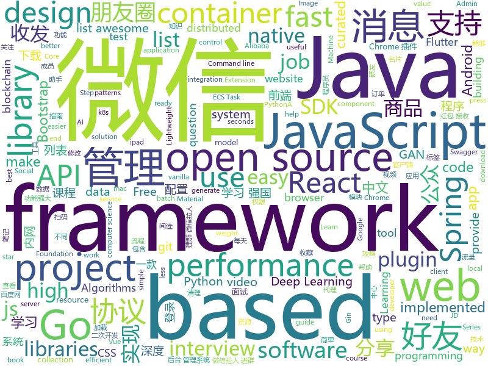

# 2019-03-29
See what the GitHub community is most excited about today.

## python
* [PI-REC](https://github.com/youyuge34/PI-REC)(**420 stars today**): 🔥PI-REC: Progressive Image Reconstruction Network With Edge and Color Domain.🔥图像翻译，条件GAN，AI绘画
* [pyright](https://github.com/Microsoft/pyright)(**254 stars today**): Static type checker for Python
* [public-apis](https://github.com/toddmotto/public-apis)(**149 stars today**): A collective list of free APIs for use in software and web development.
* [awesome-python-login-model](https://github.com/CriseLYJ/awesome-python-login-model)(**135 stars today**): 😮python模拟登陆一些大型网站，还有一些简单的爬虫，希望对你们有所帮助❤️，如果喜欢记得给个star哦🌟
* [automl-gs](https://github.com/minimaxir/automl-gs)(**141 stars today**): Provide an input CSV and a target field to predict, generate a model + code to run it.
* [system-design-primer](https://github.com/donnemartin/system-design-primer)(**118 stars today**): Learn how to design large-scale systems. Prep for the system design interview. Includes Anki flashcards.
* [models](https://github.com/tensorflow/models)(**82 stars today**): Models and examples built with TensorFlow
* [faceswap](https://github.com/deepfakes/faceswap)(**87 stars today**): Non official project based on original /r/Deepfakes thread. Many thanks to him!
* [Panda-Learning](https://github.com/Alivon/Panda-Learning)(**82 stars today**): 学习强国 xuexiqiangguo 全网最好用学习强国助手：Panda_Learning 萌萌的熊猫帮你搞定学习强国
* [BMSG-GAN](https://github.com/akanimax/BMSG-GAN)(**84 stars today**): [MSG-GAN] Any body can GAN! Highly stable and robust architecture. Requires little to no hyperparameter tuning.
* [Social-Amnesia](https://github.com/Nick-Gottschlich/Social-Amnesia)(**88 stars today**): Forget the past. Social Amnesia makes sure your social media accounts only show your posts from recent history, not from "that phase" 5 years ago.
* [awesome-python](https://github.com/vinta/awesome-python)(**84 stars today**): A curated list of awesome Python frameworks, libraries, software and resources
* [Algorithm_Interview_Notes-Chinese](https://github.com/imhuay/Algorithm_Interview_Notes-Chinese)(**75 stars today**): 2018/2019/校招/春招/秋招/算法/机器学习(Machine Learning)/深度学习(Deep Learning)/自然语言处理(NLP)/C/C++/Python/面试笔记
* [ChromeAppHeroes](https://github.com/zhaoolee/ChromeAppHeroes)(**81 stars today**): 🌈Chrome插件英雄榜, 为优秀的Chrome插件写一本中文说明书, 让Chrome插件英雄们造福人类~ ChromePluginHeroes, Write a Chinese manual for the excellent Chrome plugin, let the Chrome plugin heroes benefit the human~
* [awesome-machine-learning](https://github.com/josephmisiti/awesome-machine-learning)(**63 stars today**): A curated list of awesome Machine Learning frameworks, libraries and software.
* [prefect](https://github.com/PrefectHQ/prefect)(**64 stars today**): The Prefect Core automation engine
* [instantbox](https://github.com/instantbox/instantbox)(**60 stars today**): Get a clean, ready-to-go Linux box in seconds.
* [Python](https://github.com/TheAlgorithms/Python)(**48 stars today**): All Algorithms implemented in Python
* [CapsGNN](https://github.com/benedekrozemberczki/CapsGNN)(**54 stars today**): A PyTorch implementation of "Capsule Graph Neural Network" (ICLR 2019).
* [keras](https://github.com/keras-team/keras)(**43 stars today**): Deep Learning for humans
* [pytorch_geometric](https://github.com/rusty1s/pytorch_geometric)(**48 stars today**): Geometric Deep Learning Extension Library for PyTorch
* [fastapi](https://github.com/tiangolo/fastapi)(**49 stars today**): FastAPI framework, high performance, easy to learn, fast to code, ready for production
* [CheatSheetSeries](https://github.com/OWASP/CheatSheetSeries)(**46 stars today**): The OWASP Cheat Sheet Series was created to provide a concise collection of high value information on specific application security topics.
* [django](https://github.com/django/django)(**37 stars today**): The Web framework for perfectionists with deadlines.
* [youtube-dl](https://github.com/ytdl-org/youtube-dl)(****): Command-line program to download videos from YouTube.com and other video sites

## java
* [light-4j](https://github.com/networknt/light-4j)(**270 stars today**): A fast, lightweight and more productive microservices framework
* [advanced-java](https://github.com/doocs/advanced-java)(**223 stars today**): 😮互联网 Java 工程师进阶知识完全扫盲
* [Public.WeChat.CRM.SDK](https://github.com/tangjinjinwx/Public.WeChat.CRM.SDK)(**102 stars today**): 微信开发SDK，微信二次开发SDK，个人微信号二次开发sdk协议API接口，非微信ipad协议、非mac协议、非安卓协议，api可实现微信99%功能； 无需扫码登录、可收发朋友圈、查看朋友圈、朋友圈互动点赞、评论、 好友列表、微信消息收发、发文本消息、图片消息、名片消息、动图表情、发文件、删好友 添加好友、微信转账、微信红包接收、分享小程序、分享名片、加通讯录好友、微信收藏、微信标签等！ 清理僵尸粉、消息群发、通过好友请求、 微信建群、微信拉人进群、踢群成员、邀请群成员、退群、改群名称、群列表、发布群公告、多群消息同步等 微信公众号阅读、关注与取消关注公众号、公众号列表信息、清理微信空间
* [mall](https://github.com/macrozheng/mall)(**100 stars today**): mall项目是一套电商系统，包括前台商城系统及后台管理系统，基于SpringBoot+MyBatis实现。 前台商城系统包含首页门户、商品推荐、商品搜索、商品展示、购物车、订单流程、会员中心、客户服务、帮助中心等模块。 后台管理系统包含商品管理、订单管理、会员管理、促销管理、运营管理、内容管理、统计报表、财务管理、权限管理、设置等模块。
* [SpringBoot-Learning](https://github.com/dyc87112/SpringBoot-Learning)(**88 stars today**): Spring Boot基础教程，Spring Boot 2.x版本连载中！！！
* [spring-boot](https://github.com/spring-projects/spring-boot)(**71 stars today**): Spring Boot
* [java-design-patterns](https://github.com/iluwatar/java-design-patterns)(**67 stars today**): Design patterns implemented in Java
* [fescar](https://github.com/alibaba/fescar)(**71 stars today**): 🔥Fescar is an easy-to-use, high-performance, java based, open source distributed transaction solution.
* [spring-framework](https://github.com/spring-projects/spring-framework)(**50 stars today**): Spring Framework
* [elasticsearch](https://github.com/elastic/elasticsearch)(**55 stars today**): Open Source, Distributed, RESTful Search Engine
* [v9porn](https://github.com/techGay/v9porn)(**50 stars today**): 9*Porn Android 客户端，突破游客每天观看10次视频的限制，还可以下载视频
* [tutorials](https://github.com/eugenp/tutorials)(**25 stars today**): The "REST With Spring" Course:
* [arthas](https://github.com/alibaba/arthas)(**48 stars today**): Alibaba Java Diagnostic Tool Arthas/Alibaba Java诊断利器Arthas
* [Java](https://github.com/TheAlgorithms/Java)(**39 stars today**): All Algorithms implemented in Java
* [JGrowing](https://github.com/javagrowing/JGrowing)(**43 stars today**): Java is Growing up but not only Java。Java成长路线，但学到不仅仅是Java。
* [incubator-dubbo](https://github.com/apache/incubator-dubbo)(**38 stars today**): Apache Dubbo (incubating) is a high-performance, java based, open source RPC framework.
* [Gloading](https://github.com/luckybilly/Gloading)(**42 stars today**): Show global loading status view in a low coupling way for Android App(深度解耦Android App中全局加载中、加载失败及空数据视图)
* [incubator-skywalking](https://github.com/apache/incubator-skywalking)(**38 stars today**): APM, Application Performance Monitoring System
* [guava](https://github.com/google/guava)(**35 stars today**): Google core libraries for Java
* [interviews](https://github.com/kdn251/interviews)(**33 stars today**): Everything you need to know to get the job.
* [flutter_boost](https://github.com/alibaba/flutter_boost)(**36 stars today**): FlutterBoost is a Flutter plugin which enables hybrid integration of Flutter for your existing native apps with minimum efforts
* [DoraemonKit](https://github.com/didi/DoraemonKit)(**34 stars today**): 简称 "DoKit" 。一款功能齐全的客户端（ iOS 、Android ）研发助手，你值得拥有。
* [apollo](https://github.com/ctripcorp/apollo)(**32 stars today**): Apollo（阿波罗）是携程框架部门研发的分布式配置中心，能够集中化管理应用不同环境、不同集群的配置，配置修改后能够实时推送到应用端，并且具备规范的权限、流程治理等特性，适用于微服务配置管理场景。
* [RxJava](https://github.com/ReactiveX/RxJava)(**30 stars today**): RxJava – Reactive Extensions for the JVM – a library for composing asynchronous and event-based programs using observable sequences for the Java VM.
* [jdchain](https://github.com/blockchain-jd-com/jdchain)(**30 stars today**): JD Chain is JD.COM's open source blockchain project, with the goal of creating enterprise blockchain system that makes data exchange easier and more efficient.

## unknown
* [996.ICU](https://github.com/996icu/996.ICU)(**55,268 stars today**): Repo for counting stars and contributing. Press F to pay respect to glorious developers.
* [955.WLB](https://github.com/formulahendry/955.WLB)(**1,412 stars today**): 955 不加班的公司名单
* [Daily-Interview-Question](https://github.com/Advanced-Frontend/Daily-Interview-Question)(**552 stars today**): 工作日每天一道前端大厂面试题，祝大家天天进步，一年后会看到不一样的自己。
* [CS-Notes](https://github.com/CyC2018/CS-Notes)(**412 stars today**): 📚技术面试必备基础知识
* [JavaGuide](https://github.com/Snailclimb/JavaGuide)(**349 stars today**): 【Java学习+面试指南】 一份涵盖大部分Java程序员所需要掌握的核心知识。
* [everyone-can-use-english](https://github.com/xiaolai/everyone-can-use-english)(**306 stars today**): 人人都能用英语
* [TNFE-Weekly](https://github.com/Tnfe/TNFE-Weekly)(**238 stars today**): 每周为你提供高质量的关于小程序、h5等前端领域的文章和项目
* [free-programming-books](https://github.com/EbookFoundation/free-programming-books)(**167 stars today**): 📚Freely available programming books
* [free-programming-books-zh_CN](https://github.com/justjavac/free-programming-books-zh_CN)(**147 stars today**): 📚免费的计算机编程类中文书籍，欢迎投稿
* [50M_CTF_Writeup](https://github.com/manoelt/50M_CTF_Writeup)(**141 stars today**): $50 Million CTF from Hackerone - Writeup
* [gitignore](https://github.com/github/gitignore)(**93 stars today**): A collection of useful .gitignore templates
* [You-Dont-Know-JS](https://github.com/getify/You-Dont-Know-JS)(**100 stars today**): A book series on JavaScript. @YDKJS on twitter.
* [what-happens-when](https://github.com/alex/what-happens-when)(**89 stars today**): An attempt to answer the age old interview question "What happens when you type google.com into your browser and press enter?"
* [cra-recipe](https://github.com/atolye15/cra-recipe)(**79 stars today**): Step-by-step guide to bootstrap a CRA app from scratch.
* [THU-CST-Cracker](https://github.com/Trinkle23897/THU-CST-Cracker)(**44 stars today**): 清华大学计算机系课程攻略 Guidance for courses in Department of Computer Science and Technology, Tsinghua University
* [Data-Science--Cheat-Sheet](https://github.com/abhat222/Data-Science--Cheat-Sheet)(**59 stars today**): Cheat Sheets
* [coding-interview-university](https://github.com/jwasham/coding-interview-university)(**63 stars today**): A complete computer science study plan to become a software engineer.
* [WeightStandardization](https://github.com/joe-siyuan-qiao/WeightStandardization)(**55 stars today**): Standardizing weights to accelerate micro-batch training
* [architect-awesome](https://github.com/xingshaocheng/architect-awesome)(**46 stars today**): 后端架构师技术图谱
* [open-source-jobs](https://github.com/t9tio/open-source-jobs)(**49 stars today**): Open Source Jobs: A list of Open Source projects offering jobs. For who want to work on open source and get paid.
* [Micro8](https://github.com/Micropoor/Micro8)(**40 stars today**): Gitbook
* [awesome-public-datasets](https://github.com/awesomedata/awesome-public-datasets)(**43 stars today**): A topic-centric list of HQ open datasets. PR ☛☛☛
* [awesome-wechat-weapp](https://github.com/justjavac/awesome-wechat-weapp)(**43 stars today**): 微信小程序开发资源汇总💯
* [chinese-programmer-wrong-pronunciation](https://github.com/shimohq/chinese-programmer-wrong-pronunciation)(**43 stars today**): 中国程序员容易发音错误的单词

## javascript
* [winXP](https://github.com/ShizukuIchi/winXP)(**822 stars today**): 🏁Web based Windows XP desktop recreation.
* [is-thirteen](https://github.com/jezen/is-thirteen)(**307 stars today**): Check if a number is equal to 13.
* [vue](https://github.com/vuejs/vue)(**273 stars today**): 🖖Vue.js is a progressive, incrementally-adoptable JavaScript framework for building UI on the web.
* [react](https://github.com/facebook/react)(**133 stars today**): A declarative, efficient, and flexible JavaScript library for building user interfaces.
* [React95](https://github.com/React95/React95)(**145 stars today**): A React components library with Win95 UI
* [reactjs-interview-questions](https://github.com/semlinker/reactjs-interview-questions)(**135 stars today**): List of top 301 ReactJS Interview Questions & Answers
* [30-seconds-of-code](https://github.com/30-seconds/30-seconds-of-code)(**114 stars today**): A curated collection of useful JavaScript snippets that you can understand in 30 seconds or less.
* [Awesome-Design-Tools](https://github.com/LisaDziuba/Awesome-Design-Tools)(**107 stars today**): The best design tools for everything👉
* [laxxx](https://github.com/alexfoxy/laxxx)(**107 stars today**): Simple & light weight (3kb minified & zipped) vanilla javascript plugin to create smooth & beautiful animations when you scrolllll! Harness the power of the most intuitive interaction and make your websites come alive!
* [baiduyun](https://github.com/syhyz1990/baiduyun)(**88 stars today**): 油猴脚本 直接下载百度网盘和百度网盘分享的文件,直链下载超级加速
* [dropcss](https://github.com/leeoniya/dropcss)(**87 stars today**): A simple, thorough and fast unused-CSS cleaner
* [cube.js](https://github.com/statsbotco/cube.js)(**80 stars today**): 📊Cube.js - Open Source Analytics Framework
* [advanced-react-patterns](https://github.com/kentcdodds/advanced-react-patterns)(**78 stars today**): This is the latest advanced react patterns workshop
* [node](https://github.com/nodejs/node)(**70 stars today**): Node.js JavaScript runtime✨🐢🚀✨
* [Tone.js](https://github.com/Tonejs/Tone.js)(**72 stars today**): A Web Audio framework for making interactive music in the browser.
* [javascript-algorithms](https://github.com/trekhleb/javascript-algorithms)(**63 stars today**): 📝Algorithms and data structures implemented in JavaScript with explanations and links to further readings
* [storybook](https://github.com/storybooks/storybook)(**66 stars today**): UI component dev & test: React, Vue, Angular, React Native, Ember & more!
* [form-backend-validation](https://github.com/spatie/form-backend-validation)(**71 stars today**): An easy way to validate forms using back end logic
* [hookrouter](https://github.com/Paratron/hookrouter)(**70 stars today**): A hook based router for React
* [Motrix](https://github.com/agalwood/Motrix)(**65 stars today**): A full-featured download manager.
* [griffith](https://github.com/zhihu/griffith)(**68 stars today**): A React-based web video player
* [bootstrap](https://github.com/twbs/bootstrap)(**49 stars today**): The most popular HTML, CSS, and JavaScript framework for developing responsive, mobile first projects on the web.
* [axios](https://github.com/axios/axios)(**64 stars today**): Promise based HTTP client for the browser and node.js
* [tests-as-linear](https://github.com/lindeloev/tests-as-linear)(**63 stars today**): Common statistical tests are linear models (or: how to teach stats)
* [three.js](https://github.com/mrdoob/three.js)(**56 stars today**): JavaScript 3D library.

## html
* [zju-icicles](https://github.com/QSCTech/zju-icicles)(**185 stars today**): 浙江大学课程攻略共享计划
* [MikuTools](https://github.com/Ice-Hazymoon/MikuTools)(**193 stars today**): 一个轻量的工具集合
* [WeChatAgreement.WebApi.Simple](https://github.com/changtuiqie/WeChatAgreement.WebApi.Simple)(**56 stars today**): 微信mac/ipad协议，webapi封装好的实现方案，免IIS一键部署。 可实现微信80%功能；支持62数据登录、扫码登录、收发朋友圈、查看朋友圈、微信建群、微信拉人进群、微信公众号阅读、微信消息收发、微信附近的人定位、微信添加好友、微信红包接收、微信防撤回、分享小程序、微信加粉、微信收藏、微信标签等
* [personal-website](https://github.com/github/personal-website)(**26 stars today**): Code that'll help you kickstart a personal website that showcases your work as a software developer.
* [lets-get-arrested](https://github.com/hamukazu/lets-get-arrested)(**34 stars today**): This project is intended to protest against the police in Japan
* [SecurityWorker](https://github.com/qiaozi-tech/SecurityWorker)(**38 stars today**): The best javascript code protection solution ever.
* [javascript-tutorial-en](https://github.com/iliakan/javascript-tutorial-en)(**29 stars today**): Modern JavaScript Tutorial
* [evtjs](https://github.com/everitoken/evtjs)(**31 stars today**): API Binding (SDK) for the everiToken blockchain.
* [AdminLTE](https://github.com/ColorlibHQ/AdminLTE)(**24 stars today**): AdminLTE - Free Premium Admin control Panel Theme Based On Bootstrap 3.x
* [styleguide](https://github.com/google/styleguide)(**20 stars today**): Style guides for Google-originated open-source projects
* [JavaScript30](https://github.com/wesbos/JavaScript30)(**16 stars today**): 30 Day Vanilla JS Challenge
* [quickchart](https://github.com/typpo/quickchart)(**18 stars today**): Google Image Charts alternative
* [patchwork](https://github.com/jlord/patchwork)(**10 stars today**): All the Git-it Workshop completers!
* [bootstrap-table](https://github.com/wenzhixin/bootstrap-table)(**15 stars today**): An extended table to integration with some of the most widely used CSS frameworks. (Supports Bootstrap, Semantic UI, Bulma, Material Design, Foundation)
* [qiubaiying.github.io](https://github.com/qiubaiying/qiubaiying.github.io)(**6 stars today**): BY Blog ->
* [flutter-in-action](https://github.com/flutterchina/flutter-in-action)(**15 stars today**): 《Flutter实战》电子书
* [fastText](https://github.com/facebookresearch/fastText)(**15 stars today**): Library for fast text representation and classification.
* [Spoon-Knife](https://github.com/octocat/Spoon-Knife)(****): This repo is for demonstration purposes only.
* [fp-foundation](https://github.com/julien-truffaut/fp-foundation)(**15 stars today**): Foundation of functional programming course
* [javascript-tutorial-zh](https://github.com/xitu/javascript-tutorial-zh)(**14 stars today**): Modern JavaScript Tutorial
* [deeplearning_ai_books](https://github.com/fengdu78/deeplearning_ai_books)(**11 stars today**): deeplearning.ai（吴恩达老师的深度学习课程笔记及资源）
* [swagger-codegen](https://github.com/swagger-api/swagger-codegen)(**10 stars today**): swagger-codegen contains a template-driven engine to generate documentation, API clients and server stubs in different languages by parsing your OpenAPI / Swagger definition.
* [webKnowledge](https://github.com/huyaocode/webKnowledge)(**11 stars today**): 前端知识点总结
* [stisla](https://github.com/stisla/stisla)(**11 stars today**): Free Bootstrap Admin Template
* [Front-end-Developer-Interview-Questions](https://github.com/h5bp/Front-end-Developer-Interview-Questions)(****): A list of helpful front-end related questions you can use to interview potential candidates, test yourself or completely ignore.

## go
* [chaosblade](https://github.com/chaosblade-io/chaosblade)(**275 stars today**): An easy to use and powerful chaos engineering experiment toolkit.（一款简单易用、功能强大的混沌实验注入工具）
* [fyne](https://github.com/fyne-io/fyne)(**169 stars today**): Cross platform GUI in Go based on Material Design
* [go](https://github.com/golang/go)(**95 stars today**): The Go programming language
* [kubernetes](https://github.com/kubernetes/kubernetes)(**82 stars today**): Production-Grade Container Scheduling and Management
* [red](https://github.com/antonmedv/red)(**71 stars today**): Terminal log analysis tools
* [frp](https://github.com/fatedier/frp)(**64 stars today**): A fast reverse proxy to help you expose a local server behind a NAT or firewall to the internet.
* [awesome-go](https://github.com/avelino/awesome-go)(**60 stars today**): A curated list of awesome Go frameworks, libraries and software
* [etcd](https://github.com/etcd-io/etcd)(**46 stars today**): Distributed reliable key-value store for the most critical data of a distributed system
* [amazon-ecs-local-container-endpoints](https://github.com/awslabs/amazon-ecs-local-container-endpoints)(**48 stars today**): A container that provides local versions of the ECS Task Metadata Endpoint and ECS Task IAM Roles Endpoint.
* [pipeline](https://github.com/tektoncd/pipeline)(**41 stars today**): A K8s-native Pipeline resource.
* [the-way-to-go_ZH_CN](https://github.com/Unknwon/the-way-to-go_ZH_CN)(**38 stars today**): 《The Way to Go》中文译本，中文正式名《Go 入门指南》
* [istio](https://github.com/istio/istio)(**35 stars today**): Connect, secure, control, and observe services.
* [peloton](https://github.com/uber/peloton)(**38 stars today**): Unified Resource Scheduler to co-schedule mixed types of workloads such as batch, stateless and stateful jobs in a single cluster for better resource utilization.
* [hub](https://github.com/github/hub)(**35 stars today**): A command-line tool that makes git easier to use with GitHub.
* [drone](https://github.com/drone/drone)(**34 stars today**): Drone is a Container-Native, Continuous Delivery Platform
* [minikube](https://github.com/kubernetes/minikube)(**31 stars today**): Run Kubernetes locally
* [cobra](https://github.com/spf13/cobra)(**32 stars today**): A Commander for modern Go CLI interactions
* [gin-admin](https://github.com/LyricTian/gin-admin)(**31 stars today**): RBAC scaffolding based on Gin + GROM + Casbin + Ant Design React
* [moby](https://github.com/moby/moby)(**28 stars today**): Moby Project - a collaborative project for the container ecosystem to assemble container-based systems
* [gin](https://github.com/gin-gonic/gin)(**30 stars today**): Gin is a HTTP web framework written in Go (Golang). It features a Martini-like API with much better performance -- up to 40 times faster. If you need smashing performance, get yourself some Gin.
* [hugo](https://github.com/gohugoio/hugo)(**30 stars today**): The world’s fastest framework for building websites.
* [nps](https://github.com/cnlh/nps)(**29 stars today**): 一款轻量级、功能强大的内网穿透代理服务器。支持tcp、udp流量转发，支持内网http代理、内网socks5代理，同时支持snappy压缩（节省带宽和流量）、站点保护、加密传输、多路复用、header修改等。支持web图形化管理。
* [k3s](https://github.com/rancher/k3s)(**29 stars today**): Lightweight Kubernetes. 5 less than k8s.
* [soar](https://github.com/XiaoMi/soar)(**27 stars today**): SQL Optimizer And Rewriter
* [gitea](https://github.com/go-gitea/gitea)(**27 stars today**): Git with a cup of tea, painless self-hosted git service

## WordCloud

