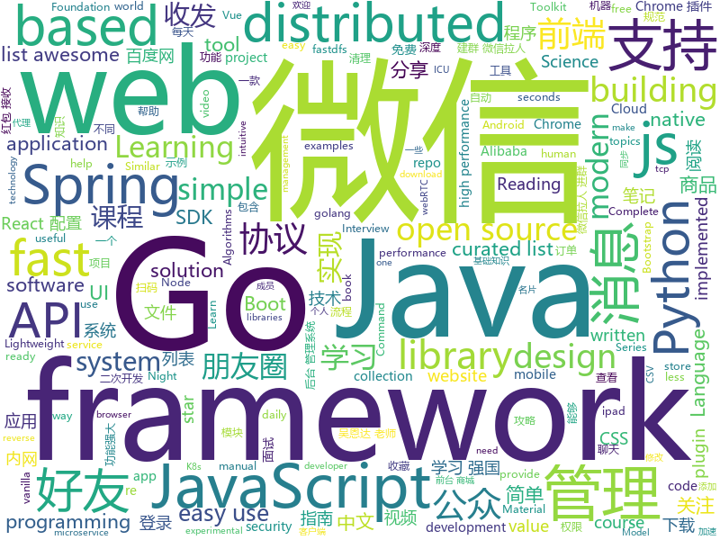

# 2019-03-30
See what the GitHub community is most excited about today.

## python
* [996.ICU](https://github.com/996icu/996.ICU)(**36,295 stars today**): Repo for counting stars and contributing. Press F to pay respect to glorious developers.
* [cartography](https://github.com/lyft/cartography)(**408 stars today**): Cartography is a Python tool that consolidates infrastructure assets and the relationships between them in an intuitive graph view powered by a Neo4j database.
* [rosshow](https://github.com/dheera/rosshow)(**285 stars today**): Visualize ROS topics inside a terminal with Unicode/ASCII art
* [pyright](https://github.com/Microsoft/pyright)(**208 stars today**): Static type checker for Python
* [awesome-python-login-model](https://github.com/CriseLYJ/awesome-python-login-model)(**165 stars today**): 😮python模拟登陆一些大型网站，还有一些简单的爬虫，希望对你们有所帮助❤️，如果喜欢记得给个star哦🌟
* [PI-REC](https://github.com/youyuge34/PI-REC)(**138 stars today**): 🔥PI-REC: Progressive Image Reconstruction Network With Edge and Color Domain.🔥图像翻译，条件GAN，AI绘画
* [Algorithm_Interview_Notes-Chinese](https://github.com/imhuay/Algorithm_Interview_Notes-Chinese)(**97 stars today**): 2018/2019/校招/春招/秋招/算法/机器学习(Machine Learning)/深度学习(Deep Learning)/自然语言处理(NLP)/C/C++/Python/面试笔记
* [awesome-python](https://github.com/vinta/awesome-python)(**91 stars today**): A curated list of awesome Python frameworks, libraries, software and resources
* [inltk](https://github.com/goru001/inltk)(**91 stars today**): Natural Language Toolkit for Indic Languages
* [ChromeAppHeroes](https://github.com/zhaoolee/ChromeAppHeroes)(**87 stars today**): 🌈Chrome插件英雄榜, 为优秀的Chrome插件写一本中文说明书, 让Chrome插件英雄们造福人类~ ChromePluginHeroes, Write a Chinese manual for the excellent Chrome plugin, let the Chrome plugin heroes benefit the human~
* [system-design-primer](https://github.com/donnemartin/system-design-primer)(**72 stars today**): Learn how to design large-scale systems. Prep for the system design interview. Includes Anki flashcards.
* [models](https://github.com/tensorflow/models)(**62 stars today**): Models and examples built with TensorFlow
* [automl-gs](https://github.com/minimaxir/automl-gs)(**70 stars today**): Provide an input CSV and a target field to predict, generate a model + code to run it.
* [public-apis](https://github.com/toddmotto/public-apis)(**58 stars today**): A collective list of free APIs for use in software and web development.
* [public-speaking-with-meaning](https://github.com/xiaolai/public-speaking-with-meaning)(**57 stars today**): 《我也有话要说》—— 普通人的当众讲话技能
* [Python](https://github.com/TheAlgorithms/Python)(**55 stars today**): All Algorithms implemented in Python
* [keras](https://github.com/keras-team/keras)(**47 stars today**): Deep Learning for humans
* [Panda-Learning](https://github.com/Alivon/Panda-Learning)(**47 stars today**): 学习强国 xuexiqiangguo 全网最好用学习强国助手：Panda_Learning 萌萌的熊猫帮你搞定学习强国
* [instantbox](https://github.com/instantbox/instantbox)(**52 stars today**): Get a clean, ready-to-go Linux box in seconds.
* [youtube-dl](https://github.com/ytdl-org/youtube-dl)(**45 stars today**): Command-line program to download videos from YouTube.com and other video sites
* [FastFCN](https://github.com/wuhuikai/FastFCN)(**46 stars today**): FastFCN: Rethinking Dilated Convolution in the Backbone for Semantic Segmentation.
* [fastapi](https://github.com/tiangolo/fastapi)(**46 stars today**): FastAPI framework, high performance, easy to learn, fast to code, ready for production
* [faceswap](https://github.com/deepfakes/faceswap)(**44 stars today**): Non official project based on original /r/Deepfakes thread. Many thanks to him!
* [CheatSheetSeries](https://github.com/OWASP/CheatSheetSeries)(**40 stars today**): The OWASP Cheat Sheet Series was created to provide a concise collection of high value information on specific application security topics.
* [cpython](https://github.com/python/cpython)(**32 stars today**): The Python programming language

## java
* [advanced-java](https://github.com/doocs/advanced-java)(**182 stars today**): 😮互联网 Java 工程师进阶知识完全扫盲
* [mall](https://github.com/macrozheng/mall)(**106 stars today**): mall项目是一套电商系统，包括前台商城系统及后台管理系统，基于SpringBoot+MyBatis实现。 前台商城系统包含首页门户、商品推荐、商品搜索、商品展示、购物车、订单流程、会员中心、客户服务、帮助中心等模块。 后台管理系统包含商品管理、订单管理、会员管理、促销管理、运营管理、内容管理、统计报表、财务管理、权限管理、设置等模块。
* [spring-cloud-alibaba](https://github.com/spring-cloud-incubator/spring-cloud-alibaba)(**82 stars today**): Spring Cloud Alibaba provides a one-stop solution for application development for the distributed solutions of Alibaba middleware.
* [java-design-patterns](https://github.com/iluwatar/java-design-patterns)(**77 stars today**): Design patterns implemented in Java
* [light-4j](https://github.com/networknt/light-4j)(**73 stars today**): A fast, lightweight and more productive microservices framework
* [Public.WeChat.CRM.SDK](https://github.com/tangjinjinwx/Public.WeChat.CRM.SDK)(**69 stars today**): 微信开发SDK，微信二次开发SDK，个人微信号二次开发sdk协议API接口，非微信ipad协议、非mac协议、非安卓协议，api可实现微信99%功能； 无需扫码登录、可收发朋友圈、查看朋友圈、朋友圈互动点赞、评论、 好友列表、微信消息收发、发文本消息、图片消息、名片消息、动图表情、发文件、删好友 添加好友、微信转账、微信红包接收、分享小程序、分享名片、加通讯录好友、微信收藏、微信标签等！ 清理僵尸粉、消息群发、通过好友请求、 微信建群、微信拉人进群、踢群成员、邀请群成员、退群、改群名称、群列表、发布群公告、多群消息同步等 微信公众号阅读、关注与取消关注公众号、公众号列表信息、清理微信空间
* [spring-boot](https://github.com/spring-projects/spring-boot)(**60 stars today**): Spring Boot
* [SpringBoot-Learning](https://github.com/dyc87112/SpringBoot-Learning)(**63 stars today**): Spring Boot基础教程，Spring Boot 2.x版本连载中！！！
* [spring-boot-examples](https://github.com/ityouknow/spring-boot-examples)(**46 stars today**): about learning Spring Boot via examples. Spring Boot 教程、技术栈示例代码，快速简单上手教程。
* [fescar](https://github.com/alibaba/fescar)(**54 stars today**): 🔥Fescar is an easy-to-use, high-performance, java based, open source distributed transaction solution.
* [spring-framework](https://github.com/spring-projects/spring-framework)(**46 stars today**): Spring Framework
* [arthas](https://github.com/alibaba/arthas)(**51 stars today**): Alibaba Java Diagnostic Tool Arthas/Alibaba Java诊断利器Arthas
* [Java](https://github.com/TheAlgorithms/Java)(**41 stars today**): All Algorithms implemented in Java
* [tutorials](https://github.com/eugenp/tutorials)(**31 stars today**): The "REST With Spring" Course:
* [elasticsearch](https://github.com/elastic/elasticsearch)(**43 stars today**): Open Source, Distributed, RESTful Search Engine
* [interviews](https://github.com/kdn251/interviews)(**41 stars today**): Everything you need to know to get the job.
* [nacos](https://github.com/alibaba/nacos)(**38 stars today**): an easy-to-use dynamic service discovery, configuration and service management platform for building cloud native applications.
* [JGrowing](https://github.com/javagrowing/JGrowing)(**37 stars today**): Java is Growing up but not only Java。Java成长路线，但学到不仅仅是Java。
* [incubator-dubbo](https://github.com/apache/incubator-dubbo)(**30 stars today**): Apache Dubbo (incubating) is a high-performance, java based, open source RPC framework.
* [Leetcode](https://github.com/fishercoder1534/Leetcode)(**36 stars today**): Complete solutions to Leetcode problems; updated daily. (I'm looking for long-term contributors/partners to this repo! Send me PRs if you're interested! - 9/5/2018)
* [micronaut-core](https://github.com/micronaut-projects/micronaut-core)(**39 stars today**): Micronaut Application Framework
* [v9porn](https://github.com/techGay/v9porn)(**37 stars today**): 9*Porn Android 客户端，突破游客每天观看10次视频的限制，还可以下载视频
* [apollo](https://github.com/ctripcorp/apollo)(**31 stars today**): Apollo（阿波罗）是携程框架部门研发的分布式配置中心，能够集中化管理应用不同环境、不同集群的配置，配置修改后能够实时推送到应用端，并且具备规范的权限、流程治理等特性，适用于微服务配置管理场景。
* [JCSprout](https://github.com/crossoverJie/JCSprout)(**35 stars today**): 👨‍🎓Java Core Sprout : basic, concurrent, algorithm
* [Magisk](https://github.com/topjohnwu/Magisk)(**35 stars today**): A Magic Mask to Alter Android System Systemless-ly

## unknown
* [955.WLB](https://github.com/formulahendry/955.WLB)(**3,607 stars today**): 955 不加班的公司名单
* [free-programming-books](https://github.com/EbookFoundation/free-programming-books)(**497 stars today**): 📚Freely available programming books
* [Daily-Interview-Question](https://github.com/Advanced-Frontend/Daily-Interview-Question)(**442 stars today**): 工作日每天一道前端大厂面试题，祝大家天天进步，一年后会看到不一样的自己。
* [CS-Notes](https://github.com/CyC2018/CS-Notes)(**395 stars today**): 📚技术面试必备基础知识
* [996ICU](https://github.com/995icu/996ICU)(**385 stars today**): 996ICU 995ICU 工作996 生病ICU 加班不规范 亲人两行泪
* [JavaGuide](https://github.com/Snailclimb/JavaGuide)(**286 stars today**): 【Java学习+面试指南】 一份涵盖大部分Java程序员所需要掌握的核心知识。
* [everyone-can-use-english](https://github.com/xiaolai/everyone-can-use-english)(**245 stars today**): 人人都能用英语
* [You-Dont-Know-JS](https://github.com/getify/You-Dont-Know-JS)(**148 stars today**): A book series on JavaScript. @YDKJS on twitter.
* [gitignore](https://github.com/github/gitignore)(**113 stars today**): A collection of useful .gitignore templates
* [es6-turkce-kaynaklar](https://github.com/fatihhayri/es6-turkce-kaynaklar)(**113 stars today**): ES6 Türkçe kaynak listesi
* [free-programming-books-zh_CN](https://github.com/justjavac/free-programming-books-zh_CN)(**90 stars today**): 📚免费的计算机编程类中文书籍，欢迎投稿
* [955.holiday](https://github.com/955holiday/955.holiday)(**95 stars today**): Similar to 996.ICU, but 955.HOLIDAY.
* [TNFE-Weekly](https://github.com/Tnfe/TNFE-Weekly)(**87 stars today**): 每周为你提供高质量的关于小程序、h5等前端领域的文章和项目
* [coding-interview-university](https://github.com/jwasham/coding-interview-university)(**77 stars today**): A complete computer science study plan to become a software engineer.
* [THU-CST-Cracker](https://github.com/Trinkle23897/THU-CST-Cracker)(**56 stars today**): 清华大学计算机系课程攻略 Guidance for courses in Department of Computer Science and Technology, Tsinghua University
* [Data-Science--Cheat-Sheet](https://github.com/abhat222/Data-Science--Cheat-Sheet)(**47 stars today**): Cheat Sheets
* [Node.js-Troubleshooting-Guide](https://github.com/aliyun-node/Node.js-Troubleshooting-Guide)(**51 stars today**): Node.js 应用线上/线下故障、压测问题和性能调优指南手册（更新中...）
* [Micro8](https://github.com/Micropoor/Micro8)(**39 stars today**): Gitbook
* [awesome-vue](https://github.com/vuejs/awesome-vue)(**44 stars today**): 🎉A curated list of awesome things related to Vue.js
* [architect-awesome](https://github.com/xingshaocheng/architect-awesome)(**40 stars today**): 后端架构师技术图谱
* [cvpr2019](https://github.com/extreme-assistant/cvpr2019)(**41 stars today**): cvpr2019 papers
* [build-your-own-x](https://github.com/danistefanovic/build-your-own-x)(**33 stars today**): 🤓Build your own (insert technology here)
* [hosts](https://github.com/googlehosts/hosts)(**32 stars today**): 镜像：https://coding.net/u/scaffrey/p/hosts/git
* [ds-cheatsheets](https://github.com/FavioVazquez/ds-cheatsheets)(**28 stars today**): List of Data Science Cheatsheets to rule the world

## javascript
* [winXP](https://github.com/ShizukuIchi/winXP)(**578 stars today**): 🏁Web based Windows XP desktop recreation.
* [Tone.js](https://github.com/Tonejs/Tone.js)(**555 stars today**): A Web Audio framework for making interactive music in the browser.
* [vue](https://github.com/vuejs/vue)(**343 stars today**): 🖖Vue.js is a progressive, incrementally-adoptable JavaScript framework for building UI on the web.
* [cube.js](https://github.com/statsbotco/cube.js)(**197 stars today**): 📊Cube.js - Open Source Analytics Framework
* [is-thirteen](https://github.com/jezen/is-thirteen)(**177 stars today**): Check if a number is equal to 13.
* [react](https://github.com/facebook/react)(**168 stars today**): A declarative, efficient, and flexible JavaScript library for building user interfaces.
* [dayjs](https://github.com/iamkun/dayjs)(**164 stars today**): ⏰Day.js 2KB immutable date library alternative to Moment.js with the same modern API
* [React95](https://github.com/React95/React95)(**116 stars today**): A React components library with Win95 UI
* [Awesome-Design-Tools](https://github.com/LisaDziuba/Awesome-Design-Tools)(**109 stars today**): The best design tools for everything👉
* [bootstrap](https://github.com/twbs/bootstrap)(**90 stars today**): The most popular HTML, CSS, and JavaScript framework for developing responsive, mobile first projects on the web.
* [30-seconds-of-code](https://github.com/30-seconds/30-seconds-of-code)(**104 stars today**): A curated collection of useful JavaScript snippets that you can understand in 30 seconds or less.
* [form-backend-validation](https://github.com/spatie/form-backend-validation)(**104 stars today**): An easy way to validate forms using back end logic
* [axios](https://github.com/axios/axios)(**91 stars today**): Promise based HTTP client for the browser and node.js
* [Motrix](https://github.com/agalwood/Motrix)(**80 stars today**): A full-featured download manager.
* [baiduyun](https://github.com/syhyz1990/baiduyun)(**85 stars today**): 油猴脚本 直接下载百度网盘和百度网盘分享的文件,直链下载超级加速
* [laxxx](https://github.com/alexfoxy/laxxx)(**70 stars today**): Simple & light weight (3kb minified & zipped) vanilla javascript plugin to create smooth & beautiful animations when you scrolllll! Harness the power of the most intuitive interaction and make your websites come alive!
* [reactjs-interview-questions](https://github.com/semlinker/reactjs-interview-questions)(**68 stars today**): List of top 301 ReactJS Interview Questions & Answers
* [three.js](https://github.com/mrdoob/three.js)(**60 stars today**): JavaScript 3D library.
* [react-native](https://github.com/facebook/react-native)(**56 stars today**): A framework for building native apps with React.
* [dropcss](https://github.com/leeoniya/dropcss)(**58 stars today**): A simple, thorough and fast unused-CSS cleaner
* [node](https://github.com/nodejs/node)(**51 stars today**): Node.js JavaScript runtime✨🐢🚀✨
* [puppeteer](https://github.com/GoogleChrome/puppeteer)(**55 stars today**): Headless Chrome Node API
* [create-react-app](https://github.com/facebook/create-react-app)(**44 stars today**): Set up a modern web app by running one command.
* [Blog](https://github.com/ljianshu/Blog)(**53 stars today**): 关注基础知识，打造优质前端博客，欢迎关注我的公众号：前端工匠
* [react-devtools-experimental](https://github.com/bvaughn/react-devtools-experimental)(**54 stars today**): Experimental rewrite of the React DevTools extension

## html
* [zju-icicles](https://github.com/QSCTech/zju-icicles)(**289 stars today**): 浙江大学课程攻略共享计划
* [WeChatAgreement.WebApi.Simple](https://github.com/changtuiqie/WeChatAgreement.WebApi.Simple)(**86 stars today**): 微信mac/ipad协议，webapi封装好的实现方案，免IIS一键部署。 可实现微信80%功能；支持62数据登录、扫码登录、收发朋友圈、查看朋友圈、微信建群、微信拉人进群、微信公众号阅读、微信消息收发、微信附近的人定位、微信添加好友、微信红包接收、微信防撤回、分享小程序、微信加粉、微信收藏、微信标签等
* [MikuTools](https://github.com/Ice-Hazymoon/MikuTools)(**51 stars today**): 一个轻量的工具集合
* [personal-website](https://github.com/github/personal-website)(**23 stars today**): Code that'll help you kickstart a personal website that showcases your work as a software developer.
* [javascript-tutorial-en](https://github.com/iliakan/javascript-tutorial-en)(**28 stars today**): Modern JavaScript Tutorial
* [AdminLTE](https://github.com/ColorlibHQ/AdminLTE)(**23 stars today**): AdminLTE - Free Premium Admin control Panel Theme Based On Bootstrap 3.x
* [styleguide](https://github.com/google/styleguide)(**21 stars today**): Style guides for Google-originated open-source projects
* [JavaScript30](https://github.com/wesbos/JavaScript30)(**13 stars today**): 30 Day Vanilla JS Challenge
* [Coursera-ML-AndrewNg-Notes](https://github.com/fengdu78/Coursera-ML-AndrewNg-Notes)(**15 stars today**): 吴恩达老师的机器学习课程个人笔记
* [deeplearning_ai_books](https://github.com/fengdu78/deeplearning_ai_books)(**16 stars today**): deeplearning.ai（吴恩达老师的深度学习课程笔记及资源）
* [fastText](https://github.com/facebookresearch/fastText)(**14 stars today**): Library for fast text representation and classification.
* [evtjs](https://github.com/everitoken/evtjs)(**16 stars today**): API Binding (SDK) for the everiToken blockchain.
* [Spoon-Knife](https://github.com/octocat/Spoon-Knife)(****): This repo is for demonstration purposes only.
* [portainer](https://github.com/portainer/portainer)(**13 stars today**): Simple management UI for Docker
* [lets-get-arrested](https://github.com/hamukazu/lets-get-arrested)(**12 stars today**): This project is intended to protest against the police in Japan
* [starrtc-android-demo](https://github.com/starrtc/starrtc-android-demo)(**12 stars today**): 🚀starRTC，免费IM（含单聊，群聊，聊天室），免费一对一视频聊天（回音消除），语音聊天，直播连麦，白板，小班课，多人会议，局域网无服务器直连，兼容webRTC, 支持webRTC加速，P2P高清传输，安卓、iOS、web互通，支持门禁可视对讲，电视盒子，树莓派，海思，全志，OTT设备，C语言自研方案，✨万水千山总是情，来个star行不行✨，更多示例请访问：
* [website](https://github.com/techqueria/website)(**12 stars today**): 🌮We're a community of Latinx professionals in the tech industry.
* [owasp-mstg](https://github.com/OWASP/owasp-mstg)(**11 stars today**): The Mobile Security Testing Guide (MSTG) is a comprehensive manual for mobile app security testing and reverse engineering.
* [flutter-in-action](https://github.com/flutterchina/flutter-in-action)(**12 stars today**): 《Flutter实战》电子书
* [fp-foundation](https://github.com/julien-truffaut/fp-foundation)(**12 stars today**): Foundation of functional programming course
* [webKnowledge](https://github.com/huyaocode/webKnowledge)(**9 stars today**): 前端知识点总结
* [patchwork](https://github.com/jlord/patchwork)(**5 stars today**): All the Git-it Workshop completers!
* [javascript-tutorial-zh](https://github.com/xitu/javascript-tutorial-zh)(**9 stars today**): Modern JavaScript Tutorial
* [awesome-angular](https://github.com/PatrickJS/awesome-angular)(**9 stars today**): 📄A curated list of awesome Angular resources
* [bootstrap-table](https://github.com/wenzhixin/bootstrap-table)(**9 stars today**): An extended table to integration with some of the most widely used CSS frameworks. (Supports Bootstrap, Semantic UI, Bulma, Material Design, Foundation)

## go
* [vugu](https://github.com/vugu/vugu)(**275 stars today**): Vugu: A modern UI library for Go+WebAssembly (experimental)
* [nps](https://github.com/cnlh/nps)(**119 stars today**): 一款轻量级、功能强大的内网穿透代理服务器。支持tcp、udp流量转发，支持内网http代理、内网socks5代理，同时支持snappy压缩、站点保护、加密传输、多路复用、header修改等。支持web图形化管理，集成多用户模式。
* [chaosblade](https://github.com/chaosblade-io/chaosblade)(**105 stars today**): An easy to use and powerful chaos engineering experiment toolkit.（一款简单易用、功能强大的混沌实验注入工具）
* [fyne](https://github.com/fyne-io/fyne)(**109 stars today**): Cross platform GUI in Go based on Material Design
* [kubernetes](https://github.com/kubernetes/kubernetes)(**81 stars today**): Production-Grade Container Scheduling and Management
* [go](https://github.com/golang/go)(**92 stars today**): The Go programming language
* [awesome-go](https://github.com/avelino/awesome-go)(**53 stars today**): A curated list of awesome Go frameworks, libraries and software
* [frp](https://github.com/fatedier/frp)(**51 stars today**): A fast reverse proxy to help you expose a local server behind a NAT or firewall to the internet.
* [red](https://github.com/antonmedv/red)(**52 stars today**): Terminal log analysis tools
* [bitraft](https://github.com/prologic/bitraft)(**50 stars today**): A Bitcask Distributed Key/Value store using Raft for concensus with a Redis compatible API written in Go.
* [gin](https://github.com/gin-gonic/gin)(**44 stars today**): Gin is a HTTP web framework written in Go (Golang). It features a Martini-like API with much better performance -- up to 40 times faster. If you need smashing performance, get yourself some Gin.
* [the-way-to-go_ZH_CN](https://github.com/Unknwon/the-way-to-go_ZH_CN)(**43 stars today**): 《The Way to Go》中文译本，中文正式名《Go 入门指南》
* [csvq](https://github.com/mithrandie/csvq)(**43 stars today**): SQL-like query language for csv
* [BaiduPCS-Go](https://github.com/iikira/BaiduPCS-Go)(**39 stars today**): 百度网盘客户端 - Go语言编写
* [etcd](https://github.com/etcd-io/etcd)(**40 stars today**): Distributed reliable key-value store for the most critical data of a distributed system
* [helm](https://github.com/helm/helm)(**36 stars today**): The Kubernetes Package Manager
* [bodyclose](https://github.com/timakin/bodyclose)(**37 stars today**): Analyzer: checks whether HTTP response body is closed and a re-use of TCP connection is not blocked.
* [k3s](https://github.com/rancher/k3s)(**36 stars today**): Lightweight Kubernetes. 5 less than k8s.
* [mkcert](https://github.com/FiloSottile/mkcert)(**34 stars today**): A simple zero-config tool to make locally trusted development certificates with any names you'd like.
* [hugo](https://github.com/gohugoio/hugo)(**35 stars today**): The world’s fastest framework for building websites.
* [pipeline](https://github.com/tektoncd/pipeline)(**29 stars today**): A K8s-native Pipeline resource.
* [go-micro](https://github.com/micro/go-micro)(**33 stars today**): A microservice framework
* [traefik](https://github.com/containous/traefik)(**31 stars today**): The Cloud Native Edge Router
* [go-fastdfs](https://github.com/sjqzhang/go-fastdfs)(**31 stars today**): A simple fast, easy use distributed file system written by golang(similar fastdfs).go-fastdfs 是一个简单的分布式文件存储，具有高性能，高可靠，免维护等优点，支持断点续传，分块上传，小文件合并，自动同步，自动修复。
* [reading-go](https://github.com/developer-learning/reading-go)(**31 stars today**): Go 每日阅读和 Go 夜读 > Daily Reading Go and Night Reading Go - Go source reading and offline technical or another articles or discussion on every night.

## WordCloud

