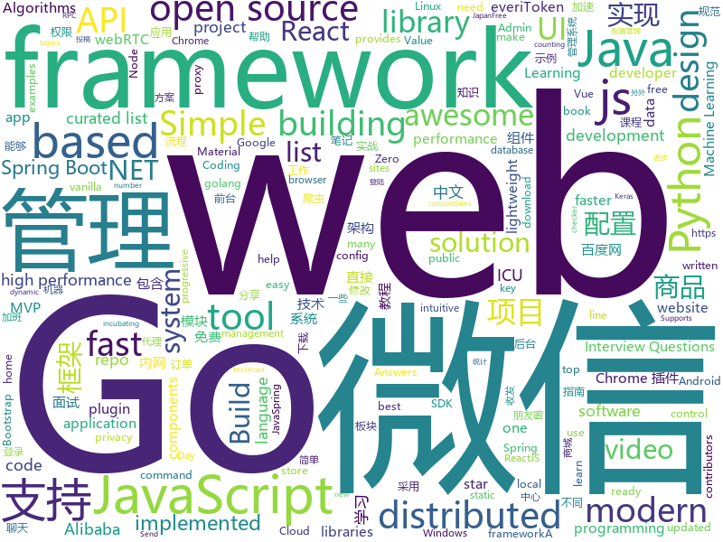

# 2019-03-31
See what the GitHub community is most excited about today.

## python
* [996.ICU](https://github.com/996icu/996.ICU)(**12,267 stars today**): Repo for counting stars and contributing. Press F to pay respect to glorious developers.
* [awesome-python-login-model](https://github.com/CriseLYJ/awesome-python-login-model)(**464 stars today**): 😮python模拟登陆一些大型网站，还有一些简单的爬虫，希望对你们有所帮助❤️，如果喜欢记得给个star哦🌟
* [pyright](https://github.com/Microsoft/pyright)(**76 stars today**): Static type checker for Python
* [Algorithm_Interview_Notes-Chinese](https://github.com/imhuay/Algorithm_Interview_Notes-Chinese)(**53 stars today**): 2018/2019/校招/春招/秋招/算法/机器学习(Machine Learning)/深度学习(Deep Learning)/自然语言处理(NLP)/C/C++/Python/面试笔记
* [public-speaking-with-meaning](https://github.com/xiaolai/public-speaking-with-meaning)(**56 stars today**): 《我也有话要说》—— 普通人的当众讲话技能
* [public-apis](https://github.com/toddmotto/public-apis)(**55 stars today**): A collective list of free APIs for use in software and web development.
* [awesome-python](https://github.com/vinta/awesome-python)(**49 stars today**): A curated list of awesome Python frameworks, libraries, software and resources
* [models](https://github.com/tensorflow/models)(**37 stars today**): Models and examples built with TensorFlow
* [system-design-primer](https://github.com/donnemartin/system-design-primer)(**44 stars today**): Learn how to design large-scale systems. Prep for the system design interview. Includes Anki flashcards.
* [ChromeAppHeroes](https://github.com/zhaoolee/ChromeAppHeroes)(**48 stars today**): 🌈Chrome插件英雄榜, 为优秀的Chrome插件写一本中文说明书, 让Chrome插件英雄们造福人类~ ChromePluginHeroes, Write a Chinese manual for the excellent Chrome plugin, let the Chrome plugin heroes benefit the human~
* [cartography](https://github.com/lyft/cartography)(**41 stars today**): Cartography is a Python tool that consolidates infrastructure assets and the relationships between them in an intuitive graph view powered by a Neo4j database.
* [Python](https://github.com/TheAlgorithms/Python)(**38 stars today**): All Algorithms implemented in Python
* [fastapi](https://github.com/tiangolo/fastapi)(**40 stars today**): FastAPI framework, high performance, easy to learn, fast to code, ready for production
* [keras](https://github.com/keras-team/keras)(**32 stars today**): Deep Learning for humans
* [Blue-ATTACK](https://github.com/rabobank-cdc/Blue-ATTACK)(**38 stars today**): Mapping your blue team to ATT&CK
* [bert](https://github.com/google-research/bert)(**34 stars today**): TensorFlow code and pre-trained models for BERT
* [you-get](https://github.com/soimort/you-get)(**34 stars today**): ⏬Dumb downloader that scrapes the web
* [cpython](https://github.com/python/cpython)(**31 stars today**): The Python programming language
* [PI-REC](https://github.com/youyuge34/PI-REC)(**33 stars today**): 🔥PI-REC: Progressive Image Reconstruction Network With Edge and Color Domain.🔥图像翻译，条件GAN，AI绘画
* [inltk](https://github.com/goru001/inltk)(**31 stars today**): Natural Language Toolkit for Indic Languages
* [instantbox](https://github.com/instantbox/instantbox)(**27 stars today**): Get a clean, ready-to-go Linux box in seconds.
* [scikit-learn](https://github.com/scikit-learn/scikit-learn)(**23 stars today**): scikit-learn: machine learning in Python
* [youtube-dl](https://github.com/ytdl-org/youtube-dl)(**25 stars today**): Command-line program to download videos from YouTube.com and other video sites
* [home-assistant](https://github.com/home-assistant/home-assistant)(**23 stars today**): 🏡Open source home automation that puts local control and privacy first
* [Mask_RCNN](https://github.com/matterport/Mask_RCNN)(**22 stars today**): Mask R-CNN for object detection and instance segmentation on Keras and TensorFlow

## java
* [JavaGuide](https://github.com/Snailclimb/JavaGuide)(**177 stars today**): 【Java学习+面试指南】 一份涵盖大部分Java程序员所需要掌握的核心知识。
* [mall](https://github.com/macrozheng/mall)(**77 stars today**): mall项目是一套电商系统，包括前台商城系统及后台管理系统，基于SpringBoot+MyBatis实现。 前台商城系统包含首页门户、商品推荐、商品搜索、商品展示、购物车、订单流程、会员中心、客户服务、帮助中心等模块。 后台管理系统包含商品管理、订单管理、会员管理、促销管理、运营管理、内容管理、统计报表、财务管理、权限管理、设置等模块。
* [spring-boot-examples](https://github.com/ityouknow/spring-boot-examples)(**57 stars today**): about learning Spring Boot via examples. Spring Boot 教程、技术栈示例代码，快速简单上手教程。
* [advanced-java](https://github.com/doocs/advanced-java)(**54 stars today**): 😮互联网 Java 工程师进阶知识完全扫盲
* [SpringBoot-Learning](https://github.com/dyc87112/SpringBoot-Learning)(**46 stars today**): Spring Boot基础教程，Spring Boot 2.x版本连载中！！！
* [spring-framework](https://github.com/spring-projects/spring-framework)(**38 stars today**): Spring Framework
* [java-design-patterns](https://github.com/iluwatar/java-design-patterns)(**40 stars today**): Design patterns implemented in Java
* [spring-boot](https://github.com/spring-projects/spring-boot)(**35 stars today**): Spring Boot
* [evt4j](https://github.com/everitoken/evt4j)(**39 stars today**): Official Java SDK for everiToken public chain. https://www.everitoken.io
* [elasticsearch](https://github.com/elastic/elasticsearch)(**30 stars today**): Open Source, Distributed, RESTful Search Engine
* [interviews](https://github.com/kdn251/interviews)(**32 stars today**): Everything you need to know to get the job.
* [tutorials](https://github.com/eugenp/tutorials)(**22 stars today**): The "REST With Spring" Course:
* [light-4j](https://github.com/networknt/light-4j)(**30 stars today**): A fast, lightweight and more productive microservices framework
* [Magisk](https://github.com/topjohnwu/Magisk)(**28 stars today**): A Magic Mask to Alter Android System Systemless-ly
* [incubator-dubbo](https://github.com/apache/incubator-dubbo)(**22 stars today**): Apache Dubbo (incubating) is a high-performance, java based, open source RPC framework.
* [Leetcode](https://github.com/fishercoder1534/Leetcode)(**24 stars today**): Complete solutions to Leetcode problems; updated daily. (I'm looking for long-term contributors/partners to this repo! Send me PRs if you're interested! - 9/5/2018)
* [incubator-skywalking](https://github.com/apache/incubator-skywalking)(**23 stars today**): APM, Application Performance Monitoring System
* [apollo](https://github.com/ctripcorp/apollo)(**23 stars today**): Apollo（阿波罗）是携程框架部门研发的分布式配置中心，能够集中化管理应用不同环境、不同集群的配置，配置修改后能够实时推送到应用端，并且具备规范的权限、流程治理等特性，适用于微服务配置管理场景。
* [guava](https://github.com/google/guava)(**21 stars today**): Google core libraries for Java
* [Java](https://github.com/TheAlgorithms/Java)(**22 stars today**): All Algorithms implemented in Java
* [spring-cloud-alibaba](https://github.com/spring-cloud-incubator/spring-cloud-alibaba)(**22 stars today**): Spring Cloud Alibaba provides a one-stop solution for application development for the distributed solutions of Alibaba middleware.
* [flink](https://github.com/apache/flink)(**16 stars today**): Apache Flink
* [FlyTour](https://github.com/geduo83/FlyTour)(**19 stars today**): Android MVP+组件化实战项目框架，工程架构采用gradle配置实现组件化，模块的架构采用典型的MVP架构，在Android项目框架搭建中中有很大的参考价值，MVP的架子直接复制粘贴到你的项目直接就能用，另外在长期的工作实践中总结整理大量的实用工具类在项目lib_common组件的util包当中
* [fescar](https://github.com/alibaba/fescar)(**16 stars today**): 🔥Fescar is an easy-to-use, high-performance, java based, open source distributed transaction solution.
* [arthas](https://github.com/alibaba/arthas)(**15 stars today**): Alibaba Java Diagnostic Tool Arthas/Alibaba Java诊断利器Arthas

## unknown
* [955.WLB](https://github.com/formulahendry/955.WLB)(**1,370 stars today**): 955 不加班的公司名单
* [Python-crawler-tutorial-starts-from-zero](https://github.com/CriseLYJ/Python-crawler-tutorial-starts-from-zero)(**558 stars today**): python爬虫教程，带你从零到一，包含js逆向，selenium, tesseract OCR识别,mongodb的使用，以及scrapy框架
* [free-programming-books](https://github.com/EbookFoundation/free-programming-books)(**334 stars today**): 📚Freely available programming books
* [CS-Notes](https://github.com/CyC2018/CS-Notes)(**220 stars today**): 📚技术面试必备基础知识
* [996ICU](https://github.com/995icu/996ICU)(**232 stars today**): 996ICU 995ICU 工作996 生病ICU 加班不规范 亲人两行泪
* [996.Law](https://github.com/Y1ran/996.Law)(**208 stars today**): 联合仲裁发起地 | 法律板块(主站：996.ICU)
* [everyone-can-use-english](https://github.com/xiaolai/everyone-can-use-english)(**147 stars today**): 人人都能用英语
* [996.TSC](https://github.com/lxlxw/996.TSC)(**95 stars today**): 996.ICU周边文化 | 创意板块(主站：996.ICU)
* [Daily-Interview-Question](https://github.com/Advanced-Frontend/Daily-Interview-Question)(**94 stars today**): 工作日每天一道前端大厂面试题，祝大家天天进步，一年后会看到不一样的自己。
* [awesome](https://github.com/sindresorhus/awesome)(**94 stars today**): 😎Awesome lists about all kinds of interesting topics
* [free-programming-books-zh_CN](https://github.com/justjavac/free-programming-books-zh_CN)(**57 stars today**): 📚免费的计算机编程类中文书籍，欢迎投稿
* [developer-roadmap](https://github.com/kamranahmedse/developer-roadmap)(**55 stars today**): Roadmap to becoming a web developer in 2019
* [You-Dont-Know-JS](https://github.com/getify/You-Dont-Know-JS)(**50 stars today**): A book series on JavaScript. @YDKJS on twitter.
* [reactjs-interview-questions](https://github.com/sudheerj/reactjs-interview-questions)(**54 stars today**): List of top 500 ReactJS Interview Questions & Answers....Coding exercise questions are coming soon!!
* [gitignore](https://github.com/github/gitignore)(**39 stars today**): A collection of useful .gitignore templates
* [vuejs-interview-questions](https://github.com/sudheerj/vuejs-interview-questions)(**51 stars today**): List of 300 VueJS Interview Questions And Answers
* [Data-Science--Cheat-Sheet](https://github.com/abhat222/Data-Science--Cheat-Sheet)(**46 stars today**): Cheat Sheets
* [hosts](https://github.com/googlehosts/hosts)(**39 stars today**): 镜像：https://coding.net/u/scaffrey/p/hosts/git
* [Micro8](https://github.com/Micropoor/Micro8)(**34 stars today**): Gitbook
* [stanford-cs-229-machine-learning](https://github.com/afshinea/stanford-cs-229-machine-learning)(**31 stars today**): VIP cheatsheets for Stanford's CS 229 Machine Learning
* [architect-awesome](https://github.com/xingshaocheng/architect-awesome)(**29 stars today**): 后端架构师技术图谱
* [awesome-vue](https://github.com/vuejs/awesome-vue)(**28 stars today**): 🎉A curated list of awesome things related to Vue.js
* [trackerslist](https://github.com/ngosang/trackerslist)(**28 stars today**): An updated list of public BitTorrent trackers
* [Awesome](https://github.com/Awesome-Windows/Awesome)(**27 stars today**): 💻An awesome & curated list of best applications and tools for Windows.

## javascript
* [Tone.js](https://github.com/Tonejs/Tone.js)(**220 stars today**): A Web Audio framework for making interactive music in the browser.
* [winXP](https://github.com/ShizukuIchi/winXP)(**176 stars today**): 🏁Web based Windows XP desktop recreation.
* [vue](https://github.com/vuejs/vue)(**156 stars today**): 🖖Vue.js is a progressive, incrementally-adoptable JavaScript framework for building UI on the web.
* [dialog-web-components](https://github.com/dialogs/dialog-web-components)(**108 stars today**): Set of react components for building messaging applications
* [reactjs-interview-questions](https://github.com/semlinker/reactjs-interview-questions)(**88 stars today**): List of top 301 ReactJS Interview Questions & Answers
* [cube.js](https://github.com/statsbotco/cube.js)(**75 stars today**): 📊Cube.js - Open Source Analytics Framework
* [react](https://github.com/facebook/react)(**65 stars today**): A declarative, efficient, and flexible JavaScript library for building user interfaces.
* [bootstrap](https://github.com/twbs/bootstrap)(**50 stars today**): The most popular HTML, CSS, and JavaScript framework for developing responsive, mobile first projects on the web.
* [Librefox](https://github.com/intika/Librefox)(**62 stars today**): Librefox: Firefox with privacy enhancements
* [Motrix](https://github.com/agalwood/Motrix)(**54 stars today**): A full-featured download manager.
* [pill](https://github.com/rumkin/pill)(**57 stars today**): Add dynamic content loading to static sites with only 1 KiB of JS
* [create-react-app](https://github.com/facebook/create-react-app)(**47 stars today**): Set up a modern web app by running one command.
* [dayjs](https://github.com/iamkun/dayjs)(**52 stars today**): ⏰Day.js 2KB immutable date library alternative to Moment.js with the same modern API
* [Awesome-Design-Tools](https://github.com/LisaDziuba/Awesome-Design-Tools)(**49 stars today**): The best design tools for everything👉
* [react-native](https://github.com/facebook/react-native)(**40 stars today**): A framework for building native apps with React.
* [axios](https://github.com/axios/axios)(**37 stars today**): Promise based HTTP client for the browser and node.js
* [React95](https://github.com/React95/React95)(**38 stars today**): A React components library with Win95 UI
* [baiduyun](https://github.com/syhyz1990/baiduyun)(**36 stars today**): 油猴脚本 直接下载百度网盘和百度网盘分享的文件,直链下载超级加速
* [griffith](https://github.com/zhihu/griffith)(**32 stars today**): A React-based web video player
* [is-thirteen](https://github.com/jezen/is-thirteen)(**34 stars today**): Check if a number is equal to 13.
* [javascript-algorithms](https://github.com/trekhleb/javascript-algorithms)(**30 stars today**): 📝Algorithms and data structures implemented in JavaScript with explanations and links to further readings
* [simple-peer](https://github.com/feross/simple-peer)(**32 stars today**): 📡Simple WebRTC video/voice and data channels
* [material-ui](https://github.com/mui-org/material-ui)(**22 stars today**): React components for faster and easier web development. Build your own design system, or start with Material Design.
* [node](https://github.com/nodejs/node)(**25 stars today**): Node.js JavaScript runtime✨🐢🚀✨
* [laxxx](https://github.com/alexfoxy/laxxx)(**30 stars today**): Simple & light weight (3kb minified & zipped) vanilla javascript plugin to create smooth & beautiful animations when you scrolllll! Harness the power of the most intuitive interaction and make your websites come alive!

## html
* [zju-icicles](https://github.com/QSCTech/zju-icicles)(**121 stars today**): 浙江大学课程攻略共享计划
* [WeChatAgreement.WebApi.Simple](https://github.com/changtuiqie/WeChatAgreement.WebApi.Simple)(**66 stars today**): 微信mac/ipad协议，webapi封装好的实现方案，免IIS一键部署。 可实现微信80%功能；支持62数据登录、扫码登录、收发朋友圈、查看朋友圈、微信建群、微信拉人进群、微信公众号阅读、微信消息收发、微信附近的人定位、微信添加好友、微信红包接收、微信防撤回、分享小程序、微信加粉、微信收藏、微信标签等
* [evtjs](https://github.com/everitoken/evtjs)(**38 stars today**): API Binding (SDK) for the everiToken blockchain.
* [personal-website](https://github.com/github/personal-website)(**19 stars today**): Code that'll help you kickstart a personal website that showcases your work as a software developer.
* [MikuTools](https://github.com/Ice-Hazymoon/MikuTools)(**19 stars today**): 一个轻量的工具集合
* [AdminLTE](https://github.com/ColorlibHQ/AdminLTE)(**15 stars today**): AdminLTE - Free Premium Admin control Panel Theme Based On Bootstrap 3.x
* [javascript-tutorial-en](https://github.com/iliakan/javascript-tutorial-en)(**15 stars today**): Modern JavaScript Tutorial
* [JavaScript30](https://github.com/wesbos/JavaScript30)(**9 stars today**): 30 Day Vanilla JS Challenge
* [Spoon-Knife](https://github.com/octocat/Spoon-Knife)(****): This repo is for demonstration purposes only.
* [day-day-up](https://github.com/zhenmang/day-day-up)(**14 stars today**): 
* [styleguide](https://github.com/google/styleguide)(**11 stars today**): Style guides for Google-originated open-source projects
* [Coursera-ML-AndrewNg-Notes](https://github.com/fengdu78/Coursera-ML-AndrewNg-Notes)(**10 stars today**): 吴恩达老师的机器学习课程个人笔记
* [lets-get-arrested](https://github.com/hamukazu/lets-get-arrested)(**7 stars today**): This project is intended to protest against the police in Japan
* [stisla](https://github.com/stisla/stisla)(**9 stars today**): Free Bootstrap Admin Template
* [ctf-wiki](https://github.com/ctf-wiki/ctf-wiki)(**8 stars today**): CTF Wiki Online, consider providing English version!
* [portainer](https://github.com/portainer/portainer)(**8 stars today**): Simple management UI for Docker
* [TranslatorX](https://github.com/pingfangx/TranslatorX)(**8 stars today**): JetBrains 系列软件汉化包
* [javascript-tutorial-zh](https://github.com/xitu/javascript-tutorial-zh)(**7 stars today**): Modern JavaScript Tutorial
* [dotnet](https://github.com/Microsoft/dotnet)(**7 stars today**): This repo is the official home of .NET on GitHub. It's a great starting point to find many .NET OSS projects from Microsoft and the community, including many that are part of the .NET Foundation.
* [fastText](https://github.com/facebookresearch/fastText)(**6 stars today**): Library for fast text representation and classification.
* [blog_os](https://github.com/phil-opp/blog_os)(**6 stars today**): Writing an OS in Rust
* [starrtc-android-demo](https://github.com/starrtc/starrtc-android-demo)(**6 stars today**): 🚀starRTC，免费IM（含单聊，群聊，聊天室），免费一对一视频聊天（回音消除），语音聊天，直播连麦，白板，小班课，多人会议，局域网无服务器直连，兼容webRTC, 支持webRTC加速，P2P高清传输，安卓、iOS、web互通，支持门禁可视对讲，电视盒子，树莓派，海思，全志，OTT设备，C语言自研方案，✨万水千山总是情，来个star行不行✨，更多示例请访问：
* [dawn](https://github.com/alibaba/dawn)(**5 stars today**): 🌅Dawn is a lightweight task management and build tool for front-end and nodejs.
* [flutter-in-action](https://github.com/flutterchina/flutter-in-action)(**5 stars today**): 《Flutter实战》电子书
* [all-contributors](https://github.com/all-contributors/all-contributors)(**5 stars today**): ✨Recognize all contributors, not just the ones who push code✨

## go
* [vugu](https://github.com/vugu/vugu)(**226 stars today**): Vugu: A modern UI library for Go+WebAssembly (experimental)
* [fyne](https://github.com/fyne-io/fyne)(**64 stars today**): Cross platform GUI in Go based on Material Design
* [go](https://github.com/golang/go)(**54 stars today**): The Go programming language
* [nps](https://github.com/cnlh/nps)(**48 stars today**): 一款轻量级、功能强大的内网穿透代理服务器。支持tcp、udp流量转发，支持内网http代理、内网socks5代理，同时支持snappy压缩、站点保护、加密传输、多路复用、header修改等。支持web图形化管理，集成多用户模式。
* [pomerium](https://github.com/pomerium/pomerium)(**49 stars today**): Pomerium is an identity-aware access proxy.
* [mkcert](https://github.com/FiloSottile/mkcert)(**46 stars today**): A simple zero-config tool to make locally trusted development certificates with any names you'd like.
* [awesome-go](https://github.com/avelino/awesome-go)(**40 stars today**): A curated list of awesome Go frameworks, libraries and software
* [kubernetes](https://github.com/kubernetes/kubernetes)(**38 stars today**): Production-Grade Container Scheduling and Management
* [frp](https://github.com/fatedier/frp)(**29 stars today**): A fast reverse proxy to help you expose a local server behind a NAT or firewall to the internet.
* [k3s](https://github.com/rancher/k3s)(**26 stars today**): Lightweight Kubernetes. 5 less than k8s.
* [build-web-application-with-golang](https://github.com/astaxie/build-web-application-with-golang)(**26 stars today**): A golang ebook intro how to build a web with golang
* [red](https://github.com/antonmedv/red)(**26 stars today**): Terminal log analysis tools
* [gin](https://github.com/gin-gonic/gin)(**23 stars today**): Gin is a HTTP web framework written in Go (Golang). It features a Martini-like API with much better performance -- up to 40 times faster. If you need smashing performance, get yourself some Gin.
* [hugo](https://github.com/gohugoio/hugo)(**22 stars today**): The world’s fastest framework for building websites.
* [BaiduPCS-Go](https://github.com/iikira/BaiduPCS-Go)(**22 stars today**): 百度网盘客户端 - Go语言编写
* [V](https://github.com/vlang-io/V)(**23 stars today**): Simple, fast, safe, compiled language for creating maintainable software. Supports translation from C/C++.
* [the-way-to-go_ZH_CN](https://github.com/Unknwon/the-way-to-go_ZH_CN)(**22 stars today**): 《The Way to Go》中文译本，中文正式名《Go 入门指南》
* [fzf](https://github.com/junegunn/fzf)(**22 stars today**): 🌸A command-line fuzzy finder
* [cobra](https://github.com/spf13/cobra)(**21 stars today**): A Commander for modern Go CLI interactions
* [lazygit](https://github.com/jesseduffield/lazygit)(**21 stars today**): simple terminal UI for git commands
* [golangci-lint](https://github.com/golangci/golangci-lint)(**21 stars today**): Linters Runner for Go. 5x faster than gometalinter. Nice colored output. Can report only new issues. Fewer false-positives. Yaml/toml config.
* [zerocopy](https://github.com/acln0/zerocopy)(**21 stars today**): Zero-copy I/O primitives and pipelines for Go. Linux-specific.
* [bitraft](https://github.com/prologic/bitraft)(**19 stars today**): A Bitcask Distributed Key/Value store using Raft for consensus with a Redis compatible API written in Go.
* [etcd](https://github.com/etcd-io/etcd)(**15 stars today**): Distributed reliable key-value store for the most critical data of a distributed system
* [space-cloud](https://github.com/spaceuptech/space-cloud)(**15 stars today**): Space Cloud is an open source, high performance web service which provides instant Realtime APIs on the database of your choice. Build highly scalable apps with the agility of a prototype!

## WordCloud

