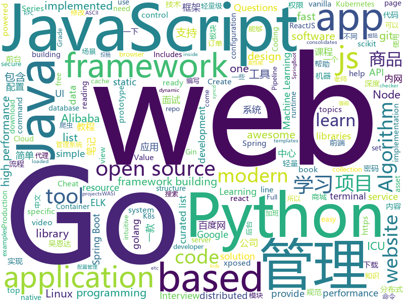

# 2019-04-01
See what the GitHub community is most excited about today.

## python
* [Python-crawler-tutorial-starts-from-zero](https://github.com/CriseLYJ/Python-crawler-tutorial-starts-from-zero)(**289 stars today**): python爬虫教程，带你从零到一，包含js逆向，selenium, tesseract OCR识别,mongodb的使用，以及scrapy框架
* [awesome-python-login-model](https://github.com/CriseLYJ/awesome-python-login-model)(**167 stars today**): 😮python模拟登陆一些大型网站，还有一些简单的爬虫，希望对你们有所帮助❤️，如果喜欢记得给个star哦🌟
* [pyright](https://github.com/Microsoft/pyright)(**96 stars today**): Static type checker for Python
* [system-design-primer](https://github.com/donnemartin/system-design-primer)(**79 stars today**): Learn how to design large-scale systems. Prep for the system design interview. Includes Anki flashcards.
* [Algorithm_Interview_Notes-Chinese](https://github.com/imhuay/Algorithm_Interview_Notes-Chinese)(**58 stars today**): 2018/2019/校招/春招/秋招/算法/机器学习(Machine Learning)/深度学习(Deep Learning)/自然语言处理(NLP)/C/C++/Python/面试笔记
* [instantbox](https://github.com/instantbox/instantbox)(**62 stars today**): Get a clean, ready-to-go Linux box in seconds.
* [awesome-python](https://github.com/vinta/awesome-python)(**53 stars today**): A curated list of awesome Python frameworks, libraries, software and resources
* [RW_Password](https://github.com/r35tart/RW_Password)(**48 stars today**): 此项目用来提取收集以往泄露的密码中符合条件的强弱密码
* [public-apis](https://github.com/toddmotto/public-apis)(**49 stars today**): A collective list of free APIs for use in software and web development.
* [public-speaking-with-meaning](https://github.com/xiaolai/public-speaking-with-meaning)(**45 stars today**): 《我也有话要说》—— 普通人的当众讲话技能
* [Blue-ATTACK](https://github.com/rabobank-cdc/Blue-ATTACK)(**51 stars today**): Mapping your blue team to ATT&CK
* [models](https://github.com/tensorflow/models)(**40 stars today**): Models and examples built with TensorFlow
* [mozc-devices](https://github.com/google/mozc-devices)(**45 stars today**): Automatically exported from code.google.com/p/mozc-morse
* [fastapi](https://github.com/tiangolo/fastapi)(**48 stars today**): FastAPI framework, high performance, easy to learn, fast to code, ready for production
* [Python](https://github.com/TheAlgorithms/Python)(**40 stars today**): All Algorithms implemented in Python
* [you-get](https://github.com/soimort/you-get)(**42 stars today**): ⏬Dumb downloader that scrapes the web
* [youtube-dl](https://github.com/ytdl-org/youtube-dl)(**37 stars today**): Command-line program to download videos from YouTube.com and other video sites
* [keras](https://github.com/keras-team/keras)(**34 stars today**): Deep Learning for humans
* [cpython](https://github.com/python/cpython)(**29 stars today**): The Python programming language
* [rosshow](https://github.com/dheera/rosshow)(**36 stars today**): Visualize ROS topics inside a terminal with Unicode/ASCII art
* [cartography](https://github.com/lyft/cartography)(**35 stars today**): Cartography is a Python tool that consolidates infrastructure assets and the relationships between them in an intuitive graph view powered by a Neo4j database.
* [CheatSheetSeries](https://github.com/OWASP/CheatSheetSeries)(**32 stars today**): The OWASP Cheat Sheet Series was created to provide a concise collection of high value information on specific application security topics.
* [flask](https://github.com/pallets/flask)(**29 stars today**): The Python micro framework for building web applications.
* [scikit-learn](https://github.com/scikit-learn/scikit-learn)(**29 stars today**): scikit-learn: machine learning in Python
* [bert](https://github.com/google-research/bert)(**26 stars today**): TensorFlow code and pre-trained models for BERT

## java
* [JavaGuide](https://github.com/Snailclimb/JavaGuide)(**146 stars today**): 【Java学习+面试指南】 一份涵盖大部分Java程序员所需要掌握的核心知识。
* [advanced-java](https://github.com/doocs/advanced-java)(**49 stars today**): 😮互联网 Java 工程师进阶知识完全扫盲
* [mall](https://github.com/macrozheng/mall)(**41 stars today**): mall项目是一套电商系统，包括前台商城系统及后台管理系统，基于SpringBoot+MyBatis实现。 前台商城系统包含首页门户、商品推荐、商品搜索、商品展示、购物车、订单流程、会员中心、客户服务、帮助中心等模块。 后台管理系统包含商品管理、订单管理、会员管理、促销管理、运营管理、内容管理、统计报表、财务管理、权限管理、设置等模块。
* [spring-boot-examples](https://github.com/ityouknow/spring-boot-examples)(**41 stars today**): about learning Spring Boot via examples. Spring Boot 教程、技术栈示例代码，快速简单上手教程。
* [java-design-patterns](https://github.com/iluwatar/java-design-patterns)(**34 stars today**): Design patterns implemented in Java
* [spring-boot](https://github.com/spring-projects/spring-boot)(**31 stars today**): Spring Boot
* [spring-framework](https://github.com/spring-projects/spring-framework)(**25 stars today**): Spring Framework
* [SpringBoot-Learning](https://github.com/dyc87112/SpringBoot-Learning)(**30 stars today**): Spring Boot基础教程，Spring Boot 2.x版本连载中！！！
* [fescar](https://github.com/alibaba/fescar)(**31 stars today**): 🔥Fescar is an easy-to-use, high-performance, java based, open source distributed transaction solution.
* [poc-graphql](https://github.com/righettod/poc-graphql)(**34 stars today**): Research on GraphQL from an AppSec point of view.
* [apollo](https://github.com/ctripcorp/apollo)(**28 stars today**): Apollo（阿波罗）是携程框架部门研发的分布式配置中心，能够集中化管理应用不同环境、不同集群的配置，配置修改后能够实时推送到应用端，并且具备规范的权限、流程治理等特性，适用于微服务配置管理场景。
* [elasticsearch](https://github.com/elastic/elasticsearch)(**26 stars today**): Open Source, Distributed, RESTful Search Engine
* [Java](https://github.com/TheAlgorithms/Java)(**25 stars today**): All Algorithms implemented in Java
* [interviews](https://github.com/kdn251/interviews)(**26 stars today**): Everything you need to know to get the job.
* [guava](https://github.com/google/guava)(**24 stars today**): Google core libraries for Java
* [incubator-dubbo](https://github.com/apache/incubator-dubbo)(**20 stars today**): Apache Dubbo (incubating) is a high-performance, java based, open source RPC framework.
* [tutorials](https://github.com/eugenp/tutorials)(**13 stars today**): The "REST With Spring" Course:
* [arthas](https://github.com/alibaba/arthas)(**22 stars today**): Alibaba Java Diagnostic Tool Arthas/Alibaba Java诊断利器Arthas
* [incubator-skywalking](https://github.com/apache/incubator-skywalking)(**23 stars today**): APM, Application Performance Monitoring System
* [Aegis](https://github.com/beemdevelopment/Aegis)(**22 stars today**): A secure OTP app for Android
* [ELK-Kafka-Zookeeper-collect-log](https://github.com/heiheiwangergou/ELK-Kafka-Zookeeper-collect-log)(**22 stars today**): 公司最新的项目需求，因为公司的日志采集框架发生了变化。换成了ELK。所以特地研究了一下ELK，所以整理了一下ELK的知识点和传上来一个小项目。
* [sofa-jraft](https://github.com/alipay/sofa-jraft)(**16 stars today**): A production-grade java implementation of RAFT consensus algorithm.
* [light-4j](https://github.com/networknt/light-4j)(**16 stars today**): A fast, lightweight and more productive microservices framework
* [Xpatch](https://github.com/WindySha/Xpatch)(**14 stars today**): 免Root实现app加载Xposed插件工具。This is a tool to repack apk file, then xposed modules installed can be loaded in when the app launched.It is another way to hook one app without rooting phone and double opening app.
* [spring-cloud-alibaba](https://github.com/spring-cloud-incubator/spring-cloud-alibaba)(**16 stars today**): Spring Cloud Alibaba provides a one-stop solution for application development for the distributed solutions of Alibaba middleware.

## unknown
* [955.WLB](https://github.com/formulahendry/955.WLB)(**998 stars today**): 955 不加班的公司名单
* [free-programming-books](https://github.com/EbookFoundation/free-programming-books)(**208 stars today**): 📚Freely available programming books
* [CS-Notes](https://github.com/CyC2018/CS-Notes)(**188 stars today**): 📚技术面试必备基础知识
* [notes](https://github.com/8483/notes)(**185 stars today**): Full-stack web development notes.
* [everyone-can-use-english](https://github.com/xiaolai/everyone-can-use-english)(**164 stars today**): 人人都能用英语
* [996ICU](https://github.com/995icu/996ICU)(**147 stars today**): 996ICU 995ICU 工作996 生病ICU 加班不规范 亲人两行泪
* [996.Law](https://github.com/Y1ran/996.Law)(**126 stars today**): 联合仲裁发起地 | 法律板块(主站：996.ICU)
* [awesome](https://github.com/sindresorhus/awesome)(**71 stars today**): 😎Awesome lists about all kinds of interesting topics
* [reactjs-interview-questions](https://github.com/sudheerj/reactjs-interview-questions)(**70 stars today**): List of top 500 ReactJS Interview Questions & Answers....Coding exercise questions are coming soon!!
* [996.TSC](https://github.com/lxlxw/996.TSC)(**68 stars today**): 996.ICU周边文化 | 创意板块(主站：996.ICU)
* [You-Dont-Know-JS](https://github.com/getify/You-Dont-Know-JS)(**61 stars today**): A book series on JavaScript. @YDKJS on twitter.
* [developer-roadmap](https://github.com/kamranahmedse/developer-roadmap)(**57 stars today**): Roadmap to becoming a web developer in 2019
* [gitignore](https://github.com/github/gitignore)(**38 stars today**): A collection of useful .gitignore templates
* [Daily-Interview-Question](https://github.com/Advanced-Frontend/Daily-Interview-Question)(**53 stars today**): 工作日每天一道前端大厂面试题，祝大家天天进步，一年后会看到不一样的自己。
* [Micro8](https://github.com/Micropoor/Micro8)(**43 stars today**): Gitbook
* [learning-rust](https://github.com/gruberb/learning-rust)(**48 stars today**): Material I come across which is beneficial in reading through to learn the language
* [stanford-cs-229-machine-learning](https://github.com/afshinea/stanford-cs-229-machine-learning)(**37 stars today**): VIP cheatsheets for Stanford's CS 229 Machine Learning
* [free-programming-books-zh_CN](https://github.com/justjavac/free-programming-books-zh_CN)(**35 stars today**): 📚免费的计算机编程类中文书籍，欢迎投稿
* [Data-Science--Cheat-Sheet](https://github.com/abhat222/Data-Science--Cheat-Sheet)(**33 stars today**): Cheat Sheets
* [pentest-guide](https://github.com/Voorivex/pentest-guide)(**38 stars today**): Penetration tests cases, resources and guidelines.
* [996-License-Draft](https://github.com/kattgu7/996-License-Draft)(**38 stars today**): Anti-996 License Draft
* [hosts](https://github.com/googlehosts/hosts)(**31 stars today**): 镜像：https://coding.net/u/scaffrey/p/hosts/git
* [TNFE-Weekly](https://github.com/Tnfe/TNFE-Weekly)(**32 stars today**): 每周为你提供高质量的关于小程序、h5等前端领域的文章和项目
* [trackerslist](https://github.com/ngosang/trackerslist)(**28 stars today**): An updated list of public BitTorrent trackers

## javascript
* [react](https://github.com/facebook/react)(**293 stars today**): A declarative, efficient, and flexible JavaScript library for building user interfaces.
* [winXP](https://github.com/ShizukuIchi/winXP)(**162 stars today**): 🏁Web based Windows XP desktop recreation.
* [vue](https://github.com/vuejs/vue)(**114 stars today**): 🖖Vue.js is a progressive, incrementally-adoptable JavaScript framework for building UI on the web.
* [Tone.js](https://github.com/Tonejs/Tone.js)(**119 stars today**): A Web Audio framework for making interactive music in the browser.
* [x-spreadsheet](https://github.com/myliang/x-spreadsheet)(**115 stars today**): A web-based JavaScript（canvas） spreadsheet
* [vexchords](https://github.com/0xfe/vexchords)(**104 stars today**): JavaScript Chord Charts
* [dialog-web-components](https://github.com/dialogs/dialog-web-components)(**88 stars today**): Set of react components for building messaging applications
* [razzle](https://github.com/jaredpalmer/razzle)(**79 stars today**): ✨Create server-rendered universal JavaScript applications with no configuration
* [cube.js](https://github.com/statsbotco/cube.js)(**68 stars today**): 📊Cube.js - Open Source Analytics Framework
* [whale-kit](https://github.com/jingwhale/whale-kit)(**64 stars today**): A quick prototype tool library for sketch. Includes page layout, page flow, Web Screen Shot, and more.
* [reactjs-interview-questions](https://github.com/semlinker/reactjs-interview-questions)(**62 stars today**): List of top 301 ReactJS Interview Questions & Answers
* [Motrix](https://github.com/agalwood/Motrix)(**53 stars today**): A full-featured download manager.
* [baiduyun](https://github.com/syhyz1990/baiduyun)(**53 stars today**): 油猴脚本 直接下载百度网盘和百度网盘分享的文件,直链下载超级加速
* [axios](https://github.com/axios/axios)(**51 stars today**): Promise based HTTP client for the browser and node.js
* [Awesome-Design-Tools](https://github.com/LisaDziuba/Awesome-Design-Tools)(**52 stars today**): The best design tools for everything👉
* [laxxx](https://github.com/alexfoxy/laxxx)(**52 stars today**): Simple & light weight (3kb minified & zipped) vanilla javascript plugin to create smooth & beautiful animations when you scrolllll! Harness the power of the most intuitive interaction and make your websites come alive!
* [create-react-app](https://github.com/facebook/create-react-app)(**38 stars today**): Set up a modern web app by running one command.
* [javascript-algorithms](https://github.com/trekhleb/javascript-algorithms)(**39 stars today**): 📝Algorithms and data structures implemented in JavaScript with explanations and links to further readings
* [saber](https://github.com/egoist/saber)(**43 stars today**): 🎀Saber.js is a simple yet powerful framework for building modern static websites.
* [node](https://github.com/nodejs/node)(**35 stars today**): Node.js JavaScript runtime✨🐢🚀✨
* [realworld](https://github.com/gothinkster/realworld)(**40 stars today**): "The mother of all demo apps" — Exemplary fullstack Medium.com clone powered by React, Angular, Node, Django, and many more🏅
* [Librefox](https://github.com/intika/Librefox)(**39 stars today**): Librefox: Firefox with privacy enhancements
* [cursor-effects](https://github.com/tholman/cursor-effects)(**37 stars today**): Only 90's kids remember
* [pill](https://github.com/rumkin/pill)(**37 stars today**): Add dynamic content loading to static sites with only 1 KiB of JS
* [egg-common-service](https://github.com/jingwhale/egg-common-service)(**36 stars today**): An eggjs-based node service set, including a patcheteer screenshot, etc.

## html
* [zju-icicles](https://github.com/QSCTech/zju-icicles)(**125 stars today**): 浙江大学课程攻略共享计划
* [deeplearning_ai_books](https://github.com/fengdu78/deeplearning_ai_books)(**32 stars today**): deeplearning.ai（吴恩达老师的深度学习课程笔记及资源）
* [Coursera-ML-AndrewNg-Notes](https://github.com/fengdu78/Coursera-ML-AndrewNg-Notes)(**23 stars today**): 吴恩达老师的机器学习课程个人笔记
* [personal-website](https://github.com/github/personal-website)(**17 stars today**): Code that'll help you kickstart a personal website that showcases your work as a software developer.
* [AdminLTE](https://github.com/ColorlibHQ/AdminLTE)(**15 stars today**): AdminLTE - Free Premium Admin control Panel Theme Based On Bootstrap 3.x
* [data-science-toolkit](https://github.com/pmaji/data-science-toolkit)(**17 stars today**): Collection of stats, modeling, and data science tools in Python and R.
* [lets-get-arrested](https://github.com/hamukazu/lets-get-arrested)(**15 stars today**): This project is intended to protest against the police in Japan
* [JavaScript30](https://github.com/wesbos/JavaScript30)(**10 stars today**): 30 Day Vanilla JS Challenge
* [day-day-up](https://github.com/zhenmang/day-day-up)(**15 stars today**): 
* [styleguide](https://github.com/google/styleguide)(**11 stars today**): Style guides for Google-originated open-source projects
* [wasi](https://github.com/CraneStation/wasi)(**12 stars today**): WASI overview
* [all-contributors](https://github.com/all-contributors/all-contributors)(**11 stars today**): ✨Recognize all contributors, not just the ones who push code✨
* [javascript-tutorial-en](https://github.com/iliakan/javascript-tutorial-en)(**10 stars today**): Modern JavaScript Tutorial
* [patchwork](https://github.com/jlord/patchwork)(**8 stars today**): All the Git-it Workshop completers!
* [fastText](https://github.com/facebookresearch/fastText)(**10 stars today**): Library for fast text representation and classification.
* [qiubaiying.github.io](https://github.com/qiubaiying/qiubaiying.github.io)(**5 stars today**): BY Blog ->
* [scikit-learn-doc-zh](https://github.com/apachecn/scikit-learn-doc-zh)(**10 stars today**): 📖[译] scikit-learn（sklearn） 中文文档
* [linux-command](https://github.com/jaywcjlove/linux-command)(**9 stars today**): Linux命令大全搜索工具，内容包含Linux命令手册、详解、学习、搜集。https://git.io/linux
* [Spoon-Knife](https://github.com/octocat/Spoon-Knife)(****): This repo is for demonstration purposes only.
* [awesome-competitive-programming](https://github.com/lnishan/awesome-competitive-programming)(**8 stars today**): 💎A curated list of awesome Competitive Programming, Algorithm and Data Structure resources
* [javascript-tutorial-zh](https://github.com/xitu/javascript-tutorial-zh)(**7 stars today**): Modern JavaScript Tutorial
* [glTF](https://github.com/KhronosGroup/glTF)(**8 stars today**): glTF – Runtime 3D Asset Delivery
* [website](https://github.com/kubernetes/website)(**5 stars today**): Kubernetes website and documentation repo:
* [MikuTools](https://github.com/Ice-Hazymoon/MikuTools)(**8 stars today**): 一个轻量的工具集合
* [flutter-in-action](https://github.com/flutterchina/flutter-in-action)(**7 stars today**): 《Flutter实战》电子书

## go
* [vugu](https://github.com/vugu/vugu)(**147 stars today**): Vugu: A modern UI library for Go+WebAssembly (experimental)
* [fyne](https://github.com/fyne-io/fyne)(**111 stars today**): Cross platform GUI in Go based on Material Design
* [go](https://github.com/golang/go)(**50 stars today**): The Go programming language
* [nps](https://github.com/cnlh/nps)(**44 stars today**): 一款轻量级、功能强大的内网穿透代理服务器。支持tcp、udp流量转发，支持内网http代理、内网socks5代理，同时支持snappy压缩、站点保护、加密传输、多路复用、header修改等。支持web图形化管理，集成多用户模式。
* [kubernetes](https://github.com/kubernetes/kubernetes)(**37 stars today**): Production-Grade Container Scheduling and Management
* [awesome-go](https://github.com/avelino/awesome-go)(**39 stars today**): A curated list of awesome Go frameworks, libraries and software
* [owlcache](https://github.com/xssed/owlcache)(**37 stars today**): 🦉owlcache 是一款由Go编写的轻量级、高性能、无中心分布式的Key/Value内存缓存型的数据共享应用(一定场景下可以作为轻量型数据库来使用)。 keyword : golang cache、go cache、golang nosql
* [BaiduPCS-Go](https://github.com/iikira/BaiduPCS-Go)(**32 stars today**): 百度网盘客户端 - Go语言编写
* [frp](https://github.com/fatedier/frp)(**28 stars today**): A fast reverse proxy to help you expose a local server behind a NAT or firewall to the internet.
* [red](https://github.com/antonmedv/red)(**30 stars today**): Terminal log analysis tools
* [space-cloud](https://github.com/spaceuptech/space-cloud)(**30 stars today**): Space Cloud is an open source, high performance web service which provides instant Realtime APIs on the database of your choice. Build highly scalable apps with the agility of a prototype!
* [lazygit](https://github.com/jesseduffield/lazygit)(**29 stars today**): simple terminal UI for git commands
* [hugo](https://github.com/gohugoio/hugo)(**26 stars today**): The world’s fastest framework for building websites.
* [gin](https://github.com/gin-gonic/gin)(**25 stars today**): Gin is a HTTP web framework written in Go (Golang). It features a Martini-like API with much better performance -- up to 40 times faster. If you need smashing performance, get yourself some Gin.
* [drone](https://github.com/drone/drone)(**24 stars today**): Drone is a Container-Native, Continuous Delivery Platform
* [zerocopy](https://github.com/acln0/zerocopy)(**24 stars today**): Zero-copy I/O primitives and pipelines for Go. Linux-specific.
* [syncd](https://github.com/dreamans/syncd)(**22 stars today**): syncd是一款开源的代码部署工具，它具有简单、高效、易用等特点，可以提高团队的工作效率.
* [fzf](https://github.com/junegunn/fzf)(**21 stars today**): 🌸A command-line fuzzy finder
* [k3s](https://github.com/rancher/k3s)(**18 stars today**): Lightweight Kubernetes. 5 less than k8s.
* [istio](https://github.com/istio/istio)(**17 stars today**): Connect, secure, control, and observe services.
* [pipeline](https://github.com/tektoncd/pipeline)(**18 stars today**): A K8s-native Pipeline resource.
* [cobra](https://github.com/spf13/cobra)(**17 stars today**): A Commander for modern Go CLI interactions
* [helm](https://github.com/helm/helm)(**15 stars today**): The Kubernetes Package Manager
* [go-ipfs](https://github.com/ipfs/go-ipfs)(**15 stars today**): IPFS implementation in Go
* [viper](https://github.com/spf13/viper)(**16 stars today**): Go configuration with fangs

## WordCloud

