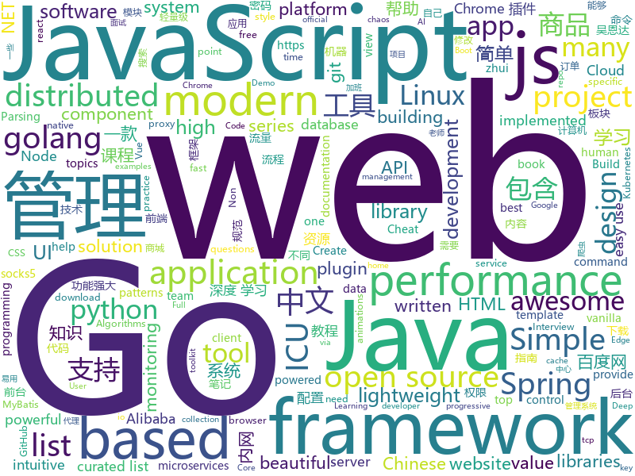

# 2019-04-02
See what the GitHub community is most excited about today.

## python
* [Python-crawler-tutorial-starts-from-zero](https://github.com/CriseLYJ/Python-crawler-tutorial-starts-from-zero)(**309 stars today**): python爬虫教程，带你从零到一，包含js逆向，selenium, tesseract OCR识别,mongodb的使用，以及scrapy框架
* [bsed](https://github.com/andrewbihl/bsed)(**269 stars today**): Simple SQL-like syntax on top of Perl text processing.
* [awesome-python-login-model](https://github.com/CriseLYJ/awesome-python-login-model)(**169 stars today**): 😮python模拟登陆一些大型网站，还有一些简单的爬虫，希望对你们有所帮助❤️，如果喜欢记得给个star哦🌟
* [pyright](https://github.com/Microsoft/pyright)(**92 stars today**): Static type checker for Python
* [system-design-primer](https://github.com/donnemartin/system-design-primer)(**83 stars today**): Learn how to design large-scale systems. Prep for the system design interview. Includes Anki flashcards.
* [USTC-Course](https://github.com/USTC-Resource/USTC-Course)(**73 stars today**): ❤️中国科学技术大学课程资源
* [models](https://github.com/tensorflow/models)(**57 stars today**): Models and examples built with TensorFlow
* [FastFCN](https://github.com/wuhuikai/FastFCN)(**71 stars today**): FastFCN: Rethinking Dilated Convolution in the Backbone for Semantic Segmentation.
* [awesome-python](https://github.com/vinta/awesome-python)(**67 stars today**): A curated list of awesome Python frameworks, libraries, software and resources
* [acronym](https://github.com/bacook17/acronym)(**69 stars today**): ACRONYM (Acronym CReatiON for You and Me)
* [Blue-ATTACK](https://github.com/rabobank-cdc/Blue-ATTACK)(**67 stars today**): Mapping your blue team to ATT&CK
* [CheatSheetSeries](https://github.com/OWASP/CheatSheetSeries)(**64 stars today**): The OWASP Cheat Sheet Series was created to provide a concise collection of high value information on specific application security topics.
* [keras](https://github.com/keras-team/keras)(**57 stars today**): Deep Learning for humans
* [public-apis](https://github.com/toddmotto/public-apis)(**62 stars today**): A collective list of free APIs for use in software and web development.
* [cartography](https://github.com/lyft/cartography)(**61 stars today**): Cartography is a Python tool that consolidates infrastructure assets and the relationships between them in an intuitive graph view powered by a Neo4j database.
* [faceswap](https://github.com/deepfakes/faceswap)(**52 stars today**): Non official project based on original /r/Deepfakes thread. Many thanks to him!
* [mozc-devices](https://github.com/google/mozc-devices)(**51 stars today**): Automatically exported from code.google.com/p/mozc-morse
* [instantbox](https://github.com/instantbox/instantbox)(**49 stars today**): Get a clean, ready-to-go Linux box in seconds.
* [Python](https://github.com/TheAlgorithms/Python)(**45 stars today**): All Algorithms implemented in Python
* [pytorch-lightning](https://github.com/williamFalcon/pytorch-lightning)(**48 stars today**): Rapid research framework for Pytorch. The researcher's version of keras
* [RW_Password](https://github.com/r35tart/RW_Password)(**41 stars today**): 此项目用来提取收集以往泄露的密码中符合条件的强弱密码
* [ChromeAppHeroes](https://github.com/zhaoolee/ChromeAppHeroes)(**45 stars today**): 🌈Chrome插件英雄榜, 为优秀的Chrome插件写一本中文说明书, 让Chrome插件英雄们造福人类~ ChromePluginHeroes, Write a Chinese manual for the excellent Chrome plugin, let the Chrome plugin heroes benefit the human~
* [PI-REC](https://github.com/youyuge34/PI-REC)(**43 stars today**): 🔥PI-REC: Progressive Image Reconstruction Network With Edge and Color Domain.🔥图像翻译，条件GAN，AI绘画
* [DeepCreamPy](https://github.com/deeppomf/DeepCreamPy)(**42 stars today**): Decensoring Hentai with Deep Neural Networks
* [huawei2019](https://github.com/gao793583308/huawei2019)(**37 stars today**): 2019届华为软件精英挑战赛赛题为“智能世界•纵横”！西北赛区33名

## java
* [JavaGuide](https://github.com/Snailclimb/JavaGuide)(**293 stars today**): 【Java学习+面试指南】 一份涵盖大部分Java程序员所需要掌握的核心知识。
* [advanced-java](https://github.com/doocs/advanced-java)(**267 stars today**): 😮互联网 Java 工程师进阶知识完全扫盲
* [seata](https://github.com/seata/seata)(**76 stars today**): 🔥Seata is an easy-to-use, high-performance, java based, open source distributed transaction solution.
* [mall](https://github.com/macrozheng/mall)(**69 stars today**): mall项目是一套电商系统，包括前台商城系统及后台管理系统，基于SpringBoot+MyBatis实现。 前台商城系统包含首页门户、商品推荐、商品搜索、商品展示、购物车、订单流程、会员中心、客户服务、帮助中心等模块。 后台管理系统包含商品管理、订单管理、会员管理、促销管理、运营管理、内容管理、统计报表、财务管理、权限管理、设置等模块。
* [spring-boot](https://github.com/spring-projects/spring-boot)(**61 stars today**): Spring Boot
* [spring-boot-examples](https://github.com/ityouknow/spring-boot-examples)(**63 stars today**): about learning Spring Boot via examples. Spring Boot 教程、技术栈示例代码，快速简单上手教程。
* [java-design-patterns](https://github.com/iluwatar/java-design-patterns)(**65 stars today**): Design patterns implemented in Java
* [light-4j](https://github.com/networknt/light-4j)(**52 stars today**): A fast, lightweight and more productive microservices framework
* [spring-framework](https://github.com/spring-projects/spring-framework)(**40 stars today**): Spring Framework
* [poc-graphql](https://github.com/righettod/poc-graphql)(**52 stars today**): Research on GraphQL from an AppSec point of view.
* [elasticsearch](https://github.com/elastic/elasticsearch)(**45 stars today**): Open Source, Distributed, RESTful Search Engine
* [tutorials](https://github.com/eugenp/tutorials)(**29 stars today**): The "REST With Spring" Course:
* [Java](https://github.com/TheAlgorithms/Java)(**40 stars today**): All Algorithms implemented in Java
* [interviews](https://github.com/kdn251/interviews)(**42 stars today**): Everything you need to know to get the job.
* [JCSprout](https://github.com/crossoverJie/JCSprout)(**40 stars today**): 👨‍🎓Java Core Sprout : basic, concurrent, algorithm
* [incubator-dubbo](https://github.com/apache/incubator-dubbo)(**35 stars today**): Apache Dubbo (incubating) is a high-performance, java based, open source RPC framework.
* [spring-cloud-alibaba](https://github.com/spring-cloud-incubator/spring-cloud-alibaba)(**37 stars today**): Spring Cloud Alibaba provides a one-stop solution for application development for the distributed solutions of Alibaba middleware.
* [Aegis](https://github.com/beemdevelopment/Aegis)(**39 stars today**): A secure OTP app for Android
* [arthas](https://github.com/alibaba/arthas)(**37 stars today**): Alibaba Java Diagnostic Tool Arthas/Alibaba Java诊断利器Arthas
* [guava](https://github.com/google/guava)(**36 stars today**): Google core libraries for Java
* [mybatis-plus](https://github.com/baomidou/mybatis-plus)(**34 stars today**): An powerful enhanced toolkit of MyBatis for simplify development
* [Sentinel](https://github.com/alibaba/Sentinel)(**32 stars today**): A lightweight powerful flow control component enabling reliability and monitoring for microservices. (轻量级的流量控制、熔断降级 Java 库)
* [incubator-skywalking](https://github.com/apache/incubator-skywalking)(**32 stars today**): APM, Application Performance Monitoring System
* [nacos](https://github.com/alibaba/nacos)(**30 stars today**): an easy-to-use dynamic service discovery, configuration and service management platform for building cloud native applications.
* [apollo](https://github.com/ctripcorp/apollo)(**25 stars today**): Apollo（阿波罗）是携程框架部门研发的分布式配置中心，能够集中化管理应用不同环境、不同集群的配置，配置修改后能够实时推送到应用端，并且具备规范的权限、流程治理等特性，适用于微服务配置管理场景。

## unknown
* [955.WLB](https://github.com/formulahendry/955.WLB)(**1,303 stars today**): 955 不加班的公司名单
* [notes](https://github.com/8483/notes)(**397 stars today**): Full-stack web development notes.
* [CS-Notes](https://github.com/CyC2018/CS-Notes)(**250 stars today**): 📚技术面试必备基础知识
* [free-programming-books](https://github.com/EbookFoundation/free-programming-books)(**247 stars today**): 📚Freely available programming books
* [everyone-can-use-english](https://github.com/xiaolai/everyone-can-use-english)(**228 stars today**): 人人都能用英语
* [DeepLearning-500-questions](https://github.com/scutan90/DeepLearning-500-questions)(**186 stars today**): 深度学习500问，以问答形式对常用的概率知识、线性代数、机器学习、深度学习、计算机视觉等热点问题进行阐述，以帮助自己及有需要的读者。 全书分为18个章节，近30万字。由于水平有限，书中不妥之处恳请广大读者批评指正。 未完待续............ 如有意合作，联系scutjy2015@163.com 版权所有，违权必究 Tan 2018.06
* [996ICU](https://github.com/995icu/996ICU)(**195 stars today**): 996ICU 995ICU 工作996 生病ICU 加班不规范 亲人两行泪
* [awesome](https://github.com/sindresorhus/awesome)(**119 stars today**): 😎Awesome lists about all kinds of interesting topics
* [996.Law](https://github.com/Y1ran/996.Law)(**125 stars today**): 联合仲裁发起地 | 法律板块(主站：996.ICU)
* [pentest-guide](https://github.com/Voorivex/pentest-guide)(**106 stars today**): Penetration tests cases, resources and guidelines.
* [developer-roadmap](https://github.com/kamranahmedse/developer-roadmap)(**98 stars today**): Roadmap to becoming a web developer in 2019
* [You-Dont-Know-JS](https://github.com/getify/You-Dont-Know-JS)(**94 stars today**): A book series on JavaScript. @YDKJS on twitter.
* [free-programming-books-zh_CN](https://github.com/justjavac/free-programming-books-zh_CN)(**90 stars today**): 📚免费的计算机编程类中文书籍，欢迎投稿
* [gitignore](https://github.com/github/gitignore)(**78 stars today**): A collection of useful .gitignore templates
* [Daily-Interview-Question](https://github.com/Advanced-Frontend/Daily-Interview-Question)(**91 stars today**): 工作日每天一道前端大厂面试题，祝大家天天进步，一年后会看到不一样的自己。
* [Data-Science--Cheat-Sheet](https://github.com/abhat222/Data-Science--Cheat-Sheet)(**57 stars today**): Cheat Sheets
* [coding-interview-university](https://github.com/jwasham/coding-interview-university)(**54 stars today**): A complete computer science study plan to become a software engineer.
* [reactjs-interview-questions](https://github.com/sudheerj/reactjs-interview-questions)(**57 stars today**): List of top 500 ReactJS Interview Questions & Answers....Coding exercise questions are coming soon!!
* [trackerslist](https://github.com/ngosang/trackerslist)(**49 stars today**): An updated list of public BitTorrent trackers
* [Proxyman](https://github.com/ProxymanApp/Proxyman)(**54 stars today**): A modern and intuitive HTTP Debugging Proxy app👨‍💻
* [weekly](https://github.com/dt-fe/weekly)(**51 stars today**): 前端精读周刊
* [996.TSC](https://github.com/lxlxw/996.TSC)(**49 stars today**): 996.ICU周边文化 | 创意板块(主站：996.ICU)
* [awesome-wechat-weapp](https://github.com/justjavac/awesome-wechat-weapp)(**46 stars today**): 微信小程序开发资源汇总💯
* [awesome-vue](https://github.com/vuejs/awesome-vue)(**49 stars today**): 🎉A curated list of awesome things related to Vue.js

## javascript
* [You-Dont-Need-jQuery](https://github.com/nefe/You-Dont-Need-jQuery)(**562 stars today**): Examples of how to do query, style, dom, ajax, event etc like jQuery with plain javascript.
* [x-spreadsheet](https://github.com/myliang/x-spreadsheet)(**388 stars today**): A web-based JavaScript（canvas） spreadsheet
* [zhui](https://github.com/zhui-team/zhui)(**360 stars today**): 🚀A Chinese style component library of react https://zhui-team.github.io/zhui/
* [winXP](https://github.com/ShizukuIchi/winXP)(**323 stars today**): 🏁Web based Windows XP desktop recreation.
* [vue](https://github.com/vuejs/vue)(**236 stars today**): 🖖Vue.js is a progressive, incrementally-adoptable JavaScript framework for building UI on the web.
* [react](https://github.com/facebook/react)(**147 stars today**): A declarative, efficient, and flexible JavaScript library for building user interfaces.
* [cube.js](https://github.com/statsbotco/cube.js)(**152 stars today**): 📊Cube.js - Open Source Analytics Framework
* [cursor-effects](https://github.com/tholman/cursor-effects)(**139 stars today**): Only 90's kids remember
* [Tone.js](https://github.com/Tonejs/Tone.js)(**115 stars today**): A Web Audio framework for making interactive music in the browser.
* [laxxx](https://github.com/alexfoxy/laxxx)(**103 stars today**): Simple & light weight (3kb minified & zipped) vanilla javascript plugin to create smooth & beautiful animations when you scrolllll! Harness the power of the most intuitive interaction and make your websites come alive!
* [hanzi-writer](https://github.com/chanind/hanzi-writer)(**88 stars today**): Chinese character stroke order animations and practice quizzes
* [Awesome-Design-Tools](https://github.com/LisaDziuba/Awesome-Design-Tools)(**88 stars today**): The best design tools for everything👉
* [dayjs](https://github.com/iamkun/dayjs)(**87 stars today**): ⏰Day.js 2KB immutable date library alternative to Moment.js with the same modern API
* [bootstrap](https://github.com/twbs/bootstrap)(**58 stars today**): The most popular HTML, CSS, and JavaScript framework for developing responsive, mobile first projects on the web.
* [Motrix](https://github.com/agalwood/Motrix)(**65 stars today**): A full-featured download manager.
* [razzle](https://github.com/jaredpalmer/razzle)(**67 stars today**): ✨Create server-rendered universal JavaScript applications with no configuration
* [perflink](https://github.com/lukejacksonn/perflink)(**65 stars today**): Low friction JavaScript benchmarks that you can share via URL
* [baiduyun](https://github.com/syhyz1990/baiduyun)(**59 stars today**): 油猴脚本 直接下载百度网盘和百度网盘分享的文件,直链下载超级加速
* [axios](https://github.com/axios/axios)(**56 stars today**): Promise based HTTP client for the browser and node.js
* [realworld](https://github.com/gothinkster/realworld)(**56 stars today**): "The mother of all demo apps" — Exemplary fullstack Medium.com clone powered by React, Angular, Node, Django, and many more🏅
* [css-doodle](https://github.com/css-doodle/css-doodle)(**54 stars today**): 🎨A web component for drawing patterns with CSS.
* [create-react-app](https://github.com/facebook/create-react-app)(**45 stars today**): Set up a modern web app by running one command.
* [maizzle](https://github.com/maizzle/maizzle)(**54 stars today**): HTML email development framework
* [nodebestpractices](https://github.com/i0natan/nodebestpractices)(**53 stars today**): ✅The largest Node.js best practices list (April 2019)
* [mercury-parser](https://github.com/postlight/mercury-parser)(**49 stars today**): 📜Extracting content from the chaos of the web.

## html
* [deeplearning_ai_books](https://github.com/fengdu78/deeplearning_ai_books)(**63 stars today**): deeplearning.ai（吴恩达老师的深度学习课程笔记及资源）
* [personal-website](https://github.com/github/personal-website)(**38 stars today**): Code that'll help you kickstart a personal website that showcases your work as a software developer.
* [home-assistant.io](https://github.com/home-assistant/home-assistant.io)(**28 stars today**): 📘Home Assistant User documentation
* [Coursera-ML-AndrewNg-Notes](https://github.com/fengdu78/Coursera-ML-AndrewNg-Notes)(**23 stars today**): 吴恩达老师的机器学习课程个人笔记
* [JavaScript30](https://github.com/wesbos/JavaScript30)(**14 stars today**): 30 Day Vanilla JS Challenge
* [styleguide](https://github.com/google/styleguide)(**20 stars today**): Style guides for Google-originated open-source projects
* [beautiful-jekyll](https://github.com/daattali/beautiful-jekyll)(**5 stars today**): ✨Build a beautiful and simple website in literally minutes. Demo at http://deanattali.com/beautiful-jekyll
* [evtjs](https://github.com/everitoken/evtjs)(**24 stars today**): API Binding (SDK) for the everiToken blockchain.
* [javascript-tutorial-en](https://github.com/iliakan/javascript-tutorial-en)(**19 stars today**): Modern JavaScript Tutorial
* [AdminLTE](https://github.com/ColorlibHQ/AdminLTE)(**14 stars today**): AdminLTE - Free Premium Admin control Panel Theme Based On Bootstrap 3.x
* [MikuTools](https://github.com/Ice-Hazymoon/MikuTools)(**18 stars today**): 一个轻量的工具集合
* [portainer](https://github.com/portainer/portainer)(**18 stars today**): Simple management UI for Docker
* [patchwork](https://github.com/jlord/patchwork)(**7 stars today**): All the Git-it Workshop completers!
* [Spoon-Knife](https://github.com/octocat/Spoon-Knife)(****): This repo is for demonstration purposes only.
* [day-day-up](https://github.com/zhenmang/day-day-up)(**15 stars today**): 
* [qiubaiying.github.io](https://github.com/qiubaiying/qiubaiying.github.io)(**7 stars today**): BY Blog ->
* [linux-command](https://github.com/jaywcjlove/linux-command)(**13 stars today**): Linux命令大全搜索工具，内容包含Linux命令手册、详解、学习、搜集。https://git.io/linux
* [swagger-codegen](https://github.com/swagger-api/swagger-codegen)(**13 stars today**): swagger-codegen contains a template-driven engine to generate documentation, API clients and server stubs in different languages by parsing your OpenAPI / Swagger definition.
* [requests-html](https://github.com/kennethreitz/requests-html)(**13 stars today**): Pythonic HTML Parsing for Humans™
* [lets-get-arrested](https://github.com/hamukazu/lets-get-arrested)(**9 stars today**): This project is intended to protest against the police in Japan
* [flutter-in-action](https://github.com/flutterchina/flutter-in-action)(**10 stars today**): 《Flutter实战》电子书
* [nginxconfig.io](https://github.com/valentinxxx/nginxconfig.io)(**11 stars today**): ⚙️NGiИX config generator on steroids💉
* [dotnet](https://github.com/Microsoft/dotnet)(**10 stars today**): This repo is the official home of .NET on GitHub. It's a great starting point to find many .NET OSS projects from Microsoft and the community, including many that are part of the .NET Foundation.
* [scikit-learn-doc-zh](https://github.com/apachecn/scikit-learn-doc-zh)(**9 stars today**): 📖[译] scikit-learn（sklearn） 中文文档
* [wasi](https://github.com/CraneStation/wasi)(**10 stars today**): WASI overview

## go
* [nps](https://github.com/cnlh/nps)(**212 stars today**): 一款轻量级、功能强大的内网穿透代理服务器。支持tcp、udp流量转发，支持内网http代理、内网socks5代理，同时支持snappy压缩、站点保护、加密传输、多路复用、header修改等。支持web图形化管理，集成多用户模式。
* [fyne](https://github.com/fyne-io/fyne)(**202 stars today**): Cross platform GUI in Go based on Material Design
* [vugu](https://github.com/vugu/vugu)(**146 stars today**): Vugu: A modern UI library for Go+WebAssembly (experimental)
* [lazygit](https://github.com/jesseduffield/lazygit)(**102 stars today**): simple terminal UI for git commands
* [kubernetes](https://github.com/kubernetes/kubernetes)(**63 stars today**): Production-Grade Container Scheduling and Management
* [go](https://github.com/golang/go)(**70 stars today**): The Go programming language
* [frp](https://github.com/fatedier/frp)(**54 stars today**): A fast reverse proxy to help you expose a local server behind a NAT or firewall to the internet.
* [awesome-go](https://github.com/avelino/awesome-go)(**45 stars today**): A curated list of awesome Go frameworks, libraries and software
* [syncd](https://github.com/dreamans/syncd)(**44 stars today**): syncd是一款开源的代码部署工具，它具有简单、高效、易用等特点，可以提高团队的工作效率.
* [owlcache](https://github.com/xssed/owlcache)(**45 stars today**): 🦉owlcache is a lightweight, high-performance, non-centralized, distributed Key/Value memory-cached data sharing application written by Go (used as a lightweight database in certain scenarios). keyword : golang cache、go cache、golang nosql
* [gin](https://github.com/gin-gonic/gin)(**39 stars today**): Gin is a HTTP web framework written in Go (Golang). It features a Martini-like API with much better performance -- up to 40 times faster. If you need smashing performance, get yourself some Gin.
* [zerocopy](https://github.com/acln0/zerocopy)(**39 stars today**): Zero-copy I/O primitives and pipelines for Go. Linux-specific.
* [chaosblade](https://github.com/chaosblade-io/chaosblade)(**37 stars today**): An easy to use and powerful chaos engineering experiment toolkit.（一款简单易用、功能强大的混沌实验注入工具）
* [build-web-application-with-golang](https://github.com/astaxie/build-web-application-with-golang)(**33 stars today**): A golang ebook intro how to build a web with golang
* [GoMet](https://github.com/mimah/GoMet)(**32 stars today**): Multi-platform implant written in Golang. TCP forwarding, socks5, tunneling, pivoting, shell, download, exec
* [helm](https://github.com/helm/helm)(**30 stars today**): The Kubernetes Package Manager
* [k3s](https://github.com/rancher/k3s)(**30 stars today**): Lightweight Kubernetes. 5 less than k8s.
* [traefik](https://github.com/containous/traefik)(**28 stars today**): The Cloud Native Edge Router
* [etcd](https://github.com/etcd-io/etcd)(**26 stars today**): Distributed reliable key-value store for the most critical data of a distributed system
* [prometheus](https://github.com/prometheus/prometheus)(**26 stars today**): The Prometheus monitoring system and time series database.
* [cobra](https://github.com/spf13/cobra)(**25 stars today**): A Commander for modern Go CLI interactions
* [red](https://github.com/antonmedv/red)(**25 stars today**): Terminal log analysis tools
* [BaiduPCS-Go](https://github.com/iikira/BaiduPCS-Go)(**25 stars today**): 百度网盘客户端 - Go语言编写
* [the-way-to-go_ZH_CN](https://github.com/Unknwon/the-way-to-go_ZH_CN)(**22 stars today**): 《The Way to Go》中文译本，中文正式名《Go 入门指南》
* [fzf](https://github.com/junegunn/fzf)(**25 stars today**): 🌸A command-line fuzzy finder

## WordCloud

