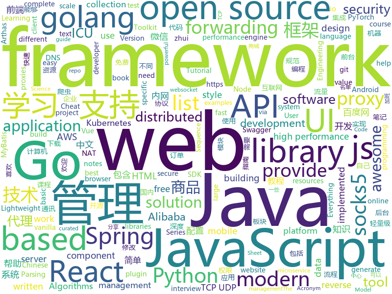

# 2019-04-03
See what the GitHub community is most excited about today.

## python
* [CDCS](https://github.com/geekinglcq/CDCS)(**433 stars today**): Chinese Data Competitions' Solutions
* [PyTorch-BigGraph](https://github.com/facebookresearch/PyTorch-BigGraph)(**230 stars today**): Software used for generating embeddings from large-scale graph-structured data.
* [Python-crawler-tutorial-starts-from-zero](https://github.com/CriseLYJ/Python-crawler-tutorial-starts-from-zero)(**188 stars today**): python爬虫教程，带你从零到一，包含js逆向，selenium, tesseract OCR识别,mongodb的使用，以及scrapy框架
* [fireprox](https://github.com/ustayready/fireprox)(**174 stars today**): AWS API Gateway management tool for creating on the fly HTTP pass-through proxies for unique IP rotation
* [awesome-python-login-model](https://github.com/CriseLYJ/awesome-python-login-model)(**114 stars today**): 😮python模拟登陆一些大型网站，还有一些简单的爬虫，希望对你们有所帮助❤️，如果喜欢记得给个star哦🌟
* [public-apis](https://github.com/toddmotto/public-apis)(**116 stars today**): A collective list of free APIs for use in software and web development.
* [models](https://github.com/tensorflow/models)(**75 stars today**): Models and examples built with TensorFlow
* [system-design-primer](https://github.com/donnemartin/system-design-primer)(**85 stars today**): Learn how to design large-scale systems. Prep for the system design interview. Includes Anki flashcards.
* [pytorch-lightning](https://github.com/williamFalcon/pytorch-lightning)(**87 stars today**): Rapid research framework for Pytorch. The researcher's version of keras
* [dabl](https://github.com/amueller/dabl)(**80 stars today**): Data Analysis Baseline Library
* [awesome-python](https://github.com/vinta/awesome-python)(**68 stars today**): A curated list of awesome Python frameworks, libraries, software and resources
* [USTC-Course](https://github.com/USTC-Resource/USTC-Course)(**63 stars today**): ❤️中国科学技术大学课程资源
* [bsed](https://github.com/andrewbihl/bsed)(**64 stars today**): Simple SQL-like syntax on top of Perl text processing.
* [densebody_pytorch](https://github.com/Lotayou/densebody_pytorch)(**65 stars today**): PyTorch implementation of CloudWalk's recent work DenseBody
* [Python](https://github.com/TheAlgorithms/Python)(**57 stars today**): All Algorithms implemented in Python
* [pyright](https://github.com/Microsoft/pyright)(**62 stars today**): Static type checker for Python
* [CheatSheetSeries](https://github.com/OWASP/CheatSheetSeries)(**59 stars today**): The OWASP Cheat Sheet Series was created to provide a concise collection of high value information on specific application security topics.
* [flask](https://github.com/pallets/flask)(**47 stars today**): The Python micro framework for building web applications.
* [automl-gs](https://github.com/minimaxir/automl-gs)(**49 stars today**): Provide an input CSV and a target field to predict, generate a model + code to run it.
* [you-get](https://github.com/soimort/you-get)(**43 stars today**): ⏬Dumb downloader that scrapes the web
* [socialscan](https://github.com/iojw/socialscan)(**49 stars today**): Check email address and username usage on online platforms
* [fairseq](https://github.com/pytorch/fairseq)(**46 stars today**): Facebook AI Research Sequence-to-Sequence Toolkit written in Python.
* [acronym](https://github.com/bacook17/acronym)(**46 stars today**): ACRONYM (Acronym CReatiON for You and Me)
* [faceswap](https://github.com/deepfakes/faceswap)(**44 stars today**): Non official project based on original /r/Deepfakes thread. Many thanks to him!
* [django](https://github.com/django/django)(**39 stars today**): The Web framework for perfectionists with deadlines.

## java
* [advanced-java](https://github.com/doocs/advanced-java)(**968 stars today**): 😮互联网 Java 工程师进阶知识完全扫盲
* [JavaGuide](https://github.com/Snailclimb/JavaGuide)(**290 stars today**): 【Java学习+面试指南】 一份涵盖大部分Java程序员所需要掌握的核心知识。
* [ZXBlog](https://github.com/ZXZxin/ZXBlog)(**240 stars today**): 记录各种学习笔记(算法、Java、数据库、并发......)
* [AWS-Java-Samples](https://github.com/wazcov/AWS-Java-Samples)(**137 stars today**): A repository of basic AWS samples to get you started connecting to various AWS Services like SQS.
* [mall](https://github.com/macrozheng/mall)(**104 stars today**): mall项目是一套电商系统，包括前台商城系统及后台管理系统，基于SpringBoot+MyBatis实现。 前台商城系统包含首页门户、商品推荐、商品搜索、商品展示、购物车、订单流程、会员中心、客户服务、帮助中心等模块。 后台管理系统包含商品管理、订单管理、会员管理、促销管理、运营管理、内容管理、统计报表、财务管理、权限管理、设置等模块。
* [spring-boot](https://github.com/spring-projects/spring-boot)(**66 stars today**): Spring Boot
* [tutorials](https://github.com/eugenp/tutorials)(**50 stars today**): The "REST With Spring" Course:
* [spring-boot-examples](https://github.com/ityouknow/spring-boot-examples)(**65 stars today**): about learning Spring Boot via examples. Spring Boot 教程、技术栈示例代码，快速简单上手教程。
* [arthas](https://github.com/alibaba/arthas)(**64 stars today**): Alibaba Java Diagnostic Tool Arthas/Alibaba Java诊断利器Arthas
* [APIJSON](https://github.com/TommyLemon/APIJSON)(**57 stars today**): 🚀A JSON Transmission Protocol and an ORM Library for auto providing APIs and Documents.
* [elasticsearch](https://github.com/elastic/elasticsearch)(**51 stars today**): Open Source, Distributed, RESTful Search Engine
* [seata](https://github.com/seata/seata)(**54 stars today**): 🔥Seata is an easy-to-use, high-performance, java based, open source distributed transaction solution.
* [mybatis-plus](https://github.com/baomidou/mybatis-plus)(**54 stars today**): An powerful enhanced toolkit of MyBatis for simplify development
* [spring-framework](https://github.com/spring-projects/spring-framework)(**44 stars today**): Spring Framework
* [Android-ZBLibrary](https://github.com/TommyLemon/Android-ZBLibrary)(**50 stars today**): 🔥Android MVP快速开发框架，做国内 「Demo最全面」「注释最详细」「使用最简单」「代码最严谨」的Android开源UI框架
* [interviews](https://github.com/kdn251/interviews)(**49 stars today**): Everything you need to know to get the job.
* [Java](https://github.com/TheAlgorithms/Java)(**45 stars today**): All Algorithms implemented in Java
* [incubator-dubbo](https://github.com/apache/incubator-dubbo)(**35 stars today**): Apache Dubbo (incubating) is a high-performance, java based, open source RPC framework.
* [apollo](https://github.com/ctripcorp/apollo)(**43 stars today**): Apollo（阿波罗）是携程框架部门研发的分布式配置中心，能够集中化管理应用不同环境、不同集群的配置，配置修改后能够实时推送到应用端，并且具备规范的权限、流程治理等特性，适用于微服务配置管理场景。
* [tink](https://github.com/google/tink)(**46 stars today**): Tink is a multi-language, cross-platform, open source library that provides cryptographic APIs that are secure, easy to use correctly, and hard(er) to misuse.
* [spring-cloud-alibaba](https://github.com/spring-cloud-incubator/spring-cloud-alibaba)(**42 stars today**): Spring Cloud Alibaba provides a one-stop solution for application development for the distributed solutions of Alibaba middleware.
* [WxJava](https://github.com/Wechat-Group/WxJava)(**41 stars today**): WxJava （微信开发 Java SDK），支持包括微信支付、开放平台、小程序、企业微信/企业号和公众号等的后端开发
* [JCSprout](https://github.com/crossoverJie/JCSprout)(**41 stars today**): 👨‍🎓Java Core Sprout : basic, concurrent, algorithm
* [Sentinel](https://github.com/alibaba/Sentinel)(**39 stars today**): A lightweight powerful flow control component enabling reliability and monitoring for microservices. (轻量级的流量控制、熔断降级 Java 库)
* [server](https://github.com/wildfirechat/server)(**38 stars today**): 开源免费的即时通讯软件，功能和UI符合国内习惯，比XMPP具有更适合移动端的协议，可以作为IM组件代替环信、融云、网易云信等云通讯和XMPP

## unknown
* [955.WLB](https://github.com/formulahendry/955.WLB)(**988 stars today**): 955 不加班的公司名单
* [Awesome-Interview](https://github.com/Awesome-Interview/Awesome-Interview)(**299 stars today**): Collection of awesome interview references.
* [notes](https://github.com/8483/notes)(**297 stars today**): Full-stack web development notes.
* [996ICU](https://github.com/995icu/996ICU)(**269 stars today**): 996ICU 995ICU 工作996 生病ICU 加班不规范 亲人两行泪
* [CS-Notes](https://github.com/CyC2018/CS-Notes)(**239 stars today**): 📚技术面试必备基础知识
* [RE-iOS-Apps](https://github.com/ivRodriguezCA/RE-iOS-Apps)(**239 stars today**): A completely free, open source and online course about Reverse Engineering iOS Applications.
* [everyone-can-use-english](https://github.com/xiaolai/everyone-can-use-english)(**229 stars today**): 人人都能用英语
* [free-programming-books](https://github.com/EbookFoundation/free-programming-books)(**203 stars today**): 📚Freely available programming books
* [DeepLearning-500-questions](https://github.com/scutan90/DeepLearning-500-questions)(**179 stars today**): 深度学习500问，以问答形式对常用的概率知识、线性代数、机器学习、深度学习、计算机视觉等热点问题进行阐述，以帮助自己及有需要的读者。 全书分为18个章节，近30万字。由于水平有限，书中不妥之处恳请广大读者批评指正。 未完待续............ 如有意合作，联系scutjy2015@163.com 版权所有，违权必究 Tan 2018.06
* [Data-Science--Cheat-Sheet](https://github.com/abhat222/Data-Science--Cheat-Sheet)(**129 stars today**): Cheat Sheets
* [awesome](https://github.com/sindresorhus/awesome)(**134 stars today**): 😎Awesome lists about all kinds of interesting topics
* [Anti-996-License](https://github.com/kattgu7/Anti-996-License)(**110 stars today**): Anti-996 License Version 1.0
* [996.Law](https://github.com/Y1ran/996.Law)(**104 stars today**): 联合仲裁发起地 | 法律板块(主站：996.ICU)
* [developer-roadmap](https://github.com/kamranahmedse/developer-roadmap)(**92 stars today**): Roadmap to becoming a web developer in 2019
* [You-Dont-Know-JS](https://github.com/getify/You-Dont-Know-JS)(**86 stars today**): A book series on JavaScript. @YDKJS on twitter.
* [free-programming-books-zh_CN](https://github.com/justjavac/free-programming-books-zh_CN)(**85 stars today**): 📚免费的计算机编程类中文书籍，欢迎投稿
* [gitignore](https://github.com/github/gitignore)(**64 stars today**): A collection of useful .gitignore templates
* [pentest-guide](https://github.com/Voorivex/pentest-guide)(**66 stars today**): Penetration tests cases, resources and guidelines.
* [Daily-Interview-Question](https://github.com/Advanced-Frontend/Daily-Interview-Question)(**64 stars today**): 工作日每天一道前端大厂面试题，祝大家天天进步，一年后会看到不一样的自己。
* [computer-science](https://github.com/ossu/computer-science)(**56 stars today**): 🎓Path to a free self-taught education in Computer Science!
* [trackerslist](https://github.com/ngosang/trackerslist)(**55 stars today**): An updated list of public BitTorrent trackers
* [cvpr2019](https://github.com/extreme-assistant/cvpr2019)(**53 stars today**): cvpr2019 papers
* [coding-interview-university](https://github.com/jwasham/coding-interview-university)(**47 stars today**): A complete computer science study plan to become a software engineer.
* [996.TSC](https://github.com/lxlxw/996.TSC)(**51 stars today**): 996.ICU周边文化 | 创意板块(主站：996.ICU)

## javascript
* [react-loops](https://github.com/leebyron/react-loops)(**404 stars today**): React Loops works with React Hooks as part of the React Velcro Architecture
* [You-Dont-Need-jQuery](https://github.com/nefe/You-Dont-Need-jQuery)(**392 stars today**): Examples of how to do query, style, dom, ajax, event etc like jQuery with plain javascript.
* [vue](https://github.com/vuejs/vue)(**228 stars today**): 🖖Vue.js is a progressive, incrementally-adoptable JavaScript framework for building UI on the web.
* [zhui](https://github.com/zhui-team/zhui)(**228 stars today**): 🚀A Chinese style component library of react https://zhui-team.github.io/zhui/
* [AutoPiano](https://github.com/WarpPrism/AutoPiano)(**216 stars today**): 自由钢琴 AutoPiano，喜欢可以star
* [perflink](https://github.com/lukejacksonn/perflink)(**211 stars today**): Low friction JavaScript benchmarks that you can share via URL
* [winXP](https://github.com/ShizukuIchi/winXP)(**173 stars today**): 🏁Web based Windows XP desktop recreation.
* [react](https://github.com/facebook/react)(**139 stars today**): A declarative, efficient, and flexible JavaScript library for building user interfaces.
* [x-spreadsheet](https://github.com/myliang/x-spreadsheet)(**134 stars today**): A web-based JavaScript（canvas） spreadsheet
* [cube.js](https://github.com/statsbotco/cube.js)(**110 stars today**): 📊Cube.js - Open Source Analytics Framework
* [dayjs](https://github.com/iamkun/dayjs)(**108 stars today**): ⏰Day.js 2KB immutable date library alternative to Moment.js with the same modern API
* [laxxx](https://github.com/alexfoxy/laxxx)(**103 stars today**): Simple & light weight (3kb minified & zipped) vanilla javascript plugin to create smooth & beautiful animations when you scrolllll! Harness the power of the most intuitive interaction and make your websites come alive!
* [HanCount](https://github.com/KHC-ZhiHao/HanCount)(**94 stars today**): 這是一個youtube直播的計數器
* [Awesome-Design-Tools](https://github.com/LisaDziuba/Awesome-Design-Tools)(**74 stars today**): The best design tools for everything👉
* [axios](https://github.com/axios/axios)(**73 stars today**): Promise based HTTP client for the browser and node.js
* [k8dash](https://github.com/herbrandson/k8dash)(**74 stars today**): Simple Kubernetes realtime dashboard and management
* [bootstrap](https://github.com/twbs/bootstrap)(**46 stars today**): The most popular HTML, CSS, and JavaScript framework for developing responsive, mobile first projects on the web.
* [storybook](https://github.com/storybooks/storybook)(**55 stars today**): UI component dev & test: React, Vue, Angular, React Native, Ember & more!
* [Tone.js](https://github.com/Tonejs/Tone.js)(**58 stars today**): A Web Audio framework for making interactive music in the browser.
* [maizzle](https://github.com/maizzle/maizzle)(**54 stars today**): HTML email development framework
* [node](https://github.com/nodejs/node)(**46 stars today**): Node.js JavaScript runtime✨🐢🚀✨
* [baiduyun](https://github.com/syhyz1990/baiduyun)(**52 stars today**): 油猴脚本 直接下载百度网盘和百度网盘分享的文件,直链下载超级加速
* [puppeteer](https://github.com/GoogleChrome/puppeteer)(**48 stars today**): Headless Chrome Node API
* [cursor-effects](https://github.com/tholman/cursor-effects)(**50 stars today**): Only 90's kids remember
* [find-a-mentor](https://github.com/Coding-Coach/find-a-mentor)(**47 stars today**): Coding Coach alpha website

## html
* [Unifiedtransform](https://github.com/changeweb/Unifiedtransform)(**165 stars today**): A school management Software
* [Pseudo-original](https://github.com/bunian/Pseudo-original)(**32 stars today**): ai Pseudo original,文章伪原创
* [personal-website](https://github.com/github/personal-website)(**24 stars today**): Code that'll help you kickstart a personal website that showcases your work as a software developer.
* [javascript-tutorial-en](https://github.com/iliakan/javascript-tutorial-en)(**29 stars today**): Modern JavaScript Tutorial
* [Coursera-ML-AndrewNg-Notes](https://github.com/fengdu78/Coursera-ML-AndrewNg-Notes)(**28 stars today**): 吴恩达老师的机器学习课程个人笔记
* [home-assistant.io](https://github.com/home-assistant/home-assistant.io)(**24 stars today**): 📘Home Assistant User documentation
* [styleguide](https://github.com/google/styleguide)(**22 stars today**): Style guides for Google-originated open-source projects
* [Spoon-Knife](https://github.com/octocat/Spoon-Knife)(****): This repo is for demonstration purposes only.
* [patchwork](https://github.com/jlord/patchwork)(****): All the Git-it Workshop completers!
* [DetectionLab](https://github.com/clong/DetectionLab)(**19 stars today**): Vagrant & Packer scripts to build a lab environment complete with security tooling and logging best practices
* [evtjs](https://github.com/everitoken/evtjs)(**19 stars today**): API Binding (SDK) for the everiToken blockchain.
* [requests-html](https://github.com/kennethreitz/requests-html)(**17 stars today**): Pythonic HTML Parsing for Humans™
* [portainer](https://github.com/portainer/portainer)(**16 stars today**): Simple management UI for Docker
* [fastText](https://github.com/facebookresearch/fastText)(**13 stars today**): Library for fast text representation and classification.
* [day-day-up](https://github.com/zhenmang/day-day-up)(**15 stars today**): 
* [MikuTools](https://github.com/Ice-Hazymoon/MikuTools)(**13 stars today**): 一个轻量的工具集合
* [JavaScript30](https://github.com/wesbos/JavaScript30)(**9 stars today**): 30 Day Vanilla JS Challenge
* [learning-area](https://github.com/mdn/learning-area)(**7 stars today**): Github repo for the MDN Learning Area.
* [swagger-codegen](https://github.com/swagger-api/swagger-codegen)(**10 stars today**): swagger-codegen contains a template-driven engine to generate documentation, API clients and server stubs in different languages by parsing your OpenAPI / Swagger definition.
* [javascript-tutorial-zh](https://github.com/xitu/javascript-tutorial-zh)(**11 stars today**): Modern JavaScript Tutorial
* [frontendDaily](https://github.com/kujian/frontendDaily)(**11 stars today**): 前端开发技术日报，每日分享互联网最精彩的前端技术、前端资讯、后端编程、设计和资源等，欢迎关注Watch
* [cs231n.github.io](https://github.com/cs231n/cs231n.github.io)(**9 stars today**): Public facing notes page
* [gentelella](https://github.com/ColorlibHQ/gentelella)(**8 stars today**): Free Bootstrap 3 Admin Template
* [owasp-mstg](https://github.com/OWASP/owasp-mstg)(**7 stars today**): The Mobile Security Testing Guide (MSTG) is a comprehensive manual for mobile app security testing and reverse engineering.
* [devops-essentials-sample-app](https://github.com/linuxacademy/devops-essentials-sample-app)(****): 

## go
* [nps](https://github.com/cnlh/nps)(**404 stars today**): 一款轻量级、功能强大的内网穿透代理服务器。支持tcp、udp流量转发，支持内网http代理、内网socks5代理，同时支持snappy压缩、站点保护、加密传输、多路复用、header修改等。支持web图形化管理，集成多用户模式。
* [goweight](https://github.com/jondot/goweight)(**147 stars today**): A tool to analyze and troubleshoot a Go binary size.
* [vugu](https://github.com/vugu/vugu)(**94 stars today**): Vugu: A modern UI library for Go+WebAssembly (experimental)
* [kubernetes](https://github.com/kubernetes/kubernetes)(**71 stars today**): Production-Grade Container Scheduling and Management
* [go](https://github.com/golang/go)(**75 stars today**): The Go programming language
* [lazygit](https://github.com/jesseduffield/lazygit)(**75 stars today**): simple terminal UI for git commands
* [go-echarts](https://github.com/chenjiandongx/go-echarts)(**72 stars today**): 🎨The adorable charts library for Golang
* [fyne](https://github.com/fyne-io/fyne)(**69 stars today**): Cross platform GUI in Go based on Material Design
* [GoMet](https://github.com/mimah/GoMet)(**66 stars today**): Multi-platform implant written in Golang. TCP forwarding, socks5, tunneling, pivoting, shell, download, exec
* [awesome-golang-leetcode](https://github.com/kylesliu/awesome-golang-leetcode)(**62 stars today**): 📝LeetCode of algorithms with golang solution(updating).
* [es-operator](https://github.com/zalando-incubator/es-operator)(**61 stars today**): Kubernetes Operator for Elasticsearch
* [terraform-provider-dominos](https://github.com/ndmckinley/terraform-provider-dominos)(**61 stars today**): The Terraform plugin for the Dominos Pizza provider.
* [awesome-go](https://github.com/avelino/awesome-go)(**52 stars today**): A curated list of awesome Go frameworks, libraries and software
* [frp](https://github.com/fatedier/frp)(**50 stars today**): A fast reverse proxy to help you expose a local server behind a NAT or firewall to the internet.
* [build-web-application-with-golang](https://github.com/astaxie/build-web-application-with-golang)(**47 stars today**): A golang ebook intro how to build a web with golang
* [gin](https://github.com/gin-gonic/gin)(**45 stars today**): Gin is a HTTP web framework written in Go (Golang). It features a Martini-like API with much better performance -- up to 40 times faster. If you need smashing performance, get yourself some Gin.
* [syncthing](https://github.com/syncthing/syncthing)(**41 stars today**): Open Source Continuous File Synchronization
* [etcd](https://github.com/etcd-io/etcd)(**36 stars today**): Distributed reliable key-value store for the most critical data of a distributed system
* [cobra](https://github.com/spf13/cobra)(**40 stars today**): A Commander for modern Go CLI interactions
* [go-micro](https://github.com/micro/go-micro)(**35 stars today**): A microservice framework
* [BaiduPCS-Go](https://github.com/iikira/BaiduPCS-Go)(**32 stars today**): 百度网盘客户端 - Go语言编写
* [zerocopy](https://github.com/acln0/zerocopy)(**34 stars today**): Zero-copy I/O primitives and pipelines for Go. Linux-specific.
* [goproxy](https://github.com/snail007/goproxy)(**28 stars today**): Proxy is a high performance HTTP(S), websocket, TCP, UDP,Secure DNS, Socks5 proxy server implemented by golang. Now, it supports chain-style proxies,nat forwarding in different lan,TCP/UDP port forwarding, SSH forwarding.Proxy是golang实现的高性能http,https,websocket,tcp,防污染DNS,socks5代理服务器,支持内网穿透,链式代理,通讯加密,智能HTTP,SOCKS5代理,域名黑白名单,跨平台,KCP协议支持,集成外部API。
* [k3s](https://github.com/rancher/k3s)(**30 stars today**): Lightweight Kubernetes. 5 less than k8s.
* [the-way-to-go_ZH_CN](https://github.com/Unknwon/the-way-to-go_ZH_CN)(**29 stars today**): 《The Way to Go》中文译本，中文正式名《Go 入门指南》

## WordCloud

