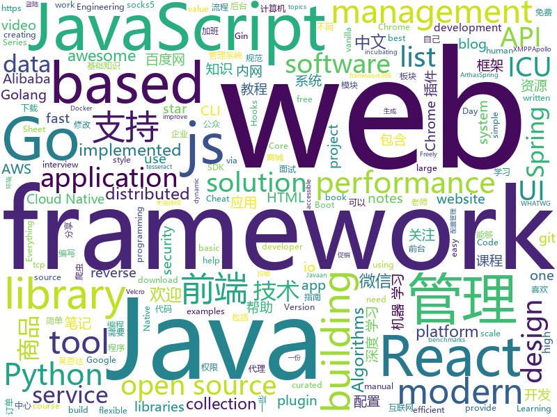

# 2019-04-04
See what the GitHub community is most excited about today.

## python
* [public-apis](https://github.com/toddmotto/public-apis)(**421 stars today**): A collective list of free APIs for use in software and web development.
* [PyTorch-BigGraph](https://github.com/facebookresearch/PyTorch-BigGraph)(**357 stars today**): Software used for generating embeddings from large-scale graph-structured data.
* [docker-py](https://github.com/docker/docker-py)(**357 stars today**): A Python library for the Docker Engine API
* [CDCS](https://github.com/geekinglcq/CDCS)(**300 stars today**): Chinese Data Competitions' Solutions
* [mathematics_dataset](https://github.com/deepmind/mathematics_dataset)(**196 stars today**): 
* [awesome-python-login-model](https://github.com/CriseLYJ/awesome-python-login-model)(**115 stars today**): 😮python模拟登陆一些大型网站，还有一些简单的爬虫，希望对你们有所帮助❤️，如果喜欢记得给个star哦🌟
* [adaptive](https://github.com/python-adaptive/adaptive)(**121 stars today**): 📈Tools for adaptive and parallel samping of mathematical functions
* [models](https://github.com/tensorflow/models)(**77 stars today**): Models and examples built with TensorFlow
* [Learn-Web-Hacking](https://github.com/LyleMi/Learn-Web-Hacking)(**91 stars today**): Study Notes For Web Hacking
* [Python-crawler-tutorial-starts-from-zero](https://github.com/CriseLYJ/Python-crawler-tutorial-starts-from-zero)(**86 stars today**): python爬虫教程，带你从零到一，包含js逆向，selenium, tesseract OCR识别,mongodb的使用，以及scrapy框架
* [system-design-primer](https://github.com/donnemartin/system-design-primer)(**76 stars today**): Learn how to design large-scale systems. Prep for the system design interview. Includes Anki flashcards.
* [awesome-python](https://github.com/vinta/awesome-python)(**78 stars today**): A curated list of awesome Python frameworks, libraries, software and resources
* [ginza](https://github.com/megagonlabs/ginza)(**69 stars today**): A Japanese NLP Library using spaCy as framework based on Universal Dependencies
* [CheatSheetSeries](https://github.com/OWASP/CheatSheetSeries)(**57 stars today**): The OWASP Cheat Sheet Series was created to provide a concise collection of high value information on specific application security topics.
* [bert](https://github.com/google-research/bert)(**51 stars today**): TensorFlow code and pre-trained models for BERT
* [pytorch-lightning](https://github.com/williamFalcon/pytorch-lightning)(**55 stars today**): Rapid research framework for Pytorch. The researcher's version of keras
* [Python](https://github.com/TheAlgorithms/Python)(**51 stars today**): All Algorithms implemented in Python
* [ChromeAppHeroes](https://github.com/zhaoolee/ChromeAppHeroes)(**54 stars today**): 🌈Chrome插件英雄榜, 为优秀的Chrome插件写一本中文说明书, 让Chrome插件英雄们造福人类~ ChromePluginHeroes, Write a Chinese manual for the excellent Chrome plugin, let the Chrome plugin heroes benefit the human~
* [USTC-Course](https://github.com/USTC-Resource/USTC-Course)(**49 stars today**): ❤️中国科学技术大学课程资源
* [fireprox](https://github.com/ustayready/fireprox)(**51 stars today**): AWS API Gateway management tool for creating on the fly HTTP pass-through proxies for unique IP rotation
* [faceswap](https://github.com/deepfakes/faceswap)(**47 stars today**): Non official project based on original /r/Deepfakes thread. Many thanks to him!
* [keras](https://github.com/keras-team/keras)(**42 stars today**): Deep Learning for humans
* [flask](https://github.com/pallets/flask)(**45 stars today**): The Python micro framework for building web applications.
* [UPSNet](https://github.com/uber-research/UPSNet)(**48 stars today**): UPSNet: A Unified Panoptic Segmentation Network
* [youtube-dl](https://github.com/ytdl-org/youtube-dl)(****): Command-line program to download videos from YouTube.com and other video sites

## java
* [advanced-java](https://github.com/doocs/advanced-java)(**513 stars today**): 😮互联网 Java 工程师进阶知识完全扫盲
* [JavaGuide](https://github.com/Snailclimb/JavaGuide)(**324 stars today**): 【Java学习+面试指南】 一份涵盖大部分Java程序员所需要掌握的核心知识。
* [ZXBlog](https://github.com/ZXZxin/ZXBlog)(**198 stars today**): 记录各种学习笔记(算法、Java、数据库、并发......)
* [seata](https://github.com/seata/seata)(**172 stars today**): 🔥Seata is an easy-to-use, high-performance, java based, open source distributed transaction solution.
* [mall](https://github.com/macrozheng/mall)(**136 stars today**): mall项目是一套电商系统，包括前台商城系统及后台管理系统，基于SpringBoot+MyBatis实现。 前台商城系统包含首页门户、商品推荐、商品搜索、商品展示、购物车、订单流程、会员中心、客户服务、帮助中心等模块。 后台管理系统包含商品管理、订单管理、会员管理、促销管理、运营管理、内容管理、统计报表、财务管理、权限管理、设置等模块。
* [spring-boot-examples](https://github.com/ityouknow/spring-boot-examples)(**112 stars today**): about learning Spring Boot via examples. Spring Boot 教程、技术栈示例代码，快速简单上手教程。
* [tutorials](https://github.com/eugenp/tutorials)(**59 stars today**): The "REST With Spring" Course:
* [spring-boot](https://github.com/spring-projects/spring-boot)(**61 stars today**): Spring Boot
* [elasticsearch](https://github.com/elastic/elasticsearch)(**60 stars today**): Open Source, Distributed, RESTful Search Engine
* [arthas](https://github.com/alibaba/arthas)(**62 stars today**): Alibaba Java Diagnostic Tool Arthas/Alibaba Java诊断利器Arthas
* [spring-framework](https://github.com/spring-projects/spring-framework)(**39 stars today**): Spring Framework
* [incubator-dubbo](https://github.com/apache/incubator-dubbo)(**43 stars today**): Apache Dubbo (incubating) is a high-performance, java based, open source RPC framework.
* [interviews](https://github.com/kdn251/interviews)(**44 stars today**): Everything you need to know to get the job.
* [server](https://github.com/wildfirechat/server)(**46 stars today**): 开源免费的即时通讯软件，功能和UI符合国内习惯，比XMPP具有更适合移动端的协议，可以作为IM组件代替环信、融云、网易云信等云通讯和XMPP
* [apollo](https://github.com/ctripcorp/apollo)(**42 stars today**): Apollo（阿波罗）是携程框架部门研发的分布式配置中心，能够集中化管理应用不同环境、不同集群的配置，配置修改后能够实时推送到应用端，并且具备规范的权限、流程治理等特性，适用于微服务配置管理场景。
* [AWS-Java-Samples](https://github.com/wazcov/AWS-Java-Samples)(**46 stars today**): A repository of basic AWS samples to get you started connecting to various AWS Services like SQS.
* [java-design-patterns](https://github.com/iluwatar/java-design-patterns)(**38 stars today**): Design patterns implemented in Java
* [JCSprout](https://github.com/crossoverJie/JCSprout)(**40 stars today**): 👨‍🎓Java Core Sprout : basic, concurrent, algorithm
* [WxJava](https://github.com/Wechat-Group/WxJava)(**36 stars today**): WxJava （微信开发 Java SDK），支持包括微信支付、开放平台、小程序、企业微信/企业号和公众号等的后端开发
* [Java](https://github.com/TheAlgorithms/Java)(**32 stars today**): All Algorithms implemented in Java
* [nacos](https://github.com/alibaba/nacos)(**34 stars today**): an easy-to-use dynamic service discovery, configuration and service management platform for building cloud native applications.
* [APIJSON](https://github.com/TommyLemon/APIJSON)(**37 stars today**): 🚀A JSON Transmission Protocol and an ORM Library for auto providing APIs and Documents.
* [guava](https://github.com/google/guava)(**32 stars today**): Google core libraries for Java
* [spring-cloud-alibaba](https://github.com/spring-cloud-incubator/spring-cloud-alibaba)(**30 stars today**): Spring Cloud Alibaba provides a one-stop solution for application development for the distributed solutions of Alibaba middleware.
* [quarkus](https://github.com/quarkusio/quarkus)(**34 stars today**): Quarkus: Supersonic Subatomic Java.

## unknown
* [955.WLB](https://github.com/formulahendry/955.WLB)(**848 stars today**): 955 不加班的公司名单
* [pumpkin-book](https://github.com/datawhalechina/pumpkin-book)(**611 stars today**): 《机器学习》（西瓜书）公式推导解析，在线阅读地址：https://datawhalechina.github.io/pumpkin-book
* [996ICU](https://github.com/995icu/996ICU)(**332 stars today**): 996ICU 995ICU 工作996 生病ICU 加班不规范 亲人两行泪
* [CS-Notes](https://github.com/CyC2018/CS-Notes)(**252 stars today**): 📚技术面试必备基础知识
* [the-book-of-secret-knowledge](https://github.com/trimstray/the-book-of-secret-knowledge)(**184 stars today**): A collection of inspiring lists, manuals, cheatsheets, blogs, hacks, one-liners, cli/web tools and more.
* [RE-iOS-Apps](https://github.com/ivRodriguezCA/RE-iOS-Apps)(**170 stars today**): A completely free, open source and online course about Reverse Engineering iOS Applications.
* [Data-Science--Cheat-Sheet](https://github.com/abhat222/Data-Science--Cheat-Sheet)(**134 stars today**): Cheat Sheets
* [everyone-can-use-english](https://github.com/xiaolai/everyone-can-use-english)(**161 stars today**): 人人都能用英语
* [DeepLearning-500-questions](https://github.com/scutan90/DeepLearning-500-questions)(**149 stars today**): 深度学习500问，以问答形式对常用的概率知识、线性代数、机器学习、深度学习、计算机视觉等热点问题进行阐述，以帮助自己及有需要的读者。 全书分为18个章节，近30万字。由于水平有限，书中不妥之处恳请广大读者批评指正。 未完待续............ 如有意合作，联系scutjy2015@163.com 版权所有，违权必究 Tan 2018.06
* [awesome](https://github.com/sindresorhus/awesome)(**133 stars today**): 😎Awesome lists about all kinds of interesting topics
* [notes](https://github.com/8483/notes)(**131 stars today**): Full-stack web development notes.
* [free-programming-books](https://github.com/EbookFoundation/free-programming-books)(**120 stars today**): 📚Freely available programming books
* [free-programming-books-zh_CN](https://github.com/justjavac/free-programming-books-zh_CN)(**90 stars today**): 📚免费的计算机编程类中文书籍，欢迎投稿
* [nginx-quick-reference](https://github.com/trimstray/nginx-quick-reference)(**94 stars today**): These notes describes how to improve Nginx performance, security and other important things; @ssllabs A+ 100%.
* [Awesome-Interview](https://github.com/Awesome-Interview/Awesome-Interview)(**90 stars today**): Collection of awesome interview references.
* [You-Dont-Know-JS](https://github.com/getify/You-Dont-Know-JS)(**86 stars today**): A book series on JavaScript. @YDKJS on twitter.
* [gitignore](https://github.com/github/gitignore)(**72 stars today**): A collection of useful .gitignore templates
* [developer-roadmap](https://github.com/kamranahmedse/developer-roadmap)(**83 stars today**): Roadmap to becoming a web developer in 2019
* [blog](https://github.com/airuikun/blog)(**73 stars today**): 小蝌蚪的blog，中年前端屌丝的心路历程，欢迎star或者watch
* [Anti-996-License](https://github.com/kattgu7/Anti-996-License)(**82 stars today**): Anti-996 License Version 1.0
* [996.Law](https://github.com/Y1ran/996.Law)(**81 stars today**): 联合仲裁发起地 | 法律板块(主站：996.ICU)
* [ghidra](https://github.com/NationalSecurityAgency/ghidra)(**73 stars today**): Ghidra is a software reverse engineering (SRE) framework
* [996.TSC](https://github.com/lxlxw/996.TSC)(**65 stars today**): 996.ICU周边文化 | 创意板块(主站：996.ICU)
* [955.holiday](https://github.com/955holiday/955.holiday)(**66 stars today**): Similar to 996.ICU, but 955.HOLIDAY.
* [Daily-Interview-Question](https://github.com/Advanced-Frontend/Daily-Interview-Question)(**62 stars today**): 工作日每天一道前端大厂面试题，祝大家天天进步，一年后会看到不一样的自己。

## javascript
* [AutoPiano](https://github.com/WarpPrism/AutoPiano)(**312 stars today**): 自由钢琴 AutoPiano，喜欢可以star ( http://crystalworld.gitee.io/qpiano/#/ )
* [react-loops](https://github.com/leebyron/react-loops)(**233 stars today**): React Loops works with React Hooks as part of the React Velcro Architecture
* [You-Dont-Need-jQuery](https://github.com/nefe/You-Dont-Need-jQuery)(**228 stars today**): Examples of how to do query, style, dom, ajax, event etc like jQuery with plain javascript.
* [vue](https://github.com/vuejs/vue)(**203 stars today**): 🖖Vue.js is a progressive, incrementally-adoptable JavaScript framework for building UI on the web.
* [pizzaql](https://github.com/pizzaql/pizzaql)(**180 stars today**): 🍕[WIP] Modern OSS Order Management System for Pizza Restaurants
* [react-three-fiber](https://github.com/drcmda/react-three-fiber)(**169 stars today**): 👌A React-renderer for Three.js
* [react](https://github.com/facebook/react)(**118 stars today**): A declarative, efficient, and flexible JavaScript library for building user interfaces.
* [formal](https://github.com/kevinwolfcr/formal)(**119 stars today**): 👔Elegant form management primitives for the react hooks era.
* [winXP](https://github.com/ShizukuIchi/winXP)(**107 stars today**): 🏁Web based Windows XP desktop recreation.
* [perflink](https://github.com/lukejacksonn/perflink)(**107 stars today**): Low friction JavaScript benchmarks that you can share via URL
* [laxxx](https://github.com/alexfoxy/laxxx)(**98 stars today**): Simple & light weight (3kb minified & zipped) vanilla javascript plugin to create smooth & beautiful animations when you scrolllll! Harness the power of the most intuitive interaction and make your websites come alive!
* [cube.js](https://github.com/statsbotco/cube.js)(**93 stars today**): 📊Cube.js - Open Source Analytics Framework
* [dayjs](https://github.com/iamkun/dayjs)(**86 stars today**): ⏰Day.js 2KB immutable date library alternative to Moment.js with the same modern API
* [axios](https://github.com/axios/axios)(**82 stars today**): Promise based HTTP client for the browser and node.js
* [javascript-algorithms](https://github.com/trekhleb/javascript-algorithms)(**78 stars today**): 📝Algorithms and data structures implemented in JavaScript with explanations and links to further readings
* [Blog](https://github.com/ljianshu/Blog)(**77 stars today**): 关注基础知识，打造优质前端博客，欢迎关注我的公众号：前端工匠
* [bootstrap](https://github.com/twbs/bootstrap)(**59 stars today**): The most popular HTML, CSS, and JavaScript framework for developing responsive, mobile first projects on the web.
* [griffith](https://github.com/zhihu/griffith)(**72 stars today**): A React-based web video player
* [node](https://github.com/nodejs/node)(**64 stars today**): Node.js JavaScript runtime✨🐢🚀✨
* [Awesome-Design-Tools](https://github.com/LisaDziuba/Awesome-Design-Tools)(**66 stars today**): The best design tools for everything👉
* [three.js](https://github.com/mrdoob/three.js)(**56 stars today**): JavaScript 3D library.
* [create-react-app](https://github.com/facebook/create-react-app)(**58 stars today**): Set up a modern web app by running one command.
* [baiduyun](https://github.com/syhyz1990/baiduyun)(**63 stars today**): 油猴脚本 直接下载百度网盘和百度网盘分享的文件,直链下载超级加速
* [taro](https://github.com/NervJS/taro)(**63 stars today**): 多端统一开发框架，支持用 React 的开发方式编写一次代码，生成能运行在微信/百度/支付宝/字节跳动小程序、H5、React Native 等的应用。 https://taro.js.org/
* [react-native](https://github.com/facebook/react-native)(**55 stars today**): A framework for building native apps with React.

## html
* [Unifiedtransform](https://github.com/changeweb/Unifiedtransform)(**201 stars today**): A school management Software
* [zjcqoo.github.io](https://github.com/zjcqoo/zjcqoo.github.io)(**41 stars today**): test
* [frontendDaily](https://github.com/kujian/frontendDaily)(**41 stars today**): 前端开发技术日报，每日分享互联网最精彩的前端技术、前端资讯、后端编程、设计和资源等，欢迎关注Watch
* [patchwork](https://github.com/jlord/patchwork)(****): All the Git-it Workshop completers!
* [evtjs](https://github.com/everitoken/evtjs)(**26 stars today**): API Binding (SDK) for the everiToken blockchain.
* [personal-website](https://github.com/github/personal-website)(**19 stars today**): Code that'll help you kickstart a personal website that showcases your work as a software developer.
* [styleguide](https://github.com/google/styleguide)(**22 stars today**): Style guides for Google-originated open-source projects
* [Coursera-ML-AndrewNg-Notes](https://github.com/fengdu78/Coursera-ML-AndrewNg-Notes)(**21 stars today**): 吴恩达老师的机器学习课程个人笔记
* [wpt](https://github.com/web-platform-tests/wpt)(**21 stars today**): Test suites for Web platform specs — including WHATWG, W3C, and others
* [JavaScript30](https://github.com/wesbos/JavaScript30)(**11 stars today**): 30 Day Vanilla JS Challenge
* [deeplearning_ai_books](https://github.com/fengdu78/deeplearning_ai_books)(**17 stars today**): deeplearning.ai（吴恩达老师的深度学习课程笔记及资源）
* [Spoon-Knife](https://github.com/octocat/Spoon-Knife)(****): This repo is for demonstration purposes only.
* [DetectionLab](https://github.com/clong/DetectionLab)(**16 stars today**): Vagrant & Packer scripts to build a lab environment complete with security tooling and logging best practices
* [fastText](https://github.com/facebookresearch/fastText)(**15 stars today**): Library for fast text representation and classification.
* [micromodal](https://github.com/ghosh/micromodal)(**16 stars today**): ⭕ Tiny javascript library for creating accessible modal dialogs
* [qiubaiying.github.io](https://github.com/qiubaiying/qiubaiying.github.io)(**5 stars today**): BY Blog ->
* [day-day-up](https://github.com/zhenmang/day-day-up)(**15 stars today**): 
* [CLRS](https://github.com/walkccc/CLRS)(**14 stars today**): 📚Solutions to Introduction to Algorithms Third Edition
* [requests-html](https://github.com/kennethreitz/requests-html)(**14 stars today**): Pythonic HTML Parsing for Humans™
* [portainer](https://github.com/portainer/portainer)(**13 stars today**): Simple management UI for Docker
* [yall.js](https://github.com/malchata/yall.js)(**13 stars today**): A fast, flexible, and small SEO-friendly lazy loader.
* [javascript-tutorial-en](https://github.com/iliakan/javascript-tutorial-en)(**12 stars today**): Modern JavaScript Tutorial
* [MikuTools](https://github.com/Ice-Hazymoon/MikuTools)(**12 stars today**): 一个轻量的工具集合
* [wysiwyg-editor](https://github.com/froala/wysiwyg-editor)(**9 stars today**): A beautifully designed WYSIWYG HTML Editor based on HTML5.
* [flutter-in-action](https://github.com/flutterchina/flutter-in-action)(**10 stars today**): 《Flutter实战》电子书

## go
* [nps](https://github.com/cnlh/nps)(**232 stars today**): 一款轻量级、功能强大的内网穿透代理服务器。支持tcp、udp流量转发，支持内网http代理、内网socks5代理，同时支持snappy压缩、站点保护、加密传输、多路复用、header修改等。支持web图形化管理，集成多用户模式。
* [goweight](https://github.com/jondot/goweight)(**125 stars today**): A tool to analyze and troubleshoot a Go binary size.
* [vugu](https://github.com/vugu/vugu)(**120 stars today**): Vugu: A modern UI library for Go+WebAssembly (experimental)
* [kubernetes](https://github.com/kubernetes/kubernetes)(**61 stars today**): Production-Grade Container Scheduling and Management
* [go](https://github.com/golang/go)(**65 stars today**): The Go programming language
* [GoMet](https://github.com/mimah/GoMet)(**58 stars today**): Multi-platform agent written in Golang. TCP forwarding, socks5, tunneling, pivoting, shell, download, exec
* [frp](https://github.com/fatedier/frp)(**52 stars today**): A fast reverse proxy to help you expose a local server behind a NAT or firewall to the internet.
* [awesome-go](https://github.com/avelino/awesome-go)(**53 stars today**): A curated list of awesome Go frameworks, libraries and software
* [fyne](https://github.com/fyne-io/fyne)(**52 stars today**): Cross platform GUI in Go based on Material Design
* [BaiduPCS-Go](https://github.com/iikira/BaiduPCS-Go)(**48 stars today**): 百度网盘客户端 - Go语言编写
* [go-echarts](https://github.com/chenjiandongx/go-echarts)(**44 stars today**): 🎨The adorable charts library for Golang
* [pack](https://github.com/buildpack/pack)(**43 stars today**): Local CLI for building apps using Cloud Native Buildpacks
* [buildkit](https://github.com/moby/buildkit)(**43 stars today**): concurrent, cache-efficient, and Dockerfile-agnostic builder toolkit
* [cfs](https://github.com/chubaofs/cfs)(**36 stars today**): 
* [the-way-to-go_ZH_CN](https://github.com/Unknwon/the-way-to-go_ZH_CN)(**34 stars today**): 《The Way to Go》中文译本，中文正式名《Go 入门指南》
* [gin](https://github.com/gin-gonic/gin)(**36 stars today**): Gin is a HTTP web framework written in Go (Golang). It features a Martini-like API with much better performance -- up to 40 times faster. If you need smashing performance, get yourself some Gin.
* [build-web-application-with-golang](https://github.com/astaxie/build-web-application-with-golang)(**35 stars today**): A golang ebook intro how to build a web with golang
* [etcd](https://github.com/etcd-io/etcd)(**34 stars today**): Distributed reliable key-value store for the most critical data of a distributed system
* [gitea](https://github.com/go-gitea/gitea)(**33 stars today**): Git with a cup of tea, painless self-hosted git service
* [traefik](https://github.com/containous/traefik)(**31 stars today**): The Cloud Native Edge Router
* [cobra](https://github.com/spf13/cobra)(**32 stars today**): A Commander for modern Go CLI interactions
* [hugo](https://github.com/gohugoio/hugo)(**31 stars today**): The world’s fastest framework for building websites.
* [lazygit](https://github.com/jesseduffield/lazygit)(**32 stars today**): simple terminal UI for git commands
* [syncthing](https://github.com/syncthing/syncthing)(**30 stars today**): Open Source Continuous File Synchronization
* [istio](https://github.com/istio/istio)(**25 stars today**): Connect, secure, control, and observe services.

## WordCloud

