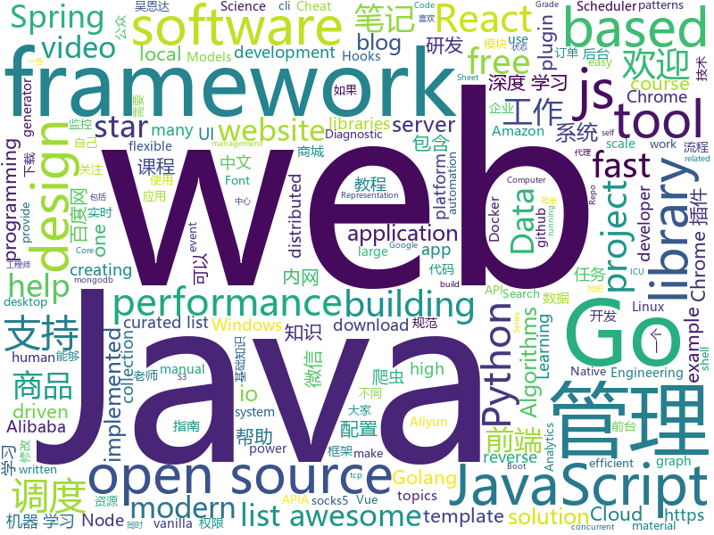

# 2019-04-05
See what the GitHub community is most excited about today.

## python
* [mathematics_dataset](https://github.com/deepmind/mathematics_dataset)(**322 stars today**): 
* [public-apis](https://github.com/toddmotto/public-apis)(**212 stars today**): A collective list of free APIs for use in software and web development.
* [PyTorch-BigGraph](https://github.com/facebookresearch/PyTorch-BigGraph)(**188 stars today**): Software used for generating embeddings from large-scale graph-structured data.
* [AmpliGraph](https://github.com/Accenture/AmpliGraph)(**139 stars today**): Python library for Representation Learning on Knowledge Graphs
* [awesome-python-login-model](https://github.com/CriseLYJ/awesome-python-login-model)(**122 stars today**): 😮python模拟登陆一些大型网站，还有一些简单的爬虫，希望对你们有所帮助❤️，如果喜欢记得给个star哦🌟
* [models](https://github.com/tensorflow/models)(**65 stars today**): Models and examples built with TensorFlow
* [CDCS](https://github.com/geekinglcq/CDCS)(**82 stars today**): Chinese Data Competitions' Solutions
* [docker-py](https://github.com/docker/docker-py)(**80 stars today**): A Python library for the Docker Engine API
* [awesome-python](https://github.com/vinta/awesome-python)(**73 stars today**): A curated list of awesome Python frameworks, libraries, software and resources
* [Python](https://github.com/TheAlgorithms/Python)(**61 stars today**): All Algorithms implemented in Python
* [system-design-primer](https://github.com/donnemartin/system-design-primer)(**55 stars today**): Learn how to design large-scale systems. Prep for the system design interview. Includes Anki flashcards.
* [home-assistant](https://github.com/home-assistant/home-assistant)(**57 stars today**): 🏡Open source home automation that puts local control and privacy first
* [Learn-Web-Hacking](https://github.com/LyleMi/Learn-Web-Hacking)(**57 stars today**): Study Notes For Web Hacking
* [adaptive](https://github.com/python-adaptive/adaptive)(**59 stars today**): 📈Tools for adaptive and parallel samping of mathematical functions
* [CheatSheetSeries](https://github.com/OWASP/CheatSheetSeries)(**56 stars today**): The OWASP Cheat Sheet Series was created to provide a concise collection of high value information on specific application security topics.
* [Python-crawler-tutorial-starts-from-zero](https://github.com/CriseLYJ/Python-crawler-tutorial-starts-from-zero)(**55 stars today**): python爬虫教程，带你从零到一，包含js逆向，selenium, tesseract OCR识别,mongodb的使用，以及scrapy框架
* [you-get](https://github.com/soimort/you-get)(**56 stars today**): ⏬Dumb downloader that scrapes the web
* [django](https://github.com/django/django)(**45 stars today**): The Web framework for perfectionists with deadlines.
* [bert](https://github.com/google-research/bert)(**51 stars today**): TensorFlow code and pre-trained models for BERT
* [youtube-dl](https://github.com/ytdl-org/youtube-dl)(**46 stars today**): Command-line program to download videos from YouTube.com and other video sites
* [keras](https://github.com/keras-team/keras)(**41 stars today**): Deep Learning for humans
* [USTC-Course](https://github.com/USTC-Resource/USTC-Course)(**41 stars today**): ❤️中国科学技术大学课程资源
* [faceswap](https://github.com/deepfakes/faceswap)(**38 stars today**): Non official project based on original /r/Deepfakes thread. Many thanks to him!
* [ChromeAppHeroes](https://github.com/zhaoolee/ChromeAppHeroes)(**43 stars today**): 🌈Chrome插件英雄榜, 为优秀的Chrome插件写一本中文说明书, 让Chrome插件英雄们造福人类~ ChromePluginHeroes, Write a Chinese manual for the excellent Chrome plugin, let the Chrome plugin heroes benefit the human~
* [flask](https://github.com/pallets/flask)(****): The Python micro framework for building web applications.

## java
* [ghidra](https://github.com/NationalSecurityAgency/ghidra)(**560 stars today**): Ghidra is a software reverse engineering (SRE) framework
* [advanced-java](https://github.com/doocs/advanced-java)(**350 stars today**): 😮互联网 Java 工程师进阶知识完全扫盲
* [JavaGuide](https://github.com/Snailclimb/JavaGuide)(**313 stars today**): 【Java学习+面试指南】 一份涵盖大部分Java程序员所需要掌握的核心知识。
* [ZXBlog](https://github.com/ZXZxin/ZXBlog)(**99 stars today**): 记录各种学习笔记(算法、Java、数据库、并发......)
* [seata](https://github.com/seata/seata)(**81 stars today**): 🔥Seata is an easy-to-use, high-performance, java based, open source distributed transaction solution.
* [mall](https://github.com/macrozheng/mall)(**72 stars today**): mall项目是一套电商系统，包括前台商城系统及后台管理系统，基于SpringBoot+MyBatis实现。 前台商城系统包含首页门户、商品推荐、商品搜索、商品展示、购物车、订单流程、会员中心、客户服务、帮助中心等模块。 后台管理系统包含商品管理、订单管理、会员管理、促销管理、运营管理、内容管理、统计报表、财务管理、权限管理、设置等模块。
* [spring-boot](https://github.com/spring-projects/spring-boot)(**72 stars today**): Spring Boot
* [spring-boot-examples](https://github.com/ityouknow/spring-boot-examples)(**70 stars today**): about learning Spring Boot via examples. Spring Boot 教程、技术栈示例代码，快速简单上手教程。
* [elasticsearch](https://github.com/elastic/elasticsearch)(**54 stars today**): Open Source, Distributed, RESTful Search Engine
* [java-design-patterns](https://github.com/iluwatar/java-design-patterns)(**55 stars today**): Design patterns implemented in Java
* [arthas](https://github.com/alibaba/arthas)(**54 stars today**): Alibaba Java Diagnostic Tool Arthas/Alibaba Java诊断利器Arthas
* [tutorials](https://github.com/eugenp/tutorials)(**32 stars today**): The "REST With Spring" Course:
* [notes](https://github.com/loveincode/notes)(**48 stars today**): 📚一个Java后端工程师的学习笔记 https://loveincode.github.io/notes
* [EasyScheduler](https://github.com/analysys/EasyScheduler)(**39 stars today**): Easy Scheduler是一个工作流调度系统，主要解决数据研发ETL错综复杂的依赖关系，而不能直观监控任务健康状态等问题。Easy Scheduler以DAG流式的方式将Task组装起来，可实时监控任务的运行状态，同时支持重试、从指定节点恢复失败、暂停及Kill任务等操作。EasyScheduler由在工作流调度方面工作多年的多位小伙伴研发而成，致力于成为大数据平台的中流砥柱，使调度变得更加容易，更可以从其中文名“易调度”看出我们的初衷，如果你对目前市面上的调度不够满意，非常欢迎使用易调度，欢迎大家加入进来，提出需求，也欢迎贡献代码
* [server](https://github.com/wildfirechat/server)(**39 stars today**): 开源免费的即时通讯软件，功能和UI符合国内习惯，比XMPP具有更适合移动端的协议，可以作为IM组件代替环信、融云、网易云信等云通讯和XMPP
* [spring-framework](https://github.com/spring-projects/spring-framework)(**36 stars today**): Spring Framework
* [library](https://github.com/ddd-by-examples/library)(**36 stars today**): A comprehensive Domain-Driven Design example with problem space strategic analysis and various tactical patterns.
* [incubator-dubbo](https://github.com/apache/incubator-dubbo)(**29 stars today**): Apache Dubbo (incubating) is a high-performance, java based, open source RPC framework.
* [Java](https://github.com/TheAlgorithms/Java)(**31 stars today**): All Algorithms implemented in Java
* [apollo](https://github.com/ctripcorp/apollo)(**31 stars today**): Apollo（阿波罗）是携程框架部门研发的分布式配置中心，能够集中化管理应用不同环境、不同集群的配置，配置修改后能够实时推送到应用端，并且具备规范的权限、流程治理等特性，适用于微服务配置管理场景。
* [WxJava](https://github.com/Wechat-Group/WxJava)(**28 stars today**): WxJava （微信开发 Java SDK），支持包括微信支付、开放平台、小程序、企业微信/企业号和公众号等的后端开发
* [guava](https://github.com/google/guava)(**30 stars today**): Google core libraries for Java
* [fastjson](https://github.com/alibaba/fastjson)(**26 stars today**): 🚄A fast JSON parser/generator for Java. (Aliyun Data Lake Analytics https://www.aliyun.com/product/datalakeanalytics powered by fastjson )
* [JCSprout](https://github.com/crossoverJie/JCSprout)(**25 stars today**): 👨‍🎓Java Core Sprout : basic, concurrent, algorithm
* [spring-cloud-alibaba](https://github.com/spring-cloud-incubator/spring-cloud-alibaba)(**24 stars today**): Spring Cloud Alibaba provides a one-stop solution for application development for the distributed solutions of Alibaba middleware.

## unknown
* [pumpkin-book](https://github.com/datawhalechina/pumpkin-book)(**1,365 stars today**): 《机器学习》（西瓜书）公式推导解析，在线阅读地址：https://datawhalechina.github.io/pumpkin-book
* [AgileLite](https://github.com/davebs/AgileLite)(**741 stars today**): Agile software development without all the burnout.
* [955.WLB](https://github.com/formulahendry/955.WLB)(**601 stars today**): 955 不加班的公司名单
* [996ICU](https://github.com/995icu/996ICU)(**234 stars today**): 996ICU 995ICU 工作996 生病ICU 加班不规范 亲人两行泪
* [CS-Notes](https://github.com/CyC2018/CS-Notes)(**187 stars today**): 📚技术面试必备基础知识
* [DeepLearning-500-questions](https://github.com/scutan90/DeepLearning-500-questions)(**179 stars today**): 深度学习500问，以问答形式对常用的概率知识、线性代数、机器学习、深度学习、计算机视觉等热点问题进行阐述，以帮助自己及有需要的读者。 全书分为18个章节，50余万字。由于水平有限，书中不妥之处恳请广大读者批评指正。 未完待续............ 如有意合作，联系scutjy2015@163.com 版权所有，违权必究 Tan 2018.06
* [996.Leave](https://github.com/623637646/996.Leave)(**178 stars today**): 逃离996
* [free-gophers-pack](https://github.com/MariaLetta/free-gophers-pack)(**150 stars today**): This pack of 100+ gopher pictures and elements will help you to build own design of almost anything related to Go Programming Language: presentations, posts in blogs or social media, courses, videos and many, many more.
* [Data-Science--Cheat-Sheet](https://github.com/abhat222/Data-Science--Cheat-Sheet)(**88 stars today**): Cheat Sheets
* [awesome](https://github.com/sindresorhus/awesome)(**92 stars today**): 😎Awesome lists about all kinds of interesting topics
* [everyone-can-use-english](https://github.com/xiaolai/everyone-can-use-english)(**86 stars today**): 人人都能用英语
* [developer-roadmap](https://github.com/kamranahmedse/developer-roadmap)(**80 stars today**): Roadmap to becoming a web developer in 2019
* [gitignore](https://github.com/github/gitignore)(**58 stars today**): A collection of useful .gitignore templates
* [free-programming-books](https://github.com/EbookFoundation/free-programming-books)(**72 stars today**): 📚Freely available programming books
* [the-book-of-secret-knowledge](https://github.com/trimstray/the-book-of-secret-knowledge)(**72 stars today**): A collection of inspiring lists, manuals, cheatsheets, blogs, hacks, one-liners, cli/web tools and more.
* [You-Dont-Know-JS](https://github.com/getify/You-Dont-Know-JS)(**66 stars today**): A book series on JavaScript. @YDKJS on twitter.
* [996.Law](https://github.com/Y1ran/996.Law)(**70 stars today**): 联合仲裁发起地 | 法律板块(主站：996.ICU)
* [awesome-web-performance-metrics](https://github.com/csabapalfi/awesome-web-performance-metrics)(**62 stars today**): ⚡List of awesome web performance metrics
* [coding-interview-university](https://github.com/jwasham/coding-interview-university)(**43 stars today**): A complete computer science study plan to become a software engineer.
* [RE-iOS-Apps](https://github.com/ivRodriguezCA/RE-iOS-Apps)(**44 stars today**): A completely free, open source and online course about Reverse Engineering iOS Applications.
* [computer-science](https://github.com/ossu/computer-science)(**45 stars today**): 🎓Path to a free self-taught education in Computer Science!
* [blog](https://github.com/airuikun/blog)(**46 stars today**): 小蝌蚪的blog，中年前端屌丝的心路历程，欢迎star或者watch
* [awesome-vue](https://github.com/vuejs/awesome-vue)(**43 stars today**): 🎉A curated list of awesome things related to Vue.js
* [Daily-Interview-Question](https://github.com/Advanced-Frontend/Daily-Interview-Question)(**42 stars today**): 工作日每天一道前端大厂面试题，祝大家天天进步，一年后会看到不一样的自己。

## javascript
* [AutoPiano](https://github.com/WarpPrism/AutoPiano)(**326 stars today**): 自由钢琴 AutoPiano，喜欢可以star ( http://crystalworld.gitee.io/qpiano/#/ )
* [vue](https://github.com/vuejs/vue)(**156 stars today**): 🖖Vue.js is a progressive, incrementally-adoptable JavaScript framework for building UI on the web.
* [griffith](https://github.com/zhihu/griffith)(**150 stars today**): A React-based web video player
* [You-Dont-Need-jQuery](https://github.com/nefe/You-Dont-Need-jQuery)(**129 stars today**): Examples of how to do query, style, dom, ajax, event etc like jQuery with plain javascript.
* [react-loops](https://github.com/leebyron/react-loops)(**131 stars today**): React Loops works with React Hooks as part of the React Velcro Architecture
* [react-three-fiber](https://github.com/drcmda/react-three-fiber)(**117 stars today**): 👌A React-renderer for Three.js
* [react](https://github.com/facebook/react)(**110 stars today**): A declarative, efficient, and flexible JavaScript library for building user interfaces.
* [laxxx](https://github.com/alexfoxy/laxxx)(**92 stars today**): Simple & light weight (3kb minified & zipped) vanilla javascript plugin to create smooth & beautiful animations when you scrolllll! Harness the power of the most intuitive interaction and make your websites come alive!
* [formal](https://github.com/kevinwolfcr/formal)(**92 stars today**): 👔Elegant form management primitives for the react hooks era.
* [Awesome-Design-Tools](https://github.com/LisaDziuba/Awesome-Design-Tools)(**76 stars today**): The best design tools for everything👉
* [fee](https://github.com/LianjiaTech/fee)(**75 stars today**): 
* [baiduyun](https://github.com/syhyz1990/baiduyun)(**66 stars today**): 油猴脚本 直接下载百度网盘和百度网盘分享的文件,直链下载超级加速
* [javascript-algorithms](https://github.com/trekhleb/javascript-algorithms)(**61 stars today**): 📝Algorithms and data structures implemented in JavaScript with explanations and links to further readings
* [winXP](https://github.com/ShizukuIchi/winXP)(**69 stars today**): 🏁Web based Windows XP desktop recreation.
* [vulncode-db](https://github.com/google/vulncode-db)(**66 stars today**): Vulncode-DB project
* [Blog](https://github.com/ljianshu/Blog)(**65 stars today**): 关注基础知识，打造优质前端博客，欢迎关注我的公众号：前端工匠
* [Motrix](https://github.com/agalwood/Motrix)(**62 stars today**): A full-featured download manager.
* [cube.js](https://github.com/statsbotco/cube.js)(**64 stars today**): 📊Cube.js - Open Source Analytics Framework
* [bootstrap](https://github.com/twbs/bootstrap)(**44 stars today**): The most popular HTML, CSS, and JavaScript framework for developing responsive, mobile first projects on the web.
* [axios](https://github.com/axios/axios)(**62 stars today**): Promise based HTTP client for the browser and node.js
* [three.js](https://github.com/mrdoob/three.js)(**49 stars today**): JavaScript 3D library.
* [create-react-app](https://github.com/facebook/create-react-app)(**49 stars today**): Set up a modern web app by running one command.
* [Chromium-941743](https://github.com/exodusintel/Chromium-941743)(**55 stars today**): Chrome v8 1Day Exploit by István Kurucsai
* [inertia](https://github.com/inertiajs/inertia)(**57 stars today**): A framework for creating server-driven single page apps.
* [dayjs](https://github.com/iamkun/dayjs)(**55 stars today**): ⏰Day.js 2KB immutable date library alternative to Moment.js with the same modern API

## html
* [Unifiedtransform](https://github.com/changeweb/Unifiedtransform)(**70 stars today**): A school management Software
* [CLRS](https://github.com/walkccc/CLRS)(**43 stars today**): 📚Solutions to Introduction to Algorithms Third Edition
* [mlh-hackathon-nodejs-starter](https://github.com/MLH/mlh-hackathon-nodejs-starter)(**34 stars today**): Hackathon starter project for Node.js applications
* [personal-website](https://github.com/github/personal-website)(**22 stars today**): Code that'll help you kickstart a personal website that showcases your work as a software developer.
* [material-dashboard-lite](https://github.com/CreativeIT/material-dashboard-lite)(**31 stars today**): A free dashboard template with material design lite
* [deeplearning_ai_books](https://github.com/fengdu78/deeplearning_ai_books)(**26 stars today**): deeplearning.ai（吴恩达老师的深度学习课程笔记及资源）
* [Girl](https://github.com/Xu-Angel/Girl)(**26 stars today**): Node爬虫、MongoDB、爬取世纪佳缘女性信息
* [yall.js](https://github.com/malchata/yall.js)(**25 stars today**): A fast, flexible, and small SEO-friendly lazy loader.
* [javascript-tutorial-en](https://github.com/iliakan/javascript-tutorial-en)(**23 stars today**): Modern JavaScript Tutorial
* [Spoon-Knife](https://github.com/octocat/Spoon-Knife)(****): This repo is for demonstration purposes only.
* [micromodal](https://github.com/ghosh/micromodal)(**17 stars today**): ⭕ Tiny javascript library for creating accessible modal dialogs
* [Coursera-ML-AndrewNg-Notes](https://github.com/fengdu78/Coursera-ML-AndrewNg-Notes)(**15 stars today**): 吴恩达老师的机器学习课程个人笔记
* [googlefonts-font-display-helper](https://github.com/iamakulov/googlefonts-font-display-helper)(**17 stars today**): A snippet generator to speed up Google Fonts rendering with font-display
* [ShinyStudio](https://github.com/dm3ll3n/ShinyStudio)(**17 stars today**): A Docker stack of RStudio, Shiny Server, and ShinyProxy
* [JavaScript30](https://github.com/wesbos/JavaScript30)(**9 stars today**): 30 Day Vanilla JS Challenge
* [fastText](https://github.com/facebookresearch/fastText)(**15 stars today**): Library for fast text representation and classification.
* [sourcegraph](https://github.com/sourcegraph/sourcegraph)(**14 stars today**): Code search and navigation tool (self-hosted)
* [day-day-up](https://github.com/zhenmang/day-day-up)(**14 stars today**): 
* [qiubaiying.github.io](https://github.com/qiubaiying/qiubaiying.github.io)(**6 stars today**): BY Blog ->
* [lets-get-arrested](https://github.com/hamukazu/lets-get-arrested)(**12 stars today**): This project is intended to protest against the police in Japan
* [gentelella](https://github.com/ColorlibHQ/gentelella)(**7 stars today**): Free Bootstrap 3 Admin Template
* [beijing_house_knowledge](https://github.com/facert/beijing_house_knowledge)(**9 stars today**): 北京买房攻略
* [zjcqoo.github.io](https://github.com/zjcqoo/zjcqoo.github.io)(**7 stars today**): test
* [Publii](https://github.com/GetPublii/Publii)(**9 stars today**): Publii is a desktop-based CMS for Windows, Mac and Linux that makes creating static websites fast and hassle-free, even for beginners.
* [devops-essentials-sample-app](https://github.com/linuxacademy/devops-essentials-sample-app)(****): 

## go
* [996.ICU](https://github.com/996icu/996.ICU)(**9,900 stars today**): Repo for counting stars and contributing. Press F to pay respect to glorious developers.
* [nps](https://github.com/cnlh/nps)(**192 stars today**): 一款轻量级、功能强大的内网穿透代理服务器。支持tcp、udp流量转发，支持内网http代理、内网socks5代理，同时支持snappy压缩、站点保护、加密传输、多路复用、header修改等。支持web图形化管理，集成多用户模式。
* [goweight](https://github.com/jondot/goweight)(**102 stars today**): A tool to analyze and troubleshoot a Go binary size.
* [go](https://github.com/golang/go)(**87 stars today**): The Go programming language
* [vugu](https://github.com/vugu/vugu)(**89 stars today**): Vugu: A modern UI library for Go+WebAssembly (experimental)
* [kubernetes](https://github.com/kubernetes/kubernetes)(**72 stars today**): Production-Grade Container Scheduling and Management
* [go-flutter](https://github.com/go-flutter-desktop/go-flutter)(**58 stars today**): Bringing Flutter to Windows, MacOS and Linux - through the power of Go and GLFW.
* [pack](https://github.com/buildpack/pack)(**56 stars today**): Local CLI for building apps using Cloud Native Buildpacks
* [awesome-go](https://github.com/avelino/awesome-go)(**48 stars today**): A curated list of awesome Go frameworks, libraries and software
* [gin](https://github.com/gin-gonic/gin)(**48 stars today**): Gin is a HTTP web framework written in Go (Golang). It features a Martini-like API with much better performance -- up to 40 times faster. If you need smashing performance, get yourself some Gin.
* [shell-operator](https://github.com/flant/shell-operator)(**49 stars today**): Shell-operator is a tool for running event-driven scripts in a Kubernetes cluster
* [s3-benchmark](https://github.com/dvassallo/s3-benchmark)(**49 stars today**): Measure Amazon S3's performance from any location.
* [fyne](https://github.com/fyne-io/fyne)(**45 stars today**): Cross platform GUI in Go based on Material Design
* [BaiduPCS-Go](https://github.com/iikira/BaiduPCS-Go)(**42 stars today**): 百度网盘客户端 - Go语言编写
* [buildkit](https://github.com/moby/buildkit)(**42 stars today**): concurrent, cache-efficient, and Dockerfile-agnostic builder toolkit
* [frp](https://github.com/fatedier/frp)(**35 stars today**): A fast reverse proxy to help you expose a local server behind a NAT or firewall to the internet.
* [config](https://github.com/JeremyLoy/config)(**40 stars today**): 12 factor configuration as a typesafe struct in as little as two function calls
* [build-web-application-with-golang](https://github.com/astaxie/build-web-application-with-golang)(**33 stars today**): A golang ebook intro how to build a web with golang
* [minio](https://github.com/minio/minio)(**36 stars today**): Minio is an open source object storage server compatible with Amazon S3 APIs
* [GoMet](https://github.com/mimah/GoMet)(**37 stars today**): Multi-platform agent written in Golang. TCP forwarding, socks5, tunneling, pivoting, shell, download, exec
* [sqlrows](https://github.com/gostaticanalysis/sqlrows)(**37 stars today**): Analyzer: helps uncover bugs by reporting a diagnostic for mistakes of *sql.Rows usage.
* [hugo](https://github.com/gohugoio/hugo)(**36 stars today**): The world’s fastest framework for building websites.
* [traefik](https://github.com/containous/traefik)(**34 stars today**): The Cloud Native Edge Router
* [cds](https://github.com/ovh/cds)(**34 stars today**): Enterprise-Grade Continuous Delivery & DevOps Automation Open Source Platform
* [the-way-to-go_ZH_CN](https://github.com/Unknwon/the-way-to-go_ZH_CN)(**30 stars today**): 《The Way to Go》中文译本，中文正式名《Go 入门指南》

## WordCloud

