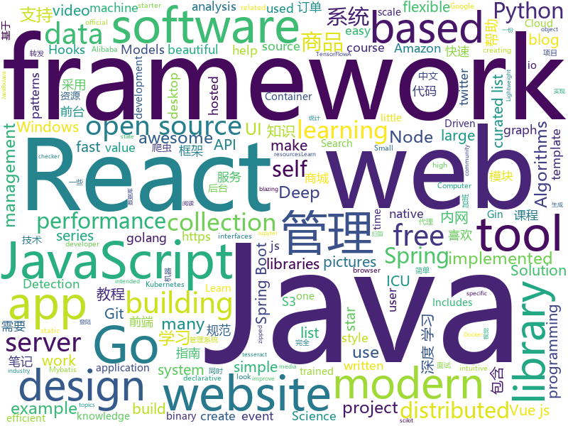

# 2019-04-06
See what the GitHub community is most excited about today.

## python
* [AmpliGraph](https://github.com/Accenture/AmpliGraph)(**237 stars today**): Python library for Representation Learning on Knowledge Graphs
* [mathematics_dataset](https://github.com/deepmind/mathematics_dataset)(**109 stars today**): 
* [public-apis](https://github.com/toddmotto/public-apis)(**99 stars today**): A collective list of free APIs for use in software and web development.
* [PyTorch-BigGraph](https://github.com/facebookresearch/PyTorch-BigGraph)(**71 stars today**): Software used for generating embeddings from large-scale graph-structured data.
* [awesome-python-login-model](https://github.com/CriseLYJ/awesome-python-login-model)(**53 stars today**): 😮python模拟登陆一些大型网站，还有一些简单的爬虫，希望对你们有所帮助❤️，如果喜欢记得给个star哦🌟
* [models](https://github.com/tensorflow/models)(**41 stars today**): Models and examples built with TensorFlow
* [awesome-python](https://github.com/vinta/awesome-python)(**49 stars today**): A curated list of awesome Python frameworks, libraries, software and resources
* [system-design-primer](https://github.com/donnemartin/system-design-primer)(**46 stars today**): Learn how to design large-scale systems. Prep for the system design interview. Includes Anki flashcards.
* [Python](https://github.com/TheAlgorithms/Python)(**42 stars today**): All Algorithms implemented in Python
* [subsync](https://github.com/smacke/subsync)(**47 stars today**): Automagically synchronize subtitles with video.
* [keras](https://github.com/keras-team/keras)(**42 stars today**): Deep Learning for humans
* [Neural-Nebula](https://github.com/pearsonkyle/Neural-Nebula)(**46 stars today**): A deep conv. generative adversarial network trained on pictures of space
* [CheatSheetSeries](https://github.com/OWASP/CheatSheetSeries)(**41 stars today**): The OWASP Cheat Sheet Series was created to provide a concise collection of high value information on specific application security topics.
* [CDCS](https://github.com/geekinglcq/CDCS)(**39 stars today**): Chinese Data Competitions' Solutions
* [home-assistant](https://github.com/home-assistant/home-assistant)(**34 stars today**): 🏡Open source home automation that puts local control and privacy first
* [Python-crawler-tutorial-starts-from-zero](https://github.com/CriseLYJ/Python-crawler-tutorial-starts-from-zero)(**36 stars today**): python爬虫教程，带你从零到一，包含js逆向，selenium, tesseract OCR识别,mongodb的使用，以及scrapy框架
* [treon](https://github.com/ReviewNB/treon)(**37 stars today**): Easy to use test framework for Jupyter Notebooks
* [stylegan](https://github.com/NVlabs/stylegan)(**34 stars today**): StyleGAN - Official TensorFlow Implementation
* [faceswap](https://github.com/deepfakes/faceswap)(**33 stars today**): Non official project based on original /r/Deepfakes thread. Many thanks to him!
* [pyod](https://github.com/yzhao062/pyod)(**30 stars today**): A Python Toolbox for Scalable Outlier Detection (Anomaly Detection)
* [scikit-learn](https://github.com/scikit-learn/scikit-learn)(**23 stars today**): scikit-learn: machine learning in Python
* [bert](https://github.com/google-research/bert)(**22 stars today**): TensorFlow code and pre-trained models for BERT
* [USTC-Course](https://github.com/USTC-Resource/USTC-Course)(**27 stars today**): ❤️中国科学技术大学课程资源
* [DeepFaceLab](https://github.com/iperov/DeepFaceLab)(**25 stars today**): DeepFaceLab is a tool that utilizes deep learning to recognize and swap faces in pictures and videos. Includes prebuilt ready to work standalone Windows 7,8,10 binary (look readme.md).
* [pyright](https://github.com/Microsoft/pyright)(**26 stars today**): Static type checker for Python

## java
* [ghidra](https://github.com/NationalSecurityAgency/ghidra)(**430 stars today**): Ghidra is a software reverse engineering (SRE) framework
* [advanced-java](https://github.com/doocs/advanced-java)(**111 stars today**): 😮互联网 Java 工程师进阶知识完全扫盲
* [JavaGuide](https://github.com/Snailclimb/JavaGuide)(**99 stars today**): 【Java学习+面试指南】 一份涵盖大部分Java程序员所需要掌握的核心知识。
* [mall](https://github.com/macrozheng/mall)(**45 stars today**): mall项目是一套电商系统，包括前台商城系统及后台管理系统，基于SpringBoot+MyBatis实现。 前台商城系统包含首页门户、商品推荐、商品搜索、商品展示、购物车、订单流程、会员中心、客户服务、帮助中心等模块。 后台管理系统包含商品管理、订单管理、会员管理、促销管理、运营管理、内容管理、统计报表、财务管理、权限管理、设置等模块。
* [tutorials](https://github.com/eugenp/tutorials)(**27 stars today**): The "REST With Spring" Course:
* [spring-boot](https://github.com/spring-projects/spring-boot)(**33 stars today**): Spring Boot
* [Java](https://github.com/TheAlgorithms/Java)(**29 stars today**): All Algorithms implemented in Java
* [elasticsearch](https://github.com/elastic/elasticsearch)(**27 stars today**): Open Source, Distributed, RESTful Search Engine
* [teavm](https://github.com/konsoletyper/teavm)(**30 stars today**): Compiler of Java bytecode to JavaScript
* [SpringBlade](https://github.com/chillzhuang/SpringBlade)(**26 stars today**): SpringBlade 是由一个商业级项目升级优化而来的SpringCloud微服务架构，采用Java8 API重构了业务代码，完全遵循阿里巴巴编码规范。采用Spring Boot 2 、Spring Cloud Finchley 、Mybatis 等核心技术，同时提供基于React和Vue的两个前端框架用于快速搭建企业级的SaaS微服务系统平台。 QQ群：477853168
* [java-design-patterns](https://github.com/iluwatar/java-design-patterns)(**24 stars today**): Design patterns implemented in Java
* [ZXBlog](https://github.com/ZXZxin/ZXBlog)(**24 stars today**): 记录各种学习笔记(算法、Java、数据库、并发......)
* [spring-framework](https://github.com/spring-projects/spring-framework)(**21 stars today**): Spring Framework
* [h2database](https://github.com/h2database/h2database)(**24 stars today**): H2 is an embeddable RDBMS written in Java.
* [seata](https://github.com/seata/seata)(**22 stars today**): 🔥Seata is an easy-to-use, high-performance, java based, open source distributed transaction solution.
* [quarkus](https://github.com/quarkusio/quarkus)(**20 stars today**): Quarkus: Supersonic Subatomic Java.
* [study](https://github.com/keesun/study)(**19 stars today**): Learn, Share and Grow
* [spring-boot-examples](https://github.com/ityouknow/spring-boot-examples)(**18 stars today**): about learning Spring Boot via examples. Spring Boot 教程、技术栈示例代码，快速简单上手教程。
* [poc-graphql](https://github.com/righettod/poc-graphql)(**19 stars today**): Research on GraphQL from an AppSec point of view.
* [guava](https://github.com/google/guava)(**18 stars today**): Google core libraries for Java
* [SnapKit](https://github.com/reportmill/SnapKit)(**19 stars today**): A Java UI kit
* [library](https://github.com/ddd-by-examples/library)(**17 stars today**): A comprehensive Domain-Driven Design example with problem space strategic analysis and various tactical patterns.
* [arthas](https://github.com/alibaba/arthas)(**16 stars today**): Alibaba Java Diagnostic Tool Arthas/Alibaba Java诊断利器Arthas
* [mybatis-3](https://github.com/mybatis/mybatis-3)(**12 stars today**): MyBatis SQL mapper framework for Java
* [RxJava](https://github.com/ReactiveX/RxJava)(**14 stars today**): RxJava – Reactive Extensions for the JVM – a library for composing asynchronous and event-based programs using observable sequences for the Java VM.

## unknown
* [pumpkin-book](https://github.com/datawhalechina/pumpkin-book)(**512 stars today**): 《机器学习》（西瓜书）公式推导解析，在线阅读地址：https://datawhalechina.github.io/pumpkin-book
* [AgileLite](https://github.com/davebs/AgileLite)(**517 stars today**): Agile software development without all the burnout.
* [free-gophers-pack](https://github.com/MariaLetta/free-gophers-pack)(**326 stars today**): ✨This pack of 100+ gopher pictures and elements will help you to build own design of almost anything related to Go Programming Language: presentations, posts in blogs or social media, courses, videos and many, many more.
* [955.WLB](https://github.com/formulahendry/955.WLB)(**273 stars today**): 955 不加班的公司名单
* [app-ideas](https://github.com/florinpop17/app-ideas)(**161 stars today**): A Collection of application ideas which can be used to improve your coding skills.
* [DeepLearning-500-questions](https://github.com/scutan90/DeepLearning-500-questions)(**100 stars today**): 深度学习500问，以问答形式对常用的概率知识、线性代数、机器学习、深度学习、计算机视觉等热点问题进行阐述，以帮助自己及有需要的读者。 全书分为18个章节，50余万字。由于水平有限，书中不妥之处恳请广大读者批评指正。 未完待续............ 如有意合作，联系scutjy2015@163.com 版权所有，违权必究 Tan 2018.06
* [996ICU](https://github.com/995icu/996ICU)(**108 stars today**): 996ICU 995ICU 工作996 生病ICU 加班不规范 亲人两行泪
* [996.Leave](https://github.com/623637646/996.Leave)(**99 stars today**): 逃离996
* [CS-Notes](https://github.com/CyC2018/CS-Notes)(**78 stars today**): 📚技术面试必备基础知识
* [developer-roadmap](https://github.com/kamranahmedse/developer-roadmap)(**78 stars today**): Roadmap to becoming a web developer in 2019
* [awesome](https://github.com/sindresorhus/awesome)(**74 stars today**): 😎Awesome lists about all kinds of interesting topics
* [Data-Science--Cheat-Sheet](https://github.com/abhat222/Data-Science--Cheat-Sheet)(**54 stars today**): Cheat Sheets
* [gitignore](https://github.com/github/gitignore)(**48 stars today**): A collection of useful .gitignore templates
* [free-programming-books](https://github.com/EbookFoundation/free-programming-books)(**53 stars today**): 📚Freely available programming books
* [You-Dont-Know-JS](https://github.com/getify/You-Dont-Know-JS)(**48 stars today**): A book series on JavaScript. @YDKJS on twitter.
* [blog](https://github.com/airuikun/blog)(**45 stars today**): 小蝌蚪的blog，中年前端屌丝的心路历程，欢迎star或者watch
* [everyone-can-use-english](https://github.com/xiaolai/everyone-can-use-english)(**42 stars today**): 人人都能用英语
* [Frontend-Tools](https://github.com/OsamaElzero/Frontend-Tools)(**42 stars today**): All Tools and Technologies Needed for Front-End Developers
* [the-book-of-secret-knowledge](https://github.com/trimstray/the-book-of-secret-knowledge)(**40 stars today**): A collection of inspiring lists, manuals, cheatsheets, blogs, hacks, one-liners, cli/web tools and more.
* [coding-interview-university](https://github.com/jwasham/coding-interview-university)(**31 stars today**): A complete computer science study plan to become a software engineer.
* [computer-science](https://github.com/ossu/computer-science)(**31 stars today**): 🎓Path to a free self-taught education in Computer Science!
* [awesome-vue](https://github.com/vuejs/awesome-vue)(**31 stars today**): 🎉A curated list of awesome things related to Vue.js
* [996.Law](https://github.com/Y1ran/996.Law)(**32 stars today**): 联合仲裁发起地 | 法律板块(主站：996.ICU)
* [Anti-996-License](https://github.com/kattgu7/Anti-996-License)(**30 stars today**): Anti-996 License Version 1.0
* [Proxyman](https://github.com/ProxymanApp/Proxyman)(**30 stars today**): A modern and intuitive HTTP Debugging Proxy app👨‍💻

## javascript
* [Awesome-Design-Tools](https://github.com/LisaDziuba/Awesome-Design-Tools)(**2,061 stars today**): The best design tools for everything👉
* [You-Dont-Need-jQuery](https://github.com/nefe/You-Dont-Need-jQuery)(**191 stars today**): Examples of how to do query, style, dom, ajax, event etc like jQuery with plain javascript.
* [vue](https://github.com/vuejs/vue)(**90 stars today**): 🖖Vue.js is a progressive, incrementally-adoptable JavaScript framework for building UI on the web.
* [Motrix](https://github.com/agalwood/Motrix)(**87 stars today**): A full-featured download manager.
* [AutoPiano](https://github.com/WarpPrism/AutoPiano)(**87 stars today**): 自由钢琴 AutoPiano，喜欢可以star ( http://crystalworld.gitee.io/qpiano/#/ )
* [solid](https://github.com/ryansolid/solid)(**87 stars today**): A declarative, efficient, and flexible JavaScript library for building user interfaces.
* [react](https://github.com/facebook/react)(**77 stars today**): A declarative, efficient, and flexible JavaScript library for building user interfaces.
* [laxxx](https://github.com/alexfoxy/laxxx)(**60 stars today**): Simple & light weight (3kb minified & zipped) vanilla javascript plugin to create smooth & beautiful animations when you scrolllll! Harness the power of the most intuitive interaction and make your websites come alive!
* [axios](https://github.com/axios/axios)(**55 stars today**): Promise based HTTP client for the browser and node.js
* [inertia](https://github.com/inertiajs/inertia)(**56 stars today**): A framework for creating server-driven single page apps.
* [twemoji](https://github.com/twitter/twemoji)(**52 stars today**): Emoji for everyone. https://twemoji.twitter.com/
* [formal](https://github.com/kevinwolfcr/formal)(**52 stars today**): 👔Elegant form management primitives for the react hooks era.
* [javascript-algorithms](https://github.com/trekhleb/javascript-algorithms)(**47 stars today**): 📝Algorithms and data structures implemented in JavaScript with explanations and links to further readings
* [GreenTunnel](https://github.com/SadeghHayeri/GreenTunnel)(**49 stars today**): GreenTunnel, Deep Packet Inspection blocker that defeats censorship and DPI against large nation-state regimes!
* [create-react-app](https://github.com/facebook/create-react-app)(**39 stars today**): Set up a modern web app by running one command.
* [react-three-fiber](https://github.com/drcmda/react-three-fiber)(**45 stars today**): 👌A React-renderer for Three.js
* [gatsby](https://github.com/gatsbyjs/gatsby)(**36 stars today**): Build blazing fast, modern apps and websites with React
* [combine-pagination](https://github.com/chrisvxd/combine-pagination)(**43 stars today**): A JavaScript library for paginating data from multiple sources🦑
* [is-online](https://github.com/sindresorhus/is-online)(**42 stars today**): Check if the internet connection is up
* [Tone.js](https://github.com/Tonejs/Tone.js)(**42 stars today**): A Web Audio framework for making interactive music in the browser.
* [realworld](https://github.com/gothinkster/realworld)(**39 stars today**): "The mother of all demo apps" — Exemplary fullstack Medium.com clone powered by React, Angular, Node, Django, and many more🏅
* [react-native](https://github.com/facebook/react-native)(**33 stars today**): A framework for building native apps with React.
* [nuxt.js](https://github.com/nuxt/nuxt.js)(**39 stars today**): The Vue.js Framework
* [winXP](https://github.com/ShizukuIchi/winXP)(**38 stars today**): 🏁Web based Windows XP desktop recreation.
* [react-loops](https://github.com/leebyron/react-loops)(**38 stars today**): React Loops works with React Hooks as part of the React Velcro Architecture

## html
* [water.css](https://github.com/kognise/water.css)(**192 stars today**): A just-add-css collection of styles to make simple websites just a little nicer
* [material-dashboard-lite](https://github.com/CreativeIT/material-dashboard-lite)(**54 stars today**): A free dashboard template with material design lite
* [Unifiedtransform](https://github.com/changeweb/Unifiedtransform)(**31 stars today**): A school management Software
* [website](https://github.com/techqueria/website)(**29 stars today**): 🌮We're a community of Latinx professionals in the tech industry.
* [deeplearning_ai_books](https://github.com/fengdu78/deeplearning_ai_books)(**22 stars today**): deeplearning.ai（吴恩达老师的深度学习课程笔记及资源）
* [javascript-tutorial-en](https://github.com/iliakan/javascript-tutorial-en)(**20 stars today**): Modern JavaScript Tutorial
* [personal-website](https://github.com/github/personal-website)(**11 stars today**): Code that'll help you kickstart a personal website that showcases your work as a software developer.
* [mlh-hackathon-flask-starter](https://github.com/MLH/mlh-hackathon-flask-starter)(**16 stars today**): Hackathon starter project for Flask applications
* [mlh-hackathon-nodejs-starter](https://github.com/MLH/mlh-hackathon-nodejs-starter)(**16 stars today**): Hackathon starter project for Node.js applications
* [styleguide](https://github.com/google/styleguide)(**15 stars today**): Style guides for Google-originated open-source projects
* [yall.js](https://github.com/malchata/yall.js)(**15 stars today**): A fast, flexible, and small SEO-friendly lazy loader.
* [Spoon-Knife](https://github.com/octocat/Spoon-Knife)(****): This repo is for demonstration purposes only.
* [patchwork](https://github.com/jlord/patchwork)(****): All the Git-it Workshop completers!
* [lets-get-arrested](https://github.com/hamukazu/lets-get-arrested)(**13 stars today**): This project is intended to protest against the police in Japan
* [portainer](https://github.com/portainer/portainer)(**14 stars today**): Simple management UI for Docker
* [Publii](https://github.com/GetPublii/Publii)(**13 stars today**): Publii is a desktop-based CMS for Windows, Mac and Linux that makes creating static websites fast and hassle-free, even for beginners.
* [ShinyStudio](https://github.com/dm3ll3n/ShinyStudio)(**11 stars today**): A Docker stack of RStudio, Shiny Server, and ShinyProxy
* [sourcegraph](https://github.com/sourcegraph/sourcegraph)(**10 stars today**): Code search and navigation tool (self-hosted)
* [heroku-cra-node](https://github.com/mars/heroku-cra-node)(**10 stars today**): ⚛️How to use create-react-app with a custom Node server on Heroku
* [CLRS](https://github.com/walkccc/CLRS)(**9 stars today**): 📚Solutions to Introduction to Algorithms Third Edition
* [responsive-html-email-template](https://github.com/leemunroe/responsive-html-email-template)(**8 stars today**): A free simple responsive HTML email template
* [the-power-of-prolog](https://github.com/triska/the-power-of-prolog)(**9 stars today**): Introduction to modern Prolog
* [WechatMomentScreenshot](https://github.com/TransparentLC/WechatMomentScreenshot)(**9 stars today**): 朋友圈转发截图生成工具
* [plotly_book](https://github.com/cpsievert/plotly_book)(**8 stars today**): plotly for R book
* [hugo-academic](https://github.com/gcushen/hugo-academic)(**6 stars today**): The website builder for Hugo. Build and deploy a beautiful website in minutes🚀

## go
* [algernon](https://github.com/xyproto/algernon)(**519 stars today**): 🎩Small self-contained pure-Go web server with Lua, Markdown, HTTP/2, QUIC, Redis and PostgreSQL support
* [goweight](https://github.com/jondot/goweight)(**163 stars today**): A tool to analyze and troubleshoot a Go binary size.
* [the-way-to-go_ZH_CN](https://github.com/Unknwon/the-way-to-go_ZH_CN)(**132 stars today**): 《The Way to Go》中文译本，中文正式名《Go 入门指南》
* [beam](https://github.com/eBay/beam)(**76 stars today**): A distributed knowledge graph store
* [vugu](https://github.com/vugu/vugu)(**74 stars today**): Vugu: A modern UI library for Go+WebAssembly (experimental)
* [nps](https://github.com/cnlh/nps)(**74 stars today**): 一款轻量级、功能强大的内网穿透代理服务器。支持tcp、udp流量转发，支持内网http代理、内网socks5代理，同时支持snappy压缩、站点保护、加密传输、多路复用、header修改等。支持web图形化管理，集成多用户模式。
* [syncthing](https://github.com/syncthing/syncthing)(**73 stars today**): Open Source Continuous File Synchronization
* [s3-benchmark](https://github.com/dvassallo/s3-benchmark)(**71 stars today**): Measure Amazon S3's performance from any location.
* [go](https://github.com/golang/go)(**57 stars today**): The Go programming language
* [footloose](https://github.com/weaveworks/footloose)(**54 stars today**): Container Machines - Containers that look like Virtual Machines
* [remark](https://github.com/umputun/remark)(**54 stars today**): comment engine
* [awesome-go](https://github.com/avelino/awesome-go)(**45 stars today**): A curated list of awesome Go frameworks, libraries and software
* [config](https://github.com/JeremyLoy/config)(**44 stars today**): 12 factor configuration as a typesafe struct in as little as two function calls
* [kubernetes](https://github.com/kubernetes/kubernetes)(**34 stars today**): Production-Grade Container Scheduling and Management
* [popeye](https://github.com/derailed/popeye)(**41 stars today**): 🧭 A Kubernetes cluster resource sanitizer
* [traefik](https://github.com/containous/traefik)(**27 stars today**): The Cloud Native Edge Router
* [hugo](https://github.com/gohugoio/hugo)(**26 stars today**): The world’s fastest framework for building websites.
* [minio](https://github.com/minio/minio)(**25 stars today**): Minio is an open source object storage server compatible with Amazon S3 APIs
* [etcd](https://github.com/etcd-io/etcd)(**24 stars today**): Distributed reliable key-value store for the most critical data of a distributed system
* [prometheus](https://github.com/prometheus/prometheus)(**22 stars today**): The Prometheus monitoring system and time series database.
* [gin](https://github.com/gin-gonic/gin)(**22 stars today**): Gin is a HTTP web framework written in Go (Golang). It features a Martini-like API with much better performance -- up to 40 times faster. If you need smashing performance, get yourself some Gin.
* [k3s](https://github.com/rancher/k3s)(**23 stars today**): Lightweight Kubernetes. 5 less than k8s.
* [gitea](https://github.com/go-gitea/gitea)(**21 stars today**): Git with a cup of tea, painless self-hosted git service
* [build-web-application-with-golang](https://github.com/astaxie/build-web-application-with-golang)(**21 stars today**): A golang ebook intro how to build a web with golang
* [red](https://github.com/antonmedv/red)(**22 stars today**): Terminal log analysis tools

## WordCloud

