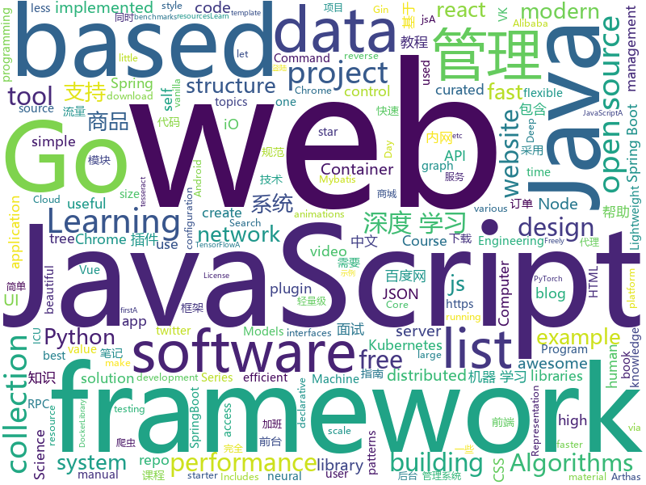

# 2019-04-07
See what the GitHub community is most excited about today.

## python
* [public-apis](https://github.com/toddmotto/public-apis)(**67 stars today**): A collective list of free APIs for use in software and web development.
* [Algorithm_Interview_Notes-Chinese](https://github.com/imhuay/Algorithm_Interview_Notes-Chinese)(**56 stars today**): 2018/2019/校招/春招/秋招/算法/机器学习(Machine Learning)/深度学习(Deep Learning)/自然语言处理(NLP)/C/C++/Python/面试笔记
* [awesome-python-login-model](https://github.com/CriseLYJ/awesome-python-login-model)(**51 stars today**): 😮python模拟登陆一些大型网站，还有一些简单的爬虫，希望对你们有所帮助❤️，如果喜欢记得给个star哦🌟
* [models](https://github.com/tensorflow/models)(**41 stars today**): Models and examples built with TensorFlow
* [awesome-python](https://github.com/vinta/awesome-python)(**45 stars today**): A curated list of awesome Python frameworks, libraries, software and resources
* [system-design-primer](https://github.com/donnemartin/system-design-primer)(**42 stars today**): Learn how to design large-scale systems. Prep for the system design interview. Includes Anki flashcards.
* [AmpliGraph](https://github.com/Accenture/AmpliGraph)(**46 stars today**): Python library for Representation Learning on Knowledge Graphs
* [mathematics_dataset](https://github.com/deepmind/mathematics_dataset)(**43 stars today**): 
* [CDCS](https://github.com/geekinglcq/CDCS)(**39 stars today**): Chinese Data Competitions' Solutions
* [faceswap](https://github.com/deepfakes/faceswap)(**32 stars today**): Non official project based on original /r/Deepfakes thread. Many thanks to him!
* [Logation](https://github.com/LeviBorodenko/Logation)(**35 stars today**): Analyse your NGINX access logs and create beautiful maps of the locations from which people access your service.
* [youtube-dl](https://github.com/ytdl-org/youtube-dl)(**33 stars today**): Command-line program to download videos from YouTube.com and other video sites
* [PyTorch-BigGraph](https://github.com/facebookresearch/PyTorch-BigGraph)(**33 stars today**): Software used for generating embeddings from large-scale graph-structured data.
* [home-assistant](https://github.com/home-assistant/home-assistant)(**31 stars today**): 🏡Open source home automation that puts local control and privacy first
* [scripts](https://github.com/Fmk0/scripts)(**31 stars today**): 
* [DGC-Net](https://github.com/AaltoVision/DGC-Net)(**33 stars today**): A PyTorch implementation of "DGC-Net: Dense Geometric Correspondence Network"
* [Python](https://github.com/TheAlgorithms/Python)(**27 stars today**): All Algorithms implemented in Python
* [keras](https://github.com/keras-team/keras)(**25 stars today**): Deep Learning for humans
* [ChromeAppHeroes](https://github.com/zhaoolee/ChromeAppHeroes)(**28 stars today**): 🌈Chrome插件英雄榜, 为优秀的Chrome插件写一本中文说明书, 让Chrome插件英雄们造福人类~ ChromePluginHeroes, Write a Chinese manual for the excellent Chrome plugin, let the Chrome plugin heroes benefit the human~
* [structural-probes](https://github.com/john-hewitt/structural-probes)(**29 stars today**): Codebase for testing whether hidden states of neural networks encode discrete structures.
* [100-Days-Of-ML-Code](https://github.com/Avik-Jain/100-Days-Of-ML-Code)(**25 stars today**): 100 Days of ML Coding
* [Python-crawler-tutorial-starts-from-zero](https://github.com/CriseLYJ/Python-crawler-tutorial-starts-from-zero)(**23 stars today**): python爬虫教程，带你从零到一，包含js逆向，selenium, tesseract OCR识别,mongodb的使用，以及scrapy框架
* [subsync](https://github.com/smacke/subsync)(**25 stars today**): Automagically synchronize subtitles with video.
* [bert](https://github.com/google-research/bert)(**21 stars today**): TensorFlow code and pre-trained models for BERT
* [CheatSheetSeries](https://github.com/OWASP/CheatSheetSeries)(**21 stars today**): The OWASP Cheat Sheet Series was created to provide a concise collection of high value information on specific application security topics.

## java
* [ghidra](https://github.com/NationalSecurityAgency/ghidra)(**177 stars today**): Ghidra is a software reverse engineering (SRE) framework
* [JavaGuide](https://github.com/Snailclimb/JavaGuide)(**127 stars today**): 【Java学习+面试指南】 一份涵盖大部分Java程序员所需要掌握的核心知识。
* [advanced-java](https://github.com/doocs/advanced-java)(**57 stars today**): 😮互联网 Java 工程师进阶知识完全扫盲
* [mall](https://github.com/macrozheng/mall)(**39 stars today**): mall项目是一套电商系统，包括前台商城系统及后台管理系统，基于SpringBoot+MyBatis实现。 前台商城系统包含首页门户、商品推荐、商品搜索、商品展示、购物车、订单流程、会员中心、客户服务、帮助中心等模块。 后台管理系统包含商品管理、订单管理、会员管理、促销管理、运营管理、内容管理、统计报表、财务管理、权限管理、设置等模块。
* [SpringBlade](https://github.com/chillzhuang/SpringBlade)(**26 stars today**): SpringBlade 是由一个商业级项目升级优化而来的SpringCloud微服务架构，采用Java8 API重构了业务代码，完全遵循阿里巴巴编码规范。采用Spring Boot 2 、Spring Cloud Finchley 、Mybatis 等核心技术，同时提供基于React和Vue的两个前端框架用于快速搭建企业级的SaaS微服务系统平台。 QQ群：477853168
* [spring-boot](https://github.com/spring-projects/spring-boot)(**19 stars today**): Spring Boot
* [java-design-patterns](https://github.com/iluwatar/java-design-patterns)(**23 stars today**): Design patterns implemented in Java
* [Java](https://github.com/TheAlgorithms/Java)(**21 stars today**): All Algorithms implemented in Java
* [tutorials](https://github.com/eugenp/tutorials)(**15 stars today**): The "REST With Spring" Course:
* [seata](https://github.com/seata/seata)(**22 stars today**): 🔥Seata is an easy-to-use, high-performance, java based, open source distributed transaction solution.
* [ChengFeng1.5](https://github.com/fuyunwang/ChengFeng1.5)(**21 stars today**): 基于SpringBoot改造Chengfeng
* [strimzi-kafka-operator](https://github.com/strimzi/strimzi-kafka-operator)(**22 stars today**): Apache Kafka running on Kubernetes and OpenShift
* [guava](https://github.com/google/guava)(**21 stars today**): Google core libraries for Java
* [spring-boot-examples](https://github.com/ityouknow/spring-boot-examples)(**19 stars today**): about learning Spring Boot via examples. Spring Boot 教程、技术栈示例代码，快速简单上手教程。
* [spring-framework](https://github.com/spring-projects/spring-framework)(**16 stars today**): Spring Framework
* [Magisk](https://github.com/topjohnwu/Magisk)(**17 stars today**): A Magic Mask to Alter Android System Systemless-ly
* [jsonrpc](https://github.com/xincao9/jsonrpc)(**17 stars today**): high-performance RPC framework.
* [JCSprout](https://github.com/crossoverJie/JCSprout)(**15 stars today**): 👨‍🎓Java Core Sprout : basic, concurrent, algorithm
* [graal](https://github.com/oracle/graal)(**16 stars today**): GraalVM: Run Programs Faster Anywhere🚀
* [elasticsearch](https://github.com/elastic/elasticsearch)(**12 stars today**): Open Source, Distributed, RESTful Search Engine
* [lottie-android](https://github.com/airbnb/lottie-android)(**14 stars today**): Render After Effects animations natively on Android and iOS, Web, and React Native
* [Sentinel](https://github.com/alibaba/Sentinel)(**14 stars today**): A lightweight powerful flow control component enabling reliability and monitoring for microservices. (轻量级的流量控制、熔断降级 Java 库)
* [library](https://github.com/ddd-by-examples/library)(**14 stars today**): A comprehensive Domain-Driven Design example with problem space strategic analysis and various tactical patterns.
* [incubator-dubbo](https://github.com/apache/incubator-dubbo)(**11 stars today**): Apache Dubbo (incubating) is a high-performance, java based, open source RPC framework.
* [arthas](https://github.com/alibaba/arthas)(**12 stars today**): Alibaba Java Diagnostic Tool Arthas/Alibaba Java诊断利器Arthas

## unknown
* [pumpkin-book](https://github.com/datawhalechina/pumpkin-book)(**283 stars today**): 《机器学习》（西瓜书）公式推导解析，在线阅读地址：https://datawhalechina.github.io/pumpkin-book
* [955.WLB](https://github.com/formulahendry/955.WLB)(**209 stars today**): 955 不加班的公司名单
* [app-ideas](https://github.com/florinpop17/app-ideas)(**166 stars today**): A Collection of application ideas which can be used to improve your coding skills.
* [DeepLearning-500-questions](https://github.com/scutan90/DeepLearning-500-questions)(**137 stars today**): 深度学习500问，以问答形式对常用的概率知识、线性代数、机器学习、深度学习、计算机视觉等热点问题进行阐述，以帮助自己及有需要的读者。 全书分为18个章节，50余万字。由于水平有限，书中不妥之处恳请广大读者批评指正。 未完待续............ 如有意合作，联系scutjy2015@163.com 版权所有，违权必究 Tan 2018.06
* [AgileLite](https://github.com/davebs/AgileLite)(**141 stars today**): Agile software development without all the burnout.
* [the-book-of-secret-knowledge](https://github.com/trimstray/the-book-of-secret-knowledge)(**102 stars today**): A collection of inspiring lists, manuals, cheatsheets, blogs, hacks, one-liners, cli/web tools and more.
* [996ICU](https://github.com/995icu/996ICU)(**90 stars today**): 996ICU 995ICU 工作996 生病ICU 加班不规范 亲人两行泪
* [CS-Notes](https://github.com/CyC2018/CS-Notes)(**71 stars today**): 📚技术面试必备基础知识
* [CVPR2019-Code](https://github.com/amusi/CVPR2019-Code)(**67 stars today**): CVPR 2019 Paper with Code
* [996.Leave](https://github.com/623637646/996.Leave)(**68 stars today**): 逃离996
* [awesome](https://github.com/sindresorhus/awesome)(**61 stars today**): 😎Awesome lists about all kinds of interesting topics
* [Data-Science--Cheat-Sheet](https://github.com/abhat222/Data-Science--Cheat-Sheet)(**55 stars today**): Cheat Sheets
* [gitignore](https://github.com/github/gitignore)(**44 stars today**): A collection of useful .gitignore templates
* [computer-graphics-from-scratch](https://github.com/ggambetta/computer-graphics-from-scratch)(**60 stars today**): Text, diagrams, and source code for the book Computer Graphics from scratch.
* [bench-scripts](https://github.com/haydenjames/bench-scripts)(**56 stars today**): A compilation of Linux server benchmarking scripts.
* [You-Dont-Know-JS](https://github.com/getify/You-Dont-Know-JS)(**46 stars today**): A book series on JavaScript. @YDKJS on twitter.
* [blog](https://github.com/airuikun/blog)(**46 stars today**): 小蝌蚪的blog，中年前端屌丝的心路历程，欢迎star或者watch
* [free-programming-books](https://github.com/EbookFoundation/free-programming-books)(**36 stars today**): 📚Freely available programming books
* [Anti-996-License](https://github.com/kattgu7/Anti-996-License)(**37 stars today**): Anti-996 License Version 1.0
* [trackerslist](https://github.com/ngosang/trackerslist)(**34 stars today**): An updated list of public BitTorrent trackers
* [coding-interview-university](https://github.com/jwasham/coding-interview-university)(**24 stars today**): A complete computer science study plan to become a software engineer.
* [everyone-can-use-english](https://github.com/xiaolai/everyone-can-use-english)(**27 stars today**): 人人都能用英语
* [computer-science](https://github.com/ossu/computer-science)(**26 stars today**): 🎓Path to a free self-taught education in Computer Science!
* [RE-iOS-Apps](https://github.com/ivRodriguezCA/RE-iOS-Apps)(**27 stars today**): A completely free, open source and online course about Reverse Engineering iOS Applications.
* [996.Law](https://github.com/Y1ran/996.Law)(**24 stars today**): 联合仲裁发起地 | 法律板块(主站：996.ICU)

## javascript
* [Awesome-Design-Tools](https://github.com/LisaDziuba/Awesome-Design-Tools)(**543 stars today**): The best design tools for everything👉
* [You-Dont-Need-jQuery](https://github.com/nefe/You-Dont-Need-jQuery)(**161 stars today**): Examples of how to do query, style, dom, ajax, event etc like jQuery with plain javascript.
* [solid](https://github.com/ryansolid/solid)(**126 stars today**): A declarative, efficient, and flexible JavaScript library for building user interfaces.
* [vue](https://github.com/vuejs/vue)(**74 stars today**): 🖖Vue.js is a progressive, incrementally-adoptable JavaScript framework for building UI on the web.
* [dsa.js](https://github.com/amejiarosario/dsa.js)(**69 stars today**): Data Structures and Algorithms using JavaScript
* [organigram](https://github.com/shoumma/organigram)(**69 stars today**): A JSON based tree structure with drag and drop functionally to re-arrange the tree. Show-cases some useful tree operations for deeply nested JSON data and webpack configuration for reducing bundle sizes. A sample JSON data for testing the functionality can be found in the repo/readme.
* [react](https://github.com/facebook/react)(**61 stars today**): A declarative, efficient, and flexible JavaScript library for building user interfaces.
* [libpku](https://github.com/lib-pku/libpku)(**40 stars today**): 北京大学课程资料整理
* [javascript-algorithms](https://github.com/trekhleb/javascript-algorithms)(**44 stars today**): 📝Algorithms and data structures implemented in JavaScript with explanations and links to further readings
* [is-online](https://github.com/sindresorhus/is-online)(**48 stars today**): Check if the internet connection is up
* [Motrix](https://github.com/agalwood/Motrix)(**45 stars today**): A full-featured download manager.
* [winXP](https://github.com/ShizukuIchi/winXP)(**46 stars today**): 🏁Web based Windows XP desktop recreation.
* [bootstrap](https://github.com/twbs/bootstrap)(**30 stars today**): The most popular HTML, CSS, and JavaScript framework for developing responsive, mobile first projects on the web.
* [VCoinX](https://github.com/cursedseal/VCoinX)(**28 stars today**): Бот для сервиса VK под названием "VK Coin".
* [axios](https://github.com/axios/axios)(**41 stars today**): Promise based HTTP client for the browser and node.js
* [30-seconds-of-code](https://github.com/30-seconds/30-seconds-of-code)(**39 stars today**): A curated collection of useful JavaScript snippets that you can understand in 30 seconds or less.
* [create-react-app](https://github.com/facebook/create-react-app)(**38 stars today**): Set up a modern web app by running one command.
* [baidupankey](https://github.com/wu-dada/baidupankey)(**33 stars today**): 查询百度网盘提取码
* [gatsby](https://github.com/gatsbyjs/gatsby)(**33 stars today**): Build blazing fast, modern apps and websites with React
* [perflink](https://github.com/lukejacksonn/perflink)(**36 stars today**): Low friction JavaScript benchmarks that you can share via URL
* [laxxx](https://github.com/alexfoxy/laxxx)(**34 stars today**): Simple & light weight (3kb minified & zipped) vanilla javascript plugin to create smooth & beautiful animations when you scrolllll! Harness the power of the most intuitive interaction and make your websites come alive!
* [formal](https://github.com/kevinwolfcr/formal)(**34 stars today**): 👔Elegant form management primitives for the react hooks era.
* [twemoji](https://github.com/twitter/twemoji)(**32 stars today**): Emoji for everyone. https://twemoji.twitter.com/
* [baiduyun](https://github.com/syhyz1990/baiduyun)(**30 stars today**): 油猴脚本 直接下载百度网盘和百度网盘分享的文件,直链下载超级加速
* [fastify](https://github.com/fastify/fastify)(**28 stars today**): Fast and low overhead web framework, for Node.js

## html
* [water.css](https://github.com/kognise/water.css)(**84 stars today**): A just-add-css collection of styles to make simple websites just a little nicer
* [learn-awesome](https://github.com/learn-awesome/learn-awesome)(**36 stars today**): Curated lists of awesome learning resources on various topics across formats.
* [javascript-tutorial-en](https://github.com/iliakan/javascript-tutorial-en)(**19 stars today**): Modern JavaScript Tutorial
* [personal-website](https://github.com/github/personal-website)(**8 stars today**): Code that'll help you kickstart a personal website that showcases your work as a software developer.
* [mlh-hackathon-nodejs-starter](https://github.com/MLH/mlh-hackathon-nodejs-starter)(**13 stars today**): Hackathon starter project for Node.js applications
* [Unifiedtransform](https://github.com/changeweb/Unifiedtransform)(**10 stars today**): A school management Software
* [nndl.github.io](https://github.com/nndl/nndl.github.io)(**12 stars today**): 《神经网络与深度学习》 Neural Network and Deep Learning
* [heroku-cra-node](https://github.com/mars/heroku-cra-node)(**11 stars today**): ⚛️How to use create-react-app with a custom Node server on Heroku
* [styleguide](https://github.com/google/styleguide)(**10 stars today**): Style guides for Google-originated open-source projects
* [mlh-hackathon-flask-starter](https://github.com/MLH/mlh-hackathon-flask-starter)(**11 stars today**): Hackathon starter project for Flask applications
* [JavaScript30](https://github.com/wesbos/JavaScript30)(**5 stars today**): 30 Day Vanilla JS Challenge
* [deeplearning_ai_books](https://github.com/fengdu78/deeplearning_ai_books)(**9 stars today**): deeplearning.ai（吴恩达老师的深度学习课程笔记及资源）
* [portainer](https://github.com/portainer/portainer)(**10 stars today**): Simple management UI for Docker
* [fastText](https://github.com/facebookresearch/fastText)(**10 stars today**): Library for fast text representation and classification.
* [AdminLTE](https://github.com/ColorlibHQ/AdminLTE)(**8 stars today**): AdminLTE - Free Premium Admin control Panel Theme Based On Bootstrap 3.x
* [Spoon-Knife](https://github.com/octocat/Spoon-Knife)(****): This repo is for demonstration purposes only.
* [datasciencecoursera](https://github.com/mGalarnyk/datasciencecoursera)(**9 stars today**): Data Science Repo and blog for John Hopkins Coursera Courses. Please let me know if you have any questions.
* [requests-html](https://github.com/kennethreitz/requests-html)(**9 stars today**): Pythonic HTML Parsing for Humans™
* [CLRS](https://github.com/walkccc/CLRS)(**8 stars today**): 📚Solutions to Introduction to Algorithms Third Edition
* [devops-essentials-sample-app](https://github.com/linuxacademy/devops-essentials-sample-app)(****): 
* [sourcegraph](https://github.com/sourcegraph/sourcegraph)(**7 stars today**): Code search and navigation tool (self-hosted)
* [SecurityWorker](https://github.com/qiaozi-tech/SecurityWorker)(**7 stars today**): The best javascript code protection solution ever.
* [blog_os](https://github.com/phil-opp/blog_os)(**6 stars today**): Writing an OS in Rust
* [dropcss](https://github.com/leeoniya/dropcss)(**6 stars today**): An exceptionally fast, thorough and tiny unused-CSS cleaner
* [material-dashboard-lite](https://github.com/CreativeIT/material-dashboard-lite)(**5 stars today**): A free dashboard template with material design lite

## go
* [the-way-to-go_ZH_CN](https://github.com/Unknwon/the-way-to-go_ZH_CN)(**167 stars today**): 《The Way to Go》中文译本，中文正式名《Go 入门指南》
* [popeye](https://github.com/derailed/popeye)(**162 stars today**): 🧭 A Kubernetes cluster resource sanitizer
* [algernon](https://github.com/xyproto/algernon)(**115 stars today**): 🎩Small self-contained pure-Go web server with Lua, Markdown, HTTP/2, QUIC, Redis and PostgreSQL support
* [goweight](https://github.com/jondot/goweight)(**112 stars today**): A tool to analyze and troubleshoot a Go binary size.
* [beam](https://github.com/eBay/beam)(**66 stars today**): A distributed knowledge graph store
* [syncthing](https://github.com/syncthing/syncthing)(**52 stars today**): Open Source Continuous File Synchronization
* [go](https://github.com/golang/go)(**41 stars today**): The Go programming language
* [footloose](https://github.com/weaveworks/footloose)(**40 stars today**): Container Machines - Containers that look like Virtual Machines
* [awesome-go](https://github.com/avelino/awesome-go)(**37 stars today**): A curated list of awesome Go frameworks, libraries and software
* [konfig](https://github.com/kelseyhightower/konfig)(**37 stars today**): 
* [nps](https://github.com/cnlh/nps)(**32 stars today**): 一款轻量级、功能强大的内网穿透代理服务器。支持tcp、udp流量转发，支持内网http代理、内网socks5代理，同时支持snappy压缩、站点保护、加密传输、多路复用、header修改等。支持web图形化管理，集成多用户模式。
* [kubernetes](https://github.com/kubernetes/kubernetes)(**22 stars today**): Production-Grade Container Scheduling and Management
* [hercules](https://github.com/src-d/hercules)(**26 stars today**): Gaining advanced insights from Git repository history.
* [fyne](https://github.com/fyne-io/fyne)(**24 stars today**): Cross platform GUI in Go based on Material Design
* [config](https://github.com/JeremyLoy/config)(**25 stars today**): 12 factor configuration as a typesafe struct in as little as two function calls
* [hugo](https://github.com/gohugoio/hugo)(**23 stars today**): The world’s fastest framework for building websites.
* [v2ray-core](https://github.com/v2ray/v2ray-core)(**20 stars today**): A platform for building proxies to bypass network restrictions.
* [traefik](https://github.com/containous/traefik)(**21 stars today**): The Cloud Native Edge Router
* [server](https://github.com/gotify/server)(**21 stars today**): A simple server for sending and receiving messages in real-time per WebSocket. (Includes a sleek web-ui)
* [vugu](https://github.com/vugu/vugu)(**21 stars today**): Vugu: A modern UI library for Go+WebAssembly (experimental)
* [gin](https://github.com/gin-gonic/gin)(**19 stars today**): Gin is a HTTP web framework written in Go (Golang). It features a Martini-like API with much better performance -- up to 40 times faster. If you need smashing performance, get yourself some Gin.
* [k3s](https://github.com/rancher/k3s)(**17 stars today**): Lightweight Kubernetes. 5 less than k8s.
* [moby](https://github.com/moby/moby)(**15 stars today**): Moby Project - a collaborative project for the container ecosystem to assemble container-based systems
* [remark](https://github.com/umputun/remark)(**16 stars today**): comment engine
* [etcd](https://github.com/etcd-io/etcd)(**15 stars today**): Distributed reliable key-value store for the most critical data of a distributed system

## WordCloud

