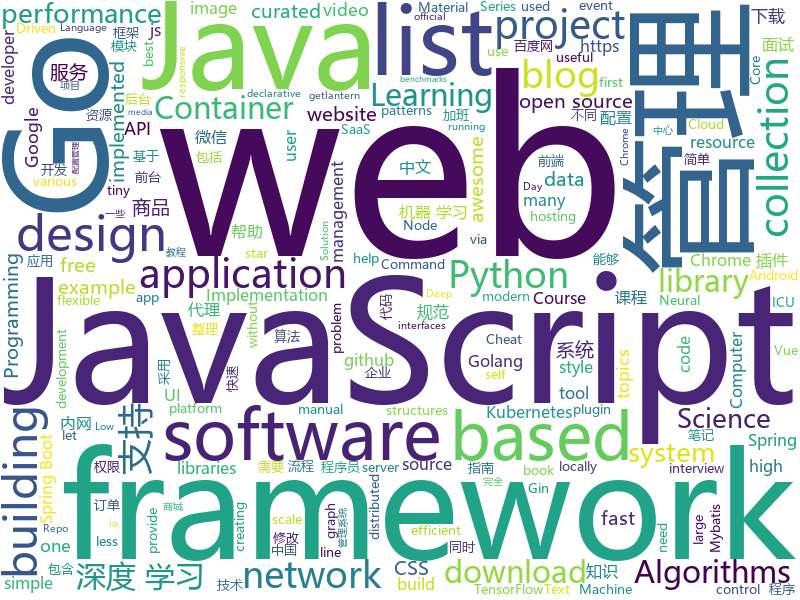

# 2019-04-08
See what the GitHub community is most excited about today.

## python
* [CheatSheetSeries](https://github.com/OWASP/CheatSheetSeries)(**261 stars today**): The OWASP Cheat Sheet Series was created to provide a concise collection of high value information on specific application security topics.
* [OUCML](https://github.com/OUCMachineLearning/OUCML)(**68 stars today**): 
* [public-apis](https://github.com/toddmotto/public-apis)(**64 stars today**): A collective list of free APIs for use in software and web development.
* [RandWireNN](https://github.com/seungwonpark/RandWireNN)(**61 stars today**): Implementation of: "Exploring Randomly Wired Neural Networks for Image Recognition"
* [100-Days-Of-ML-Code](https://github.com/Avik-Jain/100-Days-Of-ML-Code)(**53 stars today**): 100 Days of ML Coding
* [models](https://github.com/tensorflow/models)(**48 stars today**): Models and examples built with TensorFlow
* [awesome-python-login-model](https://github.com/CriseLYJ/awesome-python-login-model)(**56 stars today**): 😮python模拟登陆一些大型网站，还有一些简单的爬虫，希望对你们有所帮助❤️，如果喜欢记得给个star哦🌟
* [ChromeAppHeroes](https://github.com/zhaoolee/ChromeAppHeroes)(**57 stars today**): 🌈Chrome插件英雄榜, 为优秀的Chrome插件写一本中文说明书, 让Chrome插件英雄们造福人类~ ChromePluginHeroes, Write a Chinese manual for the excellent Chrome plugin, let the Chrome plugin heroes benefit the human~
* [system-design-primer](https://github.com/donnemartin/system-design-primer)(**51 stars today**): Learn how to design large-scale systems. Prep for the system design interview. Includes Anki flashcards.
* [Algorithm_Interview_Notes-Chinese](https://github.com/imhuay/Algorithm_Interview_Notes-Chinese)(**41 stars today**): 2018/2019/校招/春招/秋招/算法/机器学习(Machine Learning)/深度学习(Deep Learning)/自然语言处理(NLP)/C/C++/Python/面试笔记
* [youtube-dl](https://github.com/ytdl-org/youtube-dl)(**41 stars today**): Command-line program to download videos from YouTube.com and other video sites
* [mathematics_dataset](https://github.com/deepmind/mathematics_dataset)(**40 stars today**): 
* [awesome-python](https://github.com/vinta/awesome-python)(**39 stars today**): A curated list of awesome Python frameworks, libraries, software and resources
* [pyright](https://github.com/Microsoft/pyright)(**36 stars today**): Static type checker for Python
* [Python](https://github.com/TheAlgorithms/Python)(**30 stars today**): All Algorithms implemented in Python
* [keras](https://github.com/keras-team/keras)(**28 stars today**): Deep Learning for humans
* [bert](https://github.com/google-research/bert)(**29 stars today**): TensorFlow code and pre-trained models for BERT
* [PyTorch-BigGraph](https://github.com/facebookresearch/PyTorch-BigGraph)(**29 stars today**): Software used for generating embeddings from large-scale graph-structured data.
* [sewar](https://github.com/andrewekhalel/sewar)(**30 stars today**): All image quality metrics you need in one package.
* [faceswap](https://github.com/deepfakes/faceswap)(**26 stars today**): Non official project based on original /r/Deepfakes thread. Many thanks to him!
* [flask](https://github.com/pallets/flask)(**25 stars today**): The Python micro framework for building web applications.
* [stylegan](https://github.com/NVlabs/stylegan)(**24 stars today**): StyleGAN - Official TensorFlow Implementation
* [home-assistant](https://github.com/home-assistant/home-assistant)(**20 stars today**): 🏡Open source home automation that puts local control and privacy first
* [USTC-Course](https://github.com/USTC-Resource/USTC-Course)(**21 stars today**): ❤️中国科学技术大学课程资源
* [modin](https://github.com/modin-project/modin)(**23 stars today**): Modin: Speed up your Pandas workflows by changing a single line of code

## java
* [ghidra](https://github.com/NationalSecurityAgency/ghidra)(**176 stars today**): Ghidra is a software reverse engineering (SRE) framework
* [JavaGuide](https://github.com/Snailclimb/JavaGuide)(**127 stars today**): 【Java学习+面试指南】 一份涵盖大部分Java程序员所需要掌握的核心知识。
* [advanced-java](https://github.com/doocs/advanced-java)(**66 stars today**): 😮互联网 Java 工程师进阶知识完全扫盲
* [mall](https://github.com/macrozheng/mall)(**42 stars today**): mall项目是一套电商系统，包括前台商城系统及后台管理系统，基于SpringBoot+MyBatis实现。 前台商城系统包含首页门户、商品推荐、商品搜索、商品展示、购物车、订单流程、会员中心、客户服务、帮助中心等模块。 后台管理系统包含商品管理、订单管理、会员管理、促销管理、运营管理、内容管理、统计报表、财务管理、权限管理、设置等模块。
* [java-design-patterns](https://github.com/iluwatar/java-design-patterns)(**36 stars today**): Design patterns implemented in Java
* [SpringBlade](https://github.com/chillzhuang/SpringBlade)(**35 stars today**): SpringBlade 是由一个商业级项目升级优化而来的SpringCloud微服务架构，采用Java8 API重构了业务代码，完全遵循阿里巴巴编码规范。采用Spring Boot 2 、Spring Cloud Finchley 、Mybatis 等核心技术，同时提供基于React和Vue的两个前端框架用于快速搭建企业级的SaaS微服务系统平台。 QQ群：477853168
* [library](https://github.com/ddd-by-examples/library)(**37 stars today**): A comprehensive Domain-Driven Design example with problem space strategic analysis and various tactical patterns.
* [spring-boot](https://github.com/spring-projects/spring-boot)(**25 stars today**): Spring Boot
* [spring-framework](https://github.com/spring-projects/spring-framework)(**24 stars today**): Spring Framework
* [spring-boot-examples](https://github.com/ityouknow/spring-boot-examples)(**29 stars today**): about learning Spring Boot via examples. Spring Boot 教程、技术栈示例代码，快速简单上手教程。
* [Lawnchair](https://github.com/LawnchairLauncher/Lawnchair)(**31 stars today**): [v2 sources released!] No clever tagline needed
* [Java](https://github.com/TheAlgorithms/Java)(**26 stars today**): All Algorithms implemented in Java
* [hyena](https://github.com/alphajiang/hyena)(**30 stars today**): 用户余额/积分微服务
* [tutorials](https://github.com/eugenp/tutorials)(**18 stars today**): The "REST With Spring" Course:
* [MaterialBanner](https://github.com/sergivonavi/MaterialBanner)(**22 stars today**): A library that provides an implementation of the banner widget from the Material design.
* [seata](https://github.com/seata/seata)(**18 stars today**): 🔥Seata is an easy-to-use, high-performance, java based, open source distributed transaction solution.
* [strimzi-kafka-operator](https://github.com/strimzi/strimzi-kafka-operator)(**18 stars today**): Apache Kafka running on Kubernetes and OpenShift
* [DrivingAgency](https://github.com/fuyunwang/DrivingAgency)(**15 stars today**): 驾校代理小程序后端
* [JCSprout](https://github.com/crossoverJie/JCSprout)(**15 stars today**): 👨‍🎓Java Core Sprout : basic, concurrent, algorithm
* [WxJava](https://github.com/Wechat-Group/WxJava)(**16 stars today**): WxJava （微信开发 Java SDK），支持包括微信支付、开放平台、小程序、企业微信/企业号和公众号等的后端开发
* [guava](https://github.com/google/guava)(**16 stars today**): Google core libraries for Java
* [netty](https://github.com/netty/netty)(**14 stars today**): Netty project - an event-driven asynchronous network application framework
* [mybatis-3](https://github.com/mybatis/mybatis-3)(**14 stars today**): MyBatis SQL mapper framework for Java
* [Magisk](https://github.com/topjohnwu/Magisk)(**15 stars today**): A Magic Mask to Alter Android System Systemless-ly
* [apollo](https://github.com/ctripcorp/apollo)(**14 stars today**): Apollo（阿波罗）是携程框架部门研发的分布式配置中心，能够集中化管理应用不同环境、不同集群的配置，配置修改后能够实时推送到应用端，并且具备规范的权限、流程治理等特性，适用于微服务配置管理场景。

## unknown
* [955.WLB](https://github.com/formulahendry/955.WLB)(**458 stars today**): 955 不加班的公司名单
* [app-ideas](https://github.com/florinpop17/app-ideas)(**390 stars today**): A Collection of application ideas which can be used to improve your coding skills.
* [pumpkin-book](https://github.com/datawhalechina/pumpkin-book)(**286 stars today**): 《机器学习》（西瓜书）公式推导解析，在线阅读地址：https://datawhalechina.github.io/pumpkin-book
* [bench-scripts](https://github.com/haydenjames/bench-scripts)(**154 stars today**): A compilation of Linux server benchmarking scripts.
* [DeepLearning-500-questions](https://github.com/scutan90/DeepLearning-500-questions)(**112 stars today**): 深度学习500问，以问答形式对常用的概率知识、线性代数、机器学习、深度学习、计算机视觉等热点问题进行阐述，以帮助自己及有需要的读者。 全书分为18个章节，50余万字。由于水平有限，书中不妥之处恳请广大读者批评指正。 未完待续............ 如有意合作，联系scutjy2015@163.com 版权所有，违权必究 Tan 2018.06
* [996ICU](https://github.com/995icu/996ICU)(**115 stars today**): 996ICU 995ICU 工作996 生病ICU 加班不规范 亲人两行泪
* [996.Leave](https://github.com/623637646/996.Leave)(**112 stars today**): 逃离996
* [CS-Notes](https://github.com/CyC2018/CS-Notes)(**80 stars today**): 📚技术面试必备基础知识
* [the-book-of-secret-knowledge](https://github.com/trimstray/the-book-of-secret-knowledge)(**75 stars today**): A collection of inspiring lists, manuals, cheatsheets, blogs, hacks, one-liners, cli/web tools and more.
* [Data-Science--Cheat-Sheet](https://github.com/abhat222/Data-Science--Cheat-Sheet)(**55 stars today**): Cheat Sheets
* [AgileLite](https://github.com/davebs/AgileLite)(**71 stars today**): Agile software development without all the burnout.
* [awesome](https://github.com/sindresorhus/awesome)(**61 stars today**): 😎Awesome lists about all kinds of interesting topics
* [free-programming-books](https://github.com/EbookFoundation/free-programming-books)(**62 stars today**): 📚Freely available programming books
* [gitignore](https://github.com/github/gitignore)(**49 stars today**): A collection of useful .gitignore templates
* [You-Dont-Know-JS](https://github.com/getify/You-Dont-Know-JS)(**51 stars today**): A book series on JavaScript. @YDKJS on twitter.
* [computer-graphics-from-scratch](https://github.com/ggambetta/computer-graphics-from-scratch)(**49 stars today**): Text, diagrams, and source code for the book Computer Graphics from scratch.
* [Anti-996-License](https://github.com/kattgu7/Anti-996-License)(**46 stars today**): Anti-996 License Version 1.0
* [everyone-can-use-english](https://github.com/xiaolai/everyone-can-use-english)(**38 stars today**): 人人都能用英语
* [CVPR2019-Code](https://github.com/amusi/CVPR2019-Code)(**38 stars today**): CVPR 2019 Paper with Code
* [Develop-Source](https://github.com/yuchuangu85/Develop-Source)(**34 stars today**): Open source for developer.(移动开发资源整理：Java，Android，算法，iOS，MacOS，ect...)
* [blog](https://github.com/airuikun/blog)(**37 stars today**): 小蝌蚪的blog，中年前端屌丝的心路历程，欢迎star或者watch
* [coding-interview-university](https://github.com/jwasham/coding-interview-university)(**31 stars today**): A complete computer science study plan to become a software engineer.
* [chinese-programmer-wrong-pronunciation](https://github.com/shimohq/chinese-programmer-wrong-pronunciation)(**35 stars today**): 中国程序员容易发音错误的单词
* [computer-science](https://github.com/ossu/computer-science)(**31 stars today**): 🎓Path to a free self-taught education in Computer Science!
* [datascience](https://github.com/r0f1/datascience)(**34 stars today**): Curated list of Python resources for data science.

## javascript
* [Awesome-Design-Tools](https://github.com/LisaDziuba/Awesome-Design-Tools)(**387 stars today**): The best design tools for everything👉
* [ElGrapho](https://github.com/ericdrowell/ElGrapho)(**142 stars today**): 
* [You-Dont-Need-jQuery](https://github.com/nefe/You-Dont-Need-jQuery)(**116 stars today**): Examples of how to do query, style, dom, ajax, event etc like jQuery with plain javascript.
* [vue](https://github.com/vuejs/vue)(**78 stars today**): 🖖Vue.js is a progressive, incrementally-adoptable JavaScript framework for building UI on the web.
* [perflink](https://github.com/lukejacksonn/perflink)(**75 stars today**): Low friction JavaScript benchmarks that you can share via URL
* [fastify](https://github.com/fastify/fastify)(**65 stars today**): Fast and low overhead web framework, for Node.js
* [libpku](https://github.com/lib-pku/libpku)(**55 stars today**): 北京大学课程资料整理
* [solid](https://github.com/ryansolid/solid)(**60 stars today**): A declarative, efficient, and flexible JavaScript library for building user interfaces.
* [react](https://github.com/facebook/react)(**53 stars today**): A declarative, efficient, and flexible JavaScript library for building user interfaces.
* [winXP](https://github.com/ShizukuIchi/winXP)(**55 stars today**): 🏁Web based Windows XP desktop recreation.
* [dsa.js](https://github.com/amejiarosario/dsa.js)(**54 stars today**): Data Structures and Algorithms using JavaScript
* [bypass-paywalls-chrome](https://github.com/iamadamdev/bypass-paywalls-chrome)(**50 stars today**): Bypass Paywalls for Chrome
* [google-interview-preparation-problems](https://github.com/mgechev/google-interview-preparation-problems)(**49 stars today**): leetcode problems I solved during my Google interview preparation.
* [Orca](https://github.com/hundredrabbits/Orca)(**50 stars today**): Live Programming Environment
* [create-react-app](https://github.com/facebook/create-react-app)(**39 stars today**): Set up a modern web app by running one command.
* [lazysizes](https://github.com/aFarkas/lazysizes)(**46 stars today**): High performance and SEO friendly lazy loader for images (responsive and normal), iframes and more, that detects any visibility changes triggered through user interaction, CSS or JavaScript without configuration.
* [javascript-algorithms](https://github.com/trekhleb/javascript-algorithms)(**41 stars today**): 📝Algorithms and data structures implemented in JavaScript with explanations and links to further readings
* [baiduyun](https://github.com/syhyz1990/baiduyun)(**43 stars today**): 油猴脚本 直接下载百度网盘和百度网盘分享的文件,直链下载超级加速
* [Motrix](https://github.com/agalwood/Motrix)(**41 stars today**): A full-featured download manager.
* [axios](https://github.com/axios/axios)(**38 stars today**): Promise based HTTP client for the browser and node.js
* [30-seconds-of-code](https://github.com/30-seconds/30-seconds-of-code)(**34 stars today**): A curated collection of useful JavaScript snippets that you can understand in 30 seconds or less.
* [Pilot](https://github.com/hundredrabbits/Pilot)(**38 stars today**): Orca's best friend.
* [awesome-selfhosted](https://github.com/Kickball/awesome-selfhosted)(**35 stars today**): This is a list of Free Software network services and web applications which can be hosted locally. Selfhosting is the process of locally hosting and managing applications instead of renting from SaaS providers.
* [bootstrap](https://github.com/twbs/bootstrap)(**27 stars today**): The most popular HTML, CSS, and JavaScript framework for developing responsive, mobile first projects on the web.
* [gatsby](https://github.com/gatsbyjs/gatsby)(**31 stars today**): Build blazing fast, modern apps and websites with React

## html
* [water.css](https://github.com/kognise/water.css)(**1,111 stars today**): A just-add-css collection of styles to make simple websites just a little nicer
* [nndl.github.io](https://github.com/nndl/nndl.github.io)(**571 stars today**): 《神经网络与深度学习》 Neural Network and Deep Learning
* [Unifiedtransform](https://github.com/changeweb/Unifiedtransform)(**54 stars today**): A school management Software
* [learn-awesome](https://github.com/learn-awesome/learn-awesome)(**37 stars today**): Curated lists of awesome learning resources on various topics across formats.
* [personal-website](https://github.com/github/personal-website)(**11 stars today**): Code that'll help you kickstart a personal website that showcases your work as a software developer.
* [styleguide](https://github.com/google/styleguide)(**14 stars today**): Style guides for Google-originated open-source projects
* [laravel-graphql](https://github.com/supliu/laravel-graphql)(**17 stars today**): GraphQL with Laravel Framework
* [javascript-tutorial-en](https://github.com/iliakan/javascript-tutorial-en)(**14 stars today**): Modern JavaScript Tutorial
* [AdminLTE](https://github.com/ColorlibHQ/AdminLTE)(**13 stars today**): AdminLTE - Free Premium Admin control Panel Theme Based On Bootstrap 3.x
* [deeplearning_ai_books](https://github.com/fengdu78/deeplearning_ai_books)(**13 stars today**): deeplearning.ai（吴恩达老师的深度学习课程笔记及资源）
* [JavaScript30](https://github.com/wesbos/JavaScript30)(**6 stars today**): 30 Day Vanilla JS Challenge
* [CLRS](https://github.com/walkccc/CLRS)(**10 stars today**): 📚Solutions to Introduction to Algorithms Third Edition
* [qiubaiying.github.io](https://github.com/qiubaiying/qiubaiying.github.io)(**5 stars today**): BY Blog ->
* [lets-get-arrested](https://github.com/hamukazu/lets-get-arrested)(**9 stars today**): This project is intended to protest against the police in Japan
* [html](https://github.com/whatwg/html)(**9 stars today**): HTML Standard
* [fastText](https://github.com/facebookresearch/fastText)(**8 stars today**): Library for fast text representation and classification.
* [micromodal](https://github.com/ghosh/micromodal)(**7 stars today**): ⭕ Tiny javascript library for creating accessible modal dialogs
* [cs231n.github.io](https://github.com/cs231n/cs231n.github.io)(**7 stars today**): Public facing notes page
* [devops-essentials-sample-app](https://github.com/linuxacademy/devops-essentials-sample-app)(****): 
* [TranslatorX](https://github.com/pingfangx/TranslatorX)(**7 stars today**): JetBrains 系列软件汉化包
* [Spoon-Knife](https://github.com/octocat/Spoon-Knife)(****): This repo is for demonstration purposes only.
* [portainer](https://github.com/portainer/portainer)(**6 stars today**): Simple management UI for Docker
* [datasciencecoursera](https://github.com/mGalarnyk/datasciencecoursera)(**5 stars today**): Data Science Repo and blog for John Hopkins Coursera Courses. Please let me know if you have any questions.
* [dropcss](https://github.com/leeoniya/dropcss)(**6 stars today**): An exceptionally fast, thorough and tiny unused-CSS cleaner
* [tools](https://github.com/googlecodelabs/tools)(**6 stars today**): Codelabs management & hosting tools

## go
* [dbdot](https://github.com/akarki15/dbdot)(**186 stars today**): Generate DOT description for postgres db schema
* [popeye](https://github.com/derailed/popeye)(**160 stars today**): 🧭 A Kubernetes cluster resource sanitizer
* [free-gophers-pack](https://github.com/MariaLetta/free-gophers-pack)(**156 stars today**): ✨This pack of 100+ gopher pictures and elements will help you to build own design of almost anything related to Go Programming Language: presentations, posts in blogs or social media, courses, videos and many, many more.
* [the-way-to-go_ZH_CN](https://github.com/Unknwon/the-way-to-go_ZH_CN)(**122 stars today**): 《The Way to Go》中文译本，中文正式名《Go 入门指南》
* [algernon](https://github.com/xyproto/algernon)(**60 stars today**): 🎩Small self-contained pure-Go web server with Lua, Markdown, HTTP/2, QUIC, Redis and PostgreSQL support
* [go](https://github.com/golang/go)(**47 stars today**): The Go programming language
* [kubernetes](https://github.com/kubernetes/kubernetes)(**38 stars today**): Production-Grade Container Scheduling and Management
* [beam](https://github.com/eBay/beam)(**42 stars today**): A distributed knowledge graph store
* [goweight](https://github.com/jondot/goweight)(**39 stars today**): A tool to analyze and troubleshoot a Go binary size.
* [nps](https://github.com/cnlh/nps)(**35 stars today**): 一款轻量级、功能强大的内网穿透代理服务器。支持tcp、udp流量转发，支持内网http代理、内网socks5代理，同时支持snappy压缩、站点保护、加密传输、多路复用、header修改等。支持web图形化管理，集成多用户模式。
* [awesome-go](https://github.com/avelino/awesome-go)(**34 stars today**): A curated list of awesome Go frameworks, libraries and software
* [v](https://github.com/vlang/v)(**34 stars today**): Simple, fast, safe, compiled language for creating maintainable software. Supports translation from C/C++.
* [gin](https://github.com/gin-gonic/gin)(**30 stars today**): Gin is a HTTP web framework written in Go (Golang). It features a Martini-like API with much better performance -- up to 40 times faster. If you need smashing performance, get yourself some Gin.
* [syncthing](https://github.com/syncthing/syncthing)(**30 stars today**): Open Source Continuous File Synchronization
* [hugo](https://github.com/gohugoio/hugo)(**24 stars today**): The world’s fastest framework for building websites.
* [footloose](https://github.com/weaveworks/footloose)(**22 stars today**): Container Machines - Containers that look like Virtual Machines
* [k3s](https://github.com/rancher/k3s)(**21 stars today**): Lightweight Kubernetes. 5 less than k8s.
* [lantern](https://github.com/getlantern/lantern)(**20 stars today**): 🔴蓝灯最新版本下载 https://github.com/getlantern/download🔴Lantern Latest Download https://github.com/getlantern/download🔴
* [lazygit](https://github.com/jesseduffield/lazygit)(**20 stars today**): simple terminal UI for git commands
* [build-web-application-with-golang](https://github.com/astaxie/build-web-application-with-golang)(**17 stars today**): A golang ebook intro how to build a web with golang
* [traefik](https://github.com/containous/traefik)(**16 stars today**): The Cloud Native Edge Router
* [fyne](https://github.com/fyne-io/fyne)(**16 stars today**): Cross platform GUI in Go based on Material Design
* [v2ray-core](https://github.com/v2ray/v2ray-core)(**12 stars today**): A platform for building proxies to bypass network restrictions.
* [gorm](https://github.com/jinzhu/gorm)(**16 stars today**): The fantastic ORM library for Golang, aims to be developer friendly
* [moby](https://github.com/moby/moby)(**14 stars today**): Moby Project - a collaborative project for the container ecosystem to assemble container-based systems

## WordCloud

