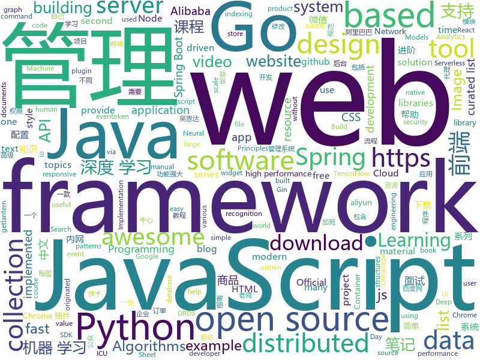

# 2019-04-09
See what the GitHub community is most excited about today.

## python
* [CheatSheetSeries](https://github.com/OWASP/CheatSheetSeries)(**593 stars today**): The OWASP Cheat Sheet Series was created to provide a concise collection of high value information on specific application security topics.
* [RandWireNN](https://github.com/seungwonpark/RandWireNN)(**216 stars today**): Implementation of: "Exploring Randomly Wired Neural Networks for Image Recognition"
* [ddgr](https://github.com/jarun/ddgr)(**179 stars today**): 🦆DuckDuckGo from the terminal
* [Algorithm_Interview_Notes-Chinese](https://github.com/imhuay/Algorithm_Interview_Notes-Chinese)(**126 stars today**): 2018/2019/校招/春招/秋招/算法/机器学习(Machine Learning)/深度学习(Deep Learning)/自然语言处理(NLP)/C/C++/Python/面试笔记
* [OUCML](https://github.com/OUCMachineLearning/OUCML)(**122 stars today**): 
* [100-Days-Of-ML-Code](https://github.com/Avik-Jain/100-Days-Of-ML-Code)(**99 stars today**): 100 Days of ML Coding
* [awesome-python](https://github.com/vinta/awesome-python)(**85 stars today**): A curated list of awesome Python frameworks, libraries, software and resources
* [awesome-python-login-model](https://github.com/CriseLYJ/awesome-python-login-model)(**83 stars today**): 😮python模拟登陆一些大型网站，还有一些简单的爬虫，希望对你们有所帮助❤️，如果喜欢记得给个star哦🌟
* [ChromeAppHeroes](https://github.com/zhaoolee/ChromeAppHeroes)(**83 stars today**): 🌈Chrome插件英雄榜, 为优秀的Chrome插件写一本中文说明书, 让Chrome插件英雄们造福人类~ ChromePluginHeroes, Write a Chinese manual for the excellent Chrome plugin, let the Chrome plugin heroes benefit the human~
* [public-apis](https://github.com/toddmotto/public-apis)(**81 stars today**): A collective list of free APIs for use in software and web development.
* [models](https://github.com/tensorflow/models)(**61 stars today**): Models and examples built with TensorFlow
* [face_recognition](https://github.com/ageitgey/face_recognition)(**66 stars today**): The world's simplest facial recognition api for Python and the command line
* [system-design-primer](https://github.com/donnemartin/system-design-primer)(**68 stars today**): Learn how to design large-scale systems. Prep for the system design interview. Includes Anki flashcards.
* [google-images-download](https://github.com/hardikvasa/google-images-download)(**61 stars today**): Python Script to download hundreds of images from 'Google Images'. It is a ready-to-run code!
* [Python](https://github.com/TheAlgorithms/Python)(**53 stars today**): All Algorithms implemented in Python
* [you-get](https://github.com/soimort/you-get)(**53 stars today**): ⏬Dumb downloader that scrapes the web
* [pyright](https://github.com/Microsoft/pyright)(**61 stars today**): Static type checker for Python
* [PyTorch-BigGraph](https://github.com/facebookresearch/PyTorch-BigGraph)(**59 stars today**): Software used for generating embeddings from large-scale graph-structured data.
* [USTC-Course](https://github.com/USTC-Resource/USTC-Course)(**52 stars today**): ❤️中国科学技术大学课程资源
* [stylegan](https://github.com/NVlabs/stylegan)(**51 stars today**): StyleGAN - Official TensorFlow Implementation
* [django](https://github.com/django/django)(**38 stars today**): The Web framework for perfectionists with deadlines.
* [faceswap](https://github.com/deepfakes/faceswap)(**44 stars today**): Non official project based on original /r/Deepfakes thread. Many thanks to him!
* [bert](https://github.com/google-research/bert)(**44 stars today**): TensorFlow code and pre-trained models for BERT
* [keras](https://github.com/keras-team/keras)(**40 stars today**): Deep Learning for humans
* [youtube-dl](https://github.com/ytdl-org/youtube-dl)(**40 stars today**): Command-line program to download videos from YouTube.com and other video sites

## java
* [SpringAll](https://github.com/wuyouzhuguli/SpringAll)(**564 stars today**): 循序渐进，学习Spring Boot、Spring Boot & Shiro、Spring Cloud和Spring Security，博客Spring系列源码
* [JavaGuide](https://github.com/Snailclimb/JavaGuide)(**240 stars today**): 【Java学习+面试指南】 一份涵盖大部分Java程序员所需要掌握的核心知识。
* [ghidra](https://github.com/NationalSecurityAgency/ghidra)(**218 stars today**): Ghidra is a software reverse engineering (SRE) framework
* [advanced-java](https://github.com/doocs/advanced-java)(**185 stars today**): 😮互联网 Java 工程师进阶知识完全扫盲
* [mall](https://github.com/macrozheng/mall)(**106 stars today**): mall项目是一套电商系统，包括前台商城系统及后台管理系统，基于SpringBoot+MyBatis实现。 前台商城系统包含首页门户、商品推荐、商品搜索、商品展示、购物车、订单流程、会员中心、客户服务、帮助中心等模块。 后台管理系统包含商品管理、订单管理、会员管理、促销管理、运营管理、内容管理、统计报表、财务管理、权限管理、设置等模块。
* [seata](https://github.com/seata/seata)(**100 stars today**): 🔥Seata is an easy-to-use, high-performance, java based, open source distributed transaction solution.
* [tutorials](https://github.com/eugenp/tutorials)(**53 stars today**): The "REST With Spring" Course:
* [spring-boot](https://github.com/spring-projects/spring-boot)(**55 stars today**): Spring Boot
* [java-design-patterns](https://github.com/iluwatar/java-design-patterns)(**65 stars today**): Design patterns implemented in Java
* [spring-boot-examples](https://github.com/ityouknow/spring-boot-examples)(**54 stars today**): about learning Spring Boot via examples. Spring Boot 教程、技术栈示例代码，快速简单上手教程。
* [Lawnchair](https://github.com/LawnchairLauncher/Lawnchair)(**62 stars today**): [v2 sources released!] No clever tagline needed
* [spring-framework](https://github.com/spring-projects/spring-framework)(**49 stars today**): Spring Framework
* [incubator-dubbo](https://github.com/apache/incubator-dubbo)(**33 stars today**): Apache Dubbo (incubating) is a high-performance, java based, open source RPC framework.
* [arthas](https://github.com/alibaba/arthas)(**40 stars today**): Alibaba Java Diagnostic Tool Arthas/Alibaba Java诊断利器Arthas
* [MaterialBanner](https://github.com/sergivonavi/MaterialBanner)(**41 stars today**): A library that provides an implementation of the banner widget from the Material design.
* [elasticsearch](https://github.com/elastic/elasticsearch)(**34 stars today**): Open Source, Distributed, RESTful Search Engine
* [spring-cloud-alibaba](https://github.com/spring-cloud-incubator/spring-cloud-alibaba)(**36 stars today**): Spring Cloud Alibaba provides a one-stop solution for application development for the distributed solutions of Alibaba middleware.
* [WxJava](https://github.com/Wechat-Group/WxJava)(**36 stars today**): WxJava （微信开发 Java SDK），支持包括微信支付、开放平台、小程序、企业微信/企业号和公众号等的后端开发
* [Java](https://github.com/TheAlgorithms/Java)(**34 stars today**): All Algorithms implemented in Java
* [netty](https://github.com/netty/netty)(**25 stars today**): Netty project - an event-driven asynchronous network application framework
* [guava](https://github.com/google/guava)(**29 stars today**): Google core libraries for Java
* [apollo](https://github.com/ctripcorp/apollo)(**27 stars today**): Apollo（阿波罗）是携程框架部门研发的分布式配置中心，能够集中化管理应用不同环境、不同集群的配置，配置修改后能够实时推送到应用端，并且具备规范的权限、流程治理等特性，适用于微服务配置管理场景。
* [library](https://github.com/ddd-by-examples/library)(**32 stars today**): A comprehensive Domain-Driven Design example with problem space strategic analysis and various tactical patterns.
* [evt4j](https://github.com/everitoken/evt4j)(**32 stars today**): Official Java SDK for everiToken public chain. https://www.everitoken.io
* [canal](https://github.com/alibaba/canal)(**29 stars today**): 阿里巴巴mysql数据库binlog的增量订阅&消费组件 。阿里云DRDS( https://www.aliyun.com/product/drds )、阿里巴巴TDDL 二级索引、小表复制powerd by canal. Aliyun Data Lake Analytics https://www.aliyun.com/product/datalakeanalytics powered by canal

## unknown
* [955.WLB](https://github.com/formulahendry/955.WLB)(**786 stars today**): 955 不加班的公司名单
* [app-ideas](https://github.com/florinpop17/app-ideas)(**656 stars today**): A Collection of application ideas which can be used to improve your coding skills.
* [pumpkin-book](https://github.com/datawhalechina/pumpkin-book)(**450 stars today**): 《机器学习》（西瓜书）公式推导解析，在线阅读地址：https://datawhalechina.github.io/pumpkin-book
* [996ICU](https://github.com/995icu/996ICU)(**288 stars today**): 996ICU 995ICU 工作996 生病ICU 加班不规范 亲人两行泪
* [996.Leave](https://github.com/623637646/996.Leave)(**273 stars today**): 逃离996
* [CS-Notes](https://github.com/CyC2018/CS-Notes)(**184 stars today**): 📚技术面试必备基础知识
* [DeepLearning-500-questions](https://github.com/scutan90/DeepLearning-500-questions)(**181 stars today**): 深度学习500问，以问答形式对常用的概率知识、线性代数、机器学习、深度学习、计算机视觉等热点问题进行阐述，以帮助自己及有需要的读者。 全书分为18个章节，50余万字。由于水平有限，书中不妥之处恳请广大读者批评指正。 未完待续............ 如有意合作，联系scutjy2015@163.com 版权所有，违权必究 Tan 2018.06
* [datascience](https://github.com/r0f1/datascience)(**165 stars today**): Curated list of Python resources for data science.
* [awesome](https://github.com/sindresorhus/awesome)(**137 stars today**): 😎Awesome lists about all kinds of interesting topics
* [TNFE-Weekly](https://github.com/Tnfe/TNFE-Weekly)(**123 stars today**): 每周为你提供高质量的关于小程序、h5等前端领域的文章和项目
* [awesome-cross-platform-nodejs](https://github.com/bcoe/awesome-cross-platform-nodejs)(**111 stars today**): 👬A curated list of awesome developer tools for writing cross-platform Node.js code
* [You-Dont-Know-JS](https://github.com/getify/You-Dont-Know-JS)(**91 stars today**): A book series on JavaScript. @YDKJS on twitter.
* [gitignore](https://github.com/github/gitignore)(**77 stars today**): A collection of useful .gitignore templates
* [Data-Science--Cheat-Sheet](https://github.com/abhat222/Data-Science--Cheat-Sheet)(**71 stars today**): Cheat Sheets
* [blog](https://github.com/yygmind/blog)(**83 stars today**): 我是木易杨，公众号「高级前端进阶」作者，跟着我每周重点攻克一个前端面试重难点。接下来让我带你走进高级前端的世界，在进阶的路上，共勉！
* [everyone-can-use-english](https://github.com/xiaolai/everyone-can-use-english)(**82 stars today**): 人人都能用英语
* [996.petition](https://github.com/xokctah/996.petition)(**74 stars today**): 
* [bench-scripts](https://github.com/haydenjames/bench-scripts)(**70 stars today**): A compilation of Linux server benchmarking scripts.
* [AgileLite](https://github.com/davebs/AgileLite)(**71 stars today**): Agile software development without all the burnout.
* [free-programming-books](https://github.com/EbookFoundation/free-programming-books)(**61 stars today**): 📚Freely available programming books
* [Anti-996-License](https://github.com/kattgu7/Anti-996-License)(**63 stars today**): Anti-996 License Version 1.0
* [996.Law](https://github.com/Y1ran/996.Law)(**61 stars today**): 联合仲裁发起地 | 法律板块(主站：996.ICU)
* [the-book-of-secret-knowledge](https://github.com/trimstray/the-book-of-secret-knowledge)(**56 stars today**): A collection of inspiring lists, manuals, cheatsheets, blogs, hacks, one-liners, cli/web tools and more.
* [Daily-Interview-Question](https://github.com/Advanced-Frontend/Daily-Interview-Question)(**57 stars today**): 工作日每天一道前端大厂面试题，祝大家天天进步，一年后会看到不一样的自己。

## javascript
* [Awesome-Design-Tools](https://github.com/LisaDziuba/Awesome-Design-Tools)(**490 stars today**): The best design tools for everything👉
* [You-Dont-Need-jQuery](https://github.com/nefe/You-Dont-Need-jQuery)(**385 stars today**): Examples of how to do query, style, dom, ajax, event etc like jQuery with plain javascript.
* [libpku](https://github.com/lib-pku/libpku)(**294 stars today**): 北京大学课程资料整理
* [ElGrapho](https://github.com/ericdrowell/ElGrapho)(**271 stars today**): 
* [vue](https://github.com/vuejs/vue)(**160 stars today**): 🖖Vue.js is a progressive, incrementally-adoptable JavaScript framework for building UI on the web.
* [lazysizes](https://github.com/aFarkas/lazysizes)(**120 stars today**): High performance and SEO friendly lazy loader for images (responsive and normal), iframes and more, that detects any visibility changes triggered through user interaction, CSS or JavaScript without configuration.
* [RealtimeApp](https://github.com/serverless-components/RealtimeApp)(**113 stars today**): Deploy a Serverless Realtime App in Seconds Using Serverless Components.
* [react](https://github.com/facebook/react)(**95 stars today**): A declarative, efficient, and flexible JavaScript library for building user interfaces.
* [Orca](https://github.com/hundredrabbits/Orca)(**91 stars today**): Live Programming Environment
* [jupyter-ros](https://github.com/RoboStack/jupyter-ros)(**83 stars today**): Jupyter widget helpers for ROS, the Robot Operating System
* [javascript-algorithms](https://github.com/trekhleb/javascript-algorithms)(**74 stars today**): 📝Algorithms and data structures implemented in JavaScript with explanations and links to further readings
* [perflink](https://github.com/lukejacksonn/perflink)(**78 stars today**): Low friction JavaScript benchmarks that you can share via URL
* [baiduyun](https://github.com/syhyz1990/baiduyun)(**70 stars today**): 油猴脚本 直接下载百度网盘和百度网盘分享的文件,直链下载超级加速
* [griffith](https://github.com/zhihu/griffith)(**72 stars today**): A React-based web video player
* [axios](https://github.com/axios/axios)(**69 stars today**): Promise based HTTP client for the browser and node.js
* [30-seconds-of-code](https://github.com/30-seconds/30-seconds-of-code)(**64 stars today**): A curated collection of useful JavaScript snippets that you can understand in 30 seconds or less.
* [create-react-app](https://github.com/facebook/create-react-app)(**57 stars today**): Set up a modern web app by running one command.
* [bootstrap](https://github.com/twbs/bootstrap)(**47 stars today**): The most popular HTML, CSS, and JavaScript framework for developing responsive, mobile first projects on the web.
* [fastify](https://github.com/fastify/fastify)(**65 stars today**): Fast and low overhead web framework, for Node.js
* [winXP](https://github.com/ShizukuIchi/winXP)(**61 stars today**): 🏁Web based Windows XP desktop recreation.
* [react-native](https://github.com/facebook/react-native)(**55 stars today**): A framework for building native apps with React.
* [zero](https://github.com/remoteinterview/zero)(**59 stars today**): Zero is a web server to simplify web development.
* [gatsby](https://github.com/gatsbyjs/gatsby)(**52 stars today**): Build blazing fast, modern apps and websites with React
* [yapi](https://github.com/YMFE/yapi)(**56 stars today**): YApi 是一个可本地部署的、打通前后端及QA的、可视化的接口管理平台
* [dsa.js](https://github.com/amejiarosario/dsa.js)(**55 stars today**): Data Structures and Algorithms using JavaScript

## html
* [nndl.github.io](https://github.com/nndl/nndl.github.io)(**1,416 stars today**): 《神经网络与深度学习》 Neural Network and Deep Learning
* [water.css](https://github.com/kognise/water.css)(**736 stars today**): A just-add-css collection of styles to make simple websites just a little nicer
* [public-sans](https://github.com/uswds/public-sans)(**626 stars today**): A strong, neutral, principles-driven, open-source typeface for text or display
* [learn-awesome](https://github.com/learn-awesome/learn-awesome)(**36 stars today**): Curated lists of awesome learning resources on various topics across formats, tagged with difficulty level and estimated time.
* [Coursera-ML-AndrewNg-Notes](https://github.com/fengdu78/Coursera-ML-AndrewNg-Notes)(**31 stars today**): 吴恩达老师的机器学习课程个人笔记
* [deeplearning_ai_books](https://github.com/fengdu78/deeplearning_ai_books)(**23 stars today**): deeplearning.ai（吴恩达老师的深度学习课程笔记及资源）
* [styleguide](https://github.com/google/styleguide)(**21 stars today**): Style guides for Google-originated open-source projects
* [introcausality](https://github.com/NickCH-K/introcausality)(**22 stars today**): Class materials for "Economics, Causality, and Analytics"
* [JavaScript30](https://github.com/wesbos/JavaScript30)(**9 stars today**): 30 Day Vanilla JS Challenge
* [personal-website](https://github.com/github/personal-website)(**13 stars today**): Code that'll help you kickstart a personal website that showcases your work as a software developer.
* [AdminLTE](https://github.com/ColorlibHQ/AdminLTE)(**17 stars today**): AdminLTE - Free Premium Admin control Panel Theme Based On Bootstrap 3.x
* [javascript-tutorial-en](https://github.com/iliakan/javascript-tutorial-en)(**14 stars today**): Modern JavaScript Tutorial
* [MSEdgeExplainers](https://github.com/MicrosoftEdge/MSEdgeExplainers)(**18 stars today**): Home for explainer documents originated by the Microsoft Edge team
* [requests-html](https://github.com/kennethreitz/requests-html)(**17 stars today**): Pythonic HTML Parsing for Humans™
* [dropcss](https://github.com/leeoniya/dropcss)(**16 stars today**): An exceptionally fast, thorough and tiny unused-CSS cleaner
* [TranslatorX](https://github.com/pingfangx/TranslatorX)(**15 stars today**): JetBrains 系列软件汉化包
* [portainer](https://github.com/portainer/portainer)(**13 stars today**): Simple management UI for Docker
* [stanford-cs183-notes](https://github.com/apachecn/stanford-cs183-notes)(**14 stars today**): 📚[译] 斯坦福 CS183 系列中文笔记
* [Spoon-Knife](https://github.com/octocat/Spoon-Knife)(****): This repo is for demonstration purposes only.
* [html](https://github.com/whatwg/html)(**13 stars today**): HTML Standard
* [dragon-book-exercise-answers](https://github.com/fool2fish/dragon-book-exercise-answers)(**12 stars today**): Compilers Principles, Techniques, & Tools (purple dragon book) second edition exercise answers. 编译原理（紫龙书）第2版习题答案。
* [material-dashboard-lite](https://github.com/CreativeIT/material-dashboard-lite)(**12 stars today**): A free dashboard template with material design lite
* [cs231n.github.io](https://github.com/cs231n/cs231n.github.io)(**10 stars today**): Public facing notes page
* [qiubaiying.github.io](https://github.com/qiubaiying/qiubaiying.github.io)(**6 stars today**): BY Blog ->
* [ecma262](https://github.com/tc39/ecma262)(**11 stars today**): Status, process, and documents for ECMA262

## go
* [free-gophers-pack](https://github.com/MariaLetta/free-gophers-pack)(**263 stars today**): ✨This pack of 100+ gopher pictures and elements will help you to build own design of almost anything related to Go Programming Language: presentations, posts in blogs or social media, courses, videos and many, many more.
* [gfile](https://github.com/Antonito/gfile)(**215 stars today**): Direct file transfer over WebRTC
* [the-way-to-go_ZH_CN](https://github.com/Unknwon/the-way-to-go_ZH_CN)(**195 stars today**): 《The Way to Go》中文译本，中文正式名《Go 入门指南》
* [blast](https://github.com/mosuka/blast)(**156 stars today**): Blast is a full text search and indexing server, written in Go, built on top of Bleve.
* [bleve](https://github.com/blevesearch/bleve)(**147 stars today**): A modern text indexing library for go
* [awesome-go](https://github.com/avelino/awesome-go)(**129 stars today**): A curated list of awesome Go frameworks, libraries and software
* [popeye](https://github.com/derailed/popeye)(**128 stars today**): 🧭 A Kubernetes cluster resource sanitizer
* [nps](https://github.com/cnlh/nps)(**115 stars today**): 一款轻量级、功能强大的内网穿透代理服务器。支持tcp、udp流量转发，支持内网http代理、内网socks5代理，同时支持snappy压缩、站点保护、加密传输、多路复用、header修改等。支持web图形化管理，集成多用户模式。
* [dbdot](https://github.com/akarki15/dbdot)(**85 stars today**): Generate DOT description for postgres db schema
* [kubernetes](https://github.com/kubernetes/kubernetes)(**63 stars today**): Production-Grade Container Scheduling and Management
* [syncthing](https://github.com/syncthing/syncthing)(**71 stars today**): Open Source Continuous File Synchronization
* [go](https://github.com/golang/go)(**67 stars today**): The Go programming language
* [beam](https://github.com/eBay/beam)(**59 stars today**): A distributed knowledge graph store
* [algernon](https://github.com/xyproto/algernon)(**50 stars today**): 🎩Small self-contained pure-Go web server with Lua, Markdown, HTTP/2, QUIC, Redis and PostgreSQL support
* [v](https://github.com/vlang/v)(**49 stars today**): Simple, fast, safe, compiled language for creating maintainable software. Supports translation from C/C++.
* [cockroach](https://github.com/cockroachdb/cockroach)(**44 stars today**): CockroachDB - the open source, cloud-native SQL database.
* [hugo](https://github.com/gohugoio/hugo)(**42 stars today**): The world’s fastest framework for building websites.
* [prometheus](https://github.com/prometheus/prometheus)(**39 stars today**): The Prometheus monitoring system and time series database.
* [chaosblade](https://github.com/chaosblade-io/chaosblade)(**39 stars today**): An easy to use and powerful chaos engineering experiment toolkit.（一款简单易用、功能强大的混沌实验注入工具）
* [gin](https://github.com/gin-gonic/gin)(**35 stars today**): Gin is a HTTP web framework written in Go (Golang). It features a Martini-like API with much better performance -- up to 40 times faster. If you need smashing performance, get yourself some Gin.
* [etcd](https://github.com/etcd-io/etcd)(**34 stars today**): Distributed reliable key-value store for the most critical data of a distributed system
* [goweight](https://github.com/jondot/goweight)(**37 stars today**): A tool to analyze and troubleshoot a Go binary size.
* [lantern](https://github.com/getlantern/lantern)(**31 stars today**): 🔴蓝灯最新版本下载 https://github.com/getlantern/download🔴Lantern Latest Download https://github.com/getlantern/download🔴
* [footloose](https://github.com/weaveworks/footloose)(**34 stars today**): Container Machines - Containers that look like Virtual Machines
* [minio](https://github.com/minio/minio)(**31 stars today**): Minio is an open source object storage server compatible with Amazon S3 APIs

## WordCloud

