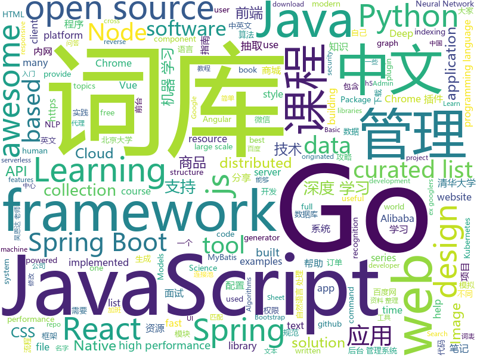

# 2019-04-10
See what the GitHub community is most excited about today.

## python
* [USTC-Course](https://github.com/USTC-Resource/USTC-Course)(**436 stars today**): ❤️中国科学技术大学课程资源
* [ChromeAppHeroes](https://github.com/zhaoolee/ChromeAppHeroes)(**307 stars today**): 🌈Chrome插件英雄榜, 为优秀的Chrome插件写一本中文说明书, 让Chrome插件英雄们造福人类~ ChromePluginHeroes, Write a Chinese manual for the excellent Chrome plugin, let the Chrome plugin heroes benefit the human~
* [CheatSheetSeries](https://github.com/OWASP/CheatSheetSeries)(**261 stars today**): The OWASP Cheat Sheet Series was created to provide a concise collection of high value information on specific application security topics.
* [awesome-python-login-model](https://github.com/CriseLYJ/awesome-python-login-model)(**117 stars today**): 😮python模拟登陆一些大型网站，还有一些简单的爬虫，希望对你们有所帮助❤️，如果喜欢记得给个star哦🌟
* [FaceDetection-DSFD](https://github.com/TencentYoutuResearch/FaceDetection-DSFD)(**122 stars today**): 
* [ddgr](https://github.com/jarun/ddgr)(**119 stars today**): 🦆DuckDuckGo from the terminal
* [RandWireNN](https://github.com/seungwonpark/RandWireNN)(**101 stars today**): Implementation of: "Exploring Randomly Wired Neural Networks for Image Recognition"
* [Algorithm_Interview_Notes-Chinese](https://github.com/imhuay/Algorithm_Interview_Notes-Chinese)(**92 stars today**): 2018/2019/校招/春招/秋招/算法/机器学习(Machine Learning)/深度学习(Deep Learning)/自然语言处理(NLP)/C/C++/Python/面试笔记
* [models](https://github.com/tensorflow/models)(**71 stars today**): Models and examples built with TensorFlow
* [100-Days-Of-ML-Code](https://github.com/Avik-Jain/100-Days-Of-ML-Code)(**73 stars today**): 100 Days of ML Coding
* [pyts](https://github.com/johannfaouzi/pyts)(**85 stars today**): A Python package for time series transformation and classification
* [Python](https://github.com/TheAlgorithms/Python)(**74 stars today**): All Algorithms implemented in Python
* [awesome-python](https://github.com/vinta/awesome-python)(**74 stars today**): A curated list of awesome Python frameworks, libraries, software and resources
* [public-apis](https://github.com/toddmotto/public-apis)(**66 stars today**): A collective list of free APIs for use in software and web development.
* [keras](https://github.com/keras-team/keras)(**57 stars today**): Deep Learning for humans
* [google-images-download](https://github.com/hardikvasa/google-images-download)(**63 stars today**): Python Script to download hundreds of images from 'Google Images'. It is a ready-to-run code!
* [system-design-primer](https://github.com/donnemartin/system-design-primer)(**56 stars today**): Learn how to design large-scale systems. Prep for the system design interview. Includes Anki flashcards.
* [city-vein](https://github.com/96486d9b/city-vein)(**58 stars today**): Urban structure characterized by public lines
* [face_recognition](https://github.com/ageitgey/face_recognition)(**44 stars today**): The world's simplest facial recognition api for Python and the command line
* [CDCS](https://github.com/geekinglcq/CDCS)(**45 stars today**): Chinese Data Competitions' Solutions
* [funNLP](https://github.com/fighting41love/funNLP)(**44 stars today**): 中英文敏感词、语言检测、中外手机/电话归属地/运营商查询、名字推断性别、手机号抽取、身份证抽取、邮箱抽取、中日文人名库、中文缩写库、拆字词典、词汇情感值、停用词、反动词表、暴恐词表、繁简体转换、英文模拟中文发音、汪峰歌词生成器、职业名称词库、同义词库、反义词库、否定词库、汽车品牌词库、汽车零件词库、连续英文切割、各种中文词向量、公司名字大全、古诗词库、IT词库、财经词库、成语词库、地名词库、历史名人词库、诗词词库、医学词库、饮食词库、法律词库、汽车词库、动物词库、中文聊天语料、中文谣言数据、百度中文问答数据集、句子相似度匹配算法集合、bert资源、文本生成&摘要相关工具、cocoNLP信息抽取工具、国内电话号码正则匹配、清华大学XLORE:中英文跨语言百科知识图谱、清华大学人工智能技术…
* [bert](https://github.com/google-research/bert)(**45 stars today**): TensorFlow code and pre-trained models for BERT
* [scikit-learn](https://github.com/scikit-learn/scikit-learn)(**43 stars today**): scikit-learn: machine learning in Python
* [PyTorch-BigGraph](https://github.com/facebookresearch/PyTorch-BigGraph)(**43 stars today**): Software used for generating embeddings from large-scale graph-structured data.
* [you-get](https://github.com/soimort/you-get)(**48 stars today**): ⏬Dumb downloader that scrapes the web

## java
* [SpringAll](https://github.com/wuyouzhuguli/SpringAll)(**322 stars today**): 循序渐进，学习Spring Boot、Spring Boot & Shiro、Spring Cloud和Spring Security，博客Spring系列源码
* [JavaGuide](https://github.com/Snailclimb/JavaGuide)(**276 stars today**): 【Java学习+面试指南】 一份涵盖大部分Java程序员所需要掌握的核心知识。
* [advanced-java](https://github.com/doocs/advanced-java)(**168 stars today**): 😮互联网 Java 工程师进阶知识完全扫盲
* [ghidra](https://github.com/NationalSecurityAgency/ghidra)(**144 stars today**): Ghidra is a software reverse engineering (SRE) framework
* [seata](https://github.com/seata/seata)(**104 stars today**): 🔥Seata is an easy-to-use, high-performance, java based, open source distributed transaction solution.
* [mall](https://github.com/macrozheng/mall)(**99 stars today**): mall项目是一套电商系统，包括前台商城系统及后台管理系统，基于SpringBoot+MyBatis实现。 前台商城系统包含首页门户、商品推荐、商品搜索、商品展示、购物车、订单流程、会员中心、客户服务、帮助中心等模块。 后台管理系统包含商品管理、订单管理、会员管理、促销管理、运营管理、内容管理、统计报表、财务管理、权限管理、设置等模块。
* [token-core-android](https://github.com/hufengqisj111/token-core-android)(**93 stars today**): 
* [spring-boot-examples](https://github.com/ityouknow/spring-boot-examples)(**77 stars today**): about learning Spring Boot via examples. Spring Boot 教程、技术栈示例代码，快速简单上手教程。
* [spring-boot](https://github.com/spring-projects/spring-boot)(**68 stars today**): Spring Boot
* [tutorials](https://github.com/eugenp/tutorials)(**50 stars today**): The "REST With Spring" Course:
* [litemall](https://github.com/linlinjava/litemall)(**57 stars today**): 又一个小商城。litemall = Spring Boot后端 + Vue管理员前端 + 微信小程序用户前端
* [java-design-patterns](https://github.com/iluwatar/java-design-patterns)(**55 stars today**): Design patterns implemented in Java
* [elasticsearch](https://github.com/elastic/elasticsearch)(**51 stars today**): Open Source, Distributed, RESTful Search Engine
* [spring-framework](https://github.com/spring-projects/spring-framework)(**44 stars today**): Spring Framework
* [apollo](https://github.com/ctripcorp/apollo)(**45 stars today**): Apollo（阿波罗）是携程框架部门研发的分布式配置中心，能够集中化管理应用不同环境、不同集群的配置，配置修改后能够实时推送到应用端，并且具备规范的权限、流程治理等特性，适用于微服务配置管理场景。
* [cryptomator](https://github.com/cryptomator/cryptomator)(**47 stars today**): Multi-platform transparent client-side encryption of your files in the cloud
* [arthas](https://github.com/alibaba/arthas)(**44 stars today**): Alibaba Java Diagnostic Tool Arthas/Alibaba Java诊断利器Arthas
* [springboot-learning-example](https://github.com/JeffLi1993/springboot-learning-example)(**41 stars today**): spring boot 实践学习案例，是 spring boot 初学者及核心技术巩固的最佳实践。
* [druid](https://github.com/alibaba/druid)(**42 stars today**): 阿里巴巴数据库事业部出品，为监控而生的数据库连接池。阿里云Data Lake Analytics(https://www.aliyun.com/product/datalakeanalytics )、DRDS、TDDL 连接池powered by Druid
* [incubator-dubbo](https://github.com/apache/incubator-dubbo)(**40 stars today**): Apache Dubbo (incubating) is a high-performance, java based, open source RPC framework.
* [Build-an-AI-Startup-with-PyTorch](https://github.com/llSourcell/Build-an-AI-Startup-with-PyTorch)(**40 stars today**): test
* [spring-cloud-alibaba](https://github.com/spring-cloud-incubator/spring-cloud-alibaba)(**38 stars today**): Spring Cloud Alibaba provides a one-stop solution for application development for the distributed solutions of Alibaba middleware.
* [HanLP](https://github.com/hankcs/HanLP)(**34 stars today**): 自然语言处理 中文分词 词性标注 命名实体识别 依存句法分析 新词发现 关键词短语提取 自动摘要 文本分类聚类 拼音简繁
* [JCSprout](https://github.com/crossoverJie/JCSprout)(**32 stars today**): 👨‍🎓Java Core Sprout : basic, concurrent, algorithm
* [mybatis-dynamic-sql](https://github.com/mybatis/mybatis-dynamic-sql)(**34 stars today**): SQL Generator for MyBatis or Spring JDBC Templates

## unknown
* [955.WLB](https://github.com/formulahendry/955.WLB)(**611 stars today**): 955 不加班的公司名单
* [app-ideas](https://github.com/florinpop17/app-ideas)(**376 stars today**): A Collection of application ideas which can be used to improve your coding skills.
* [pumpkin-book](https://github.com/datawhalechina/pumpkin-book)(**337 stars today**): 《机器学习》（西瓜书）公式推导解析，在线阅读地址：https://datawhalechina.github.io/pumpkin-book
* [datascience](https://github.com/r0f1/datascience)(**301 stars today**): Curated list of Python resources for data science.
* [Awesome](https://github.com/Awesome-Windows/Awesome)(**298 stars today**): 💻An awesome & curated list of best applications and tools for Windows.
* [THU-CST-Cracker](https://github.com/Trinkle23897/THU-CST-Cracker)(**226 stars today**): 清华大学计算机系课程攻略 Guidance for courses in Department of Computer Science and Technology, Tsinghua University
* [996ICU](https://github.com/995icu/996ICU)(**219 stars today**): 996ICU 995ICU 工作996 生病ICU 加班不规范 亲人两行泪
* [CS-Notes](https://github.com/CyC2018/CS-Notes)(**197 stars today**): 📚技术面试必备基础知识
* [chinese-independent-developer](https://github.com/1c7/chinese-independent-developer)(**205 stars today**): 👩🏿‍💻👨🏾‍💻👩🏼‍💻👨🏽‍💻👩🏻‍💻中国独立开发者项目列表 -- 分享大家都在做什么
* [DeepLearning-500-questions](https://github.com/scutan90/DeepLearning-500-questions)(**166 stars today**): 深度学习500问，以问答形式对常用的概率知识、线性代数、机器学习、深度学习、计算机视觉等热点问题进行阐述，以帮助自己及有需要的读者。 全书分为18个章节，50余万字。由于水平有限，书中不妥之处恳请广大读者批评指正。 未完待续............ 如有意合作，联系scutjy2015@163.com 版权所有，违权必究 Tan 2018.06
* [996.Leave](https://github.com/623637646/996.Leave)(**160 stars today**): 逃离996
* [awesome](https://github.com/sindresorhus/awesome)(**140 stars today**): 😎Awesome lists about all kinds of interesting topics
* [xg2xg](https://github.com/jhuangtw-dev/xg2xg)(**135 stars today**): by ex-googlers, for ex-googlers - a lookup table of similar tech & services
* [Node.js-Troubleshooting-Guide](https://github.com/aliyun-node/Node.js-Troubleshooting-Guide)(**130 stars today**): Node.js 应用线上/线下故障、压测问题和性能调优指南手册（更新中...）
* [research_tao](https://github.com/zibuyu/research_tao)(**124 stars today**): NLP研究入门之道
* [TNFE-Weekly](https://github.com/Tnfe/TNFE-Weekly)(**114 stars today**): 每周为你提供高质量的关于小程序、h5等前端领域的文章和项目
* [You-Dont-Know-JS](https://github.com/getify/You-Dont-Know-JS)(**97 stars today**): A book series on JavaScript. @YDKJS on twitter.
* [gitignore](https://github.com/github/gitignore)(**76 stars today**): A collection of useful .gitignore templates
* [free-programming-books](https://github.com/EbookFoundation/free-programming-books)(**88 stars today**): 📚Freely available programming books
* [Daily-Interview-Question](https://github.com/Advanced-Frontend/Daily-Interview-Question)(**84 stars today**): 工作日每天一道前端大厂面试题，祝大家天天进步，一年后会看到不一样的自己。
* [weekly](https://github.com/ruanyf/weekly)(**77 stars today**): 技术分享周刊，每周五发布
* [TP1](https://github.com/OpenCyberTranslationProject/TP1)(**73 stars today**): Linux Basics for Hackers
* [awesome-cross-platform-nodejs](https://github.com/bcoe/awesome-cross-platform-nodejs)(**74 stars today**): 👬A curated list of awesome developer tools for writing cross-platform Node.js code
* [Data-Science--Cheat-Sheet](https://github.com/abhat222/Data-Science--Cheat-Sheet)(**54 stars today**): Cheat Sheets
* [everyone-can-use-english](https://github.com/xiaolai/everyone-can-use-english)(**58 stars today**): 人人都能用英语

## javascript
* [libpku](https://github.com/lib-pku/libpku)(**4,381 stars today**): 北京大学课程资料整理
* [Awesome-Design-Tools](https://github.com/LisaDziuba/Awesome-Design-Tools)(**453 stars today**): The best design tools for everything👉
* [yapi](https://github.com/YMFE/yapi)(**256 stars today**): YApi 是一个可本地部署的、打通前后端及QA的、可视化的接口管理平台
* [Motrix](https://github.com/agalwood/Motrix)(**176 stars today**): A full-featured download manager.
* [vue](https://github.com/vuejs/vue)(**138 stars today**): 🖖Vue.js is a progressive, incrementally-adoptable JavaScript framework for building UI on the web.
* [You-Dont-Need-jQuery](https://github.com/nefe/You-Dont-Need-jQuery)(**133 stars today**): Examples of how to do query, style, dom, ajax, event etc like jQuery with plain javascript.
* [react](https://github.com/facebook/react)(**99 stars today**): A declarative, efficient, and flexible JavaScript library for building user interfaces.
* [javascript-algorithms](https://github.com/trekhleb/javascript-algorithms)(**101 stars today**): 📝Algorithms and data structures implemented in JavaScript with explanations and links to further readings
* [webtorrent](https://github.com/webtorrent/webtorrent)(**105 stars today**): ⚡️Streaming torrent client for the web
* [RealtimeApp](https://github.com/serverless-components/RealtimeApp)(**94 stars today**): Deploy a serverless realtime app built on AWS Lambda using Serverless Components.
* [lazysizes](https://github.com/aFarkas/lazysizes)(**82 stars today**): High performance and SEO friendly lazy loader for images (responsive and normal), iframes and more, that detects any visibility changes triggered through user interaction, CSS or JavaScript without configuration.
* [create-react-app](https://github.com/facebook/create-react-app)(**69 stars today**): Set up a modern web app by running one command.
* [realworld](https://github.com/gothinkster/realworld)(**74 stars today**): "The mother of all demo apps" — Exemplary fullstack Medium.com clone powered by React, Angular, Node, Django, and many more🏅
* [30-seconds-of-code](https://github.com/30-seconds/30-seconds-of-code)(**74 stars today**): A curated collection of useful JavaScript snippets that you can understand in 30 seconds or less.
* [puppeteer](https://github.com/GoogleChrome/puppeteer)(**65 stars today**): Headless Chrome Node API
* [taro](https://github.com/NervJS/taro)(**63 stars today**): 多端统一开发框架，支持用 React 的开发方式编写一次代码，生成能运行在微信/百度/支付宝/字节跳动小程序、H5、React Native 等的应用。 https://taro.js.org/
* [ant-design-pro](https://github.com/ant-design/ant-design-pro)(**58 stars today**): 👨🏻‍💻👩🏻‍💻 Use Ant Design like a Pro!
* [kepler.gl](https://github.com/uber/kepler.gl)(**64 stars today**): 
* [formol](https://github.com/Kozea/formol)(**65 stars today**): An opiniated react form framework.
* [baiduyun](https://github.com/syhyz1990/baiduyun)(**62 stars today**): 油猴脚本 直接下载百度网盘和百度网盘分享的文件,直链下载超级加速
* [axios](https://github.com/axios/axios)(**57 stars today**): Promise based HTTP client for the browser and node.js
* [bootstrap](https://github.com/twbs/bootstrap)(**43 stars today**): The most popular HTML, CSS, and JavaScript framework for developing responsive, mobile first projects on the web.
* [storybook](https://github.com/storybooks/storybook)(**56 stars today**): UI component dev & test: React, Vue, Angular, React Native, Ember & more!
* [three.js](https://github.com/mrdoob/three.js)(**45 stars today**): JavaScript 3D library.
* [node](https://github.com/nodejs/node)(**51 stars today**): Node.js JavaScript runtime✨🐢🚀✨

## html
* [zju-icicles](https://github.com/QSCTech/zju-icicles)(**1,089 stars today**): 浙江大学课程攻略共享计划
* [public-sans](https://github.com/uswds/public-sans)(**1,158 stars today**): A strong, neutral, principles-driven, open-source typeface for text or display
* [nndl.github.io](https://github.com/nndl/nndl.github.io)(**1,034 stars today**): 《神经网络与深度学习》 Neural Network and Deep Learning
* [water.css](https://github.com/kognise/water.css)(**350 stars today**): A just-add-css collection of styles to make simple websites just a little nicer
* [lib-pku.github.io](https://github.com/lib-pku/lib-pku.github.io)(**65 stars today**): 北京大学课程资料整理
* [dropcss](https://github.com/leeoniya/dropcss)(**50 stars today**): An exceptionally fast, thorough and tiny unused-CSS cleaner
* [Coursera-ML-AndrewNg-Notes](https://github.com/fengdu78/Coursera-ML-AndrewNg-Notes)(**32 stars today**): 吴恩达老师的机器学习课程个人笔记
* [AdminLTE](https://github.com/ColorlibHQ/AdminLTE)(**29 stars today**): AdminLTE - Free Premium Admin control Panel Theme Based On Bootstrap 3.x
* [shopper](https://github.com/mckenziearts/shopper)(**34 stars today**): An eCommerce administration built with Laravel 5 for create online shop.
* [learn-awesome](https://github.com/learn-awesome/learn-awesome)(**29 stars today**): Curated lists of awesome learning resources on various topics across formats, tagged with difficulty level and estimated time.
* [deeplearning_ai_books](https://github.com/fengdu78/deeplearning_ai_books)(**22 stars today**): deeplearning.ai（吴恩达老师的深度学习课程笔记及资源）
* [pkweb](https://github.com/JackCrysler/pkweb)(**23 stars today**): 仿头脑王者对战答题应用----全栈开发
* [patchwork](https://github.com/jlord/patchwork)(****): All the Git-it Workshop completers!
* [styleguide](https://github.com/google/styleguide)(**16 stars today**): Style guides for Google-originated open-source projects
* [MSEdgeExplainers](https://github.com/MicrosoftEdge/MSEdgeExplainers)(**20 stars today**): Home for explainer documents originated by the Microsoft Edge team
* [DirectX-Specs](https://github.com/Microsoft/DirectX-Specs)(**20 stars today**): Engineering specs for DirectX features.
* [flutter-in-action](https://github.com/flutterchina/flutter-in-action)(**17 stars today**): 《Flutter实战》电子书
* [learning-area](https://github.com/mdn/learning-area)(**8 stars today**): Github repo for the MDN Learning Area.
* [JavaScript30](https://github.com/wesbos/JavaScript30)(**9 stars today**): 30 Day Vanilla JS Challenge
* [javascript-tutorial-en](https://github.com/iliakan/javascript-tutorial-en)(**13 stars today**): Modern JavaScript Tutorial
* [gentelella](https://github.com/ColorlibHQ/gentelella)(**12 stars today**): Free Bootstrap 3 Admin Template
* [Spoon-Knife](https://github.com/octocat/Spoon-Knife)(****): This repo is for demonstration purposes only.
* [lets-get-arrested](https://github.com/hamukazu/lets-get-arrested)(**11 stars today**): This project is intended to protest against the police in Japan
* [personal-website](https://github.com/github/personal-website)(**11 stars today**): Code that'll help you kickstart a personal website that showcases your work as a software developer.
* [requests-html](https://github.com/kennethreitz/requests-html)(**14 stars today**): Pythonic HTML Parsing for Humans™

## go
* [bleve](https://github.com/blevesearch/bleve)(**173 stars today**): A modern text indexing library for go
* [the-way-to-go_ZH_CN](https://github.com/Unknwon/the-way-to-go_ZH_CN)(**159 stars today**): 《The Way to Go》中文译本，中文正式名《Go 入门指南》
* [gfile](https://github.com/Antonito/gfile)(**118 stars today**): Direct file transfer over WebRTC
* [free-gophers-pack](https://github.com/MariaLetta/free-gophers-pack)(**114 stars today**): ✨This pack of 100+ gopher pictures and elements will help you to build own design of almost anything related to Go Programming Language: presentations, posts in blogs or social media, courses, videos and many, many more.
* [blast](https://github.com/mosuka/blast)(**96 stars today**): Blast is a full text search and indexing server, written in Go, built on top of Bleve.
* [awesome-go](https://github.com/avelino/awesome-go)(**85 stars today**): A curated list of awesome Go frameworks, libraries and software
* [go](https://github.com/golang/go)(**79 stars today**): The Go programming language
* [popeye](https://github.com/derailed/popeye)(**72 stars today**): 🧭 A Kubernetes cluster resource sanitizer
* [kubernetes](https://github.com/kubernetes/kubernetes)(**58 stars today**): Production-Grade Container Scheduling and Management
* [v](https://github.com/vlang/v)(**68 stars today**): Simple, fast, safe, compiled language for creating maintainable software. Supports translation from C/C++.
* [nps](https://github.com/cnlh/nps)(**62 stars today**): 一款轻量级、功能强大的内网穿透代理服务器。支持tcp、udp流量转发，支持内网http代理、内网socks5代理，同时支持snappy压缩、站点保护、加密传输、多路复用、header修改等。支持web图形化管理，集成多用户模式。
* [cockroach](https://github.com/cockroachdb/cockroach)(**50 stars today**): CockroachDB - the open source, cloud-native SQL database.
* [fyne](https://github.com/fyne-io/fyne)(**50 stars today**): Cross platform GUI in Go based on Material Design
* [hugo](https://github.com/gohugoio/hugo)(**46 stars today**): The world’s fastest framework for building websites.
* [syncthing](https://github.com/syncthing/syncthing)(**45 stars today**): Open Source Continuous File Synchronization
* [frp](https://github.com/fatedier/frp)(**39 stars today**): A fast reverse proxy to help you expose a local server behind a NAT or firewall to the internet.
* [goweight](https://github.com/jondot/goweight)(**42 stars today**): A tool to analyze and troubleshoot a Go binary size.
* [algernon](https://github.com/xyproto/algernon)(**42 stars today**): 🎩Small self-contained pure-Go web server with Lua, Markdown, HTTP/2, QUIC, Redis and PostgreSQL support
* [gin](https://github.com/gin-gonic/gin)(**41 stars today**): Gin is a HTTP web framework written in Go (Golang). It features a Martini-like API with much better performance -- up to 40 times faster. If you need smashing performance, get yourself some Gin.
* [beego](https://github.com/astaxie/beego)(**36 stars today**): beego is an open-source, high-performance web framework for the Go programming language.
* [hey](https://github.com/rakyll/hey)(**35 stars today**): HTTP load generator, ApacheBench (ab) replacement, formerly known as rakyll/boom
* [red](https://github.com/antonmedv/red)(**35 stars today**): Terminal log analysis tools
* [helm](https://github.com/helm/helm)(**30 stars today**): The Kubernetes Package Manager
* [beam](https://github.com/eBay/beam)(**33 stars today**): A distributed knowledge graph store
* [traefik](https://github.com/containous/traefik)(**32 stars today**): The Cloud Native Edge Router

## WordCloud

