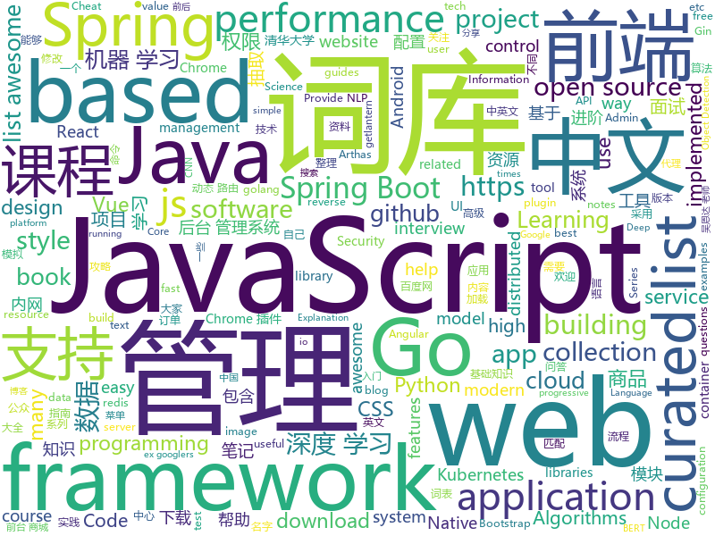

# 2019-04-12
See what the GitHub community is most excited about today.

## python
* [eht-imaging](https://github.com/achael/eht-imaging)(**963 stars today**): Imaging, analysis, and simulation software for radio interferometry
* [ChromeAppHeroes](https://github.com/zhaoolee/ChromeAppHeroes)(**423 stars today**): 🌈Chrome插件英雄榜, 为优秀的Chrome插件写一本中文说明书, 让Chrome插件英雄们造福人类~ ChromePluginHeroes, Write a Chinese manual for the excellent Chrome plugin, let the Chrome plugin heroes benefit the human~
* [USTC-Course](https://github.com/USTC-Resource/USTC-Course)(**335 stars today**): ❤️中国科学技术大学课程资源
* [Algorithm_Interview_Notes-Chinese](https://github.com/imhuay/Algorithm_Interview_Notes-Chinese)(**262 stars today**): 2018/2019/校招/春招/秋招/算法/机器学习(Machine Learning)/深度学习(Deep Learning)/自然语言处理(NLP)/C/C++/Python/面试笔记
* [jumpcutter](https://github.com/carykh/jumpcutter)(**256 stars today**): Automatically edits vidx. Explanation here: https://www.youtube.com/watch?v=DQ8orIurGxw
* [FaceDetection-DSFD](https://github.com/TencentYoutuResearch/FaceDetection-DSFD)(**237 stars today**): 
* [Python](https://github.com/TheAlgorithms/Python)(**204 stars today**): All Algorithms implemented in Python
* [models](https://github.com/tensorflow/models)(**72 stars today**): Models and examples built with TensorFlow
* [awesome-python-login-model](https://github.com/CriseLYJ/awesome-python-login-model)(**88 stars today**): 😮python模拟登陆一些大型网站，还有一些简单的爬虫，希望对你们有所帮助❤️，如果喜欢记得给个star哦🌟
* [system-design-primer](https://github.com/donnemartin/system-design-primer)(**80 stars today**): Learn how to design large-scale systems. Prep for the system design interview. Includes Anki flashcards.
* [OUCML](https://github.com/OUCMachineLearning/OUCML)(**75 stars today**): 
* [pytorch_GAN_zoo](https://github.com/facebookresearch/pytorch_GAN_zoo)(**78 stars today**): A mix of GAN implementations including progressive growing
* [CheatSheetSeries](https://github.com/OWASP/CheatSheetSeries)(**71 stars today**): The OWASP Cheat Sheet Series was created to provide a concise collection of high value information on specific application security topics.
* [public-apis](https://github.com/toddmotto/public-apis)(**67 stars today**): A collective list of free APIs for use in software and web development.
* [awesome-python](https://github.com/vinta/awesome-python)(**63 stars today**): A curated list of awesome Python frameworks, libraries, software and resources
* [100-Days-Of-ML-Code](https://github.com/Avik-Jain/100-Days-Of-ML-Code)(**50 stars today**): 100 Days of ML Coding
* [faceswap](https://github.com/deepfakes/faceswap)(**53 stars today**): Non official project based on original /r/Deepfakes thread. Many thanks to him!
* [automl-gs](https://github.com/minimaxir/automl-gs)(**54 stars today**): Provide an input CSV and a target field to predict, generate a model + code to run it.
* [django](https://github.com/django/django)(**44 stars today**): The Web framework for perfectionists with deadlines.
* [Stereo-RCNN](https://github.com/HKUST-Aerial-Robotics/Stereo-RCNN)(**50 stars today**): Code for 'Stereo R-CNN based 3D Object Detection for Autonomous Driving' (CVPR 2019)
* [funNLP](https://github.com/fighting41love/funNLP)(**46 stars today**): 中英文敏感词、语言检测、中外手机/电话归属地/运营商查询、名字推断性别、手机号抽取、身份证抽取、邮箱抽取、中日文人名库、中文缩写库、拆字词典、词汇情感值、停用词、反动词表、暴恐词表、繁简体转换、英文模拟中文发音、汪峰歌词生成器、职业名称词库、同义词库、反义词库、否定词库、汽车品牌词库、汽车零件词库、连续英文切割、各种中文词向量、公司名字大全、古诗词库、IT词库、财经词库、成语词库、地名词库、历史名人词库、诗词词库、医学词库、饮食词库、法律词库、汽车词库、动物词库、中文聊天语料、中文谣言数据、百度中文问答数据集、句子相似度匹配算法集合、bert资源、文本生成&摘要相关工具、cocoNLP信息抽取工具、国内电话号码正则匹配、清华大学XLORE:中英文跨语言百科知识图谱、清华大学人工智能技术…
* [you-get](https://github.com/soimort/you-get)(**47 stars today**): ⏬Dumb downloader that scrapes the web
* [keras](https://github.com/keras-team/keras)(**40 stars today**): Deep Learning for humans
* [Mask_RCNN](https://github.com/matterport/Mask_RCNN)(**45 stars today**): Mask R-CNN for object detection and instance segmentation on Keras and TensorFlow
* [bert](https://github.com/google-research/bert)(**39 stars today**): TensorFlow code and pre-trained models for BERT

## java
* [JavaGuide](https://github.com/Snailclimb/JavaGuide)(**242 stars today**): 【Java学习+面试指南】 一份涵盖大部分Java程序员所需要掌握的核心知识。
* [advanced-java](https://github.com/doocs/advanced-java)(**165 stars today**): 😮互联网 Java 工程师进阶知识完全扫盲
* [ghidra](https://github.com/NationalSecurityAgency/ghidra)(**147 stars today**): Ghidra is a software reverse engineering (SRE) framework
* [SpringAll](https://github.com/wuyouzhuguli/SpringAll)(**98 stars today**): 循序渐进，学习Spring Boot、Spring Boot & Shiro、Spring Cloud和Spring Security，博客Spring系列源码
* [mall](https://github.com/macrozheng/mall)(**88 stars today**): mall项目是一套电商系统，包括前台商城系统及后台管理系统，基于SpringBoot+MyBatis实现。 前台商城系统包含首页门户、商品推荐、商品搜索、商品展示、购物车、订单流程、会员中心、客户服务、帮助中心等模块。 后台管理系统包含商品管理、订单管理、会员管理、促销管理、运营管理、内容管理、统计报表、财务管理、权限管理、设置等模块。
* [Gloading](https://github.com/luckybilly/Gloading)(**85 stars today**): Show global loading status view in a low coupling way for Android App(深度解耦Android App中全局加载中、加载失败及空数据视图)
* [spring-framework](https://github.com/spring-projects/spring-framework)(**64 stars today**): Spring Framework
* [eladmin](https://github.com/elunez/eladmin)(**69 stars today**): 项目基于 Spring Boot 2.1.0 、 Jpa、 Spring Security、redis、Vue的前后端分离的后台管理系统，项目采用分模块开发方式， 权限控制采用 RBAC（Role-Based Access Control，基于角色的访问控制），支持数据字典与数据权限管理，前端菜单支持动态路由前端菜单支持动态路由，反馈交流群：891137268
* [tutorials](https://github.com/eugenp/tutorials)(**44 stars today**): The "REST With Spring" Course:
* [spring-boot](https://github.com/spring-projects/spring-boot)(**58 stars today**): Spring Boot
* [java-design-patterns](https://github.com/iluwatar/java-design-patterns)(**58 stars today**): Design patterns implemented in Java
* [elasticsearch](https://github.com/elastic/elasticsearch)(**49 stars today**): Open Source, Distributed, RESTful Search Engine
* [SpringBoot-Learning](https://github.com/dyc87112/SpringBoot-Learning)(**47 stars today**): Spring Boot基础教程，Spring Boot 2.x版本连载中！！！
* [incubator-skywalking](https://github.com/apache/incubator-skywalking)(**53 stars today**): APM, Application Performance Monitoring System
* [nacos](https://github.com/alibaba/nacos)(**48 stars today**): an easy-to-use dynamic service discovery, configuration and service management platform for building cloud native applications.
* [seata](https://github.com/seata/seata)(**47 stars today**): 🔥Seata is an easy-to-use, high-performance, java based, open source distributed transaction solution.
* [DiscreteSlider](https://github.com/hearsilent/DiscreteSlider)(**54 stars today**): A slider (SeekBar) with amazing value label.
* [incubator-dubbo](https://github.com/apache/incubator-dubbo)(**39 stars today**): Apache Dubbo (incubating) is a high-performance, java based, open source RPC framework.
* [Java](https://github.com/TheAlgorithms/Java)(**41 stars today**): All Algorithms implemented in Java
* [NettyChat](https://github.com/FreddyChen/NettyChat)(**42 stars today**): First commit.
* [apollo](https://github.com/ctripcorp/apollo)(**37 stars today**): Apollo（阿波罗）是携程框架部门研发的分布式配置中心，能够集中化管理应用不同环境、不同集群的配置，配置修改后能够实时推送到应用端，并且具备规范的权限、流程治理等特性，适用于微服务配置管理场景。
* [springboot-learning-example](https://github.com/JeffLi1993/springboot-learning-example)(**40 stars today**): spring boot 实践学习案例，是 spring boot 初学者及核心技术巩固的最佳实践。
* [guava](https://github.com/google/guava)(**37 stars today**): Google core libraries for Java
* [arthas](https://github.com/alibaba/arthas)(**38 stars today**): Alibaba Java Diagnostic Tool Arthas/Alibaba Java诊断利器Arthas
* [JCSprout](https://github.com/crossoverJie/JCSprout)(**34 stars today**): 👨‍🎓Java Core Sprout : basic, concurrent, algorithm

## unknown
* [955.WLB](https://github.com/formulahendry/955.WLB)(**291 stars today**): 955 不加班的公司名单
* [pumpkin-book](https://github.com/datawhalechina/pumpkin-book)(**206 stars today**): 《机器学习》（西瓜书）公式推导解析，在线阅读地址：https://datawhalechina.github.io/pumpkin-book
* [xg2xg](https://github.com/jhuangtw-dev/xg2xg)(**224 stars today**): by ex-googlers, for ex-googlers - a lookup table of similar tech & services
* [chinese-independent-developer](https://github.com/1c7/chinese-independent-developer)(**202 stars today**): 👩🏿‍💻👨🏾‍💻👩🏼‍💻👨🏽‍💻👩🏻‍💻中国独立开发者项目列表 -- 分享大家都在做什么
* [awesome-programming-books](https://github.com/majikarp/awesome-programming-books)(**208 stars today**): 📚A curated list of awesome programming books
* [Awesome](https://github.com/Awesome-Windows/Awesome)(**203 stars today**): 💻An awesome & curated list of best applications and tools for Windows.
* [app-ideas](https://github.com/florinpop17/app-ideas)(**146 stars today**): A Collection of application ideas which can be used to improve your coding skills.
* [research_tao](https://github.com/zibuyu/research_tao)(**134 stars today**): NLP研究入门之道
* [CS-Notes](https://github.com/CyC2018/CS-Notes)(**116 stars today**): 📚技术面试必备基础知识
* [DeepLearning-500-questions](https://github.com/scutan90/DeepLearning-500-questions)(**102 stars today**): 深度学习500问，以问答形式对常用的概率知识、线性代数、机器学习、深度学习、计算机视觉等热点问题进行阐述，以帮助自己及有需要的读者。 全书分为18个章节，50余万字。由于水平有限，书中不妥之处恳请广大读者批评指正。 未完待续............ 如有意合作，联系scutjy2015@163.com 版权所有，违权必究 Tan 2018.06
* [algorithms](https://github.com/jeffgerickson/algorithms)(**108 stars today**): Bug-tracking for Jeff's algorithms book, notes, etc.
* [datascience](https://github.com/r0f1/datascience)(**108 stars today**): Curated list of Python resources for data science.
* [You-Dont-Know-JS](https://github.com/getify/You-Dont-Know-JS)(**101 stars today**): A book series on JavaScript. @YDKJS on twitter.
* [awesome](https://github.com/sindresorhus/awesome)(**94 stars today**): 😎Awesome lists about all kinds of interesting topics
* [gitignore](https://github.com/github/gitignore)(**68 stars today**): A collection of useful .gitignore templates
* [Blog](https://github.com/chencl1986/Blog)(**85 stars today**): Welcome to lee's blog.
* [996.Leave](https://github.com/623637646/996.Leave)(**81 stars today**): 逃离996
* [free-programming-books](https://github.com/EbookFoundation/free-programming-books)(**75 stars today**): 📚Freely available programming books
* [Daily-Interview-Question](https://github.com/Advanced-Frontend/Daily-Interview-Question)(**73 stars today**): 工作日每天一道前端大厂面试题，祝大家天天进步，一年后会看到不一样的自己。
* [Data-Science--Cheat-Sheet](https://github.com/abhat222/Data-Science--Cheat-Sheet)(**59 stars today**): Cheat Sheets
* [Cobalt_Strike_wiki](https://github.com/aleenzz/Cobalt_Strike_wiki)(**55 stars today**): Cobalt Strike系列
* [THU-CST-Cracker](https://github.com/Trinkle23897/THU-CST-Cracker)(**49 stars today**): 清华大学计算机系课程攻略 Guidance for courses in Department of Computer Science and Technology, Tsinghua University
* [awesome-vue](https://github.com/vuejs/awesome-vue)(**48 stars today**): 🎉A curated list of awesome things related to Vue.js
* [blog](https://github.com/yygmind/blog)(**51 stars today**): 我是木易杨，公众号「高级前端进阶」作者，跟着我每周重点攻克一个前端面试重难点。接下来让我带你走进高级前端的世界，在进阶的路上，共勉！
* [Awesome-Android-Interview](https://github.com/JsonChao/Awesome-Android-Interview)(**46 stars today**): 🔥A awesome android expert interview questions and answers（continuous updating ...）

## javascript
* [libpku](https://github.com/lib-pku/libpku)(**1,122 stars today**): 贵校课程资料民间整理
* [Awesome-Design-Tools](https://github.com/LisaDziuba/Awesome-Design-Tools)(**297 stars today**): The best design tools for everything👉
* [awesome-stacks](https://github.com/stackshareio/awesome-stacks)(**217 stars today**): A curated list of tech stacks for building different applications & features
* [vue](https://github.com/vuejs/vue)(**186 stars today**): 🖖Vue.js is a progressive, incrementally-adoptable JavaScript framework for building UI on the web.
* [crop-github-images-cli](https://github.com/mathdroid/crop-github-images-cli)(**150 stars today**): Crop image/gif into swag for your Github profile
* [react](https://github.com/facebook/react)(**116 stars today**): A declarative, efficient, and flexible JavaScript library for building user interfaces.
* [Motrix](https://github.com/agalwood/Motrix)(**100 stars today**): A full-featured download manager.
* [realworld](https://github.com/gothinkster/realworld)(**79 stars today**): "The mother of all demo apps" — Exemplary fullstack Medium.com clone powered by React, Angular, Node, Django, and many more🏅
* [30-seconds-of-code](https://github.com/30-seconds/30-seconds-of-code)(**72 stars today**): A curated collection of useful JavaScript snippets that you can understand in 30 seconds or less.
* [javascript-algorithms](https://github.com/trekhleb/javascript-algorithms)(**66 stars today**): 📝Algorithms and data structures implemented in JavaScript with explanations and links to further readings
* [Blog](https://github.com/ljianshu/Blog)(**72 stars today**): 关注基础知识，打造优质前端博客，欢迎关注我的公众号：前端工匠
* [puppeteer](https://github.com/GoogleChrome/puppeteer)(**68 stars today**): Headless Chrome Node API
* [yapi](https://github.com/YMFE/yapi)(**67 stars today**): YApi 是一个可本地部署的、打通前后端及QA的、可视化的接口管理平台
* [You-Dont-Need-jQuery](https://github.com/nefe/You-Dont-Need-jQuery)(**64 stars today**): Examples of how to do query, style, dom, ajax, event etc like jQuery with plain javascript.
* [cube.js](https://github.com/statsbotco/cube.js)(**63 stars today**): 📊Cube.js - Open Source Analytics Framework
* [create-react-app](https://github.com/facebook/create-react-app)(**52 stars today**): Set up a modern web app by running one command.
* [lazysizes](https://github.com/aFarkas/lazysizes)(**56 stars today**): High performance and SEO friendly lazy loader for images (responsive and normal), iframes and more, that detects any visibility changes triggered through user interaction, CSS or JavaScript without configuration.
* [baiduyun](https://github.com/syhyz1990/baiduyun)(**55 stars today**): 油猴脚本 直接下载百度网盘和百度网盘分享的文件,直链下载超级加速
* [javascript](https://github.com/airbnb/javascript)(**51 stars today**): JavaScript Style Guide
* [storybook](https://github.com/storybooks/storybook)(**50 stars today**): UI component dev & test: React, Vue, Angular, React Native, Ember & more!
* [axios](https://github.com/axios/axios)(**50 stars today**): Promise based HTTP client for the browser and node.js
* [zustand](https://github.com/drcmda/zustand)(**52 stars today**): 🐻Bear necessities for state management in React
* [bootstrap](https://github.com/twbs/bootstrap)(**38 stars today**): The most popular HTML, CSS, and JavaScript framework for developing responsive, mobile first projects on the web.
* [x-spreadsheet](https://github.com/myliang/x-spreadsheet)(**46 stars today**): A web-based JavaScript（canvas） spreadsheet
* [node](https://github.com/nodejs/node)(**40 stars today**): Node.js JavaScript runtime✨🐢🚀✨

## html
* [zju-icicles](https://github.com/QSCTech/zju-icicles)(**604 stars today**): 浙江大学课程攻略共享计划
* [nndl.github.io](https://github.com/nndl/nndl.github.io)(**321 stars today**): 《神经网络与深度学习》 Neural Network and Deep Learning
* [linux-command](https://github.com/jaywcjlove/linux-command)(**183 stars today**): Linux命令大全搜索工具，内容包含Linux命令手册、详解、学习、搜集。https://git.io/linux
* [public-sans](https://github.com/uswds/public-sans)(**171 stars today**): A strong, neutral, principles-driven, open-source typeface for text or display
* [mlh-hackathon-flask-starter](https://github.com/MLH/mlh-hackathon-flask-starter)(**77 stars today**): Hackathon starter project for Flask applications
* [water.css](https://github.com/kognise/water.css)(**83 stars today**): A just-add-css collection of styles to make simple websites just a little nicer
* [Coursera-ML-AndrewNg-Notes](https://github.com/fengdu78/Coursera-ML-AndrewNg-Notes)(**28 stars today**): 吴恩达老师的机器学习课程个人笔记
* [AdminLTE](https://github.com/ColorlibHQ/AdminLTE)(**27 stars today**): AdminLTE - Free Premium Admin control Panel Theme Based On Bootstrap 3.x
* [dropcss](https://github.com/leeoniya/dropcss)(**29 stars today**): An exceptionally fast, thorough and tiny unused-CSS cleaner
* [lib-pku.github.io](https://github.com/lib-pku/lib-pku.github.io)(**25 stars today**): 北京大学课程资料整理
* [personal-website](https://github.com/github/personal-website)(**13 stars today**): Code that'll help you kickstart a personal website that showcases your work as a software developer.
* [JavaScript30](https://github.com/wesbos/JavaScript30)(**15 stars today**): 30 Day Vanilla JS Challenge
* [BilibliSource](https://github.com/JokerJohn/BilibliSource)(**21 stars today**): B站视频部分课件
* [styleguide](https://github.com/google/styleguide)(**19 stars today**): Style guides for Google-originated open-source projects
* [javascript-tutorial-en](https://github.com/iliakan/javascript-tutorial-en)(**20 stars today**): Modern JavaScript Tutorial
* [deeplearning_ai_books](https://github.com/fengdu78/deeplearning_ai_books)(**19 stars today**): deeplearning.ai（吴恩达老师的深度学习课程笔记及资源）
* [Front-end-Developer-Interview-Questions](https://github.com/h5bp/Front-end-Developer-Interview-Questions)(**19 stars today**): A list of helpful front-end related questions you can use to interview potential candidates, test yourself or completely ignore.
* [Spoon-Knife](https://github.com/octocat/Spoon-Knife)(****): This repo is for demonstration purposes only.
* [javascript-tutorial-ru](https://github.com/javascriptru/javascript-tutorial-ru)(**11 stars today**): Современный учебник Javascript
* [gentelella](https://github.com/ColorlibHQ/gentelella)(**14 stars today**): Free Bootstrap 3 Admin Template
* [usa-style-guides](https://github.com/palewire/usa-style-guides)(**15 stars today**): U.S. government style guides acquired via the Freedom of Information Act
* [cs231n.github.io](https://github.com/cs231n/cs231n.github.io)(**12 stars today**): Public facing notes page
* [DirectX-Specs](https://github.com/Microsoft/DirectX-Specs)(**13 stars today**): Engineering specs for DirectX features.
* [elasticsearch-definitive-guide](https://github.com/elasticsearch-cn/elasticsearch-definitive-guide)(**13 stars today**): 欢迎加QQ群：109764489，贡献力量！
* [portainer](https://github.com/portainer/portainer)(**13 stars today**): Simple management UI for Docker

## go
* [go](https://github.com/golang/go)(**88 stars today**): The Go programming language
* [the-way-to-go_ZH_CN](https://github.com/Unknwon/the-way-to-go_ZH_CN)(**69 stars today**): 《The Way to Go》中文译本，中文正式名《Go 入门指南》
* [kubernetes](https://github.com/kubernetes/kubernetes)(**54 stars today**): Production-Grade Container Scheduling and Management
* [frp](https://github.com/fatedier/frp)(**57 stars today**): A fast reverse proxy to help you expose a local server behind a NAT or firewall to the internet.
* [awesome-go](https://github.com/avelino/awesome-go)(**50 stars today**): A curated list of awesome Go frameworks, libraries and software
* [cfs](https://github.com/chubaofs/cfs)(**49 stars today**): a distributed file system with scalability and consistency
* [istio](https://github.com/istio/istio)(**45 stars today**): Connect, secure, control, and observe services.
* [free-gophers-pack](https://github.com/MariaLetta/free-gophers-pack)(**46 stars today**): ✨This pack of 100+ gopher pictures and elements will help you to build own design of almost anything related to Go Programming Language: presentations, posts in blogs or social media, courses, videos and many, many more.
* [build-web-application-with-golang](https://github.com/astaxie/build-web-application-with-golang)(**41 stars today**): A golang ebook intro how to build a web with golang
* [gofumpt](https://github.com/mvdan/gofumpt)(**44 stars today**): gofmt, the way it should be pronounced
* [cortex](https://github.com/cortexlabs/cortex)(**42 stars today**): Machine learning infrastructure platform for developers
* [bleve](https://github.com/blevesearch/bleve)(**40 stars today**): A modern text indexing library for go
* [handshake](https://github.com/nomasters/handshake)(**40 stars today**): a peculiar chat app for strange times
* [lantern](https://github.com/getlantern/lantern)(**36 stars today**): 🔴蓝灯最新版本下载 https://github.com/getlantern/download🔴Lantern Latest Download https://github.com/getlantern/download🔴
* [gin](https://github.com/gin-gonic/gin)(**35 stars today**): Gin is a HTTP web framework written in Go (Golang). It features a Martini-like API with much better performance -- up to 40 times faster. If you need smashing performance, get yourself some Gin.
* [algernon](https://github.com/xyproto/algernon)(**36 stars today**): 🎩Small self-contained pure-Go web server with Lua, Markdown, HTTP/2, QUIC, Redis and PostgreSQL support
* [traefik](https://github.com/containous/traefik)(**35 stars today**): The Cloud Native Edge Router
* [nps](https://github.com/cnlh/nps)(**33 stars today**): 一款轻量级、功能强大的内网穿透代理服务器。支持tcp、udp流量转发，支持内网http代理、内网socks5代理，同时支持snappy压缩、站点保护、加密传输、多路复用、header修改等。支持web图形化管理，集成多用户模式。
* [moby](https://github.com/moby/moby)(**30 stars today**): Moby Project - a collaborative project for the container ecosystem to assemble container-based systems
* [hugo](https://github.com/gohugoio/hugo)(**33 stars today**): The world’s fastest framework for building websites.
* [skaffold](https://github.com/GoogleContainerTools/skaffold)(**33 stars today**): Easy and Repeatable Kubernetes Development
* [vugu](https://github.com/vugu/vugu)(**33 stars today**): Vugu: A modern UI library for Go+WebAssembly (experimental)
* [popeye](https://github.com/derailed/popeye)(**32 stars today**): 🧭 A Kubernetes cluster resource sanitizer
* [cost-model](https://github.com/kubecost/cost-model)(**31 stars today**): Cross-cloud cost allocation models for workloads running on Kubernetes
* [flux](https://github.com/weaveworks/flux)(**30 stars today**): The GitOps Kubernetes operator

## WordCloud

