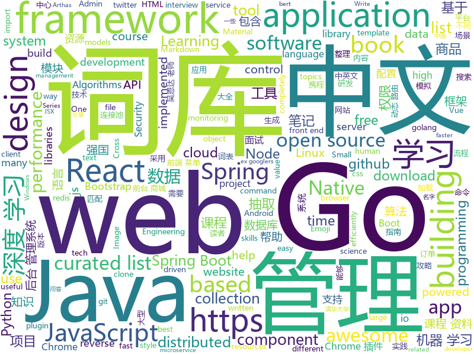

# 2019-04-13
See what the GitHub community is most excited about today.

## python
* [eht-imaging](https://github.com/achael/eht-imaging)(**1,423 stars today**): Imaging, analysis, and simulation software for radio interferometry
* [ChromeAppHeroes](https://github.com/zhaoolee/ChromeAppHeroes)(**314 stars today**): 🌈Chrome插件英雄榜, 为优秀的Chrome插件写一本中文说明书, 让Chrome插件英雄们造福人类~ ChromePluginHeroes, Write a Chinese manual for the excellent Chrome plugin, let the Chrome plugin heroes benefit the human~
* [Algorithm_Interview_Notes-Chinese](https://github.com/imhuay/Algorithm_Interview_Notes-Chinese)(**245 stars today**): 2018/2019/校招/春招/秋招/算法/机器学习(Machine Learning)/深度学习(Deep Learning)/自然语言处理(NLP)/C/C++/Python/面试笔记
* [USTC-Course](https://github.com/USTC-Resource/USTC-Course)(**244 stars today**): ❤️中国科学技术大学课程资源
* [jumpcutter](https://github.com/carykh/jumpcutter)(**225 stars today**): Automatically edits vidx. Explanation here: https://www.youtube.com/watch?v=DQ8orIurGxw
* [Python](https://github.com/TheAlgorithms/Python)(**197 stars today**): All Algorithms implemented in Python
* [edgedb](https://github.com/edgedb/edgedb)(**205 stars today**): The next generation object-relational database. A @MagicStack project.
* [FCOS](https://github.com/tianzhi0549/FCOS)(**175 stars today**): FCOS: Fully Convolutional One-Stage Object Detection
* [FaceDetection-DSFD](https://github.com/TencentYoutuResearch/FaceDetection-DSFD)(**124 stars today**): 
* [SPADE](https://github.com/NVlabs/SPADE)(**111 stars today**): Semantic Image Synthesis with SPADE
* [OUCML](https://github.com/OUCMachineLearning/OUCML)(**81 stars today**): 
* [models](https://github.com/tensorflow/models)(**62 stars today**): Models and examples built with TensorFlow
* [CheatSheetSeries](https://github.com/OWASP/CheatSheetSeries)(**71 stars today**): The OWASP Cheat Sheet Series was created to provide a concise collection of high value information on specific application security topics.
* [100-Days-Of-ML-Code](https://github.com/Avik-Jain/100-Days-Of-ML-Code)(**65 stars today**): 100 Days of ML Coding
* [system-design-primer](https://github.com/donnemartin/system-design-primer)(**59 stars today**): Learn how to design large-scale systems. Prep for the system design interview. Includes Anki flashcards.
* [awesome-python](https://github.com/vinta/awesome-python)(**56 stars today**): A curated list of awesome Python frameworks, libraries, software and resources
* [benchmarking-keras-pytorch](https://github.com/cgnorthcutt/benchmarking-keras-pytorch)(**62 stars today**): Reproducible Benchmarking of Keras and PyTorch Models
* [keras](https://github.com/keras-team/keras)(**48 stars today**): Deep Learning for humans
* [awesome-python-login-model](https://github.com/CriseLYJ/awesome-python-login-model)(**53 stars today**): 😮python模拟登陆一些大型网站，还有一些简单的爬虫，希望对你们有所帮助❤️，如果喜欢记得给个star哦🌟
* [bert](https://github.com/google-research/bert)(**49 stars today**): TensorFlow code and pre-trained models for BERT
* [Panda-Learning](https://github.com/Alivon/Panda-Learning)(**37 stars today**): 学习强国 xuexiqiangguo 全网最好用学习强国助手：Panda_Learning 萌萌的熊猫帮你搞定学习强国
* [public-apis](https://github.com/toddmotto/public-apis)(**49 stars today**): A collective list of free APIs for use in software and web development.
* [funNLP](https://github.com/fighting41love/funNLP)(**41 stars today**): 中英文敏感词、语言检测、中外手机/电话归属地/运营商查询、名字推断性别、手机号抽取、身份证抽取、邮箱抽取、中日文人名库、中文缩写库、拆字词典、词汇情感值、停用词、反动词表、暴恐词表、繁简体转换、英文模拟中文发音、汪峰歌词生成器、职业名称词库、同义词库、反义词库、否定词库、汽车品牌词库、汽车零件词库、连续英文切割、各种中文词向量、公司名字大全、古诗词库、IT词库、财经词库、成语词库、地名词库、历史名人词库、诗词词库、医学词库、饮食词库、法律词库、汽车词库、动物词库、中文聊天语料、中文谣言数据、百度中文问答数据集、句子相似度匹配算法集合、bert资源、文本生成&摘要相关工具、cocoNLP信息抽取工具、国内电话号码正则匹配、清华大学XLORE:中英文跨语言百科知识图谱、清华大学人工智能技术…
* [d2l-zh](https://github.com/d2l-ai/d2l-zh)(**48 stars today**): 《动手学深度学习》，英文版即伯克利深度学习（STAT 157，2019春）教材。面向中文读者、能运行、可讨论。
* [you-get](https://github.com/soimort/you-get)(**42 stars today**): ⏬Dumb downloader that scrapes the web

## java
* [JavaGuide](https://github.com/Snailclimb/JavaGuide)(**211 stars today**): 【Java学习+面试指南】 一份涵盖大部分Java程序员所需要掌握的核心知识。
* [advanced-java](https://github.com/doocs/advanced-java)(**145 stars today**): 😮互联网 Java 工程师进阶知识完全扫盲
* [ghidra](https://github.com/NationalSecurityAgency/ghidra)(**96 stars today**): Ghidra is a software reverse engineering (SRE) framework
* [mall](https://github.com/macrozheng/mall)(**76 stars today**): mall项目是一套电商系统，包括前台商城系统及后台管理系统，基于SpringBoot+MyBatis实现。 前台商城系统包含首页门户、商品推荐、商品搜索、商品展示、购物车、订单流程、会员中心、客户服务、帮助中心等模块。 后台管理系统包含商品管理、订单管理、会员管理、促销管理、运营管理、内容管理、统计报表、财务管理、权限管理、设置等模块。
* [SpringAll](https://github.com/wuyouzhuguli/SpringAll)(**77 stars today**): 循序渐进，学习Spring Boot、Spring Boot & Shiro、Spring Cloud和Spring Security，博客Spring系列源码
* [spring-framework](https://github.com/spring-projects/spring-framework)(**60 stars today**): Spring Framework
* [spring-boot](https://github.com/spring-projects/spring-boot)(**57 stars today**): Spring Boot
* [eladmin](https://github.com/elunez/eladmin)(**54 stars today**): 项目基于 Spring Boot 2.1.0 、 Jpa、 Spring Security、redis、Vue的前后端分离的后台管理系统，项目采用分模块开发方式， 权限控制采用 RBAC（Role-Based Access Control，基于角色的访问控制），支持数据字典与数据权限管理，前端菜单支持动态路由前端菜单支持动态路由，反馈交流群：891137268
* [java-design-patterns](https://github.com/iluwatar/java-design-patterns)(**49 stars today**): Design patterns implemented in Java
* [apollo](https://github.com/ctripcorp/apollo)(**50 stars today**): Apollo（阿波罗）是携程框架部门研发的分布式配置中心，能够集中化管理应用不同环境、不同集群的配置，配置修改后能够实时推送到应用端，并且具备规范的权限、流程治理等特性，适用于微服务配置管理场景。
* [tutorials](https://github.com/eugenp/tutorials)(**32 stars today**): The "REST With Spring" Course:
* [incubator-skywalking](https://github.com/apache/incubator-skywalking)(**50 stars today**): APM, Application Performance Monitoring System
* [arthas](https://github.com/alibaba/arthas)(**47 stars today**): Alibaba Java Diagnostic Tool Arthas/Alibaba Java诊断利器Arthas
* [seata](https://github.com/seata/seata)(**43 stars today**): 🔥Seata is an easy-to-use, high-performance, java based, open source distributed transaction solution.
* [ZXBlog](https://github.com/ZXZxin/ZXBlog)(**41 stars today**): 记录各种学习笔记(算法、Java、数据库、并发......)
* [elasticsearch](https://github.com/elastic/elasticsearch)(**40 stars today**): Open Source, Distributed, RESTful Search Engine
* [incubator-dubbo](https://github.com/apache/incubator-dubbo)(**36 stars today**): Apache Dubbo (incubating) is a high-performance, java based, open source RPC framework.
* [nacos](https://github.com/alibaba/nacos)(**37 stars today**): an easy-to-use dynamic service discovery, configuration and service management platform for building cloud native applications.
* [Java](https://github.com/TheAlgorithms/Java)(**38 stars today**): All Algorithms implemented in Java
* [springboot-learning-example](https://github.com/JeffLi1993/springboot-learning-example)(**35 stars today**): spring boot 实践学习案例，是 spring boot 初学者及核心技术巩固的最佳实践。
* [guava](https://github.com/google/guava)(**34 stars today**): Google core libraries for Java
* [Sentinel](https://github.com/alibaba/Sentinel)(**29 stars today**): A lightweight powerful flow control component enabling reliability and monitoring for microservices. (轻量级的流量控制、熔断降级 Java 库)
* [Gloading](https://github.com/luckybilly/Gloading)(**30 stars today**): Show global loading status view in a low coupling way for Android App(深度解耦Android App中全局加载中、加载失败及空数据视图)
* [druid](https://github.com/alibaba/druid)(**30 stars today**): 阿里巴巴数据库事业部出品，为监控而生的数据库连接池。阿里云Data Lake Analytics(https://www.aliyun.com/product/datalakeanalytics )、DRDS、TDDL 连接池powered by Druid
* [SpringBoot-Learning](https://github.com/dyc87112/SpringBoot-Learning)(**29 stars today**): Spring Boot基础教程，Spring Boot 2.x版本连载中！！！

## unknown
* [xg2xg](https://github.com/jhuangtw-dev/xg2xg)(**684 stars today**): by ex-googlers, for ex-googlers - a lookup table of similar tech & services
* [git-tips](https://github.com/521xueweihan/git-tips)(**341 stars today**): Git的奇技淫巧
* [955.WLB](https://github.com/formulahendry/955.WLB)(**242 stars today**): 955 不加班的公司名单
* [pumpkin-book](https://github.com/datawhalechina/pumpkin-book)(**212 stars today**): 《机器学习》（西瓜书）公式推导解析，在线阅读地址：https://datawhalechina.github.io/pumpkin-book
* [awesome-programming-books](https://github.com/majikarp/awesome-programming-books)(**205 stars today**): 📚A curated list of awesome programming books
* [Awesome](https://github.com/Awesome-Windows/Awesome)(**192 stars today**): 💻An awesome & curated list of best applications and tools for Windows.
* [CS-Notes](https://github.com/CyC2018/CS-Notes)(**129 stars today**): 📚技术面试必备基础知识
* [OI-wiki](https://github.com/24OI/OI-wiki)(**134 stars today**): 🌟Wiki for OI / ICPC. （某大型游戏线上攻略，内含炫酷算术魔法）
* [algorithms](https://github.com/jeffgerickson/algorithms)(**116 stars today**): Bug-tracking for Jeff's algorithms book, notes, etc.
* [You-Dont-Know-JS](https://github.com/getify/You-Dont-Know-JS)(**101 stars today**): A book series on JavaScript. @YDKJS on twitter.
* [SJTU-Courses](https://github.com/CoolPhilChen/SJTU-Courses)(**93 stars today**): 上海交通大学课程资料分享
* [chinese-independent-developer](https://github.com/1c7/chinese-independent-developer)(**105 stars today**): 👩🏿‍💻👨🏾‍💻👩🏼‍💻👨🏽‍💻👩🏻‍💻中国独立开发者项目列表 -- 分享大家都在做什么
* [DeepLearning-500-questions](https://github.com/scutan90/DeepLearning-500-questions)(**83 stars today**): 深度学习500问，以问答形式对常用的概率知识、线性代数、机器学习、深度学习、计算机视觉等热点问题进行阐述，以帮助自己及有需要的读者。 全书分为18个章节，50余万字。由于水平有限，书中不妥之处恳请广大读者批评指正。 未完待续............ 如有意合作，联系scutjy2015@163.com 版权所有，违权必究 Tan 2018.06
* [gitignore](https://github.com/github/gitignore)(**68 stars today**): A collection of useful .gitignore templates
* [awesome](https://github.com/sindresorhus/awesome)(**90 stars today**): 😎Awesome lists about all kinds of interesting topics
* [app-ideas](https://github.com/florinpop17/app-ideas)(**84 stars today**): A Collection of application ideas which can be used to improve your coding skills.
* [996.Leave](https://github.com/623637646/996.Leave)(**62 stars today**): 逃离996
* [RE-iOS-Apps](https://github.com/ivRodriguezCA/RE-iOS-Apps)(**60 stars today**): A completely free, open source and online course about Reverse Engineering iOS Applications.
* [perf-little-book](https://github.com/NanXiao/perf-little-book)(**53 stars today**): A small book which introduces Linux perf tool.
* [coding-interview-university](https://github.com/jwasham/coding-interview-university)(**43 stars today**): A complete computer science study plan to become a software engineer.
* [free-programming-books](https://github.com/EbookFoundation/free-programming-books)(**46 stars today**): 📚Freely available programming books
* [Data-Science--Cheat-Sheet](https://github.com/abhat222/Data-Science--Cheat-Sheet)(**37 stars today**): Cheat Sheets
* [crna-recipe](https://github.com/atolye15/crna-recipe)(**46 stars today**): Step-by-step guide to bootstrap a React Native app from scratch
* [react-typescript-cheatsheet](https://github.com/sw-yx/react-typescript-cheatsheet)(**44 stars today**): Cheatsheets for experienced React developers getting started with TypeScript
* [datascience](https://github.com/r0f1/datascience)(**40 stars today**): Curated list of Python resources for data science.

## javascript
* [libpku](https://github.com/lib-pku/libpku)(**604 stars today**): 贵校课程资料民间整理
* [awesome-stacks](https://github.com/stackshareio/awesome-stacks)(**327 stars today**): A curated list of tech stacks for building different applications & features
* [Awesome-Design-Tools](https://github.com/LisaDziuba/Awesome-Design-Tools)(**254 stars today**): The best design tools for everything👉
* [CRN](https://github.com/ctripcorp/CRN)(**228 stars today**): CRN是Ctrip React Native简称，由携程无线平台研发团队基于React Native框架优化，定制成稳定性和性能更佳、也更适合业务场景的跨平台开发框架。
* [dimport](https://github.com/lukeed/dimport)(**152 stars today**): Run ES Module syntax (`import`, `import()`, and `export`) in any browser – even IE!
* [vue](https://github.com/vuejs/vue)(**134 stars today**): 🖖Vue.js is a progressive, incrementally-adoptable JavaScript framework for building UI on the web.
* [twemoji](https://github.com/twitter/twemoji)(**118 stars today**): Emoji for everyone. https://twemoji.twitter.com/
* [react](https://github.com/facebook/react)(**91 stars today**): A declarative, efficient, and flexible JavaScript library for building user interfaces.
* [playroom](https://github.com/seek-oss/playroom)(**95 stars today**): Design with JSX, powered by your own component library.
* [Motrix](https://github.com/agalwood/Motrix)(**82 stars today**): A full-featured download manager.
* [30-seconds-of-code](https://github.com/30-seconds/30-seconds-of-code)(**77 stars today**): A curated collection of useful JavaScript snippets that you can understand in 30 seconds or less.
* [realworld](https://github.com/gothinkster/realworld)(**71 stars today**): "The mother of all demo apps" — Exemplary fullstack Medium.com clone powered by React, Angular, Node, Django, and many more🏅
* [axios](https://github.com/axios/axios)(**61 stars today**): Promise based HTTP client for the browser and node.js
* [react-window](https://github.com/bvaughn/react-window)(**63 stars today**): React components for efficiently rendering large lists and tabular data
* [bootstrap](https://github.com/twbs/bootstrap)(**47 stars today**): The most popular HTML, CSS, and JavaScript framework for developing responsive, mobile first projects on the web.
* [create-react-app](https://github.com/facebook/create-react-app)(**47 stars today**): Set up a modern web app by running one command.
* [puppeteer](https://github.com/GoogleChrome/puppeteer)(**55 stars today**): Headless Chrome Node API
* [crop-github-images-cli](https://github.com/mathdroid/crop-github-images-cli)(**55 stars today**): Crop image/gif into swag for your Github profile
* [three.js](https://github.com/mrdoob/three.js)(**47 stars today**): JavaScript 3D library.
* [mdx](https://github.com/mdx-js/mdx)(**52 stars today**): JSX in Markdown for ambitious projects
* [react-native](https://github.com/facebook/react-native)(**47 stars today**): A framework for building native apps with React.
* [yapi](https://github.com/YMFE/yapi)(**51 stars today**): YApi 是一个可本地部署的、打通前后端及QA的、可视化的接口管理平台
* [javascript](https://github.com/airbnb/javascript)(**47 stars today**): JavaScript Style Guide
* [material-ui](https://github.com/mui-org/material-ui)(**34 stars today**): React components for faster and easier web development. Build your own design system, or start with Material Design.
* [next.js](https://github.com/zeit/next.js)(**42 stars today**): The React Framework

## html
* [zju-icicles](https://github.com/QSCTech/zju-icicles)(**385 stars today**): 浙江大学课程攻略共享计划
* [nndl.github.io](https://github.com/nndl/nndl.github.io)(**330 stars today**): 《神经网络与深度学习》 Neural Network and Deep Learning
* [linux-command](https://github.com/jaywcjlove/linux-command)(**222 stars today**): Linux命令大全搜索工具，内容包含Linux命令手册、详解、学习、搜集。https://git.io/linux
* [public-sans](https://github.com/uswds/public-sans)(**104 stars today**): A strong, neutral, principles-driven, open-source typeface for text or display
* [water.css](https://github.com/kognise/water.css)(**100 stars today**): A just-add-css collection of styles to make simple websites just a little nicer
* [soyadi](https://github.com/efe/soyadi)(**69 stars today**): Mevlüt Uysal'ın ünlü algoritması.
* [mlh-hackathon-nodejs-starter](https://github.com/MLH/mlh-hackathon-nodejs-starter)(**57 stars today**): Hackathon starter project for Node.js applications
* [front-end-handbook-2019](https://github.com/FrontendMasters/front-end-handbook-2019)(**33 stars today**): [Book] 2019 edition of our front-end development handbook
* [StreamSaver.js](https://github.com/jimmywarting/StreamSaver.js)(**31 stars today**): StreamSaver writes stream to the filesystem directly asynchronous
* [AdminLTE](https://github.com/ColorlibHQ/AdminLTE)(**23 stars today**): AdminLTE - Free Premium Admin control Panel Theme Based On Bootstrap 3.x
* [javascript-tutorial-en](https://github.com/iliakan/javascript-tutorial-en)(**21 stars today**): Modern JavaScript Tutorial
* [Front-end-Developer-Interview-Questions](https://github.com/h5bp/Front-end-Developer-Interview-Questions)(**22 stars today**): A list of helpful front-end related questions you can use to interview potential candidates, test yourself or completely ignore.
* [deeplearning_ai_books](https://github.com/fengdu78/deeplearning_ai_books)(**18 stars today**): deeplearning.ai（吴恩达老师的深度学习课程笔记及资源）
* [personal-website](https://github.com/github/personal-website)(**10 stars today**): Code that'll help you kickstart a personal website that showcases your work as a software developer.
* [webcomponentsjs](https://github.com/webcomponents/webcomponentsjs)(**20 stars today**): A suite of polyfills supporting the HTML Web Components specs
* [Coursera-ML-AndrewNg-Notes](https://github.com/fengdu78/Coursera-ML-AndrewNg-Notes)(**17 stars today**): 吴恩达老师的机器学习课程个人笔记
* [patchwork](https://github.com/jlord/patchwork)(****): All the Git-it Workshop completers!
* [portainer](https://github.com/portainer/portainer)(**17 stars today**): Simple management UI for Docker
* [JavaScript30](https://github.com/wesbos/JavaScript30)(**10 stars today**): 30 Day Vanilla JS Challenge
* [swagger-codegen](https://github.com/swagger-api/swagger-codegen)(**14 stars today**): swagger-codegen contains a template-driven engine to generate documentation, API clients and server stubs in different languages by parsing your OpenAPI / Swagger definition.
* [WechatMomentScreenshot](https://github.com/TransparentLC/WechatMomentScreenshot)(**15 stars today**): 朋友圈转发截图生成工具 已获得微信“绿色网站”认证（滑稽）
* [learn-awesome](https://github.com/learn-awesome/learn-awesome)(**14 stars today**): Curated lists of awesome learning resources on various topics across formats, tagged with difficulty level, estimated time & year. Humanity's universal skills graph connected via prerequisites & subtopics..
* [lib-pku.github.io](https://github.com/lib-pku/lib-pku.github.io)(**13 stars today**): 北京大学课程资料整理
* [gentelella](https://github.com/ColorlibHQ/gentelella)(**10 stars today**): Free Bootstrap 3 Admin Template
* [fastText](https://github.com/facebookresearch/fastText)(**12 stars today**): Library for fast text representation and classification.

## go
* [go-flutter](https://github.com/go-flutter-desktop/go-flutter)(**101 stars today**): Bringing Flutter to Windows, MacOS and Linux - through the power of Go and GLFW.
* [cost-model](https://github.com/kubecost/cost-model)(**94 stars today**): Cross-cloud cost allocation models for workloads running on Kubernetes
* [kubernetes](https://github.com/kubernetes/kubernetes)(**61 stars today**): Production-Grade Container Scheduling and Management
* [go](https://github.com/golang/go)(**63 stars today**): The Go programming language
* [the-way-to-go_ZH_CN](https://github.com/Unknwon/the-way-to-go_ZH_CN)(**63 stars today**): 《The Way to Go》中文译本，中文正式名《Go 入门指南》
* [frp](https://github.com/fatedier/frp)(**56 stars today**): A fast reverse proxy to help you expose a local server behind a NAT or firewall to the internet.
* [awesome-go](https://github.com/avelino/awesome-go)(**46 stars today**): A curated list of awesome Go frameworks, libraries and software
* [pacgo](https://github.com/danicat/pacgo)(**46 stars today**): A Pac Man clone written in Go (with emojis!)
* [hugo](https://github.com/gohugoio/hugo)(**40 stars today**): The world’s fastest framework for building websites.
* [gizmo](https://github.com/nytimes/gizmo)(**39 stars today**): A Microservice Toolkit from The New York Times
* [free-gophers-pack](https://github.com/MariaLetta/free-gophers-pack)(**39 stars today**): ✨This pack of 100+ gopher pictures and elements will help you to build own design of almost anything related to Go Programming Language: presentations, posts in blogs or social media, courses, videos and many, many more.
* [etcd](https://github.com/etcd-io/etcd)(**32 stars today**): Distributed reliable key-value store for the most critical data of a distributed system
* [flux](https://github.com/weaveworks/flux)(**33 stars today**): The GitOps Kubernetes operator
* [algernon](https://github.com/xyproto/algernon)(**35 stars today**): 🎩Small self-contained pure-Go web server with Lua, Markdown, HTTP/2, QUIC, Redis and PostgreSQL support
* [build-web-application-with-golang](https://github.com/astaxie/build-web-application-with-golang)(**33 stars today**): A golang ebook intro how to build a web with golang
* [cfs](https://github.com/chubaofs/cfs)(**33 stars today**): a distributed file system with scalability and consistency
* [gin](https://github.com/gin-gonic/gin)(**32 stars today**): Gin is a HTTP web framework written in Go (Golang). It features a Martini-like API with much better performance -- up to 40 times faster. If you need smashing performance, get yourself some Gin.
* [lantern](https://github.com/getlantern/lantern)(**30 stars today**): 🔴蓝灯最新版本下载 https://github.com/getlantern/download🔴Lantern Latest Download https://github.com/getlantern/download🔴
* [syncthing](https://github.com/syncthing/syncthing)(**29 stars today**): Open Source Continuous File Synchronization
* [fzf](https://github.com/junegunn/fzf)(**28 stars today**): 🌸A command-line fuzzy finder
* [wire](https://github.com/google/wire)(**29 stars today**): Compile-time Dependency Injection for Go
* [BaiduPCS-Go](https://github.com/iikira/BaiduPCS-Go)(**26 stars today**): 百度网盘客户端 - Go语言编写
* [terraform](https://github.com/hashicorp/terraform)(**26 stars today**): Terraform is a tool for building, changing, and combining infrastructure safely and efficiently.
* [fyne](https://github.com/fyne-io/fyne)(**27 stars today**): Cross platform GUI in Go based on Material Design
* [traefik](https://github.com/containous/traefik)(**25 stars today**): The Cloud Native Edge Router

## WordCloud

