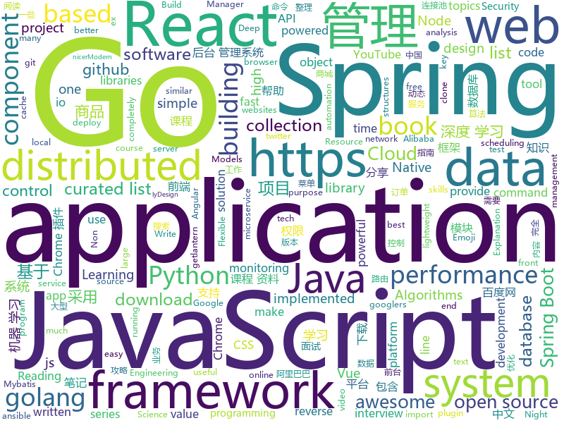

# 2019-04-14
See what the GitHub community is most excited about today.

## python
* [eht-imaging](https://github.com/achael/eht-imaging)(**740 stars today**): Imaging, analysis, and simulation software for radio interferometry
* [jumpcutter](https://github.com/carykh/jumpcutter)(**174 stars today**): Automatically edits vidx. Explanation here: https://www.youtube.com/watch?v=DQ8orIurGxw
* [USTC-Course](https://github.com/USTC-Resource/USTC-Course)(**122 stars today**): ❤️中国科学技术大学课程资源
* [Python](https://github.com/TheAlgorithms/Python)(**115 stars today**): All Algorithms implemented in Python
* [ChromeAppHeroes](https://github.com/zhaoolee/ChromeAppHeroes)(**116 stars today**): 🌈Chrome插件英雄榜, 为优秀的Chrome插件写一本中文说明书, 让Chrome插件英雄们造福人类~ ChromePluginHeroes, Write a Chinese manual for the excellent Chrome plugin, let the Chrome plugin heroes benefit the human~
* [FCOS](https://github.com/tianzhi0549/FCOS)(**97 stars today**): FCOS: Fully Convolutional One-Stage Object Detection
* [Algorithm_Interview_Notes-Chinese](https://github.com/imhuay/Algorithm_Interview_Notes-Chinese)(**71 stars today**): 2018/2019/校招/春招/秋招/算法/机器学习(Machine Learning)/深度学习(Deep Learning)/自然语言处理(NLP)/C/C++/Python/面试笔记
* [awesome-python](https://github.com/vinta/awesome-python)(**53 stars today**): A curated list of awesome Python frameworks, libraries, software and resources
* [SPADE](https://github.com/NVlabs/SPADE)(**51 stars today**): Semantic Image Synthesis with SPADE
* [system-design-primer](https://github.com/donnemartin/system-design-primer)(**52 stars today**): Learn how to design large-scale systems. Prep for the system design interview. Includes Anki flashcards.
* [models](https://github.com/tensorflow/models)(**38 stars today**): Models and examples built with TensorFlow
* [keras](https://github.com/keras-team/keras)(**41 stars today**): Deep Learning for humans
* [django](https://github.com/django/django)(**26 stars today**): The Web framework for perfectionists with deadlines.
* [edgedb](https://github.com/edgedb/edgedb)(**46 stars today**): The next generation object-relational database. A @MagicStack project.
* [modin](https://github.com/modin-project/modin)(**44 stars today**): Modin: Speed up your Pandas workflows by changing a single line of code
* [CheatSheetSeries](https://github.com/OWASP/CheatSheetSeries)(**41 stars today**): The OWASP Cheat Sheet Series was created to provide a concise collection of high value information on specific application security topics.
* [FaceDetection-DSFD](https://github.com/TencentYoutuResearch/FaceDetection-DSFD)(**39 stars today**): 
* [youtube-dl](https://github.com/ytdl-org/youtube-dl)(**38 stars today**): Command-line program to download videos from YouTube.com and other video sites
* [awesome-python-login-model](https://github.com/CriseLYJ/awesome-python-login-model)(**33 stars today**): 😮python模拟登陆一些大型网站，还有一些简单的爬虫，希望对你们有所帮助❤️，如果喜欢记得给个star哦🌟
* [faceswap](https://github.com/deepfakes/faceswap)(**29 stars today**): Non official project based on original /r/Deepfakes thread. Many thanks to him!
* [pandas](https://github.com/pandas-dev/pandas)(**31 stars today**): Flexible and powerful data analysis / manipulation library for Python, providing labeled data structures similar to R data.frame objects, statistical functions, and much more
* [you-get](https://github.com/soimort/you-get)(**30 stars today**): ⏬Dumb downloader that scrapes the web
* [ansible](https://github.com/ansible/ansible)(**26 stars today**): Ansible is a radically simple IT automation platform that makes your applications and systems easier to deploy. Avoid writing scripts or custom code to deploy and update your applications — automate in a language that approaches plain English, using SSH, with no agents to install on remote systems. https://docs.ansible.com/ansible/
* [home-assistant](https://github.com/home-assistant/home-assistant)(**25 stars today**): 🏡Open source home automation that puts local control and privacy first
* [jax](https://github.com/google/jax)(**30 stars today**): Composable transformations of Python+NumPy programs: differentiate, vectorize, JIT to GPU/TPU, and more

## java
* [ZXBlog](https://github.com/ZXZxin/ZXBlog)(**106 stars today**): 记录各种学习笔记(算法、Java、数据库、并发......)
* [JavaGuide](https://github.com/Snailclimb/JavaGuide)(**95 stars today**): 【Java学习+面试指南】 一份涵盖大部分Java程序员所需要掌握的核心知识。
* [advanced-java](https://github.com/doocs/advanced-java)(**60 stars today**): 😮互联网 Java 工程师进阶知识完全扫盲
* [mall](https://github.com/macrozheng/mall)(**49 stars today**): mall项目是一套电商系统，包括前台商城系统及后台管理系统，基于SpringBoot+MyBatis实现。 前台商城系统包含首页门户、商品推荐、商品搜索、商品展示、购物车、订单流程、会员中心、客户服务、帮助中心等模块。 后台管理系统包含商品管理、订单管理、会员管理、促销管理、运营管理、内容管理、统计报表、财务管理、权限管理、设置等模块。
* [spring-boot](https://github.com/spring-projects/spring-boot)(**36 stars today**): Spring Boot
* [ghidra](https://github.com/NationalSecurityAgency/ghidra)(**39 stars today**): Ghidra is a software reverse engineering (SRE) framework
* [Magisk](https://github.com/topjohnwu/Magisk)(**39 stars today**): A Magic Mask to Alter Android System Systemless-ly
* [java-design-patterns](https://github.com/iluwatar/java-design-patterns)(**36 stars today**): Design patterns implemented in Java
* [elasticsearch](https://github.com/elastic/elasticsearch)(**36 stars today**): Open Source, Distributed, RESTful Search Engine
* [SpringAll](https://github.com/wuyouzhuguli/SpringAll)(**32 stars today**): 循序渐进，学习Spring Boot、Spring Boot & Shiro、Spring Cloud和Spring Security，博客Spring系列源码
* [spring-framework](https://github.com/spring-projects/spring-framework)(**27 stars today**): Spring Framework
* [incubator-dubbo](https://github.com/apache/incubator-dubbo)(**25 stars today**): Apache Dubbo (incubating) is a high-performance, java based, open source RPC framework.
* [spring-cloud-alibaba](https://github.com/spring-cloud-incubator/spring-cloud-alibaba)(**28 stars today**): Spring Cloud Alibaba provides a one-stop solution for application development for the distributed solutions of Alibaba middleware.
* [eladmin](https://github.com/elunez/eladmin)(**27 stars today**): 项目基于 Spring Boot 2.1.0 、 Jpa、 Spring Security、redis、Vue的前后端分离的后台管理系统，项目采用分模块开发方式， 权限控制采用 RBAC（Role-Based Access Control，基于角色的访问控制），支持数据字典与数据权限管理，前端菜单支持动态路由前端菜单支持动态路由，反馈交流群：891137268
* [tutorials](https://github.com/eugenp/tutorials)(**16 stars today**): The "REST With Spring" Course:
* [nacos](https://github.com/alibaba/nacos)(**27 stars today**): an easy-to-use dynamic service discovery, configuration and service management platform for building cloud native applications.
* [SpringBoot-Learning](https://github.com/dyc87112/SpringBoot-Learning)(**26 stars today**): Spring Boot基础教程，Spring Boot 2.x版本连载中！！！
* [guava](https://github.com/google/guava)(**21 stars today**): Google core libraries for Java
* [incubator-skywalking](https://github.com/apache/incubator-skywalking)(**22 stars today**): APM, Application Performance Monitoring System
* [Java](https://github.com/TheAlgorithms/Java)(**19 stars today**): All Algorithms implemented in Java
* [SpringBlade](https://github.com/chillzhuang/SpringBlade)(**20 stars today**): SpringBlade 是由一个商业级项目升级优化而来的SpringCloud微服务架构，采用Java8 API重构了业务代码，完全遵循阿里巴巴编码规范。采用Spring Boot 2 、Spring Cloud Finchley 、Mybatis 等核心技术，同时提供基于React和Vue的两个前端框架用于快速搭建企业级的SaaS微服务系统平台。 QQ群：477853168
* [seata](https://github.com/seata/seata)(**19 stars today**): 🔥Seata is an easy-to-use, high-performance, java based, open source distributed transaction solution.
* [Sentinel](https://github.com/alibaba/Sentinel)(**20 stars today**): A lightweight powerful flow control component enabling reliability and monitoring for microservices. (轻量级的流量控制、熔断降级 Java 库)
* [druid](https://github.com/alibaba/druid)(**16 stars today**): 阿里巴巴数据库事业部出品，为监控而生的数据库连接池。阿里云Data Lake Analytics(https://www.aliyun.com/product/datalakeanalytics )、DRDS、TDDL 连接池powered by Druid
* [pai](https://github.com/Microsoft/pai)(**19 stars today**): Resource scheduling and cluster management for AI

## unknown
* [xg2xg](https://github.com/jhuangtw-dev/xg2xg)(**696 stars today**): by ex-googlers, for ex-googlers - a lookup table of similar tech & services
* [git-tips](https://github.com/521xueweihan/git-tips)(**310 stars today**): Git的奇技淫巧
* [955.WLB](https://github.com/formulahendry/955.WLB)(**258 stars today**): 955 不加班的公司名单 - 工作 955，work–life balance (工作与生活的平衡)
* [awesome-programming-books](https://github.com/majikarp/awesome-programming-books)(**144 stars today**): 📚A curated list of awesome programming books
* [algorithms](https://github.com/jeffgerickson/algorithms)(**119 stars today**): Bug-tracking for Jeff's algorithms book, notes, etc.
* [pumpkin-book](https://github.com/datawhalechina/pumpkin-book)(**99 stars today**): 《机器学习》（西瓜书）公式推导解析，在线阅读地址：https://datawhalechina.github.io/pumpkin-book
* [SJTU-Courses](https://github.com/CoolPhilChen/SJTU-Courses)(**75 stars today**): 上海交通大学课程资料分享
* [CS-Notes](https://github.com/CyC2018/CS-Notes)(**73 stars today**): 📚技术面试必备基础知识
* [awesome](https://github.com/sindresorhus/awesome)(**67 stars today**): 😎Awesome lists about all kinds of interesting topics
* [Awesome](https://github.com/Awesome-Windows/Awesome)(**62 stars today**): 💻An awesome & curated list of best applications and tools for Windows.
* [gitignore](https://github.com/github/gitignore)(**46 stars today**): A collection of useful .gitignore templates
* [Data-Science--Cheat-Sheet](https://github.com/abhat222/Data-Science--Cheat-Sheet)(**47 stars today**): Cheat Sheets
* [You-Dont-Know-JS](https://github.com/getify/You-Dont-Know-JS)(**53 stars today**): A book series on JavaScript. @YDKJS on twitter.
* [free-programming-books](https://github.com/EbookFoundation/free-programming-books)(**53 stars today**): 📚Freely available programming books
* [chinese-independent-developer](https://github.com/1c7/chinese-independent-developer)(**57 stars today**): 👩🏿‍💻👨🏾‍💻👩🏼‍💻👨🏽‍💻👩🏻‍💻中国独立开发者项目列表 -- 分享大家都在做什么
* [DeepLearning-500-questions](https://github.com/scutan90/DeepLearning-500-questions)(**46 stars today**): 深度学习500问，以问答形式对常用的概率知识、线性代数、机器学习、深度学习、计算机视觉等热点问题进行阐述，以帮助自己及有需要的读者。 全书分为18个章节，50余万字。由于水平有限，书中不妥之处恳请广大读者批评指正。 未完待续............ 如有意合作，联系scutjy2015@163.com 版权所有，违权必究 Tan 2018.06
* [996.Leave](https://github.com/623637646/996.Leave)(**47 stars today**): 逃离996
* [app-ideas](https://github.com/florinpop17/app-ideas)(**44 stars today**): A Collection of application ideas which can be used to improve your coding skills.
* [learning](https://github.com/amitness/learning)(**43 stars today**): Becoming 1% better at Data Science everyday
* [RE-iOS-Apps](https://github.com/ivRodriguezCA/RE-iOS-Apps)(**40 stars today**): A completely free, open source and online course about Reverse Engineering iOS Applications.
* [trackerslist](https://github.com/ngosang/trackerslist)(**36 stars today**): An updated list of public BitTorrent trackers
* [OI-wiki](https://github.com/24OI/OI-wiki)(**36 stars today**): 🌟Wiki for OI / ICPC. （某大型游戏线上攻略，内含炫酷算术魔法）
* [996action](https://github.com/CPdogson/996action)(**36 stars today**): 
* [coding-interview-university](https://github.com/jwasham/coding-interview-university)(**32 stars today**): A complete computer science study plan to become a software engineer.
* [flink-training-course](https://github.com/flink-china/flink-training-course)(**30 stars today**): 

## javascript
* [libpku](https://github.com/lib-pku/libpku)(**405 stars today**): 贵校课程资料民间整理
* [twemoji](https://github.com/twitter/twemoji)(**149 stars today**): Emoji for everyone. https://twemoji.twitter.com/
* [awesome-stacks](https://github.com/stackshareio/awesome-stacks)(**140 stars today**): A curated list of tech stacks for building different applications & features
* [Awesome-Design-Tools](https://github.com/LisaDziuba/Awesome-Design-Tools)(**127 stars today**): The best design tools for everything👉
* [vue](https://github.com/vuejs/vue)(**99 stars today**): 🖖Vue.js is a progressive, incrementally-adoptable JavaScript framework for building UI on the web.
* [playroom](https://github.com/seek-oss/playroom)(**95 stars today**): Design with JSX, powered by your own component library.
* [octotree](https://github.com/ovity/octotree)(**87 stars today**): GitHub code tree on steroids
* [react](https://github.com/facebook/react)(**67 stars today**): A declarative, efficient, and flexible JavaScript library for building user interfaces.
* [30-seconds-of-code](https://github.com/30-seconds/30-seconds-of-code)(**69 stars today**): A curated collection of useful JavaScript snippets that you can understand in 30 seconds or less.
* [react-window](https://github.com/bvaughn/react-window)(**71 stars today**): React components for efficiently rendering large lists and tabular data
* [Motrix](https://github.com/agalwood/Motrix)(**67 stars today**): A full-featured download manager.
* [CRN](https://github.com/ctripcorp/CRN)(**64 stars today**): CRN是Ctrip React Native简称，由携程无线平台研发团队基于React Native框架优化，定制成稳定性和性能更佳、也更适合业务场景的跨平台开发框架。
* [spectrum](https://github.com/withspectrum/spectrum)(**56 stars today**): Simple, powerful online communities.
* [dimport](https://github.com/lukeed/dimport)(**57 stars today**): Run ES Module syntax (`import`, `import()`, and `export`) in any browser – even IE!
* [javascript-algorithms](https://github.com/trekhleb/javascript-algorithms)(**46 stars today**): 📝Algorithms and data structures implemented in JavaScript with explanations and links to further readings
* [storybook](https://github.com/storybooks/storybook)(**47 stars today**): UI component dev & test: React, Vue, Angular, React Native, Ember, Web Components & more!
* [react-player](https://github.com/CookPete/react-player)(**43 stars today**): A React component for playing a variety of URLs, including file paths, YouTube, Facebook, Twitch, SoundCloud, Streamable, Vimeo, Wistia and DailyMotion
* [axios](https://github.com/axios/axios)(**41 stars today**): Promise based HTTP client for the browser and node.js
* [baiduyun](https://github.com/syhyz1990/baiduyun)(**39 stars today**): 油猴脚本 直接下载百度网盘和百度网盘分享的文件,直链下载超级加速
* [puppeteer](https://github.com/GoogleChrome/puppeteer)(**38 stars today**): Headless Chrome Node API
* [bootstrap](https://github.com/twbs/bootstrap)(**28 stars today**): The most popular HTML, CSS, and JavaScript framework for developing responsive, mobile first projects on the web.
* [realworld](https://github.com/gothinkster/realworld)(**38 stars today**): "The mother of all demo apps" — Exemplary fullstack Medium.com clone powered by React, Angular, Node, Django, and many more🏅
* [wiwi-circleOfFifths](https://github.com/wiwikuan/wiwi-circleOfFifths)(**36 stars today**): JavaScript Interactive Circle of Fifths
* [google-interview-preparation-problems](https://github.com/mgechev/google-interview-preparation-problems)(**34 stars today**): leetcode problems I solved during my Google interview preparation.
* [create-react-app](https://github.com/facebook/create-react-app)(**32 stars today**): Set up a modern web app by running one command.

## html
* [zju-icicles](https://github.com/QSCTech/zju-icicles)(**205 stars today**): 浙江大学课程攻略共享计划
* [front-end-handbook-2019](https://github.com/FrontendMasters/front-end-handbook-2019)(**169 stars today**): [Book] 2019 edition of our front-end development handbook
* [nndl.github.io](https://github.com/nndl/nndl.github.io)(**153 stars today**): 《神经网络与深度学习》 Neural Network and Deep Learning
* [linux-command](https://github.com/jaywcjlove/linux-command)(**124 stars today**): Linux命令大全搜索工具，内容包含Linux命令手册、详解、学习、搜集。https://git.io/linux
* [public-sans](https://github.com/uswds/public-sans)(**53 stars today**): A strong, neutral, principles-driven, open-source typeface for text or display
* [water.css](https://github.com/kognise/water.css)(**50 stars today**): A just-add-css collection of styles to make simple websites just a little nicer
* [javascript.info](https://github.com/javascript-tutorial/javascript.info)(**23 stars today**): Modern JavaScript Tutorial
* [learn-awesome](https://github.com/learn-awesome/learn-awesome)(**24 stars today**): Curated lists of awesome learning resources on various topics across formats, tagged with difficulty level, estimated time & year. Humanity's universal skills graph connected via prerequisites & subtopics..
* [mlh-hackathon-nodejs-starter](https://github.com/MLH/mlh-hackathon-nodejs-starter)(**20 stars today**): Hackathon starter project for Node.js applications
* [javascript-enlightenment](https://github.com/FrontendMasters/javascript-enlightenment)(**21 stars today**): [Book] JavaScript (ES2015+) Enlightenment
* [patchwork](https://github.com/jlord/patchwork)(****): All the Git-it Workshop completers!
* [qiubaiying.github.io](https://github.com/qiubaiying/qiubaiying.github.io)(**7 stars today**): BY Blog ->
* [lib-pku.github.io](https://github.com/lib-pku/lib-pku.github.io)(**11 stars today**): 北京大学课程资料整理
* [Coursera-ML-AndrewNg-Notes](https://github.com/fengdu78/Coursera-ML-AndrewNg-Notes)(**8 stars today**): 吴恩达老师的机器学习课程个人笔记
* [JavaScript30](https://github.com/wesbos/JavaScript30)(**6 stars today**): 30 Day Vanilla JS Challenge
* [dropcss](https://github.com/leeoniya/dropcss)(**11 stars today**): An exceptionally fast, thorough and tiny unused-CSS cleaner
* [AdminLTE](https://github.com/ColorlibHQ/AdminLTE)(**8 stars today**): AdminLTE - Free Premium Admin control Panel Theme Based On Bootstrap 3.x
* [StreamSaver.js](https://github.com/jimmywarting/StreamSaver.js)(**10 stars today**): StreamSaver writes stream to the filesystem directly asynchronous
* [javascript-tutorial-zh](https://github.com/xitu/javascript-tutorial-zh)(**9 stars today**): Modern JavaScript Tutorial
* [Front-end-Developer-Interview-Questions](https://github.com/h5bp/Front-end-Developer-Interview-Questions)(**8 stars today**): A list of helpful front-end related questions you can use to interview potential candidates, test yourself or completely ignore.
* [Spoon-Knife](https://github.com/octocat/Spoon-Knife)(****): This repo is for demonstration purposes only.
* [GoDoc-CN](https://github.com/taigacute/GoDoc-CN)(**8 stars today**): Go标准库的中文版Dash文档
* [fastText](https://github.com/facebookresearch/fastText)(**7 stars today**): Library for fast text representation and classification.
* [javascript-tutorial-ru](https://github.com/iliakan/javascript-tutorial-ru)(**6 stars today**): Современный учебник JavaScript
* [all-contributors](https://github.com/all-contributors/all-contributors)(**7 stars today**): ✨Recognize all contributors, not just the ones who push code✨

## go
* [go](https://github.com/golang/go)(**71 stars today**): The Go programming language
* [space-cloud](https://github.com/spaceuptech/space-cloud)(**60 stars today**): Space Cloud is an open source, web server that provides instant Realtime APIs on any database of your choice. Build highly scalable apps with the agility of a prototype!
* [kubernetes](https://github.com/kubernetes/kubernetes)(**43 stars today**): Production-Grade Container Scheduling and Management
* [frp](https://github.com/fatedier/frp)(**34 stars today**): A fast reverse proxy to help you expose a local server behind a NAT or firewall to the internet.
* [awesome-go](https://github.com/avelino/awesome-go)(**36 stars today**): A curated list of awesome Go frameworks, libraries and software
* [the-way-to-go_ZH_CN](https://github.com/Unknwon/the-way-to-go_ZH_CN)(**30 stars today**): 《The Way to Go》中文译本，中文正式名《Go 入门指南》
* [terraform-provider-azurerm](https://github.com/terraform-providers/terraform-provider-azurerm)(**30 stars today**): Terraform provider for Azure Resource Manager
* [lantern](https://github.com/getlantern/lantern)(**24 stars today**): 🔴蓝灯最新版本下载 https://github.com/getlantern/download🔴Lantern Latest Download https://github.com/getlantern/download🔴
* [etcd](https://github.com/etcd-io/etcd)(**26 stars today**): Distributed reliable key-value store for the most critical data of a distributed system
* [BaiduPCS-Go](https://github.com/iikira/BaiduPCS-Go)(**23 stars today**): 百度网盘客户端 - Go语言编写
* [build-web-application-with-golang](https://github.com/astaxie/build-web-application-with-golang)(**18 stars today**): A golang ebook intro how to build a web with golang
* [owlcache](https://github.com/xssed/owlcache)(**20 stars today**): 🦉owlcache is a lightweight, high-performance, non-centralized, distributed Key/Value memory-cached data sharing application written by Go . keyword : golang cache、go cache、golang nosql
* [cost-model](https://github.com/kubecost/cost-model)(**19 stars today**): Cross-cloud cost allocation models for workloads running on Kubernetes
* [gin](https://github.com/gin-gonic/gin)(**19 stars today**): Gin is a HTTP web framework written in Go (Golang). It features a Martini-like API with much better performance -- up to 40 times faster. If you need smashing performance, get yourself some Gin.
* [reading-go](https://github.com/developer-learning/reading-go)(**18 stars today**): Go 每日阅读和 Go 夜读 > Daily Reading Go and Night Reading Go - Go source reading and offline technical or another articles or discussion on every night.
* [fzf](https://github.com/junegunn/fzf)(**18 stars today**): 🌸A command-line fuzzy finder
* [v2ray-core](https://github.com/v2ray/v2ray-core)(**14 stars today**): A platform for building proxies to bypass network restrictions.
* [prometheus](https://github.com/prometheus/prometheus)(**15 stars today**): The Prometheus monitoring system and time series database.
* [bk-cmdb](https://github.com/Tencent/bk-cmdb)(**16 stars today**): 蓝鲸智云配置平台(BlueKing CMDB)
* [sqlx](https://github.com/jmoiron/sqlx)(**17 stars today**): general purpose extensions to golang's database/sql
* [tidb](https://github.com/pingcap/tidb)(**15 stars today**): TiDB is a distributed HTAP database compatible with the MySQL protocol
* [hugo](https://github.com/gohugoio/hugo)(**16 stars today**): The world’s fastest framework for building websites.
* [mkcert](https://github.com/FiloSottile/mkcert)(**16 stars today**): A simple zero-config tool to make locally trusted development certificates with any names you'd like.
* [gizmo](https://github.com/nytimes/gizmo)(**16 stars today**): A Microservice Toolkit from The New York Times
* [pacgo](https://github.com/danicat/pacgo)(**16 stars today**): A Pac Man clone written in Go (with emojis!)

## WordCloud

