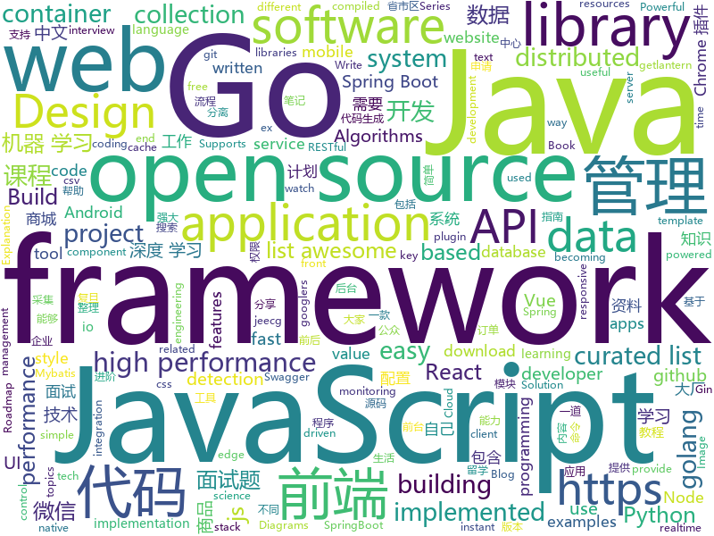

# 2019-04-18
See what the GitHub community is most excited about today.

## python
* [USTC-Course](https://github.com/USTC-Resource/USTC-Course)(**300 stars today**): ❤️中国科学技术大学课程资源
* [pyodide](https://github.com/iodide-project/pyodide)(**322 stars today**): The Python scientific stack, compiled to WebAssembly
* [CenterNet](https://github.com/xingyizhou/CenterNet)(**213 stars today**): Object detection, 3D detection, and pose estimation using center point detection:
* [ChromeAppHeroes](https://github.com/zhaoolee/ChromeAppHeroes)(**166 stars today**): 🌈Chrome插件英雄榜, 为优秀的Chrome插件写一本中文说明书, 让Chrome插件英雄们造福人类~ ChromePluginHeroes, Write a Chinese manual for the excellent Chrome plugin, let the Chrome plugin heroes benefit the human~
* [yolov3-tf2](https://github.com/zzh8829/yolov3-tf2)(**150 stars today**): YoloV3 Implemented in Tensorflow 2.0
* [spacy-course](https://github.com/ines/spacy-course)(**151 stars today**): 👩‍🏫Advanced NLP with spaCy: A free online course
* [eht-imaging](https://github.com/achael/eht-imaging)(**134 stars today**): Imaging, analysis, and simulation software for radio interferometry
* [meshroom](https://github.com/alicevision/meshroom)(**130 stars today**): 3D Reconstruction Software
* [OctaveConv](https://github.com/terrychenism/OctaveConv)(**116 stars today**): A MXNet Implementation for Drop an Octave
* [SPADE](https://github.com/NVlabs/SPADE)(**106 stars today**): Semantic Image Synthesis with SPADE
* [models](https://github.com/tensorflow/models)(**72 stars today**): Models and examples built with TensorFlow
* [system-design-primer](https://github.com/donnemartin/system-design-primer)(**86 stars today**): Learn how to design large-scale systems. Prep for the system design interview. Includes Anki flashcards.
* [AiLearning](https://github.com/apachecn/AiLearning)(**83 stars today**): AiLearning: 机器学习 - MachineLearning - ML、深度学习 - DeepLearning - DL、自然语言处理 NLP
* [conversational-datasets](https://github.com/PolyAI-LDN/conversational-datasets)(**81 stars today**): Datasets for conversational AI
* [python-ext-wasm](https://github.com/wasmerio/python-ext-wasm)(**78 stars today**): 🐍🕸Python library to run WebAssembly binaries.
* [awesome-python](https://github.com/vinta/awesome-python)(**70 stars today**): A curated list of awesome Python frameworks, libraries, software and resources
* [CheatSheetSeries](https://github.com/OWASP/CheatSheetSeries)(**64 stars today**): The OWASP Cheat Sheet Series was created to provide a concise collection of high value information on specific application security topics.
* [OctaveConv_pytorch](https://github.com/lxtGH/OctaveConv_pytorch)(**62 stars today**): Pytorch implementation of Octave convolution
* [Python](https://github.com/TheAlgorithms/Python)(**55 stars today**): All Algorithms implemented in Python
* [jumpcutter](https://github.com/carykh/jumpcutter)(**59 stars today**): Automatically edits vidx. Explanation here: https://www.youtube.com/watch?v=DQ8orIurGxw
* [keras](https://github.com/keras-team/keras)(**48 stars today**): Deep Learning for humans
* [public-apis](https://github.com/toddmotto/public-apis)(**53 stars today**): A collective list of free APIs for use in software and web development.
* [fastapi](https://github.com/tiangolo/fastapi)(**53 stars today**): FastAPI framework, high performance, easy to learn, fast to code, ready for production
* [Python-100-Days](https://github.com/jackfrued/Python-100-Days)(**42 stars today**): Python - 100天从新手到大师
* [FCOS](https://github.com/tianzhi0549/FCOS)(**47 stars today**): FCOS: Fully Convolutional One-Stage Object Detection

## java
* [litemall](https://github.com/linlinjava/litemall)(**390 stars today**): 又一个小商城。litemall = Spring Boot后端 + Vue管理员前端 + 微信小程序用户前端
* [JavaGuide](https://github.com/Snailclimb/JavaGuide)(**182 stars today**): 【Java学习+面试指南】 一份涵盖大部分Java程序员所需要掌握的核心知识。
* [advanced-java](https://github.com/doocs/advanced-java)(**129 stars today**): 😮互联网 Java 工程师进阶知识完全扫盲
* [metatron-discovery](https://github.com/metatron-app/metatron-discovery)(**83 stars today**): Powerful & Easy way for big data discovery
* [mall](https://github.com/macrozheng/mall)(**69 stars today**): mall项目是一套电商系统，包括前台商城系统及后台管理系统，基于SpringBoot+MyBatis实现。 前台商城系统包含首页门户、商品推荐、商品搜索、商品展示、购物车、订单流程、会员中心、客户服务、帮助中心等模块。 后台管理系统包含商品管理、订单管理、会员管理、促销管理、运营管理、内容管理、统计报表、财务管理、权限管理、设置等模块。
* [ZXBlog](https://github.com/ZXZxin/ZXBlog)(**69 stars today**): 记录各种学习笔记(算法、Java、数据库、并发......)
* [tutorials](https://github.com/eugenp/tutorials)(**42 stars today**): The "REST With Spring" Course:
* [jeecg-boot](https://github.com/zhangdaiscott/jeecg-boot)(**62 stars today**): Jeecg-boot 是一款基于代码生成器的智能开发平台！采用前后端分离技术:SpringBoot，Mybatis-plus，Shiro，JWT，Vue & Ant Design。提供强大的代码生成器， 前端页面代码和后端代码一键生成，不需要写任何代码，保持jeecg一贯的强大，绝对是全栈开发者福音！！ JeecgBoot的宗旨是降低前后端分离的开发成本，提高UI能力的同时，提高开发效率，追求更高的能力，No代码概念，一系列智能化在线开发。
* [jib](https://github.com/GoogleContainerTools/jib)(**67 stars today**): ⛵️Build container images for your Java applications.
* [java-design-patterns](https://github.com/iluwatar/java-design-patterns)(**57 stars today**): Design patterns implemented in Java
* [seata](https://github.com/seata/seata)(**57 stars today**): 🔥Seata is an easy-to-use, high-performance, java based, open source distributed transaction solution.
* [spring-boot](https://github.com/spring-projects/spring-boot)(**54 stars today**): Spring Boot
* [spring-framework](https://github.com/spring-projects/spring-framework)(**46 stars today**): Spring Framework
* [spring-boot-examples](https://github.com/ityouknow/spring-boot-examples)(**49 stars today**): about learning Spring Boot via examples. Spring Boot 教程、技术栈示例代码，快速简单上手教程。
* [incubator-skywalking](https://github.com/apache/incubator-skywalking)(**56 stars today**): APM, Application Performance Monitoring System
* [AMSHook](https://github.com/androidmalin/AMSHook)(**52 stars today**): 启动未在AndroidManifest中注册的Activity,适配了Android4-9
* [arthas](https://github.com/alibaba/arthas)(**46 stars today**): Alibaba Java Diagnostic Tool Arthas/Alibaba Java诊断利器Arthas
* [ghidra](https://github.com/NationalSecurityAgency/ghidra)(**48 stars today**): Ghidra is a software reverse engineering (SRE) framework
* [product-ei](https://github.com/wso2/product-ei)(**42 stars today**): An open source, a high-performance hybrid integration platform that allows developers quick integration with any application, data, or system.
* [apollo](https://github.com/ctripcorp/apollo)(**45 stars today**): Apollo（阿波罗）是携程框架部门研发的分布式配置中心，能够集中化管理应用不同环境、不同集群的配置，配置修改后能够实时推送到应用端，并且具备规范的权限、流程治理等特性，适用于微服务配置管理场景。
* [elasticsearch](https://github.com/elastic/elasticsearch)(**43 stars today**): Open Source, Distributed, RESTful Search Engine
* [SpringBoot-Learning](https://github.com/dyc87112/SpringBoot-Learning)(**38 stars today**): Spring Boot基础教程，Spring Boot 2.x版本连载中！！！
* [WxJava](https://github.com/Wechat-Group/WxJava)(**35 stars today**): WxJava （微信开发 Java SDK），支持包括微信支付、开放平台、小程序、企业微信/企业号和公众号等的后端开发
* [incubator-dubbo](https://github.com/apache/incubator-dubbo)(**33 stars today**): Apache Dubbo (incubating) is a high-performance, java based, open source RPC framework.
* [Java](https://github.com/TheAlgorithms/Java)(**34 stars today**): All Algorithms implemented in Java

## unknown
* [git-tips](https://github.com/521xueweihan/git-tips)(**494 stars today**): Git的奇技淫巧
* [SJTU-Courses](https://github.com/CoolPhilChen/SJTU-Courses)(**326 stars today**): 上海交通大学课程资料分享
* [Weekly-FE-Interview](https://github.com/airuikun/Weekly-FE-Interview)(**224 stars today**): 每周十道前端大厂面试题，并收集大家在大厂面试中遇到的难题，一起共同成长。
* [xg2xg](https://github.com/jhuangtw-dev/xg2xg)(**183 stars today**): by ex-googlers, for ex-googlers - a lookup table of similar tech & services
* [datascience](https://github.com/r0f1/datascience)(**154 stars today**): Curated list of Python resources for data science.
* [developer-roadmap](https://github.com/kamranahmedse/developer-roadmap)(**145 stars today**): Roadmap to becoming a web developer in 2019
* [955.WLB](https://github.com/formulahendry/955.WLB)(**145 stars today**): 955 不加班的公司名单 - 工作 955，work–life balance (工作与生活的平衡)
* [Android-Daily-Interview](https://github.com/Moosphan/Android-Daily-Interview)(**139 stars today**): 每工作日更新一道 Android 面试题，小聚成河，大聚成江，共勉之～
* [BestNote](https://github.com/pengMaster/BestNote)(**136 stars today**): 👊Java Android 近几年最全面的技术点以及面试题 供自己学习使用
* [DeepLearning-500-questions](https://github.com/scutan90/DeepLearning-500-questions)(**102 stars today**): 深度学习500问，以问答形式对常用的概率知识、线性代数、机器学习、深度学习、计算机视觉等热点问题进行阐述，以帮助自己及有需要的读者。 全书分为18个章节，50余万字。由于水平有限，书中不妥之处恳请广大读者批评指正。 未完待续............ 如有意合作，联系scutjy2015@163.com 版权所有，违权必究 Tan 2018.06
* [CS-Notes](https://github.com/CyC2018/CS-Notes)(**101 stars today**): 📚技术面试必备基础知识
* [golang-developer-roadmap](https://github.com/Alikhll/golang-developer-roadmap)(**104 stars today**): Roadmap to becoming a Go developer in 2019
* [Awesome-Mobile-Machine-Learning](https://github.com/fritzlabs/Awesome-Mobile-Machine-Learning)(**97 stars today**): A curated list of awesome mobile machine learning resources for iOS, Android, and edge devices.
* [gitignore](https://github.com/github/gitignore)(**72 stars today**): A collection of useful .gitignore templates
* [996.Leave](https://github.com/623637646/996.Leave)(**94 stars today**): 逃离996
* [awesome](https://github.com/sindresorhus/awesome)(**79 stars today**): 😎Awesome lists about all kinds of interesting topics
* [pumpkin-book](https://github.com/datawhalechina/pumpkin-book)(**63 stars today**): 《机器学习》（西瓜书）公式推导解析，在线阅读地址：https://datawhalechina.github.io/pumpkin-book
* [blog](https://github.com/airuikun/blog)(**68 stars today**): 小蝌蚪的blog，中年前端屌丝的心路历程，欢迎star或者watch
* [Daily-Interview-Question](https://github.com/Advanced-Frontend/Daily-Interview-Question)(**67 stars today**): 我是木易杨，公众号「高级前端进阶」作者，每天搞定一道前端大厂面试题，祝大家天天进步，一年后会看到不一样的自己。
* [cvpr2019](https://github.com/extreme-assistant/cvpr2019)(**62 stars today**): cvpr2019 papers，极市团队整理
* [free-programming-books](https://github.com/EbookFoundation/free-programming-books)(**56 stars today**): 📚Freely available programming books
* [app-ideas](https://github.com/florinpop17/app-ideas)(**49 stars today**): A Collection of application ideas which can be used to improve your coding skills.
* [hosts](https://github.com/googlehosts/hosts)(**43 stars today**): 镜像：https://coding.net/u/scaffrey/p/hosts/git
* [awesome-vue](https://github.com/vuejs/awesome-vue)(**46 stars today**): 🎉A curated list of awesome things related to Vue.js
* [coding-interview-university](https://github.com/jwasham/coding-interview-university)(**41 stars today**): A complete computer science study plan to become a software engineer.

## javascript
* [libpku](https://github.com/lib-pku/libpku)(**603 stars today**): 贵校课程资料民间整理
* [React95](https://github.com/arturbien/React95)(**573 stars today**): 🌈🕹Refreshed Windows 95 style UI components for your React app
* [squeezer](https://github.com/SqueezerIO/squeezer)(**568 stars today**): Squeezer Framework - Build serverless dApps
* [vue](https://github.com/vuejs/vue)(**131 stars today**): 🖖Vue.js is a progressive, incrementally-adoptable JavaScript framework for building UI on the web.
* [playroom](https://github.com/seek-oss/playroom)(**127 stars today**): Design with JSX, powered by your own component library.
* [react](https://github.com/facebook/react)(**105 stars today**): A declarative, efficient, and flexible JavaScript library for building user interfaces.
* [AreaCity-JsSpider-StatsGov](https://github.com/xiangyuecn/AreaCity-JsSpider-StatsGov)(**110 stars today**): 国家统计局中的省市区镇行政区划数据带拼音标注，高德地图的坐标和行政区域边界范围，在浏览器里面运行js代码采集的2019年发布的最新数据，含采集源码，提供csv格式数据，支持csv转成省市区多级联动js代码
* [nicedoc.io](https://github.com/IBM/nicedoc.io)(**95 stars today**): pretty README as service.
* [fluent](https://github.com/projectfluent/fluent)(**92 stars today**): Fluent — planning, spec and documentation
* [js-cloudimage-360-view](https://github.com/scaleflex/js-cloudimage-360-view)(**89 stars today**): Engage your customers with a stunning 360 view of your products
* [30-seconds-of-code](https://github.com/30-seconds/30-seconds-of-code)(**85 stars today**): A curated collection of useful JavaScript snippets that you can understand in 30 seconds or less.
* [packem](https://github.com/packem/packem)(**90 stars today**): 📦⚡ A precompiled JavaScript module bundler
* [axios](https://github.com/axios/axios)(**73 stars today**): Promise based HTTP client for the browser and node.js
* [Awesome-Design-Tools](https://github.com/LisaDziuba/Awesome-Design-Tools)(**78 stars today**): The best design tools for everything👉
* [octotree](https://github.com/ovity/octotree)(**74 stars today**): GitHub code tree on steroids
* [graphql-engine](https://github.com/hasura/graphql-engine)(**73 stars today**): Blazing fast, instant realtime GraphQL APIs on Postgres with fine grained access control, also trigger webhooks on database events.
* [wouter](https://github.com/molefrog/wouter)(**73 stars today**): A minimalistic (~1KB) routing for React. Nothing extra, just HOOKS.
* [awesome-stacks](https://github.com/stackshareio/awesome-stacks)(**68 stars today**): A curated list of tech stacks for building different applications & features
* [javascript-algorithms](https://github.com/trekhleb/javascript-algorithms)(**58 stars today**): 📝Algorithms and data structures implemented in JavaScript with explanations and links to further readings
* [Mermrender](https://github.com/Schachte/Mermrender)(**62 stars today**): 🧜‍♀️ RESTful rendering pipeline for generating sequence and UML diagrams using Mermaid for Markdown docs (Diagrams as a Service)
* [realworld](https://github.com/gothinkster/realworld)(**60 stars today**): "The mother of all demo apps" — Exemplary fullstack Medium.com clone powered by React, Angular, Node, Django, and many more🏅
* [javascript](https://github.com/airbnb/javascript)(**56 stars today**): JavaScript Style Guide
* [react-native](https://github.com/facebook/react-native)(**55 stars today**): A framework for building native apps with React.
* [fluent.js](https://github.com/projectfluent/fluent.js)(**63 stars today**): JavaScript implementation of Project Fluent
* [bootstrap](https://github.com/twbs/bootstrap)(**47 stars today**): The most popular HTML, CSS, and JavaScript framework for developing responsive, mobile first projects on the web.

## html
* [zju-icicles](https://github.com/QSCTech/zju-icicles)(**451 stars today**): 浙江大学课程攻略共享计划
* [front-end-handbook-2019](https://github.com/FrontendMasters/front-end-handbook-2019)(**220 stars today**): [Book] 2019 edition of our front-end development handbook
* [nndl.github.io](https://github.com/nndl/nndl.github.io)(**100 stars today**): 《神经网络与深度学习》 Neural Network and Deep Learning
* [public-sans](https://github.com/uswds/public-sans)(**60 stars today**): A strong, neutral, principles-driven, open-source typeface for text or display
* [water.css](https://github.com/kognise/water.css)(**38 stars today**): A just-add-css collection of styles to make simple websites just a little nicer
* [styleguide](https://github.com/google/styleguide)(**24 stars today**): Style guides for Google-originated open-source projects
* [CLRS](https://github.com/walkccc/CLRS)(**25 stars today**): 📚Solutions to Introduction to Algorithms Third Edition
* [linux-command](https://github.com/jaywcjlove/linux-command)(**23 stars today**): Linux命令大全搜索工具，内容包含Linux命令手册、详解、学习、搜集。https://git.io/linux
* [speedtest](https://github.com/adolfintel/speedtest)(**24 stars today**): Self-hosted HTML5 Speedtest. Easy setup, examples, configurable, responsive and mobile friendly. Supports PHP, Node, and more.
* [en.javascript.info](https://github.com/javascript-tutorial/en.javascript.info)(**19 stars today**): Modern JavaScript Tutorial
* [Spoon-Knife](https://github.com/octocat/Spoon-Knife)(****): This repo is for demonstration purposes only.
* [JavaScript30](https://github.com/wesbos/JavaScript30)(**12 stars today**): 30 Day Vanilla JS Challenge
* [Coursera-ML-AndrewNg-Notes](https://github.com/fengdu78/Coursera-ML-AndrewNg-Notes)(**15 stars today**): 吴恩达老师的机器学习课程个人笔记
* [personal-website](https://github.com/github/personal-website)(**11 stars today**): Code that'll help you kickstart a personal website that showcases your work as a software developer.
* [swagger-codegen](https://github.com/swagger-api/swagger-codegen)(**15 stars today**): swagger-codegen contains a template-driven engine to generate documentation, API clients and server stubs in different languages by parsing your OpenAPI / Swagger definition.
* [portainer](https://github.com/portainer/portainer)(**13 stars today**): Simple management UI for Docker
* [tdw](https://github.com/tdweiquan/tdw)(**14 stars today**): 艺术人生
* [zh.javascript.info](https://github.com/javascript-tutorial/zh.javascript.info)(**14 stars today**): Modern JavaScript Tutorial
* [Front-end-Developer-Interview-Questions](https://github.com/h5bp/Front-end-Developer-Interview-Questions)(**13 stars today**): A list of helpful front-end related questions you can use to interview potential candidates, test yourself or completely ignore.
* [qiubaiying.github.io](https://github.com/qiubaiying/qiubaiying.github.io)(**7 stars today**): BY Blog ->
* [fastText](https://github.com/facebookresearch/fastText)(**12 stars today**): Library for fast text representation and classification.
* [StreamSaver.js](https://github.com/jimmywarting/StreamSaver.js)(**11 stars today**): StreamSaver writes stream to the filesystem directly asynchronous
* [fdu-gradhotpot](https://github.com/fdu-cooks/fdu-gradhotpot)(**10 stars today**): Hotpot计划是复旦留学申请数据开源计划的代称，旨在为复旦学弟学妹无偿分享留学申请经验、暑研动态、海外生活/工作等一切相关信息。
* [sergey](https://github.com/trys/sergey)(**10 stars today**): A tiny lil' static site generator
* [cs231n.github.io](https://github.com/cs231n/cs231n.github.io)(**9 stars today**): Public facing notes page

## go
* [go](https://github.com/golang/go)(**73 stars today**): The Go programming language
* [kubernetes](https://github.com/kubernetes/kubernetes)(**68 stars today**): Production-Grade Container Scheduling and Management
* [owlcache](https://github.com/xssed/owlcache)(**63 stars today**): 🦉owlcache is a lightweight, high-performance, non-centralized, distributed Key/Value memory-cached data sharing application written by Go . keyword : golang cache、go cache、golang nosql
* [v](https://github.com/vlang/v)(**63 stars today**): Simple, fast, safe, compiled language for creating maintainable software. Supports translation from C/C++.
* [BaiduPCS-Go](https://github.com/iikira/BaiduPCS-Go)(**57 stars today**): 百度网盘客户端 - Go语言编写
* [space-cloud](https://github.com/spaceuptech/space-cloud)(**56 stars today**): Space Cloud is an open source, web server that provides instant Realtime APIs on any database of your choice. Build highly scalable apps with the agility of a prototype!
* [hugo](https://github.com/gohugoio/hugo)(**48 stars today**): The world’s fastest framework for building websites.
* [prometheus](https://github.com/prometheus/prometheus)(**44 stars today**): The Prometheus monitoring system and time series database.
* [the-way-to-go_ZH_CN](https://github.com/Unknwon/the-way-to-go_ZH_CN)(**42 stars today**): 《The Way to Go》中文译本，中文正式名《Go 入门指南》
* [libpod](https://github.com/containers/libpod)(**40 stars today**): libpod is a library used to create container pods. Home of Podman.
* [gin](https://github.com/gin-gonic/gin)(**37 stars today**): Gin is a HTTP web framework written in Go (Golang). It features a Martini-like API with much better performance -- up to 40 times faster. If you need smashing performance, get yourself some Gin.
* [awesome-go](https://github.com/avelino/awesome-go)(**38 stars today**): A curated list of awesome Go frameworks, libraries and software
* [traefik](https://github.com/containous/traefik)(**38 stars today**): The Cloud Native Edge Router
* [istio](https://github.com/istio/istio)(**33 stars today**): Connect, secure, control, and observe services.
* [beego](https://github.com/astaxie/beego)(**35 stars today**): beego is an open-source, high-performance web framework for the Go programming language.
* [kit](https://github.com/go-kit/kit)(**35 stars today**): A standard library for microservices.
* [vegeta](https://github.com/tsenart/vegeta)(**35 stars today**): HTTP load testing tool and library. It's over 9000!
* [syncthing](https://github.com/syncthing/syncthing)(**33 stars today**): Open Source Continuous File Synchronization
* [lantern](https://github.com/getlantern/lantern)(**29 stars today**): 🔴蓝灯最新版本下载 https://github.com/getlantern/download🔴Lantern Latest Download https://github.com/getlantern/download🔴
* [etcd](https://github.com/etcd-io/etcd)(**29 stars today**): Distributed reliable key-value store for the most critical data of a distributed system
* [Tigo](https://github.com/karldoenitz/Tigo)(**29 stars today**): Tigo is an HTTP web framework written in Go (Golang).It features a Tornado-like API with better performance.
* [build-web-application-with-golang](https://github.com/astaxie/build-web-application-with-golang)(**24 stars today**): A golang ebook intro how to build a web with golang
* [moby](https://github.com/moby/moby)(**21 stars today**): Moby Project - a collaborative project for the container ecosystem to assemble container-based systems
* [tutorials](https://github.com/micro-in-cn/tutorials)(**24 stars today**): Micro 中文教程、资料，源码解读
* [chaosblade](https://github.com/chaosblade-io/chaosblade)(**23 stars today**): An easy to use and powerful chaos engineering experiment toolkit.（一款简单易用、功能强大的混沌实验注入工具）

## WordCloud

