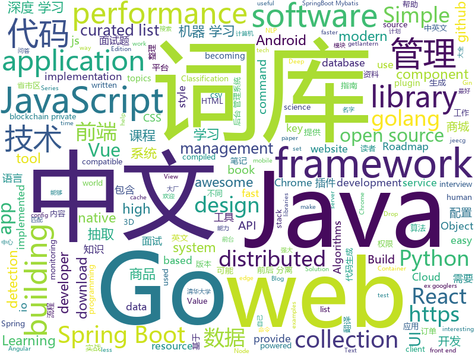

# 2019-04-19
See what the GitHub community is most excited about today.

## python
* [spacy-course](https://github.com/ines/spacy-course)(**447 stars today**): 👩‍🏫Advanced NLP with spaCy: A free online course
* [CenterNet](https://github.com/Duankaiwen/CenterNet)(**269 stars today**): Codes for our paper "CenterNet: Keypoint Triplets for Object Detection" .
* [CenterNet](https://github.com/xingyizhou/CenterNet)(**247 stars today**): Object detection, 3D detection, and pose estimation using center point detection:
* [pyodide](https://github.com/iodide-project/pyodide)(**225 stars today**): The Python scientific stack, compiled to WebAssembly
* [morph-net](https://github.com/google-research/morph-net)(**191 stars today**): Fast & Simple Resource-Constrained Learning of Deep Network Structure
* [AiLearning](https://github.com/apachecn/AiLearning)(**152 stars today**): AiLearning: 机器学习 - MachineLearning - ML、深度学习 - DeepLearning - DL、自然语言处理 NLP
* [meshroom](https://github.com/alicevision/meshroom)(**139 stars today**): 3D Reconstruction Software
* [ChromeAppHeroes](https://github.com/zhaoolee/ChromeAppHeroes)(**130 stars today**): 🌈Chrome插件英雄榜, 为优秀的Chrome插件写一本中文说明书, 让Chrome插件英雄们造福人类~ ChromePluginHeroes, Write a Chinese manual for the excellent Chrome plugin, let the Chrome plugin heroes benefit the human~
* [Text_Classification](https://github.com/kk7nc/Text_Classification)(**100 stars today**): Text Classification Algorithms: A Survey
* [tfc](https://github.com/maqp/tfc)(**88 stars today**): Tinfoil Chat - Onion-routed, endpoint secure messaging system
* [models](https://github.com/tensorflow/models)(**65 stars today**): Models and examples built with TensorFlow
* [eht-imaging](https://github.com/achael/eht-imaging)(**81 stars today**): Imaging, analysis, and simulation software for radio interferometry
* [OctaveConv_pytorch](https://github.com/lxtGH/OctaveConv_pytorch)(**71 stars today**): Pytorch implementation of Octave convolution
* [awesome-python](https://github.com/vinta/awesome-python)(**60 stars today**): A curated list of awesome Python frameworks, libraries, software and resources
* [OctaveConv](https://github.com/terrychenism/OctaveConv)(**64 stars today**): A MXNet Implementation for Drop an Octave
* [system-design-primer](https://github.com/donnemartin/system-design-primer)(**57 stars today**): Learn how to design large-scale systems. Prep for the system design interview. Includes Anki flashcards.
* [APT_REPORT](https://github.com/blackorbird/APT_REPORT)(**52 stars today**): Interesting apt report collection and some special ioc express
* [Python](https://github.com/TheAlgorithms/Python)(**49 stars today**): All Algorithms implemented in Python
* [SPADE](https://github.com/NVlabs/SPADE)(**50 stars today**): Semantic Image Synthesis with SPADE
* [yolov3-tf2](https://github.com/zzh8829/yolov3-tf2)(**52 stars today**): YoloV3 Implemented in Tensorflow 2.0
* [spaCy](https://github.com/explosion/spaCy)(**50 stars today**): 💫Industrial-strength Natural Language Processing (NLP) with Python and Cython
* [CheatSheetSeries](https://github.com/OWASP/CheatSheetSeries)(**48 stars today**): The OWASP Cheat Sheet Series was created to provide a concise collection of high value information on specific application security topics.
* [face_recognition](https://github.com/ageitgey/face_recognition)(**39 stars today**): The world's simplest facial recognition api for Python and the command line
* [octconv-pytorch](https://github.com/iacolippo/octconv-pytorch)(**41 stars today**): Implementation of OctConv in Pytorch (https://arxiv.org/abs/1904.05049)
* [funNLP](https://github.com/fighting41love/funNLP)(**39 stars today**): 中英文敏感词、语言检测、中外手机/电话归属地/运营商查询、名字推断性别、手机号抽取、身份证抽取、邮箱抽取、中日文人名库、中文缩写库、拆字词典、词汇情感值、停用词、反动词表、暴恐词表、繁简体转换、英文模拟中文发音、汪峰歌词生成器、职业名称词库、同义词库、反义词库、否定词库、汽车品牌词库、汽车零件词库、连续英文切割、各种中文词向量、公司名字大全、古诗词库、IT词库、财经词库、成语词库、地名词库、历史名人词库、诗词词库、医学词库、饮食词库、法律词库、汽车词库、动物词库、中文聊天语料、中文谣言数据、百度中文问答数据集、句子相似度匹配算法集合、bert资源、文本生成&摘要相关工具、cocoNLP信息抽取工具、国内电话号码正则匹配、清华大学XLORE:中英文跨语言百科知识图谱、清华大学人工智能技术…

## java
* [JavaGuide](https://github.com/Snailclimb/JavaGuide)(**196 stars today**): 【Java学习+面试指南】 一份涵盖大部分Java程序员所需要掌握的核心知识。
* [halo](https://github.com/halo-dev/halo)(**182 stars today**): ✍ Halo 可能是最好的 Java 博客系统
* [litemall](https://github.com/linlinjava/litemall)(**166 stars today**): 又一个小商城。litemall = Spring Boot后端 + Vue管理员前端 + 微信小程序用户前端
* [hutool](https://github.com/looly/hutool)(**153 stars today**): A set of tools that keep Java sweet.
* [advanced-java](https://github.com/doocs/advanced-java)(**119 stars today**): 😮互联网 Java 工程师进阶知识完全扫盲
* [Spring-Boot-In-Action](https://github.com/hansonwang99/Spring-Boot-In-Action)(**105 stars today**): Spring Boot 系列实战合集
* [incubator-skywalking](https://github.com/apache/incubator-skywalking)(**93 stars today**): APM, Application Performance Monitoring System
* [token-core-android](https://github.com/coinslabs/token-core-android)(**87 stars today**): a blockchain private key management library on android
* [mall](https://github.com/macrozheng/mall)(**65 stars today**): mall项目是一套电商系统，包括前台商城系统及后台管理系统，基于SpringBoot+MyBatis实现。 前台商城系统包含首页门户、商品推荐、商品搜索、商品展示、购物车、订单流程、会员中心、客户服务、帮助中心等模块。 后台管理系统包含商品管理、订单管理、会员管理、促销管理、运营管理、内容管理、统计报表、财务管理、权限管理、设置等模块。
* [jeecg-boot](https://github.com/zhangdaiscott/jeecg-boot)(**63 stars today**): Jeecg-boot 是一款基于代码生成器的智能开发平台！采用前后端分离技术:SpringBoot，Mybatis-plus，Shiro，JWT，Vue & Ant Design。提供强大的代码生成器， 前端页面代码和后端代码一键生成，不需要写任何代码，保持jeecg一贯的强大，绝对是全栈开发者福音！！ JeecgBoot的宗旨是降低前后端分离的开发成本，提高UI能力的同时，提高开发效率，追求更高的能力，No代码概念，一系列智能化在线开发。
* [spring-boot](https://github.com/spring-projects/spring-boot)(**48 stars today**): Spring Boot
* [metatron-discovery](https://github.com/metatron-app/metatron-discovery)(**60 stars today**): Powerful & Easy way for big data discovery
* [blockchain-core-android](https://github.com/acoinlabs/blockchain-core-android)(**59 stars today**): a blockchain private key management library on android
* [ZXBlog](https://github.com/ZXZxin/ZXBlog)(**55 stars today**): 记录各种学习笔记(算法、Java、数据库、并发......)
* [ghidra](https://github.com/NationalSecurityAgency/ghidra)(**52 stars today**): Ghidra is a software reverse engineering (SRE) framework
* [tutorials](https://github.com/eugenp/tutorials)(**34 stars today**): The "REST With Spring" Course:
* [seata](https://github.com/seata/seata)(**48 stars today**): 🔥Seata is an easy-to-use, high-performance, java based, open source distributed transaction solution.
* [incubator-dubbo](https://github.com/apache/incubator-dubbo)(**43 stars today**): Apache Dubbo (incubating) is a high-performance, java based, open source RPC framework.
* [spring-boot-examples](https://github.com/ityouknow/spring-boot-examples)(**43 stars today**): about learning Spring Boot via examples. Spring Boot 教程、技术栈示例代码，快速简单上手教程。
* [SpringBoot-Learning](https://github.com/dyc87112/SpringBoot-Learning)(**45 stars today**): Spring Boot基础教程，Spring Boot 2.x版本连载中！！！
* [arthas](https://github.com/alibaba/arthas)(**45 stars today**): Alibaba Java Diagnostic Tool Arthas/Alibaba Java诊断利器Arthas
* [apollo](https://github.com/ctripcorp/apollo)(**43 stars today**): Apollo（阿波罗）是携程框架部门研发的分布式配置中心，能够集中化管理应用不同环境、不同集群的配置，配置修改后能够实时推送到应用端，并且具备规范的权限、流程治理等特性，适用于微服务配置管理场景。
* [java-design-patterns](https://github.com/iluwatar/java-design-patterns)(**36 stars today**): Design patterns implemented in Java
* [elasticsearch](https://github.com/elastic/elasticsearch)(**32 stars today**): Open Source, Distributed, RESTful Search Engine
* [nacos](https://github.com/alibaba/nacos)(**37 stars today**): an easy-to-use dynamic service discovery, configuration and service management platform for building cloud native applications.

## unknown
* [golang-developer-roadmap](https://github.com/Alikhll/golang-developer-roadmap)(**493 stars today**): Roadmap to becoming a Go developer in 2019
* [git-tips](https://github.com/521xueweihan/git-tips)(**459 stars today**): Git的奇技淫巧
* [SJTU-Courses](https://github.com/CoolPhilChen/SJTU-Courses)(**197 stars today**): 上海交通大学课程资料分享
* [Weekly-FE-Interview](https://github.com/airuikun/Weekly-FE-Interview)(**175 stars today**): 每周十道前端大厂面试题，并收集大家在大厂面试中遇到的难题，一起共同成长。
* [awesome-roadmaps](https://github.com/orsanawwad/awesome-roadmaps)(**166 stars today**): View roadmaps about developer roles to help you learn
* [app-ideas](https://github.com/florinpop17/app-ideas)(**152 stars today**): A Collection of application ideas which can be used to improve your coding skills.
* [developer-roadmap](https://github.com/kamranahmedse/developer-roadmap)(**145 stars today**): Roadmap to becoming a web developer in 2019
* [xg2xg](https://github.com/jhuangtw-dev/xg2xg)(**134 stars today**): by ex-googlers, for ex-googlers - a lookup table of similar tech & services
* [Awesome-Mobile-Machine-Learning](https://github.com/fritzlabs/Awesome-Mobile-Machine-Learning)(**124 stars today**): A curated list of awesome mobile machine learning resources for iOS, Android, and edge devices.
* [BestNote](https://github.com/pengMaster/BestNote)(**111 stars today**): 👊Java Android 近几年最全面的技术点以及面试题 供自己学习使用
* [CS-Notes](https://github.com/CyC2018/CS-Notes)(**95 stars today**): 📚技术面试必备基础知识
* [gitignore](https://github.com/github/gitignore)(**66 stars today**): A collection of useful .gitignore templates
* [955.WLB](https://github.com/formulahendry/955.WLB)(**88 stars today**): 955 不加班的公司名单 - 工作 955，work–life balance (工作与生活的平衡)
* [free-programming-books](https://github.com/EbookFoundation/free-programming-books)(**78 stars today**): 📚Freely available programming books
* [awesome](https://github.com/sindresorhus/awesome)(**75 stars today**): 😎Awesome lists about all kinds of interesting topics
* [DeepLearning-500-questions](https://github.com/scutan90/DeepLearning-500-questions)(**63 stars today**): 深度学习500问，以问答形式对常用的概率知识、线性代数、机器学习、深度学习、计算机视觉等热点问题进行阐述，以帮助自己及有需要的读者。 全书分为18个章节，50余万字。由于水平有限，书中不妥之处恳请广大读者批评指正。 未完待续............ 如有意合作，联系scutjy2015@163.com 版权所有，违权必究 Tan 2018.06
* [pumpkin-book](https://github.com/datawhalechina/pumpkin-book)(**61 stars today**): 《机器学习》（西瓜书）公式推导解析，在线阅读地址：https://datawhalechina.github.io/pumpkin-book
* [free-programming-books-zh_CN](https://github.com/justjavac/free-programming-books-zh_CN)(**53 stars today**): 📚免费的计算机编程类中文书籍，欢迎投稿
* [Data-Science--Cheat-Sheet](https://github.com/abhat222/Data-Science--Cheat-Sheet)(**48 stars today**): Cheat Sheets
* [Android-Daily-Interview](https://github.com/Moosphan/Android-Daily-Interview)(**49 stars today**): 每工作日更新一道 Android 面试题，小聚成河，大聚成江，共勉之～
* [blog](https://github.com/airuikun/blog)(**49 stars today**): 小蝌蚪的blog，中年前端屌丝的心路历程，欢迎star或者watch
* [gold-miner](https://github.com/xitu/gold-miner)(**44 stars today**): 🥇掘金翻译计划，可能是世界最大最好的英译中技术社区，最懂读者和译者的翻译平台：
* [coding-interview-university](https://github.com/jwasham/coding-interview-university)(**38 stars today**): A complete computer science study plan to become a software engineer.
* [cvpr2019](https://github.com/extreme-assistant/cvpr2019)(**42 stars today**): cvpr2019 papers，极市团队整理
* [datascience](https://github.com/r0f1/datascience)(**38 stars today**): Curated list of Python resources for data science.

## javascript
* [React95](https://github.com/arturbien/React95)(**794 stars today**): 🌈🕹Refreshed Windows 95 style UI components for your React app
* [libpku](https://github.com/lib-pku/libpku)(**433 stars today**): 贵校课程资料民间整理
* [squeezer](https://github.com/SqueezerIO/squeezer)(**465 stars today**): Squeezer Framework - Build serverless dApps
* [glicky](https://github.com/alex-saunders/glicky)(**211 stars today**): 🐭An in-browser task runner for modern web development
* [vue](https://github.com/vuejs/vue)(**145 stars today**): 🖖Vue.js is a progressive, incrementally-adoptable JavaScript framework for building UI on the web.
* [AreaCity-JsSpider-StatsGov](https://github.com/xiangyuecn/AreaCity-JsSpider-StatsGov)(**127 stars today**): 国家统计局中的省市区镇行政区划数据带拼音标注，高德地图的坐标和行政区域边界范围，在浏览器里面运行js代码采集的2019年发布的最新数据，含采集源码，提供csv格式数据，支持csv转成省市区多级联动js代码
* [react](https://github.com/facebook/react)(**99 stars today**): A declarative, efficient, and flexible JavaScript library for building user interfaces.
* [js-cloudimage-360-view](https://github.com/scaleflex/js-cloudimage-360-view)(**95 stars today**): Engage your customers with a stunning 360 view of your products
* [nicedoc.io](https://github.com/IBM/nicedoc.io)(**88 stars today**): pretty README as service.
* [fluent](https://github.com/projectfluent/fluent)(**77 stars today**): Fluent — planning, spec and documentation
* [30-seconds-of-code](https://github.com/30-seconds/30-seconds-of-code)(**74 stars today**): A curated collection of useful JavaScript snippets that you can understand in 30 seconds or less.
* [accessible-image-lazy-load](https://github.com/alterebro/accessible-image-lazy-load)(**75 stars today**): 😴gandul! accessible lazy loading images
* [playroom](https://github.com/seek-oss/playroom)(**70 stars today**): Design with JSX, powered by your own component library.
* [Awesome-Design-Tools](https://github.com/LisaDziuba/Awesome-Design-Tools)(**65 stars today**): The best design tools for everything👉
* [create-react-app](https://github.com/facebook/create-react-app)(**56 stars today**): Set up a modern web app by running one command.
* [realworld](https://github.com/gothinkster/realworld)(**62 stars today**): "The mother of all demo apps" — Exemplary fullstack Medium.com clone powered by React, Angular, Node, Django, and many more🏅
* [javascript](https://github.com/airbnb/javascript)(**55 stars today**): JavaScript Style Guide
* [axios](https://github.com/axios/axios)(**59 stars today**): Promise based HTTP client for the browser and node.js
* [react-native](https://github.com/facebook/react-native)(**55 stars today**): A framework for building native apps with React.
* [storybook](https://github.com/storybooks/storybook)(**56 stars today**): UI component dev & test: React, Vue, Angular, React Native, Ember, Web Components & more!
* [bootstrap](https://github.com/twbs/bootstrap)(**39 stars today**): The most popular HTML, CSS, and JavaScript framework for developing responsive, mobile first projects on the web.
* [awesome-stacks](https://github.com/stackshareio/awesome-stacks)(**57 stars today**): A curated list of tech stacks for building different applications & features
* [Motrix](https://github.com/agalwood/Motrix)(**55 stars today**): A full-featured download manager.
* [three.js](https://github.com/mrdoob/three.js)(**39 stars today**): JavaScript 3D library.
* [fluent.js](https://github.com/projectfluent/fluent.js)(**49 stars today**): JavaScript implementation of Project Fluent

## html
* [zju-icicles](https://github.com/QSCTech/zju-icicles)(**283 stars today**): 浙江大学课程攻略共享计划
* [front-end-handbook-2019](https://github.com/FrontendMasters/front-end-handbook-2019)(**164 stars today**): [Book] 2019 edition of our front-end development handbook
* [nndl.github.io](https://github.com/nndl/nndl.github.io)(**93 stars today**): 《神经网络与深度学习》 Neural Network and Deep Learning
* [Coursera-ML-AndrewNg-Notes](https://github.com/fengdu78/Coursera-ML-AndrewNg-Notes)(**37 stars today**): 吴恩达老师的机器学习课程个人笔记
* [water.css](https://github.com/kognise/water.css)(**36 stars today**): A just-add-css collection of styles to make simple websites just a little nicer
* [CLRS](https://github.com/walkccc/CLRS)(**33 stars today**): 📚Solutions to Introduction to Algorithms Third Edition
* [nginxconfig.io](https://github.com/valentinxxx/nginxconfig.io)(**32 stars today**): ⚙️NGiИX config generator on steroids💉
* [en.javascript.info](https://github.com/javascript-tutorial/en.javascript.info)(**29 stars today**): Modern JavaScript Tutorial
* [OUCML](https://github.com/OUCMachineLearning/OUCML)(**28 stars today**): 
* [styleguide](https://github.com/google/styleguide)(**22 stars today**): Style guides for Google-originated open-source projects
* [Front-end-Developer-Interview-Questions](https://github.com/h5bp/Front-end-Developer-Interview-Questions)(**21 stars today**): A list of helpful front-end related questions you can use to interview potential candidates, test yourself or completely ignore.
* [zh.javascript.info](https://github.com/javascript-tutorial/zh.javascript.info)(**18 stars today**): Modern JavaScript Tutorial
* [linux-command](https://github.com/jaywcjlove/linux-command)(**17 stars today**): Linux命令大全搜索工具，内容包含Linux命令手册、详解、学习、搜集。https://git.io/linux
* [fastText](https://github.com/facebookresearch/fastText)(**14 stars today**): Library for fast text representation and classification.
* [tdw](https://github.com/tdweiquan/tdw)(**14 stars today**): 艺术人生
* [Spoon-Knife](https://github.com/octocat/Spoon-Knife)(****): This repo is for demonstration purposes only.
* [portainer](https://github.com/portainer/portainer)(**15 stars today**): Simple management UI for Docker
* [requests-html](https://github.com/kennethreitz/requests-html)(**15 stars today**): Pythonic HTML Parsing for Humans™
* [nginx-gui](https://github.com/onlyGuo/nginx-gui)(**12 stars today**): Nginx GUI Manager
* [personal-website](https://github.com/github/personal-website)(**7 stars today**): Code that'll help you kickstart a personal website that showcases your work as a software developer.
* [vue-unit-test-with-jest](https://github.com/holylovelqq/vue-unit-test-with-jest)(**13 stars today**): 吃透本仓库，变身vue项目单体测试大神
* [rreusser.github.io](https://github.com/rreusser/rreusser.github.io)(**12 stars today**): rreusser.github.io
* [dropcss](https://github.com/leeoniya/dropcss)(**12 stars today**): An exceptionally fast, thorough and tiny unused-CSS cleaner
* [qiubaiying.github.io](https://github.com/qiubaiying/qiubaiying.github.io)(**5 stars today**): BY Blog ->
* [flutter-in-action](https://github.com/flutterchina/flutter-in-action)(**10 stars today**): 《Flutter实战》电子书

## go
* [v](https://github.com/vlang/v)(**139 stars today**): Simple, fast, safe, compiled language for creating maintainable software. Supports translation from C/C++.
* [go](https://github.com/golang/go)(**66 stars today**): The Go programming language
* [kubernetes](https://github.com/kubernetes/kubernetes)(**60 stars today**): Production-Grade Container Scheduling and Management
* [owlcache](https://github.com/xssed/owlcache)(**57 stars today**): 🦉owlcache is a lightweight, high-performance, non-centralized, distributed Key/Value memory-cached data sharing application written by Go . keyword : golang cache、go cache、golang nosql
* [awesome-go](https://github.com/avelino/awesome-go)(**54 stars today**): A curated list of awesome Go frameworks, libraries and software
* [jingo](https://github.com/bet365/jingo)(**53 stars today**): This package provides the ability to encode golang structs to a buffer as JSON very quickly.
* [space-cloud](https://github.com/spaceuptech/space-cloud)(**52 stars today**): Space Cloud is an open source, web server that provides instant Realtime APIs on any database of your choice. Build highly scalable apps with the agility of a prototype!
* [revive](https://github.com/mgechev/revive)(**46 stars today**): 🔥~6x faster, stricter, configurable, extensible, and beautiful drop-in replacement for golint.
* [gin](https://github.com/gin-gonic/gin)(**40 stars today**): Gin is a HTTP web framework written in Go (Golang). It features a Martini-like API with much better performance -- up to 40 times faster. If you need smashing performance, get yourself some Gin.
* [the-way-to-go_ZH_CN](https://github.com/Unknwon/the-way-to-go_ZH_CN)(**40 stars today**): 《The Way to Go》中文译本，中文正式名《Go 入门指南》
* [prometheus](https://github.com/prometheus/prometheus)(**37 stars today**): The Prometheus monitoring system and time series database.
* [BaiduPCS-Go](https://github.com/iikira/BaiduPCS-Go)(**34 stars today**): 百度网盘客户端 - Go语言编写
* [tidb](https://github.com/pingcap/tidb)(**35 stars today**): TiDB is a distributed HTAP database compatible with the MySQL protocol
* [syncthing](https://github.com/syncthing/syncthing)(**32 stars today**): Open Source Continuous File Synchronization
* [mkcert](https://github.com/FiloSottile/mkcert)(**31 stars today**): A simple zero-config tool to make locally trusted development certificates with any names you'd like.
* [lantern](https://github.com/getlantern/lantern)(**29 stars today**): 🔴蓝灯最新版本下载 https://github.com/getlantern/download🔴Lantern Latest Download https://github.com/getlantern/download🔴
* [libpod](https://github.com/containers/libpod)(**30 stars today**): libpod is a library used to create container pods. Home of Podman.
* [build-web-application-with-golang](https://github.com/astaxie/build-web-application-with-golang)(**25 stars today**): A golang ebook intro how to build a web with golang
* [hugo](https://github.com/gohugoio/hugo)(**27 stars today**): The world’s fastest framework for building websites.
* [fzf](https://github.com/junegunn/fzf)(**27 stars today**): 🌸A command-line fuzzy finder
* [k3s](https://github.com/rancher/k3s)(**26 stars today**): Lightweight Kubernetes. 5 less than k8s.
* [cfs](https://github.com/chubaofs/cfs)(**26 stars today**): a distributed file system with scalability and consistency
* [go-elasticsearch](https://github.com/elastic/go-elasticsearch)(**25 stars today**): The official Go client for Elasticsearch
* [minio](https://github.com/minio/minio)(**23 stars today**): MinIO is an open source object storage server compatible with Amazon S3 APIs
* [traefik](https://github.com/containous/traefik)(**22 stars today**): The Cloud Native Edge Router

## WordCloud

