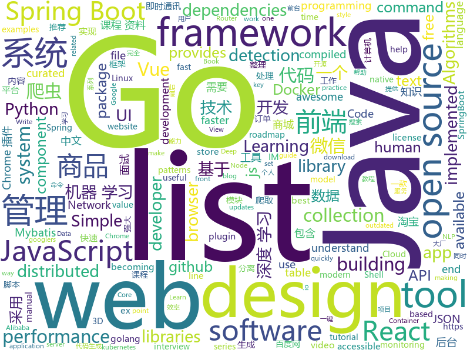

# 2019-04-21
See what the GitHub community is most excited about today.

## python
* [AiLearning](https://github.com/apachecn/AiLearning)(**297 stars today**): AiLearning: 机器学习 - MachineLearning - ML、深度学习 - DeepLearning - DL、自然语言处理 NLP
* [CornerNet-Lite](https://github.com/princeton-vl/CornerNet-Lite)(**153 stars today**): 
* [ChromeAppHeroes](https://github.com/zhaoolee/ChromeAppHeroes)(**154 stars today**): 🌈Chrome插件英雄榜, 为优秀的Chrome插件写一本中文说明书, 让Chrome插件英雄们造福人类~ ChromePluginHeroes, Write a Chinese manual for the excellent Chrome plugin, let the Chrome plugin heroes benefit the human~
* [requests3](https://github.com/kennethreitz/requests3)(**115 stars today**): Requests 3.0, for Humans and Machines, alike.🤖
* [gpt-2-simple](https://github.com/minimaxir/gpt-2-simple)(**78 stars today**): Python package to easily retrain OpenAI's GPT-2 text-generating model on new texts
* [spacy-course](https://github.com/ines/spacy-course)(**67 stars today**): 👩‍🏫Advanced NLP with spaCy: A free online course
* [models](https://github.com/tensorflow/models)(**40 stars today**): Models and examples built with TensorFlow
* [manim](https://github.com/3b1b/manim)(**50 stars today**): Animation engine for explanatory math videos
* [CenterNet](https://github.com/xingyizhou/CenterNet)(**49 stars today**): Object detection, 3D detection, and pose estimation using center point detection:
* [pyodide](https://github.com/iodide-project/pyodide)(**48 stars today**): The Python scientific stack, compiled to WebAssembly
* [system-design-primer](https://github.com/donnemartin/system-design-primer)(**42 stars today**): Learn how to design large-scale systems. Prep for the system design interview. Includes Anki flashcards.
* [eht-imaging](https://github.com/achael/eht-imaging)(**45 stars today**): Imaging, analysis, and simulation software for radio interferometry
* [awesome-python](https://github.com/vinta/awesome-python)(**40 stars today**): A curated list of awesome Python frameworks, libraries, software and resources
* [keras](https://github.com/keras-team/keras)(**38 stars today**): Deep Learning for humans
* [you-get](https://github.com/soimort/you-get)(**38 stars today**): ⏬Dumb downloader that scrapes the web
* [public-apis](https://github.com/toddmotto/public-apis)(**34 stars today**): A collective list of free APIs for use in software and web development.
* [snips-nlu](https://github.com/snipsco/snips-nlu)(**36 stars today**): Snips Python library to extract meaning from text
* [morph-net](https://github.com/google-research/morph-net)(**36 stars today**): Fast & Simple Resource-Constrained Learning of Deep Network Structure
* [Flappy-bird-deep-Q-learning-pytorch](https://github.com/vietnguyen91/Flappy-bird-deep-Q-learning-pytorch)(**32 stars today**): Deep Q-learning for playing flappy bird game
* [Osmedeus](https://github.com/j3ssie/Osmedeus)(**34 stars today**): Fully automated offensive security tool for reconnaissance and vulnerability scanning
* [youtube-dl](https://github.com/ytdl-org/youtube-dl)(**33 stars today**): Command-line program to download videos from YouTube.com and other video sites
* [Python](https://github.com/TheAlgorithms/Python)(**32 stars today**): All Algorithms implemented in Python
* [CenterNet](https://github.com/Duankaiwen/CenterNet)(**33 stars today**): Codes for our paper "CenterNet: Keypoint Triplets for Object Detection" .
* [camelot](https://github.com/socialcopsdev/camelot)(**34 stars today**): Camelot: PDF Table Extraction for Humans
* [examples-of-web-crawlers](https://github.com/shengqiangzhang/examples-of-web-crawlers)(**26 stars today**): python爬虫例子,对新手比较友好。淘宝模拟登录,淘宝商品爬虫,淘宝我已购买的宝贝爬虫,天猫商品爬虫,每天不同时间段通过微信发消息提醒女友,爬取5K分辨率超清唯美壁纸,爬取豆瓣排行榜电影数据(含GUI界面版),多线程+代理池爬取天天基金网、股票数据(无需使用爬虫框架),一键生成微信个人专属数据报告(了解你的微信社交历史)

## java
* [halo](https://github.com/halo-dev/halo)(**135 stars today**): ✍ Halo 可能是最好的 Java 博客系统
* [hutool](https://github.com/looly/hutool)(**94 stars today**): A set of tools that keep Java sweet.
* [JavaGuide](https://github.com/Snailclimb/JavaGuide)(**67 stars today**): 【Java学习+面试指南】 一份涵盖大部分Java程序员所需要掌握的核心知识。
* [Spring-Boot-In-Action](https://github.com/hansonwang99/Spring-Boot-In-Action)(**68 stars today**): Spring Boot 系列实战合集
* [HanLP](https://github.com/hankcs/HanLP)(**64 stars today**): 自然语言处理 中文分词 词性标注 命名实体识别 依存句法分析 新词发现 关键词短语提取 自动摘要 文本分类聚类 拼音简繁
* [spring-boot](https://github.com/spring-projects/spring-boot)(**42 stars today**): Spring Boot
* [advanced-java](https://github.com/doocs/advanced-java)(**52 stars today**): 😮互联网 Java 工程师进阶知识完全扫盲
* [mall](https://github.com/macrozheng/mall)(**44 stars today**): mall项目是一套电商系统，包括前台商城系统及后台管理系统，基于SpringBoot+MyBatis实现。 前台商城系统包含首页门户、商品推荐、商品搜索、商品展示、购物车、订单流程、会员中心、客户服务、帮助中心等模块。 后台管理系统包含商品管理、订单管理、会员管理、促销管理、运营管理、内容管理、统计报表、财务管理、权限管理、设置等模块。
* [ghidra](https://github.com/NationalSecurityAgency/ghidra)(**37 stars today**): Ghidra is a software reverse engineering (SRE) framework
* [server](https://github.com/wildfirechat/server)(**36 stars today**): 全开源即时通讯(IM)系统
* [litemall](https://github.com/linlinjava/litemall)(**30 stars today**): 又一个小商城。litemall = Spring Boot后端 + Vue管理员前端 + 微信小程序用户前端 + Vue用户移动端
* [java-design-patterns](https://github.com/iluwatar/java-design-patterns)(**27 stars today**): Design patterns implemented in Java
* [spring-framework](https://github.com/spring-projects/spring-framework)(**26 stars today**): Spring Framework
* [jeecg-boot](https://github.com/zhangdaiscott/jeecg-boot)(**26 stars today**): Jeecg-boot 是一款基于代码生成器的智能开发平台！采用前后端分离技术:SpringBoot，Mybatis，Shiro，JWT，Vue & Ant Design。提供强大的代码生成器， 前端页面和后台代码一键生成，不需要写任何代码，保持jeecg一贯的强大，绝对是全栈开发者福音！！ JeecgBoot的宗旨是降低前后端分离的开发成本，提高UI能力的同时提高开发效率，追求更高的能力，No代码概念，一系列智能化在线开发。
* [Java](https://github.com/TheAlgorithms/Java)(**24 stars today**): All Algorithms implemented in Java
* [spring-boot-examples](https://github.com/ityouknow/spring-boot-examples)(**23 stars today**): about learning Spring Boot via examples. Spring Boot 教程、技术栈示例代码，快速简单上手教程。
* [elasticsearch](https://github.com/elastic/elasticsearch)(**23 stars today**): Open Source, Distributed, RESTful Search Engine
* [tutorials](https://github.com/eugenp/tutorials)(**14 stars today**): The "REST With Spring" Course:
* [arthas](https://github.com/alibaba/arthas)(**23 stars today**): Alibaba Java Diagnostic Tool Arthas/Alibaba Java诊断利器Arthas
* [skywalking](https://github.com/apache/skywalking)(**24 stars today**): APM, Application Performance Monitoring System
* [guava](https://github.com/google/guava)(**21 stars today**): Google core libraries for Java
* [android-chat](https://github.com/wildfirechat/android-chat)(**19 stars today**): 全开源即时通讯(IM)系统 高仿微信
* [JCSprout](https://github.com/crossoverJie/JCSprout)(**19 stars today**): 👨‍🎓Java Core Sprout : basic, concurrent, algorithm
* [incubator-dubbo](https://github.com/apache/incubator-dubbo)(**15 stars today**): Apache Dubbo (incubating) is a high-performance, java based, open source RPC framework.
* [SpringBlade](https://github.com/chillzhuang/SpringBlade)(**20 stars today**): SpringBlade 是由一个商业级项目升级优化而来的SpringCloud微服务架构，采用Java8 API重构了业务代码，完全遵循阿里巴巴编码规范。采用Spring Boot 2 、Spring Cloud Finchley 、Mybatis 等核心技术，同时提供基于React和Vue的两个前端框架用于快速搭建企业级的SaaS微服务系统平台。 QQ群：477853168

## unknown
* [commit-messages-guide](https://github.com/RomuloOliveira/commit-messages-guide)(**1,021 stars today**): A guide to understand the importance of commit messages and how to write them well
* [golang-developer-roadmap](https://github.com/Alikhll/golang-developer-roadmap)(**191 stars today**): Roadmap to becoming a Go developer in 2019
* [git-tips](https://github.com/521xueweihan/git-tips)(**176 stars today**): Git的奇技淫巧
* [app-ideas](https://github.com/florinpop17/app-ideas)(**128 stars today**): A Collection of application ideas which can be used to improve your coding skills.
* [SJTU-Courses](https://github.com/CoolPhilChen/SJTU-Courses)(**110 stars today**): 上海交通大学课程资料分享
* [developer-roadmap](https://github.com/kamranahmedse/developer-roadmap)(**93 stars today**): Roadmap to becoming a web developer in 2019
* [weekly](https://github.com/aliyunfe/weekly)(**82 stars today**): 阿里云前端技术周刊
* [CS-Notes](https://github.com/CyC2018/CS-Notes)(**63 stars today**): 📚技术面试必备基础知识
* [955.WLB](https://github.com/formulahendry/955.WLB)(**56 stars today**): 955 不加班的公司名单 - 工作 955，work–life balance (工作与生活的平衡)
* [DeepLearning-500-questions](https://github.com/scutan90/DeepLearning-500-questions)(**53 stars today**): 深度学习500问，以问答形式对常用的概率知识、线性代数、机器学习、深度学习、计算机视觉等热点问题进行阐述，以帮助自己及有需要的读者。 全书分为18个章节，50余万字。由于水平有限，书中不妥之处恳请广大读者批评指正。 未完待续............ 如有意合作，联系scutjy2015@163.com 版权所有，违权必究 Tan 2018.06
* [Weekly-FE-Interview](https://github.com/airuikun/Weekly-FE-Interview)(**56 stars today**): 每周十道前端大厂面试题，并收集大家在大厂面试中遇到的难题，一起共同成长。
* [You-Dont-Know-JS](https://github.com/getify/You-Dont-Know-JS)(**50 stars today**): A book series on JavaScript. @YDKJS on twitter.
* [awesome-roadmaps](https://github.com/orsanawwad/awesome-roadmaps)(**49 stars today**): View roadmaps about developer roles to help you learn
* [awesome](https://github.com/sindresorhus/awesome)(**48 stars today**): 😎Awesome lists about all kinds of interesting topics
* [gitignore](https://github.com/github/gitignore)(**32 stars today**): A collection of useful .gitignore templates
* [Awesome-pytorch-list](https://github.com/bharathgs/Awesome-pytorch-list)(**47 stars today**): A comprehensive list of pytorch related content on github,such as different models,implementations,helper libraries,tutorials etc.
* [china_area_mysql](https://github.com/kakuilan/china_area_mysql)(**45 stars today**): 中国5级行政区域mysql库
* [SKU110K_CVPR19](https://github.com/eg4000/SKU110K_CVPR19)(**45 stars today**): 
* [free-programming-books](https://github.com/EbookFoundation/free-programming-books)(**38 stars today**): 📚Freely available programming books
* [coding-interview-university](https://github.com/jwasham/coding-interview-university)(**36 stars today**): A complete computer science study plan to become a software engineer.
* [xg2xg](https://github.com/jhuangtw-dev/xg2xg)(**36 stars today**): by ex-googlers, for ex-googlers - a lookup table of similar tech & services
* [free-programming-books-zh_CN](https://github.com/justjavac/free-programming-books-zh_CN)(**34 stars today**): 📚免费的计算机编程类中文书籍，欢迎投稿
* [the-book-of-secret-knowledge](https://github.com/trimstray/the-book-of-secret-knowledge)(**33 stars today**): A collection of inspiring lists, manuals, cheatsheets, blogs, hacks, one-liners, cli/web tools and more.
* [pumpkin-book](https://github.com/datawhalechina/pumpkin-book)(**27 stars today**): 《机器学习》（西瓜书）公式推导解析，在线阅读地址：https://datawhalechina.github.io/pumpkin-book
* [trackerslist](https://github.com/ngosang/trackerslist)(**29 stars today**): An updated list of public BitTorrent trackers

## javascript
* [mockit](https://github.com/boyney123/mockit)(**300 stars today**): A tool to quickly mock out end points, setup delays and more...
* [libpku](https://github.com/lib-pku/libpku)(**216 stars today**): 贵校课程资料民间整理
* [ikonate](https://github.com/mikolajdobrucki/ikonate)(**222 stars today**): fully customisable & accessible vector icons
* [tool](https://github.com/Louiszhai/tool)(**190 stars today**): 开发效率提升：Mac生产力工具链推荐
* [dsa.js](https://github.com/amejiarosario/dsa.js)(**165 stars today**): Data Structures and Algorithms explained and implemented in JavaScript
* [cxk-ball](https://github.com/kasuganosoras/cxk-ball)(**133 stars today**): Javascript 实现的 CXK 打篮球游戏
* [canvas-sketch](https://github.com/mattdesl/canvas-sketch)(**119 stars today**): [beta] A framework for making generative artwork in JavaScript and the browser.
* [React95](https://github.com/arturbien/React95)(**79 stars today**): 🌈🕹Refreshed Windows 95 style UI components for your React app
* [vue](https://github.com/vuejs/vue)(**71 stars today**): 🖖Vue.js is a progressive, incrementally-adoptable JavaScript framework for building UI on the web.
* [glicky](https://github.com/alex-saunders/glicky)(**57 stars today**): 🐭An in-browser task runner for modern web development
* [Awesome-Design-Tools](https://github.com/LisaDziuba/Awesome-Design-Tools)(**51 stars today**): The best design tools for everything👉
* [react](https://github.com/facebook/react)(**47 stars today**): A declarative, efficient, and flexible JavaScript library for building user interfaces.
* [bowser](https://github.com/lancedikson/bowser)(**52 stars today**): a browser detector
* [react-jsonschema-form](https://github.com/mozilla-services/react-jsonschema-form)(**50 stars today**): A React component for building Web forms from JSON Schema.
* [Motrix](https://github.com/agalwood/Motrix)(**47 stars today**): A full-featured download manager.
* [octotree](https://github.com/ovity/octotree)(**48 stars today**): GitHub code tree on steroids
* [axios](https://github.com/axios/axios)(**42 stars today**): Promise based HTTP client for the browser and node.js
* [reach-ui](https://github.com/reach/reach-ui)(**45 stars today**): The Accessible Foundation for React Apps and Design Systems.
* [30-seconds-of-code](https://github.com/30-seconds/30-seconds-of-code)(**39 stars today**): A curated collection of useful JavaScript snippets that you can understand in 30 seconds or less.
* [nodebestpractices](https://github.com/i0natan/nodebestpractices)(**41 stars today**): ✅The largest Node.js best practices list (April 2019)
* [three.js](https://github.com/mrdoob/three.js)(**35 stars today**): JavaScript 3D library.
* [material-ui](https://github.com/mui-org/material-ui)(**35 stars today**): React components for faster and easier web development. Build your own design system, or start with Material Design.
* [create-react-app](https://github.com/facebook/create-react-app)(**35 stars today**): Set up a modern web app by running one command.
* [react-native](https://github.com/facebook/react-native)(**35 stars today**): A framework for building native apps with React.
* [baiduyun](https://github.com/syhyz1990/baiduyun)(**35 stars today**): 油猴脚本 一个脚本搞定百度网盘下载

## html
* [zju-icicles](https://github.com/QSCTech/zju-icicles)(**168 stars today**): 浙江大学课程攻略共享计划
* [front-end-handbook-2019](https://github.com/FrontendMasters/front-end-handbook-2019)(**57 stars today**): [Book] 2019 edition of our front-end development handbook
* [MikuTools](https://github.com/Ice-Hazymoon/MikuTools)(**35 stars today**): 一个轻量的工具集合
* [nndl.github.io](https://github.com/nndl/nndl.github.io)(**31 stars today**): 《神经网络与深度学习》 Neural Network and Deep Learning
* [OUCML](https://github.com/OUCMachineLearning/OUCML)(**25 stars today**): 
* [styleguide](https://github.com/google/styleguide)(**18 stars today**): Style guides for Google-originated open-source projects
* [water.css](https://github.com/kognise/water.css)(**17 stars today**): A just-add-css collection of styles to make simple websites just a little nicer
* [lib-pku.github.io](https://github.com/lib-pku/lib-pku.github.io)(**13 stars today**): 北京大学课程资料整理
* [JavaScript30](https://github.com/wesbos/JavaScript30)(**11 stars today**): 30 Day Vanilla JS Challenge
* [CLRS](https://github.com/walkccc/CLRS)(**13 stars today**): 📚Solutions to Introduction to Algorithms Third Edition
* [en.javascript.info](https://github.com/javascript-tutorial/en.javascript.info)(**13 stars today**): Modern JavaScript Tutorial
* [Coursera-ML-AndrewNg-Notes](https://github.com/fengdu78/Coursera-ML-AndrewNg-Notes)(**12 stars today**): 吴恩达老师的机器学习课程个人笔记
* [personal-website](https://github.com/github/personal-website)(**7 stars today**): Code that'll help you kickstart a personal website that showcases your work as a software developer.
* [Spoon-Knife](https://github.com/octocat/Spoon-Knife)(****): This repo is for demonstration purposes only.
* [linux-command](https://github.com/jaywcjlove/linux-command)(**9 stars today**): Linux命令大全搜索工具，内容包含Linux命令手册、详解、学习、搜集。https://git.io/linux
* [Front-end-Developer-Interview-Questions](https://github.com/h5bp/Front-end-Developer-Interview-Questions)(**9 stars today**): A list of helpful front-end related questions you can use to interview potential candidates, test yourself or completely ignore.
* [qiubaiying.github.io](https://github.com/qiubaiying/qiubaiying.github.io)(**6 stars today**): BY Blog ->
* [fastText](https://github.com/facebookresearch/fastText)(**7 stars today**): Library for fast text representation and classification.
* [nginxconfig.io](https://github.com/valentinxxx/nginxconfig.io)(**7 stars today**): ⚙️NGiИX config generator on steroids💉
* [portainer](https://github.com/portainer/portainer)(**7 stars today**): Simple management UI for Docker
* [fonts](https://github.com/google/fonts)(**7 stars today**): Font files available from Google Fonts
* [electron-api-demos](https://github.com/electron/electron-api-demos)(**5 stars today**): Explore the Electron APIs
* [TranslatorX](https://github.com/pingfangx/TranslatorX)(**6 stars today**): JetBrains 系列软件汉化包
* [MIXBOX](https://github.com/monlor/MIXBOX)(**6 stars today**): 一款基于Shell的小米路由器工具箱，原为Monlor-Tools，A tool box for XiaoMi Router base on Shell.
* [CVE-2018-18500](https://github.com/sophoslabs/CVE-2018-18500)(**6 stars today**): PoC for CVE-2018-18500 - Firefox Use-After-Free

## go
* [go-patterns](https://github.com/tmrts/go-patterns)(**362 stars today**): Curated list of Go design patterns, recipes and idioms
* [sshcode](https://github.com/codercom/sshcode)(**69 stars today**): Run VS Code on any server over SSH.
* [kustomize](https://github.com/kubernetes-sigs/kustomize)(**67 stars today**): Customization of kubernetes YAML configurations
* [kubernetes](https://github.com/kubernetes/kubernetes)(**33 stars today**): Production-Grade Container Scheduling and Management
* [jingo](https://github.com/bet365/jingo)(**39 stars today**): This package provides the ability to encode golang structs to a buffer as JSON very quickly.
* [fabrikate](https://github.com/Microsoft/fabrikate)(**35 stars today**): Tooling to make GitOps with Kubernetes more productive
* [BaiduPCS-Go](https://github.com/iikira/BaiduPCS-Go)(**33 stars today**): 百度网盘客户端 - Go语言编写
* [docker-slim](https://github.com/docker-slim/docker-slim)(**31 stars today**): DockerSlim (docker-slim): Don't change anything in your Docker container image and minify it by up to 30x (and for compiled languages even more) making it secure too! (free and open source)
* [minikeyvalue](https://github.com/geohot/minikeyvalue)(**31 stars today**): A distributed key value store in under 200 lines
* [go](https://github.com/golang/go)(**28 stars today**): The Go programming language
* [awesome-go](https://github.com/avelino/awesome-go)(**27 stars today**): A curated list of awesome Go frameworks, libraries and software
* [gin](https://github.com/gin-gonic/gin)(**28 stars today**): Gin is a HTTP web framework written in Go (Golang). It features a Martini-like API with much better performance -- up to 40 times faster. If you need smashing performance, get yourself some Gin.
* [go-mod-outdated](https://github.com/psampaz/go-mod-outdated)(**24 stars today**): An easy way to find outdated dependencies of your Go projects. go-mod-outdated provides a table view of the go list -u -m -json all command which lists all dependencies of a Go project and their available minor and patch updates. It also provides a way to filter indirect dependencies and dependencies without updates.
* [v](https://github.com/vlang/v)(**21 stars today**): Simple, fast, safe, compiled language for creating maintainable software. Supports translation from C/C++.
* [etcd](https://github.com/etcd-io/etcd)(**19 stars today**): Distributed reliable key-value store for the most critical data of a distributed system
* [v2ray-core](https://github.com/v2ray/v2ray-core)(**18 stars today**): A platform for building proxies to bypass network restrictions.
* [fzf](https://github.com/junegunn/fzf)(**20 stars today**): 🌸A command-line fuzzy finder
* [beego](https://github.com/astaxie/beego)(**19 stars today**): beego is an open-source, high-performance web framework for the Go programming language.
* [traefik](https://github.com/containous/traefik)(**18 stars today**): The Cloud Native Edge Router
* [revive](https://github.com/mgechev/revive)(**18 stars today**): 🔥~6x faster, stricter, configurable, extensible, and beautiful drop-in replacement for golint.
* [syncthing](https://github.com/syncthing/syncthing)(**18 stars today**): Open Source Continuous File Synchronization
* [miniredis](https://github.com/alicebob/miniredis)(**18 stars today**): Pure Go Redis server for Go unittests
* [licensecheck](https://github.com/google/licensecheck)(**18 stars today**): The licensecheck package classifies license files and heuristically determines how well they correspond to known open source licenses.
* [prometheus](https://github.com/prometheus/prometheus)(**15 stars today**): The Prometheus monitoring system and time series database.
* [docker_practice](https://github.com/yeasy/docker_practice)(**15 stars today**): Learn and understand Docker technologies, with real DevOps practice!

## WordCloud

