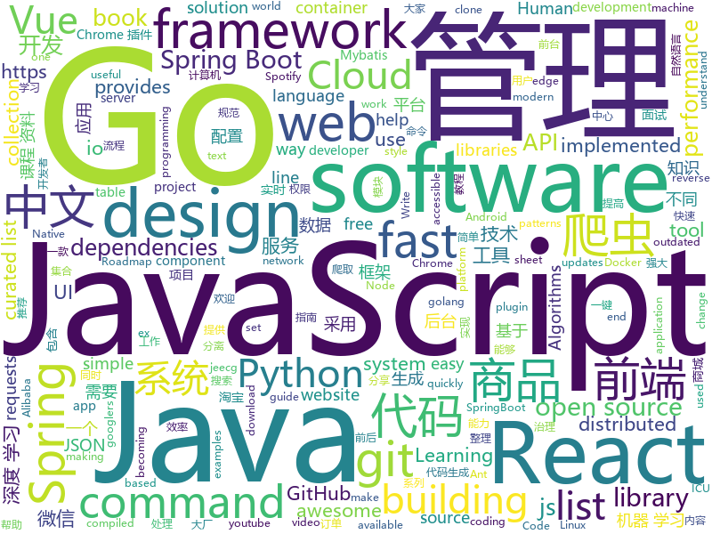

# 2019-04-22
See what the GitHub community is most excited about today.

## python
* [AiLearning](https://github.com/apachecn/AiLearning)(**235 stars today**): AiLearning: 机器学习 - MachineLearning - ML、深度学习 - DeepLearning - DL、自然语言处理 NLP
* [Photon](https://github.com/s0md3v/Photon)(**129 stars today**): Incredibly fast crawler designed for OSINT.
* [requests3](https://github.com/kennethreitz/requests3)(**130 stars today**): Requests 3.0, for Humans and Machines, alike.🤖
* [ChromeAppHeroes](https://github.com/zhaoolee/ChromeAppHeroes)(**112 stars today**): 🌈Chrome插件英雄榜, 为优秀的Chrome插件写一本中文说明书, 让Chrome插件英雄们造福人类~ ChromePluginHeroes, Write a Chinese manual for the excellent Chrome plugin, let the Chrome plugin heroes benefit the human~
* [CornerNet-Lite](https://github.com/princeton-vl/CornerNet-Lite)(**105 stars today**): 
* [examples-of-web-crawlers](https://github.com/shengqiangzhang/examples-of-web-crawlers)(**70 stars today**): python爬虫例子,对新手比较友好。淘宝模拟登录,淘宝商品爬虫,淘宝我已购买的宝贝爬虫,天猫商品爬虫,每天不同时间段通过微信发消息提醒女友,爬取5K分辨率超清唯美壁纸,爬取豆瓣排行榜电影数据(含GUI界面版),多线程+代理池爬取天天基金网、股票数据(无需使用爬虫框架),一键生成微信个人专属数据报告(了解你的微信社交历史)
* [hncynic](https://github.com/leod/hncynic)(**71 stars today**): Generate Hacker News Comments from Titles
* [awesome-python](https://github.com/vinta/awesome-python)(**60 stars today**): A curated list of awesome Python frameworks, libraries, software and resources
* [models](https://github.com/tensorflow/models)(**47 stars today**): Models and examples built with TensorFlow
* [manim](https://github.com/3b1b/manim)(**53 stars today**): Animation engine for explanatory math videos
* [system-design-primer](https://github.com/donnemartin/system-design-primer)(**45 stars today**): Learn how to design large-scale systems. Prep for the system design interview. Includes Anki flashcards.
* [Python](https://github.com/TheAlgorithms/Python)(**38 stars today**): All Algorithms implemented in Python
* [huawei-block-list](https://github.com/pe3zx/huawei-block-list)(**45 stars today**): Captured DNS requests from Huawei P30 Pro to a block list
* [snips-nlu](https://github.com/snipsco/snips-nlu)(**44 stars today**): Snips Python library to extract meaning from text
* [you-get](https://github.com/soimort/you-get)(**41 stars today**): ⏬Dumb downloader that scrapes the web
* [public-apis](https://github.com/toddmotto/public-apis)(**36 stars today**): A collective list of free APIs for use in software and web development.
* [camelot](https://github.com/socialcopsdev/camelot)(**34 stars today**): Camelot: PDF Table Extraction for Humans
* [keras](https://github.com/keras-team/keras)(**30 stars today**): Deep Learning for humans
* [youtube-dl](https://github.com/ytdl-org/youtube-dl)(**30 stars today**): Command-line program to download videos from YouTube.com and other video sites
* [fireELF](https://github.com/rek7/fireELF)(**31 stars today**): Fileless Linux Malware Framework
* [XSStrike](https://github.com/s0md3v/XSStrike)(**31 stars today**): Most advanced XSS scanner.
* [spacy-course](https://github.com/ines/spacy-course)(**30 stars today**): 👩‍🏫Advanced NLP with spaCy: A free online course
* [face_recognition](https://github.com/ageitgey/face_recognition)(**28 stars today**): The world's simplest facial recognition api for Python and the command line
* [cheat.sh](https://github.com/chubin/cheat.sh)(**30 stars today**): the only cheat sheet you need
* [jumpcutter](https://github.com/carykh/jumpcutter)(**29 stars today**): Automatically edits vidx. Explanation here: https://www.youtube.com/watch?v=DQ8orIurGxw

## java
* [halo](https://github.com/halo-dev/halo)(**112 stars today**): ✍ Halo 可能是最好的 Java 博客系统
* [JavaGuide](https://github.com/Snailclimb/JavaGuide)(**86 stars today**): 【Java学习+面试指南】 一份涵盖大部分Java程序员所需要掌握的核心知识。
* [HanLP](https://github.com/hankcs/HanLP)(**68 stars today**): 自然语言处理 中文分词 词性标注 命名实体识别 依存句法分析 新词发现 关键词短语提取 自动摘要 文本分类聚类 拼音简繁
* [hutool](https://github.com/looly/hutool)(**65 stars today**): A set of tools that keep Java sweet.
* [advanced-java](https://github.com/doocs/advanced-java)(**47 stars today**): 😮互联网 Java 工程师进阶知识完全扫盲
* [Spring-Boot-In-Action](https://github.com/hansonwang99/Spring-Boot-In-Action)(**42 stars today**): Spring Boot 系列实战合集
* [spring-boot](https://github.com/spring-projects/spring-boot)(**30 stars today**): Spring Boot
* [java-design-patterns](https://github.com/iluwatar/java-design-patterns)(**33 stars today**): Design patterns implemented in Java
* [SpringBlade](https://github.com/chillzhuang/SpringBlade)(**33 stars today**): SpringBlade 是由一个商业级项目升级优化而来的SpringCloud微服务架构，采用Java8 API重构了业务代码，完全遵循阿里巴巴编码规范。采用Spring Boot 2 、Spring Cloud Finchley 、Mybatis 等核心技术，同时提供基于React和Vue的两个前端框架用于快速搭建企业级的SaaS微服务系统平台。 QQ群：477853168
* [spring-boot-examples](https://github.com/ityouknow/spring-boot-examples)(**25 stars today**): about learning Spring Boot via examples. Spring Boot 教程、技术栈示例代码，快速简单上手教程。
* [mall](https://github.com/macrozheng/mall)(**20 stars today**): mall项目是一套电商系统，包括前台商城系统及后台管理系统，基于SpringBoot+MyBatis实现。 前台商城系统包含首页门户、商品推荐、商品搜索、商品展示、购物车、订单流程、会员中心、客户服务、帮助中心等模块。 后台管理系统包含商品管理、订单管理、会员管理、促销管理、运营管理、内容管理、统计报表、财务管理、权限管理、设置等模块。
* [spring-framework](https://github.com/spring-projects/spring-framework)(**20 stars today**): Spring Framework
* [elasticsearch](https://github.com/elastic/elasticsearch)(**24 stars today**): Open Source, Distributed, RESTful Search Engine
* [ghidra](https://github.com/NationalSecurityAgency/ghidra)(**25 stars today**): Ghidra is a software reverse engineering (SRE) framework
* [spring-cloud-alibaba](https://github.com/spring-cloud-incubator/spring-cloud-alibaba)(**24 stars today**): Spring Cloud Alibaba provides a one-stop solution for application development for the distributed solutions of Alibaba middleware.
* [buck](https://github.com/facebook/buck)(**25 stars today**): A fast build system that encourages the creation of small, reusable modules over a variety of platforms and languages.
* [incubator-dubbo](https://github.com/apache/incubator-dubbo)(**19 stars today**): Apache Dubbo (incubating) is a high-performance, java based, open source RPC framework.
* [Java](https://github.com/TheAlgorithms/Java)(**19 stars today**): All Algorithms implemented in Java
* [guava](https://github.com/google/guava)(**19 stars today**): Google core libraries for Java
* [litemall](https://github.com/linlinjava/litemall)(**18 stars today**): 又一个小商城。litemall = Spring Boot后端 + Vue管理员前端 + 微信小程序用户前端 + Vue用户移动端
* [seata](https://github.com/seata/seata)(**19 stars today**): 🔥Seata is an easy-to-use, high-performance, java based, open source distributed transaction solution.
* [tutorials](https://github.com/eugenp/tutorials)(**7 stars today**): The "REST With Spring" Course:
* [Moss](https://github.com/SpringCloud/Moss)(**15 stars today**): Moss(莫斯)-Spring Cloud体系的服务治理平台，让Spring Cloud应用不再流浪！欢迎Star！
* [apollo](https://github.com/ctripcorp/apollo)(**14 stars today**): Apollo（阿波罗）是携程框架部门研发的分布式配置中心，能够集中化管理应用不同环境、不同集群的配置，配置修改后能够实时推送到应用端，并且具备规范的权限、流程治理等特性，适用于微服务配置管理场景。
* [jeecg-boot](https://github.com/zhangdaiscott/jeecg-boot)(**15 stars today**): Jeecg-boot 是一款基于代码生成器的智能开发平台！采用前后端分离技术:SpringBoot，Mybatis，Shiro，JWT，Vue & Ant Design。提供强大的代码生成器， 前端页面和后台代码一键生成，不需要写任何代码，保持jeecg一贯的强大，绝对是全栈开发者福音！！ JeecgBoot的宗旨是降低前后端分离的开发成本，提高UI能力的同时提高开发效率，追求更高的能力，No代码概念，一系列智能化在线开发。

## unknown
* [commit-messages-guide](https://github.com/RomuloOliveira/commit-messages-guide)(**612 stars today**): A guide to understand the importance of commit messages and how to write them well
* [git-tips](https://github.com/521xueweihan/git-tips)(**254 stars today**): Git的奇技淫巧
* [app-ideas](https://github.com/florinpop17/app-ideas)(**212 stars today**): A Collection of application ideas which can be used to improve your coding skills.
* [golang-developer-roadmap](https://github.com/Alikhll/golang-developer-roadmap)(**174 stars today**): Roadmap to becoming a Go developer in 2019
* [SJTU-Courses](https://github.com/CoolPhilChen/SJTU-Courses)(**91 stars today**): 上海交通大学课程资料分享
* [developer-roadmap](https://github.com/kamranahmedse/developer-roadmap)(**80 stars today**): Roadmap to becoming a web developer in 2019
* [weekly](https://github.com/aliyunfe/weekly)(**74 stars today**): 阿里云前端技术周刊
* [awesome](https://github.com/sindresorhus/awesome)(**66 stars today**): 😎Awesome lists about all kinds of interesting topics
* [CS-Notes](https://github.com/CyC2018/CS-Notes)(**56 stars today**): 📚技术面试必备基础知识
* [gitignore](https://github.com/github/gitignore)(**49 stars today**): A collection of useful .gitignore templates
* [Weekly-FE-Interview](https://github.com/airuikun/Weekly-FE-Interview)(**51 stars today**): 每周十道前端大厂面试题，并收集大家在大厂面试中遇到的难题，一起共同成长。
* [955.WLB](https://github.com/formulahendry/955.WLB)(**49 stars today**): 955 不加班的公司名单 - 工作 955，work–life balance (工作与生活的平衡)
* [coding-interview-university](https://github.com/jwasham/coding-interview-university)(**40 stars today**): A complete computer science study plan to become a software engineer.
* [You-Dont-Know-JS](https://github.com/getify/You-Dont-Know-JS)(**42 stars today**): A book series on JavaScript. @YDKJS on twitter.
* [pumpkin-book](https://github.com/datawhalechina/pumpkin-book)(**44 stars today**): 《机器学习》（西瓜书）公式推导解析，在线阅读地址：https://datawhalechina.github.io/pumpkin-book
* [free-programming-books](https://github.com/EbookFoundation/free-programming-books)(**35 stars today**): 📚Freely available programming books
* [awesome-spider](https://github.com/facert/awesome-spider)(**36 stars today**): 爬虫集合
* [chinese-independent-developer](https://github.com/1c7/chinese-independent-developer)(**39 stars today**): 👩🏿‍💻👨🏾‍💻👩🏼‍💻👨🏽‍💻👩🏻‍💻中国独立开发者项目列表 -- 分享大家都在做什么
* [free-programming-books-zh_CN](https://github.com/justjavac/free-programming-books-zh_CN)(**32 stars today**): 📚免费的计算机编程类中文书籍，欢迎投稿
* [xg2xg](https://github.com/jhuangtw-dev/xg2xg)(**34 stars today**): by ex-googlers, for ex-googlers - a lookup table of similar tech & services
* [DeepLearning-500-questions](https://github.com/scutan90/DeepLearning-500-questions)(**27 stars today**): 深度学习500问，以问答形式对常用的概率知识、线性代数、机器学习、深度学习、计算机视觉等热点问题进行阐述，以帮助自己及有需要的读者。 全书分为18个章节，50余万字。由于水平有限，书中不妥之处恳请广大读者批评指正。 未完待续............ 如有意合作，联系scutjy2015@163.com 版权所有，违权必究 Tan 2018.06
* [SKU110K_CVPR19](https://github.com/eg4000/SKU110K_CVPR19)(**29 stars today**): 
* [Awesome-Mobile-Machine-Learning](https://github.com/fritzlabs/Awesome-Mobile-Machine-Learning)(**29 stars today**): A curated list of awesome mobile machine learning resources for iOS, Android, and edge devices.
* [issue-tracker-zh](https://github.com/haochaco/issue-tracker-zh)(**30 stars today**): 中文GitHub反馈区
* [hosts](https://github.com/googlehosts/hosts)(**22 stars today**): 镜像：https://coding.net/u/scaffrey/p/hosts/git

## javascript
* [tool](https://github.com/Louiszhai/tool)(**313 stars today**): 开发效率提升：Mac生产力工具链推荐
* [libpku](https://github.com/lib-pku/libpku)(**194 stars today**): 贵校课程资料民间整理
* [mockit](https://github.com/boyney123/mockit)(**210 stars today**): A tool to quickly mock out end points, setup delays and more...
* [ikonate](https://github.com/mikolajdobrucki/ikonate)(**147 stars today**): fully customisable & accessible vector icons
* [dsa.js](https://github.com/amejiarosario/dsa.js)(**118 stars today**): Data Structures and Algorithms explained and implemented in JavaScript
* [canvas-sketch](https://github.com/mattdesl/canvas-sketch)(**92 stars today**): [beta] A framework for making generative artwork in JavaScript and the browser.
* [vue](https://github.com/vuejs/vue)(**75 stars today**): 🖖Vue.js is a progressive, incrementally-adoptable JavaScript framework for building UI on the web.
* [spotless](https://github.com/phandd/spotless)(**84 stars today**): Too lazy to navigate to Spotify when you want to change your music? Spotless is here to help you controlling Spotify effortless!
* [cxk-ball](https://github.com/kasuganosoras/cxk-ball)(**73 stars today**): Javascript 实现的 CXK 打篮球游戏
* [bowser](https://github.com/lancedikson/bowser)(**73 stars today**): a browser detector
* [Expo-Crossy-Road](https://github.com/EvanBacon/Expo-Crossy-Road)(**63 stars today**): 🐥🚙Crossy Road game clone made in Expo (iOS, Android), THREE.js, Tween, React Native.🐔
* [react](https://github.com/facebook/react)(**54 stars today**): A declarative, efficient, and flexible JavaScript library for building user interfaces.
* [30-seconds-of-code](https://github.com/30-seconds/30-seconds-of-code)(**55 stars today**): A curated collection of useful JavaScript snippets that you can understand in 30 seconds or less.
* [octotree](https://github.com/ovity/octotree)(**56 stars today**): GitHub code tree on steroids
* [Motrix](https://github.com/agalwood/Motrix)(**49 stars today**): A full-featured download manager.
* [React95](https://github.com/arturbien/React95)(**53 stars today**): 🌈🕹Refreshed Windows 95 style UI components for your React app
* [Awesome-Design-Tools](https://github.com/LisaDziuba/Awesome-Design-Tools)(**45 stars today**): The best design tools for everything👉
* [antd-visual-editor](https://github.com/xinyu198736/antd-visual-editor)(**43 stars today**): ant-design 组件库实时可视化编辑器，实时生成 react 代码
* [realworld](https://github.com/gothinkster/realworld)(**45 stars today**): "The mother of all demo apps" — Exemplary fullstack Medium.com clone powered by React, Angular, Node, Django, and many more🏅
* [react-jsonschema-form](https://github.com/mozilla-services/react-jsonschema-form)(**42 stars today**): A React component for building Web forms from JSON Schema.
* [reach-ui](https://github.com/reach/reach-ui)(**41 stars today**): The Accessible Foundation for React Apps and Design Systems.
* [create-react-app](https://github.com/facebook/create-react-app)(**35 stars today**): Set up a modern web app by running one command.
* [996.TSC](https://github.com/lxlxw/996.TSC)(**37 stars today**): 996.ICU周边文化 | 创意板块(主站：996.ICU)
* [three.js](https://github.com/mrdoob/three.js)(**32 stars today**): JavaScript 3D library.
* [node](https://github.com/nodejs/node)(**33 stars today**): Node.js JavaScript runtime✨🐢🚀✨

## html
* [zju-icicles](https://github.com/QSCTech/zju-icicles)(**126 stars today**): 浙江大学课程攻略共享计划
* [front-end-handbook-2019](https://github.com/FrontendMasters/front-end-handbook-2019)(**57 stars today**): [Book] 2019 edition of our front-end development handbook
* [py4e](https://github.com/csev/py4e)(**52 stars today**): Web site for www.py4e.com and source to the Python 3.0 textbook
* [water.css](https://github.com/kognise/water.css)(**31 stars today**): A just-add-css collection of styles to make simple websites just a little nicer
* [styleguide](https://github.com/google/styleguide)(**24 stars today**): Style guides for Google-originated open-source projects
* [nndl.github.io](https://github.com/nndl/nndl.github.io)(**22 stars today**): 《神经网络与深度学习》 Neural Network and Deep Learning
* [OUCML](https://github.com/OUCMachineLearning/OUCML)(**21 stars today**): 
* [MikuTools](https://github.com/Ice-Hazymoon/MikuTools)(**20 stars today**): 一个轻量的工具集合
* [en.javascript.info](https://github.com/javascript-tutorial/en.javascript.info)(**21 stars today**): Modern JavaScript Tutorial
* [subspace](https://github.com/subspacecloud/subspace)(**21 stars today**): A simple WireGuard VPN server GUI
* [training-kit](https://github.com/github/training-kit)(**11 stars today**): Open source cheat sheets for Git and GitHub
* [JavaScript30](https://github.com/wesbos/JavaScript30)(**10 stars today**): 30 Day Vanilla JS Challenge
* [linux-command](https://github.com/jaywcjlove/linux-command)(**12 stars today**): Linux命令大全搜索工具，内容包含Linux命令手册、详解、学习、搜集。https://git.io/linux
* [requests-html](https://github.com/kennethreitz/requests-html)(**12 stars today**): Pythonic HTML Parsing for Humans™
* [TranslatorX](https://github.com/pingfangx/TranslatorX)(**11 stars today**): JetBrains 系列软件汉化包
* [Spoon-Knife](https://github.com/octocat/Spoon-Knife)(****): This repo is for demonstration purposes only.
* [portainer](https://github.com/portainer/portainer)(**9 stars today**): Simple management UI for Docker
* [personal-website](https://github.com/github/personal-website)(**7 stars today**): Code that'll help you kickstart a personal website that showcases your work as a software developer.
* [polymer](https://github.com/Polymer/polymer)(**9 stars today**): Our original Web Component library.
* [ecma262](https://github.com/tc39/ecma262)(**8 stars today**): Status, process, and documents for ECMA262
* [lib-pku.github.io](https://github.com/lib-pku/lib-pku.github.io)(**8 stars today**): 北京大学课程资料整理
* [privacytools.io](https://github.com/privacytoolsIO/privacytools.io)(**8 stars today**): 🛡️encryption against global mass surveillance
* [fastText](https://github.com/facebookresearch/fastText)(**7 stars today**): Library for fast text representation and classification.
* [autoEDA-resources](https://github.com/mstaniak/autoEDA-resources)(**7 stars today**): A list of software and papers related to automatic/fast Exploratory Data Analysis
* [electron-api-demos](https://github.com/electron/electron-api-demos)(**7 stars today**): Explore the Electron APIs

## go
* [sshcode](https://github.com/codercom/sshcode)(**282 stars today**): Run VS Code on any server over SSH.
* [go-patterns](https://github.com/tmrts/go-patterns)(**256 stars today**): Curated list of Go design patterns, recipes and idioms
* [hub](https://github.com/github/hub)(**142 stars today**): A command-line tool that makes git easier to use with GitHub.
* [go](https://github.com/golang/go)(**55 stars today**): The Go programming language
* [kubernetes](https://github.com/kubernetes/kubernetes)(**42 stars today**): Production-Grade Container Scheduling and Management
* [awesome-go](https://github.com/avelino/awesome-go)(**34 stars today**): A curated list of awesome Go frameworks, libraries and software
* [BaiduPCS-Go](https://github.com/iikira/BaiduPCS-Go)(**31 stars today**): 百度网盘客户端 - Go语言编写
* [jingo](https://github.com/bet365/jingo)(**31 stars today**): This package provides the ability to encode golang structs to a buffer as JSON very quickly.
* [minikeyvalue](https://github.com/geohot/minikeyvalue)(**31 stars today**): A distributed key value store in under 200 lines
* [gin](https://github.com/gin-gonic/gin)(**30 stars today**): Gin is a HTTP web framework written in Go (Golang). It features a Martini-like API with much better performance -- up to 40 times faster. If you need smashing performance, get yourself some Gin.
* [gitea](https://github.com/go-gitea/gitea)(**28 stars today**): Git with a cup of tea, painless self-hosted git service
* [requests](https://github.com/xuanbo/requests)(**28 stars today**): http requests lib for golang
* [hugo](https://github.com/gohugoio/hugo)(**26 stars today**): The world’s fastest framework for building websites.
* [v2ray-core](https://github.com/v2ray/v2ray-core)(**22 stars today**): A platform for building proxies to bypass network restrictions.
* [the-way-to-go_ZH_CN](https://github.com/Unknwon/the-way-to-go_ZH_CN)(**22 stars today**): 《The Way to Go》中文译本，中文正式名《Go 入门指南》
* [frp](https://github.com/fatedier/frp)(**19 stars today**): A fast reverse proxy to help you expose a local server behind a NAT or firewall to the internet.
* [kustomize](https://github.com/kubernetes-sigs/kustomize)(**19 stars today**): Customization of kubernetes YAML configurations
* [v](https://github.com/vlang/v)(**18 stars today**): Simple, fast, safe, compiled language for creating maintainable software. Supports translation from C/C++.
* [syncthing](https://github.com/syncthing/syncthing)(**19 stars today**): Open Source Continuous File Synchronization
* [libpod](https://github.com/containers/libpod)(**18 stars today**): libpod is a library used to create container pods. Home of Podman.
* [fzf](https://github.com/junegunn/fzf)(**17 stars today**): 🌸A command-line fuzzy finder
* [chaosblade](https://github.com/chaosblade-io/chaosblade)(**17 stars today**): An easy to use and powerful chaos engineering experiment toolkit.（一款简单易用、功能强大的混沌实验注入工具）
* [traefik](https://github.com/containous/traefik)(**14 stars today**): The Cloud Native Edge Router
* [docker-slim](https://github.com/docker-slim/docker-slim)(**16 stars today**): DockerSlim (docker-slim): Don't change anything in your Docker container image and minify it by up to 30x (and for compiled languages even more) making it secure too! (free and open source)
* [go-mod-outdated](https://github.com/psampaz/go-mod-outdated)(**15 stars today**): An easy way to find outdated dependencies of your Go projects. go-mod-outdated provides a table view of the go list -u -m -json all command which lists all dependencies of a Go project and their available minor and patch updates. It also provides a way to filter indirect dependencies and dependencies without updates.

## WordCloud

