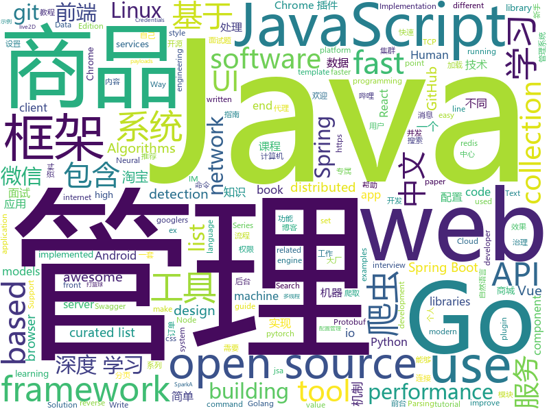

# 2019-04-23
See what the GitHub community is most excited about today.

## python
* [PySnooper](https://github.com/cool-RR/PySnooper)(**2,369 stars today**): Never use print for debugging again
* [manim](https://github.com/3b1b/manim)(**1,106 stars today**): Animation engine for explanatory math videos
* [AiLearning](https://github.com/apachecn/AiLearning)(**499 stars today**): AiLearning: 机器学习 - MachineLearning - ML、深度学习 - DeepLearning - DL、自然语言处理 NLP
* [Python-100-Days](https://github.com/jackfrued/Python-100-Days)(**270 stars today**): Python - 100天从新手到大师
* [ChromeAppHeroes](https://github.com/zhaoolee/ChromeAppHeroes)(**234 stars today**): 🌈Chrome插件英雄榜, 为优秀的Chrome插件写一本中文说明书, 让Chrome插件英雄们造福人类~ ChromePluginHeroes, Write a Chinese manual for the excellent Chrome plugin, let the Chrome plugin heroes benefit the human~
* [CornerNet-Lite](https://github.com/princeton-vl/CornerNet-Lite)(**183 stars today**): 
* [examples-of-web-crawlers](https://github.com/shengqiangzhang/examples-of-web-crawlers)(**110 stars today**): python爬虫例子,对新手比较友好。淘宝模拟登录,淘宝商品爬虫,淘宝我已购买的宝贝爬虫,天猫商品爬虫,每天不同时间段通过微信发消息提醒女友,爬取5K分辨率超清唯美壁纸,爬取豆瓣排行榜电影数据(含GUI界面版),多线程+代理池爬取天天基金网、股票数据(无需使用爬虫框架),一键生成微信个人专属数据报告(了解你的微信社交历史)
* [Photon](https://github.com/s0md3v/Photon)(**115 stars today**): Incredibly fast crawler designed for OSINT.
* [viewgen](https://github.com/0xacb/viewgen)(**115 stars today**): viewgen is a ViewState tool capable of generating both signed and encrypted payloads with leaked validation keys
* [models](https://github.com/tensorflow/models)(**82 stars today**): Models and examples built with TensorFlow
* [requests3](https://github.com/kennethreitz/requests3)(**101 stars today**): Requests 3.0, for Humans and Machines, alike.🤖
* [huawei-block-list](https://github.com/pe3zx/huawei-block-list)(**97 stars today**): Captured DNS requests from Huawei P30 Pro to a block list
* [segmentation_models.pytorch](https://github.com/qubvel/segmentation_models.pytorch)(**92 stars today**): Segmentation models with pretrained backbones. PyTorch.
* [koalas](https://github.com/databricks/koalas)(**91 stars today**): Koalas: Pandas API on Apache Spark
* [public-apis](https://github.com/toddmotto/public-apis)(**77 stars today**): A collective list of free APIs for use in software and web development.
* [system-design-primer](https://github.com/donnemartin/system-design-primer)(**70 stars today**): Learn how to design large-scale systems. Prep for the system design interview. Includes Anki flashcards.
* [Python](https://github.com/TheAlgorithms/Python)(**60 stars today**): All Algorithms implemented in Python
* [awesome-python](https://github.com/vinta/awesome-python)(**59 stars today**): A curated list of awesome Python frameworks, libraries, software and resources
* [CheatSheetSeries](https://github.com/OWASP/CheatSheetSeries)(**60 stars today**): The OWASP Cheat Sheet Series was created to provide a concise collection of high value information on specific application security topics.
* [mlflow](https://github.com/mlflow/mlflow)(**62 stars today**): Open source platform for the machine learning lifecycle
* [CenterNet](https://github.com/Duankaiwen/CenterNet)(**58 stars today**): Codes for our paper "CenterNet: Keypoint Triplets for Object Detection" .
* [LaZagne](https://github.com/AlessandroZ/LaZagne)(**50 stars today**): Credentials recovery project
* [CenterNet](https://github.com/xingyizhou/CenterNet)(**50 stars today**): Object detection, 3D detection, and pose estimation using center point detection:
* [AutoDeeplab](https://github.com/MenghaoGuo/AutoDeeplab)(**50 stars today**): Implementation the paper Auto-DeepLab Hierarchical Neural Architecture Search for Semantic Image Segmentation
* [bert](https://github.com/google-research/bert)(**41 stars today**): TensorFlow code and pre-trained models for BERT

## java
* [JavaGuide](https://github.com/Snailclimb/JavaGuide)(**255 stars today**): 【Java学习+面试指南】 一份涵盖大部分Java程序员所需要掌握的核心知识。
* [advanced-java](https://github.com/doocs/advanced-java)(**110 stars today**): 😮互联网 Java 工程师进阶知识完全扫盲
* [mall](https://github.com/macrozheng/mall)(**101 stars today**): mall项目是一套电商系统，包括前台商城系统及后台管理系统，基于SpringBoot+MyBatis实现。 前台商城系统包含首页门户、商品推荐、商品搜索、商品展示、购物车、订单流程、会员中心、客户服务、帮助中心等模块。 后台管理系统包含商品管理、订单管理、会员管理、促销管理、运营管理、内容管理、统计报表、财务管理、权限管理、设置等模块。
* [halo](https://github.com/halo-dev/halo)(**95 stars today**): ✍ Halo 可能是最好的 Java 博客系统
* [hutool](https://github.com/looly/hutool)(**72 stars today**): A set of tools that keep Java sweet.
* [HanLP](https://github.com/hankcs/HanLP)(**72 stars today**): 自然语言处理 中文分词 词性标注 命名实体识别 依存句法分析 新词发现 关键词短语提取 自动摘要 文本分类聚类 拼音简繁
* [spring-boot](https://github.com/spring-projects/spring-boot)(**66 stars today**): Spring Boot
* [spring-boot-examples](https://github.com/ityouknow/spring-boot-examples)(**58 stars today**): about learning Spring Boot via examples. Spring Boot 教程、技术栈示例代码，快速简单上手教程。
* [litemall](https://github.com/linlinjava/litemall)(**65 stars today**): 又一个小商城。litemall = Spring Boot后端 + Vue管理员前端 + 微信小程序用户前端 + Vue用户移动端
* [NettyChat](https://github.com/FreddyChen/NettyChat)(**65 stars today**): 基于Netty+TCP+Protobuf实现的Android IM库，包含Protobuf序列化、TCP拆包与粘包、长连接握手认证、心跳机制、断线重连机制、消息重发机制、读写超时机制、离线消息、线程池等功能。
* [elasticsearch](https://github.com/elastic/elasticsearch)(**56 stars today**): Open Source, Distributed, RESTful Search Engine
* [Java](https://github.com/TheAlgorithms/Java)(**43 stars today**): All Algorithms implemented in Java
* [YCShopDetailLayout](https://github.com/yangchong211/YCShopDetailLayout)(**49 stars today**): 购物商场商品详情页面自定义控件，模仿淘宝、京东、考拉等商品详情页分页加载的UI效果。可以嵌套RecyclerView、WebView、ViewPager、ScrollView等等。支持设置上拉分页加载动画效果……
* [easyexcel](https://github.com/alibaba/easyexcel)(**43 stars today**): 快速、简单避免OOM的java处理Excel工具
* [Repeat](https://github.com/repeats/Repeat)(**48 stars today**): Repeat yourself with some intelligence. This, if used correctly, can improve your productivity greatly.
* [Spring-Boot-In-Action](https://github.com/hansonwang99/Spring-Boot-In-Action)(**43 stars today**): Spring Boot 系列实战合集
* [Moss](https://github.com/SpringCloud/Moss)(**41 stars today**): Moss(莫斯)-Spring Cloud体系的服务治理平台，让Spring Cloud应用不再流浪！欢迎Star！
* [apollo](https://github.com/ctripcorp/apollo)(**37 stars today**): Apollo（阿波罗）是携程框架部门研发的分布式配置中心，能够集中化管理应用不同环境、不同集群的配置，配置修改后能够实时推送到应用端，并且具备规范的权限、流程治理等特性，适用于微服务配置管理场景。
* [seata](https://github.com/seata/seata)(**40 stars today**): 🔥Seata is an easy-to-use, high-performance, java based, open source distributed transaction solution.
* [tutorials](https://github.com/eugenp/tutorials)(**25 stars today**): The "REST With Spring" Course:
* [server](https://github.com/wildfirechat/server)(**43 stars today**): 全开源即时通讯(IM)系统
* [ghidra](https://github.com/NationalSecurityAgency/ghidra)(**40 stars today**): Ghidra is a software reverse engineering (SRE) framework
* [ZXBlog](https://github.com/ZXZxin/ZXBlog)(**37 stars today**): 记录各种学习笔记(算法、Java、数据库、并发......)
* [incubator-shardingsphere](https://github.com/apache/incubator-shardingsphere)(**36 stars today**): Distributed database middleware
* [incubator-dubbo](https://github.com/apache/incubator-dubbo)(**31 stars today**): Apache Dubbo (incubating) is a high-performance, java based, open source RPC framework.

## unknown
* [commit-messages-guide](https://github.com/RomuloOliveira/commit-messages-guide)(**656 stars today**): A guide to understand the importance of commit messages and how to write them well
* [linux-network-performance-parameters](https://github.com/leandromoreira/linux-network-performance-parameters)(**582 stars today**): Learn where some of the network sysctl variables fit into the Linux/Kernel network flow
* [git-tips](https://github.com/521xueweihan/git-tips)(**479 stars today**): Git的奇技淫巧
* [996action](https://github.com/CPdogson/996action)(**287 stars today**): 
* [golang-developer-roadmap](https://github.com/Alikhll/golang-developer-roadmap)(**267 stars today**): Roadmap to becoming a Go developer in 2019
* [app-ideas](https://github.com/florinpop17/app-ideas)(**195 stars today**): A Collection of application ideas which can be used to improve your coding skills.
* [weekly](https://github.com/aliyunfe/weekly)(**176 stars today**): 阿里云前端技术周刊
* [CS-Notes](https://github.com/CyC2018/CS-Notes)(**112 stars today**): 📚技术面试必备基础知识
* [support.996.ICU](https://github.com/MSWorkers/support.996.ICU)(**117 stars today**): Microsoft and GitHub Workers Support 996.ICU
* [SJTU-Courses](https://github.com/CoolPhilChen/SJTU-Courses)(**103 stars today**): 上海交通大学课程资料分享
* [free-programming-books-zh_CN](https://github.com/justjavac/free-programming-books-zh_CN)(**96 stars today**): 📚免费的计算机编程类中文书籍，欢迎投稿
* [955.WLB](https://github.com/formulahendry/955.WLB)(**98 stars today**): 955 不加班的公司名单 - 工作 955，work–life balance (工作与生活的平衡)
* [Android-Daily-Interview](https://github.com/Moosphan/Android-Daily-Interview)(**92 stars today**): 每工作日更新一道 Android 面试题，小聚成河，大聚成江，共勉之～
* [Weekly-FE-Interview](https://github.com/airuikun/Weekly-FE-Interview)(**85 stars today**): 每周十道前端大厂面试题，并收集大家在大厂面试中遇到的难题，一起共同成长。
* [gitignore](https://github.com/github/gitignore)(**65 stars today**): A collection of useful .gitignore templates
* [DeepLearning-500-questions](https://github.com/scutan90/DeepLearning-500-questions)(**75 stars today**): 深度学习500问，以问答形式对常用的概率知识、线性代数、机器学习、深度学习、计算机视觉等热点问题进行阐述，以帮助自己及有需要的读者。 全书分为18个章节，50余万字。由于水平有限，书中不妥之处恳请广大读者批评指正。 未完待续............ 如有意合作，联系scutjy2015@163.com 版权所有，违权必究 Tan 2018.06
* [Awesome-pytorch-list](https://github.com/bharathgs/Awesome-pytorch-list)(**76 stars today**): A comprehensive list of pytorch related content on github,such as different models,implementations,helper libraries,tutorials etc.
* [You-Dont-Know-JS](https://github.com/getify/You-Dont-Know-JS)(**67 stars today**): A book series on JavaScript. @YDKJS on twitter.
* [awesome](https://github.com/sindresorhus/awesome)(**63 stars today**): 😎Awesome lists about all kinds of interesting topics
* [Awesome-Mobile-Machine-Learning](https://github.com/fritzlabs/Awesome-Mobile-Machine-Learning)(**66 stars today**): A curated list of awesome mobile machine learning resources for iOS, Android, and edge devices.
* [pumpkin-book](https://github.com/datawhalechina/pumpkin-book)(**61 stars today**): 《机器学习》（西瓜书）公式推导解析，在线阅读地址：https://datawhalechina.github.io/pumpkin-book
* [xg2xg](https://github.com/jhuangtw-dev/xg2xg)(**60 stars today**): by ex-googlers, for ex-googlers - a lookup table of similar tech & services
* [free-programming-books](https://github.com/EbookFoundation/free-programming-books)(**50 stars today**): 📚Freely available programming books
* [coding-interview-university](https://github.com/jwasham/coding-interview-university)(**48 stars today**): A complete computer science study plan to become a software engineer.
* [Awesome_APIs](https://github.com/TonnyL/Awesome_APIs)(**51 stars today**): A collection of APIs

## javascript
* [tool](https://github.com/Louiszhai/tool)(**615 stars today**): 开发效率提升：Mac生产力工具链推荐
* [ikonate](https://github.com/mikolajdobrucki/ikonate)(**508 stars today**): fully customisable & accessible vector icons
* [libpku](https://github.com/lib-pku/libpku)(**386 stars today**): 贵校课程资料民间整理
* [svelte](https://github.com/sveltejs/svelte)(**304 stars today**): Cybernetically enhanced web apps
* [cxk-ball](https://github.com/kasuganosoras/cxk-ball)(**266 stars today**): 🏀Javascript 实现的 CXK 打篮球游戏
* [mockit](https://github.com/boyney123/mockit)(**172 stars today**): A tool to quickly mock out end points, setup delays and more...
* [dsa.js](https://github.com/amejiarosario/dsa.js)(**140 stars today**): Data Structures and Algorithms explained and implemented in JavaScript
* [vue](https://github.com/vuejs/vue)(**117 stars today**): 🖖Vue.js is a progressive, incrementally-adoptable JavaScript framework for building UI on the web.
* [fee](https://github.com/LianjiaTech/fee)(**113 stars today**): 
* [react](https://github.com/facebook/react)(**91 stars today**): A declarative, efficient, and flexible JavaScript library for building user interfaces.
* [React95](https://github.com/arturbien/React95)(**96 stars today**): 🌈🕹Refreshed Windows 95 style UI components for your React app
* [AI4Animation-js](https://github.com/sneha-belkhale/AI4Animation-js)(**90 stars today**): AI4Animation in javascript & three.js
* [react-jsonschema-form](https://github.com/mozilla-services/react-jsonschema-form)(**86 stars today**): A React component for building Web forms from JSON Schema.
* [glicky](https://github.com/alex-saunders/glicky)(**82 stars today**): 🐭An in-browser task runner for modern web development
* [octotree](https://github.com/ovity/octotree)(**80 stars today**): GitHub code tree on steroids
* [axios](https://github.com/axios/axios)(**62 stars today**): Promise based HTTP client for the browser and node.js
* [bowser](https://github.com/lancedikson/bowser)(**67 stars today**): a browser detector
* [Pinduoduo](https://github.com/Northxw/Pinduoduo)(**56 stars today**): 拼多多商品信息爬虫
* [Motrix](https://github.com/agalwood/Motrix)(**62 stars today**): A full-featured download manager.
* [Awesome-Design-Tools](https://github.com/LisaDziuba/Awesome-Design-Tools)(**62 stars today**): The best design tools for everything👉
* [js-cloudimage-360-view](https://github.com/scaleflex/js-cloudimage-360-view)(**60 stars today**): Engage your customers with a stunning 360 view of your products
* [33-js-concepts](https://github.com/leonardomso/33-js-concepts)(**51 stars today**): 📜33 concepts every JavaScript developer should know.
* [create-react-app](https://github.com/facebook/create-react-app)(**50 stars today**): Set up a modern web app by running one command.
* [Mars](https://github.com/max-team/Mars)(**55 stars today**): Mars - Vue 驱动的多端开发框架
* [realworld](https://github.com/gothinkster/realworld)(**55 stars today**): "The mother of all demo apps" — Exemplary fullstack Medium.com clone powered by React, Angular, Node, Django, and many more🏅

## html
* [linux-command](https://github.com/jaywcjlove/linux-command)(**307 stars today**): Linux命令大全搜索工具，内容包含Linux命令手册、详解、学习、搜集。https://git.io/linux
* [zju-icicles](https://github.com/QSCTech/zju-icicles)(**274 stars today**): 浙江大学课程攻略共享计划
* [front-end-handbook-2019](https://github.com/FrontendMasters/front-end-handbook-2019)(**57 stars today**): [Book] 2019 edition of our front-end development handbook
* [water.css](https://github.com/kognise/water.css)(**57 stars today**): A just-add-css collection of styles to make simple websites just a little nicer
* [nndl.github.io](https://github.com/nndl/nndl.github.io)(**43 stars today**): 《神经网络与深度学习》 Neural Network and Deep Learning
* [styleguide](https://github.com/google/styleguide)(**25 stars today**): Style guides for Google-originated open-source projects
* [en.javascript.info](https://github.com/javascript-tutorial/en.javascript.info)(**27 stars today**): Modern JavaScript Tutorial
* [MikuTools](https://github.com/Ice-Hazymoon/MikuTools)(**24 stars today**): 一个轻量的工具集合
* [py4e](https://github.com/csev/py4e)(**22 stars today**): Web site for www.py4e.com and source to the Python 3.0 textbook
* [OUCML](https://github.com/OUCMachineLearning/OUCML)(**20 stars today**): 
* [Front-end-Developer-Interview-Questions](https://github.com/h5bp/Front-end-Developer-Interview-Questions)(**18 stars today**): A list of helpful front-end related questions you can use to interview potential candidates, test yourself or completely ignore.
* [live2D](https://github.com/fguby/live2D)(**20 stars today**): 来定制一个自己专属的live2D看板娘吧(๑•̀ㅂ•́)و✧
* [fastText](https://github.com/facebookresearch/fastText)(**16 stars today**): Library for fast text representation and classification.
* [The-dictionary-of-front-end-test](https://github.com/wanqihua/The-dictionary-of-front-end-test)(**17 stars today**): 
* [dataviz](https://github.com/clauswilke/dataviz)(**14 stars today**): A book covering the fundamentals of data visualization.
* [CLRS](https://github.com/walkccc/CLRS)(**13 stars today**): 📚Solutions to Introduction to Algorithms Third Edition
* [originblog](https://github.com/waynerv/originblog)(**16 stars today**): 基于Flask+MongoDB+Bootstrap+Docker的个人博客系统
* [polymer](https://github.com/Polymer/polymer)(**14 stars today**): Our original Web Component library.
* [TranslatorX](https://github.com/pingfangx/TranslatorX)(**13 stars today**): JetBrains 系列软件汉化包
* [ru.javascript.info](https://github.com/javascript-tutorial/ru.javascript.info)(**12 stars today**): Современный учебник JavaScript
* [requests-html](https://github.com/kennethreitz/requests-html)(**11 stars today**): Pythonic HTML Parsing for Humans™
* [Spoon-Knife](https://github.com/octocat/Spoon-Knife)(****): This repo is for demonstration purposes only.
* [swagger-codegen](https://github.com/swagger-api/swagger-codegen)(**11 stars today**): swagger-codegen contains a template-driven engine to generate documentation, API clients and server stubs in different languages by parsing your OpenAPI / Swagger definition.
* [electron-api-demos](https://github.com/electron/electron-api-demos)(**11 stars today**): Explore the Electron APIs
* [dropcss](https://github.com/leeoniya/dropcss)(**11 stars today**): An exceptionally fast, thorough and tiny unused-CSS cleaner

## go
* [kratos](https://github.com/bilibili/kratos)(**932 stars today**): Kratos是bilibili开源的一套Go微服务框架，包含大量微服务相关框架及工具。
* [sshcode](https://github.com/codercom/sshcode)(**680 stars today**): Run VS Code on any server over SSH.
* [go-patterns](https://github.com/tmrts/go-patterns)(**303 stars today**): Curated list of Go design patterns, recipes and idioms
* [the-way-to-go_ZH_CN](https://github.com/Unknwon/the-way-to-go_ZH_CN)(**208 stars today**): 《The Way to Go》中文译本，中文正式名《Go 入门指南》
* [hub](https://github.com/github/hub)(**220 stars today**): A command-line tool that makes git easier to use with GitHub.
* [go](https://github.com/golang/go)(**104 stars today**): The Go programming language
* [overlord](https://github.com/bilibili/overlord)(**91 stars today**): Overlord是哔哩哔哩基于Go语言编写的memcache和redis&cluster的代理及集群管理功能，致力于提供自动化高可用的缓存服务解决方案。
* [redis-tui](https://github.com/mylxsw/redis-tui)(**102 stars today**): A Redis Text-based UI client in CLI
* [kubernetes](https://github.com/kubernetes/kubernetes)(**80 stars today**): Production-Grade Container Scheduling and Management
* [tunneller](https://github.com/skx/tunneller)(**76 stars today**): Allow internal services, running on localhost, to be accessed over the internet..
* [frp](https://github.com/fatedier/frp)(**69 stars today**): A fast reverse proxy to help you expose a local server behind a NAT or firewall to the internet.
* [tview](https://github.com/rivo/tview)(**60 stars today**): Rich interactive widgets for terminal-based UIs written in Go
* [chromedp](https://github.com/chromedp/chromedp)(**56 stars today**): A faster, simpler way to drive browsers supporting the Chrome DevTools Protocol.
* [awesome-go](https://github.com/avelino/awesome-go)(**50 stars today**): A curated list of awesome Go frameworks, libraries and software
* [gin](https://github.com/gin-gonic/gin)(**47 stars today**): Gin is a HTTP web framework written in Go (Golang). It features a Martini-like API with much better performance -- up to 40 times faster. If you need smashing performance, get yourself some Gin.
* [minikeyvalue](https://github.com/geohot/minikeyvalue)(**49 stars today**): A distributed key value store in under 200 lines
* [zinx](https://github.com/aceld/zinx)(**41 stars today**): 基于Golang解决的长连接并发服务器框架
* [discovery](https://github.com/bilibili/discovery)(**37 stars today**): A registry for resilient mid-tier load balancing and failover.
* [goim](https://github.com/Terry-Mao/goim)(**38 stars today**): goim
* [v](https://github.com/vlang/v)(**41 stars today**): Simple, fast, safe, compiled language for creating maintainable software. Supports translation from C/C++.
* [gitea](https://github.com/go-gitea/gitea)(**39 stars today**): Git with a cup of tea, painless self-hosted git service
* [istio](https://github.com/istio/istio)(**34 stars today**): Connect, secure, control, and observe services.
* [v2ray-core](https://github.com/v2ray/v2ray-core)(**30 stars today**): A platform for building proxies to bypass network restrictions.
* [syncthing](https://github.com/syncthing/syncthing)(**33 stars today**): Open Source Continuous File Synchronization
* [chaosblade](https://github.com/chaosblade-io/chaosblade)(**31 stars today**): An easy to use and powerful chaos engineering experiment toolkit.（一款简单易用、功能强大的混沌实验注入工具）

## WordCloud

