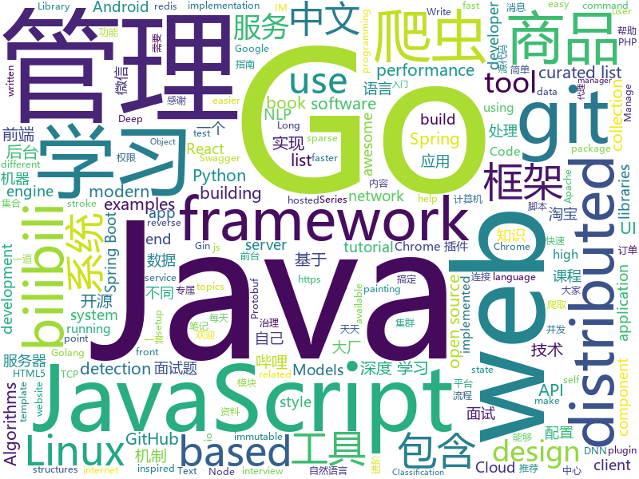

# 2019-04-24
See what the GitHub community is most excited about today.

## python
* [PySnooper](https://github.com/cool-RR/PySnooper)(**2,990 stars today**): Never use print for debugging again
* [Python-100-Days](https://github.com/jackfrued/Python-100-Days)(**543 stars today**): Python - 100天从新手到大师
* [manim](https://github.com/3b1b/manim)(**384 stars today**): Animation engine for explanatory math videos
* [AiLearning](https://github.com/apachecn/AiLearning)(**316 stars today**): AiLearning: 机器学习 - MachineLearning - ML、深度学习 - DeepLearning - DL、自然语言处理 NLP
* [ChromeAppHeroes](https://github.com/zhaoolee/ChromeAppHeroes)(**133 stars today**): 🌈谷粒-Chrome插件英雄榜, 为优秀的Chrome插件写一本中文说明书, 让Chrome插件英雄们造福人类~ ChromePluginHeroes, Write a Chinese manual for the excellent Chrome plugin, let the Chrome plugin heroes benefit the human~
* [examples-of-web-crawlers](https://github.com/shengqiangzhang/examples-of-web-crawlers)(**98 stars today**): python爬虫例子,对新手比较友好。淘宝模拟登录,淘宝商品爬虫,淘宝我已购买的宝贝爬虫,天猫商品爬虫,每天不同时间段通过微信发消息提醒女友,爬取5K分辨率超清唯美壁纸,爬取豆瓣排行榜电影数据(含GUI界面版),多线程+代理池爬取天天基金网、股票数据(无需使用爬虫框架),一键生成微信个人专属数据报告(了解你的微信社交历史)
* [sparse_attention](https://github.com/openai/sparse_attention)(**106 stars today**): Examples of using sparse attention, as in "Generating Long Sequences with Sparse Transformers"
* [models](https://github.com/tensorflow/models)(**74 stars today**): Models and examples built with TensorFlow
* [notes](https://github.com/guanguans/notes)(**92 stars today**): 📔Linux、MySQL、Nginx、PHP、Git、Shell等笔记
* [CornerNet-Lite](https://github.com/princeton-vl/CornerNet-Lite)(**78 stars today**): 
* [dephell](https://github.com/dephell/dephell)(**85 stars today**): 📦🔥Python project management. Manage packages: convert between formats, lock, install, resolve, isolate, test, build graph, show outdated, audit. Manage venvs, build package, bump version.
* [unknown-horizons](https://github.com/unknown-horizons/unknown-horizons)(**82 stars today**): Unknown Horizons official code repository
* [SPADE](https://github.com/NVlabs/SPADE)(**77 stars today**): Semantic Image Synthesis with SPADE
* [CenterNet](https://github.com/Duankaiwen/CenterNet)(**71 stars today**): Codes for our paper "CenterNet: Keypoint Triplets for Object Detection" .
* [LearningToPaint](https://github.com/hzwer/LearningToPaint)(**79 stars today**): A painting AI that can reproduce paintings stroke by stroke using deep reinforcement learning.
* [huawei-block-list](https://github.com/pe3zx/huawei-block-list)(**76 stars today**): Captured DNS requests from Huawei P30 Pro to a block list
* [koalas](https://github.com/databricks/koalas)(**75 stars today**): Koalas: Pandas API on Apache Spark
* [awesome-python](https://github.com/vinta/awesome-python)(**65 stars today**): A curated list of awesome Python frameworks, libraries, software and resources
* [TDTChannels](https://github.com/LaQuay/TDTChannels)(**66 stars today**): Listado de canales TDT para ver online
* [Text_Classification](https://github.com/kk7nc/Text_Classification)(**60 stars today**): Text Classification Algorithms: A Survey
* [CheatSheetSeries](https://github.com/OWASP/CheatSheetSeries)(**61 stars today**): The OWASP Cheat Sheet Series was created to provide a concise collection of high value information on specific application security topics.
* [CenterNet](https://github.com/xingyizhou/CenterNet)(**64 stars today**): Object detection, 3D detection, and pose estimation using center point detection:
* [system-design-primer](https://github.com/donnemartin/system-design-primer)(**60 stars today**): Learn how to design large-scale systems. Prep for the system design interview. Includes Anki flashcards.
* [NeuronBlocks](https://github.com/Microsoft/NeuronBlocks)(**64 stars today**): NLP DNN Toolkit - Building Your NLP DNN Models Like Playing Lego
* [public-apis](https://github.com/toddmotto/public-apis)(****): A collective list of free APIs for use in software and web development.

## java
* [JavaGuide](https://github.com/Snailclimb/JavaGuide)(**257 stars today**): 【Java学习+面试指南】 一份涵盖大部分Java程序员所需要掌握的核心知识。
* [server](https://github.com/wildfirechat/server)(**143 stars today**): 全开源即时通讯(IM)系统
* [advanced-java](https://github.com/doocs/advanced-java)(**131 stars today**): 😮互联网 Java 工程师进阶知识完全扫盲
* [mall](https://github.com/macrozheng/mall)(**104 stars today**): mall项目是一套电商系统，包括前台商城系统及后台管理系统，基于SpringBoot+MyBatis实现。 前台商城系统包含首页门户、商品推荐、商品搜索、商品展示、购物车、订单流程、会员中心、客户服务、帮助中心等模块。 后台管理系统包含商品管理、订单管理、会员管理、促销管理、运营管理、内容管理、统计报表、财务管理、权限管理、设置等模块。
* [spring-boot](https://github.com/spring-projects/spring-boot)(**72 stars today**): Spring Boot
* [halo](https://github.com/halo-dev/halo)(**71 stars today**): ✍ Halo 可能是最好的 Java 博客系统
* [Moss](https://github.com/SpringCloud/Moss)(**77 stars today**): Moss(莫斯)-Spring Cloud体系的服务治理平台，让Spring Cloud应用不再流浪！欢迎Star！
* [hutool](https://github.com/looly/hutool)(**69 stars today**): A set of tools that keep Java sweet.
* [easyexcel](https://github.com/alibaba/easyexcel)(**67 stars today**): 快速、简单避免OOM的java处理Excel工具
* [spring-boot-examples](https://github.com/ityouknow/spring-boot-examples)(**58 stars today**): about learning Spring Boot via examples. Spring Boot 教程、技术栈示例代码，快速简单上手教程。
* [HanLP](https://github.com/hankcs/HanLP)(**57 stars today**): 自然语言处理 中文分词 词性标注 命名实体识别 依存句法分析 新词发现 关键词短语提取 自动摘要 文本分类聚类 拼音简繁
* [dts](https://github.com/ke-finance/dts)(**52 stars today**): Distributed Transaction Service For Spring Cloud
* [spring-framework](https://github.com/spring-projects/spring-framework)(**42 stars today**): Spring Framework
* [apollo](https://github.com/ctripcorp/apollo)(**46 stars today**): Apollo（阿波罗）是携程框架部门研发的分布式配置中心，能够集中化管理应用不同环境、不同集群的配置，配置修改后能够实时推送到应用端，并且具备规范的权限、流程治理等特性，适用于微服务配置管理场景。
* [NettyChat](https://github.com/FreddyChen/NettyChat)(**50 stars today**): 基于Netty+TCP+Protobuf实现的Android IM库，包含Protobuf序列化、TCP拆包与粘包、长连接握手认证、心跳机制、断线重连机制、消息重发机制、读写超时机制、离线消息、线程池等功能。
* [tutorials](https://github.com/eugenp/tutorials)(**26 stars today**): The "REST With Spring" Course:
* [Java](https://github.com/TheAlgorithms/Java)(**47 stars today**): All Algorithms implemented in Java
* [xxl-job](https://github.com/xuxueli/xxl-job)(**37 stars today**): A lightweight distributed task scheduling framework.（分布式任务调度平台XXL-JOB）
* [elasticsearch](https://github.com/elastic/elasticsearch)(**38 stars today**): Open Source, Distributed, RESTful Search Engine
* [ghidra](https://github.com/NationalSecurityAgency/ghidra)(**42 stars today**): Ghidra is a software reverse engineering (SRE) framework
* [okhttp](https://github.com/square/okhttp)(**40 stars today**): An HTTP+HTTP/2 client for Android and Java applications.
* [incubator-dubbo](https://github.com/apache/incubator-dubbo)(**31 stars today**): Apache Dubbo (incubating) is a high-performance, java based, open source RPC framework.
* [seata](https://github.com/seata/seata)(**36 stars today**): 🔥Seata is an easy-to-use, high-performance, java based, open source distributed transaction solution.
* [ZXBlog](https://github.com/ZXZxin/ZXBlog)(**39 stars today**): 记录各种学习笔记(算法、Java、数据库、并发......)
* [arthas](https://github.com/alibaba/arthas)(**35 stars today**): Alibaba Java Diagnostic Tool Arthas/Alibaba Java诊断利器Arthas

## unknown
* [support.996.ICU](https://github.com/MSWorkers/support.996.ICU)(**4,128 stars today**): Microsoft and GitHub Workers Support 996.ICU
* [linux-network-performance-parameters](https://github.com/leandromoreira/linux-network-performance-parameters)(**530 stars today**): Learn where some of the network sysctl variables fit into the Linux/Kernel network flow
* [commit-messages-guide](https://github.com/RomuloOliveira/commit-messages-guide)(**424 stars today**): A guide to understand the importance of commit messages and how to write them well
* [git-tips](https://github.com/521xueweihan/git-tips)(**389 stars today**): Git的奇技淫巧
* [golang-developer-roadmap](https://github.com/Alikhll/golang-developer-roadmap)(**246 stars today**): Roadmap to becoming a Go developer in 2019
* [996action](https://github.com/CPdogson/996action)(**185 stars today**): 
* [CS-Notes](https://github.com/CyC2018/CS-Notes)(**107 stars today**): 📚技术面试必备基础知识
* [app-ideas](https://github.com/florinpop17/app-ideas)(**126 stars today**): A Collection of application ideas which can be used to improve your coding skills.
* [free-programming-books-zh_CN](https://github.com/justjavac/free-programming-books-zh_CN)(**97 stars today**): 📚免费的计算机编程类中文书籍，欢迎投稿
* [You-Dont-Know-JS](https://github.com/getify/You-Dont-Know-JS)(**89 stars today**): A book series on JavaScript. @YDKJS on twitter.
* [gitignore](https://github.com/github/gitignore)(**62 stars today**): A collection of useful .gitignore templates
* [weekly](https://github.com/aliyunfe/weekly)(**91 stars today**): 《阿里云前端技术周刊》
* [DeepLearning-500-questions](https://github.com/scutan90/DeepLearning-500-questions)(**77 stars today**): 深度学习500问，以问答形式对常用的概率知识、线性代数、机器学习、深度学习、计算机视觉等热点问题进行阐述，以帮助自己及有需要的读者。 全书分为18个章节，50余万字。由于水平有限，书中不妥之处恳请广大读者批评指正。 未完待续............ 如有意合作，联系scutjy2015@163.com 版权所有，违权必究 Tan 2018.06
* [awesome](https://github.com/sindresorhus/awesome)(**77 stars today**): 😎Awesome lists about all kinds of interesting topics
* [free-programming-books](https://github.com/EbookFoundation/free-programming-books)(**68 stars today**): 📚Freely available programming books
* [Awesome-pytorch-list](https://github.com/bharathgs/Awesome-pytorch-list)(**70 stars today**): A comprehensive list of pytorch related content on github,such as different models,implementations,helper libraries,tutorials etc.
* [Weekly-FE-Interview](https://github.com/airuikun/Weekly-FE-Interview)(**72 stars today**): 每周十道前端大厂面试题，并收集大家在大厂面试中遇到的难题，一起共同成长。
* [SJTU-Courses](https://github.com/CoolPhilChen/SJTU-Courses)(**61 stars today**): 上海交通大学课程资料分享
* [pumpkin-book](https://github.com/datawhalechina/pumpkin-book)(**60 stars today**): 《机器学习》（西瓜书）公式推导解析，在线阅读地址：https://datawhalechina.github.io/pumpkin-book
* [Android-Daily-Interview](https://github.com/Moosphan/Android-Daily-Interview)(**53 stars today**): 每工作日更新一道 Android 面试题，小聚成河，大聚成江，共勉之～
* [awesome-spider](https://github.com/facert/awesome-spider)(**49 stars today**): 爬虫集合
* [project-based-learning](https://github.com/tuvtran/project-based-learning)(**49 stars today**): Curated list of project-based tutorials
* [bilibili_server_zip](https://github.com/gamegrd/bilibili_server_zip)(**27 stars today**): 感谢开源，bilibili服务器源代码，学GO语言别错过,解压密码123456
* [Daily-Interview-Question](https://github.com/Advanced-Frontend/Daily-Interview-Question)(**48 stars today**): 我是木易杨，公众号「高级前端进阶」作者，每天搞定一道前端大厂面试题，祝大家天天进步，一年后会看到不一样的自己。
* [architect-awesome](https://github.com/xingshaocheng/architect-awesome)(**42 stars today**): 后端架构师技术图谱

## javascript
* [svelte](https://github.com/sveltejs/svelte)(**701 stars today**): Cybernetically enhanced web apps
* [tool](https://github.com/Louiszhai/tool)(**353 stars today**): 开发效率提升：Mac生产力工具链推荐
* [ikonate](https://github.com/mikolajdobrucki/ikonate)(**320 stars today**): fully customisable & accessible vector icons
* [libpku](https://github.com/lib-pku/libpku)(**268 stars today**): 贵校课程资料民间整理
* [cxk-ball](https://github.com/kasuganosoras/cxk-ball)(**248 stars today**): 🏀Javascript 实现的 CXK 打篮球游戏
* [vue](https://github.com/vuejs/vue)(**142 stars today**): 🖖Vue.js is a progressive, incrementally-adoptable JavaScript framework for building UI on the web.
* [mockit](https://github.com/boyney123/mockit)(**142 stars today**): A tool to quickly mock out end points, setup delays and more...
* [flv.js](https://github.com/bilibili/flv.js)(**109 stars today**): HTML5 FLV Player
* [react](https://github.com/facebook/react)(**99 stars today**): A declarative, efficient, and flexible JavaScript library for building user interfaces.
* [storeon](https://github.com/ai/storeon)(**104 stars today**): Tiny (173 bytes) event-based immutable state manager for React and Preact
* [React95](https://github.com/arturbien/React95)(**99 stars today**): 🌈🕹Refreshed Windows 95 style UI components for your React app
* [33-js-concepts](https://github.com/leonardomso/33-js-concepts)(**79 stars today**): 📜33 concepts every JavaScript developer should know.
* [laraberg](https://github.com/VanOns/laraberg)(**88 stars today**): A Gutenberg implementation for Laravel
* [create-react-app](https://github.com/facebook/create-react-app)(**71 stars today**): Set up a modern web app by running one command.
* [javascript-algorithms](https://github.com/trekhleb/javascript-algorithms)(**67 stars today**): 📝Algorithms and data structures implemented in JavaScript with explanations and links to further readings
* [dsa.js](https://github.com/amejiarosario/dsa.js)(**72 stars today**): Data Structures and Algorithms explained and implemented in JavaScript
* [UnblockNeteaseMusic](https://github.com/nondanee/UnblockNeteaseMusic)(**64 stars today**): Revive unavailable songs for Netease Cloud Music
* [baiduyun](https://github.com/syhyz1990/baiduyun)(**67 stars today**): 油猴脚本 一个脚本搞定百度网盘下载
* [immer](https://github.com/immerjs/immer)(**68 stars today**): Create the next immutable state by mutating the current one
* [react-jsonschema-form](https://github.com/mozilla-services/react-jsonschema-form)(**67 stars today**): A React component for building Web forms from JSON Schema.
* [Motrix](https://github.com/agalwood/Motrix)(**63 stars today**): A full-featured download manager.
* [glicky](https://github.com/alex-saunders/glicky)(**65 stars today**): 🐭An in-browser task runner for modern web development
* [javascript](https://github.com/airbnb/javascript)(**57 stars today**): JavaScript Style Guide
* [material-ui](https://github.com/mui-org/material-ui)(**50 stars today**): React components for faster and easier web development. Build your own design system, or start with Material Design.
* [node](https://github.com/nodejs/node)(**55 stars today**): Node.js JavaScript runtime✨🐢🚀✨

## html
* [linux-command](https://github.com/jaywcjlove/linux-command)(**178 stars today**): Linux命令大全搜索工具，内容包含Linux命令手册、详解、学习、搜集。https://git.io/linux
* [zju-icicles](https://github.com/QSCTech/zju-icicles)(**135 stars today**): 浙江大学课程攻略共享计划
* [front-end-handbook-2019](https://github.com/FrontendMasters/front-end-handbook-2019)(**56 stars today**): [Book] 2019 edition of our front-end development handbook
* [nndl.github.io](https://github.com/nndl/nndl.github.io)(**39 stars today**): 《神经网络与深度学习》 Neural Network and Deep Learning
* [water.css](https://github.com/kognise/water.css)(**45 stars today**): A just-add-css collection of styles to make simple websites just a little nicer
* [styleguide](https://github.com/google/styleguide)(**26 stars today**): Style guides for Google-originated open-source projects
* [Front-end-Developer-Interview-Questions](https://github.com/h5bp/Front-end-Developer-Interview-Questions)(**26 stars today**): A list of helpful front-end related questions you can use to interview potential candidates, test yourself or completely ignore.
* [en.javascript.info](https://github.com/javascript-tutorial/en.javascript.info)(**23 stars today**): Modern JavaScript Tutorial
* [OUCML](https://github.com/OUCMachineLearning/OUCML)(**17 stars today**): 
* [TranslatorX](https://github.com/pingfangx/TranslatorX)(**20 stars today**): JetBrains 系列软件汉化包
* [live2D](https://github.com/fguby/live2D)(**20 stars today**): 来定制一个自己专属的live2D看板娘吧(๑•̀ㅂ•́)و✧
* [speedtest](https://github.com/adolfintel/speedtest)(**17 stars today**): Self-hosted HTML5 Speedtest. Easy setup, examples, configurable, responsive and mobile friendly. Supports PHP, Node, and more.
* [ru.javascript.info](https://github.com/javascript-tutorial/ru.javascript.info)(**14 stars today**): Современный учебник JavaScript
* [dataviz](https://github.com/clauswilke/dataviz)(**15 stars today**): A book covering the fundamentals of data visualization.
* [patchwork](https://github.com/jlord/patchwork)(****): All the Git-it Workshop completers!
* [personal-website](https://github.com/github/personal-website)(**5 stars today**): Code that'll help you kickstart a personal website that showcases your work as a software developer.
* [electron-api-demos](https://github.com/electron/electron-api-demos)(**13 stars today**): Explore the Electron APIs
* [Spoon-Knife](https://github.com/octocat/Spoon-Knife)(****): This repo is for demonstration purposes only.
* [MikuTools](https://github.com/Ice-Hazymoon/MikuTools)(**12 stars today**): 一个轻量的工具集合
* [nginxconfig.io](https://github.com/valentinxxx/nginxconfig.io)(**13 stars today**): ⚙️NGiИX config generator on steroids💉
* [swagger-codegen](https://github.com/swagger-api/swagger-codegen)(**11 stars today**): swagger-codegen contains a template-driven engine to generate documentation, API clients and server stubs in different languages by parsing your OpenAPI / Swagger definition.
* [py4e](https://github.com/csev/py4e)(**11 stars today**): Web site for www.py4e.com and source to the Python 3.0 textbook
* [flutter-in-action](https://github.com/flutterchina/flutter-in-action)(**10 stars today**): 《Flutter实战》电子书
* [fastText](https://github.com/facebookresearch/fastText)(**10 stars today**): Library for fast text representation and classification.
* [zh.javascript.info](https://github.com/javascript-tutorial/zh.javascript.info)(**9 stars today**): Modern JavaScript Tutorial

## go
* [openbilibili-go-common](https://github.com/swituo/openbilibili-go-common)(**936 stars today**): 嘘，不要问！我也不清楚这些是啥…
* [termshark](https://github.com/gcla/termshark)(**1,611 stars today**): A terminal UI for tshark, inspired by Wireshark
* [kratos](https://github.com/bilibili/kratos)(**716 stars today**): Kratos是bilibili开源的一套Go微服务框架，包含大量微服务相关框架及工具。
* [sshcode](https://github.com/codercom/sshcode)(**490 stars today**): Run VS Code on any server over SSH.
* [the-way-to-go_ZH_CN](https://github.com/Unknwon/the-way-to-go_ZH_CN)(**253 stars today**): 《The Way to Go》中文译本，中文正式名《Go 入门指南》
* [cadence](https://github.com/uber/cadence)(**145 stars today**): Cadence is a distributed, scalable, durable, and highly available orchestration engine to execute asynchronous long-running business logic in a scalable and resilient way.
* [go-patterns](https://github.com/tmrts/go-patterns)(**140 stars today**): Curated list of Go design patterns, recipes and idioms
* [openbilibili-go-common](https://github.com/Harveychn/openbilibili-go-common)(**49 stars today**): 哔哩哔哩 bilibili 网站后台工程 源码
* [overlord](https://github.com/bilibili/overlord)(**109 stars today**): Overlord是哔哩哔哩基于Go语言编写的memcache和redis&cluster的代理及集群管理功能，致力于提供自动化高可用的缓存服务解决方案。
* [zinx](https://github.com/aceld/zinx)(**106 stars today**): 基于Golang解决的长连接并发服务器框架
* [go](https://github.com/golang/go)(**95 stars today**): The Go programming language
* [bilibili_server](https://github.com/gamegrd/bilibili_server)(**43 stars today**): 感谢开源，bilibili服务器源代码，学习GO 的可以参观一下
* [kubernetes](https://github.com/kubernetes/kubernetes)(**76 stars today**): Production-Grade Container Scheduling and Management
* [berglas](https://github.com/GoogleCloudPlatform/berglas)(**78 stars today**): A tool for managing secrets on Google Cloud
* [gowid](https://github.com/gcla/gowid)(**77 stars today**): Compositional widgets for terminal user interfaces, written in Go, inspired by urwid.
* [hub](https://github.com/github/hub)(**74 stars today**): A command-line tool that makes git easier to use with GitHub.
* [awesome-go](https://github.com/avelino/awesome-go)(**63 stars today**): A curated list of awesome Go frameworks, libraries and software
* [gitea](https://github.com/go-gitea/gitea)(**68 stars today**): Git with a cup of tea, painless self-hosted git service
* [redis-tui](https://github.com/mylxsw/redis-tui)(**65 stars today**): A Redis Text-based UI client in CLI
* [piliopen](https://github.com/ckx000/piliopen)(**35 stars today**): this is where?what's this?who am I?
* [gin](https://github.com/gin-gonic/gin)(**62 stars today**): Gin is a HTTP web framework written in Go (Golang). It features a Martini-like API with much better performance -- up to 40 times faster. If you need smashing performance, get yourself some Gin.
* [frp](https://github.com/fatedier/frp)(**57 stars today**): A fast reverse proxy to help you expose a local server behind a NAT or firewall to the internet.
* [git-bug](https://github.com/MichaelMure/git-bug)(**59 stars today**): Distributed bug tracker embedded in Git
* [openbilibili](https://github.com/zenwan/openbilibili)(**19 stars today**): 《从入门到精通-go语言实践之bilibili后台实现》
* [tunneller](https://github.com/skx/tunneller)(**50 stars today**): Allow internal services, running on localhost, to be accessed over the internet..

## WordCloud

