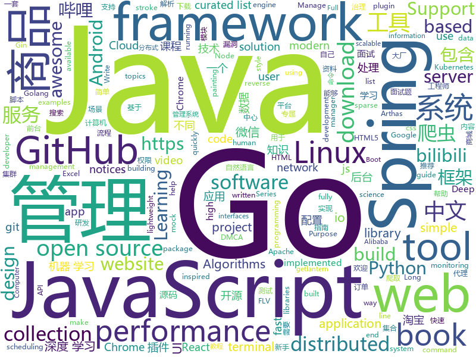

# 2019-04-25
See what the GitHub community is most excited about today.

## python
* [PySnooper](https://github.com/cool-RR/PySnooper)(**1,132 stars today**): Never use print for debugging again
* [Python-100-Days](https://github.com/jackfrued/Python-100-Days)(**479 stars today**): Python - 100天从新手到大师
* [AiLearning](https://github.com/apachecn/AiLearning)(**228 stars today**): AiLearning: 机器学习 - MachineLearning - ML、深度学习 - DeepLearning - DL、自然语言处理 NLP
* [sparse_attention](https://github.com/openai/sparse_attention)(**240 stars today**): Examples of using sparse attention, as in "Generating Long Sequences with Sparse Transformers"
* [vtest](https://github.com/opensec-cn/vtest)(**150 stars today**): 用于辅助安全工程师漏洞挖掘、测试、复现，集合了mock、httplog、dns tools、xss，可用于测试各类无回显、无法直观判断或特定场景下的漏洞。
* [fklearn](https://github.com/nubank/fklearn)(**142 stars today**): fklearn: Functional Machine Learning
* [manim](https://github.com/3b1b/manim)(**124 stars today**): Animation engine for explanatory math videos
* [youtube-dl](https://github.com/ytdl-org/youtube-dl)(**106 stars today**): Command-line program to download videos from YouTube.com and other video sites
* [NeuRec](https://github.com/wubinzzu/NeuRec)(**96 stars today**): Next RecSys Library
* [notes](https://github.com/guanguans/notes)(**96 stars today**): 📔Linux、MySQL、Nginx、PHP、Git、Shell等笔记
* [LearningToPaint](https://github.com/hzwer/LearningToPaint)(**98 stars today**): A painting AI that can reproduce paintings stroke by stroke using deep reinforcement learning.
* [rtv](https://github.com/michael-lazar/rtv)(**101 stars today**): 🏄Browse Reddit from your terminal
* [ChromeAppHeroes](https://github.com/zhaoolee/ChromeAppHeroes)(**94 stars today**): 🌈谷粒-Chrome插件英雄榜, 为优秀的Chrome插件写一本中文说明书, 让Chrome插件英雄们造福人类~ ChromePluginHeroes, Write a Chinese manual for the excellent Chrome plugin, let the Chrome plugin heroes benefit the human~
* [examples-of-web-crawlers](https://github.com/shengqiangzhang/examples-of-web-crawlers)(**82 stars today**): python爬虫例子,对新手比较友好。淘宝模拟登录,淘宝商品爬虫,淘宝我已购买的宝贝爬虫,天猫商品爬虫,每天不同时间段通过微信发消息提醒女友,爬取5K分辨率超清唯美壁纸,爬取豆瓣排行榜电影数据(含GUI界面版),多线程+代理池爬取天天基金网、股票数据(无需使用爬虫框架),一键生成微信个人专属数据报告(了解你的微信社交历史)
* [awesome-python](https://github.com/vinta/awesome-python)(**89 stars today**): A curated list of awesome Python frameworks, libraries, software and resources
* [system-design-primer](https://github.com/donnemartin/system-design-primer)(**76 stars today**): Learn how to design large-scale systems. Prep for the system design interview. Includes Anki flashcards.
* [models](https://github.com/tensorflow/models)(**53 stars today**): Models and examples built with TensorFlow
* [bash.py](https://github.com/kennethreitz/bash.py)(**79 stars today**): An inline Bash script runner, for Python.
* [keras](https://github.com/keras-team/keras)(**63 stars today**): Deep Learning for humans
* [Python](https://github.com/TheAlgorithms/Python)(**64 stars today**): All Algorithms implemented in Python
* [SPADE](https://github.com/NVlabs/SPADE)(**67 stars today**): Semantic Image Synthesis with SPADE
* [CheatSheetSeries](https://github.com/OWASP/CheatSheetSeries)(**65 stars today**): The OWASP Cheat Sheet Series was created to provide a concise collection of high value information on specific application security topics.
* [dephell](https://github.com/dephell/dephell)(**64 stars today**): 📦🔥Python project management. Manage packages: convert between formats, lock, install, resolve, isolate, test, build graph, show outdated, audit. Manage venvs, build package, bump version.
* [koalas](https://github.com/databricks/koalas)(**58 stars today**): Koalas: Pandas API on Apache Spark
* [Robot](https://github.com/zhangzhixin00/Robot)(**39 stars today**): 

## java
* [JavaGuide](https://github.com/Snailclimb/JavaGuide)(**235 stars today**): 【Java学习+面试指南】 一份涵盖大部分Java程序员所需要掌握的核心知识。
* [Ant-Media-Server](https://github.com/ant-media/Ant-Media-Server)(**158 stars today**): Ant Media Server supports RTMP, RTSP, WebRTC and Adaptive Bitrate. It can also record videos in MP4, HLS and FLV
* [server](https://github.com/wildfirechat/server)(**133 stars today**): 全开源即时通讯(IM)系统
* [advanced-java](https://github.com/doocs/advanced-java)(**113 stars today**): 😮互联网 Java 工程师进阶知识完全扫盲
* [Moss](https://github.com/SpringCloud/Moss)(**94 stars today**): Moss(莫斯)-Spring Cloud体系的服务治理平台，让Spring Cloud应用不再流浪！欢迎Star！
* [mall](https://github.com/macrozheng/mall)(**86 stars today**): mall项目是一套电商系统，包括前台商城系统及后台管理系统，基于SpringBoot+MyBatis实现。 前台商城系统包含首页门户、商品推荐、商品搜索、商品展示、购物车、订单流程、会员中心、客户服务、帮助中心等模块。 后台管理系统包含商品管理、订单管理、会员管理、促销管理、运营管理、内容管理、统计报表、财务管理、权限管理、设置等模块。
* [spring-boot](https://github.com/spring-projects/spring-boot)(**53 stars today**): Spring Boot
* [spring-boot-examples](https://github.com/ityouknow/spring-boot-examples)(**59 stars today**): about learning Spring Boot via examples. Spring Boot 教程、技术栈示例代码，快速简单上手教程。
* [easyexcel](https://github.com/alibaba/easyexcel)(**62 stars today**): 快速、简单避免OOM的java处理Excel工具
* [halo](https://github.com/halo-dev/halo)(**52 stars today**): ✍ Halo 可能是最好的 Java 博客系统
* [hutool](https://github.com/looly/hutool)(**51 stars today**): A set of tools that keep Java sweet.
* [tutorials](https://github.com/eugenp/tutorials)(**37 stars today**): The "REST With Spring" Course:
* [arthas](https://github.com/alibaba/arthas)(**54 stars today**): Alibaba Java Diagnostic Tool Arthas/Alibaba Java诊断利器Arthas
* [HanLP](https://github.com/hankcs/HanLP)(**49 stars today**): 自然语言处理 中文分词 词性标注 命名实体识别 依存句法分析 新词发现 关键词短语提取 自动摘要 文本分类聚类 拼音简繁
* [DoraemonKit](https://github.com/didi/DoraemonKit)(**50 stars today**): 简称 "DoKit" 。一款功能齐全的客户端（ iOS 、Android ）研发助手，你值得拥有。
* [elasticsearch](https://github.com/elastic/elasticsearch)(**46 stars today**): Open Source, Distributed, RESTful Search Engine
* [apollo](https://github.com/ctripcorp/apollo)(**43 stars today**): Apollo（阿波罗）是携程框架部门研发的分布式配置中心，能够集中化管理应用不同环境、不同集群的配置，配置修改后能够实时推送到应用端，并且具备规范的权限、流程治理等特性，适用于微服务配置管理场景。
* [okhttp](https://github.com/square/okhttp)(**48 stars today**): An HTTP+HTTP/2 client for Android and Java applications.
* [spring-framework](https://github.com/spring-projects/spring-framework)(**29 stars today**): Spring Framework
* [Java](https://github.com/TheAlgorithms/Java)(**38 stars today**): All Algorithms implemented in Java
* [seata](https://github.com/seata/seata)(**39 stars today**): 🔥Seata is an easy-to-use, high-performance, java based, open source distributed transaction solution.
* [xxl-job](https://github.com/xuxueli/xxl-job)(**35 stars today**): A lightweight distributed task scheduling framework.（分布式任务调度平台XXL-JOB）
* [incubator-dubbo](https://github.com/apache/incubator-dubbo)(**28 stars today**): Apache Dubbo (incubating) is a high-performance, java based, open source RPC framework.
* [ghidra](https://github.com/NationalSecurityAgency/ghidra)(**34 stars today**): Ghidra is a software reverse engineering (SRE) framework
* [skywalking](https://github.com/apache/skywalking)(**33 stars today**): APM, Application Performance Monitoring System

## unknown
* [support.996.ICU](https://github.com/MSWorkers/support.996.ICU)(**1,836 stars today**): Microsoft and GitHub Workers Support 996.ICU
* [dmca](https://github.com/github/dmca)(**486 stars today**): Repository with text of DMCA takedown notices as received. GitHub does not endorse or adopt any assertion contained in the following notices. Users identified in the notices are presumed innocent until proven guilty. Additional information about our DMCA policy can be found at
* [golang-developer-roadmap](https://github.com/Alikhll/golang-developer-roadmap)(**440 stars today**): Roadmap to becoming a Go developer in 2019
* [git-tips](https://github.com/521xueweihan/git-tips)(**268 stars today**): Git的奇技淫巧
* [commit-messages-guide](https://github.com/RomuloOliveira/commit-messages-guide)(**290 stars today**): A guide to understand the importance of commit messages and how to write them well
* [golang-developer-roadmap-cn](https://github.com/Quorafind/golang-developer-roadmap-cn)(**254 stars today**): 在 2019 成为一名 Go 开发者的路线图。原仓库为
* [linux-network-performance-parameters](https://github.com/leandromoreira/linux-network-performance-parameters)(**237 stars today**): Learn where some of the network sysctl variables fit into the Linux/Kernel network flow
* [CS-Notes](https://github.com/CyC2018/CS-Notes)(**109 stars today**): 📚技术面试必备基础知识
* [gitignore](https://github.com/github/gitignore)(**76 stars today**): A collection of useful .gitignore templates
* [awesome](https://github.com/sindresorhus/awesome)(**98 stars today**): 😎Awesome lists about all kinds of interesting topics
* [DeepLearning-500-questions](https://github.com/scutan90/DeepLearning-500-questions)(**83 stars today**): 深度学习500问，以问答形式对常用的概率知识、线性代数、机器学习、深度学习、计算机视觉等热点问题进行阐述，以帮助自己及有需要的读者。 全书分为18个章节，50余万字。由于水平有限，书中不妥之处恳请广大读者批评指正。 未完待续............ 如有意合作，联系scutjy2015@163.com 版权所有，违权必究 Tan 2018.06
* [free-programming-books-zh_CN](https://github.com/justjavac/free-programming-books-zh_CN)(**72 stars today**): 📚免费的计算机编程类中文书籍，欢迎投稿
* [You-Dont-Know-JS](https://github.com/getify/You-Dont-Know-JS)(**72 stars today**): A book series on JavaScript. @YDKJS on twitter.
* [app-ideas](https://github.com/florinpop17/app-ideas)(**67 stars today**): A Collection of application ideas which can be used to improve your coding skills.
* [free-programming-books](https://github.com/EbookFoundation/free-programming-books)(**60 stars today**): 📚Freely available programming books
* [Weekly-FE-Interview](https://github.com/airuikun/Weekly-FE-Interview)(**56 stars today**): 每周十道前端大厂面试题，并收集大家在大厂面试中遇到的难题，一起共同成长。
* [996.Leave](https://github.com/623637646/996.Leave)(**54 stars today**): 逃离996
* [SJTU-Courses](https://github.com/CoolPhilChen/SJTU-Courses)(**44 stars today**): 上海交通大学课程资料分享
* [Awesome_Computer_Vision](https://github.com/ahong007007/Awesome_Computer_Vision)(**51 stars today**): Awesome Computer Vision
* [coding-interview-university](https://github.com/jwasham/coding-interview-university)(**43 stars today**): A complete computer science study plan to become a software engineer.
* [architect-awesome](https://github.com/xingshaocheng/architect-awesome)(**46 stars today**): 后端架构师技术图谱
* [project-based-learning](https://github.com/tuvtran/project-based-learning)(**49 stars today**): Curated list of project-based tutorials
* [pumpkin-book](https://github.com/datawhalechina/pumpkin-book)(**46 stars today**): 《机器学习》（西瓜书）公式推导解析，在线阅读地址：https://datawhalechina.github.io/pumpkin-book
* [996action](https://github.com/CPdogson/996action)(**50 stars today**): 
* [Android-Daily-Interview](https://github.com/Moosphan/Android-Daily-Interview)(**43 stars today**): 每工作日更新一道 Android 面试题，小聚成河，大聚成江，共勉之～

## javascript
* [svelte](https://github.com/sveltejs/svelte)(**617 stars today**): Cybernetically enhanced web apps
* [cxk-ball](https://github.com/kasuganosoras/cxk-ball)(**250 stars today**): 🏀Javascript 实现的 CXK 打篮球游戏
* [use-http](https://github.com/alex-cory/use-http)(**265 stars today**): 🐶React hook for making isomorphic http requests
* [tool](https://github.com/Louiszhai/tool)(**238 stars today**): 开发效率提升：Mac生产力工具链推荐
* [React95](https://github.com/arturbien/React95)(**202 stars today**): 🌈🕹Refreshed Windows 95 style UI components for your React app
* [libpku](https://github.com/lib-pku/libpku)(**168 stars today**): 贵校课程资料民间整理
* [ikonate](https://github.com/mikolajdobrucki/ikonate)(**142 stars today**): fully customisable & accessible vector icons
* [vue](https://github.com/vuejs/vue)(**112 stars today**): 🖖Vue.js is a progressive, incrementally-adoptable JavaScript framework for building UI on the web.
* [baiduyun](https://github.com/syhyz1990/baiduyun)(**118 stars today**): 油猴脚本 一个脚本搞定百度网盘下载
* [Recorder](https://github.com/xiangyuecn/Recorder)(**107 stars today**): html5 js 录音 mp3 wav ogg webm amr 格式，JavaScript getUserMedia，支持pc和Android、ios部分浏览器，微信也是支持的
* [bento-starter](https://github.com/kefranabg/bento-starter)(**113 stars today**): 🍱Full-Stack Open-Source solution to quickly build PWA applications
* [react](https://github.com/facebook/react)(**92 stars today**): A declarative, efficient, and flexible JavaScript library for building user interfaces.
* [edex-ui](https://github.com/GitSquared/edex-ui)(**102 stars today**): A cross-platform, customizable science fiction terminal emulator with advanced monitoring & touchscreen support.
* [node](https://github.com/nodejs/node)(**78 stars today**): Node.js JavaScript runtime✨🐢🚀✨
* [laraberg](https://github.com/VanOns/laraberg)(**77 stars today**): A Gutenberg implementation for Laravel
* [create-react-app](https://github.com/facebook/create-react-app)(**68 stars today**): Set up a modern web app by running one command.
* [UnblockNeteaseMusic](https://github.com/nondanee/UnblockNeteaseMusic)(**69 stars today**): Revive unavailable songs for Netease Cloud Music
* [Motrix](https://github.com/agalwood/Motrix)(**68 stars today**): A full-featured download manager.
* [javascript-algorithms](https://github.com/trekhleb/javascript-algorithms)(**66 stars today**): 📝Algorithms and data structures implemented in JavaScript with explanations and links to further readings
* [mockit](https://github.com/boyney123/mockit)(**71 stars today**): A tool to quickly mock out end points, setup delays and more...
* [storeon](https://github.com/ai/storeon)(**69 stars today**): Tiny (173 bytes) event-based immutable state manager for React and Preact
* [react-interpretation](https://github.com/KieSun/react-interpretation)(**61 stars today**): React 源码解析
* [flv.js](https://github.com/bilibili/flv.js)(**54 stars today**): HTML5 FLV Player
* [puppeteer](https://github.com/GoogleChrome/puppeteer)(**55 stars today**): Headless Chrome Node API
* [bootstrap](https://github.com/twbs/bootstrap)(**46 stars today**): The most popular HTML, CSS, and JavaScript framework for developing responsive, mobile first projects on the web.

## html
* [zju-icicles](https://github.com/QSCTech/zju-icicles)(**82 stars today**): 浙江大学课程攻略共享计划
* [linux-command](https://github.com/jaywcjlove/linux-command)(**52 stars today**): Linux命令大全搜索工具，内容包含Linux命令手册、详解、学习、搜集。https://git.io/linux
* [nndl.github.io](https://github.com/nndl/nndl.github.io)(**45 stars today**): 《神经网络与深度学习》 Neural Network and Deep Learning
* [front-end-handbook-2019](https://github.com/FrontendMasters/front-end-handbook-2019)(**34 stars today**): [Book] 2019 edition of our front-end development handbook
* [styleguide](https://github.com/google/styleguide)(**25 stars today**): Style guides for Google-originated open-source projects
* [ru.javascript.info](https://github.com/javascript-tutorial/ru.javascript.info)(**18 stars today**): Современный учебник JavaScript
* [live2D](https://github.com/fguby/live2D)(**20 stars today**): 来定制一个自己专属的live2D看板娘吧(๑•̀ㅂ•́)و✧
* [OUCML](https://github.com/OUCMachineLearning/OUCML)(**18 stars today**): 
* [flexmasonry](https://github.com/gilbitron/flexmasonry)(**21 stars today**): A lightweight masonry (cascading grid layout) library powered by flexbox.
* [en.javascript.info](https://github.com/javascript-tutorial/en.javascript.info)(**17 stars today**): Modern JavaScript Tutorial
* [water.css](https://github.com/kognise/water.css)(**17 stars today**): A just-add-css collection of styles to make simple websites just a little nicer
* [Spoon-Knife](https://github.com/octocat/Spoon-Knife)(****): This repo is for demonstration purposes only.
* [dataviz](https://github.com/clauswilke/dataviz)(**15 stars today**): A book covering the fundamentals of data visualization.
* [flutter-in-action](https://github.com/flutterchina/flutter-in-action)(**13 stars today**): 《Flutter实战》电子书
* [uix-kit](https://github.com/xizon/uix-kit)(**13 stars today**): A free web kits for fast web design and development, compatible with Bootstrap v4.
* [ecma262](https://github.com/tc39/ecma262)(**12 stars today**): Status, process, and documents for ECMA262
* [personal-website](https://github.com/github/personal-website)(**6 stars today**): Code that'll help you kickstart a personal website that showcases your work as a software developer.
* [MikuTools](https://github.com/Ice-Hazymoon/MikuTools)(**11 stars today**): 一个轻量的工具集合
* [hugo-academic](https://github.com/gcushen/hugo-academic)(**8 stars today**): The website builder for Hugo. Build and deploy a beautiful website in minutes🚀
* [portainer](https://github.com/portainer/portainer)(**10 stars today**): Simple management UI for Docker
* [CLRS](https://github.com/walkccc/CLRS)(**8 stars today**): 📚Solutions to Introduction to Algorithms Third Edition
* [awesome-modern-cpp](https://github.com/rigtorp/awesome-modern-cpp)(**8 stars today**): A collection of resources on modern C++
* [requests-html](https://github.com/kennethreitz/requests-html)(**8 stars today**): Pythonic HTML Parsing for Humans™
* [Iosevka](https://github.com/be5invis/Iosevka)(**8 stars today**): Slender typeface for code, from code.
* [subspace](https://github.com/subspacecloud/subspace)(**8 stars today**): A simple WireGuard VPN server GUI

## go
* [termshark](https://github.com/gcla/termshark)(**962 stars today**): A terminal UI for tshark, inspired by Wireshark
* [openbilibili-go-common](https://github.com/swituo/openbilibili-go-common)(****): 🙈！🙉！🙊！我不清楚这些是啥… 道德心泛滥的麻烦出门右转关注996.icu！
* [cadence](https://github.com/uber/cadence)(**526 stars today**): Cadence is a distributed, scalable, durable, and highly available orchestration engine to execute asynchronous long-running business logic in a scalable and resilient way.
* [kratos](https://github.com/bilibili/kratos)(**447 stars today**): Kratos是bilibili开源的一套Go微服务框架，包含大量微服务相关框架及工具。
* [sshcode](https://github.com/codercom/sshcode)(**224 stars today**): Run VS Code on any server over SSH.
* [the-way-to-go_ZH_CN](https://github.com/Unknwon/the-way-to-go_ZH_CN)(**130 stars today**): 《The Way to Go》中文译本，中文正式名《Go 入门指南》
* [k3os](https://github.com/rancher/k3os)(**139 stars today**): Purpose built OS for Kubernetes and fully managed by Kubernetes.
* [go](https://github.com/golang/go)(**98 stars today**): The Go programming language
* [gowid](https://github.com/gcla/gowid)(**105 stars today**): Compositional widgets for terminal user interfaces, written in Go, inspired by urwid.
* [backup-openbilibili-go-common](https://github.com/IDOTA1/backup-openbilibili-go-common)(**25 stars today**): 2019年4-22日-bilibili-干杯站后端源码（原包删除前最后一版170M）
* [berglas](https://github.com/GoogleCloudPlatform/berglas)(**86 stars today**): A tool for managing secrets on Google Cloud
* [kubernetes](https://github.com/kubernetes/kubernetes)(**63 stars today**): Production-Grade Container Scheduling and Management
* [go-patterns](https://github.com/tmrts/go-patterns)(**64 stars today**): Curated list of Go design patterns, recipes and idioms
* [openbilibili-go-common](https://github.com/Harveychn/openbilibili-go-common)(**18 stars today**): 哔哩哔哩 bilibili 网站后台工程 源码
* [gin](https://github.com/gin-gonic/gin)(**58 stars today**): Gin is a HTTP web framework written in Go (Golang). It features a Martini-like API with much better performance -- up to 40 times faster. If you need smashing performance, get yourself some Gin.
* [v](https://github.com/vlang/v)(**56 stars today**): Simple, fast, safe, compiled language for creating maintainable software. Supports translation from C/C++.
* [awesome-go](https://github.com/avelino/awesome-go)(**50 stars today**): A curated list of awesome Go frameworks, libraries and software
* [hub](https://github.com/github/hub)(**54 stars today**): A command-line tool that makes git easier to use with GitHub.
* [excelize](https://github.com/360EntSecGroup-Skylar/excelize)(**51 stars today**): Golang library for reading and writing Microsoft Excel™ (XLSX) files.
* [lantern](https://github.com/getlantern/lantern)(**46 stars today**): 🔴蓝灯最新版本下载 https://github.com/getlantern/download🔴Lantern Latest Download https://github.com/getlantern/download🔴
* [frp](https://github.com/fatedier/frp)(**46 stars today**): A fast reverse proxy to help you expose a local server behind a NAT or firewall to the internet.
* [bilibili_server](https://github.com/gamegrd/bilibili_server)(****): 感谢开源，bilibili服务器源代码，学习GO 的可以参观一下
* [git-bug](https://github.com/MichaelMure/git-bug)(**42 stars today**): Distributed bug tracker embedded in git
* [istio](https://github.com/istio/istio)(**33 stars today**): Connect, secure, control, and observe services.
* [overlord](https://github.com/bilibili/overlord)(**31 stars today**): Overlord是哔哩哔哩基于Go语言编写的memcache和redis&cluster的代理及集群管理功能，致力于提供自动化高可用的缓存服务解决方案。

## WordCloud

