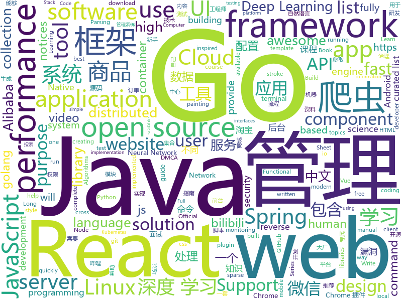

# 2019-04-26
See what the GitHub community is most excited about today.

## python
* [PySnooper](https://github.com/cool-RR/PySnooper)(**690 stars today**): Never use print for debugging again
* [Python-100-Days](https://github.com/jackfrued/Python-100-Days)(**339 stars today**): Python - 100天从新手到大师
* [Python](https://github.com/TheAlgorithms/Python)(**309 stars today**): All Algorithms implemented in Python
* [fklearn](https://github.com/nubank/fklearn)(**258 stars today**): fklearn: Functional Machine Learning
* [AiLearning](https://github.com/apachecn/AiLearning)(**138 stars today**): AiLearning: 机器学习 - MachineLearning - ML、深度学习 - DeepLearning - DL、自然语言处理 NLP
* [LearningToPaint](https://github.com/hzwer/LearningToPaint)(**149 stars today**): A painting AI that can reproduce paintings stroke by stroke using deep reinforcement learning.
* [koalas](https://github.com/databricks/koalas)(**122 stars today**): Koalas: Pandas API on Apache Spark
* [sparse_attention](https://github.com/openai/sparse_attention)(**119 stars today**): Examples of using sparse attention, as in "Generating Long Sequences with Sparse Transformers"
* [procSpy](https://github.com/itsKindred/procSpy)(**101 stars today**): Python tool that monitors and logs user-run commands on a Linux system for either offensive or defensive purposes..
* [models](https://github.com/tensorflow/models)(**67 stars today**): Models and examples built with TensorFlow
* [manim](https://github.com/3b1b/manim)(**86 stars today**): Animation engine for explanatory math videos
* [examples-of-web-crawlers](https://github.com/shengqiangzhang/examples-of-web-crawlers)(**75 stars today**): python爬虫例子,对新手比较友好。淘宝模拟登录,淘宝商品爬虫,淘宝我已购买的宝贝爬虫,天猫商品爬虫,每天不同时间段通过微信发消息提醒女友,爬取5K分辨率超清唯美壁纸,爬取豆瓣排行榜电影数据(含GUI界面版),多线程+代理池爬取天天基金网、股票数据(无需使用爬虫框架),一键生成微信个人专属数据报告(了解你的微信社交历史)
* [NeuRec](https://github.com/wubinzzu/NeuRec)(**74 stars today**): Next RecSys Library
* [ChromeAppHeroes](https://github.com/zhaoolee/ChromeAppHeroes)(**79 stars today**): 🌈谷粒-Chrome插件英雄榜, 为优秀的Chrome插件写一本中文说明书, 让Chrome插件英雄们造福人类~ ChromePluginHeroes, Write a Chinese manual for the excellent Chrome plugin, let the Chrome plugin heroes benefit the human~
* [youtube-dl](https://github.com/ytdl-org/youtube-dl)(**76 stars today**): Command-line program to download videos from YouTube.com and other video sites
* [CheatSheetSeries](https://github.com/OWASP/CheatSheetSeries)(**74 stars today**): The OWASP Cheat Sheet Series was created to provide a concise collection of high value information on specific application security topics.
* [CNVD-C-2019-48814](https://github.com/jas502n/CNVD-C-2019-48814)(**60 stars today**): WebLogic wls9-async反序列化远程命令执行漏洞
* [system-design-primer](https://github.com/donnemartin/system-design-primer)(**68 stars today**): Learn how to design large-scale systems. Prep for the system design interview. Includes Anki flashcards.
* [OctConv](https://github.com/facebookresearch/OctConv)(**67 stars today**): Code for paper
* [Dianping](https://github.com/Northxw/Dianping)(**62 stars today**): 大众点评店铺信息爬虫
* [vtest](https://github.com/opensec-cn/vtest)(**60 stars today**): 用于辅助安全工程师漏洞挖掘、测试、复现，集合了mock、httplog、dns tools、xss，可用于测试各类无回显、无法直观判断或特定场景下的漏洞。
* [awesome-python](https://github.com/vinta/awesome-python)(**54 stars today**): A curated list of awesome Python frameworks, libraries, software and resources
* [public-apis](https://github.com/toddmotto/public-apis)(**55 stars today**): A collective list of free APIs for use in software and web development.
* [keras](https://github.com/keras-team/keras)(**48 stars today**): Deep Learning for humans
* [localstack](https://github.com/localstack/localstack)(**60 stars today**): 💻A fully functional local AWS cloud stack. Develop and test your cloud & Serverless apps offline!

## java
* [JavaGuide](https://github.com/Snailclimb/JavaGuide)(**205 stars today**): 【Java学习+面试指南】 一份涵盖大部分Java程序员所需要掌握的核心知识。
* [advanced-java](https://github.com/doocs/advanced-java)(**121 stars today**): 😮互联网 Java 工程师进阶知识完全扫盲
* [Moss](https://github.com/SpringCloud/Moss)(**101 stars today**): Moss(莫斯)-Spring Cloud体系的服务治理平台，让Spring Cloud应用不再流浪！欢迎Star！
* [SwipePanel](https://github.com/Blankj/SwipePanel)(**98 stars today**): Android 侧划，如斯优雅
* [server](https://github.com/wildfirechat/server)(**84 stars today**): 全开源即时通讯(IM)系统
* [easyexcel](https://github.com/alibaba/easyexcel)(**70 stars today**): 快速、简单避免OOM的java处理Excel工具
* [mall](https://github.com/macrozheng/mall)(**63 stars today**): mall项目是一套电商系统，包括前台商城系统及后台管理系统，基于SpringBoot+MyBatis实现。 前台商城系统包含首页门户、商品推荐、商品搜索、商品展示、购物车、订单流程、会员中心、客户服务、帮助中心等模块。 后台管理系统包含商品管理、订单管理、会员管理、促销管理、运营管理、内容管理、统计报表、财务管理、权限管理、设置等模块。
* [spring-boot](https://github.com/spring-projects/spring-boot)(**52 stars today**): Spring Boot
* [seata](https://github.com/seata/seata)(**62 stars today**): 🔥Seata is an easy-to-use, high-performance, java based, open source distributed transaction solution.
* [halo](https://github.com/halo-dev/halo)(**58 stars today**): ✍ Halo 可能是最好的 Java 博客系统
* [tutorials](https://github.com/eugenp/tutorials)(**34 stars today**): The "REST With Spring" Course:
* [spring-cloud-alibaba](https://github.com/spring-cloud-incubator/spring-cloud-alibaba)(**55 stars today**): Spring Cloud Alibaba provides a one-stop solution for application development for the distributed solutions of Alibaba middleware.
* [arthas](https://github.com/alibaba/arthas)(**50 stars today**): Alibaba Java Diagnostic Tool Arthas/Alibaba Java诊断利器Arthas
* [hutool](https://github.com/looly/hutool)(**50 stars today**): A set of tools that keep Java sweet.
* [DoraemonKit](https://github.com/didi/DoraemonKit)(**52 stars today**): 简称 "DoKit" 。一款功能齐全的客户端（ iOS 、Android ）研发助手，你值得拥有。
* [HanLP](https://github.com/hankcs/HanLP)(**47 stars today**): 自然语言处理 中文分词 词性标注 命名实体识别 依存句法分析 新词发现 关键词短语提取 自动摘要 文本分类聚类 拼音简繁
* [skywalking](https://github.com/apache/skywalking)(**49 stars today**): APM, Application Performance Monitoring System
* [Java](https://github.com/TheAlgorithms/Java)(**47 stars today**): All Algorithms implemented in Java
* [spring-framework](https://github.com/spring-projects/spring-framework)(**38 stars today**): Spring Framework
* [incubator-dubbo](https://github.com/apache/incubator-dubbo)(**39 stars today**): Apache Dubbo (incubating) is a high-performance, java based, open source RPC framework.
* [elasticsearch](https://github.com/elastic/elasticsearch)(**40 stars today**): Open Source, Distributed, RESTful Search Engine
* [Ant-Media-Server](https://github.com/ant-media/Ant-Media-Server)(**43 stars today**): Ant Media Server supports RTMP, RTSP, WebRTC and Adaptive Bitrate. It can also record videos in MP4, HLS and FLV
* [okhttp](https://github.com/square/okhttp)(**40 stars today**): An HTTP+HTTP/2 client for Android and Java applications.
* [ghidra](https://github.com/NationalSecurityAgency/ghidra)(**38 stars today**): Ghidra is a software reverse engineering (SRE) framework
* [apollo](https://github.com/ctripcorp/apollo)(**29 stars today**): Apollo（阿波罗）是携程框架部门研发的分布式配置中心，能够集中化管理应用不同环境、不同集群的配置，配置修改后能够实时推送到应用端，并且具备规范的权限、流程治理等特性，适用于微服务配置管理场景。

## unknown
* [support.996.ICU](https://github.com/MSWorkers/support.996.ICU)(**803 stars today**): Microsoft and GitHub Workers Support 996.ICU
* [golang-developer-roadmap](https://github.com/Alikhll/golang-developer-roadmap)(**601 stars today**): Roadmap to becoming a Go developer in 2019
* [golang-developer-roadmap-cn](https://github.com/Quorafind/golang-developer-roadmap-cn)(**411 stars today**): 在 2019 成为一名 Go 开发者的路线图。为学习 Go 的人而准备。
* [commit-messages-guide](https://github.com/RomuloOliveira/commit-messages-guide)(**219 stars today**): A guide to understand the importance of commit messages and how to write them well
* [git-tips](https://github.com/521xueweihan/git-tips)(**191 stars today**): Git的奇技淫巧
* [dmca](https://github.com/github/dmca)(**157 stars today**): Repository with text of DMCA takedown notices as received. GitHub does not endorse or adopt any assertion contained in the following notices. Users identified in the notices are presumed innocent until proven guilty. Additional information about our DMCA policy can be found at
* [php-is-the-best-language-in-the-world.com](https://github.com/php-is-the-best-language-in-the-world/php-is-the-best-language-in-the-world.com)(**144 stars today**): PHP is the best language in the world.
* [CS-Notes](https://github.com/CyC2018/CS-Notes)(**102 stars today**): 📚技术面试必备基础知识
* [awesome-courses](https://github.com/prakhar1989/awesome-courses)(**105 stars today**): 📚List of awesome university courses for learning Computer Science!
* [You-Dont-Know-JS](https://github.com/getify/You-Dont-Know-JS)(**88 stars today**): A book series on JavaScript. @YDKJS on twitter.
* [awesome](https://github.com/sindresorhus/awesome)(**85 stars today**): 😎Awesome lists about all kinds of interesting topics
* [DeepLearning-500-questions](https://github.com/scutan90/DeepLearning-500-questions)(**70 stars today**): 深度学习500问，以问答形式对常用的概率知识、线性代数、机器学习、深度学习、计算机视觉等热点问题进行阐述，以帮助自己及有需要的读者。 全书分为18个章节，50余万字。由于水平有限，书中不妥之处恳请广大读者批评指正。 未完待续............ 如有意合作，联系scutjy2015@163.com 版权所有，违权必究 Tan 2018.06
* [SJTU-Courses](https://github.com/CoolPhilChen/SJTU-Courses)(**70 stars today**): 上海交通大学课程资料分享
* [stockpredictionai](https://github.com/borisbanushev/stockpredictionai)(**64 stars today**): In this noteboook I will create a complete process for predicting stock price movements. Follow along and we will achieve some pretty good results. For that purpose we will use a Generative Adversarial Network (GAN) with LSTM, a type of Recurrent Neural Network, as generator, and a Convolutional Neural Network, CNN, as a discriminator. We use L…
* [gitignore](https://github.com/github/gitignore)(**56 stars today**): A collection of useful .gitignore templates
* [architect-awesome](https://github.com/xingshaocheng/architect-awesome)(**56 stars today**): 后端架构师技术图谱
* [linux-network-performance-parameters](https://github.com/leandromoreira/linux-network-performance-parameters)(**64 stars today**): Learn where some of the network sysctl variables fit into the Linux/Kernel network flow
* [awesome-spider](https://github.com/facert/awesome-spider)(**57 stars today**): 爬虫集合
* [Weekly-FE-Interview](https://github.com/airuikun/Weekly-FE-Interview)(**58 stars today**): 每周十道前端大厂面试题，并收集大家在大厂面试中遇到的难题，一起共同成长。
* [coding-interview-university](https://github.com/jwasham/coding-interview-university)(**50 stars today**): A complete computer science study plan to become a software engineer.
* [free-programming-books](https://github.com/EbookFoundation/free-programming-books)(**51 stars today**): 📚Freely available programming books
* [Data-Science--Cheat-Sheet](https://github.com/abhat222/Data-Science--Cheat-Sheet)(**40 stars today**): Cheat Sheets
* [hosts](https://github.com/googlehosts/hosts)(**45 stars today**): 镜像：https://coding.net/u/scaffrey/p/hosts/git
* [app-ideas](https://github.com/florinpop17/app-ideas)(**51 stars today**): A Collection of application ideas which can be used to improve your coding skills.
* [project-based-learning](https://github.com/tuvtran/project-based-learning)(**49 stars today**): Curated list of project-based tutorials

## javascript
* [svelte](https://github.com/sveltejs/svelte)(**418 stars today**): Cybernetically enhanced web apps
* [tool](https://github.com/Louiszhai/tool)(**257 stars today**): 开发效率提升：Mac生产力工具链推荐
* [Motrix](https://github.com/agalwood/Motrix)(**236 stars today**): A full-featured download manager.
* [edex-ui](https://github.com/GitSquared/edex-ui)(**241 stars today**): A cross-platform, customizable science fiction terminal emulator with advanced monitoring & touchscreen support.
* [React95](https://github.com/arturbien/React95)(**193 stars today**): 🌈🕹Refreshed Windows 95 style UI components for your React app
* [bento-starter](https://github.com/kefranabg/bento-starter)(**154 stars today**): 🍱Full-Stack Open-Source solution to quickly build PWA applications
* [vue](https://github.com/vuejs/vue)(**144 stars today**): 🖖Vue.js is a progressive, incrementally-adoptable JavaScript framework for building UI on the web.
* [flowpoints_ml](https://github.com/mariusbrataas/flowpoints_ml)(**132 stars today**): An intuitive approach to creating deep learning models
* [react](https://github.com/facebook/react)(**117 stars today**): A declarative, efficient, and flexible JavaScript library for building user interfaces.
* [cxk-ball](https://github.com/kasuganosoras/cxk-ball)(**113 stars today**): 🏀Javascript 实现的 CXK 打篮球游戏
* [libpku](https://github.com/lib-pku/libpku)(**99 stars today**): 贵校课程资料民间整理
* [use-http](https://github.com/alex-cory/use-http)(**110 stars today**): 🐶React hook for making isomorphic http requests
* [oloquinho](https://github.com/oloquinho/oloquinho)(**96 stars today**): 🎤Oloquinho meu
* [create-react-app](https://github.com/facebook/create-react-app)(**83 stars today**): Set up a modern web app by running one command.
* [baiduyun](https://github.com/syhyz1990/baiduyun)(**74 stars today**): 油猴脚本 一个脚本搞定百度网盘下载
* [react-interpretation](https://github.com/KieSun/react-interpretation)(**60 stars today**): React 源码解析
* [node](https://github.com/nodejs/node)(**61 stars today**): Node.js JavaScript runtime✨🐢🚀✨
* [puppeteer](https://github.com/GoogleChrome/puppeteer)(**58 stars today**): Headless Chrome Node API
* [yapi](https://github.com/YMFE/yapi)(**50 stars today**): YApi 是一个可本地部署的、打通前后端及QA的、可视化的接口管理平台
* [storybook](https://github.com/storybooks/storybook)(**53 stars today**): UI component dev & test: React, Vue, Angular, React Native, Ember, Web Components & more!
* [ikonate](https://github.com/mikolajdobrucki/ikonate)(**54 stars today**): fully customisable & accessible vector icons
* [taro](https://github.com/NervJS/taro)(**50 stars today**): 多端统一开发框架，支持用 React 的开发方式编写一次代码，生成能运行在微信/百度/支付宝/字节跳动小程序、H5、React Native 等的应用。 https://taro.js.org/
* [react-native](https://github.com/facebook/react-native)(**46 stars today**): A framework for building native apps with React.
* [Awesome-Design-Tools](https://github.com/LisaDziuba/Awesome-Design-Tools)(**50 stars today**): The best design tools for everything👉
* [d3](https://github.com/d3/d3)(**48 stars today**): Bring data to life with SVG, Canvas and HTML.📊📈🎉

## html
* [zju-icicles](https://github.com/QSCTech/zju-icicles)(**86 stars today**): 浙江大学课程攻略共享计划
* [linux-command](https://github.com/jaywcjlove/linux-command)(**62 stars today**): Linux命令大全搜索工具，内容包含Linux命令手册、详解、学习、搜集。https://git.io/linux
* [BTCO](https://github.com/LF112/BTCO)(**51 stars today**): 🎉宝塔面板响应式解决方案
* [nndl.github.io](https://github.com/nndl/nndl.github.io)(**42 stars today**): 《神经网络与深度学习》 Neural Network and Deep Learning
* [front-end-handbook-2019](https://github.com/FrontendMasters/front-end-handbook-2019)(**35 stars today**): [Book] 2019 edition of our front-end development handbook
* [styleguide](https://github.com/google/styleguide)(**25 stars today**): Style guides for Google-originated open-source projects
* [personal-website](https://github.com/github/personal-website)(**21 stars today**): Code that'll help you kickstart a personal website that showcases your work as a software developer.
* [flexmasonry](https://github.com/gilbitron/flexmasonry)(**24 stars today**): A lightweight masonry (cascading grid layout) library powered by flexbox.
* [portainer](https://github.com/portainer/portainer)(**22 stars today**): Simple management UI for Docker
* [live2D](https://github.com/fguby/live2D)(**19 stars today**): 来定制一个自己专属的live2D看板娘吧(๑•̀ㅂ•́)و✧
* [en.javascript.info](https://github.com/javascript-tutorial/en.javascript.info)(**16 stars today**): Modern JavaScript Tutorial
* [Spoon-Knife](https://github.com/octocat/Spoon-Knife)(****): This repo is for demonstration purposes only.
* [ru.javascript.info](https://github.com/javascript-tutorial/ru.javascript.info)(**14 stars today**): Современный учебник JavaScript
* [water.css](https://github.com/kognise/water.css)(**17 stars today**): A just-add-css collection of styles to make simple websites just a little nicer
* [hugo-academic](https://github.com/gcushen/hugo-academic)(**13 stars today**): The website builder for Hugo. Build and deploy a beautiful website in minutes🚀
* [dropcss](https://github.com/leeoniya/dropcss)(**14 stars today**): An exceptionally fast, thorough and tiny unused-CSS cleaner
* [swagger-codegen](https://github.com/swagger-api/swagger-codegen)(**12 stars today**): swagger-codegen contains a template-driven engine to generate documentation, API clients and server stubs in different languages by parsing your OpenAPI / Swagger definition.
* [OUCML](https://github.com/OUCMachineLearning/OUCML)(**10 stars today**): 
* [electron-api-demos](https://github.com/electron/electron-api-demos)(**10 stars today**): Explore the Electron APIs
* [requests-html](https://github.com/kennethreitz/requests-html)(**11 stars today**): Pythonic HTML Parsing for Humans™
* [polymer](https://github.com/Polymer/polymer)(**10 stars today**): Our original Web Component library.
* [TranslatorX](https://github.com/pingfangx/TranslatorX)(**10 stars today**): JetBrains 系列软件汉化包
* [book](https://github.com/PaddlePaddle/book)(**8 stars today**): Deep Learning 101 with PaddlePaddle （深度学习框架入门教程）
* [owasp-mstg](https://github.com/OWASP/owasp-mstg)(**9 stars today**): The Mobile Security Testing Guide (MSTG) is a comprehensive manual for mobile app security testing and reverse engineering.
* [gentelella](https://github.com/ColorlibHQ/gentelella)(**7 stars today**): Free Bootstrap 3 Admin Template

## go
* [termshark](https://github.com/gcla/termshark)(**447 stars today**): A terminal UI for tshark, inspired by Wireshark
* [kratos](https://github.com/bilibili/kratos)(**227 stars today**): Kratos是bilibili开源的一套Go微服务框架，包含大量微服务相关框架及工具。
* [k3os](https://github.com/rancher/k3os)(**144 stars today**): Purpose built OS for Kubernetes and fully managed by Kubernetes.
* [sshcode](https://github.com/codercom/sshcode)(**142 stars today**): Run VS Code on any server over SSH.
* [cadence](https://github.com/uber/cadence)(**130 stars today**): Cadence is a distributed, scalable, durable, and highly available orchestration engine to execute asynchronous long-running business logic in a scalable and resilient way.
* [backup-openbilibili-go-common](https://github.com/IDOTA1/backup-openbilibili-go-common)(****): 2019年4-22日-bilibili-干杯站后端源码（原包删除前最后一版170M）
* [go](https://github.com/golang/go)(**99 stars today**): The Go programming language
* [v](https://github.com/vlang/v)(**93 stars today**): Simple, fast, safe, compiled language for creating maintainable software. Supports translation from C/C++.
* [dexon](https://github.com/dexon-foundation/dexon)(**86 stars today**): Official golang DEXON fullnode implementation
* [openbilibili-go-common](https://github.com/Harveychn/openbilibili-go-common)(****): 哔哩哔哩 bilibili 网站后台工程 源码
* [the-way-to-go_ZH_CN](https://github.com/Unknwon/the-way-to-go_ZH_CN)(**74 stars today**): 《The Way to Go》中文译本，中文正式名《Go 入门指南》
* [iotex-core](https://github.com/iotexproject/iotex-core)(**59 stars today**): Official Go implementation of the IoTeX protocol
* [awesome-go](https://github.com/avelino/awesome-go)(**62 stars today**): A curated list of awesome Go frameworks, libraries and software
* [kubernetes](https://github.com/kubernetes/kubernetes)(**52 stars today**): Production-Grade Container Scheduling and Management
* [frp](https://github.com/fatedier/frp)(**52 stars today**): A fast reverse proxy to help you expose a local server behind a NAT or firewall to the internet.
* [caddy](https://github.com/mholt/caddy)(**55 stars today**): Fast, cross-platform HTTP/2 web server with automatic HTTPS
* [Bilibili-Go-Backup](https://github.com/legoming/Bilibili-Go-Backup)(**10 stars today**): Bilibili-Go-Backup
* [gitea](https://github.com/go-gitea/gitea)(**51 stars today**): Git with a cup of tea, painless self-hosted git service
* [gin](https://github.com/gin-gonic/gin)(**48 stars today**): Gin is a HTTP web framework written in Go (Golang). It features a Martini-like API with much better performance -- up to 40 times faster. If you need smashing performance, get yourself some Gin.
* [xdpcap](https://github.com/cloudflare/xdpcap)(**48 stars today**): tcpdump like XDP packet capture
* [go-patterns](https://github.com/tmrts/go-patterns)(**43 stars today**): Curated list of Go design patterns, recipes and idioms
* [jingo](https://github.com/bet365/jingo)(**47 stars today**): This package provides the ability to encode golang structs to a buffer as JSON very quickly.
* [gowid](https://github.com/gcla/gowid)(**42 stars today**): Compositional widgets for terminal user interfaces, written in Go, inspired by urwid.
* [beego](https://github.com/astaxie/beego)(**41 stars today**): beego is an open-source, high-performance web framework for the Go programming language.
* [docker-debug](https://github.com/zeromake/docker-debug)(**41 stars today**): use new container attach on already container go on debug

## WordCloud

