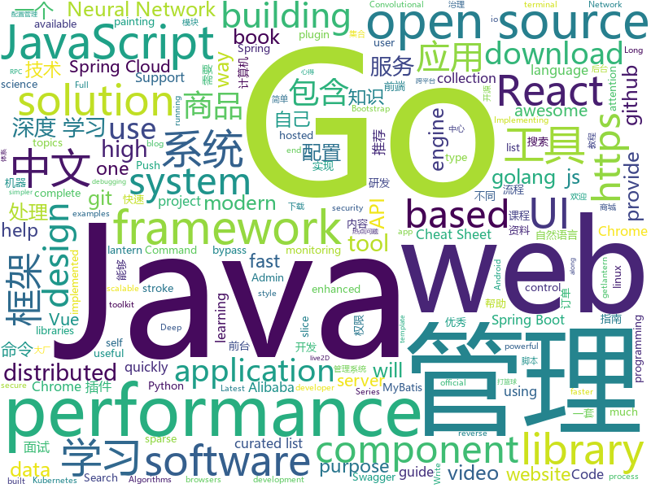

# 2019-04-27
See what the GitHub community is most excited about today.

## python
* [PySnooper](https://github.com/cool-RR/PySnooper)(**540 stars today**): Never use print for debugging again
* [Python](https://github.com/TheAlgorithms/Python)(**476 stars today**): All Algorithms implemented in Python
* [Python-100-Days](https://github.com/jackfrued/Python-100-Days)(**201 stars today**): Python - 100天从新手到大师
* [fklearn](https://github.com/nubank/fklearn)(**194 stars today**): fklearn: Functional Machine Learning
* [AiLearning](https://github.com/apachecn/AiLearning)(**151 stars today**): AiLearning: 机器学习 - MachineLearning - ML、深度学习 - DeepLearning - DL、自然语言处理 NLP
* [manim](https://github.com/3b1b/manim)(**98 stars today**): Animation engine for explanatory math videos
* [ChromeAppHeroes](https://github.com/zhaoolee/ChromeAppHeroes)(**85 stars today**): 🌈谷粒-Chrome插件英雄榜, 为优秀的Chrome插件写一本中文说明书, 让Chrome插件英雄们造福人类~ ChromePluginHeroes, Write a Chinese manual for the excellent Chrome plugin, let the Chrome plugin heroes benefit the human~
* [LearningToPaint](https://github.com/hzwer/LearningToPaint)(**83 stars today**): A painting AI that can reproduce paintings stroke by stroke using deep reinforcement learning.
* [koalas](https://github.com/databricks/koalas)(**81 stars today**): Koalas: Pandas API on Apache Spark
* [models](https://github.com/tensorflow/models)(**55 stars today**): Models and examples built with TensorFlow
* [faceswap](https://github.com/deepfakes/faceswap)(**68 stars today**): Non official project based on original /r/Deepfakes thread. Many thanks to him!
* [pytorch-toolbelt](https://github.com/BloodAxe/pytorch-toolbelt)(**75 stars today**): PyTorch extensions for fast R&D prototyping and Kaggle farming
* [awesome-python](https://github.com/vinta/awesome-python)(**66 stars today**): A curated list of awesome Python frameworks, libraries, software and resources
* [adidnsdump](https://github.com/dirkjanm/adidnsdump)(**64 stars today**): Active Directory Integrated DNS dumping by any authenticated user
* [sparse_attention](https://github.com/openai/sparse_attention)(**63 stars today**): Examples of using sparse attention, as in "Generating Long Sequences with Sparse Transformers"
* [youtube-dl](https://github.com/ytdl-org/youtube-dl)(**59 stars today**): Command-line program to download videos from YouTube.com and other video sites
* [system-design-primer](https://github.com/donnemartin/system-design-primer)(**54 stars today**): Learn how to design large-scale systems. Prep for the system design interview. Includes Anki flashcards.
* [cheat.sh](https://github.com/chubin/cheat.sh)(**57 stars today**): the only cheat sheet you need
* [PayloadsAllTheThings](https://github.com/swisskyrepo/PayloadsAllTheThings)(**44 stars today**): A list of useful payloads and bypass for Web Application Security and Pentest/CTF
* [you-get](https://github.com/soimort/you-get)(**48 stars today**): ⏬Dumb downloader that scrapes the web
* [keras](https://github.com/keras-team/keras)(**40 stars today**): Deep Learning for humans
* [pandas](https://github.com/pandas-dev/pandas)(**43 stars today**): Flexible and powerful data analysis / manipulation library for Python, providing labeled data structures similar to R data.frame objects, statistical functions, and much more
* [CheatSheetSeries](https://github.com/OWASP/CheatSheetSeries)(**41 stars today**): The OWASP Cheat Sheet Series was created to provide a concise collection of high value information on specific application security topics.
* [Attention-Augmented-Conv2d](https://github.com/leaderj1001/Attention-Augmented-Conv2d)(**42 stars today**): Implementing Attention Augmented Convolutional Networks using Pytorch
* [CNVD-C-2019-48814](https://github.com/jas502n/CNVD-C-2019-48814)(**40 stars today**): WebLogic wls9-async反序列化远程命令执行漏洞

## java
* [JavaGuide](https://github.com/Snailclimb/JavaGuide)(**202 stars today**): 【Java学习+面试指南】 一份涵盖大部分Java程序员所需要掌握的核心知识。
* [advanced-java](https://github.com/doocs/advanced-java)(**90 stars today**): 😮互联网 Java 工程师进阶知识完全扫盲
* [skywalking](https://github.com/apache/skywalking)(**89 stars today**): APM, Application Performance Monitoring System
* [easyexcel](https://github.com/alibaba/easyexcel)(**80 stars today**): 快速、简单避免OOM的java处理Excel工具
* [spring-boot-examples](https://github.com/ityouknow/spring-boot-examples)(**72 stars today**): about learning Spring Boot via examples. Spring Boot 教程、技术栈示例代码，快速简单上手教程。
* [mall](https://github.com/macrozheng/mall)(**69 stars today**): mall项目是一套电商系统，包括前台商城系统及后台管理系统，基于SpringBoot+MyBatis实现。 前台商城系统包含首页门户、商品推荐、商品搜索、商品展示、购物车、订单流程、会员中心、客户服务、帮助中心等模块。 后台管理系统包含商品管理、订单管理、会员管理、促销管理、运营管理、内容管理、统计报表、财务管理、权限管理、设置等模块。
* [server](https://github.com/wildfirechat/server)(**72 stars today**): 全开源即时通讯(IM)系统
* [SwipePanel](https://github.com/Blankj/SwipePanel)(**72 stars today**): Android 侧划，如斯优雅
* [spring-boot](https://github.com/spring-projects/spring-boot)(**57 stars today**): Spring Boot
* [seata](https://github.com/seata/seata)(**52 stars today**): 🔥Seata is an easy-to-use, high-performance, java based, open source distributed transaction solution.
* [apollo](https://github.com/ctripcorp/apollo)(**48 stars today**): Apollo（阿波罗）是携程框架部门研发的分布式配置中心，能够集中化管理应用不同环境、不同集群的配置，配置修改后能够实时推送到应用端，并且具备规范的权限、流程治理等特性，适用于微服务配置管理场景。
* [spring-cloud-alibaba](https://github.com/spring-cloud-incubator/spring-cloud-alibaba)(**47 stars today**): Spring Cloud Alibaba provides a one-stop solution for application development for the distributed solutions of Alibaba middleware.
* [HanLP](https://github.com/hankcs/HanLP)(**50 stars today**): 自然语言处理 中文分词 词性标注 命名实体识别 依存句法分析 新词发现 关键词短语提取 自动摘要 文本分类聚类 拼音简繁
* [halo](https://github.com/halo-dev/halo)(**45 stars today**): ✍ Halo 可能是最好的 Java 博客系统
* [Moss](https://github.com/SpringCloud/Moss)(**47 stars today**): Moss(莫斯)-Spring Cloud体系的服务治理平台，让Spring Cloud应用不再流浪！欢迎Star！
* [elasticsearch](https://github.com/elastic/elasticsearch)(**38 stars today**): Open Source, Distributed, RESTful Search Engine
* [Java](https://github.com/TheAlgorithms/Java)(**43 stars today**): All Algorithms implemented in Java
* [incubator-dubbo](https://github.com/apache/incubator-dubbo)(**34 stars today**): Apache Dubbo (incubating) is a high-performance, java based, open source RPC framework.
* [hutool](https://github.com/looly/hutool)(**39 stars today**): A set of tools that keep Java sweet.
* [spring-framework](https://github.com/spring-projects/spring-framework)(**32 stars today**): Spring Framework
* [tutorials](https://github.com/eugenp/tutorials)(**25 stars today**): The "REST With Spring" Course:
* [DoraemonKit](https://github.com/didi/DoraemonKit)(**39 stars today**): 简称 "DoKit" 。一款功能齐全的客户端（ iOS 、Android ）研发助手，你值得拥有。
* [mybatis-plus](https://github.com/baomidou/mybatis-plus)(**37 stars today**): An powerful enhanced toolkit of MyBatis for simplify development
* [ghidra](https://github.com/NationalSecurityAgency/ghidra)(**32 stars today**): Ghidra is a software reverse engineering (SRE) framework
* [arthas](https://github.com/alibaba/arthas)(**31 stars today**): Alibaba Java Diagnostic Tool Arthas/Alibaba Java诊断利器Arthas

## unknown
* [support.996.ICU](https://github.com/MSWorkers/support.996.ICU)(**465 stars today**): Microsoft and GitHub Workers Support 996.ICU
* [golang-developer-roadmap](https://github.com/Alikhll/golang-developer-roadmap)(**381 stars today**): Roadmap to becoming a Go developer in 2019
* [golang-developer-roadmap-cn](https://github.com/Quorafind/golang-developer-roadmap-cn)(**326 stars today**): 在 2019 成为一名 Go 开发者的路线图。为学习 Go 的人而准备。
* [commit-messages-guide](https://github.com/RomuloOliveira/commit-messages-guide)(**251 stars today**): A guide to understand the importance of commit messages and how to write them well
* [git-tips](https://github.com/521xueweihan/git-tips)(**137 stars today**): Git的奇技淫巧
* [CS-Notes](https://github.com/CyC2018/CS-Notes)(**100 stars today**): 📚技术面试必备基础知识
* [gitignore](https://github.com/github/gitignore)(**75 stars today**): A collection of useful .gitignore templates
* [MYSQL_SQL_BYPASS_WIKI](https://github.com/aleenzz/MYSQL_SQL_BYPASS_WIKI)(**84 stars today**): mysql注入,bypass的一些心得
* [SJTU-Courses](https://github.com/CoolPhilChen/SJTU-Courses)(**79 stars today**): 上海交通大学课程资料分享
* [awesome](https://github.com/sindresorhus/awesome)(**69 stars today**): 😎Awesome lists about all kinds of interesting topics
* [free-programming-books-zh_CN](https://github.com/justjavac/free-programming-books-zh_CN)(**62 stars today**): 📚免费的计算机编程类中文书籍，欢迎投稿
* [You-Dont-Know-JS](https://github.com/getify/You-Dont-Know-JS)(**57 stars today**): A book series on JavaScript. @YDKJS on twitter.
* [coding-interview-university](https://github.com/jwasham/coding-interview-university)(**52 stars today**): A complete computer science study plan to become a software engineer.
* [DeepLearning-500-questions](https://github.com/scutan90/DeepLearning-500-questions)(**47 stars today**): 深度学习500问，以问答形式对常用的概率知识、线性代数、机器学习、深度学习、计算机视觉等热点问题进行阐述，以帮助自己及有需要的读者。 全书分为18个章节，50余万字。由于水平有限，书中不妥之处恳请广大读者批评指正。 未完待续............ 如有意合作，联系scutjy2015@163.com 版权所有，违权必究 Tan 2018.06
* [first-contributions](https://github.com/firstcontributions/first-contributions)(**36 stars today**): 🚀✨Help beginners to contribute to open source projects
* [Weekly-FE-Interview](https://github.com/airuikun/Weekly-FE-Interview)(**55 stars today**): 每周十道前端大厂面试题，并收集大家在大厂面试中遇到的难题，一起共同成长。
* [stockpredictionai](https://github.com/borisbanushev/stockpredictionai)(**47 stars today**): In this noteboook I will create a complete process for predicting stock price movements. Follow along and we will achieve some pretty good results. For that purpose we will use a Generative Adversarial Network (GAN) with LSTM, a type of Recurrent Neural Network, as generator, and a Convolutional Neural Network, CNN, as a discriminator. We use L…
* [awesome-spider](https://github.com/facert/awesome-spider)(**50 stars today**): 爬虫集合
* [Book-Recommend-Github](https://github.com/iOShuyang/Book-Recommend-Github)(**48 stars today**): 推荐生活当中积累的优秀Objective-C和Swift三方库
* [Data-Science--Cheat-Sheet](https://github.com/abhat222/Data-Science--Cheat-Sheet)(**40 stars today**): Cheat Sheets
* [architect-awesome](https://github.com/xingshaocheng/architect-awesome)(**47 stars today**): 后端架构师技术图谱
* [free-programming-books](https://github.com/EbookFoundation/free-programming-books)(**40 stars today**): 📚Freely available programming books
* [996.Leave](https://github.com/623637646/996.Leave)(**44 stars today**): 逃离996
* [download](https://github.com/getlantern/download)(**43 stars today**): 🔴蓝灯最新版本下载 https://github.com/getlantern/download🔴Lantern Latest Download https://github.com/getlantern/lantern/releases/tag/latest🔴
* [hosts](https://github.com/googlehosts/hosts)(**40 stars today**): 镜像：https://coding.net/u/scaffrey/p/hosts/git

## javascript
* [svelte](https://github.com/sveltejs/svelte)(**412 stars today**): Cybernetically enhanced web apps
* [leetcode](https://github.com/azl397985856/leetcode)(**294 stars today**): leetcode题解，记录自己的leecode解题之路。
* [uppy](https://github.com/transloadit/uppy)(**255 stars today**): The next open source file uploader for web browsers🐶
* [edex-ui](https://github.com/GitSquared/edex-ui)(**222 stars today**): A cross-platform, customizable science fiction terminal emulator with advanced monitoring & touchscreen support.
* [tool](https://github.com/Louiszhai/tool)(**208 stars today**): 开发效率提升：Mac生产力工具链推荐
* [vue](https://github.com/vuejs/vue)(**128 stars today**): 🖖Vue.js is a progressive, incrementally-adoptable JavaScript framework for building UI on the web.
* [baseui](https://github.com/uber-web/baseui)(**126 stars today**): A React Component library implementing the Base design language
* [libpku](https://github.com/lib-pku/libpku)(**97 stars today**): 贵校课程资料民间整理
* [bento-starter](https://github.com/kefranabg/bento-starter)(**109 stars today**): 🍱Full-Stack Open-Source solution to quickly build PWA applications
* [react](https://github.com/facebook/react)(**81 stars today**): A declarative, efficient, and flexible JavaScript library for building user interfaces.
* [React95](https://github.com/arturbien/React95)(**86 stars today**): 🌈🕹Refreshed Windows 95 style UI components for your React app
* [create-react-app](https://github.com/facebook/create-react-app)(**74 stars today**): Set up a modern web app by running one command.
* [Motrix](https://github.com/agalwood/Motrix)(**81 stars today**): A full-featured download manager.
* [baiduyun](https://github.com/syhyz1990/baiduyun)(**78 stars today**): 油猴脚本 一个脚本搞定百度网盘下载
* [oloquinho](https://github.com/oloquinho/oloquinho)(**77 stars today**): 🎤Oloquinho meu
* [node](https://github.com/nodejs/node)(**72 stars today**): Node.js JavaScript runtime✨🐢🚀✨
* [html2canvas](https://github.com/niklasvh/html2canvas)(**73 stars today**): Screenshots with JavaScript
* [uform](https://github.com/alibaba/uform)(**69 stars today**): React High Performance Form Solution For Enterprise.
* [wouter](https://github.com/molefrog/wouter)(**67 stars today**): A minimalistic (~1KB) routing for React. Nothing else but HOOKS.
* [mockit](https://github.com/boyney123/mockit)(**67 stars today**): A tool to quickly mock out end points, setup delays and more...
* [cxk-ball](https://github.com/kasuganosoras/cxk-ball)(**62 stars today**): 🏀Javascript 实现的 CXK 打篮球游戏
* [storybook](https://github.com/storybooks/storybook)(**57 stars today**): UI component dev & test: React, Vue, Angular, React Native, Ember, Web Components & more!
* [shepherd](https://github.com/shipshapecode/shepherd)(**60 stars today**): Guide your users through a tour of your app
* [uni-app](https://github.com/dcloudio/uni-app)(**55 stars today**): 使用 Vue.js 开发跨平台应用的前端框架
* [web-push](https://github.com/web-push-libs/web-push)(**56 stars today**): Web Push library for Node.js

## html
* [watchme](https://github.com/vsoch/watchme)(**299 stars today**): Reproducible watchers for research
* [linux-command](https://github.com/jaywcjlove/linux-command)(**38 stars today**): Linux命令大全搜索工具，内容包含Linux命令手册、详解、学习、搜集。https://git.io/linux
* [nndl.github.io](https://github.com/nndl/nndl.github.io)(**33 stars today**): 《神经网络与深度学习》 Neural Network and Deep Learning
* [AdminLTE](https://github.com/ColorlibHQ/AdminLTE)(**31 stars today**): AdminLTE - Free Premium Admin control Panel Theme Based On Bootstrap 3.x
* [styleguide](https://github.com/google/styleguide)(**21 stars today**): Style guides for Google-originated open-source projects
* [BTCO](https://github.com/LF112/BTCO)(**23 stars today**): 🎉宝塔面板响应式解决方案
* [live2D](https://github.com/fguby/live2D)(**20 stars today**): 来定制一个自己专属的live2D看板娘吧(๑•̀ㅂ•́)و✧
* [personal-website](https://github.com/github/personal-website)(**15 stars today**): Code that'll help you kickstart a personal website that showcases your work as a software developer.
* [water.css](https://github.com/kognise/water.css)(**18 stars today**): A just-add-css collection of styles to make simple websites just a little nicer
* [front-end-handbook-2019](https://github.com/FrontendMasters/front-end-handbook-2019)(**18 stars today**): [Book] 2019 edition of our front-end development handbook
* [en.javascript.info](https://github.com/javascript-tutorial/en.javascript.info)(**15 stars today**): Modern JavaScript Tutorial
* [portainer](https://github.com/portainer/portainer)(**14 stars today**): Simple management UI for Docker
* [Spoon-Knife](https://github.com/octocat/Spoon-Knife)(****): This repo is for demonstration purposes only.
* [WebFundamentals](https://github.com/google/WebFundamentals)(**9 stars today**): Best practices for modern web development
* [sourcegraph](https://github.com/sourcegraph/sourcegraph)(**12 stars today**): Code search and navigation tool (self-hosted)
* [MikuTools](https://github.com/Ice-Hazymoon/MikuTools)(**12 stars today**): 一个轻量的工具集合
* [electron-api-demos](https://github.com/electron/electron-api-demos)(**10 stars today**): Explore the Electron APIs
* [qiubaiying.github.io](https://github.com/qiubaiying/qiubaiying.github.io)(**5 stars today**): BY Blog ->
* [all-contributors](https://github.com/all-contributors/all-contributors)(**10 stars today**): ✨Recognize all contributors, not just the ones who push code✨
* [OUCML](https://github.com/OUCMachineLearning/OUCML)(**9 stars today**): 
* [swagger-codegen](https://github.com/swagger-api/swagger-codegen)(**10 stars today**): swagger-codegen contains a template-driven engine to generate documentation, API clients and server stubs in different languages by parsing your OpenAPI / Swagger definition.
* [ConardLi.github.io](https://github.com/ConardLi/ConardLi.github.io)(**10 stars today**): ConardLi 写blog的地方
* [ecma262](https://github.com/tc39/ecma262)(**10 stars today**): Status, process, and documents for ECMA262
* [devops-essentials-sample-app](https://github.com/linuxacademy/devops-essentials-sample-app)(****): 
* [gentelella](https://github.com/ColorlibHQ/gentelella)(**7 stars today**): Free Bootstrap 3 Admin Template

## go
* [termshark](https://github.com/gcla/termshark)(**307 stars today**): A terminal UI for tshark, inspired by Wireshark
* [kratos](https://github.com/bilibili/kratos)(**285 stars today**): Kratos是bilibili开源的一套Go微服务框架，包含大量微服务相关框架及工具。
* [jingo](https://github.com/bet365/jingo)(**144 stars today**): This package provides the ability to encode golang structs to a buffer as JSON very quickly.
* [k3os](https://github.com/rancher/k3os)(**138 stars today**): Purpose built OS for Kubernetes and fully managed by Kubernetes.
* [pie](https://github.com/elliotchance/pie)(**106 stars today**): 🍕Enjoy a slice! A utility library for dealing with slices that focuses on type safety and performance.
* [go](https://github.com/golang/go)(**87 stars today**): The Go programming language
* [sshcode](https://github.com/codercom/sshcode)(**82 stars today**): Run VS Code on any server over SSH.
* [dexon](https://github.com/dexon-foundation/dexon)(**77 stars today**): Official golang DEXON fullnode implementation
* [kubernetes](https://github.com/kubernetes/kubernetes)(**60 stars today**): Production-Grade Container Scheduling and Management
* [v](https://github.com/vlang/v)(**63 stars today**): Simple, fast, safe, compiled language for creating maintainable software. Supports translation from C/C++.
* [go-patterns](https://github.com/tmrts/go-patterns)(**60 stars today**): Curated list of Go design patterns, recipes and idioms
* [git-bug](https://github.com/MichaelMure/git-bug)(**58 stars today**): Distributed bug tracker embedded in git
* [frp](https://github.com/fatedier/frp)(**54 stars today**): A fast reverse proxy to help you expose a local server behind a NAT or firewall to the internet.
* [cadence](https://github.com/uber/cadence)(**57 stars today**): Cadence is a distributed, scalable, durable, and highly available orchestration engine to execute asynchronous long-running business logic in a scalable and resilient way.
* [gitea](https://github.com/go-gitea/gitea)(**51 stars today**): Git with a cup of tea, painless self-hosted git service
* [gin](https://github.com/gin-gonic/gin)(**52 stars today**): Gin is a HTTP web framework written in Go (Golang). It features a Martini-like API with much better performance -- up to 40 times faster. If you need smashing performance, get yourself some Gin.
* [the-way-to-go_ZH_CN](https://github.com/Unknwon/the-way-to-go_ZH_CN)(**47 stars today**): 《The Way to Go》中文译本，中文正式名《Go 入门指南》
* [CookieScanner](https://github.com/CovenantSQL/CookieScanner)(**49 stars today**): Cookie Scanner for GDPR compliance
* [awesome-go](https://github.com/avelino/awesome-go)(**46 stars today**): A curated list of awesome Go frameworks, libraries and software
* [Bilibili-Go-Backup](https://github.com/legoming/Bilibili-Go-Backup)(****): Bilibili-Go-Backup
* [linuxkit](https://github.com/linuxkit/linuxkit)(**41 stars today**): A toolkit for building secure, portable and lean operating systems for containers
* [istio](https://github.com/istio/istio)(**35 stars today**): Connect, secure, control, and observe services.
* [hugo](https://github.com/gohugoio/hugo)(**36 stars today**): The world’s fastest framework for building websites.
* [cobra](https://github.com/spf13/cobra)(**34 stars today**): A Commander for modern Go CLI interactions
* [chromedp](https://github.com/chromedp/chromedp)(**35 stars today**): A faster, simpler way to drive browsers supporting the Chrome DevTools Protocol.

## WordCloud

