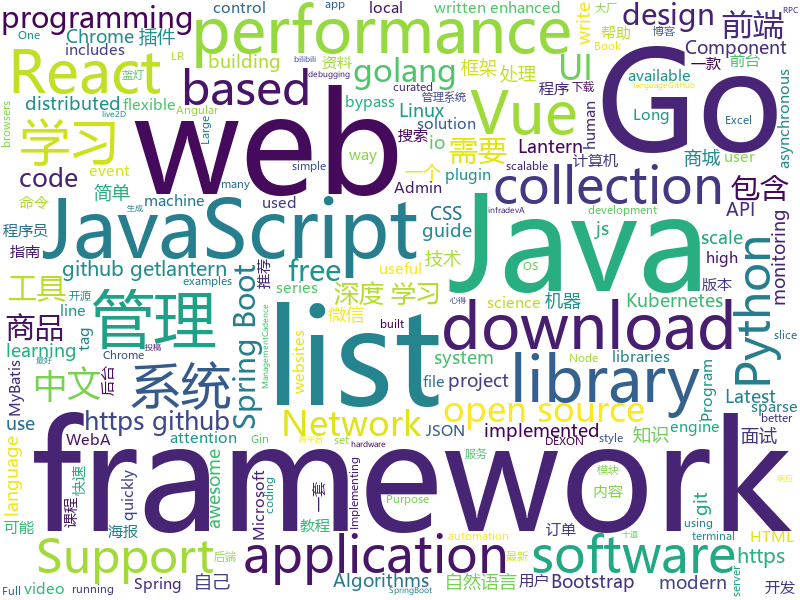

# 2019-04-28
See what the GitHub community is most excited about today.

## python
* [Python](https://github.com/TheAlgorithms/Python)(**1,064 stars today**): All Algorithms implemented in Python
* [PySnooper](https://github.com/cool-RR/PySnooper)(**298 stars today**): Never use print for debugging again
* [fklearn](https://github.com/nubank/fklearn)(**83 stars today**): fklearn: Functional Machine Learning
* [Python-100-Days](https://github.com/jackfrued/Python-100-Days)(**66 stars today**): Python - 100天从新手到大师
* [AiLearning](https://github.com/apachecn/AiLearning)(**61 stars today**): AiLearning: 机器学习 - MachineLearning - ML、深度学习 - DeepLearning - DL、自然语言处理 NLP
* [C--Compiler](https://github.com/LiuChangFreeman/C--Compiler)(**57 stars today**): C--compiler which implements LL(1)\LR(0)\SLR\LR(1) and semantic analysis and MIPS generate
* [manim](https://github.com/3b1b/manim)(**56 stars today**): Animation engine for explanatory math videos
* [youtube-dl](https://github.com/ytdl-org/youtube-dl)(**43 stars today**): Command-line program to download videos from YouTube.com and other video sites
* [PayloadsAllTheThings](https://github.com/swisskyrepo/PayloadsAllTheThings)(**45 stars today**): A list of useful payloads and bypass for Web Application Security and Pentest/CTF
* [awesome-python](https://github.com/vinta/awesome-python)(**42 stars today**): A curated list of awesome Python frameworks, libraries, software and resources
* [models](https://github.com/tensorflow/models)(**33 stars today**): Models and examples built with TensorFlow
* [system-design-primer](https://github.com/donnemartin/system-design-primer)(**39 stars today**): Learn how to design large-scale systems. Prep for the system design interview. Includes Anki flashcards.
* [Attention-Augmented-Conv2d](https://github.com/leaderj1001/Attention-Augmented-Conv2d)(**38 stars today**): Implementing Attention Augmented Convolutional Networks using Pytorch
* [ChromeAppHeroes](https://github.com/zhaoolee/ChromeAppHeroes)(**39 stars today**): 🌈谷粒-Chrome插件英雄榜, 为优秀的Chrome插件写一本中文说明书, 让Chrome插件英雄们造福人类~ ChromePluginHeroes, Write a Chinese manual for the excellent Chrome plugin, let the Chrome plugin heroes benefit the human~
* [GCNet](https://github.com/xvjiarui/GCNet)(**36 stars today**): GCNet: Non-local Networks Meet Squeeze-Excitation Networks and Beyond
* [faceswap](https://github.com/deepfakes/faceswap)(**32 stars today**): Non official project based on original /r/Deepfakes thread. Many thanks to him!
* [you-get](https://github.com/soimort/you-get)(**34 stars today**): ⏬Dumb downloader that scrapes the web
* [public-apis](https://github.com/toddmotto/public-apis)(**34 stars today**): A collective list of free APIs for use in software and web development.
* [nlp_base](https://github.com/lpty/nlp_base)(**31 stars today**): 自然语言基础模型
* [home-assistant](https://github.com/home-assistant/home-assistant)(**27 stars today**): 🏡Open source home automation that puts local control and privacy first
* [sparse_attention](https://github.com/openai/sparse_attention)(**29 stars today**): Examples of using sparse attention, as in "Generating Long Sequences with Sparse Transformers"
* [cpython](https://github.com/python/cpython)(**16 stars today**): The Python programming language
* [storyscript](https://github.com/storyscript/storyscript)(**29 stars today**): The programming language for Application Storytelling™
* [django](https://github.com/django/django)(**24 stars today**): The Web framework for perfectionists with deadlines.
* [scikit-learn](https://github.com/scikit-learn/scikit-learn)(**20 stars today**): scikit-learn: machine learning in Python

## java
* [JavaGuide](https://github.com/Snailclimb/JavaGuide)(**110 stars today**): 【Java学习+面试指南】 一份涵盖大部分Java程序员所需要掌握的核心知识。
* [Java](https://github.com/TheAlgorithms/Java)(**68 stars today**): All Algorithms implemented in Java
* [soul](https://github.com/Dromara/soul)(**51 stars today**): High-Performance Java API Gateway
* [advanced-java](https://github.com/doocs/advanced-java)(**41 stars today**): 😮互联网 Java 工程师进阶知识完全扫盲
* [poster-generater](https://github.com/qbhy/poster-generater)(**42 stars today**): ⚡⚡⚡海报生成器. 只需要一个简单的 json 配置即可生成你需要的海报...
* [mall](https://github.com/macrozheng/mall)(**32 stars today**): mall项目是一套电商系统，包括前台商城系统及后台管理系统，基于SpringBoot+MyBatis实现。 前台商城系统包含首页门户、商品推荐、商品搜索、商品展示、购物车、订单流程、会员中心、客户服务、帮助中心等模块。 后台管理系统包含商品管理、订单管理、会员管理、促销管理、运营管理、内容管理、统计报表、财务管理、权限管理、设置等模块。
* [DoraemonKit](https://github.com/didi/DoraemonKit)(**38 stars today**): 简称 "DoKit" 。一款功能齐全的客户端（ iOS 、Android ）研发助手，你值得拥有。
* [skywalking](https://github.com/apache/skywalking)(**35 stars today**): APM, Application Performance Monitoring System
* [traccar](https://github.com/traccar/traccar)(**35 stars today**): Traccar GPS Tracking System
* [spring-boot-examples](https://github.com/ityouknow/spring-boot-examples)(**28 stars today**): about learning Spring Boot via examples. Spring Boot 教程、技术栈示例代码，快速简单上手教程。
* [spring-framework](https://github.com/spring-projects/spring-framework)(**24 stars today**): Spring Framework
* [halo](https://github.com/halo-dev/halo)(**28 stars today**): ✍ Halo 可能是最好的 Java 博客系统
* [hutool](https://github.com/looly/hutool)(**28 stars today**): A set of tools that keep Java sweet.
* [spring-boot](https://github.com/spring-projects/spring-boot)(**24 stars today**): Spring Boot
* [server](https://github.com/wildfirechat/server)(**27 stars today**): 全开源即时通讯(IM)系统
* [HanLP](https://github.com/hankcs/HanLP)(**22 stars today**): 自然语言处理 中文分词 词性标注 命名实体识别 依存句法分析 新词发现 关键词短语提取 自动摘要 文本分类聚类 拼音简繁
* [tutorials](https://github.com/eugenp/tutorials)(**12 stars today**): The "REST With Spring" Course:
* [ghidra](https://github.com/NationalSecurityAgency/ghidra)(**23 stars today**): Ghidra is a software reverse engineering (SRE) framework
* [easyexcel](https://github.com/alibaba/easyexcel)(**23 stars today**): 快速、简单避免OOM的java处理Excel工具
* [incubator-dubbo](https://github.com/apache/incubator-dubbo)(**19 stars today**): Apache Dubbo (incubating) is a high-performance, java based, open source RPC framework.
* [seata](https://github.com/seata/seata)(**21 stars today**): 🔥Seata is an easy-to-use, high-performance, java based, open source distributed transaction solution.
* [mybatis-plus](https://github.com/baomidou/mybatis-plus)(**21 stars today**): An powerful enhanced toolkit of MyBatis for simplify development
* [netty](https://github.com/netty/netty)(**18 stars today**): Netty project - an event-driven asynchronous network application framework
* [solo](https://github.com/b3log/solo)(**18 stars today**): 🎸一款小而美的博客系统，专为程序员设计。https://hacpai.com/tag/solo
* [litemall](https://github.com/linlinjava/litemall)(**14 stars today**): 又一个小商城。litemall = Spring Boot后端 + Vue管理员前端 + 微信小程序用户前端 + Vue用户移动端

## unknown
* [support.996.ICU](https://github.com/MSWorkers/support.996.ICU)(**196 stars today**): Microsoft and GitHub Workers Support 996.ICU
* [commit-messages-guide](https://github.com/RomuloOliveira/commit-messages-guide)(**143 stars today**): A guide to understand the importance of commit messages and how to write them well
* [golang-developer-roadmap](https://github.com/Alikhll/golang-developer-roadmap)(**135 stars today**): Roadmap to becoming a Go developer in 2019
* [Data-Science--Cheat-Sheet](https://github.com/abhat222/Data-Science--Cheat-Sheet)(**109 stars today**): Cheat Sheets
* [golang-developer-roadmap-cn](https://github.com/Quorafind/golang-developer-roadmap-cn)(**133 stars today**): 在 2019 成为一名 Go 开发者的路线图。为学习 Go 的人而准备。
* [git-tips](https://github.com/521xueweihan/git-tips)(**69 stars today**): Git的奇技淫巧
* [awesome](https://github.com/sindresorhus/awesome)(**60 stars today**): 😎Awesome lists about all kinds of interesting topics
* [CS-Notes](https://github.com/CyC2018/CS-Notes)(**48 stars today**): 📚技术面试必备基础知识
* [gitignore](https://github.com/github/gitignore)(**39 stars today**): A collection of useful .gitignore templates
* [MYSQL_SQL_BYPASS_WIKI](https://github.com/aleenzz/MYSQL_SQL_BYPASS_WIKI)(**45 stars today**): mysql注入,bypass的一些心得
* [DeepLearning-500-questions](https://github.com/scutan90/DeepLearning-500-questions)(**47 stars today**): 深度学习500问，以问答形式对常用的概率知识、线性代数、机器学习、深度学习、计算机视觉等热点问题进行阐述，以帮助自己及有需要的读者。 全书分为18个章节，50余万字。由于水平有限，书中不妥之处恳请广大读者批评指正。 未完待续............ 如有意合作，联系scutjy2015@163.com 版权所有，违权必究 Tan 2018.06
* [architect-awesome](https://github.com/xingshaocheng/architect-awesome)(**43 stars today**): 后端架构师技术图谱
* [free-programming-books-zh_CN](https://github.com/justjavac/free-programming-books-zh_CN)(**45 stars today**): 📚免费的计算机编程类中文书籍，欢迎投稿
* [You-Dont-Know-JS](https://github.com/getify/You-Dont-Know-JS)(**42 stars today**): A book series on JavaScript. @YDKJS on twitter.
* [pumpkin-book](https://github.com/datawhalechina/pumpkin-book)(**42 stars today**): 《机器学习》（西瓜书）公式推导解析，在线阅读地址：https://datawhalechina.github.io/pumpkin-book
* [coding-interview-university](https://github.com/jwasham/coding-interview-university)(**37 stars today**): A complete computer science study plan to become a software engineer.
* [SJTU-Courses](https://github.com/CoolPhilChen/SJTU-Courses)(**36 stars today**): 上海交通大学课程资料分享
* [Weekly-FE-Interview](https://github.com/airuikun/Weekly-FE-Interview)(**38 stars today**): 每周十道前端大厂面试题，并收集大家在大厂面试中遇到的难题，一起共同成长。
* [trackerslist](https://github.com/ngosang/trackerslist)(**37 stars today**): An updated list of public BitTorrent trackers
* [hosts](https://github.com/googlehosts/hosts)(**30 stars today**): 镜像：https://coding.net/u/scaffrey/p/hosts/git
* [awesome-wechat-weapp](https://github.com/justjavac/awesome-wechat-weapp)(**33 stars today**): 微信小程序开发资源汇总💯
* [free-programming-books](https://github.com/EbookFoundation/free-programming-books)(**30 stars today**): 📚Freely available programming books
* [app-ideas](https://github.com/florinpop17/app-ideas)(**31 stars today**): A Collection of application ideas which can be used to improve your coding skills.
* [one-python-craftsman](https://github.com/piglei/one-python-craftsman)(**30 stars today**): "One Python Craftsman" is a collection of articles on how to write better python codes.
* [download](https://github.com/getlantern/download)(**24 stars today**): 🔴蓝灯最新版本下载 https://github.com/getlantern/download🔴Lantern Latest Download https://github.com/getlantern/lantern/releases/tag/latest🔴

## javascript
* [uppy](https://github.com/transloadit/uppy)(**352 stars today**): The next open source file uploader for web browsers🐶
* [svelte](https://github.com/sveltejs/svelte)(**226 stars today**): Cybernetically enhanced web apps
* [leetcode](https://github.com/azl397985856/leetcode)(**208 stars today**): leetcode题解，记录自己的leecode解题之路。
* [shepherd](https://github.com/shipshapecode/shepherd)(**156 stars today**): Guide your users through a tour of your app
* [baseui](https://github.com/uber-web/baseui)(**154 stars today**): A React Component library implementing the Base design language
* [mini-github](https://github.com/kezhenxu94/mini-github)(**115 stars today**): GitHub WeChat Mini Program (可能是全网功能最全的 GitHub 微信小程序)
* [edex-ui](https://github.com/GitSquared/edex-ui)(**99 stars today**): A cross-platform, customizable science fiction terminal emulator with advanced monitoring & touchscreen support.
* [vue](https://github.com/vuejs/vue)(**79 stars today**): 🖖Vue.js is a progressive, incrementally-adoptable JavaScript framework for building UI on the web.
* [tool](https://github.com/Louiszhai/tool)(**81 stars today**): 开发效率提升：Mac生产力工具链推荐
* [libpku](https://github.com/lib-pku/libpku)(**62 stars today**): 贵校课程资料民间整理
* [bento-starter](https://github.com/kefranabg/bento-starter)(**61 stars today**): 🍱Full-Stack solution to quickly build PWA applications
* [react](https://github.com/facebook/react)(**55 stars today**): A declarative, efficient, and flexible JavaScript library for building user interfaces.
* [javascript-algorithms](https://github.com/trekhleb/javascript-algorithms)(**47 stars today**): 📝Algorithms and data structures implemented in JavaScript with explanations and links to further readings
* [Motrix](https://github.com/agalwood/Motrix)(**47 stars today**): A full-featured download manager.
* [create-react-app](https://github.com/facebook/create-react-app)(**44 stars today**): Set up a modern web app by running one command.
* [node](https://github.com/nodejs/node)(**42 stars today**): Node.js JavaScript runtime✨🐢🚀✨
* [Sortable](https://github.com/SortableJS/Sortable)(**43 stars today**): Sortable — is a JavaScript library for reorderable drag-and-drop lists on modern browsers and touch devices. No jQuery required. Supports Meteor, AngularJS, React, Polymer, Vue, Knockout and any CSS library, e.g. Bootstrap.
* [RSSHub](https://github.com/DIYgod/RSSHub)(**38 stars today**): 🍰万物皆可 RSS
* [wouter](https://github.com/molefrog/wouter)(**39 stars today**): ⛸A minimalistic (~1KB) routing for React. Nothing else but HOOKS.
* [UnblockNeteaseMusic](https://github.com/nondanee/UnblockNeteaseMusic)(**36 stars today**): Revive unavailable songs for Netease Cloud Music
* [uni-app](https://github.com/dcloudio/uni-app)(**38 stars today**): 使用 Vue.js 开发跨平台应用的前端框架
* [realworld](https://github.com/gothinkster/realworld)(**37 stars today**): "The mother of all demo apps" — Exemplary fullstack Medium.com clone powered by React, Angular, Node, Django, and many more🏅
* [storybook](https://github.com/storybooks/storybook)(**35 stars today**): UI component dev & test: React, Vue, Angular, React Native, Ember, Web Components & more!
* [bootstrap](https://github.com/twbs/bootstrap)(**23 stars today**): The most popular HTML, CSS, and JavaScript framework for developing responsive, mobile first projects on the web.
* [html2canvas](https://github.com/niklasvh/html2canvas)(**32 stars today**): Screenshots with JavaScript

## html
* [watchme](https://github.com/vsoch/watchme)(**188 stars today**): Reproducible watchers for research
* [design-tips](https://github.com/caneco/design-tips)(**146 stars today**): The “🔥Design Tips” series, now in TailwindCSS
* [nndl.github.io](https://github.com/nndl/nndl.github.io)(**29 stars today**): 《神经网络与深度学习》 Neural Network and Deep Learning
* [live2D](https://github.com/fguby/live2D)(**21 stars today**): 来定制一个自己专属的live2D看板娘吧(๑•̀ㅂ•́)و✧
* [styleguide](https://github.com/google/styleguide)(**18 stars today**): Style guides for Google-originated open-source projects
* [blog_os](https://github.com/phil-opp/blog_os)(**18 stars today**): Writing an OS in Rust
* [Spoon-Knife](https://github.com/octocat/Spoon-Knife)(****): This repo is for demonstration purposes only.
* [BTCO](https://github.com/LF112/BTCO)(**15 stars today**): 🎉宝塔面板响应式解决方案
* [linux-command](https://github.com/jaywcjlove/linux-command)(**13 stars today**): Linux命令大全搜索工具，内容包含Linux命令手册、详解、学习、搜集。https://git.io/linux
* [front-end-handbook-2019](https://github.com/FrontendMasters/front-end-handbook-2019)(**14 stars today**): [Book] 2019 edition of our front-end development handbook
* [en.javascript.info](https://github.com/javascript-tutorial/en.javascript.info)(**13 stars today**): Modern JavaScript Tutorial
* [water.css](https://github.com/kognise/water.css)(**13 stars today**): A just-add-css collection of styles to make simple websites just a little nicer
* [AdminLTE](https://github.com/ColorlibHQ/AdminLTE)(**8 stars today**): AdminLTE - Free Premium Admin control Panel Theme Based On Bootstrap 3.x
* [qiubaiying.github.io](https://github.com/qiubaiying/qiubaiying.github.io)(**5 stars today**): BY Blog ->
* [Iosevka](https://github.com/be5invis/Iosevka)(**9 stars today**): Slender typeface for code, from code.
* [twofactorauth](https://github.com/2factorauth/twofactorauth)(**8 stars today**): List of sites with two factor auth support which includes SMS, email, phone calls, hardware, and software.
* [ctf-wiki](https://github.com/ctf-wiki/ctf-wiki)(**7 stars today**): CTF Wiki Online, English version coming!
* [awesome-modern-cpp](https://github.com/rigtorp/awesome-modern-cpp)(**8 stars today**): A collection of resources on modern C++
* [gentelella](https://github.com/ColorlibHQ/gentelella)(**6 stars today**): Free Bootstrap 3 Admin Template
* [OUCML](https://github.com/OUCMachineLearning/OUCML)(**6 stars today**): 
* [requests-html](https://github.com/kennethreitz/requests-html)(**6 stars today**): Pythonic HTML Parsing for Humans™
* [portainer](https://github.com/portainer/portainer)(**6 stars today**): Simple management UI for Docker
* [CTF-notes](https://github.com/Shiva108/CTF-notes)(**6 stars today**): Everything needed for doing CTFs
* [quickstart-js](https://github.com/firebase/quickstart-js)(**5 stars today**): Firebase Quickstart Samples for Web
* [free-for-dev](https://github.com/ripienaar/free-for-dev)(**5 stars today**): A list of SaaS, PaaS and IaaS offerings that have free tiers of interest to devops and infradev

## go
* [websocket](https://github.com/nhooyr/websocket)(**154 stars today**): A minimal and idiomatic WebSocket library for Go
* [termshark](https://github.com/gcla/termshark)(**147 stars today**): A terminal UI for tshark, inspired by Wireshark
* [dexon](https://github.com/dexon-foundation/dexon)(**130 stars today**): Official golang DEXON fullnode implementation
* [kratos](https://github.com/bilibili/kratos)(**107 stars today**): Kratos是bilibili开源的一套Go微服务框架，包含大量微服务相关框架及工具。
* [k3os](https://github.com/rancher/k3os)(**80 stars today**): Purpose built OS for Kubernetes and fully managed by Kubernetes.
* [go-apt](https://github.com/payfazz/go-apt)(**80 stars today**): go-apt is a collection of frameworks that used as a helper and wrapper for some lib in GoLang
* [go](https://github.com/golang/go)(**51 stars today**): The Go programming language
* [pie](https://github.com/elliotchance/pie)(**52 stars today**): 🍕Enjoy a slice! A utility library for dealing with slices and maps that focuses on type safety and performance.
* [beehive](https://github.com/muesli/beehive)(**53 stars today**): A flexible event/agent & automation system with lots of bees🐝
* [jingo](https://github.com/bet365/jingo)(**52 stars today**): This package provides the ability to encode golang structs to a buffer as JSON very quickly.
* [dexon-consensus](https://github.com/dexon-foundation/dexon-consensus)(**47 stars today**): DEXON consensus Implementation & Simulation
* [sshcode](https://github.com/cdr/sshcode)(**45 stars today**): Run VS Code on any server over SSH.
* [kboom](https://github.com/mhausenblas/kboom)(**41 stars today**): The Kubernetes scale & soak load tester
* [redis-tui](https://github.com/mylxsw/redis-tui)(**39 stars today**): A Redis Text-based UI client in CLI
* [v](https://github.com/vlang/v)(**38 stars today**): Simple, fast, safe, compiled language for creating maintainable software. Supports translation from C/C++.
* [Platypus](https://github.com/gmemstr/Platypus)(**37 stars today**): Large-scale server monitoring application written in Golang
* [kubernetes](https://github.com/kubernetes/kubernetes)(**30 stars today**): Production-Grade Container Scheduling and Management
* [cadence](https://github.com/uber/cadence)(**30 stars today**): Cadence is a distributed, scalable, durable, and highly available orchestration engine to execute asynchronous long-running business logic in a scalable and resilient way.
* [awesome-go](https://github.com/avelino/awesome-go)(**25 stars today**): A curated list of awesome Go frameworks, libraries and software
* [hugo](https://github.com/gohugoio/hugo)(**26 stars today**): The world’s fastest framework for building websites.
* [excelize](https://github.com/360EntSecGroup-Skylar/excelize)(**27 stars today**): Golang library for reading and writing Microsoft Excel™ (XLSX) files.
* [the-way-to-go_ZH_CN](https://github.com/Unknwon/the-way-to-go_ZH_CN)(**24 stars today**): 《The Way to Go》中文译本，中文正式名《Go 入门指南》
* [gin](https://github.com/gin-gonic/gin)(**23 stars today**): Gin is a HTTP web framework written in Go (Golang). It features a Martini-like API with much better performance -- up to 40 times faster. If you need smashing performance, get yourself some Gin.
* [lantern](https://github.com/getlantern/lantern)(**22 stars today**): 🔴蓝灯最新版本下载 https://github.com/getlantern/download🔴Lantern Latest Download https://github.com/getlantern/download🔴
* [minikeyvalue](https://github.com/geohot/minikeyvalue)(**24 stars today**): A distributed key value store in under 200 lines

## WordCloud

