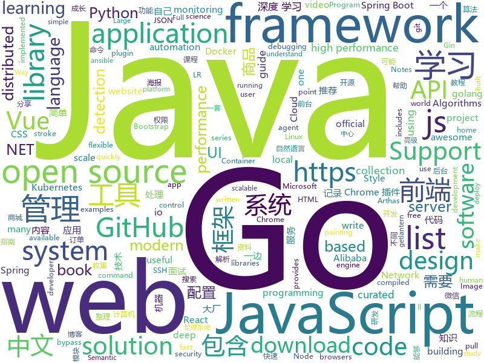

# 2019-04-29
See what the GitHub community is most excited about today.

## python
* [Python](https://github.com/TheAlgorithms/Python)(**2,725 stars today**): All Algorithms implemented in Python
* [PySnooper](https://github.com/cool-RR/PySnooper)(**366 stars today**): Never use print for debugging again
* [AiLearning](https://github.com/apachecn/AiLearning)(**109 stars today**): AiLearning: 机器学习 - MachineLearning - ML、深度学习 - DeepLearning - DL、自然语言处理 NLP
* [Python-100-Days](https://github.com/jackfrued/Python-100-Days)(**94 stars today**): Python - 100天从新手到大师
* [Learn-Web-Hacking](https://github.com/LyleMi/Learn-Web-Hacking)(**91 stars today**): Study Notes For Web Hacking
* [dirmap](https://github.com/H4ckForJob/dirmap)(**90 stars today**): 一个高级web目录扫描工具，功能将会强于DirBuster、Dirsearch、cansina、御剑
* [models](https://github.com/tensorflow/models)(**66 stars today**): Models and examples built with TensorFlow
* [LearningToPaint](https://github.com/hzwer/LearningToPaint)(**79 stars today**): A painting AI that can reproduce paintings stroke by stroke using deep reinforcement learning.
* [ChromeAppHeroes](https://github.com/zhaoolee/ChromeAppHeroes)(**76 stars today**): 🌈谷粒-Chrome插件英雄榜, 为优秀的Chrome插件写一本中文说明书, 让Chrome插件英雄们造福人类~ ChromePluginHeroes, Write a Chinese manual for the excellent Chrome plugin, let the Chrome plugin heroes benefit the human~
* [stackprinter](https://github.com/cknd/stackprinter)(**71 stars today**): Debugging-friendly tracebacks for Python
* [awesome-python](https://github.com/vinta/awesome-python)(**58 stars today**): A curated list of awesome Python frameworks, libraries, software and resources
* [manim](https://github.com/3b1b/manim)(**59 stars today**): Animation engine for explanatory math videos
* [system-design-primer](https://github.com/donnemartin/system-design-primer)(**53 stars today**): Learn how to design large-scale systems. Prep for the system design interview. Includes Anki flashcards.
* [GCNet](https://github.com/xvjiarui/GCNet)(**52 stars today**): GCNet: Non-local Networks Meet Squeeze-Excitation Networks and Beyond
* [keras](https://github.com/keras-team/keras)(**39 stars today**): Deep Learning for humans
* [youtube-dl](https://github.com/ytdl-org/youtube-dl)(**42 stars today**): Command-line program to download videos from YouTube.com and other video sites
* [face_recognition](https://github.com/ageitgey/face_recognition)(**40 stars today**): The world's simplest facial recognition api for Python and the command line
* [faceswap](https://github.com/deepfakes/faceswap)(**33 stars today**): Non official project based on original /r/Deepfakes thread. Many thanks to him!
* [SPADE](https://github.com/NVlabs/SPADE)(**36 stars today**): Semantic Image Synthesis with SPADE
* [PayloadsAllTheThings](https://github.com/swisskyrepo/PayloadsAllTheThings)(**33 stars today**): A list of useful payloads and bypass for Web Application Security and Pentest/CTF
* [fklearn](https://github.com/nubank/fklearn)(**36 stars today**): fklearn: Functional Machine Learning
* [C--Compiler](https://github.com/LiuChangFreeman/C--Compiler)(**34 stars today**): C--compiler which implements LL(1)\LR(0)\SLR\LR(1) and semantic analysis and MIPS generate
* [CenterNet](https://github.com/xingyizhou/CenterNet)(**33 stars today**): Object detection, 3D detection, and pose estimation using center point detection:
* [home-assistant](https://github.com/home-assistant/home-assistant)(**25 stars today**): 🏡Open source home automation that puts local control and privacy first
* [ansible](https://github.com/ansible/ansible)(**28 stars today**): Ansible is a radically simple IT automation platform that makes your applications and systems easier to deploy. Avoid writing scripts or custom code to deploy and update your applications — automate in a language that approaches plain English, using SSH, with no agents to install on remote systems. https://docs.ansible.com/ansible/

## java
* [DoraemonKit](https://github.com/didi/DoraemonKit)(**446 stars today**): 简称 "DoKit" 。一款功能齐全的客户端（ iOS 、Android ）研发助手，你值得拥有。
* [JavaGuide](https://github.com/Snailclimb/JavaGuide)(**209 stars today**): 【Java学习+面试指南】 一份涵盖大部分Java程序员所需要掌握的核心知识。
* [skywalking](https://github.com/apache/skywalking)(**168 stars today**): APM, Application Performance Monitoring System
* [UI2018](https://github.com/zincPower/UI2018)(**159 stars today**): 安卓高级UI代码整理和博客代码Demo
* [ZXBlog](https://github.com/ZXZxin/ZXBlog)(**134 stars today**): 记录各种学习笔记(算法、Java、数据库、并发......)
* [advanced-java](https://github.com/doocs/advanced-java)(**115 stars today**): 😮互联网 Java 工程师进阶知识完全扫盲
* [JGrowing](https://github.com/javagrowing/JGrowing)(**104 stars today**): Java is Growing up but not only Java。Java成长路线，但学到不仅仅是Java。
* [j2cl](https://github.com/google/j2cl)(**94 stars today**): Java to Closure JavaScript transpiler
* [poster-generater](https://github.com/qbhy/poster-generater)(**70 stars today**): ⚡⚡⚡海报生成器. 只需要一个简单的 json 配置即可生成你需要的海报...
* [spring-boot-examples](https://github.com/ityouknow/spring-boot-examples)(**57 stars today**): about learning Spring Boot via examples. Spring Boot 教程、技术栈示例代码，快速简单上手教程。
* [mall](https://github.com/macrozheng/mall)(**56 stars today**): mall项目是一套电商系统，包括前台商城系统及后台管理系统，基于SpringBoot+MyBatis实现。 前台商城系统包含首页门户、商品推荐、商品搜索、商品展示、购物车、订单流程、会员中心、客户服务、帮助中心等模块。 后台管理系统包含商品管理、订单管理、会员管理、促销管理、运营管理、内容管理、统计报表、财务管理、权限管理、设置等模块。
* [spring-boot](https://github.com/spring-projects/spring-boot)(**53 stars today**): Spring Boot
* [easyexcel](https://github.com/alibaba/easyexcel)(**54 stars today**): 快速、简单避免OOM的java处理Excel工具
* [soul](https://github.com/Dromara/soul)(**52 stars today**): High-Performance Java API Gateway
* [seata](https://github.com/seata/seata)(**48 stars today**): 🔥Seata is an easy-to-use, high-performance, java based, open source distributed transaction solution.
* [server](https://github.com/wildfirechat/server)(**46 stars today**): 全开源即时通讯(IM)系统
* [apollo](https://github.com/ctripcorp/apollo)(**41 stars today**): Apollo（阿波罗）是携程框架部门研发的分布式配置中心，能够集中化管理应用不同环境、不同集群的配置，配置修改后能够实时推送到应用端，并且具备规范的权限、流程治理等特性，适用于微服务配置管理场景。
* [spring-framework](https://github.com/spring-projects/spring-framework)(**41 stars today**): Spring Framework
* [tutorials](https://github.com/eugenp/tutorials)(**34 stars today**): The "REST With Spring" Course:
* [incubator-dubbo](https://github.com/apache/incubator-dubbo)(**34 stars today**): Apache Dubbo (incubating) is a high-performance, java based, open source RPC framework.
* [spring-cloud-alibaba](https://github.com/spring-cloud-incubator/spring-cloud-alibaba)(**38 stars today**): Spring Cloud Alibaba provides a one-stop solution for application development for the distributed solutions of Alibaba middleware.
* [elasticsearch](https://github.com/elastic/elasticsearch)(**36 stars today**): Open Source, Distributed, RESTful Search Engine
* [arthas](https://github.com/alibaba/arthas)(**39 stars today**): Alibaba Java Diagnostic Tool Arthas/Alibaba Java诊断利器Arthas
* [HanLP](https://github.com/hankcs/HanLP)(**38 stars today**): 自然语言处理 中文分词 词性标注 命名实体识别 依存句法分析 新词发现 关键词短语提取 自动摘要 文本分类聚类 拼音简繁
* [halo](https://github.com/halo-dev/halo)(**34 stars today**): ✍ Halo 可能是最好的 Java 博客系统

## unknown
* [support.996.ICU](https://github.com/MSWorkers/support.996.ICU)(**406 stars today**): Microsoft and GitHub Workers Support 996.ICU
* [Data-Science--Cheat-Sheet](https://github.com/abhat222/Data-Science--Cheat-Sheet)(**331 stars today**): Cheat Sheets
* [golang-developer-roadmap-cn](https://github.com/Quorafind/golang-developer-roadmap-cn)(**173 stars today**): 在 2019 成为一名 Go 开发者的路线图。为学习 Go 的人而准备。
* [commit-messages-guide](https://github.com/RomuloOliveira/commit-messages-guide)(**132 stars today**): A guide to understand the importance of commit messages and how to write them well
* [DeepLearning-500-questions](https://github.com/scutan90/DeepLearning-500-questions)(**108 stars today**): 深度学习500问，以问答形式对常用的概率知识、线性代数、机器学习、深度学习、计算机视觉等热点问题进行阐述，以帮助自己及有需要的读者。 全书分为18个章节，50余万字。由于水平有限，书中不妥之处恳请广大读者批评指正。 未完待续............ 如有意合作，联系scutjy2015@163.com 版权所有，违权必究 Tan 2018.06
* [CS-Notes](https://github.com/CyC2018/CS-Notes)(**109 stars today**): 📚技术面试必备基础知识
* [git-tips](https://github.com/521xueweihan/git-tips)(**108 stars today**): Git的奇技淫巧
* [golang-developer-roadmap](https://github.com/Alikhll/golang-developer-roadmap)(**113 stars today**): Roadmap to becoming a Go developer in 2019
* [one-python-craftsman](https://github.com/piglei/one-python-craftsman)(**78 stars today**): "One Python Craftsman" is a collection of articles on how to write better python codes.
* [free-programming-books-zh_CN](https://github.com/justjavac/free-programming-books-zh_CN)(**71 stars today**): 📚免费的计算机编程类中文书籍，欢迎投稿
* [architect-awesome](https://github.com/xingshaocheng/architect-awesome)(**66 stars today**): 后端架构师技术图谱
* [awesome](https://github.com/sindresorhus/awesome)(**61 stars today**): 😎Awesome lists about all kinds of interesting topics
* [gitignore](https://github.com/github/gitignore)(**52 stars today**): A collection of useful .gitignore templates
* [MYSQL_SQL_BYPASS_WIKI](https://github.com/aleenzz/MYSQL_SQL_BYPASS_WIKI)(**56 stars today**): mysql注入,bypass的一些心得
* [pumpkin-book](https://github.com/datawhalechina/pumpkin-book)(**56 stars today**): 《机器学习》（西瓜书）公式推导解析，在线阅读地址：https://datawhalechina.github.io/pumpkin-book
* [free-programming-books](https://github.com/EbookFoundation/free-programming-books)(**48 stars today**): 📚Freely available programming books
* [awesome-wechat-weapp](https://github.com/justjavac/awesome-wechat-weapp)(**53 stars today**): 微信小程序开发资源汇总💯
* [coding-interview-university](https://github.com/jwasham/coding-interview-university)(**47 stars today**): A complete computer science study plan to become a software engineer.
* [deep_learning_object_detection](https://github.com/hoya012/deep_learning_object_detection)(**42 stars today**): A paper list of object detection using deep learning.
* [Weekly-FE-Interview](https://github.com/airuikun/Weekly-FE-Interview)(**44 stars today**): 每周十道前端大厂面试题，并收集大家在大厂面试中遇到的难题，一起共同成长。
* [awesome-spider](https://github.com/facert/awesome-spider)(**37 stars today**): 爬虫集合
* [trackerslist](https://github.com/ngosang/trackerslist)(**39 stars today**): An updated list of public BitTorrent trackers
* [You-Dont-Know-JS](https://github.com/getify/You-Dont-Know-JS)(**35 stars today**): A book series on JavaScript. @YDKJS on twitter.
* [nginx-admins-handbook](https://github.com/trimstray/nginx-admins-handbook)(**40 stars today**): These notes describes how to improve Nginx performance, security and other important things; @ssllabs A+ 100%.
* [hosts](https://github.com/googlehosts/hosts)(**29 stars today**): 镜像：https://coding.net/u/scaffrey/p/hosts/git

## javascript
* [uppy](https://github.com/transloadit/uppy)(**370 stars today**): The next open source file uploader for web browsers🐶
* [leetcode](https://github.com/azl397985856/leetcode)(**318 stars today**): leetcode题解，记录自己的leecode解题之路。
* [shepherd](https://github.com/shipshapecode/shepherd)(**247 stars today**): Guide your users through a tour of your app
* [tool](https://github.com/Louiszhai/tool)(**194 stars today**): 开发效率提升：Mac生产力工具链推荐
* [svelte](https://github.com/sveltejs/svelte)(**190 stars today**): Cybernetically enhanced web apps
* [mini-github](https://github.com/kezhenxu94/mini-github)(**185 stars today**): GitHub WeChat Mini Program (可能是全网功能最全的 GitHub 微信小程序)
* [NeteaseCloudMusicApi](https://github.com/Binaryify/NeteaseCloudMusicApi)(**112 stars today**): 网易云音乐 Node.js API service
* [baseui](https://github.com/uber-web/baseui)(**144 stars today**): A React Component library implementing the Base design language
* [vue](https://github.com/vuejs/vue)(**112 stars today**): 🖖Vue.js is a progressive, incrementally-adoptable JavaScript framework for building UI on the web.
* [libpku](https://github.com/lib-pku/libpku)(**92 stars today**): 贵校课程资料民间整理
* [bento-starter](https://github.com/kefranabg/bento-starter)(**87 stars today**): 🍱Full-Stack solution to quickly build PWA applications
* [react](https://github.com/facebook/react)(**79 stars today**): A declarative, efficient, and flexible JavaScript library for building user interfaces.
* [note](https://github.com/fyuanfen/note)(**71 stars today**): 前端学习资料合集（包含深入解读JS系列，React、Vue源码分析，前端算法解析，收集大厂面经，前端工程化最佳实践，经典图书分享，推荐好用的前端工具等等，内容不定期更新中。一边记录，一边学习，一边分享）
* [edex-ui](https://github.com/GitSquared/edex-ui)(**60 stars today**): A cross-platform, customizable science fiction terminal emulator with advanced monitoring & touchscreen support.
* [node](https://github.com/nodejs/node)(**53 stars today**): Node.js JavaScript runtime✨🐢🚀✨
* [create-react-app](https://github.com/facebook/create-react-app)(**54 stars today**): Set up a modern web app by running one command.
* [javascript](https://github.com/airbnb/javascript)(**56 stars today**): JavaScript Style Guide
* [uni-app](https://github.com/dcloudio/uni-app)(**60 stars today**): 使用 Vue.js 开发跨平台应用的前端框架
* [Motrix](https://github.com/agalwood/Motrix)(**52 stars today**): A full-featured download manager.
* [Sortable](https://github.com/SortableJS/Sortable)(**51 stars today**): Sortable — is a JavaScript library for reorderable drag-and-drop lists on modern browsers and touch devices. No jQuery required. Supports Meteor, AngularJS, React, Polymer, Vue, Knockout and any CSS library, e.g. Bootstrap.
* [30-seconds-of-code](https://github.com/30-seconds/30-seconds-of-code)(**47 stars today**): A curated collection of useful JavaScript snippets that you can understand in 30 seconds or less.
* [javascript-algorithms](https://github.com/trekhleb/javascript-algorithms)(**39 stars today**): 📝Algorithms and data structures implemented in JavaScript with explanations and links to further readings
* [UnblockNeteaseMusic](https://github.com/nondanee/UnblockNeteaseMusic)(**42 stars today**): Revive unavailable songs for Netease Cloud Music
* [node-video-lib](https://github.com/gkozlenko/node-video-lib)(**44 stars today**): Node.js Video Library / MP4 & FLV parser / HLS muxer
* [bootstrap](https://github.com/twbs/bootstrap)(**29 stars today**): The most popular HTML, CSS, and JavaScript framework for developing responsive, mobile first projects on the web.

## html
* [linux-command](https://github.com/jaywcjlove/linux-command)(**263 stars today**): Linux命令大全搜索工具，内容包含Linux命令手册、详解、学习、搜集。https://git.io/linux
* [design-tips](https://github.com/caneco/design-tips)(**83 stars today**): The “🔥Design Tips” series, now in TailwindCSS
* [zju-icicles](https://github.com/QSCTech/zju-icicles)(**69 stars today**): 浙江大学课程攻略共享计划
* [watchme](https://github.com/vsoch/watchme)(**61 stars today**): Reproducible watchers for research
* [nndl.github.io](https://github.com/nndl/nndl.github.io)(**39 stars today**): 《神经网络与深度学习》 Neural Network and Deep Learning
* [live2D](https://github.com/fguby/live2D)(**22 stars today**): 来定制一个自己专属的live2D看板娘吧(๑•̀ㅂ•́)و✧
* [OUCML](https://github.com/OUCMachineLearning/OUCML)(**20 stars today**): 
* [AdminLTE](https://github.com/ColorlibHQ/AdminLTE)(**17 stars today**): AdminLTE - Free Premium Admin control Panel Theme Based On Bootstrap 3.x
* [ConardLi.github.io](https://github.com/ConardLi/ConardLi.github.io)(**16 stars today**): ConardLi 写blog的地方
* [styleguide](https://github.com/google/styleguide)(**13 stars today**): Style guides for Google-originated open-source projects
* [portainer](https://github.com/portainer/portainer)(**15 stars today**): Simple management UI for Docker
* [flutter-in-action](https://github.com/flutterchina/flutter-in-action)(**12 stars today**): 《Flutter实战》电子书
* [front-end-handbook-2019](https://github.com/FrontendMasters/front-end-handbook-2019)(**13 stars today**): [Book] 2019 edition of our front-end development handbook
* [mescroll](https://github.com/mescroll/mescroll)(**12 stars today**): 精致的下拉刷新和上拉加载 js框架.支持vue,完美运行于移动端和主流PC浏览器 (JS framework for pull-refresh and pull-up-loading)
* [en.javascript.info](https://github.com/javascript-tutorial/en.javascript.info)(**11 stars today**): Modern JavaScript Tutorial
* [personal-website](https://github.com/github/personal-website)(**9 stars today**): Code that'll help you kickstart a personal website that showcases your work as a software developer.
* [dotnet](https://github.com/Microsoft/dotnet)(**11 stars today**): This repo is the official home of .NET on GitHub. It's a great starting point to find many .NET OSS projects from Microsoft and the community, including many that are part of the .NET Foundation.
* [Iosevka](https://github.com/be5invis/Iosevka)(**11 stars today**): Slender typeface for code, from code.
* [water.css](https://github.com/kognise/water.css)(**9 stars today**): A just-add-css collection of styles to make simple websites just a little nicer
* [WebFundamentals](https://github.com/google/WebFundamentals)(**10 stars today**): Best practices for modern web development
* [twofactorauth](https://github.com/2factorauth/twofactorauth)(**9 stars today**): List of sites with two factor auth support which includes SMS, email, phone calls, hardware, and software.
* [requests-html](https://github.com/kennethreitz/requests-html)(**9 stars today**): Pythonic HTML Parsing for Humans™
* [electron-api-demos](https://github.com/electron/electron-api-demos)(**9 stars today**): Explore the Electron APIs
* [BTCO](https://github.com/LF112/BTCO)(**9 stars today**): 🎉宝塔面板响应式解决方案
* [CLRS](https://github.com/walkccc/CLRS)(**8 stars today**): 📚Solutions to Introduction to Algorithms Third Edition

## go
* [websocket](https://github.com/nhooyr/websocket)(**202 stars today**): A minimal and idiomatic WebSocket library for Go
* [kratos](https://github.com/bilibili/kratos)(**157 stars today**): Kratos是bilibili开源的一套Go微服务框架，包含大量微服务相关框架及工具。
* [termshark](https://github.com/gcla/termshark)(**118 stars today**): A terminal UI for tshark, inspired by Wireshark
* [sshcode](https://github.com/cdr/sshcode)(**115 stars today**): Run VS Code on any server over SSH.
* [go](https://github.com/golang/go)(**66 stars today**): The Go programming language
* [k3os](https://github.com/rancher/k3os)(**71 stars today**): Purpose built OS for Kubernetes and fully managed by Kubernetes.
* [the-way-to-go_ZH_CN](https://github.com/Unknwon/the-way-to-go_ZH_CN)(**65 stars today**): 《The Way to Go》中文译本，中文正式名《Go 入门指南》
* [kubernetes](https://github.com/kubernetes/kubernetes)(**60 stars today**): Production-Grade Container Scheduling and Management
* [beehive](https://github.com/muesli/beehive)(**63 stars today**): A flexible event/agent & automation system with lots of bees🐝
* [gin](https://github.com/gin-gonic/gin)(**53 stars today**): Gin is a HTTP web framework written in Go (Golang). It features a Martini-like API with much better performance -- up to 40 times faster. If you need smashing performance, get yourself some Gin.
* [dexon](https://github.com/dexon-foundation/dexon)(**53 stars today**): Official golang DEXON fullnode implementation
* [awesome-go](https://github.com/avelino/awesome-go)(**44 stars today**): A curated list of awesome Go frameworks, libraries and software
* [frp](https://github.com/fatedier/frp)(**43 stars today**): A fast reverse proxy to help you expose a local server behind a NAT or firewall to the internet.
* [Platypus](https://github.com/gmemstr/Platypus)(**48 stars today**): Large-scale server monitoring application written in Golang
* [oapi-codegen](https://github.com/deepmap/oapi-codegen)(**40 stars today**): Generate Go client and server boilerplate from OpenAPI 3 specifications
* [v](https://github.com/vlang/v)(**38 stars today**): Simple, fast, safe, compiled language for creating maintainable software. Supports translation from C/C++.
* [cockroach](https://github.com/cockroachdb/cockroach)(**33 stars today**): CockroachDB - the open source, cloud-native SQL database.
* [go-patterns](https://github.com/tmrts/go-patterns)(**36 stars today**): Curated list of Go design patterns, recipes and idioms
* [docker-slim](https://github.com/docker-slim/docker-slim)(**35 stars today**): DockerSlim (docker-slim): Don't change anything in your Docker container image and minify it by up to 30x (and for compiled languages even more) making it secure too! (free and open source)
* [hugo](https://github.com/gohugoio/hugo)(**33 stars today**): The world’s fastest framework for building websites.
* [jingo](https://github.com/bet365/jingo)(**32 stars today**): This package provides the ability to encode golang structs to a buffer as JSON very quickly.
* [cadence](https://github.com/uber/cadence)(**31 stars today**): Cadence is a distributed, scalable, durable, and highly available orchestration engine to execute asynchronous long-running business logic in a scalable and resilient way.
* [beego](https://github.com/astaxie/beego)(**27 stars today**): beego is an open-source, high-performance web framework for the Go programming language.
* [lantern](https://github.com/getlantern/lantern)(**27 stars today**): 🔴蓝灯最新版本下载 https://github.com/getlantern/download🔴Lantern Latest Download https://github.com/getlantern/download🔴
* [kboom](https://github.com/mhausenblas/kboom)(**28 stars today**): The Kubernetes scale & soak load tester

## WordCloud

