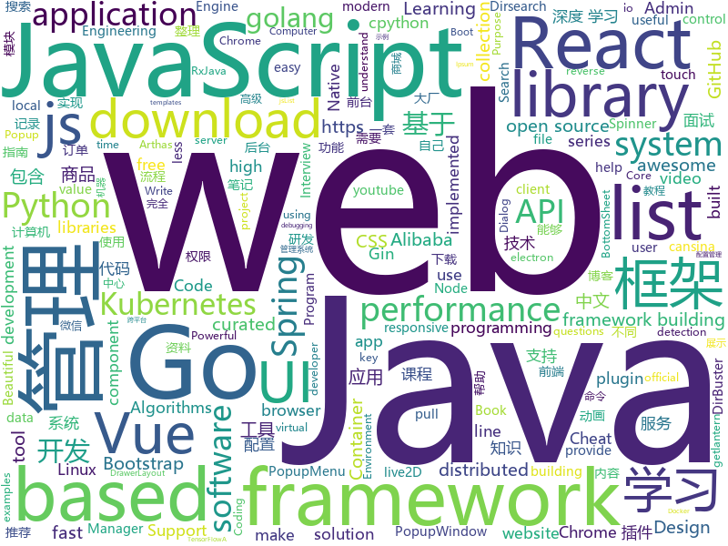

# 2019-05-01
See what the GitHub community is most excited about today.

## python
* [Python](https://github.com/TheAlgorithms/Python)(**1,154 stars today**): All Algorithms implemented in Python
* [stackprinter](https://github.com/cknd/stackprinter)(**177 stars today**): Debugging-friendly tracebacks for Python
* [PySnooper](https://github.com/cool-RR/PySnooper)(**165 stars today**): Never use print for debugging again
* [pydockenv](https://github.com/se7entyse7en/pydockenv)(**136 stars today**): Python virtual environment, but backed by Docker!
* [dirmap](https://github.com/H4ckForJob/dirmap)(**122 stars today**): An advanced web directory scanning tool that will be more powerful than DirBuster, Dirsearch, cansina, and Yu Jian.一个高级web目录扫描工具，功能将会强于DirBuster、Dirsearch、cansina、御剑。
* [Python-100-Days](https://github.com/jackfrued/Python-100-Days)(**89 stars today**): Python - 100天从新手到大师
* [AiLearning](https://github.com/apachecn/AiLearning)(**77 stars today**): AiLearning: 机器学习 - MachineLearning - ML、深度学习 - DeepLearning - DL、自然语言处理 NLP
* [modDetective](https://github.com/itsKindred/modDetective)(**72 stars today**): modDetective is a small Python tool that chronologizes files based on modification time in order to investigate recent system activity.
* [system-design-primer](https://github.com/donnemartin/system-design-primer)(**62 stars today**): Learn how to design large-scale systems. Prep for the system design interview. Includes Anki flashcards.
* [models](https://github.com/tensorflow/models)(**49 stars today**): Models and examples built with TensorFlow
* [awesome-python](https://github.com/vinta/awesome-python)(**56 stars today**): A curated list of awesome Python frameworks, libraries, software and resources
* [primer](https://github.com/Helpsypoo/primer)(**57 stars today**): code that makes videos for this: youtube.com/c/primerlearning
* [manim](https://github.com/3b1b/manim)(**56 stars today**): Animation engine for explanatory math videos
* [keras](https://github.com/keras-team/keras)(**49 stars today**): Deep Learning for humans
* [youtube-dl](https://github.com/ytdl-org/youtube-dl)(**50 stars today**): Command-line program to download videos from YouTube.com and other video sites
* [ChromeAppHeroes](https://github.com/zhaoolee/ChromeAppHeroes)(**53 stars today**): 🌈谷粒-Chrome插件英雄榜, 为优秀的Chrome插件写一本中文说明书, 让Chrome插件英雄们造福人类~ ChromePluginHeroes, Write a Chinese manual for the excellent Chrome plugin, let the Chrome plugin heroes benefit the human~
* [public-apis](https://github.com/toddmotto/public-apis)(**48 stars today**): A collective list of free APIs for use in software and web development.
* [CheatSheetSeries](https://github.com/OWASP/CheatSheetSeries)(**45 stars today**): The OWASP Cheat Sheet Series was created to provide a concise collection of high value information on specific application security topics.
* [wxrobot](https://github.com/pig6/wxrobot)(**39 stars today**): 基于python的微信机器人
* [faceswap](https://github.com/deepfakes/faceswap)(**42 stars today**): Non official project based on original /r/Deepfakes thread. Many thanks to him!
* [home-assistant](https://github.com/home-assistant/home-assistant)(**38 stars today**): 🏡Open source home automation that puts local control and privacy first
* [lemur](https://github.com/Netflix/lemur)(**41 stars today**): Repository for the Lemur Certificate Manager
* [koalas](https://github.com/databricks/koalas)(**40 stars today**): Koalas: Pandas API on Apache Spark
* [flask](https://github.com/pallets/flask)(**37 stars today**): The Python micro framework for building web applications.
* [django](https://github.com/django/django)(****): The Web framework for perfectionists with deadlines.

## java
* [JavaGuide](https://github.com/Snailclimb/JavaGuide)(**174 stars today**): 【Java学习+面试指南】 一份涵盖大部分Java程序员所需要掌握的核心知识。
* [CS-Notes](https://github.com/CyC2018/CS-Notes)(**170 stars today**): 📚技术面试必备基础知识
* [DoraemonKit](https://github.com/didi/DoraemonKit)(**179 stars today**): 简称 "DoKit" 。一款功能齐全的客户端（ iOS 、Android ）研发助手，你值得拥有。
* [skywalking](https://github.com/apache/skywalking)(**123 stars today**): APM, Application Performance Monitoring System
* [advanced-java](https://github.com/doocs/advanced-java)(**107 stars today**): 😮互联网 Java 工程师进阶知识完全扫盲
* [Java](https://github.com/TheAlgorithms/Java)(**101 stars today**): All Algorithms implemented in Java
* [ZXBlog](https://github.com/ZXZxin/ZXBlog)(**73 stars today**): 记录各种学习笔记(算法、Java、数据库、并发......)
* [UI2018](https://github.com/zincPower/UI2018)(**77 stars today**): 安卓高级UI代码整理和博客代码Demo
* [mall](https://github.com/macrozheng/mall)(**64 stars today**): mall项目是一套电商系统，包括前台商城系统及后台管理系统，基于SpringBoot+MyBatis实现。 前台商城系统包含首页门户、商品推荐、商品搜索、商品展示、购物车、订单流程、会员中心、客户服务、帮助中心等模块。 后台管理系统包含商品管理、订单管理、会员管理、促销管理、运营管理、内容管理、统计报表、财务管理、权限管理、设置等模块。
* [XPopup](https://github.com/li-xiaojun/XPopup)(**65 stars today**): 🔥功能强大，UI简洁，交互优雅的通用弹窗！可以替代Dialog，PopupWindow，PopupMenu，BottomSheet，DrawerLayout，Spinner等组件，自带十几种效果良好的动画， 支持完全的UI和动画自定义！(Powerful and Beautiful Popup，can absolutely replace Dialog，PopupWindow，PopupMenu，BottomSheet，DrawerLayout，Spinner. With built-in animators , very easy to custom popup view.)
* [RxJava2-Operators-Sample](https://github.com/KunMinX/RxJava2-Operators-Sample)(**63 stars today**): 你用不惯 RxJava，只因缺了这把钥匙🔑You are not used to RxJava, just because of the lack of this key.
* [spring-cloud-alibaba](https://github.com/spring-cloud-incubator/spring-cloud-alibaba)(**51 stars today**): Spring Cloud Alibaba provides a one-stop solution for application development for the distributed solutions of Alibaba middleware.
* [spring-boot](https://github.com/spring-projects/spring-boot)(**42 stars today**): Spring Boot
* [apollo](https://github.com/ctripcorp/apollo)(**47 stars today**): Apollo（阿波罗）是携程框架部门研发的分布式配置中心，能够集中化管理应用不同环境、不同集群的配置，配置修改后能够实时推送到应用端，并且具备规范的权限、流程治理等特性，适用于微服务配置管理场景。
* [spring-boot-examples](https://github.com/ityouknow/spring-boot-examples)(**43 stars today**): about learning Spring Boot via examples. Spring Boot 教程、技术栈示例代码，快速简单上手教程。
* [tutorials](https://github.com/eugenp/tutorials)(**27 stars today**): The "REST With Spring" Course:
* [arthas](https://github.com/alibaba/arthas)(**45 stars today**): Alibaba Java Diagnostic Tool Arthas/Alibaba Java诊断利器Arthas
* [seata](https://github.com/seata/seata)(**46 stars today**): 🔥Seata is an easy-to-use, high-performance, java based, open source distributed transaction solution.
* [proxyee-down](https://github.com/proxyee-down-org/proxyee-down)(**43 stars today**): http下载工具，基于http代理，支持多连接分块下载
* [ghidra](https://github.com/NationalSecurityAgency/ghidra)(**43 stars today**): Ghidra is a software reverse engineering (SRE) framework
* [spring-framework](https://github.com/spring-projects/spring-framework)(**35 stars today**): Spring Framework
* [elasticsearch](https://github.com/elastic/elasticsearch)(**35 stars today**): Open Source, Distributed, RESTful Search Engine
* [JCSprout](https://github.com/crossoverJie/JCSprout)(**34 stars today**): 👨‍🎓Java Core Sprout : basic, concurrent, algorithm
* [guava](https://github.com/google/guava)(**31 stars today**): Google core libraries for Java
* [incubator-dubbo](https://github.com/apache/incubator-dubbo)(**29 stars today**): Apache Dubbo (incubating) is a high-performance, java based, open source RPC framework.

## unknown
* [Data-Science--Cheat-Sheet](https://github.com/abhat222/Data-Science--Cheat-Sheet)(**505 stars today**): Cheat Sheets
* [support.996.ICU](https://github.com/MSWorkers/support.996.ICU)(**214 stars today**): Microsoft and GitHub Workers Support 996.ICU
* [golang-developer-roadmap-cn](https://github.com/Quorafind/golang-developer-roadmap-cn)(**190 stars today**): 在 2019 成为一名 Go 开发者的路线图。为学习 Go 的人而准备。
* [commit-messages-guide](https://github.com/RomuloOliveira/commit-messages-guide)(**124 stars today**): A guide to understand the importance of commit messages and how to write them well
* [996action](https://github.com/CPdogson/996action)(**119 stars today**): 
* [golang-developer-roadmap](https://github.com/Alikhll/golang-developer-roadmap)(**106 stars today**): Roadmap to becoming a Go developer in 2019
* [free-programming-books](https://github.com/EbookFoundation/free-programming-books)(**74 stars today**): 📚Freely available programming books
* [You-Dont-Know-JS](https://github.com/getify/You-Dont-Know-JS)(**79 stars today**): A book series on JavaScript. @YDKJS on twitter.
* [gitignore](https://github.com/github/gitignore)(**60 stars today**): A collection of useful .gitignore templates
* [free-programming-books-zh_CN](https://github.com/justjavac/free-programming-books-zh_CN)(**76 stars today**): 📚免费的计算机编程类中文书籍，欢迎投稿
* [DeepLearning-500-questions](https://github.com/scutan90/DeepLearning-500-questions)(**65 stars today**): 深度学习500问，以问答形式对常用的概率知识、线性代数、机器学习、深度学习、计算机视觉等热点问题进行阐述，以帮助自己及有需要的读者。 全书分为18个章节，50余万字。由于水平有限，书中不妥之处恳请广大读者批评指正。 未完待续............ 如有意合作，联系scutjy2015@163.com 版权所有，违权必究 Tan 2018.06
* [awesome](https://github.com/sindresorhus/awesome)(**71 stars today**): 😎Awesome lists about all kinds of interesting topics
* [resilience-engineering](https://github.com/lorin/resilience-engineering)(**72 stars today**): Resilience Engineering Notes
* [git-tips](https://github.com/521xueweihan/git-tips)(**61 stars today**): Git的奇技淫巧
* [CPython-Internals](https://github.com/zpoint/CPython-Internals)(**69 stars today**): Dive into cpython internal, trying to illustrate every detail of cpython implementation | cpython源码阅读笔记, 多图展示底层实现细节
* [Weekly-FE-Interview](https://github.com/airuikun/Weekly-FE-Interview)(**45 stars today**): 每周十道前端大厂面试题，并收集大家在大厂面试中遇到的难题，一起共同成长。
* [coding-interview-university](https://github.com/jwasham/coding-interview-university)(**43 stars today**): A complete computer science study plan to become a software engineer.
* [SJTU-Courses](https://github.com/CoolPhilChen/SJTU-Courses)(**43 stars today**): 上海交通大学课程资料分享
* [trackerslist](https://github.com/ngosang/trackerslist)(**41 stars today**): An updated list of public BitTorrent trackers
* [Awesome_Computer_Vision](https://github.com/ahong007007/Awesome_Computer_Vision)(**40 stars today**): Awesome Computer Vision
* [SODsurvey](https://github.com/wenguanwang/SODsurvey)(**38 stars today**): Salient Object Detection in the Deep Learning Era: An In-Depth Survey
* [architect-awesome](https://github.com/xingshaocheng/architect-awesome)(**34 stars today**): 后端架构师技术图谱
* [awesome-vue](https://github.com/vuejs/awesome-vue)(**37 stars today**): 🎉A curated list of awesome things related to Vue.js
* [reactjs-interview-questions](https://github.com/sudheerj/reactjs-interview-questions)(**37 stars today**): List of top 500 ReactJS Interview Questions & Answers....Coding exercise questions are coming soon!!
* [hosts](https://github.com/googlehosts/hosts)(**31 stars today**): 镜像：https://coding.net/u/scaffrey/p/hosts/git

## javascript
* [uppy](https://github.com/transloadit/uppy)(**396 stars today**): The next open source file uploader for web browsers🐶
* [leetcode](https://github.com/azl397985856/leetcode)(**252 stars today**): leetcode题解，记录自己的leecode解题之路。
* [svelte](https://github.com/sveltejs/svelte)(**238 stars today**): Cybernetically enhanced web apps
* [shepherd](https://github.com/shipshapecode/shepherd)(**214 stars today**): Guide your users through a tour of your app
* [pastel](https://github.com/vadimdemedes/pastel)(**190 stars today**): 🎨Framework for effortlessly building Ink apps
* [SOUL](https://github.com/soul-lang/SOUL)(**157 stars today**): The SOUL programming language and API
* [tool](https://github.com/Louiszhai/tool)(**136 stars today**): 开发效率提升：Mac生产力工具链推荐
* [vue](https://github.com/vuejs/vue)(**116 stars today**): 🖖Vue.js is a progressive, incrementally-adoptable JavaScript framework for building UI on the web.
* [react](https://github.com/facebook/react)(**88 stars today**): A declarative, efficient, and flexible JavaScript library for building user interfaces.
* [react-use-gesture](https://github.com/react-spring/react-use-gesture)(**83 stars today**): 👇Bread n butter utility for component-tied mouse/touch gestures in React
* [libpku](https://github.com/lib-pku/libpku)(**70 stars today**): 贵校课程资料民间整理
* [30-seconds-of-code](https://github.com/30-seconds/30-seconds-of-code)(**72 stars today**): A curated collection of useful JavaScript snippets that you can understand in 30 seconds or less.
* [NeteaseCloudMusicApi](https://github.com/Binaryify/NeteaseCloudMusicApi)(**69 stars today**): 网易云音乐 Node.js API service
* [mini-github](https://github.com/kezhenxu94/mini-github)(**60 stars today**): GitHub WeChat Mini Program (可能是功能最全的 GitHub 微信小程序)
* [bootstrap](https://github.com/twbs/bootstrap)(**51 stars today**): The most popular HTML, CSS, and JavaScript framework for developing responsive, mobile first projects on the web.
* [Motrix](https://github.com/agalwood/Motrix)(**58 stars today**): A full-featured download manager.
* [react-native](https://github.com/facebook/react-native)(**50 stars today**): A framework for building native apps with React.
* [javascript-algorithms](https://github.com/trekhleb/javascript-algorithms)(**51 stars today**): 📝Algorithms and data structures implemented in JavaScript with explanations and links to further readings
* [node](https://github.com/nodejs/node)(**46 stars today**): Node.js JavaScript runtime✨🐢🚀✨
* [ink](https://github.com/vadimdemedes/ink)(**53 stars today**): 🌈React for interactive command-line apps
* [axios](https://github.com/axios/axios)(**50 stars today**): Promise based HTTP client for the browser and node.js
* [storybook](https://github.com/storybooks/storybook)(**47 stars today**): UI component dev & test: React, Vue, Angular, React Native, Ember, Web Components & more!
* [Sortable](https://github.com/SortableJS/Sortable)(**49 stars today**): Sortable — is a JavaScript library for reorderable drag-and-drop lists on modern browsers and touch devices. No jQuery required. Supports Meteor, AngularJS, React, Polymer, Vue, Knockout and any CSS library, e.g. Bootstrap.
* [uni-app](https://github.com/dcloudio/uni-app)(**48 stars today**): 使用 Vue.js 开发跨平台应用的前端框架
* [reach-ui](https://github.com/reach/reach-ui)(**47 stars today**): The Accessible Foundation for React Apps and Design Systems.

## html
* [linux-command](https://github.com/jaywcjlove/linux-command)(**266 stars today**): Linux命令大全搜索工具，内容包含Linux命令手册、详解、学习、搜集。https://git.io/linux
* [zju-icicles](https://github.com/QSCTech/zju-icicles)(**56 stars today**): 浙江大学课程攻略共享计划
* [water.css](https://github.com/kognise/water.css)(**38 stars today**): A just-add-css collection of styles to make simple websites just a little nicer
* [front-end-handbook-2019](https://github.com/FrontendMasters/front-end-handbook-2019)(**33 stars today**): [Book] 2019 edition of our front-end development handbook
* [design-tips](https://github.com/caneco/design-tips)(**25 stars today**): The “🔥Design Tips” series, now in TailwindCSS
* [javascript-cheatsheet](https://github.com/wilfredinni/javascript-cheatsheet)(**23 stars today**): Basic Javascript Cheat Sheet
* [transition](https://github.com/youngwoon/transition)(**23 stars today**): Official code for the paper "Learning Transition Policies for Composing Complex Skills" (ICLR 2019)
* [IsometricSass](https://github.com/MorganCaron/IsometricSass)(**23 stars today**): Sass library to make isometric 2D without javascript
* [engrafo](https://github.com/arxiv-vanity/engrafo)(**20 stars today**): Convert LaTeX documents into beautiful responsive web pages using LaTeXML.
* [AdminLTE](https://github.com/ColorlibHQ/AdminLTE)(**15 stars today**): AdminLTE - Free Premium Admin control Panel Theme Based On Bootstrap 3.x
* [portainer](https://github.com/portainer/portainer)(**17 stars today**): Simple management UI for Docker
* [en.javascript.info](https://github.com/javascript-tutorial/en.javascript.info)(**15 stars today**): Modern JavaScript Tutorial
* [watchme](https://github.com/vsoch/watchme)(**13 stars today**): Reproducible watchers for research
* [Spoon-Knife](https://github.com/octocat/Spoon-Knife)(****): This repo is for demonstration purposes only.
* [personal-website](https://github.com/github/personal-website)(**9 stars today**): Code that'll help you kickstart a personal website that showcases your work as a software developer.
* [BTCO](https://github.com/LF112/BTCO)(**12 stars today**): 🎉宝塔面板响应式解决方案
* [Elf](https://github.com/fguby/Elf)(**12 stars today**): 使用electron和live2D开发的类似桌面精灵的应用（A desktop application developed using electron and live2D）
* [fastText](https://github.com/facebookresearch/fastText)(**11 stars today**): Library for fast text representation and classification.
* [mescroll](https://github.com/mescroll/mescroll)(**10 stars today**): 精致的下拉刷新和上拉加载 js框架.支持vue,完美运行于移动端和主流PC浏览器 (JS framework for pull-refresh and pull-up-loading)
* [WebFundamentals](https://github.com/google/WebFundamentals)(**10 stars today**): Best practices for modern web development
* [dropcss](https://github.com/leeoniya/dropcss)(**10 stars today**): An exceptionally fast, thorough and tiny unused-CSS cleaner
* [gentelella](https://github.com/ColorlibHQ/gentelella)(**8 stars today**): Free Bootstrap 3 Admin Template
* [picojs](https://github.com/tehnokv/picojs)(**9 stars today**): A face detection library in 200 lines of JavaScript
* [coreui-free-bootstrap-admin-template](https://github.com/coreui/coreui-free-bootstrap-admin-template)(**8 stars today**): CoreUI is free bootstrap admin template
* [sourcegraph](https://github.com/sourcegraph/sourcegraph)(**9 stars today**): Code search and navigation tool (self-hosted)

## go
* [picsum-photos](https://github.com/DMarby/picsum-photos)(**105 stars today**): Lorem Ipsum... but for photos.
* [go](https://github.com/golang/go)(**91 stars today**): The Go programming language
* [kratos](https://github.com/bilibili/kratos)(**83 stars today**): Kratos是bilibili开源的一套Go微服务框架，包含大量微服务相关框架及工具。
* [kubernetes](https://github.com/kubernetes/kubernetes)(**65 stars today**): Production-Grade Container Scheduling and Management
* [termshark](https://github.com/gcla/termshark)(**69 stars today**): A terminal UI for tshark, inspired by Wireshark
* [sshcode](https://github.com/cdr/sshcode)(**66 stars today**): Run VS Code on any server over SSH.
* [footloose](https://github.com/weaveworks/footloose)(**64 stars today**): Container Machines - Containers that look like Virtual Machines
* [awesome-go](https://github.com/avelino/awesome-go)(**52 stars today**): A curated list of awesome Go frameworks, libraries and software
* [wormhole](https://github.com/gravitational/wormhole)(**54 stars today**): Wireguard based overlay network CNI plugin for kubernetes
* [the-way-to-go_ZH_CN](https://github.com/Unknwon/the-way-to-go_ZH_CN)(**44 stars today**): 《The Way to Go》中文译本，中文正式名《Go 入门指南》
* [komiser](https://github.com/mlabouardy/komiser)(**50 stars today**): AWS Environment Inspector👮
* [dexon](https://github.com/dexon-foundation/dexon)(**47 stars today**): Official golang DEXON fullnode implementation
* [frp](https://github.com/fatedier/frp)(**41 stars today**): A fast reverse proxy to help you expose a local server behind a NAT or firewall to the internet.
* [k3s](https://github.com/rancher/k3s)(**42 stars today**): Lightweight Kubernetes. 5 less than k8s.
* [gin](https://github.com/gin-gonic/gin)(**39 stars today**): Gin is a HTTP web framework written in Go (Golang). It features a Martini-like API with much better performance -- up to 40 times faster. If you need smashing performance, get yourself some Gin.
* [drone](https://github.com/drone/drone)(**37 stars today**): Drone is a Container-Native, Continuous Delivery Platform
* [go-download](https://github.com/monkeyWie/go-download)(**37 stars today**): A fast download client,support HTTP&P2P.
* [k3os](https://github.com/rancher/k3os)(**34 stars today**): Purpose built OS for Kubernetes and fully managed by Kubernetes.
* [websocket](https://github.com/nhooyr/websocket)(**34 stars today**): A minimal and idiomatic WebSocket library for Go
* [etcd](https://github.com/etcd-io/etcd)(**28 stars today**): Distributed reliable key-value store for the most critical data of a distributed system
* [hugo](https://github.com/gohugoio/hugo)(**32 stars today**): The world’s fastest framework for building websites.
* [build-web-application-with-golang](https://github.com/astaxie/build-web-application-with-golang)(**28 stars today**): A golang ebook intro how to build a web with golang
* [lantern](https://github.com/getlantern/lantern)(**27 stars today**): 🔴蓝灯最新版本下载 https://github.com/getlantern/download🔴Lantern Latest Download https://github.com/getlantern/download🔴
* [mdblog](https://github.com/BroQiang/mdblog)(**28 stars today**): 用来显示 markdown 文档的，基于 gin 框架的， go 语言开发的博客
* [helm](https://github.com/helm/helm)(**23 stars today**): The Kubernetes Package Manager

## WordCloud

