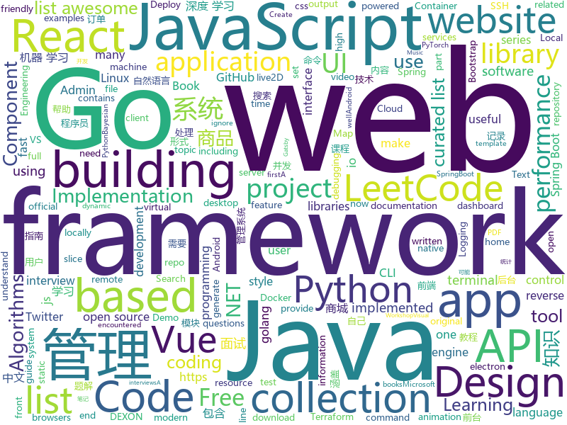

# 2019-05-04
See what the GitHub community is most excited about today.

## python
* [Python](https://github.com/TheAlgorithms/Python)(**517 stars today**): All Algorithms implemented in Python
* [botorch](https://github.com/pytorch/botorch)(**122 stars today**): Bayesian optimization in PyTorch
* [PySnooper](https://github.com/cool-RR/PySnooper)(**112 stars today**): Never use print for debugging again
* [AiLearning](https://github.com/apachecn/AiLearning)(**95 stars today**): AiLearning: 机器学习 - MachineLearning - ML、深度学习 - DeepLearning - DL、自然语言处理 NLP
* [DeepSwarm](https://github.com/Pattio/DeepSwarm)(**86 stars today**): Neural Architecture Search Powered by Swarm Intelligence🐜
* [black](https://github.com/python/black)(**67 stars today**): The uncompromising Python code formatter
* [system-design-primer](https://github.com/donnemartin/system-design-primer)(**53 stars today**): Learn how to design large-scale systems. Prep for the system design interview. Includes Anki flashcards.
* [models](https://github.com/tensorflow/models)(**35 stars today**): Models and examples built with TensorFlow
* [home-assistant](https://github.com/home-assistant/home-assistant)(**44 stars today**): 🏡Open source home automation that puts local control and privacy first
* [awesome-python](https://github.com/vinta/awesome-python)(**42 stars today**): A curated list of awesome Python frameworks, libraries, software and resources
* [alibi](https://github.com/SeldonIO/alibi)(**41 stars today**): Algorithms for monitoring and explaining machine learning models
* [youtube-dl](https://github.com/ytdl-org/youtube-dl)(**38 stars today**): Command-line program to download videos from YouTube.com and other video sites
* [keras](https://github.com/keras-team/keras)(**34 stars today**): Deep Learning for humans
* [stackprinter](https://github.com/cknd/stackprinter)(**38 stars today**): Debugging-friendly tracebacks for Python
* [CodingInterviews](https://github.com/jayshah19949596/CodingInterviews)(**36 stars today**): This repository contains coding interviews that I have encountered in company interviews
* [public-apis](https://github.com/toddmotto/public-apis)(**33 stars today**): A collective list of free APIs for use in software and web development.
* [manim](https://github.com/3b1b/manim)(**36 stars today**): Animation engine for explanatory math videos
* [fast-autoaugment](https://github.com/KakaoBrain/fast-autoaugment)(**35 stars today**): Official Implementation of 'Fast AutoAugment' in PyTorch.
* [twint](https://github.com/twintproject/twint)(**32 stars today**): An advanced Twitter scraping & OSINT tool written in Python that doesn't use Twitter's API, allowing you to scrape a user's followers, following, Tweets and more while evading most API limitations.
* [mypy](https://github.com/python/mypy)(**34 stars today**): Optional static typing for Python 3 and 2 (PEP 484)
* [ridge_map](https://github.com/ColCarroll/ridge_map)(**31 stars today**): Ridge plots of ridges
* [pydockenv](https://github.com/se7entyse7en/pydockenv)(**32 stars today**): Python virtual environment, but backed by Docker!
* [faceswap](https://github.com/deepfakes/faceswap)(**25 stars today**): Non official project based on original /r/Deepfakes thread. Many thanks to him!
* [Vulmap](https://github.com/vulmon/Vulmap)(**26 stars today**): Vulmap Online Local Vulnerability Scanners Project
* [CheatSheetSeries](https://github.com/OWASP/CheatSheetSeries)(**28 stars today**): The OWASP Cheat Sheet Series was created to provide a concise collection of high value information on specific application security topics.

## java
* [CS-Notes](https://github.com/CyC2018/CS-Notes)(**121 stars today**): 📚技术面试必备基础知识、Leetcode 题解、后端面试、Java 面试、春招、秋招、操作系统、计算机网络、系统设计
* [bento](https://github.com/Yelp/bento)(**98 stars today**): A delicious framework for building modularized Android user interfaces, by Yelp.
* [JavaGuide](https://github.com/Snailclimb/JavaGuide)(**73 stars today**): 【Java学习+面试指南】 一份涵盖大部分Java程序员所需要掌握的核心知识。
* [advanced-java](https://github.com/doocs/advanced-java)(**62 stars today**): 😮互联网 Java 工程师进阶知识完全扫盲：涵盖高并发、分布式、高可用、微服务等领域知识
* [mall](https://github.com/macrozheng/mall)(**50 stars today**): mall项目是一套电商系统，包括前台商城系统及后台管理系统，基于SpringBoot+MyBatis实现。 前台商城系统包含首页门户、商品推荐、商品搜索、商品展示、购物车、订单流程、会员中心、客户服务、帮助中心等模块。 后台管理系统包含商品管理、订单管理、会员管理、促销管理、运营管理、内容管理、统计报表、财务管理、权限管理、设置等模块。
* [spring-boot-examples](https://github.com/ityouknow/spring-boot-examples)(**51 stars today**): about learning Spring Boot via examples. Spring Boot 教程、技术栈示例代码，快速简单上手教程。
* [Java](https://github.com/TheAlgorithms/Java)(**46 stars today**): All Algorithms implemented in Java
* [flogger](https://github.com/google/flogger)(**52 stars today**): A Fluent Logging API for Java
* [ghidra](https://github.com/NationalSecurityAgency/ghidra)(**47 stars today**): Ghidra is a software reverse engineering (SRE) framework
* [spring-boot](https://github.com/spring-projects/spring-boot)(**35 stars today**): Spring Boot
* [elasticsearch](https://github.com/elastic/elasticsearch)(**34 stars today**): Open Source, Distributed, RESTful Search Engine
* [ZXBlog](https://github.com/ZXZxin/ZXBlog)(**31 stars today**): 记录各种学习笔记(算法、Java、数据库、并发......)
* [java-design-patterns](https://github.com/iluwatar/java-design-patterns)(**33 stars today**): Design patterns implemented in Java
* [halo](https://github.com/halo-dev/halo)(**27 stars today**): ✍ Halo 可能是最好的 Java 博客系统
* [hutool](https://github.com/looly/hutool)(**28 stars today**): A set of tools that keep Java sweet.
* [tutorials](https://github.com/eugenp/tutorials)(**16 stars today**): The "REST With Spring" Course:
* [INFILTRATE2019](https://github.com/0xAlexei/INFILTRATE2019)(**26 stars today**): INFILTRATE 2019 Demo Materials
* [interviews](https://github.com/kdn251/interviews)(**19 stars today**): Everything you need to know to get the job.
* [HanLP](https://github.com/hankcs/HanLP)(**16 stars today**): 自然语言处理 中文分词 词性标注 命名实体识别 依存句法分析 新词发现 关键词短语提取 自动摘要 文本分类聚类 拼音简繁
* [litemall](https://github.com/linlinjava/litemall)(**14 stars today**): 又一个小商城。litemall = Spring Boot后端 + Vue管理员前端 + 微信小程序用户前端 + Vue用户移动端
* [guava](https://github.com/google/guava)(**14 stars today**): Google core libraries for Java
* [DoraemonKit](https://github.com/didi/DoraemonKit)(**16 stars today**): 简称 "DoKit" 。一款功能齐全的客户端（ iOS 、Android ）研发助手，你值得拥有。
* [spring-framework](https://github.com/spring-projects/spring-framework)(**12 stars today**): Spring Framework
* [quarkus](https://github.com/quarkusio/quarkus)(**15 stars today**): Quarkus: Supersonic Subatomic Java.
* [mit-deep-learning-book-pdf](https://github.com/janishar/mit-deep-learning-book-pdf)(**15 stars today**): MIT Deep Learning Book in PDF format (complete and parts) by Ian Goodfellow, Yoshua Bengio and Aaron Courville

## unknown
* [Data-Science--Cheat-Sheet](https://github.com/abhat222/Data-Science--Cheat-Sheet)(**258 stars today**): Cheat Sheets
* [LeetCodeAnimation](https://github.com/MisterBooo/LeetCodeAnimation)(**166 stars today**): Demonstrate all the questions on LeetCode in the form of animation.（用动画的形式呈现解LeetCode题目的思路）
* [commit-messages-guide](https://github.com/RomuloOliveira/commit-messages-guide)(**164 stars today**): A guide to understand the importance of commit messages and how to write them well
* [AndroidAppRE](https://github.com/maddiestone/AndroidAppRE)(**145 stars today**): Android App Reverse Engineering Workshop
* [vscode-remote-release](https://github.com/Microsoft/vscode-remote-release)(**112 stars today**): Visual Studio Code Remote Development: Open any folder in WSL, in a Docker container, or on a remote machine using SSH and take advantage of VS Code's full feature set.
* [You-Dont-Know-JS](https://github.com/getify/You-Dont-Know-JS)(**52 stars today**): A book series on JavaScript. @YDKJS on twitter.
* [awesome](https://github.com/sindresorhus/awesome)(**53 stars today**): 😎Awesome lists about all kinds of interesting topics
* [gitignore](https://github.com/github/gitignore)(**37 stars today**): A collection of useful .gitignore templates
* [app-ideas](https://github.com/florinpop17/app-ideas)(**50 stars today**): A Collection of application ideas which can be used to improve your coding skills.
* [ui-libraries](https://github.com/jefflombard/ui-libraries)(**52 stars today**): A collection of UI Frameworks and their platform implementations.
* [golang-developer-roadmap](https://github.com/Alikhll/golang-developer-roadmap)(**47 stars today**): Roadmap to becoming a Go developer in 2019
* [free-programming-books](https://github.com/EbookFoundation/free-programming-books)(**43 stars today**): 📚Freely available programming books
* [support.996.ICU](https://github.com/MSWorkers/support.996.ICU)(**45 stars today**): Microsoft and GitHub Workers Support 996.ICU
* [go-bible](https://github.com/jakescript/go-bible)(**44 stars today**): another list of some useful GoLang resources we should all pass on :)
* [project-based-learning](https://github.com/tuvtran/project-based-learning)(**34 stars today**): Curated list of project-based tutorials
* [git-tips](https://github.com/521xueweihan/git-tips)(**33 stars today**): Git的奇技淫巧
* [trackerslist](https://github.com/ngosang/trackerslist)(**31 stars today**): An updated list of public BitTorrent trackers
* [the-art-of-command-line](https://github.com/jlevy/the-art-of-command-line)(**27 stars today**): Master the command line, in one page
* [DeepLearning-500-questions](https://github.com/scutan90/DeepLearning-500-questions)(**22 stars today**): 深度学习500问，以问答形式对常用的概率知识、线性代数、机器学习、深度学习、计算机视觉等热点问题进行阐述，以帮助自己及有需要的读者。 全书分为18个章节，50余万字。由于水平有限，书中不妥之处恳请广大读者批评指正。 未完待续............ 如有意合作，联系scutjy2015@163.com 版权所有，违权必究 Tan 2018.06
* [pumpkin-book](https://github.com/datawhalechina/pumpkin-book)(**25 stars today**): 《机器学习》（西瓜书）公式推导解析，在线阅读地址：https://datawhalechina.github.io/pumpkin-book
* [styleguides](https://github.com/SAP/styleguides)(**26 stars today**): This repository provides SAP style guides for coding.
* [awesome-for-beginners](https://github.com/MunGell/awesome-for-beginners)(**25 stars today**): A list of awesome beginners-friendly projects.
* [awesome-vue](https://github.com/vuejs/awesome-vue)(**24 stars today**): 🎉A curated list of awesome things related to Vue.js
* [hosts](https://github.com/googlehosts/hosts)(**21 stars today**): 镜像：https://coding.net/u/scaffrey/p/hosts/git
* [awesome-public-datasets](https://github.com/awesomedata/awesome-public-datasets)(**20 stars today**): A topic-centric list of HQ open datasets. PR ☛☛☛

## javascript
* [leetcode](https://github.com/azl397985856/leetcode)(**325 stars today**): leetcode题解，记录自己的leetcode解题之路。
* [use-http](https://github.com/alex-cory/use-http)(**203 stars today**): 🐶React hook for making isomorphic http requests
* [UnblockNeteaseMusic](https://github.com/nondanee/UnblockNeteaseMusic)(**175 stars today**): Revive unavailable songs for Netease Cloud Music
* [nodebestpractices](https://github.com/i0natan/nodebestpractices)(**143 stars today**): ✅The largest Node.js best practices list (April 2019)
* [svelte](https://github.com/sveltejs/svelte)(**134 stars today**): Cybernetically enhanced web apps
* [libpku](https://github.com/lib-pku/libpku)(**98 stars today**): 贵校课程资料民间整理
* [response](https://github.com/monzo/response)(**104 stars today**): Monzo's real-time incident response and reporting tool⚡️
* [vue](https://github.com/vuejs/vue)(**98 stars today**): 🖖Vue.js is a progressive, incrementally-adoptable JavaScript framework for building UI on the web.
* [pastel](https://github.com/vadimdemedes/pastel)(**89 stars today**): 🎨Framework for effortlessly building Ink apps
* [ipfs-deploy](https://github.com/agentofuser/ipfs-deploy)(**84 stars today**): Zero-Config CLI to Deploy Static Websites to IPFS
* [uppy](https://github.com/transloadit/uppy)(**81 stars today**): The next open source file uploader for web browsers🐶
* [react](https://github.com/facebook/react)(**70 stars today**): A declarative, efficient, and flexible JavaScript library for building user interfaces.
* [empathy-driven-development](https://github.com/marcysutton/empathy-driven-development)(**75 stars today**): Demo Gatsby app for a #noSlides talk on debugging and building accessible React apps
* [awesome-selfhosted](https://github.com/Kickball/awesome-selfhosted)(**66 stars today**): This is a list of Free Software network services and web applications which can be hosted locally. Selfhosting is the process of locally hosting and managing applications instead of renting from SaaS providers.
* [javascript](https://github.com/airbnb/javascript)(**53 stars today**): JavaScript Style Guide
* [30-seconds-of-code](https://github.com/30-seconds/30-seconds-of-code)(**53 stars today**): A curated collection of useful JavaScript snippets that you can understand in 30 seconds or less.
* [storybook](https://github.com/storybooks/storybook)(**51 stars today**): UI component dev & test: React, Vue, Angular, React Native, Ember, Web Components & more!
* [javascript-algorithms](https://github.com/trekhleb/javascript-algorithms)(**47 stars today**): 📝Algorithms and data structures implemented in JavaScript with explanations and links to further readings
* [bootstrap](https://github.com/twbs/bootstrap)(**39 stars today**): The most popular HTML, CSS, and JavaScript framework for developing responsive, mobile first projects on the web.
* [vrs](https://github.com/zeit/vrs)(**48 stars today**): A serverless virtual reality e-commerce experience powered by Now v2
* [create-react-app](https://github.com/facebook/create-react-app)(**42 stars today**): Set up a modern web app by running one command.
* [Motrix](https://github.com/agalwood/Motrix)(**46 stars today**): A full-featured download manager.
* [baseui](https://github.com/uber-web/baseui)(**46 stars today**): A React Component library implementing the Base design language
* [shimport](https://github.com/Rich-Harris/shimport)(**44 stars today**): Use JavaScript modules in all browsers, including dynamic imports
* [react-native](https://github.com/facebook/react-native)(**42 stars today**): A framework for building native apps with React.

## html
* [Python-100-Days](https://github.com/jackfrued/Python-100-Days)(**790 stars today**): Python - 100天从新手到大师
* [linux-command](https://github.com/jaywcjlove/linux-command)(**116 stars today**): Linux命令大全搜索工具，内容包含Linux命令手册、详解、学习、搜集。https://git.io/linux
* [zju-icicles](https://github.com/QSCTech/zju-icicles)(**41 stars today**): 浙江大学课程攻略共享计划
* [watchme](https://github.com/vsoch/watchme)(**32 stars today**): Reproducible watchers for research
* [impatient-js-zh](https://github.com/apachecn/impatient-js-zh)(**25 stars today**): 📖[译] 写给不耐烦程序员的 JavaScript
* [AdminLTE](https://github.com/ColorlibHQ/AdminLTE)(**21 stars today**): AdminLTE - Free Premium Admin control Panel Theme Based On Bootstrap 3.x
* [water.css](https://github.com/kognise/water.css)(**19 stars today**): A just-add-css collection of styles to make simple websites just a little nicer
* [design-tips](https://github.com/caneco/design-tips)(**18 stars today**): The “🔥Design Tips” series, now in TailwindCSS
* [IsometricSass](https://github.com/MorganCaron/IsometricSass)(**16 stars today**): Sass library to make isometric 2D without javascript
* [Front-end-Developer-Interview-Questions](https://github.com/h5bp/Front-end-Developer-Interview-Questions)(**15 stars today**): A list of helpful front-end related questions you can use to interview potential candidates, test yourself or completely ignore.
* [front-end-handbook-2019](https://github.com/FrontendMasters/front-end-handbook-2019)(**12 stars today**): [Book] 2019 edition of our front-end development handbook
* [fastText](https://github.com/facebookresearch/fastText)(**12 stars today**): Library for fast text representation and classification.
* [Elf](https://github.com/fguby/Elf)(**12 stars today**): 使用electron和live2D开发的类似桌面精灵的应用（A desktop application developed using electron and live2D）
* [gentelella](https://github.com/ColorlibHQ/gentelella)(**8 stars today**): Free Bootstrap 3 Admin Template
* [Spoon-Knife](https://github.com/octocat/Spoon-Knife)(****): This repo is for demonstration purposes only.
* [polymer](https://github.com/Polymer/polymer)(**10 stars today**): Our original Web Component library.
* [hugo-academic](https://github.com/gcushen/hugo-academic)(**9 stars today**): The website builder for Hugo. Build and deploy a beautiful website in minutes🚀
* [expressjs.com](https://github.com/expressjs/expressjs.com)(**9 stars today**): 
* [django-admin-material](https://github.com/lorenzomorandini/django-admin-material)(**9 stars today**): A Django Admin interface based on Material Design by Google
* [Home-Assistant-Config](https://github.com/JamesMcCarthy79/Home-Assistant-Config)(**8 stars today**): Home Assistant Configuration & Documentation for my Smart House.
* [en.javascript.info](https://github.com/javascript-tutorial/en.javascript.info)(**7 stars today**): Modern JavaScript Tutorial
* [swagger-codegen](https://github.com/swagger-api/swagger-codegen)(**8 stars today**): swagger-codegen contains a template-driven engine to generate documentation, API clients and server stubs in different languages by parsing your OpenAPI / Swagger definition.
* [CLRS](https://github.com/walkccc/CLRS)(**7 stars today**): 📚Solutions to Introduction to Algorithms Third Edition
* [dotnet](https://github.com/Microsoft/dotnet)(**7 stars today**): This repo is the official home of .NET on GitHub. It's a great starting point to find many .NET OSS projects from Microsoft and the community, including many that are part of the .NET Foundation.
* [all-contributors](https://github.com/all-contributors/all-contributors)(**7 stars today**): ✨Recognize all contributors, not just the ones who push code✨

## go
* [tml](https://github.com/liamg/tml)(**239 stars today**): 🌈💻🎨A tiny markup language for terminal output. Makes formatting output in CLI apps easier!
* [gameboy.live](https://github.com/HFO4/gameboy.live)(**221 stars today**): 🕹️A basic gameboy emulator with terminal "Cloud Gaming" support
* [dexon](https://github.com/dexon-foundation/dexon)(**209 stars today**): Official golang DEXON fullnode implementation
* [termdash](https://github.com/mum4k/termdash)(**158 stars today**): Terminal based dashboard.
* [terraformer](https://github.com/GoogleCloudPlatform/terraformer)(**147 stars today**): CLI tool to generate terraform files from existing infrastructure (reverse Terraform).
* [dexon-consensus](https://github.com/dexon-foundation/dexon-consensus)(**116 stars today**): DEXON consensus Implementation & Simulation
* [pie](https://github.com/elliotchance/pie)(**60 stars today**): 🍕Enjoy a slice! A utility library for dealing with slices and maps that focuses on type safety and performance.
* [go](https://github.com/golang/go)(**54 stars today**): The Go programming language
* [awesome-go](https://github.com/avelino/awesome-go)(**50 stars today**): A curated list of awesome Go frameworks, libraries and software
* [sshcode](https://github.com/cdr/sshcode)(**42 stars today**): Run VS Code on any server over SSH.
* [kubernetes](https://github.com/kubernetes/kubernetes)(**33 stars today**): Production-Grade Container Scheduling and Management
* [termshark](https://github.com/gcla/termshark)(**35 stars today**): A terminal UI for tshark, inspired by Wireshark
* [hugo](https://github.com/gohugoio/hugo)(**32 stars today**): The world’s fastest framework for building websites.
* [syncmap](https://github.com/a8m/syncmap)(**32 stars today**): A typed implementation of the Go sync.Map using code generation.
* [wails](https://github.com/wailsapp/wails)(**29 stars today**): Create desktop apps using Go and Web Technologies
* [rook](https://github.com/rook/rook)(**27 stars today**): Storage Orchestration for Kubernetes
* [k3d](https://github.com/rancher/k3d)(**26 stars today**): Little helper to run Rancher Lab's k3s in Docker
* [wtf](https://github.com/wtfutil/wtf)(**26 stars today**): The personal information dashboard for your terminal.
* [istio](https://github.com/istio/istio)(**24 stars today**): Connect, secure, control, and observe services.
* [zap](https://github.com/uber-go/zap)(**25 stars today**): Blazing fast, structured, leveled logging in Go.
* [beego](https://github.com/astaxie/beego)(**25 stars today**): beego is an open-source, high-performance web framework for the Go programming language.
* [the-way-to-go_ZH_CN](https://github.com/Unknwon/the-way-to-go_ZH_CN)(**22 stars today**): 《The Way to Go》中文译本，中文正式名《Go 入门指南》
* [popeye](https://github.com/derailed/popeye)(**23 stars today**): 🧭 A Kubernetes cluster resource sanitizer
* [redis-tui](https://github.com/mylxsw/redis-tui)(**22 stars today**): A Redis Text-based UI client in CLI
* [gin](https://github.com/gin-gonic/gin)(**21 stars today**): Gin is a HTTP web framework written in Go (Golang). It features a Martini-like API with much better performance -- up to 40 times faster. If you need smashing performance, get yourself some Gin.

## WordCloud

