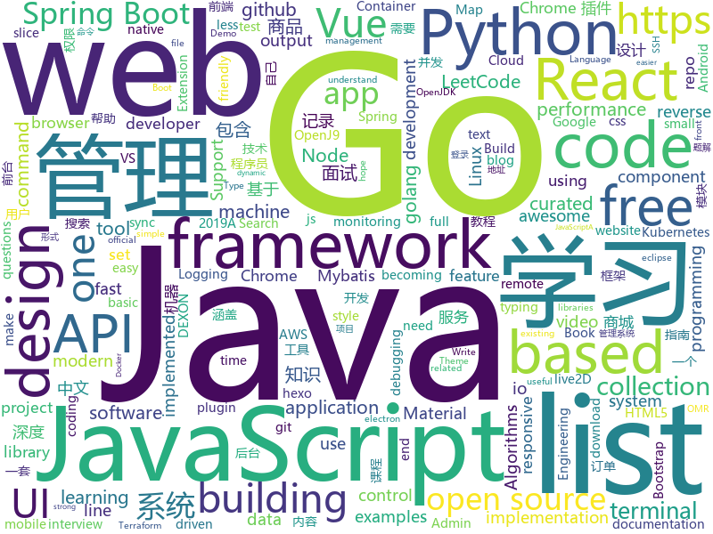

# 2019-05-05
See what the GitHub community is most excited about today.

## python
* [Python](https://github.com/TheAlgorithms/Python)(**428 stars today**): All Algorithms implemented in Python
* [gpt-2](https://github.com/openai/gpt-2)(**80 stars today**): Code for the paper "Language Models are Unsupervised Multitask Learners"
* [PySnooper](https://github.com/cool-RR/PySnooper)(**87 stars today**): Never use print for debugging again
* [youtube-dl](https://github.com/ytdl-org/youtube-dl)(**60 stars today**): Command-line program to download videos from YouTube.com and other video sites
* [AiLearning](https://github.com/apachecn/AiLearning)(**50 stars today**): AiLearning: 机器学习 - MachineLearning - ML、深度学习 - DeepLearning - DL、自然语言处理 NLP
* [system-design-primer](https://github.com/donnemartin/system-design-primer)(**51 stars today**): Learn how to design large-scale systems. Prep for the system design interview. Includes Anki flashcards.
* [tvm](https://github.com/pytorch/tvm)(**51 stars today**): TVM integration into PyTorch
* [DeepSwarm](https://github.com/Pattio/DeepSwarm)(**46 stars today**): Neural Architecture Search Powered by Swarm Intelligence🐜
* [faceswap](https://github.com/deepfakes/faceswap)(**37 stars today**): Non official project based on original /r/Deepfakes thread. Many thanks to him!
* [alibi](https://github.com/SeldonIO/alibi)(**44 stars today**): Algorithms for monitoring and explaining machine learning models
* [keras](https://github.com/keras-team/keras)(**37 stars today**): Deep Learning for humans
* [botorch](https://github.com/pytorch/botorch)(**42 stars today**): Bayesian optimization in PyTorch
* [home-assistant](https://github.com/home-assistant/home-assistant)(**32 stars today**): 🏡Open source home automation that puts local control and privacy first
* [gpt-2-output-dataset](https://github.com/openai/gpt-2-output-dataset)(**37 stars today**): Dataset of GPT-2 outputs for research in detection, biases, and more
* [spectral_inference_networks](https://github.com/deepmind/spectral_inference_networks)(**40 stars today**): Implementation of Spectral Inference Networks, ICLR 2019
* [models](https://github.com/tensorflow/models)(**26 stars today**): Models and examples built with TensorFlow
* [ChromeAppHeroes](https://github.com/zhaoolee/ChromeAppHeroes)(**36 stars today**): 🌈谷粒-Chrome插件英雄榜, 为优秀的Chrome插件写一本中文说明书, 让Chrome插件英雄们造福人类~ ChromePluginHeroes, Write a Chinese manual for the excellent Chrome plugin, let the Chrome plugin heroes benefit the human~
* [poetry](https://github.com/sdispater/poetry)(**34 stars today**): Python dependency management and packaging made easy.
* [face_recognition](https://github.com/ageitgey/face_recognition)(**28 stars today**): The world's simplest facial recognition api for Python and the command line
* [public-apis](https://github.com/toddmotto/public-apis)(**29 stars today**): A collective list of free APIs for use in software and web development.
* [cpython](https://github.com/python/cpython)(**23 stars today**): The Python programming language
* [black](https://github.com/python/black)(**31 stars today**): The uncompromising Python code formatter
* [awesome-python-applications](https://github.com/mahmoud/awesome-python-applications)(**30 stars today**): 💿Free software that works great, and also happens to be open-source Python.
* [django](https://github.com/django/django)(**23 stars today**): The Web framework for perfectionists with deadlines.
* [mypy](https://github.com/python/mypy)(**28 stars today**): Optional static typing for Python 3 and 2 (PEP 484)

## java
* [manifold](https://github.com/manifold-systems/manifold)(**168 stars today**): Manifold re-energizes Java with powerful features like Type-safe Metaprogramming, Structural Typing, and Extension Methods.
* [CS-Notes](https://github.com/CyC2018/CS-Notes)(**124 stars today**): 📚技术面试必备基础知识、Leetcode 题解、后端面试、Java 面试、春招、秋招、操作系统、计算机网络、系统设计
* [JavaGuide](https://github.com/Snailclimb/JavaGuide)(**85 stars today**): 【Java学习+面试指南】 一份涵盖大部分Java程序员所需要掌握的核心知识。
* [Java](https://github.com/TheAlgorithms/Java)(**51 stars today**): All Algorithms implemented in Java
* [advanced-java](https://github.com/doocs/advanced-java)(**47 stars today**): 😮互联网 Java 工程师进阶知识完全扫盲：涵盖高并发、分布式、高可用、微服务等领域知识
* [mall](https://github.com/macrozheng/mall)(**35 stars today**): mall项目是一套电商系统，包括前台商城系统及后台管理系统，基于SpringBoot+MyBatis实现。 前台商城系统包含首页门户、商品推荐、商品搜索、商品展示、购物车、订单流程、会员中心、客户服务、帮助中心等模块。 后台管理系统包含商品管理、订单管理、会员管理、促销管理、运营管理、内容管理、统计报表、财务管理、权限管理、设置等模块。
* [INFILTRATE2019](https://github.com/0xAlexei/INFILTRATE2019)(**39 stars today**): INFILTRATE 2019 Demo Materials
* [hope-boot](https://github.com/hope-for/hope-boot)(**38 stars today**): 基于Spring Boot 2.x开发 整合：Spring Boot 2.x/Apache Shiro+JWT/Spring Data JPA+Mybatis+Tk.Mybatis+PageHelper/Redis/Flyway/Swagger/SSO/Thymeleaf 动态权限管理 AES+MD5+盐加解密 代码生成 日志记录 Google验证码登录 单点登录 项目地址：https://github.com/hope-for/hope-boot 主语言[java]
* [hutool](https://github.com/looly/hutool)(**32 stars today**): A set of tools that keep Java sweet.
* [tutorials](https://github.com/eugenp/tutorials)(**21 stars today**): The "REST With Spring" Course:
* [spring-boot-examples](https://github.com/ityouknow/spring-boot-examples)(**28 stars today**): about learning Spring Boot via examples. Spring Boot 教程、技术栈示例代码，快速简单上手教程。
* [ghidra](https://github.com/NationalSecurityAgency/ghidra)(**31 stars today**): Ghidra is a software reverse engineering (SRE) framework
* [spring-boot](https://github.com/spring-projects/spring-boot)(**20 stars today**): Spring Boot
* [halo](https://github.com/halo-dev/halo)(**23 stars today**): ✍ Halo 可能是最好的 Java 博客系统
* [java-design-patterns](https://github.com/iluwatar/java-design-patterns)(**22 stars today**): Design patterns implemented in Java
* [openj9](https://github.com/eclipse/openj9)(**24 stars today**): Eclipse OpenJ9: A Java Virtual Machine for OpenJDK that's optimized for small footprint, fast start-up, and high throughput. Builds on Eclipse OMR (https://github.com/eclipse/omr) and combines with the Extensions for OpenJDK for OpenJ9 repo.
* [interviews](https://github.com/kdn251/interviews)(**21 stars today**): Everything you need to know to get the job.
* [ZXBlog](https://github.com/ZXZxin/ZXBlog)(**21 stars today**): 记录各种学习笔记(算法、Java、数据库、并发......)
* [elasticsearch](https://github.com/elastic/elasticsearch)(**18 stars today**): Open Source, Distributed, RESTful Search Engine
* [flogger](https://github.com/google/flogger)(**19 stars today**): A Fluent Logging API for Java
* [spring-framework](https://github.com/spring-projects/spring-framework)(**12 stars today**): Spring Framework
* [material-components-android](https://github.com/material-components/material-components-android)(**19 stars today**): Modular and customizable Material Design UI components for Android
* [JCSprout](https://github.com/crossoverJie/JCSprout)(**17 stars today**): 👨‍🎓Java Core Sprout : basic, concurrent, algorithm
* [skywalking](https://github.com/apache/skywalking)(**15 stars today**): APM, Application Performance Monitoring System
* [litemall](https://github.com/linlinjava/litemall)(**15 stars today**): 又一个小商城。litemall = Spring Boot后端 + Vue管理员前端 + 微信小程序用户前端 + Vue用户移动端

## unknown
* [LeetCodeAnimation](https://github.com/MisterBooo/LeetCodeAnimation)(**204 stars today**): Demonstrate all the questions on LeetCode in the form of animation.（用动画的形式呈现解LeetCode题目的思路）
* [industry-machine-learning](https://github.com/firmai/industry-machine-learning)(**107 stars today**): A curated list of applied machine learning and data science notebooks and libraries accross different industries.
* [vscode-remote-release](https://github.com/Microsoft/vscode-remote-release)(**67 stars today**): Visual Studio Code Remote Development: Open any folder in WSL, in a Docker container, or on a remote machine using SSH and take advantage of VS Code's full feature set.
* [developer-roadmap](https://github.com/kamranahmedse/developer-roadmap)(**59 stars today**): Roadmap to becoming a web developer in 2019
* [commit-messages-guide](https://github.com/RomuloOliveira/commit-messages-guide)(**61 stars today**): A guide to understand the importance of commit messages and how to write them well
* [gitignore](https://github.com/github/gitignore)(**38 stars today**): A collection of useful .gitignore templates
* [app-ideas](https://github.com/florinpop17/app-ideas)(**53 stars today**): A Collection of application ideas which can be used to improve your coding skills.
* [awesome](https://github.com/sindresorhus/awesome)(**52 stars today**): 😎Awesome lists about all kinds of interesting topics
* [golang-developer-roadmap](https://github.com/Alikhll/golang-developer-roadmap)(**52 stars today**): Roadmap to becoming a Go developer in 2019
* [You-Dont-Know-JS](https://github.com/getify/You-Dont-Know-JS)(**38 stars today**): A book series on JavaScript. @YDKJS on twitter.
* [AndroidAppRE](https://github.com/maddiestone/AndroidAppRE)(**43 stars today**): Android App Reverse Engineering Workshop
* [support.996.ICU](https://github.com/MSWorkers/support.996.ICU)(**38 stars today**): Microsoft and GitHub Workers Support 996.ICU
* [aws_breaking_changes](https://github.com/SummitRoute/aws_breaking_changes)(**39 stars today**): List of changes announced for AWS that may break existing code
* [free-programming-books](https://github.com/EbookFoundation/free-programming-books)(**34 stars today**): 📚Freely available programming books
* [trackerslist](https://github.com/ngosang/trackerslist)(**34 stars today**): An updated list of public BitTorrent trackers
* [git-tips](https://github.com/521xueweihan/git-tips)(**32 stars today**): Git的奇技淫巧
* [DeepLearning-500-questions](https://github.com/scutan90/DeepLearning-500-questions)(**25 stars today**): 深度学习500问，以问答形式对常用的概率知识、线性代数、机器学习、深度学习、计算机视觉等热点问题进行阐述，以帮助自己及有需要的读者。 全书分为18个章节，50余万字。由于水平有限，书中不妥之处恳请广大读者批评指正。 未完待续............ 如有意合作，联系scutjy2015@163.com 版权所有，违权必究 Tan 2018.06
* [hosts](https://github.com/googlehosts/hosts)(**24 stars today**): 镜像：https://coding.net/u/scaffrey/p/hosts/git
* [project-based-learning](https://github.com/tuvtran/project-based-learning)(**24 stars today**): Curated list of project-based tutorials
* [pumpkin-book](https://github.com/datawhalechina/pumpkin-book)(**23 stars today**): 《机器学习》（西瓜书）公式推导解析，在线阅读地址：https://datawhalechina.github.io/pumpkin-book
* [the-art-of-command-line](https://github.com/jlevy/the-art-of-command-line)(**24 stars today**): Master the command line, in one page
* [golang-developer-roadmap-cn](https://github.com/Quorafind/golang-developer-roadmap-cn)(**21 stars today**): 在 2019 成为一名 Go 开发者的路线图。为学习 Go 的人而准备。
* [awesome-vue](https://github.com/vuejs/awesome-vue)(**18 stars today**): 🎉A curated list of awesome things related to Vue.js
* [ui-libraries](https://github.com/jefflombard/ui-libraries)(**20 stars today**): A collection of UI Frameworks and their platform implementations.
* [gfwlist](https://github.com/gfwlist/gfwlist)(**18 stars today**): The one and only one gfwlist here

## javascript
* [leetcode](https://github.com/azl397985856/leetcode)(**315 stars today**): leetcode题解，记录自己的leetcode解题之路。
* [response](https://github.com/monzo/response)(**141 stars today**): Monzo's real-time incident response and reporting tool⚡️
* [UnblockNeteaseMusic](https://github.com/nondanee/UnblockNeteaseMusic)(**137 stars today**): Revive unavailable songs for Netease Cloud Music
* [nodebestpractices](https://github.com/i0natan/nodebestpractices)(**120 stars today**): ✅The largest Node.js best practices list (April 2019)
* [libpku](https://github.com/lib-pku/libpku)(**110 stars today**): 贵校课程资料民间整理
* [svelte](https://github.com/sveltejs/svelte)(**98 stars today**): Cybernetically enhanced web apps
* [react](https://github.com/facebook/react)(**58 stars today**): A declarative, efficient, and flexible JavaScript library for building user interfaces.
* [sql.js](https://github.com/kripken/sql.js)(**63 stars today**): SQLite compiled to JavaScript through Emscripten
* [vue](https://github.com/vuejs/vue)(**57 stars today**): 🖖Vue.js is a progressive, incrementally-adoptable JavaScript framework for building UI on the web.
* [use-http](https://github.com/alex-cory/use-http)(**52 stars today**): 🐶React hook for making isomorphic http requests
* [30-seconds-of-code](https://github.com/30-seconds/30-seconds-of-code)(**44 stars today**): A curated collection of useful JavaScript snippets that you can understand in 30 seconds or less.
* [ArtPlayer](https://github.com/zhw2590582/ArtPlayer)(**46 stars today**): 🎨ArtPlayer is a modern HTML5 video player
* [Motrix](https://github.com/agalwood/Motrix)(**43 stars today**): A full-featured download manager.
* [javascript](https://github.com/airbnb/javascript)(**41 stars today**): JavaScript Style Guide
* [bootstrap](https://github.com/twbs/bootstrap)(**32 stars today**): The most popular HTML, CSS, and JavaScript framework for developing responsive, mobile first projects on the web.
* [uppy](https://github.com/transloadit/uppy)(**43 stars today**): The next open source file uploader for web browsers🐶
* [create-react-app](https://github.com/facebook/create-react-app)(**39 stars today**): Set up a modern web app by running one command.
* [empathy-driven-development](https://github.com/marcysutton/empathy-driven-development)(**41 stars today**): Demo Gatsby app for a #noSlides talk on debugging and building accessible React apps
* [shimport](https://github.com/Rich-Harris/shimport)(**40 stars today**): Use JavaScript modules in all browsers, including dynamic imports
* [react-native](https://github.com/facebook/react-native)(**37 stars today**): A framework for building native apps with React.
* [hassio-google-drive-backup](https://github.com/sabeechen/hassio-google-drive-backup)(**38 stars today**): Automatically create and sync Hass.io snapshots into Google Drive
* [storybook](https://github.com/storybooks/storybook)(**33 stars today**): UI component dev & test: React, Vue, Angular, React Native, Ember, Web Components & more!
* [axios](https://github.com/axios/axios)(**33 stars today**): Promise based HTTP client for the browser and node.js
* [puppeteer](https://github.com/GoogleChrome/puppeteer)(**31 stars today**): Headless Chrome Node API
* [relay](https://github.com/facebook/relay)(**32 stars today**): Relay is a JavaScript framework for building data-driven React applications.

## html
* [Python-100-Days](https://github.com/jackfrued/Python-100-Days)(**850 stars today**): Python - 100天从新手到大师
* [linux-command](https://github.com/jaywcjlove/linux-command)(**102 stars today**): Linux命令大全搜索工具，内容包含Linux命令手册、详解、学习、搜集。https://git.io/linux
* [zju-icicles](https://github.com/QSCTech/zju-icicles)(**34 stars today**): 浙江大学课程攻略共享计划
* [impatient-js-zh](https://github.com/apachecn/impatient-js-zh)(**28 stars today**): 📖[译] 写给不耐烦程序员的 JavaScript
* [water.css](https://github.com/kognise/water.css)(**21 stars today**): A just-add-css collection of styles to make simple websites just a little nicer
* [front-end-handbook-2019](https://github.com/FrontendMasters/front-end-handbook-2019)(**19 stars today**): [Book] 2019 edition of our front-end development handbook
* [Elf](https://github.com/fguby/Elf)(**15 stars today**): 使用electron和live2D开发的类似桌面精灵的应用（A desktop application developed using electron and live2D）
* [Front-end-Developer-Interview-Questions](https://github.com/h5bp/Front-end-Developer-Interview-Questions)(**14 stars today**): A list of helpful front-end related questions you can use to interview potential candidates, test yourself or completely ignore.
* [en.javascript.info](https://github.com/javascript-tutorial/en.javascript.info)(**12 stars today**): Modern JavaScript Tutorial
* [AdminLTE](https://github.com/ColorlibHQ/AdminLTE)(**8 stars today**): AdminLTE - Free Premium Admin control Panel Theme Based On Bootstrap 3.x
* [watchme](https://github.com/vsoch/watchme)(**11 stars today**): Reproducible watchers for research
* [free-for-dev](https://github.com/ripienaar/free-for-dev)(**8 stars today**): A list of SaaS, PaaS and IaaS offerings that have free tiers of interest to devops and infradev
* [Spoon-Knife](https://github.com/octocat/Spoon-Knife)(****): This repo is for demonstration purposes only.
* [public-sans](https://github.com/uswds/public-sans)(**7 stars today**): A strong, neutral, principles-driven, open source typeface for text or display
* [fastText](https://github.com/facebookresearch/fastText)(**6 stars today**): Library for fast text representation and classification.
* [all-contributors](https://github.com/all-contributors/all-contributors)(**6 stars today**): ✨Recognize all contributors, not just the ones who push code✨
* [portainer](https://github.com/portainer/portainer)(**6 stars today**): Simple management UI for Docker
* [coreui-free-bootstrap-admin-template](https://github.com/coreui/coreui-free-bootstrap-admin-template)(**6 stars today**): CoreUI is free bootstrap admin template
* [Home-Assistant-Config](https://github.com/JamesMcCarthy79/Home-Assistant-Config)(**6 stars today**): Home Assistant Configuration & Documentation for my Smart House.
* [qiubaiying.github.io](https://github.com/qiubaiying/qiubaiying.github.io)(****): BY Blog ->
* [speedtest](https://github.com/adolfintel/speedtest)(**5 stars today**): Self-hosted HTML5 Speedtest. Easy setup, examples, configurable, responsive and mobile friendly. Supports PHP, Node, and more.
* [hexo-theme-matery](https://github.com/blinkfox/hexo-theme-matery)(**5 stars today**): A beautiful hexo blog theme with material design and responsive design.一个基于材料设计和响应式设计而成的全面、美观的Hexo主题。
* [devops-essentials-sample-app](https://github.com/linuxacademy/devops-essentials-sample-app)(****): 
* [patchwork](https://github.com/jlord/patchwork)(****): All the Git-it Workshop completers!
* [website](https://github.com/kubernetes/website)(****): Kubernetes website and documentation repo:

## go
* [komiser](https://github.com/mlabouardy/komiser)(**283 stars today**): AWS Environment Inspector👮
* [dexon](https://github.com/dexon-foundation/dexon)(**235 stars today**): Official golang DEXON fullnode implementation
* [terraformer](https://github.com/GoogleCloudPlatform/terraformer)(**150 stars today**): CLI tool to generate terraform files from existing infrastructure (reverse Terraform).
* [gameboy.live](https://github.com/HFO4/gameboy.live)(**139 stars today**): 🕹️A basic gameboy emulator with terminal "Cloud Gaming" support
* [tml](https://github.com/liamg/tml)(**122 stars today**): 🌈💻🎨A tiny markup language for terminal output. Makes formatting output in CLI apps easier!
* [termdash](https://github.com/mum4k/termdash)(**96 stars today**): Terminal based dashboard.
* [auxpi](https://github.com/aimerforreimu/auxpi)(**85 stars today**): 🍭集合多家 API 的新一代图床
* [dexon-consensus](https://github.com/dexon-foundation/dexon-consensus)(**57 stars today**): DEXON consensus Implementation & Simulation
* [pie](https://github.com/elliotchance/pie)(**48 stars today**): 🍕Enjoy a slice! A utility library for dealing with slices and maps that focuses on type safety and performance.
* [go](https://github.com/golang/go)(**38 stars today**): The Go programming language
* [jsonschema](https://github.com/alecthomas/jsonschema)(**40 stars today**): Generate JSON Schemas from Go types
* [kubernetes](https://github.com/kubernetes/kubernetes)(**28 stars today**): Production-Grade Container Scheduling and Management
* [awesome-go](https://github.com/avelino/awesome-go)(**30 stars today**): A curated list of awesome Go frameworks, libraries and software
* [the-way-to-go_ZH_CN](https://github.com/Unknwon/the-way-to-go_ZH_CN)(**25 stars today**): 《The Way to Go》中文译本，中文正式名《Go 入门指南》
* [termshark](https://github.com/gcla/termshark)(**27 stars today**): A terminal UI for tshark, inspired by Wireshark
* [k3s](https://github.com/rancher/k3s)(**25 stars today**): Lightweight Kubernetes. 5 less than k8s.
* [istio](https://github.com/istio/istio)(**23 stars today**): Connect, secure, control, and observe services.
* [syncmap](https://github.com/a8m/syncmap)(**25 stars today**): A typed implementation of the Go sync.Map using code generation.
* [sshcode](https://github.com/cdr/sshcode)(**24 stars today**): Run VS Code on any server over SSH.
* [build-web-application-with-golang](https://github.com/astaxie/build-web-application-with-golang)(**21 stars today**): A golang ebook intro how to build a web with golang
* [gin](https://github.com/gin-gonic/gin)(**20 stars today**): Gin is a HTTP web framework written in Go (Golang). It features a Martini-like API with much better performance -- up to 40 times faster. If you need smashing performance, get yourself some Gin.
* [tinygo](https://github.com/tinygo-org/tinygo)(**19 stars today**): Go compiler for small places. Microcontrollers, WebAssembly, and command-line tools. Based on LLVM.
* [kratos](https://github.com/bilibili/kratos)(**17 stars today**): Kratos是bilibili开源的一套Go微服务框架，包含大量微服务相关框架及工具。
* [zap](https://github.com/uber-go/zap)(**17 stars today**): Blazing fast, structured, leveled logging in Go.
* [gorm](https://github.com/jinzhu/gorm)(**16 stars today**): The fantastic ORM library for Golang, aims to be developer friendly

## WordCloud

